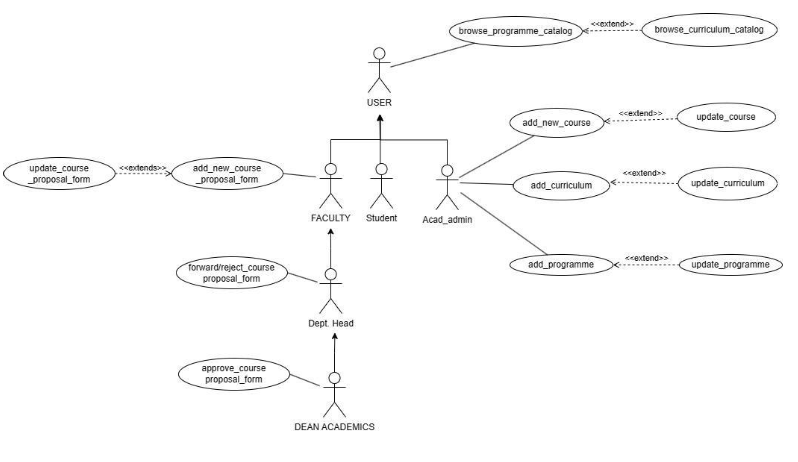

## Programme and Curriculum Management Mobile Application (AC-1)

## Table of Contents
- [User-Centered Design (UCD)](#user-centered-design-ucd)
- [SRS Application](#srs-application)
- [SRS Web Interface](#srs-web-interface)
- [API Specifications](#api-specifications)
- [UI for Application](#ui-for-application)
- [UI for Web](#ui-for-web)
- [Database Schema](#database-schema)

## User-Centered Design (UCD)                     ## [SRS](#srs-application)
 

## SRS Application

### Prepared By: 
- ARPAN KARJEE (21bcs032)
- KANCHANDEEP KAUR (21bcs107)
- MAYUK SARKAR (21bcs132)
- SHIYA SHIVANI (21bcs193)
- UDITI DAS (21bcs232)

**Team Mentor:** ABHIKUMAR GUPTA (21bcs089)

---

## 1. Introduction

#### 1.1 Introduction about the Fusion – A brief Description

FusionIIIT stands as a testament to the seamless integration and automation of diverse functions within PDPM Indian Institute of Information Technology, Design and Manufacturing, Jabalpur. Crafted with precision using Python 3.8 and powered by the Django Web framework, this initiative is a student-driven endeavor designed to elevate the institute's operational landscape. Encompassing everything from efficient administration management to academic prowess and miscellaneous departmental tasks, FusionIIIT is a holistic solution that harmonizes the intricacies of campus life.

Imagine it as a digital wizard that takes care of everything, from organizing the administrative stuff to making academics smoother. It's not just limited to the usual tasks; FusionIIIT jumps into various departments and sections, making sure every corner of campus life runs smoothly.

In the admin side, it handles the complicated paperwork and processes. For academics, it brings a digital touch, making learning and managing courses easier. But it doesn't stop there; FusionIIIT is like a friendly companion for all the different parts of the campus, making sure everything works well.

In simpler terms, FusionIIIT is not just a tool – it's a helpful friend, making life at PDPM IIITDM Jabalpur more organized and enjoyable for everyone.

#### 1.2 Purpose of the module

The primary goals of this application revolve around facilitating the addition of new programs and overseeing the curriculum management process for various academic offerings provided by the Institute. The application aims to empower each program to efficiently update and manage its curriculum, specifically catering to different batches within the program. Through this platform, programs can seamlessly introduce new courses and enhance the educational content for improved academic experiences across multiple batches.

#### 1.2 Scope of the module

The application's scope encompasses the comprehensive range of programs and their respective curriculums offered by the Institute. Users are provided with the capability to seamlessly access and review the curriculum and program requirements relevant to their academic pursuits. Through the application, users can effortlessly navigate and explore the specific curriculum details associated with each program, gaining a clear understanding of the educational components required for successful completion of their chosen academic paths.

---

## 2. User/Actor Characteristics

#### 2.1 User (general)

A general user who can browse the programme and curriculum catalogs to view the available courses and their details.

##### Specific Functionalities:
1. **Browse_programme_catalog**: The user can view the list of programmes offered by the academic institution, along with their details such as duration, eligibility, fees, etc.
2. **Browse_curriculum_catalog**: The user can view the list of curricula for each programme, along with their details such as courses, credits, prerequisites, etc.

#### 2.2 Faculty

A faculty member who can propose new courses or update existing ones, and also approve or forward the proposals to the next level of authority.

##### Specific Functionalities:
1. **Update_course_proposal**: The faculty can modify the details of an existing course proposal, such as title, description, objectives, outcomes, syllabus, etc.
2. **Add_new_course_proposal**: The faculty can create a new course proposal by filling in the required details, such as title, description, objectives, outcomes, syllabus, etc.
3. **Forward_course_proposal**: The faculty can either approve or forward a course proposal to the department head, depending on their role and authority.

#### 2.3 Student

A student who can enroll in courses can browse their courses list but has no direct interaction with the course proposal and approval process.

#### Specific Functionalities:
- Student does not have any additional functionalities; all functionalities of student are covered in the general user.

#### 2.4 Academic Admin

An academic administrator who can add, update, or delete courses, curricula, and programmes in the system, and also assign faculty members to courses.

#### Specific Functionalities:
1. **Add_new_course**: The academic admin can add a new course to the system, based on the approved course proposal.
2. **Update_course**: The academic admin can update the details of an existing course, such as title, description, objectives, outcomes, syllabus, etc.
3. **Add_curriculum**: The academic admin can add a new curriculum to the system, by specifying the courses, credits, prerequisites, etc.
4. **Update_curriculum**: The academic admin can update the details of an existing curriculum, such as courses, credits, prerequisites, etc.
5. **Add_programme**: The academic admin can add a new programme to the system, by specifying the duration, eligibility, fees, curriculum, etc.
6. **Update_programme**: The academic admin can update the details of an existing programme, such as duration, eligibility, fees, curriculum, etc.

#### 2.5 Department Head

A department head who can approve or forward the course proposals to the dean of academics, and also view the status of the proposals.

#### Specific Functionalities:
1. **Approve/forward_course_proposal**: The department head can either approve or forward a course proposal to the dean of academics, depending on their role and authority.
2. **View_course_proposal_status**: The department head can view the status of each course proposal, such as pending, approved, forwarded, rejected, etc.

#### 2.6 Dean of Academics

A dean of academics who can give the final approval for the course proposals, and also view the status of the proposals.

#### Specific Functionalities:
1. **Approve_course_proposal**: The dean of academics can give the final approval for a course proposal, based on their role and authority.
2. **View_course_proposal_status**: The dean of academics can view the status of each course proposal, such as pending, approved, forwarded, rejected, etc.

---

## 3. Functional Requirements

### 3.1 Use Case Diagram

### 3.2 Use Case

### 3.2.1 Browse_programme_catalog

| UC ID   | UC#1 |
|---------|------|
| **Use Case Name** | Browse_programme_catalog |
| **Actor**         | All User |
| **Description**   | The user of the system can browse the available programmes categorically. |
| **Precondition**  | The user must be logged-in. |
| **Main Flow**     | 1. The Actor logs into the system.   2. The Actor then opens the Programme and Curriculum module.   3. The Actor can see the available Programmes the Institute can offer. |
| **Post Condition**| The necessary details of the Programmes are displayed. |

---

### 3.2.2 Browse_curriculum_catalog

| UC ID   | UC#2 |
|---------|------|
| **Use Case Name** | Browse_curriculum_catalog |
| **Actor**         | All User |
| **Description**   | The user of the system can browse the available curriculum categorically. |
| **Precondition**  | The user must be logged-in. |
| **Main Flow**     | 1. The Actor logs into the system.   2. The Actor then opens the Programme and Curriculum module.   3. The Actor selects the desired Programme. [S1]   4. The Actor selects the desired Curriculum.   5. The Actor is now able to see the different Courses available for the different semesters. |
| **Sub Flow**      | S1. Extend 'Browse_programme_catalog' |
| **Post Condition**| The necessary details of the different Curriculums with their courses are displayed. |

---

### 3.2.3 Add_new_course

| UC ID   | UC#3 |
|---------|------|
| **Use Case Name** | Add_new_course |
| **Actor**         | Acad Admin |
| **Description**   | The Acad Admin can add a new course that is not included in the curriculum along with the faculty who will be teaching. |
| **Precondition**  | The Acad Admin must be logged-in. |
| **Main Flow**     | 1. The Actor logs into the system.   2. The Actor then opens the Programme and Curriculum module.   3. Actor clicks on the ‘Add new course’ option.   4. Actor then selects the Programme.   5. Actor enters the course name along with all the meta data like Course code, Faculty name, etc.   6. The Actor can add the syllabus of a particular course.   7. After successfully filling the details, the Actor clicks on Submit. |
| **Post Condition**| The course code is generated and the course is saved in the Database. |

---

### 3.2.4 Update_course

| UC ID   | UC#4 |
|---------|------|
| **Use Case Name** | Update_course |
| **Actor**         | Acad Admin |
| **Description**   | The Acad Admin can update an already added course or the faculty who is teaching a particular course. |
| **Precondition**  | ● The Acad Admin must be logged-in.   ● The Acad Admin must know the code of the course to be updated. |
| **Main Flow**     | 1. The Actor logs into the system.   2. The Actor then opens the Programme and Curriculum module.   3. Actor clicks on the ‘Update course’ option.   4. Acad Admin enters the course code.   5. Acad Admin can update the necessary meta-data of the course.   6. The Acad Admin can update the syllabus of a particular course.   7. After successfully updating the details, the Actor clicks on Submit. |
| **Post Condition**| The course is updated and saved in the Database. |

---

### 3.2.5 Update_curriculum

| UC ID   | UC#5 |
|---------|------|
| **Use Case Name** | Update_curriculum |
| **Actor**         | Acad Admin |
| **Description**   | The Acad Admin can update the curriculum, including the number of credits, number of courses/labs, in each semester for a particular discipline and year. |
| **Precondition**  | ● The Acad Admin receives a notification every 3 to 5 years that the curriculum needs to be updated.   ● The Acad Admin must be logged-in. |
| **Main Flow**     | 1. The Actor logs into the system.   2. The Actor then opens the Programme and Curriculum module.   3. Actor clicks on the ‘Update curriculum’ option.   4. Acad Admin selects the desired Programme.   5. Changes can be made to the number of discipline/elective courses, labs in each Semester, and the academic load of a particular course.   6. After successfully updating the details, click on Submit. [S1][S2] |
| **Sub Flow**      | S1. Include ‘add_new_courses’   S2. Include ‘update_courses’ |
| **Post Condition**| The curriculum is updated and saved in the Database. |

---

### 3.2.6 Add_curriculum

| UC ID   | UC#6 |
|---------|------|
| **Use Case Name** | Add_curriculum |
| **Actor**         | Acad Admin |
| **Description**   | The Acad Admin can add a new curriculum with a new Branch, specifying the number of credits, courses, and labs for each semester. |
| **Precondition**  | The Acad Admin must be logged-in. |
| **Main Flow**     | 1. The Actor logs into the system.   2. The Actor opens the Programme and Curriculum module.   3. The Actor clicks on the ‘Add curriculum’ option.   4. The Actor specifies the number of Semesters.   5. The Actor adds the number of disciplines/elective courses, labs in each Semester, and the academic load of a particular course.   6. After successfully adding the details, click on Submit. [S1][S2] |
| **Sub Flow**      | S1. Include ‘add_new_courses’   S2. Include ‘update_courses’ |
| **Post Condition**| The new curriculum is added to the Database. |

---

### 3.2.7 Add_programme

| UC ID   | UC#7 |
|---------|------|
| **Use Case Name** | Add_programme |
| **Actor**         | Acad Admin |
| **Description**   | The Acad Admin can add a new programme to the list of programmes offered by the Institute. |
| **Precondition**  | The Acad Admin must be logged-in. |
| **Main Flow**     | 1. The Actor logs into the system.   2. The Actor opens the Programme and Curriculum module.   3. The Actor clicks on the ‘Add Programme’ option.   4. The Actor specifies the discipline, batch year, and the number of semesters.   5. The Actor adds the courses, elective courses, and labs for each Semester, along with the academic load of a particular course.   6. After successfully adding the details, click on Submit. [S1] |
| **Sub Flow**      | S1. Include ‘add_curriculum’ |
| **Post Condition**| The programme and curriculum are added to the Database. |

---

### 3.2.8 Update_programme

| UC ID   | UC#7 |
|---------|------|
| **Use Case Name** | Update_programme |
| **Actor**         | Acad Admin |
| **Description**   | The Acad Admin can update a programme offered by the Institute. |
| **Precondition**  | ● The Acad Admin receives a notification whenever the programme needs to be updated.   ● The Acad Admin must be logged-in. |
| **Main Flow**     | 1. The Actor logs into the system.   2. The Actor opens the Programme and Curriculum module.   3. The Actor clicks on the ‘Update Programme’ option.   4. The Acad Admin selects the desired Programme.   5. The Acad Admin can change the required programme or course details.   6. After successfully updating the details, click on Submit. [S1][S2] |
| **Sub Flow**      | S1. Include ‘add_curriculum’ |
| **Post Condition**| The programme and curriculum are updated and saved in the Database. |

## 3.3. Other Functional Requirements
1. This module will make use of the communication module for sending notifications and alerts to various actors involved in the module suitably for course adding, updating , deleting confirmations, rejections, or modifications, etc.
2. Automated email or SMS notifications for Course, Program, Timetables updates, modifications.
3. Alerts for actions to take.

## 3.4 Other Constraints

### 3.4.1 User Interface
Certainly! After successfully logging in, the user will be directed to their personalized home page within the Programme and Curriculum Management Module. The home page will not only showcase the user's profile but will also prominently feature the associated program name, providing immediate visibility to details like BTech/B-Des, M-Tech/M-Des, and more. To proceed further, the user is required to click on a specific program of their choice. This action will navigate them to a new page dedicated to the selected program. On this page, the user will be prompted to input essential details such as branch, batch, semester, and other relevant information. These details are integral as they tailor the curriculum viewing experience to the user's specific academic context, ensuring a more personalized and targeted exploration of the curriculum content.

### 3.4.2 Tech Stack Used
- Flutter
- Django
- Rest api(Django-Rest-Framework)
- SQLite3

## 4. Non- Functional Requirements
### 4.1 Performance:
The system should respond to user interactions quickly.
### 4.2 Scalability:
The system should handle a mass of concurrent users. System performance should be evaluated under increasing load conditions.
### 4.3 Availability:
The system should be available 99.9% of the time.
### 4.4 Security:
Ensure data confidentiality and integrity. Role-based authorization ensures that users can only perform actions relevant to their designated roles.

## 5. Module dependencies with other fusion modules

### 5.1. UI Level
The integration of our module, AC1, is intricately connected with AC2 (Course Registration) and AC3 (Course Management) within the system. Our module serves as the prelude to the overall workflow, establishing a foundational step. It is imperative that users interact with our UI pages before accessing the AC2 and AC3 module pages. Our module, AC1, essentially sets the stage for subsequent processes in the system. Users, upon logging in, must first engage with the UI pages of AC1. This initial interaction provides a crucial context and groundwork for the subsequent actions related to AC2 (Course Registration) and AC3 (Course Management). By ensuring users navigate through our module's UI pages before proceeding to AC2 and AC3, we not only establish a logical sequence in the workflow but also guarantee that users have a comprehensive understanding of the system's functionalities from the outset. This approach enhances user experience and ensures a smooth transition into the course registration and management aspects of the system.

### 5.2 DB Level Dependencies
For the mobile version of AC1, its dependency is currently limited to the (AC2 and AC3) Course Registration and management and Examination modules. The data for our module is sourced from a CSV file, and to enhance the system's efficiency and connectivity, we are actively in the process of developing an API (Application Programming Interface). To facilitate seamless communication between the frontend and backend, we are in the midst of constructing Django Rest Framework (DRF) serializers. These serializers play a pivotal role in transforming complex data types, such as Django model instances, into native Python data types that can be easily rendered into JSON and consumed by the frontend. This approach ensures a standardized and efficient exchange of data between the different components of the system. The integration of DRF serializers is a crucial step in establishing a robust connection between the backend, which fetches data from the CSV file, and the frontend of our module. By adopting this method, we aim to enhance the overall performance, maintainability, and extensibility of our system, ultimately providing a more seamless and responsive experience for mobile users interacting with AC1 and its associated modules.

### 5.3. Module Level Dependencies
The integration of our AC1 module is closely tied to the Notification module and the Authentication module. These modules serve as essential pillars supporting the functionalities within AC1. Additionally, our module currently acts as a dependency for the Course Registration and Examination modules. To delve into the specifics, the Notification module plays a vital role in ensuring effective communication within AC1. It facilitates the delivery of timely alerts, updates, and notifications relevant to the activities and processes encapsulated in our module. Moreover, seamless integration with the Authentication module ensures secure and authorized access, safeguarding the integrity of user interactions within AC1. In terms of dependencies, aside from the overarching reliance on the Notification and Authentication modules, AC1 is currently instrumental in enhancing the workflows of the Course Registration and Examination modules. This interdependence underscores the significance of AC1 as a foundational element in the broader system architecture, playing a key role in shaping the user experience and overall functionality of the integrated modules.

## SRS Web Interface        
## [Go to the top](#table-of-contents)
# Software Requirements Specification for AC-1 (Web Application) Programme and Curriculum

**Prepared by:**
- 21BCS126-Mamidi Ravi Chendraa
- 21BCS066-Chilukuri Surya Manikanta Chowdary
- 21BCS082-G Srinath Reddy
- 21BCS081-Duggireddy Gnana Sainath Reddy
- 21BCS125-Maloth Ritesh Pragnu Naik
- 21BCS197-Shubh Mehta (Student mentor)

**Faculty Mentor:** Dr. Vinod Kumar Jain (Head CSE)

## Table of Contents
1. [Introduction](#1-introduction)  
   1.1 [Introduction about the Fusion](#11-introduction-about-the-fusion)  
   1.2 [Purpose of the Module](#12-purpose-of-the-module)  
   1.3 [Scope of the Module](#13-scope-of-the-module)
2. [User/Actor Description (Characteristics)](#2-useractor-description-characteristics)
3. [Functional Requirements](#3-functional-requirements)  
   3.1 [Use Case Diagram](#31-use-case-diagram)  
   3.2 [Use Case Description](#32-use-case-description)  
   3.3 [Other Functional Requirements](#33-other-functional-requirements)  
   3.4 [Other Constraints](#34-other-constraints)  
   3.4.1 [User Interfaces](#341-user-interfaces)  
   3.4.2 [Software (Tech) Stack Used](#342-software-tech-stack-used)  
   3.4.3 [Business Rules](#343-business-rules)
4. [Non-Functional Requirements](#4-non-functional-requirements)
5. [Module Dependencies with Other Fusion Modules](#5-module-dependencies-with-other-fusion-modules)  
   5.1 [UI Level](#51-ui-level)  
   5.2 [DB Level Dependencies](#52-db-level-dependencies)  
   5.3 [Module Level Dependencies](#53-module-level-dependencies)

## 1. Introduction

### 1.1 Introduction about the Fusion
FusionIIIT stands as a testament to the seamless integration and automation of diverse functions within PDPM Indian Institute of Information Technology, Design and Manufacturing, Jabalpur. Crafted with precision using Python 3.8 and powered by the Django Web framework, this initiative is a student-driven endeavor designed to elevate the institute's operational landscape. Encompassing everything from efficient administration management to academic prowess and miscellaneous departmental tasks, FusionIIIT is a holistic solution that harmonizes the intricacies of campus life.

Imagine it as a digital wizard that takes care of everything, from organizing the administrative stuff to making academics smoother. It's not just limited to the usual tasks; FusionIIIT jumps into various departments and sections, making sure every corner of campus life runs smoothly.

In the admin side, it handles the complicated paperwork and processes. For academics, it brings a digital touch, making learning and managing courses easier. But it doesn't stop there; FusionIIIT is like a friendly companion for all the different parts of the campus, making sure everything works well.

In simpler terms, FusionIIIT is not just a tool – it's a helpful friend, making life at PDPM IIITDM Jabalpur more organized and enjoyable for everyone.

### 1.2 Purpose
The objective of this module is to provide addition of new programmes and effective management of various curriculum for different programmes offered in the institute. Each programme could update its curriculum for respective batch.

This module not only serves the above purpose but in addition to that, viewing the various programmes and curriculums, batches, disciplines offered in the institute is also provided along with viewing timetable and academic calendar too.

### 1.3 Product Scope
The scope of the application covers the entire Programmes & its Curriculums offered by the Institute where the user can view their desired curriculum, programme, discipline and batch, along with academic calendar and timetable.

## 2. User/Actor Description (characteristics)

### 2.1 Student:
Represents individuals who intend to browse program catalog, browsing curriculum catalog.  
**Role:** Can browse program catalog, browse curriculum catalog.  
**Specific Functionalities:**  
- Can search specific programme, curriculum, courses, based on name or discipline.  
- Can view course info in detail.

### 2.2 ACAD ADMINISTRATOR:
Responsible for managing and updating information related to academic program and curriculum.  
**Role:** Add and update programme, curriculum, courses.  
**Specific Functionalities:**  
- Can add or modify the contents of Programme, Curriculum, Courses.

### 2.3 HEAD OF DEPARTMENT:
Represents individuals who are the head of certain departments in the institute.  
**Role:** Same as a User's roles and also forwards or rejects the course proposal form to the Dean of academics.  
**Specific Functionalities:**  
- Forwards/rejects the course proposal form to the dean academics.

### 2.4 DEAN ACADEMICS:
Represents an individual who is a high-ranked academic official and oversees all the major academic operations including curriculum, workloads, approval of courses, evaluating and supervising departments of the institute.  
**Role:** Browse the program catalog, browse the curriculum catalog (same as a generic user) and also approve or reject the course proposal form.  
**Specific Functionalities:**  
- Approves or rejects the course proposal form.

### 2.5 FACULTY:
Represents individuals who can view the current semester courses and can request for course addition/updation.  
**Role:** Browse the program catalog, browse the curriculum catalog, and can apply for addition/modification of a course.  
**Specific Functionalities:**  
- Can apply for addition or modification of courses through the course proposal form.

## 3. Functional Requirements

### 3.1 Use case Diagram

### 3.2 Use Case

Here is the requested information formatted in Markdown:

### 3.2.1 Browse_programme_catalog

| **UCID**             | UC#1                        |
|----------------------|-----------------------------|
| **Use Case Name**     | Browse_programme_catalog     |
| **Actor**            | Student, Acad Admin, HOD, Faculty, Dean |
| **Description**      | The user of the system can browse the available programmes categorically. |
| **Pre Condition**    | The User must be logged-in through their credentials. |
| **Main Flow**        | 1. The Actor logs into the system. 2. The Actor then opens the Programme and Curriculum module. 3. The Actor can see the available Programmes the Institute can offer. [S1] |
| **Sub Flow**         | S1. Extend “browse_curriculum_catalogue”. |
| **Post Condition**   | The necessary details of the Programmes are displayed. |

---

### 3.2.2 Browse_curriculum_catalog

| **UCID**             | UC#2                         |
|----------------------|------------------------------|
| **Use Case Name**     | Browse_curriculum_catalogue   |
| **Actor**            | Student, Acad Admin, HOD, Faculty, Dean |
| **Description**      | The user of the system can browse the available curriculums categorically. |
| **Pre Condition**    | The User must be logged-in through their credentials. |
| **Main Flow**        | 1. The Actor logs into the system. 2. The Actor then opens the Programme and Curriculum module. 3. The Actor then selects the desired programme. 4. The Actor can see the various curriculums for that programme by clicking the curriculum link. |
| **Post Condition**   | The necessary details of the curriculum are displayed. |

---

### 3.2.3 Add_programme

| **UCID**             | UC#3                         |
|----------------------|------------------------------|
| **Use Case Name**     | Add_programme                |
| **Actor**            | Acad Admin                   |
| **Description**      | The Acad Admin can add a new programme that the institute can offer. |
| **Pre Condition**    | The User must be logged-in through their credentials. |
| **Main Flow**        | 1. The User logs into the system. 2. The actor then opens the programme and curriculum module and clicks on the add programme option. [S1] 3. The Actor then adds the discipline, batch year, and the number of semesters. 4. The Actor can add courses/elective courses or labs in each semester, along with the academic load of a particular course. 5. After entering the details, the Actor clicks on Submit. |
| **Sub Flow**         | S1. Extend “update_programme”. |
| **Post Condition**   | The programme is added successfully and saved in the database. The programme needs to be assigned a curriculum and discipline. |

---

### 3.2.4 Update_programme

| **UCID**             | UC#4                         |
|----------------------|------------------------------|
| **Use Case Name**     | Update_programme             |
| **Actor**            | Acad Admin                   |
| **Description**      | The Acad Admin can update a programme that the institute can offer. |
| **Pre Condition**    | The User must be logged-in through their credentials. |
| **Main Flow**        | 1. The User logs into the system. 2. The actor opens the programme and curriculum module and clicks on the update programme option. 3. The Actor makes the desired changes. 4. After updating the details, the Actor clicks on Submit. |
| **Post Condition**   | The programme is updated successfully and saved in the database. |

---

### 3.2.5 Add_new_course_proposal_form

| **UCID**             | UC#5                         |
|----------------------|------------------------------|
| **Use Case Name**     | Add_new_course_proposal_form |
| **Actor**            | Faculty                      |
| **Description**      | The user of the system can apply for the addition or modification of a course. |
| **Pre Condition**    | The User must be logged-in through their credentials. |
| **Main Flow**        | 1. The Actor logs into the system. 2. The Actor opens the programme and curriculum module. 3. The Actor selects the “course proposal form”. 4. The Actor fills in the necessary details and submits the form. [S1] |
| **Sub Flow**         | S1. Extend “update_course_proposal_form”. |
| **Post Condition**   | The form is submitted successfully and forwarded to the respective head of department. |

---

### 3.2.6 Update_course_proposal_form

| **UCID**             | UC#6                         |
|----------------------|------------------------------|
| **Use Case Name**     | Update_course_proposal_form  |
| **Actor**            | Faculty                      |
| **Description**      | The user of the system can apply for the addition or modification of a course. |
| **Pre Condition**    | The User must be logged-in through their credentials. |
| **Main Flow**        | 1. The Actor logs into the system. 2. The Actor opens the programme and curriculum module. 3. The Actor selects “course modification form”. 4. The Actor updates the necessary details and submits the form. |
| **Post Condition**   | The form is submitted successfully and forwarded to the respective head of department. |

---

### 3.2.7 Forward/reject_course_proposal_form

| **UCID**             | UC#7                         |
|----------------------|------------------------------|
| **Use Case Name**     | Forward/reject_course_proposal_form |
| **Actor**            | Head of Department            |
| **Description**      | The user of the system can forward or reject the course addition or modification proposal applied by the faculty. |
| **Pre Condition**    | The User must be logged-in through their credentials. |
| **Main Flow**        | 1. The Actor logs into the system. 2. The Actor opens the notifications module. 3. The Actor checks notifications related to course addition or modification proposals. 4. The Actor verifies and decides to forward or reject. |
| **Post Condition**   | The course proposal form is forwarded to the dean academics for approval or rejected by the Head of Department. |

---

### 3.2.8 Approve/reject_course_proposal_form

| **UCID**             | UC#8                         |
|----------------------|------------------------------|
| **Use Case Name**     | Approve/reject_course_proposal_form |
| **Actor**            | Dean academics                |
| **Description**      | The user of the system can approve or reject the course addition or modification proposal applied by the faculty. |
| **Pre Condition**    | The User must be logged-in through their credentials. |
| **Main Flow**        | 1. The Actor logs into the system. 2. The Actor opens the notifications module. 3. The Actor checks notifications related to course addition or modification proposals. 4. The Actor verifies and decides to approve or reject. |
| **Post Condition**   | The course proposal form is approved and the Acad Admin is notified to add or modify the course. |

---

### 3.2.9 Add_curriculum

| **UCID**             | UC#9                         |
|----------------------|------------------------------|
| **Use Case Name**     | Add_curriculum               |
| **Actor**            | Acad Admin                   |
| **Description**      | The Acad Admin can add a new curriculum. |
| **Pre Condition**    | The User must be logged-in through their credentials. |
| **Main Flow**        | 1. The Actor logs into the system. 2. The Actor opens the Programme and Curriculum module. 3. The Actor clicks on the ‘Add curriculum’ option. 4. The Actor selects disciplines/elective courses, number of semesters, labs in each semester, and the academic load of a particular course. 5. After adding the details, the Actor clicks Submit. [S1] |
| **Sub Flow**         | S1. Extend “update_curriculum”. |
| **Post Condition**   | The new curriculum is added with the mentioned details. |

---

### 3.2.10 Update_curriculum

| **UCID**             | UC#10                        |
|----------------------|------------------------------|
| **Use Case Name**     | Update_curriculum            |
| **Actor**            | Acad Admin                   |
| **Description**      | The user of the system can update the existing course. |
| **Pre Condition**    | The User must be logged-in through their credentials. |
| **Main Flow**        | 1. The Actor logs into the system. 2. The Actor opens the Programme and Curriculum module. 3. The Actor clicks on the “Update curriculum” option. 4. The Actor updates the necessary details. 5. After making the changes, the Actor clicks Submit. |
| **Post Condition**   | An update notification is displayed and the curriculum is successfully updated. |

---

### 3.2.11 Add_new_course

| **UCID**             | UC#11                        |
|----------------------|------------------------------|
| **Use Case Name**     | Add_course                   |
| **Actor**            | Acad Admin                   |
| **Description**      | The user of the system can add new courses. |
| **Pre Condition**    | The User must be logged-in through their credentials. |
| **Main Flow**        | 1. The Actor logs into the system. 2. The Actor opens the Programme and Curriculum module. 3. The Actor clicks on the “Add course” option. 4. The Actor adds the course details. 5. The Actor assigns the course to the curriculum. |
| **Post Condition**   | The new course is successfully added and assigned to the curriculum. |

---

### 3.2.12 Update_course

| **UCID**             | UC#12                        |
|----------------------|------------------------------|
| **Use Case Name**     | Update_course                |
| **Actor**            | Acad Admin                   |
| **Description**      | The user of the system can update existing courses. |
| **Pre Condition**    | The User must be logged-in through their credentials. |
| **Main Flow**        | 1. The Actor logs into the system. 2. The Actor opens the Programme and Curriculum module. 3. The Actor clicks on the “Update course” option. 4. The Actor updates the course details. 5. The Actor clicks Submit after making the necessary changes. |
| **Post Condition**   | The course is updated successfully, and the system reflects the new changes. |

---

## 3.3 Other Functional Requirements:
#### 3.3.1 Search Functionality
#### 3.3.2 Filter and Sort
#### 3.3.3 Integration with other modules like course registration.

## 3.4 Other Constraints:
### 3.4.1 User Interfaces:
A user will be logged in with the password and user-id he/she has with him/her and proceeding further to his home page (Programme and Curriculum Management Module) where he/she will be shown his/her profile by default beside that the programme name (B-Tech/B-Des, M-Tech/M-Des, etc) will be also displayed. Then the user has to click on any program. After clicking, a new page will come, where he/she needs to fill in the details of the branch, batch, semester, etc in order to view the particular curriculum.

### 3.4.2 Tech Stack Used:
- **Database:** PostgreSql  
- **Backend:** Django

---

## 4. Non-Functional Requirements:
### 4.1 Performance:
The system should respond to user interactions quickly. Response time for viewing programmes, curriculums, timetables, and academic calendar, updates, and notifications should be less.

### 4.2 Scalability:
The system should handle a mass of concurrent users. System performance should be evaluated under increasing load conditions.

### 4.3 Availability:
The system should be available 99.9% of the time.

### 4.4 Security:
Ensure data confidentiality and integrity. Role-based authorization ensures that users can only perform actions relevant to their designated roles.

---
## 5. Module dependencies with other fusion modules:

### 5.1. UI Level
- **User Authentication and Authorization:**
  - **Dependency:** Implementing a secure and role-based authentication system is crucial. Students should have read-only access, while academic administrators should have permissions to update or add new courses.
  
- **Search and Filtering Functionality:**
  - **Dependency:** Users, especially students, need the ability to search for programs and courses easily. Admins should have filtering options for efficient course management.
  - **Implementation:** Include search bars, filters, and sorting options to enhance the user experience. Ensure that admins have convenient tools for quickly finding and managing courses.
  - **Example:** Full-text search (fts) in a web application involves using a search engine or a database feature that allows searching through the content of textual data efficiently.
  
- **Data Presentation and Visualization:**
  - **Dependency:** Effective presentation of program details, courses, and curriculum is essential for user understanding. Admins need user-friendly interfaces to add or update course information.
  - **Implementation:** Use visually appealing and organized layouts to display program details. Implement forms and interfaces for admins to interact with data, including features for adding, updating, and deleting courses.

### 5.2 DB Level Dependencies:
The schemas that are needed by other modules are:
1. course
2. programme_curriculum_course
3. programme_curriculum_course_prerequisite_courses
4. programme_curriculum_course_disciplines

### 5.3 Module Level Dependencies:
- **Course registration, notifications and course management modules** are the modules dependent on this module.
- The course registration module will require various details like course name, course id, discipline offered, prerequisites of the course.
- The course management module will require course name, course id and discipline offered, prerequisites of the course.
- The notifications module will require to generate several important notifications like modification of course, curriculum to the respective users.

## API Specifications

**Student Mentor** - Shubh Mehta (21BCS197)

### Overview of the module:
The purpose of the project entitled as PROGRAMME AND CURRICULUM MANAGEMENT is to provide addition of new programmes and effective management of various curriculum for different programmes offered in the institute. Each programme could update its curriculum for each batch. The scope of the application covers the entire Programmes and its curriculums offered by the Institute where the user can view their desired curriculum, programme, discipline and batch.
1. **Curriculums Management.**
2. **Forwarding of course proposal forms.**
3. **Addition and updation of courses**

### All the API’s used in the Module are:

#### Already Implemented:

1. **admin_programmes (Get Request)** - Already implemented(Status:200 OK)
   - **Parameters required** - programmes and disciplines.
   - **Description** - The user can view all the programmes.

2. **admin_edit _programme (Get Request)** - Already implemented(Status:200 OK)
   - **Parameters required** - programme name,category,begin year.
   - **Description** - The admin can edit or update a programme.

3. **admin_edit _programme (post Request)** - Already implemented(Status:302 FOUND)
   - **Parameters required** - programme name,category,begin year.
   - **Description** - The admin can edit or update a programme.

4. **admin_add _programme (Get Request)** - Already implemented(Status:200 OK)
   - **Parameters required** - programme category and begin year.
   - **Description** - The admin can add a programme the institute wants to offer.

5. **admin_add _programme (post Request)** - Already implemented(Status:302 FOUND)
   - **Parameters required** - programme name,category and begin year.
   - **Description** - The admin can add a programme the institute wants to offer.

6. **admin_working_curriculum (Get Request)** - Already implemented(Status:200 OK)
   - **Parameters required** - name and version of curriculum,number of semesters,batches.
   - **Description** - The admin can view the working curriculums of the institute.

7. **admin_curriculum_semesters (Get Request)** - Already implemented(Status:200 OK)
   - **Parameters required** - semester structure.
   - **Description** - The admin can view courses for the semester in a curriculum.

8. **admin_instigate_semester (Get Request)** - Already implemented(Status:200 OK)
   - **Parameters required** - curriculum name and programme name,discipline name.
   - **Description** - The admin can instigate a semester.

9. **admin_instigate_semester (post Request)** - Already implemented(Status:302 FOUND)
   - **Parameters required** - curriculum name and programme name,discipline name,start and end semester date,semester information.
   - **Description** - The admin can instigate a semester.

10. **admin_semester(get)** - Already implemented(Status:200 OK)
    - **Parameters required** - semester info and course slots for that semester.
    - **Description** - The admin can view semester information.

11. **admin_add_courseslot(get)** - Already implemented(Status:200 OK)
    - **Parameters required** - semester.
    - **Description** - The admin can add a new course slot.

12. **admin_add_courseslot(post)** - Already implemented(Status:302 FOUND)
    - **Parameters required** - all info about the course.
    - **Description** -The admin can add a new courseslot.

13. **admin_edit_curriculum(get)** - Already implemented(Status:200 OK)
    - **Parameters required** - curriculum name,version,programme,number of semesters,minimum number of semesters.
    - **Description** - The admin can edit or update a curriculum.

14. **admin_edit_curriculum(post)** - Already implemented(Status:302 FOUND)
    - **Parameters required** - curriculum name,version,programme,number of semesters,minimum number of semesters.
    - **Description** - The admin can edit or update a curriculum.

15. **admin_batches(get)** - Already implemented(Status:200 OK)
    - **Parameters required** - programme name,discipline,begin year,curriculum.
    - **Description** - The admin can view all the batches.

16. **admin_edit_courseslot(get)** - Already implemented(Status:200 OK)
    - **Parameters required** - semester,slot name,type,courses,information.
    - **Description** - The admin can edit or update the course slot.

17. **admin_edit_courseslot(post)** - Already implemented
    - **Parameters required** - all info about courseslot.
    - **Description** - The admin can edit or update the course slot.

18. **admin_courses(get)** - Already implemented(Status:200 OK)
    - **Parameters required** - course code ,name and credits.
    - **Description** -The user can view various courses the institute can offer.

19. **admin_update_course(get)** - Already implemented(Status:200 OK)
    - **Parameters required** - meta data of a course.
    - **Description** -The admin can update a course.

20. **admin_update_course(post)** - Already implemented(Status:302 FOUND)
    - **Parameters required** - meta data of a course.
    - **Description** -The admin can update a course.

21. **admin_add_course(get)** - Already implemented(Status:200 OK)
    - **Parameters required** - disciplines,percentage of marks.
    - **Description** - The admin can add a new course after getting a approved form.

22. **admin_add_course(post)** - Already implemented(Status:302 FOUND)
    - **Parameters required** - meta data of course.
    - **Description** - The admin can add a new course after getting a approved form.

23. **admin_disciplines(get)** - Already implemented(Status:200 OK)
    - **Parameters required** - discipline name and programmes.
    - **Description** - can view all disciplines offered by institute.

24. **admin_curriculums(get)** - Already implemented(Status:200 OK)
    - **Parameters required** - programme info,working curriculums under the programme,obsolete curriculums.
    - **Description** -The admin can view the programme and curriculum details.

25. **admin_add_curriculum(get)** - Already implemented(Status:200 OK)
    - **Parameters required** - programme details.
    - **Description** -The admin can add a curriculum the institute wants to offer.

26. **admin_add_curriculum(post)** - Already implemented(Status:302 FOUND)
    - **Parameters required** - curriculum name, respective programme and curriculum version,number of semesters, minimum number of credits,working curriculum or not.
    - **Description** - The admin can add a curriculum the institute wants to offer.

27. **admin_edit_discipline(get)** - Already implemented(Status:200 OK)
    - **Parameters required** - discipline name ,acronym,programmes.
    - **Description** - The admin can edit or update a discipline.

28. **admin_edit_discipline(post)** - Already implemented(Status:302 FOUND)
    - **Parameters required** - discipline name ,acronym,programmes.
    - **Description** - The admin can edit or update a discipline.

29. **admin_add_discipline (Get Request)** - Already implemented(Status:200 OK)
    - **Parameters required** - programmes.
    - **Description** - The admin can add a new discipline.

30. **admin_add_discipline (post Request)** - Already implemented(Status:302 FOUND)
    - **Parameters required** - discipline name,acronym and programme.
    - **Description** -The admin can add a new discipline.

31. **admin_add_batch (Get Request)** - Already implemented(Status:200 OK)
    - **Parameters required** - programme,discipline,curriculum,running batch or not.
    - **Description** -The admin can add a new batch and can assign a curriculum to it.

32. **admin_add_batch (Post Request)** - Already implemented(Status:302 FOUND)
    - **Parameters required** - programme,discipline,curriculum,running batch or not and batch year.
    - **Description** - The admin can add a new batch and can assign a curriculum to it.

33. **admin_course (Get Request)** - Already implemented(Status:200 OK)
    - **Parameters required** - meta data of a course.
    - **Description** - The user can all the meta data of a course.

34. **programmes (Get Request)** - Already implemented(Status:200 OK)
    - **Parameters required** - programmes and disciplines.
    - **Description** - The user can view the various programmes the institute can offer.

35. **curriculums (Get Request)** - Already implemented(Status:200 OK)
    - **Parameters required** - programme category,name and begin year, working and obsolete curriculums.
    - **Description** -The User can see the programme information and working curriculums under the programme and obsolete curriculums.

36. **curriculum_semesters (Get Request)** - Already implemented(Status:200 OK)
    - **Parameters required** - all courses in a semester.
    - **Description** -The user can view the metadata of a curriculum.

37. **semester (Get Request)** - Already implemented(Status:200 OK)
    - **Parameters required** - semester start and end date,semester info.
    - **Description** - The user can view the semester info of a particular curriculum.

38. **courseslot (Get Request)** - Already implemented(Status:200 OK)
    - **Parameters required** - course slot.
    - **Description** - The user can view all the courses in a slot.

39. **course (Get Request)** - Already implemented(Status:200 OK)
    - **Parameters required** - course code and credits.
    - **Description** -The user can view various courses the institute can offer.

40. **discipline (Get Request)** - Already implemented(Status:200 OK)
    - **Parameters required** - discipline and its acronym.
    - **Description** -The user can view all the disciplines offered by the institute.

41. **batches (Get Request)** - Already implemented(Status:200 OK)
    - **Parameters required** - batch year.
    - **Description** -The user can view all batches offered by the institute.

## Yet to be Implemented:

- **add_course_proposal_form** - Yet to be implemented
  - **Parameters required** - info about course.
  - **Description** - The user can fill a form for a new course to be added.

- **edit_course_proposal_form** - Yet to be implemented
  - **Parameters required** - info about course.
  - **Description** - The user can fill a form for updating details of a course.

- **forward_course_proposal_form** - Yet to be implemented
  - **Parameters required** - info about course, forwarded/not.
  - **Description** - The user can forward the form to the next authority.

- **hod_reject_course_proposal_form** - Yet to be implemented
  - **Parameters required** - info about course, rejected/not.
  - **Description** - The user can forward or reject the form.

- **approve_course_proposal_form** - Yet to be implemented
  - **Parameters required** - info about course, approved/not.
  - **Description** - The user can approve the course proposal form.

- **dean_academics_reject_course_proposal_form** - Yet to be implemented
  - **Parameters required** - info about course, rejected/not.
  - **Description** - The user can reject the course proposal form.

## APIs:

### Already Implemented (This means that API is already implemented and working as expected.)

- **AC-1 Programme and Curriculum Use Case Diagram**
  - **browse_programme_catalog** - UC#1
    - **Actor**: generic_user
    - **Index of api’s used** - 35,43
    - **Description** - User can view all programmes the institute can offer.
    - **Database** - programme_curriculum_programme, programme_curriculum_discipline.

  - **browse_curriculum_catalog** - UC#2
    - **Actor**: generic_user
    - **Index of api’s used** - 36,37,38,39,40,41,42,44
    - **Description** - Users can view all curriculums the institute can offer.
    - **Database** - programme_curriculum_curriculum, programme_curriculum_semester, programme_curriculum_courseslot, programme_curriculum_batch, programme_curriculum_course.

  - **add_programme** - UC#3
    - **Actor**: Acad_admin
    - **Index of apis used** - 4,5
    - **Description** - User can add a new programme.
    - **Database** - programme_curriculum_programme.

  - **update_programme** - UC#4
    - **Actor**: Acad_admin
    - **Index of api’s used** - 1,2,3
    - **Description** - User can update a programme.
    - **Database** - programme_curriculum_programme.

  - **add_curriculum** - UC#5
    - **Actor**: Acad_admin
    - **Index of api’s used** - 6,7,8,9,10,26,27
    - **Description** - User can add a new curriculum.
    - **Database** - programme_curriculum_curriculum.

  - **Update_curriculum** - UC#6
    - **Actor**: Acad_admin
    - **Index of api’s used** - 6,7,8,9,10,13,14,25
    - **Description** - User can update a curriculum.
    - **Database** - programme_curriculum_curriculum.

  - **add_new_course** - UC#7
    - **Actor**: Acad_admin
    - **Index of api’s used** - 12,22,23
    - **Description** - User can add a new Course.
    - **Database** - programme_curriculum_course.

  - **update_course** - UC#8
    - **Actor**: Acad_admin
    - **Index of api’s used** - 11,12,17,18,19,20,21,34
    - **Description** - User can update a Course.
    - **Database** - programme_curriculum_course.

### Yet to be implemented or Partially Working (API is not implemented so yet to be implemented.)

- **AC-1 Programme and Curriculum Use Case Diagram**
  - **add_new_course_proposal_form** - UC#9
    - **Actor**: Faculty
    - **Index of api’s used** - 44
    - **Description** - User can apply for a course by filling the data of the course which he wants to add.
    - **Database** - No table created, suggested table name: "course_proposal_form".

  - **Update_course_proposal_form** - UC#10
    - **Actor**: Faculty
    - **Index of api’s used** - 45
    - **Description** - Faculty can propose any changes in the existing course slot by filling the form and submitting.
    - **Database** - programme_curriculum_course, programme_curriculum_courseslot, one more new table needs to be created (suggested table name: "course_proposal_form").

  - **Forward/reject_course_proposal_form** - UC#11
    - **Actor**: Head of Discipline
    - **Index of api’s used** - 46,47
    - **Description** - The actor should be able to view proposed forms in a notifications section exclusively under him/her and should be able to forward to the dean academics or should be able to reject the form. Subsequently, the necessary notifications should be displayed to the respective faculty that proposed. The expected difficulty of implementing the work is easy.
    - **Database** - no table created.

  - **Approve/reject_course_proposal_form** - UC#12
    - **Actor**: Dean Academics
    - **Index of api’s used** - 48,49
    - **Description** - The actor should be able to view proposed forms in a notifications section exclusively under him/her and should be able to approve the add/modify course form or should be able to reject the form. The approved course to add/update a course details should be forwarded to the acad admin and the acad_admin adds it. The expected difficulty of implementing the work is easy.
    - **Database** - no table created.

### Current problems you are facing with the module or in its use cases —

- No endpoint found, only done by rendering (data is only being rendered).

## UI for Application

#### Team Members:
- Arpan Karjee 21BCS032  
- Kanchandeep Kaur 21BCS107  
- Mayuk Sarkar 21BCS132  
- Shiya Shivani 21BCS193  
- Uditi Das 21BCS232  
- **Mentor**: Abhikumar Gupta 21BCS089

### Module Description:
The primary goals of this application revolve around facilitating the addition of new programs and overseeing the curriculum management process for various academic offerings provided by the Institute. The application aims to empower each program to efficiently update and manage its curriculum, specifically catering to different batches within the program. Through this platform, programs can seamlessly introduce new courses and enhance the educational content for improved academic experiences across multiple batches.

The application's scope encompasses the comprehensive range of programs and their respective curriculums offered by the Institute. Users are provided with the capability to seamlessly access and review the curriculum and program requirements relevant to their academic pursuits. Through the application, users can effortlessly navigate and explore the specific curriculum details associated with each program, gaining a clear understanding of the educational components required for successful completion of their chosen academic paths.

### Use Case Diagram:
This image shows all the users with their respective use cases.

### 3.2 Use Case

## 2. Actors:

### 2.1 User (general):
A general user who can browse the programme and curriculum catalogs to view the available courses and their details.

#### Specific Functionalities:
1. **Browse_programme_catalog**: The user can view the list of programmes offered by the academic institution, along with their details such as duration, eligibility, fees, etc.
2. **Browse_curriculum_catalog**: The user can view the list of curricula for each programme, along with their details such as courses, credits, prerequisites, etc.

The image of the actor and its use cases are described in the above image.  
Link of Figma: It is a general user, so there are no corresponding pages for this user.

### 2.2 Faculty:
A faculty member who can propose new courses or update existing ones, and also approve or forward the proposals to the next level of authority.

#### Specific Functionalities:
1. **Update_course_proposal**: The faculty can modify the details of an existing course proposal, such as title, description, objectives, outcomes, syllabus, etc.
2. **Add_new_course_proposal**: The faculty can create a new course proposal by filling in the required details, such as title, description, objectives, outcomes, syllabus, etc.

The image of the actor and its use cases are described in the above image.  
Link of Figma: [Faculty Figma Link](https://www.figma.com/file/SqbFKe94YvetAGS8ddNDQ1/faculty_ac1_23-DONE?type=design&node-id=0-1&mode=design&t=vaidz82WiLRVSRnx-0)

### 2.3 Student:
A student who can enroll in courses can browse their courses list, but has no direct interaction with the course proposal and approval process.

1. **Browse_programme_catalog**: The student can view the list of programmes offered by the academic institution, along with their details such as duration, eligibility, fees, etc.
2. **Browse_curriculum_catalog**: The student can view the list of curricula for each programme, along with their details such as courses, credits, prerequisites, etc.

#### Specific Functionalities:
Students do not have any additional functionalities; all functionalities of students are covered in general user actors.

The image of the actor and its use cases are described in the above image.  
Link of Figma: [Student Figma Link](https://www.figma.com/file/dpgyUXoWB2MER7g6cPZVvM/student_ac1_23?type=design&node-id=0-1&mode=design&t=lr6n7B3kBAHKswub-0)

### 2.4 Academic Admin:
An academic administrator who can add, update, or delete courses, curricula, and programmes in the system, and also assign faculty members to courses.

#### Specific Functionalities:
1. **Add_new_course**: The academic admin can add a new course to the system, based on the approved course proposal.
2. **Update_course**: The academic admin can update the details of an existing course, such as title, description, objectives, outcomes, syllabus, etc.
3. **Add_curriculum**: The academic admin can add a new curriculum to the system, by specifying the courses, credits, prerequisites, etc.
4. **Update_curriculum**: The academic admin can update the details of an existing curriculum, such as courses, credits, prerequisites, etc.
5. **Add_programme**: The academic admin can add a new programme to the system, by specifying the duration, eligibility, fees, curriculum, etc.
6. **Update_programme**: The academic admin can update the details of an existing programme, such as duration, eligibility, fees, curriculum, etc.

The image of the actor and its use cases are described in the above image.  
Link of Figma: [Academic Admin Figma Link](https://www.figma.com/file/VbRnB3RlDX3VULQhzSCRWQ/AcadADMIN_ac1_23-DONE?type=design&node-id=0-1&mode=design&t=1uYJ2OehkMRDD7ao-0)

### 2.5 Department Head:
A department head who can approve or forward the course proposals to the dean of academics, and also view the status of the proposals.

#### Specific Functionalities:
1. **Approve/forward_course_proposal**: The department head can either approve or forward a course proposal to the dean of academics, depending on their role and authority.
2. **View_course_proposal_status**: The department head can view the status of each course proposal, such as pending, approved, forwarded, rejected, etc.

The image of the actor and its use cases are described in the above image.  
Link of Figma: [Department Head Figma Link](https://www.figma.com/file/6ipMUb7AnbbSgdvmqp9OiV/HEAD_ac1_23-DONE?type=design&node-id=0-1&mode=design&t=ARnXPOcKoUFWzuNG-0)

### 2.6 Dean of Academics:
A dean of academics who can give the final approval for the course proposals, and also view the status of the proposals.

#### Specific Functionalities:
1. **Approve_course_proposal**: The dean of academics can give the final approval for a course proposal, based on their role and authority.
2. **View_course_proposal_status**: The dean of academics can view the status of each course proposal, such as pending, approved, forwarded, rejected, etc.

The image of the actor and its use cases are described in the above image.  
Link of Figma: [Dean Figma Link](https://www.figma.com/file/b7MdLCE7CTkjkqj1yutQ8m/DEAN_ac1_23-DONE?type=design&node-id=0-1&mode=design&t=hZvdDQ7RjugfiqQE-0)

---

## Figma Profile Design Guidelines and Additional Considerations

### 5.1 Cross-Platform Compatibility:
Ensuring comprehensive quality assurance, our focus extends to meticulous checks for cross-platform compatibility in Figma designs. This involves thorough verification to confirm that all features seamlessly function and exhibit consistent design aesthetics across both the web and app versions. By prioritizing this aspect, we enhance accessibility and user satisfaction, delivering a uniform experience regardless of the chosen platform.

We have different Figma files for web and mobile applications, so they are compatible for both web and mobile applications.

### 5.2 Dimension Standardization:
In tandem with cross-platform considerations, dimension standardization plays a pivotal role in our design approach. We advocate for precision by mandating that all Figma designs adhere to specific dimensions. For web designs, the dimensions are set at a standardized 1920 x 1080 pixels, while mobile designs should target an approximate width of 360 pixels. This commitment to uniformity not only streamlines the development process but also fosters a cohesive visual identity, contributing significantly to an elevated and consistent user experience across diverse devices.

In all the mobile Figma pages, dimensions have been targeted with an approximate width of 360 pixels and height of 1004 pixels.

### Actor-oriented Use Case-Based Design:
- Strictly base all Figma designs on use cases of actors and maintain consistency with previous and newly added designs.
  - Each actor should have a different page in Figma.
- If the Figma profiles are already existing, make sure all the actors have their own Figma profiles and also wireframe those across all use cases for that actor.
- Figma link (only) for reference (Figma profiles created by the previous batch): [Fusion App Figma Link](https://www.figma.com/file/pzhw34xBvEK0hm5Yx4bh0P/Fusion-APP?type=design&node-id=0%3A1&mode=design&t=J0f6T5YoUiKbp17u-1)

## UI for Web

### Figma Profiles for AC-1 (Web Application)

### Prepared by:
- 21BCS126 - Mamidi Ravi Chendraa
- 21BCS066 - Chilukuri Surya Manikanta Chowdary
- 21BCS082 - G Srinath Reddy
- 21BCS081 - Duggireddy Gnana Sainath Reddy
- 21BCS125 - Maloth Ritesh Pragnu Naik
- 21BCS197 - Shubh Mehta (Student mentor)

**Faculty Mentor-** Dr. Vinod Kumar Jain (Head CSE)

---

## Module Description:
The purpose of the project entitled as **PROGRAMME AND CURRICULUM MANAGEMENT** is to provide addition of new programmes and effective management of various curriculum for different programmes offered in the institute. Each programme could update its curriculum for each batch. The scope of the application covers the entire Programmes and its curriculums offered by the Institute where the user can view their desired curriculum, programme, discipline, and batch.
- **Curriculums Management**
- **Forwarding of course proposal forms**
- **Addition and updation of courses**

---

### 3.2 Use Case

### Actors

#### USE CASE DIAGRAM:

---

### 2.1 Generic User
Represents individuals who intend to browse program catalog, browsing curriculum catalog.  
**Role**: Can browse program catalog, browse curriculum catalog.  
**Specific Functionalities**: Can search specific programme, curriculum, courses, based on name or discipline, can view course info in detail.

[Generic User Work Flow](https://www.figma.com/proto/6PAgHY84y1gfnjy0XwA8bK/AC-1-Programme-and-Curriculum-WEB-TEAM?type=design&node-id=0-1&t=dgrgm15v4xVCveqa-0&scaling=min-zoom&starting-point-node-id=53%3A42&show-proto-sidebar=1)

---

### 2.2 Faculty
Represents individuals who can view the current semester courses and can request for course addition/updation.  
**Role**: Browse the program catalog, browse the curriculum catalog, and can apply for addition/modification of a course.  
**Specific Functionalities**: Can apply for addition or modification of courses through the course proposal form.

[Faculty Course Proposal Form Work Flow](https://www.figma.com/proto/6PAgHY84y1gfnjy0XwA8bK/AC-1-Programme-and-Curriculum(WEB-TEAM)?type=design&node-id=250-111&t=uh50nQkoxKPhGrNy-0&scaling=min-zoom&page-id=0%3A1&starting-point-node-id=250%3A111&show-proto-sidebar=1)

---

### 2.3 Head of the Department
Represents individuals who are the head of certain departments in the institute.  
**Role**: Same as a User's roles and also forwards or rejects the course proposal form to the Dean of academics.  
**Specific Functionalities**: Forwards/rejects the course proposal form to the dean academics.

[HOD Forward/Reject Course Form Work Flow](https://www.figma.com/proto/6PAgHY84y1gfnjy0XwA8bK/AC-1-Programme-and-Curriculum-WEB-TEAM?type=design&node-id=0-1&t=dgrgm15v4xVCveqa-0&scaling=min-zoom&starting-point-node-id=169%3A172&show-proto-sidebar=1)

---

### 2.4 Dean Academics
Represents an individual who is a high-ranked academic official and oversees all the major academic operations including curriculum, workloads, approval of courses, evaluating, and supervising departments of the institute.  
**Role**: Browse the program catalog, browse the curriculum catalog (same as a generic user) and also approve or reject the course proposal form.  
**Specific Functionalities**: Approves or rejects the course proposal form.

[Dean Academics Approve/Reject Course Form Work Flow](https://www.figma.com/proto/6PAgHY84y1gfnjy0XwA8bK/AC-1-Programme-and-Curriculum-WEB-TEAM?type=design&node-id=0-1&t=dgrgm15v4xVCveqa-0&scaling=min-zoom&starting-point-node-id=174%3A564&show-proto-sidebar=1)

---

### 2.5 Acad Admin
Responsible for managing and updating information related to academic program and curriculum.  
**Role**: Add and update programme, curriculum, courses.  
**Specific Functionalities**: Can add or modify the contents of Programme, Curriculum, Courses.

[Acad-Admin Workflow](https://www.figma.com/proto/6PAgHY84y1gfnjy0XwA8bK/AC-1-Programme-and-Curriculum-WEB-TEAM?type=design&node-id=0-1&t=dgrgm15v4xVCveqa-0&scaling=min-zoom&starting-point-node-id=38%3A11&show-proto-sidebar=1)

## Database Schema

**Team Members:**
- Arpan Karjee 21BCS032
- Kanchandeep Kaur 21BCS107
- Mayuk Sarkar 21BCS132
- Shiya Shivani 21BCS193
- Uditi Das 21BCS232

**Mentor:** Abhi Kumar Gupta 21BCS089  
**Faculty Mentor:** Dr. Vinod Kumar Jain (Head CSE)

## Overview of the Module: 
The Overview of PROGRAMME AND CURRICULUM module is to provide addition of new programmes and effective management of various curriculum for different programmes offered in the institute. Each programme could update its curriculum for each batch. The scope of the application covers the entire Programmes and its curriculums offered by the Institute where the user can view their desired curriculum, programme, discipline, courses and batch. The primary goals of this application revolve around facilitating the addition of new programs and overseeing the curriculum management process for various academic offerings provided by the Institute. The application aims to empower each program to efficiently update and manage its curriculum, specifically catering to different batches within the program. Through this platform, programs can seamlessly introduce new courses and enhance the educational content for improved academic experiences across multiple batches. 
- Curriculum Management.
- Forwarding of course proposal forms.
- Addition and updation of courses.

## SRS: SRS DOCUMENT

### A. [ER Diagram](https://app.diagrams.net/#G1F8YbIE91DcVfRC5bEs_1bstLXulcfqXQ)
(to be created using draw.io): ER Diagram

### B. [Database Schema Info](https://docs.google.com/spreadsheets/d/1YEpbQHbRwxqxqRFjluLj18uyDRRwGiGD/edit#gid=1785439798)
(in the Google sheet): Database Schema of AC-1 Programme and Curriculum

### C. Changes required in the currently implemented Tables:
1. **programme_curriculum_course_prerequesite_courses**
   - **from_course_id**
     - **Change:** Combining both the attributes into single attribute list_of_course_id
     - **Justification:** We need the list of course_id instead of interval kind of course_id’s.
   - **to_course_id**
     - **Change:** Combining both the attributes into single attribute list_of_course_id
     - **Justification:** We need the list of course_id instead of interval kind of course_id’s.

### D. Data Availability for API and Functional Testing

**D.1  Mention the tables that are already populated**
- curriculum
- programme_curriculum_batch
- programme_curriculum_course
- programme_curriculum_course_disciplines
- programme_curriculum_course_prerequesite_courses
- programme_curriculum_courseslot_courses
- programme_curriculum_courseslot
- programme_curriculum_curriculum
- programme_curriculum_discipline
- programme_curriculum_discipline_programmes
- programme_curriculum_programme
- programme_curriculum_semester

All the above-mentioned tables are working for the web application, but for mobile applications since there are no serializers, so we are working on building serializers and making changes in the views so that all the required data can be populated in the mobile application also.

**D.2 Mention the tables required to be populated**
- course_proposal_form

**D.3** No Problems Faced.   
