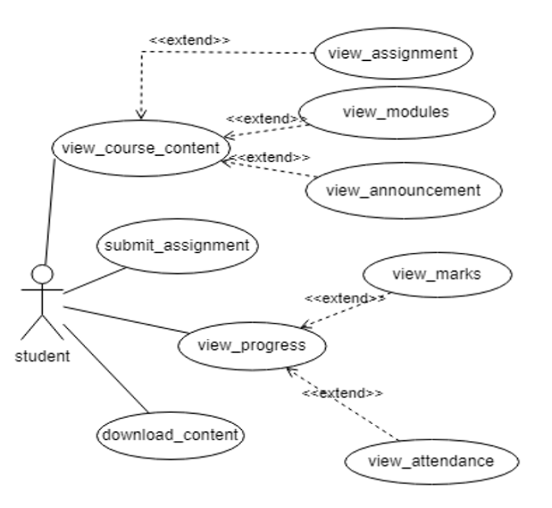
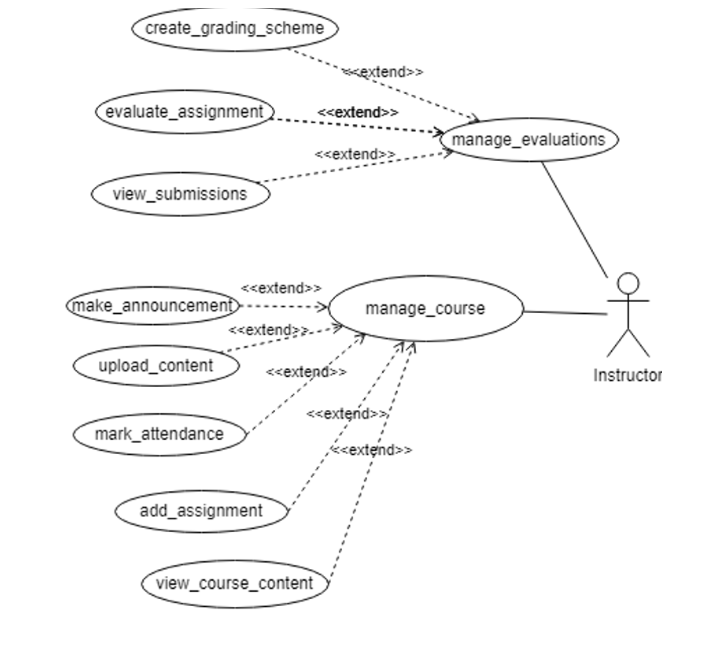
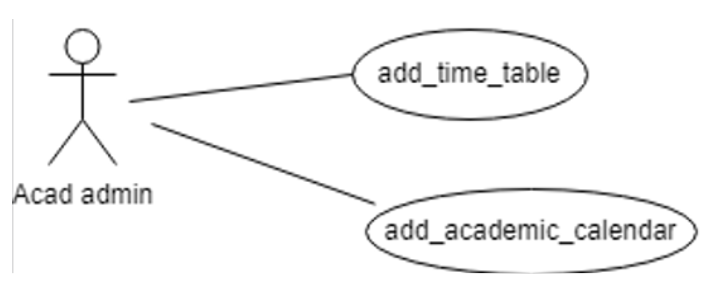

## AC-3 COURSE Management

## Table of Contents
- [User-Centered Design (UCD)](#user-centered-design-ucd)
- [SRS Application](#srs-application)
- [SRS Web Interface](#srs-web-interface)
- [API Specifications](#api-specifications)
- [UI for Application](#ui-for-application)
- [UI for Web](#ui-for-web)
- [Database Schema](#database-schema)

## User-Centered Design (UCD)

## SRS Application

**Prepared by:**  
- Aditya Gupta (21BCS007)  
- Adarsh Kumar (21BCS006)  
- Advait Manke (21BCS010)  
- K.L. Praseeda Keerthi (21BCS119)  
- Mahanthi Pranitha (21BCS124)

**Student Mentor:**  
- Vedant Bande (21BCS238)

## Table of Contents

1. [Introduction](#1-introduction)  
   1.1 [Introduction about the Fusion](#11-introduction-about-the-fusion)  
   1.2 [Purpose of the module](#12-purpose-of-the-module)  
   1.3 [Scope of the module](#13-scope-of-the-module)
2. [User/Actor Description (Characteristics)](#2-useractor-description-characteristics)  
   2.1 [Student](#21-student)  
   2.2 [Instructor](#22-instructor)
3. [Functional Requirements](#3-functional-requirements)  
   3.1 [Use Case Diagram](#31-use-case-diagram)  
   3.2 [Use Case Description](#32-use-case-description)  
   3.3 [Other Functional Requirements](#33-other-functional-requirements)  
   3.4 [Other Constraints](#34-other-constraints)  
   3.4.1 [User Interfaces](#341-user-interfaces)  
   3.4.2 [Software (Tech) Stack Used](#342-software-tech-stack-used)
4. [Non-Functional Requirements](#4-non-functional-requirements)  
5. [Module Dependencies with Other Fusion Modules](#5-module-dependencies-with-other-fusion-modules)  
   5.1 [UI Level](#51-ui-level)  
   5.2 [DB Level Dependencies](#52-db-level-dependencies)  
   5.3 [Module Level Dependencies](#53-module-level-dependencies)

## 1. Introduction

### 1.1 Introduction About the Fusion – A Brief Description:

FusionIIIT is a student-driven initiative that aims to provide a holistic solution for the seamless integration and automation of diverse functions within PDPM Indian Institute of Information Technology, Design and Manufacturing, Jabalpur. It is crafted with precision using Flutter and powered by the Django Web framework. FusionIIIT encompasses everything from efficient administration management to academic prowess and miscellaneous departmental tasks. It is like a digital wizard that takes care of everything, from organizing the administrative stuff to making academics smoother. It jumps into various departments and sections, making sure every corner of campus life runs smoothly.  
In the admin side, it handles the complicated paperwork and processes. For academics, it brings a digital touch, making learning and managing courses easier. But it doesn't stop there; FusionIIIT is like a friendly companion for all the different parts of the campus, making sure everything works well.  
In simpler terms, FusionIIIT is not just a tool – it's a helpful friend, making life at PDPM IIITDM Jabalpur more organized and enjoyable for everyone.

### 1.2 Purpose of the Module:

The purpose of the module course management is to provide details for instructors to upload course-related materials, assign tasks, and make announcements. The application also assesses the assignments and projects assigned to students and recommends optimal grades for each student. Students can view their performance, course content, submit assignments, and ask questions.

### 1.3 Scope of the Module:

The product scope of this software is to provide a user-friendly and intuitive platform for educational institutions. Lecturers can assign various tasks and view student participation both individually and for the entire course.

---

## 2. User/Actor Description (Characteristics)

### 2.1 Student:

The student actor in the course management module represents individuals who are enrolled in a course and intend to participate in the learning process by engaging with the course content, completing assignments, and taking quizzes. The course management module provides a digital platform for students to access course materials and interact with their instructors and peers.  
**Role:** The student's role is to start learning by logging in, accessing course materials, submitting assignments, taking quizzes, and engaging with course content in the digital realm.  
**Specific Functionalities:**
- Access course materials.
- Submit assignments.
- View performance in previous Assignments.
- View course content and details.
- Download content.

### 2.2 Instructor:

The instructor in the course management module represents individuals who are responsible for teaching a course and intend to manage the learning process by engaging with the course content, assigning assignments, and creating quizzes. The course management module provides a digital platform for lecturers to upload course materials, interact with students, and evaluate their performance.  
**Role:** The instructor, upon logging in, manages courses by uploading materials, creating quizzes, evaluating student work, and reviewing performance data.  
**Specific Functionalities:**
- Upload Content
- Add Assignments
- Evaluate Assignments
- View performances

## 3. Functional Requirements

### 3.1 Use Case Diagram

### 3.2 Use Case Description:

##### 3.2.1 View Course Content

| **UC ID**        | UC#1                    |
|------------------|-------------------------|
| **Use Case Name**| View Course Content      |
| **Description**  | The "View Course Content" use case allows both instructors and students to view the content of a course, including videos, lectures, readings, and assignments. |
| **Actor**        | Student                 |
| **Precondition** | 1. The student must be logged-in. 2. Student should have registered in that particular course. |
| **Main Flow**    | 1. The user logs in to the system.   2. The user navigates to the "Courses" tab.   3. The user selects the desired course from the list of available courses.   4. The system displays the course content.   5. The user can view and interact with the course content as permitted by their role. |
| **Post Conditions** | The user has successfully viewed the course content. The system has updated any necessary logs or records. |
| **Alternate Flow**  | AF1: User is not registered for the course.  AF2: Technical error during content retrieval or display. |
| **Sub Flow**        | NIL |
| **Global Alternate Flow** | GA1: User cancels the procedure.  GA2: System error. |

---

##### 3.2.2 Submit Assignment

| **UC ID**        | UC#2                    |
|------------------|-------------------------|
| **Use Case Name**| Submit Assignment        |
| **Description**  | Student can solve the assignment that is given, submit it, and can check previous assignments. |
| **Actor**        | Student                 |
| **Precondition** | 1. The student must be logged-in.   2. Student should have registered in that particular course.   3. The assignment should be open. |
| **Main Flow**    | 1. Student enters the desired course.  2. Student clicks on "Assignment".  3. The system displays assignments with deadlines.  4. Student views previous assignments and submits the current one.   5. Submission is taken in PDF or DOCS format.  6. Click "Submit".  7. System confirms submission. |
| **Post Conditions** | The student successfully submits the assignment. |
| **Alternate Flow**  | NIL |
| **Sub Flow**        | NIL |
| **Global Alternate Flow** | GA1: Student can cancel the assignment submission. |

---

##### 3.2.3 View Progress

| **UC ID**        | UC#3                    |
|------------------|-------------------------|
| **Use Case Name**| View Progress            |
| **Description**  | The "View Progress" use case allows a student to view their progress in a course, including their marks and attendance. |
| **Actor**        | Student                 |
| **Precondition** | 1. The student must be logged-in.   2. Student should have registered in that particular course.   3. Marks and attendance data should be uploaded by the instructor. |
| **Main Flow**    | 1. Student navigates to "Courses".  2. The system displays registered courses.  3. Student selects a course.  4. Student clicks on "View Progress".  5. System retrieves and displays marks and attendance. |
| **Post Conditions** | The student successfully views their progress. |
| **Alternate Flow**  | A1: Marks or attendance data not available.  A2: Technical error while retrieving progress data. |
| **Sub Flow**        | S1: View detailed marks.  S2: View attendance details. |
| **Global Alternate Flow** | GA1: Student cancels the procedure. |

---

##### 3.2.4 Download Content

| **UC ID**        | UC#4                    |
|------------------|-------------------------|
| **Use Case Name**| Download Content         |
| **Description**  | The "Download Content" use case allows a student to download course content materials for a registered course. |
| **Actor**        | Student                 |
| **Precondition** | 1. The student must be logged-in.  2. Course content must have been uploaded by the instructor. |
| **Main Flow**    | 1. Student navigates to the desired course.  2. Student clicks on "Content".  3. System displays available content files.  4. Student selects files to download.  5. Student clicks "Download".  6. System initiates download. |
| **Post Conditions** | The content files have been downloaded. |
| **Alternate Flow**  | A1: File not found.  A2: File corrupted.  A3: Insufficient storage. |
| **Sub Flow**        | NIL |
| **Global Alternate Flow** | GA1: Student cancels the download.  GA2: System error. |

---

##### 3.2.5 Manage Courses

| **UC ID**        | UC#5                    |
|------------------|-------------------------|
| **Use Case Name**| Manage Courses           |
| **Description**  | The "Manage Course" use case empowers instructors to administer various aspects of their courses, including adding assignments, managing content, making announcements, and more. |
| **Actor**        | Instructor               |
| **Precondition** | 1. The instructor must be logged-in.   2. The course must exist in the system. |
| **Main Flow**    | 1. Instructor navigates to "Courses".  2. Instructor selects "Manage Course".  3. System displays available courses.  4. Instructor selects a course.  5. System displays course management interface.  6. Instructor performs desired management tasks. |
| **Post Conditions** | Instructor successfully manages the course. |
| **Alternate Flow**  | A1: Course not found. |
| **Sub Flow**        | NIL |
| **Global Alternate Flow** | GA1: Instructor cancels the procedure. |

---

##### 3.2.6 Manage Evaluation

| **UC ID**        | UC#6                    |
|------------------|-------------------------|
| **Use Case Name**| Manage Evaluation        |
| **Description**  | The "Manage Evaluations" use case allows instructors to administer the assessment process for their courses. |
| **Actor**        | Instructor               |
| **Precondition** | 1. The instructor must be logged-in.   2. The course must exist within the system.   3. Students must have submitted assignments. |
| **Main Flow**    | 1. Instructor navigates to "Courses".  2. Instructor selects a course and clicks on "Manage Evaluations".  3. System displays evaluation interface.  4. Instructor manages assignments and evaluations. |
| **Post Conditions** | Instructor successfully completes evaluation tasks. |
| **Alternate Flow**  | NIL |
| **Sub Flow**        | NIL |
| **Global Alternate Flow** | NIL |

### 3.4.1 User Interfaces

- **Flutter framework:** UI development must adhere to Flutter's guidelines and best practices.
- **Cross-platform compatibility:** UI elements must render consistently across Android, iOS, and potentially web.
- **State management:** Efficient management of UI state and data flow using appropriate Flutter techniques (e.g., Provider, BLoC, MobX).
- **Navigation:** Clear and intuitive navigation patterns tailored for mobile experiences.
- **Device-specific features:** Leverage device features like cameras, GPS, or sensors as needed for specific use cases.

### 3.4.2 Software (Tech) Stack Used

- **Frontend:** Flutter (Dart programming language)
- **Backend:** Django (Python), PostgreSQL
- **API communication:** RESTful APIs for data exchange between frontend and backend.
- **Libraries and frameworks:** Potential use of additional libraries for:
  - **Authentication:** (e.g., Django REST framework authentication)

### 3.4.3 Business Rules

- **Enrollment deadlines** (enforced within Django backend logic)
- **Assignment deadlines** (enforced within Django backend logic)
- **Grading policies** (implemented within grading and feedback functionalities)
- **Attendance tracking** (stored and managed in the PostgreSQL database)
- **Communication channels** (integrated into app or provided as external links)
- **User roles and permissions** (handled by Django's authentication and authorization system)

---

## 4. Non-Functional Requirements

### 4.1 Performance

The system ensures fast page loading, rapid response to user interactions, and scalability to accommodate increased users and courses without performance slowdown.

### 4.2 Scalability

The system should scale effortlessly to handle an increasing number of users and courses without compromising performance.

### 4.3 Availability

The system ensures uninterrupted accessibility 24/7, with regular backups for student data and materials, along with established disaster recovery plans for major failures.

### 4.4 Security

The system prioritizes robust user authentication, strong password policies, encrypted sensitive data, frequent security updates, and strict adherence to data privacy regulations.

### 4.5 Usability

The system boasts an intuitive interface for easy learning, provides clear instructions with helpful guidance, and offers accessible online help, tutorials, and support resources for both students and instructors.

---

## 5. Module Dependencies with Other Fusion Modules

### 5.1 UI Level

- Not dependent on other modules

### 5.2 DB Level Dependencies

- Dependent on course list, student list.

### 5.3 Module Level Dependencies

- Dependent on The Program and Curriculum module for providing the approved list of courses.

## SRS Web Interface

**Prepared by:**
- Ashu Srivastava (21BCS042)
- Ashutosh Choudhary (21BCS043)
- Ayush Sonkar (21BCS048)
- Ayush Srivastava (21BCS049)
- Daksh Bajaj (21BCS068)

**Faculty Mentor** - Dr. Munesh Singh  
**Student Mentor** - Saurav Raj (21BCS188)

---

## Table of Contents

1. [Introduction](#1-introduction)  
   1.1 [Introduction About Fusion](#11-introduction-about-fusion)  
   1.2 [Purpose of the Module](#12-purpose-of-the-module)  
   1.3 [Product Scope](#13-product-scope)
2. [Use case/Actor Description](#2-useractor-description-characteristics)
3. [Functional Requirements](#3-functional-requirements)  
   3.1 [Use Case Diagram](#31-use-case-diagram)  
   3.2 [Use Case Description](#32-use-case-description)  
   3.3 [Other Functional Requirements](#33-other-functional-requirements)  
   3.4 [Other Constraints](#34-other-constraints)  
     3.4.1 [User Interfaces](#341-user-interfaces)  
     3.4.2 [Software (Tech) Stack Used](#342-software-tech-stack-used)  
     3.4.3 [Business Rules](#343-business-rules)
4. [Non-Functional Requirements](#4-non-functional-requirements)  
5. [Module Dependencies with Other Fusion Modules](#5-module-dependencies-with-other-fusion-modules)  
   5.1 [UI Level](#51-ui-level)  
   5.2 [DB Level Dependencies](#52-db-level-dependencies)  
   5.3 [Module Level Dependencies](#53-module-level-dependencies)

---

## 1. Introduction

### 1.1 Introduction About Fusion

Fusion IIIT at PDPM Indian Institute of Information Technology, Design, and Manufacturing, Jabalpur, is a sophisticated integration of functions, showcasing the seamless fusion of diverse operations through the adept use of Python 3.8 and the robust Django Web framework. This student-driven initiative has been meticulously crafted to enhance the operational dynamics of the institute. From streamlining administrative processes to boosting academic excellence and handling various departmental tasks, FusionIIIT emerges as a comprehensive solution, orchestrating the nuances of campus life with finesse.

Think of FusionIIIT as a digital maestro, orchestrating the symphony of campus life. It goes beyond traditional boundaries, delving into every facet of the institute to ensure a harmonious experience. On the administrative front, it navigates through complex paperwork and processes, simplifying the intricacies. In the academic realm, it introduces a digital touch, making learning and course management more accessible. However, FusionIIIT's impact transcends these domains; it functions as a genial companion, extending its support to every nook and cranny of campus life, ensuring seamless operations.

In essence, FusionIIIT is not merely a tool, it's a friendly guide, dedicated to organizing and enhancing the quality of life for everyone at PDPM IIITDM Jabalpur.

### 1.2 Purpose of the Module

The main objective of our module in this application is to offer a platform for Instructors and students to work hand in hand. Its primary purpose is to streamline and enhance the management of courses, providing benefits to both students and faculty. Instructors can upload course-related documents, assignments, quizzes and also make announcements. Students are able to see their performance, course content, submit assignments, and ask related queries. The application also lets Instructors evaluate the assignment, and projects allotted to students and recommends optimal grades for each student.

### 1.3 Product Scope

A streamlined platform for students to effectively manage their academic courses. The product will include features like the ability to showcase courses with details such as name, code, instructor, and schedule, coupled with user-friendly search and filtering options. The system also addresses the optimal display of courses, incorporating pagination or infinite scroll for improved navigation through course listings.

A dedicated section for each course facilitates easy access to course materials and resources in various file formats. The portal further supports announcements, allowing instructors to communicate important updates and events. Comprehensive course-related information, including credits, and instructor details, is presented along with external resource links. Additional considerations encompass secure user authentication, personalized profiles, notification features, and adherence to accessibility standards.

---

## 2. User/Actor Description (Characteristics):

### 2.1 Student:

Represents all the students who intend to complete the course and receive all the important announcements and course updates (attendance, course timetable, assignments, projects, and their marks) made by the Instructor.  
**Role**: Enroll in the course and access the content provided by the instructor  
Access Course Content and details, download the assignment, and see previous quiz performance.

#### Specific Functionalities:
- Access Course Content and details
- Download assignment
- See previous quiz performance
- See the Attendance uploaded by the instructor

### 2.2 Instructor:

Represents all the Instructors who intend to provide the course content, announcements, and projects/assignments to the students who can access them at a common portal in Fusion.  
**Role**: Share the course link/portal with the students and all the important information and contents on the portal.

#### Specific Functionalities:
- Make announcements for the courses offered
- Upload Content (important notes) on the course portal
- Add assignments and course-related projects on the portal of the course
- Share the grading scheme with the students
- Share the grades of all the students of a particular course

### 2.3 Acad Admin:

Represents the Academic Administrator of the college responsible for managing other academic procedures such as creating a timetable and creating an academic calendar.  
**Role**: Add the necessary information on the portal required for efficient flow of academic procedures.

#### Specific Functionalities:
- Uploads the latest Timetable for the new semester
- Uploads the Academic calendar for the new academic year

---

## 3. Functional Requirements:

### 3.1 Use Case Diagram:

### 3.2 Use Case Description:

##### 3.2.1 manage_evaluations

| **UC ID**         | UC#1                                   |
|-------------------|----------------------------------------|
| **Use Case Name**  | manage_evaluation                      |
| **Description**    | The manage_evaluation use case allows Instructors to assess various submissions of students. |
| **Actor**          | Instructor                             |
| **Precondition**   | The instructor must be logged in.      |
| **Main Flow**      | 1. The instructor chooses the desired courses from the list of courses displayed by the system. 2. The instructor clicks on the Manage Evaluations tab. 3. The instructor chooses the desired action and is redirected to the specific page. |
| **Post Conditions**| Assignment scores and grades are recorded. |
| **Alternate Flow** | A1: If not already specified, the instructor creates a grading scheme for how scores will be calculated and translated into grades. A2: 1. The instructor selects from assignments that need to be evaluated. 2. The instructor evaluates and records scores, which are reflected in the database. A3: The instructor views the details of submitted assignments under the view_submission field. |
| **Sub Flow**       | NIL                                    |
| **Global Alternate Flow** | NIL                            |

##### 3.2.2 manage_course

| **UC ID**         | UC#2                                   |
|-------------------|----------------------------------------|
| **Use Case Name**  | manage_course                          |
| **Description**    | The Instructor can manage all the course-related information. |
| **Actor**          | Instructor                             |
| **Precondition**   | 1. The Instructor must be logged in. 2. The Instructor must be in charge of some courses. |
| **Main Flow**      | 1. Instructor selects from the list of courses where changes need to be made. 2. Instructor chooses from the options to make changes. 3. Instructor adds or updates the necessary changes. |
| **Post Conditions**| 1. The system relays the changes made by the Instructor to other actors. 2. The uploaded content is stored in the database. |
| **Alternate Flow** | A1: Instructor makes an announcement about the course. A2: 1. Instructor clicks on the upload content tab for the selected course. 2. Instructor uploads the course content. A3: 1. Instructor uploads assignments. A4: Instructor views course content. A5: Instructor adds or marks attendance. |
| **Sub Flow**       | NIL                                    |
| **Global Alternate Flow** | NIL                            |

##### 3.2.3 view_course_content

| **UC ID**         | UC#3                                   |
|-------------------|----------------------------------------|
| **Use Case Name**  | view_course_content                    |
| **Description**    | Students can view the content of various courses they are enrolled in. |
| **Actor**          | Student                                |
| **Precondition**   | 1. The Student must be logged in. 2. Student must be registered in that particular course. |
| **Main Flow**      | 1. The system displays the list of registered courses. 2. Student selects the desired course. 3. Student clicks "View Content". 4. Student selects the type of information they want (assignments, modules, or announcements). 5. Student views or downloads the content. |
| **Post Conditions**| Students can view and access specific content they want. |
| **Alternate Flow** | A1: The system displays all assignments. A2: The system displays course modules. A3: Student views announcements in the notifications tab. |
| **Sub Flow**       | NIL                                    |
| **Global Alternate Flow** | NIL                            |

##### 3.2.4 submit_assignment

| **UC ID**         | UC#4                                   |
|-------------------|----------------------------------------|
| **Use Case Name**  | submit_assignment                      |
| **Description**    | Students can solve and submit assignments, and check previous submissions. |
| **Actor**          | Student                                |
| **Precondition**   | 1. The student must be logged in. 2. Student must be registered in the course. 3. The assignment must be open. |
| **Main Flow**      | 1. Student selects the course. 2. Student clicks "Assignment". 3. The system displays assignments with deadlines. 4. Student views previous assignments. 5. Student submits current assignment. 6. Submissions can be PDF/DOC/ZIP. 7. Student clicks "Submit". 8. The system confirms submission. |
| **Post Conditions**| Student successfully submits or resubmits assignments. |
| **Alternate Flow** | NIL                                    |
| **Sub Flow**       | NIL                                    |
| **Global Alternate Flow** | Student can cancel the assignment. |

##### 3.2.5 view_progress

| **UC ID**         | UC#5                                   |
|-------------------|----------------------------------------|
| **Use Case Name**  | view_progress                          |
| **Description**    | Students can view their progress within a course. |
| **Actor**          | Student                                |
| **Precondition**   | 1. The student must be logged in. 2. Student must be enrolled in the course. 3. Progress data must be available. |
| **Main Flow**      | 1. List of registered courses is displayed. 2. Student selects a course. 3. Student chooses "View Marks" or "View Attendance". 4. Student is redirected to the respective page. |
| **Post Conditions**| Students have a clear understanding of their progress in the course. |
| **Alternate Flow** | A1: Students view detailed marks. A2: Students view attendance records. |
| **Sub Flow**       | NIL                                    |
| **Global Alternate Flow** | NIL                            |

##### 3.2.6 download_content

| **UC ID**         | UC#6                                   |
|-------------------|----------------------------------------|
| **Use Case Name**  | download_content                       |
| **Description**    | Students can download course content provided by the Instructor. |
| **Actor**          | Student                                |
| **Precondition**   | 1. The student must be logged in. 2. Student must be registered in the course. |
| **Main Flow**      | 1. System displays the course list. 2. Student selects a course. 3. Student clicks "Download Content". 4. System displays files shared by the instructor. 5. Student downloads desired files. |
| **Post Conditions**| Students download the course content.   |
| **Alternate Flow** | NIL                                    |
| **Sub Flow**       | NIL                                    |
| **Global Alternate Flow** | NIL                            |

##### 3.2.7 add_time_table

| **UC ID**         | UC#7                                   |
|-------------------|----------------------------------------|
| **Use Case Name**  | add_time_table                         |
| **Description**    | The add_time_table use case allows the Acad admin to upload the latest timetable for the upcoming or ongoing semester. |
| **Actor**          | Acad admin                             |
| **Precondition**   | The Acad admin must be logged in.      |
| **Main Flow**      | 1. The Acad admin visits the course management module. 2. The Acad admin clicks "Add Timetable". 3. The Acad admin uploads the timetable file (PDF/DOCX). |
| **Post Conditions**| The timetable is recorded in the database. |
| **Alternate Flow** | NIL                                    |
| **Sub Flow**       | NIL                                    |
| **Global Alternate Flow** | NIL                            |

##### 3.2.8 add_academic_calendar

| **UC ID**         | UC#8                                   |
|-------------------|----------------------------------------|
| **Use Case Name**  | add_academic_calendar                  |
| **Description**    | The add_academic_calendar use case allows the Acad admin to upload an updated academic calendar for the new academic year. |
| **Actor**          | Acad admin                             |
| **Precondition**   | The Acad admin must be logged in.      |
| **Main Flow**      | 1. The Acad admin visits the course management module. 2. The Acad admin clicks "Add Academic Calendar". 3. The Acad admin fills in the table of events and finalizes the calendar. |
| **Post Conditions**| The new academic calendar is displayed. |
| **Alternate Flow** | NIL                                    |
| **Sub Flow**       | NIL                                    |
| **Global Alternate Flow** | NIL                            |

### 3.3 Other Functional Requirements

1. This module will make use of the communication module for sending notifications and alerts to various actors involved in the module regarding new uploads, extra information, or modifications, etc.  
2. The downloading and uploading system for downloading course content and other course material.  
3. Alerts regarding deadlines for submission of tasks.  
4. The Super admin of Fusion should be able to assign roles for students and instructors.

### 3.4 Other Constraints

#### 3.4.1 User Interfaces

The user interface should comply with the color scheming and dashboard design of FusionIIIT. Users should be able to navigate from one functionality to another. Inter-module navigation should be smooth. All the functionalities should be easy to use and no specific training should be required for the usage of the module.

#### 3.4.2 Software (Tech) Stack Used

- ##### 3.4.2.1 Frontend

  - **HTML**: The application's user interface is developed using HTML for structuring web content  
  - **CSS**: Styling in our application

- ##### 3.4.2.2 Backend

  - **Django**: Python web framework employed for building the application's back-end logic, facilitating efficient development and integration

- ##### 3.4.2.3 Database

  - **PostgreSQL**: The relational database management system (RDBMS) used for storing and managing application data with a focus on scalability and performance.

- ##### 3.4.2.4 Version Control

  - **Git**: Git is a distributed version control system that is widely used for tracking changes in source code during software development.

#### 3.4.3 Business Rules

1. Users must authenticate using a valid username and password to access the system.  
2. Different user roles (e.g., admin, faculty, student) have distinct access permissions, and access is restricted based on these roles.  
3. The system must comply with data privacy regulations, ensuring that sensitive user information is securely stored and accessed only by authorized personnel.  
4. Uploaded files must follow a specific naming convention for consistency and easier management.

## 4. Non-Functional Requirements

### 4.1 Performance

The system should be scalable for concurrent users and for huge data volumes of different actors.

### 4.2 Reliability

The system should have availability and fault-tolerant error handling.

### 4.3 Security

Data encryption for sensitive information and role-based access control should be there in the product to ensure security.

### 4.4 Usability

The product will have a consistent and intuitive user interface.

### 4.5 Scalability

Database scalability for courses and users.

### 4.6 Maintainability

Modular architecture for easy updates.

## 5. Module Dependencies with Other Fusion Modules

### 5.1 UI Level

The Course Management module can be accessed from the dashboard (the very first page after login) or from the sidebar. There are different tabs within the module for all the actors as different actors have different tasks to perform. The UI design for the Course Management module is correlated to the overall design of Fusion IIIT and other Fusion modules.

### 5.2 DB Level Dependencies

The following schemas are shared with other modules:
1. **Course** - Imported from the Academic information module. Used by all other course-related modules.  
2. **Student** - Imported from the Academic information module for Student information.  
3. **Curriculum** - Imported from the Academic information module  
4. **Curriculum_Instructor** - Imported from the Academic information module.  
5. **Student_attendance** - Imported from the Academic information module.  
6. **Register** - Imported from the Academic procedures module. Used to find the courses a student is registered in.  
7. **ExtraInfo** - Global schema.

### 5.3 Module Level Dependencies

- **AC1 - Program and curriculum** - Getting predefined course and curriculum details  
- **AC2 - Course Registration** - All the information related to adding, removal, or updation of courses among different actors have to be coordinated.  
- **AC4 - Other academic Procedures** - Probable dependencies include finalizing of marks, grades, and Course List.  
- **GAD4 - File Tracking** - Uploads and downloads of files (Assignments, etc)  
- **OS3 - Notifications** - Announcements

## API Specifications

**Student Mentor** - Saurav Raj (21BCS188)

### APIs: /ocms/  
1. **/{user} - Implemented (name - viewcourses)**  
    a. Parameters required - user  
    b. Description - Shows all the courses under the user  
 

2. **/{course_code}/{user, course code} - Partially Working (name - course)**  
    a. Parameters required - user, course code  
    b. Description - Home page for each course for Student/Faculty  
 

3. **/{course_code}/get_exam_data{exam name, course code} - Partially Working**  
    a. Parameters required - exam_name, course code  
    b. Description - Shows the marks related to a specific course  
 

4. **/{course_code}/forum{user, course code} - Partially Working**  
    a. Parameters required - user, course code  
    b. Description - Shows the forum related to the selected course to the user.  
 

5. **/{course_code}/ajax_reply{user, course code} - Partially Working**  
    a. Parameters required - user, course code  
    b. Description - Adds comment to the post on the selected course’s forum.  
 

6. **/{course_code}/ajax_new{user, course code} - Partially Working**  
    a. Parameters required - user, course code  
    b. Description - Adds a new post on the selected course’s forum.  
 

7. **/{course_code}/ajax_remove{user} - Partially Working**  
    a. Parameters required - user  
    b. Description - Deletes the selected post created by the user on the forum.  
 

8. **/{course_code}/upload_assignment{user, course code} - Partially Working**  
    a. Parameters required - user, course code  
    b. Description - Submits the assignment assigned to the Students on the selected course portal.  
 

9. **/{course code}/add_document{user, course code} - Partially Working**  
    a. Parameters required - user, course code  
    b. Description - Uploads course content provided by the Instructor to the course portal.  
 

10. **/{course_code}/add_assignment{user, course code} - Partially Working**  
    a. Parameters required - user, course code  
    b. Description - Uploads the assignment created by Faculty on the course portal.  
 

11. **/{course_code}/delete/{user, course code} - Partially Working**  
    a. Parameters required - user  
    b. Description - Deletes the selected course content/assignment/grade sheet uploaded by the Faculty on the course portal.  
 

12. **/{course_code}/submit_attendance{user, course code} - Partially Working**  
    a. Parameters required - user, course code  
    b. Description - Uploads the attendance related to the particular course on the course portal.  
 

13. **/{course_code}/view_attendance{user, course code} - Yet to be implemented**  
    a. Parameters required - user, course code  
    b. Description - Shows attendance of students related to the course selected.  
 

14. **/add_time_table - Yet to be implemented**  
    a. Parameters required - Yet to be implemented  
    b. Description - Uploads weekly time table to Student/Faculty dashboard, which is created by Acad Admin.  
 

15. **/add_academic_calendar - Yet to be implemented**  
    a. Parameters required - Yet to be implemented  
    b. Description - Uploads Academic calendar to Student/Faculty dashboard (created by Acad Admin user)  
 

16. **/{course_code}/evaluate_assignment - Yet to be implemented**  
    a. Parameters required - Yet to be implemented  
    b. Description - Uploads the marks and evaluations done by the Instructor to the course portal.  
 

17. **/{course_code}/create_grading_scheme - Yet to be implemented**  
    a. Parameters required - Yet to be implemented  
    b. Description - Uploads the grading scheme created by the instructor to the course portal.  
 

18. **/{course_code}/view_submissions - Yet to be implemented**  
    a. Parameters required - Yet to be implemented  
    b. Description - Shows the assignment submissions by the students on the portal of the selected course.  
 

19. **/{course_code}/view_assignment - Yet to be implemented**  
    a. Parameters required - Yet to be implemented  
    b. Description - Shows the assignment submitted by a student in the selected course to the instructor.  
 

20. **/{course_code}/view_modules - Yet to be implemented**  
    a. Parameters required - Yet to be implemented  
    b. Description - Shows all the modules created by the Instructor to the student on the course portal.  
 

21. **/{course_code}/download_document - Yet to be implemented**  
    a. Parameters required - Yet to be implemented  
    b. Description - Downloads the selected course content on the local machine of the student.  
 

## Overview of Module:
The module is designed to provide a platform for instructors and students to work together more efficiently. The primary objective of the module is to streamline and enhance course management, benefiting both students and faculty.  
Instructors can upload course-related documents, assignments, quizzes, and announcements, while students can view their performance, course content, submit assignments, and ask related queries. The application also allows instructors to evaluate assignments and projects allotted to students and recommends optimal grades for each student.  
The module includes features such as the ability to showcase courses with details such as name, code, instructor, and schedule. The system also addresses the optimal display of courses. A dedicated section for each course facilitates easy access to course materials and resources in various file formats.  
**Main actors include** - Student, Instructor, and Acad admin.

## APIs:

### Yet to be implemented or Partially Working  

- #### UC#1 manage_evaluations  
  - **Index of APIs used** - 1, 2, 3, 16, 17, 18  
  - The view_course API is built but not integrated properly with the application.  
  - The course API is partially working and throws errors at some important test cases.  
  - The get_exam_data API is not properly implemented.  
  - The evaluate_assignment, create_grading_scheme are yet to be implemented in the app.  
  - **Databases** - Curriculum, Curriculum_Instructor, globals_extrainfo, Student, Assignment, Student_Assignment, Grades, online_cms_assignment, online_cms_studentassignment.  

- #### UC#2 manage_course  
  - **Index of APIs used** - 1, 2, 4, 5, 6, 7, 9, 10, 11, 12  
  - The view_course API is built but not integrated properly with the application.  
  - The course API is partially working and throwing errors at some important test cases.  
  - The forum, ajax_reply, ajax_new, ajax_remove, add_document, add_assignment, delete and submit_attendance APIs are not properly implemented.  
  - **Databases** - Curriculum, Curriculum_Instructor, Course, Student_attendance, online_cms_coursedocuments, online_cms_coursevideo, online_cms_assignment, online_cms_forum.  

- #### UC#3 view_course_content  
  - **Index of APIs used** - 1, 2, 4, 5, 6, 19, 20  
  - The view_course API is built but not integrated properly with the application.  
  - The course API is partially working and throwing errors at some important test cases.  
  - The forum, ajax_reply, and ajax_new APIs are not properly implemented.  
  - The view_assignment and view_modules APIs are not created and hence would be implemented in the app.  
  - **Database** - Curriculum, Course, online_cms_assignment, online_cms_coursedocuments, online_cms_coursevideo, online_cms_studentassignment, online_cms_forum.  

- #### UC#4 submit_assignment  
  - **Index of APIs used** - 1, 2, 8  
  - The view_course API is built but not integrated properly with the application.  
  - The course API is partially working and throwing errors at some important test cases.  
  - The upload_assignment API is not properly implemented.  
  - **Database** - Curriculum, Course, online_cms_studentassignment.  

- #### UC#5 view_progress  
  - **Index of APIs used** - 1, 2, 3, 13.  
  - The view_course API is built but not integrated properly with the application.  
  - The course API is partially working and throwing errors at some important test cases.  
  - The get_exam_data API is not properly implemented.  
  - The view_attendance API is not created and hence would be implemented in the app.  
  - **Database** - Curriculum, Course, Student_attendance, Grades, online_cms_marks.  

- #### UC#6 download_content  
  - **Index of APIs used** - 1, 2, 21  
  - The view_course API is built but not integrated properly with the application.  
  - The course API is partially working and throwing errors at some important test cases.  
  - The download_document API is not created and hence would be implemented in the app.  
  - **Database** - Curriculum, Course, online_cms_coursedocuments.  

- #### UC#7 add_time_table  
  - **Index of APIs used** - 14  
  - A new API has to be implemented for the Acad admin to add the Time table for the current semester.  
  - **Database** - Timetable.  

- #### UC#8 add_academic_calendar  
  - **Index of APIs used** - 15  
  - A new API has to be implemented for the Acad admin to add the Academic calendar for the current semester.  
  - **Database** - Academic calendar.  
  
---

# Current Problems with the Module or its Use Cases

##### [UC#1 Manage Evaluations]
- **Problem**: The APIs are not properly developed, and the frontend is partially developed.

##### [UC#2 Manage Courses]
- **Problem**: The APIs are not properly developed, and the frontend is partially developed.

##### [UC#3 View Course Content]
- **Problem**: The APIs are not properly developed, and the frontend is partially developed. Two APIs need to be freshly developed.

##### [UC#4 Submit Assignment]
- **Problem**: The APIs are not properly developed, and the frontend is not developed at all.

##### [UC#5 View Progress]
- **Problem**: The APIs are not properly developed, and the frontend is not developed. One API needs to be developed from scratch.

##### [UC#6 Download Content]
- **Problem**: The APIs are not properly developed, and the frontend is not developed. One API needs to be developed from scratch.
  
## UI for Application 

### Figma Profiles for Course Management

### Module Description
The purpose of the module course management is to provide details for instructors to upload course-related materials, assign tasks, and make announcements. The application also assesses the assignments and projects assigned to students and recommends grades for each student. Students can view their performance, course content, submit assignments, and ask questions.

## Actors 

### 2.1 Student
The student actor in the course management module represents individuals who are enrolled in a course and intend to participate in the learning process by engaging with the course content, completing assignments, and taking quizzes. The course management module provides a digital platform for students to access course materials and interact with their instructors and peers.

[Student Figma Profile](https://www.figma.com/file/HQsLOAGIrJ3MzWBX2hLzHp/AC-3-Course-Management-(Mobile)?type=design&node-id=0%3A1&mode=design&t=E5Fhob8diHrcjc66-1)

### 2.2 Instructor
The instructor in the course management module represents individuals who are responsible for teaching a course and intend to manage the learning process by engaging with the course content, assigning assignments, and creating quizzes. The course management module provides a digital platform for lecturers to upload course materials, interact with students, and evaluate their performance.

[Instructor Figma Profile](https://www.figma.com/file/HQsLOAGIrJ3MzWBX2hLzHp/AC-3-Course-Management-(Mobile)?type=design&node-id=0%3A1&mode=design&t=E5Fhob8diHrcjc66-1)

### 2.3 Acad Admin
Represents the Academic Administrator of the college responsible for managing other academic procedures such as creating a time table.

[Academic Admin Figma Profile](https://www.figma.com/file/HQsLOAGIrJ3MzWBX2hLzHp/AC-3-Course-Management-(Mobile)?type=design&node-id=0%3A1&mode=design&t=E5Fhob8diHrcjc66-1)

## UI for Web

### Figma Profiles for AC3 - Course Management (Web)

### Module Description
The module is designed to provide a platform for instructors and students to work together more efficiently. The primary objective of the module is to streamline and enhance course management, benefiting both students and faculty. Instructors can upload course-related documents, assignments, quizzes, and announcements, while students can view their performance, course content, submit assignments, and ask related queries. The application also allows instructors to evaluate assignments and projects allotted to students and recommends optimal grades for each student. The module includes features such as the ability to showcase courses with details such as name, code, instructor, and schedule. The system also addresses the optimal display of courses. A dedicated section for each course facilitates easy access to course materials and resources in various file formats.

## Use Case Specifications

### Actors 

#### 2.1 Student 
Represents all the students who intend to complete the course and receive all the important announcements and course updates (attendance, course timetable, assignments, projects, and their marks) made by the Instructor.

**Role:** Enroll in the course and access the content provided by the instructor. Access course content and details, download the assignment, and see previous quiz performance.

**Use cases -**
- view_course_content [UC#3]
- submit_assignment [UC#4]
- view_progress [UC#5]
- download_content [UC#6]

**Figma profile -** 
[Student Figma Profile](https://www.figma.com/file/eoua8MVTWoCUPv1B7hRrir/AC3---Course-Management-(Web)?type=design&node-id=0-1&mode=design&t=qafgzddne90Rfs7H-0)

#### 2.2 Instructor
Represents all the Instructors who intend to provide the course content, announcements, and projects/assignments to the students who can access them at a common portal in Fusion.

**Role:** Share the course link/portal with the students and all the important information and contents on the portal.

**Use cases -**
- manage_evaluations [UC#1]
- manage_course [UC#2]

**Figma profile -** 
[Instructor Figma Profile](https://www.figma.com/file/eoua8MVTWoCUPv1B7hRrir/AC3---Course-Management-(Web)?type=design&node-id=15-533&mode=design&t=qafgzddne90Rfs7H-0)

#### 2.3 Acad Admin
Represents the Academic Administrator of the college responsible for managing other academic procedures such as creating a time table and creating an academic calendar.

**Role:** Add the necessary information on the portal required for efficient flow of academic procedures.

**Use cases -**
- add_time_table [UC#7]
- add_academic_calendar [UC#8]

**Figma profile -** 
[Academic Admin Figma Profile](https://www.figma.com/file/eoua8MVTWoCUPv1B7hRrir/AC3---Course-Management-(Web)?type=design&node-id=11-2663&mode=design&t=qafgzddne90Rfs7H-0)

## Database Schema

**Faculty Mentor** - Dr. Munesh Singh  
**Student Mentor** - Saurav Raj (21BCS188)  

### Overview of the Module:  

**SRS:** AC-3-Course Management System-SRS  
**A. ER Diagram:** [ER Diagram](https://drive.google.com/file/d/1QccI4zwpUvrC2fQMbNgrI9n6jj4sk9YW/view)  
**B. Database Schema Info:** [Database Schema Info](https://docs.google.com/spreadsheets/d/1TtxJFzr0i6OAhG5gcIT_0zUuhYhWbpUkVTRjCDvV5Z8/edit?gid=0#gid=0)  

### C. Changes required in the currently implemented Tables:-  

**Change - Schemas removed - (10)**  
- online_cms_credentialsmodel  
- online_cms_practice  
- online_cms_practicequestion  
- online_cms_question  
- online_cms_questionbank  
- online_cms_quiz  
- online_cms_quizresult  
- online_cms_quizquestion  
- online_cms_studentanswer  
- online_cms_topics  

**Justification:** Excluded from the updated Use case Diagram  

**Change - New schemas added - (2)**  
- online_cms_gradingscheme  
- online_cms_announcements  

**Justification:** New use cases in updated Use Case Diagram  

### D. Data Availability for API and Functional Testing  

**D.1 Mention the tables that are already populated**  
- Course  
- Curriculum  
- Curriculum_Instructor  
- Register  
- academic_information_student  
- globals_extrainfo  
- Calendar  
- Timetable  
- online_cms_assignment  
- online_cms_coursedocuments  
- online_cms_forum  
- online_cms_forumreply  
- online_cms_studentassignment  
- SemesterMarks  

**D.2 Mention the tables required to be populated**  
- Student_attendance  
- online_cms_coursevideo  
- online_cms_gradingscheme  
- online_cms_announcements  

**D.3 Mention any difficulties faced by your team regarding populating any table (if any)**  
NIL  
