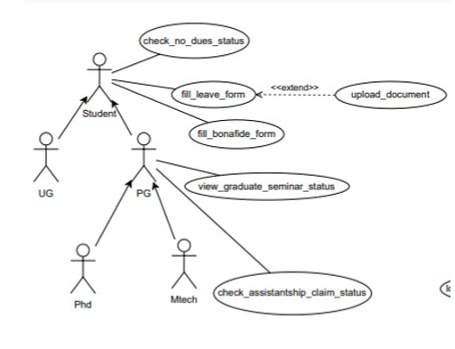
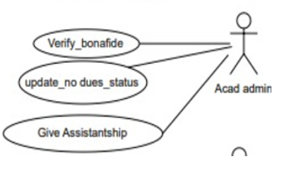
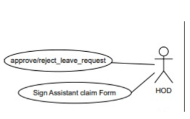
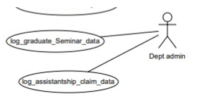

## AC-4 Other Academic Procedures

## Table of Contents
- [User-Centered Design (UCD)](#user-centered-design-ucd)
- [SRS Application](#srs-application)
- [SRS Web Interface](#srs-web-interface)
- [API Specifications](#api-specifications)
- [UI for Application](#ui-for-application)
- [UI for Web](#ui-for-web)
- [Database Schema](#database-schema)

## User-Centered Design (UCD)

## SRS Application

### Prepared by:
- Ashish kol (21BCS041)
- Bikash Sabar (21BCS060)
- Gadam Omkar (21BCS083)
- Gaurav Singh (21BCS086)
- Shivam Kumar (21BCS191)

**LEAD:** Prakash Dwivedi (21BCS159)

**MENTOR:** Dr. Ayan Seal

---

## 1. Introduction

### 1.1 Introduction about the Fusion – A brief Description

FusionIIIT stands as a testament to the seamless integration and automation of diverse functions within PDPM Indian Institute of Information Technology, Design and Manufacturing, Jabalpur. Crafted with precision using Python 3.8 and powered by the Django Web framework, this initiative is a student-driven endeavor designed to elevate the institute's operational landscape. Encompassing everything from efficient administration management to academic prowess and miscellaneous departmental tasks, FusionIIIT is a holistic solution that harmonizes the intricacies of campus life.

Imagine it as a digital wizard that takes care of everything, from organizing the administrative stuff to making academics smoother. It's not just limited to the usual tasks; FusionIIIT jumps into various departments and sections, making sure every corner of campus life runs smoothly.

In the admin side, it handles the complicated paperwork and processes. For academics, it brings a digital touch, making learning and managing courses easier. But it doesn't stop there; FusionIIIT is like a friendly companion for all the different parts of the campus, making sure everything works well.

In simpler terms, FusionIIIT is not just a tool – it's a helpful friend, making life at PDPM IIITDM Jabalpur more organized and enjoyable for everyone.

### 1.2 Purpose of the module:

This document aims to comprehensively gather, analyze, and provide insight into the Academic Procedures of IIITDM Jabalpur. These procedures encompass the processing of Leave forms, Bonafide forms, Graduate seminar status, Assistantship claim status, and No-dues. The document will define the users and functionality of the Software.

Furthermore, it seeks to predict and address how we anticipate the product's utilization, aiming to gain a better understanding of the Software's intended use. The document will outline concepts that may be developed later and document ideas that are under consideration but may be discarded as the product evolves.

This comprehensive document not only describes the project's target audience, user interface, and hardware/software requirements but also defines how our clients, team, and audience perceive the product and its functionality. It serves as a valuable guide for designers and developers, assisting in the Software Development Lifecycle (SDLC) processes.

### 1.3 Scope of the module:

The Academic Procedures system is an integral subsystem within the broader College System. The software is designed to retrieve input from the College Database, which stores information about both students and faculty. The system involves four distinct actors: Students, Heads of Department (HODs), Assistant, and Department admin. Each actor is assigned specific activities within the system, ensuring a distributed and specialized approach to task execution. This delineation of responsibilities contributes to the system's efficiency and effectiveness in managing academic procedures.

---

## 2. User/Actor Characteristics

#### 2.1 STUDENT
Represents individuals who intend to do their academic procedures such as filling of leave form, filling of bonafide form, checking the status of their no dues, etc.  
**Role:** The student's (UG + PG) role is to make use of this portal to fulfill his academic procedures through this platform.  
**Specific Functionalities:**
- Checking of no_dues_status.
- Filling the leave_form.
- Filling the bonafide_form.
 

#### 2.2 PG STUDENTS:
PG Students can access all the functionalities of Student but they also come through some special features such as looking for their status of graduate seminar and assistantship claim status.  
**Role:** PG students' role is to make sure that they effectively make use of this portal to check their graduate_seminar_status and check their assistantship_claim_status.  
**Specific Functionalities:**
- Check_graduate_seminar_status.
- Check_Assistantship_claim_status.
 

#### 2.3 HOD

HOD is the head of the department of all the students (UG + PG) and faculty of that same department.  
**Role:** The role of the HOD is to make sure that he checks all the leave requests and then grants or rejects them and to sign the assistantship claim form.  
**Specific Functionalities:**
- To check all the leave requests.
- To approve or reject the leave requests.
- To sign the assistantship claim form of PG students.
 

#### 2.4 ACAD ADMIN

Acad Admin is the administrative personnel and is responsible for managing all the academic affairs.  
**Role:** The role of Acad Admin is to verify the bonafide application and give assistantship to PG students and to make sure to update the no_dues status.  
**Specific Functionalities:**
- To verify the bonafide applications of students.
- To give assistantship to PHD and PG students.
- To update the no_dues status.
 

#### 2.5 Dept-Admin

Department Admin refers to the administrative personnel responsible for managing the day-to-day operations of a specific department in an organization or institution.  
**Role:** The role of Dept-Admin is to log assistantship and seminar status of PG students.  
**Specific Functionalities:**
- Log_graduate_seminar_data.
- Log_Assistantship_claim_data.
 

#### 2.6 LIBRARIAN

The Librarian is the in-charge of the library and manages all the records and data of the library.  
**Role:** The role of the library is to make sure that it releases the no_dues form of all the applicable students.  
**Specific Functionalities:**
- To generate the no_dues form.
 

#### 2.7 HOSTEL WARDEN

The Hostel Warden (or hostel caretaker) is the in-charge of the hostel and is responsible for all the students staying in that particular hostel and for maintaining the record of every student in the hostel.  
**Role:** The role of the hostel is to make sure that it releases the no_dues form of all the applicable students.  
**Specific Functionalities:**
- To generate the no_dues form.
 

#### 2.8 TA SUPERVISOR

The TA Supervisor is the one who manages all the TA's and is responsible for distributing work to the TA's.  
**Role:** The role of the TA Supervisor is to approve or reject the assistantship claim form of the PG students.  
**Specific Functionalities:**
- To approve assistantship_claim_form.
 

#### 2.9 THESIS SUPERVISOR

The Thesis Supervisor is the one who supervises the thesis of PG students.  
**Role:** The role of the Thesis Supervisor is to approve or reject the assistantship claim form of the PG students.  
**Specific Functionalities:**
- To approve assistantship_claim_form.
 

#### 2.10 LAB INCHARGE

Lab Incharge includes all the lab in-charge actors (VLSI, ECE, signal processing lab, workshop, CC, mechatronics lab, physics lab) that will verify the no dues of students in their specific lab.  
**Role:** The role of the lab in-charge is to verify the no dues of students in their specific lab.  
**Specific Functionalities:**
- To verify no dues.
 

#### 2.11 DESIGN INCHARGE

Design In-charge includes the Design studio and Design Project actors, who will verify the no dues of students.  
**Role:** The role of the Design In-charge is to verify the no dues of students related to the specific design discipline.  
**Specific Functionalities:**
- To release and update no dues form.
 

#### 2.12 OFFICE INCHARGE

The Office In-charge is responsible for managing all the offices like Gymkhana, placement cell, Alumni, Discipline office, BTP supervisor, Bank, Account, and managing all the records and data of the offices.  
**Role:** The role of the Office In-charge is to verify the no_dues form of all the students and proceed with other work.  
**Specific Functionalities:**
- To verify no dues form.
 

#### 2.13 MESS INCHARGE

The Mess In-charge deals with mess-related work, including accounting for the Mess.  
**Role:** The Mess In-charge will check the database of each student and verify the no dues of students in the mess.  
**Specific Functionalities:**
- To verify no dues form.

---

## 3. Functional Requirements

### 3.1 Use Case Diagram

### 3.2 Use Case 

| UC ID  | UC#1 |
|--------|------|
| **Use Case Name** | fill_leave_form |
| **Description** | Filling leave application form |
| **Actor** | Students |
| **Precondition** | Balance leaves left or Medical certificate or any supporting document. |
| **Main Flow** | 1. Application should be filled with appropriate document if any (optional).   2. Application is forwarded to the HOD. |
| **Postcondition** | Application is submitted and forwarded to the HOD. |

---

| UC ID  | UC#2 |
|--------|------|
| **Use Case Name** | approve/reject_leave_request |
| **Description** | Permit leave or reject leave to the student |
| **Actor** | HOD |
| **Precondition** | HOD should be logged in on the website |
| **Main Flow** | 1. Approve the leave request.   2. Status of leave application gets updated. |
| **Postcondition** | Leave is granted to the student. |
| **Alternate Flow** | Leave is not granted to the student. |

---
| UC ID  | UC#3 |
|--------|------|
| **Use Case Name** | upload_document |
| **Description** | It is optional to upload a document during filling the leave form. |
| **Actor** | Students |
| **Main Flow** | 1. Student can upload a supporting document during form filling. |
| **Postcondition** | HOD will check the reason and either grant or not grant the leave. |
---
| UC ID  | UC#4 |
|--------|------|
| **Use Case Name** | fill_bonafide_form |
| **Description** | Filling the Bonafide form |
| **Actor** | Students |
| **Precondition** | Purpose for bonafide |
| **Main Flow** | 1. Fill the form   2. Submit the form   3. Forward to the Acad Admin. |
| **Postcondition** | Received by the Acad Admin. |

---
| UC ID  | UC#5 |
|--------|------|
| **Use Case Name** | verify_bonafide |
| **Description** | Approve the bonafide request |
| **Actor** | Acad Admin |
| **Precondition** | Bonafide request |
| **Main Flow** | 1. The Acad admin checks the bonafide request.   2. Acad admin can approve or reject the request. |
| **Postcondition** | Students can check the status of their request. |

---
| UC ID  | UC#6 |
|--------|------|
| **Use Case Name** | check_graduate_seminar_status |
| **Description** | To check the graduate seminar schedule |
| **Actor** | PG students |
| **Precondition** | Graduate seminar status must be logged or updated. |
| **Main Flow** | 1. Students can view the schedule of their seminar. |
| **Postcondition** | N/A |

---
| UC ID  | UC#7 |
|--------|------|
| **Use Case Name** | check_assistantship_claim_status |
| **Description** | For getting the stipend |
| **Actor** | PG Student |
| **Precondition** | Must be a PG Student |
| **Main Flow** | 1. Fill the form   2. Submit to the department admin office. |
| **Postcondition** | 1. Accepted by Department Admin office   2. Notified to PG student. |

---
| UC ID  | UC#8 |
|--------|------|
| **Use Case Name** | log_assistantship_claim_data |
| **Description** | Department Admin office generates the form |
| **Actor** | Department Admin |
| **Precondition** | Department Admin should be logged in to the page |
| **Main Flow** | 1. Generate the Assistant Claim Form.   2. Allot student to their TA supervisor and Thesis supervisor. |
| **Postcondition** | Form gets to TA supervisor and Thesis Supervisor for approval. |
| **Alternate Flow** | In case of incomplete details, notify the student. |

---
| UC ID  | UC#9 |
|--------|------|
| **Use Case Name** | update_no_dues_status |
| **Description** | Acad Admin will update the no dues of the student. |
| **Actor** | Acad Admin |
| **Precondition** | NoDues status of student must be present. |
| **Main Flow** | 1. Acad Admin will check the no dues of the student.   2. Update no dues after the student clears it. |
| **Postcondition** | Student will be able to see NoDues Status. |

---
| UC ID  | UC#10 |
|--------|------|
| **Use Case Name** | check_no_dues_status |
| **Description** | Check NoDues Status |
| **Actor** | Student |
| **Precondition** | NoDues status should be present. |
| **Main Flow** | 1. Students can check their status of NoDues.   2. Once all dues are cleared, the student can download the NoDues approval. |
| **Postcondition** | 1. Student will be able to see NoDues Status.   2. Student will be able to download the NoDues approval. |
| **Alternate Flow** | If not all dues are cleared, students can’t download NoDues approval. |

---
| UC ID  | UC#11 |
|--------|------|
| **Use Case Name** | log_graduate_seminar_data |
| **Description** | Dept admin updates or logs the schedule of the graduate seminar. |
| **Actor** | Department Admin |
| **Main Flow** | 1. Department Admin updates or logs the schedule for the seminar. |
| **Postcondition** | Students can view the graduate seminar schedule. |

---
| UC ID  | UC#12 |
|--------|------|
| **Use Case Name** | Assistant Claim Form (TA Supervisor) |
| **Description** | TA supervisor approves the assistant claim of the student. |
| **Actor** | TA supervisor |
| **Precondition** | 1. TA supervisor should be logged in to the website.   2. Form should be filled by the student. |
| **Main Flow** | a) Check the assistantship form of the student.   b) Verify the details provided by the student.   c) Approve/Reject the assistant claim form of the student. |
| **Postcondition** | After approval, the form will go to the Thesis Supervisor for approval. |
| **Alternate Flow** | In case of incomplete details, notify the student. |

---
| UC ID  | UC#13 |
|--------|------|
| **Use Case Name** | Assistant Claim Form (Thesis Supervisor) |
| **Description** | Thesis supervisor approves the assistant claim of the student. |
| **Actor** | Thesis supervisor |
| **Precondition** | 1. Thesis supervisor should be logged in to the website.   2. Form should be approved by the TA Supervisor. |
| **Main Flow** | a) Check the assistantship form of the student.   b) Verify the details provided by the student.   c) Approve/Reject the assistant claim form of the student. |
| **Postcondition** | After approval, the form will go to the HoD for signature. |
| **Alternate Flow** | In case of incomplete details, notify the student. |

---
| UC ID  | UC#14 |
|--------|------|
| **Use Case Name** | Sign Assistant Claim Form |
| **Description** | HOD will sign the Assistant claim Form. |
| **Actor** | HOD |
| **Precondition** | 1. HOD should be logged in to the page.   2. Assistant claim should be approved by the TA and Thesis supervisors. |
| **Main Flow** | 1. HOD will check the Assistant claim Form.   2. Sign the Assistant Claim Form. |
| **Postcondition** | Details of the student get shared with Acad Admin for stipend processing. |
| **Alternate Flow** | In case of incomplete details, notify the student. |

---
| UC ID  | UC#15 |
|--------|------|
| **Use Case Name** | Give Assistantship |
| **Description** | Acad Admin gives stipend to allotted student. |
| **Actor** | Acad Admin |
| **Precondition** | 1. Acad Admin should be logged in to the website.   2. Assistant claim form should be signed by HOD. |
| **Main Flow** | 1. Acad Admin checks the bank details of the student.   2. Acad Admin gives stipend to the allotted student. |
| **Postcondition** | Student will receive the stipend and approval. |
| **Alternate Flow** | In case of incomplete details, notify the student. |

---
| UC ID  | UC#16 |
|--------|------|
| **Use Case Name** | Verify No Dues (Library) |
| **Description** | Verify no dues to the student. |
| **Actor** | Librarian |
| **Precondition** | Librarian should be logged into the portal. |
| **Main Flow** | 1. Check clear if no dues of the student are clear in the library database.   2. Check not clear if no dues of the student are not clear in the library database. |
| **Postcondition** | Student can view their no dues through the website. |
| **Alternate Flow** | If no dues are not clear, the student has to follow the library protocol to clear the dues. |

---
| UC ID  | UC#17 |
|--------|------|
| **Use Case Name** | Verify No Dues (Hostel) |
| **Description** | Verify no dues to the student. |
| **Actor** | Hostel Warden or Hostel Caretaker |
| **Precondition** | Hostel Warden or Hostel Caretaker should be logged into the portal. |
| **Main Flow** | 1. Check clear if no dues of the student are clear in the hostel database.   2. Check not clear if no dues of the student are not clear in the hostel database. |
| **Postcondition** | Student can view their no dues through the website. |
| **Alternate Flow** | If no dues are not clear, the student has to follow the hostel protocol to clear the dues. |

---
| UC ID  | UC#18 |
|--------|------|
| **Use Case Name** | Verify No Dues (Mess) |
| **Description** | Verify no dues to the student. |
| **Actor** | Mess Incharge |
| **Precondition** | Mess Incharge should be logged into the portal. |
| **Main Flow** | 1. Check clear if no dues of the student are clear in the mess database.   2. Check not clear if no dues of the student are not clear in the mess database. |
| **Postcondition** | Student can view their no dues through the website. |
| **Alternate Flow** | If no dues are not clear, the student has to follow the mess protocol to clear the dues. |

---
| UC ID  | UC#19 |
|--------|------|
| **Use Case Name** | Verify No Dues (Lab) |
| **Description** | Verify no dues to the student. |
| **Actor** | Lab Incharge |
| **Precondition** | Lab Incharge should be logged into the portal. |
| **Main Flow** | 1. Check clear if no dues of the student are clear in the specified authority's database.   2. Check not clear if no dues of the student are not clear in the specified authority's database. |
| **Postcondition** | Student can view their no dues through the website. |
| **Alternate Flow** | If no dues are not clear, the student has to follow the lab protocol to clear the dues. |

---
| UC ID  | UC#20 |
|--------|------|
| **Use Case Name** | Verify No Dues (Office) |
| **Description** | Verify no dues to the student. |
| **Actor** | Office Incharge |
| **Precondition** | Office Incharge should be logged into the portal. |
| **Main Flow** | 1. Check clear if no dues of the student are clear in the office database.   2. Check not clear if no dues of the student are not clear in the office database. |
| **Postcondition** | Student can view their no dues through the website. |
| **Alternate Flow** | If no dues are not clear, the student has to follow the office protocol to clear the dues. |

---
| UC ID  | UC#21 |
|--------|------|
| **Use Case Name** | Verify No Dues (Design Office) |
| **Description** | Verify no dues to the student. |
| **Actor** | Design Incharge |
| **Precondition** | Design Incharge should be logged into the portal. |
| **Main Flow** | 1. Check clear if no dues of the student are clear in the design office database.   2. Check not clear if no dues of the student are not clear in the design office database. |
| **Postcondition** | Student can view their no dues through the website. |
| **Alternate Flow** | If no dues are not clear, the student has to follow the design office protocol to clear the dues. |

### 3.3 Other Functional Requirements:

• **Notification and Communication:**  
  The module will integrate with the communication system to send notifications and alerts to stakeholders involved in academic procedures. Notifications include updates on form submissions, approvals, and other relevant information. Automated email or SMS notifications will be generated for various academic processes, including Leave form approvals, Bonafide certificate issuances, No-dues clearance status, Graduate seminar participation, and assistantship claim status.

• **Alerts and Updates:**  
  The system will provide alerts for critical events, such as approaching deadlines for form submissions, changes in academic schedules, and important updates related to academic procedures. Notifications will be sent to relevant actors, including students, assistants, HODs, and department administrators.

• **Role Assignment:**  
  The Super admin of the academic system should have the ability to assign roles and permissions for academic administrative roles, such as HODs, assistants, and department administrators.

• **Offline Processes:**  
  The system should be capable of handling offline academic processes, allowing for the submission of physical forms or documentation when necessary.

• **Category Conversion:**  
  The system may allow for the conversion of student categories (e.g., from undergraduate to postgraduate) subject to approval from the competent authority. This functionality ensures flexibility in managing academic transitions.

• **Tariff and Fee Changes:**  
  Changes in academic fees, such as tuition or examination fees, may be possible over time and will be subject to decisions made by the institute authorities. The system should be able to accommodate and reflect these changes accurately.

  These functional requirements contribute to the efficiency, flexibility, and adaptability of the Academic Procedures module, ensuring seamless communication, timely notifications, and the ability to handle various academic scenarios.

### 3.4 Other Constraints:

#### 3.4.1 User Interfaces:
The user interface should align with the established color scheme and dashboard design of the institution's overarching academic management system. Consistency in design elements ensures a cohesive user experience.  
Users should experience smooth navigation between different functionalities within the module. Inter-module navigation should be intuitive and seamless.  
All functionalities within the Academic Procedures module should be user-friendly, requiring minimal training for users to navigate and perform tasks effectively.

#### 3.4.2 Tech Stack Used:
The development tech stack for mobile app components of the Academic Procedures module shall include Flutter, Dart, Android Studio, frameworks, and tools used. This ensures a standardized and efficient development process across platforms.

#### 3.4.3 Business Rules:

• **Academic Form Processing:**  
  The processing of academic forms, such as Leave forms, Bonafide requests, and No-dues clearances, shall adhere to existing rules and guidelines set by the institution. The system will enforce consistency in form processing based on these rules.

• **Graduate Seminar Participation:**  
  Rules for managing and participating in Graduate seminars will be outlined and enforced by the system. This includes guidelines for submission, approval, and documentation associated with seminar participation.

• **Assistantship Claims:**  
  The validation and approval of assistantship claims will follow established business rules, ensuring transparency and adherence to departmental policies.

• **Category-Based Procedures:**  
  Various academic procedures, including those related to student categories (e.g., undergraduate, postgraduate), shall be governed by specific business rules. This may include processes for category conversion and transition.

  These constraints provide guidance for the design, development, and operation of the Academic Procedures module, ensuring alignment with institutional standards and business rules.

---

## 4. Non-Functional Requirements

#### 4.1 Performance:
The system should respond to user interactions quickly. Response time for booking actions, inventory updates, and notifications should be less.

#### 4.2 Scalability:
The system should handle a mass of concurrent users. System performance should be evaluated under increasing load conditions.

#### 4.3 Availability:
The system should be available 99.9% of the time.

#### 4.4 Security:
Ensure data confidentiality and integrity. Role-based authorization ensures that users can only perform actions relevant to their designated roles.

---

## 5. Module dependencies with other fusion modules

#### 5.1. UI Level:
When the students will submit any application regarding leave or affidavit or assistantship status etc., then the HOD or dept admin and acad admin can view them through their logging in with their credentials and can approve or reject their requests. And after that the students go to their portal and see if their requests had been approved or not.

#### 5.2 DB Level Dependencies:
DB tables that other academic procedures module depends on is:

• Students  
• HOD  
• Acad Admin  
• Dept Admin.

## SRS Web Interface

## PREPARED BY:
1) KUSHAL SHIVHARE (21BCS122)  
2) KAUSHAL KUMAR SAHANI (21BCS112)  
3) GAURAV YADAV (21BCS087)  
4) JATIN SINGH (21BCS105)  
5) KARAN (21BCS108)  

**LEAD:** Rameshwar Jagdish Paryani (21BCS171)

**MENTOR:** Dr. Ayan Seal

---

## 1. Introduction

#### 1.1 Introduction about the Fusion – A brief Description
FusionIIIT stands as a testament to the seamless integration and automation of diverse functions within PDPM Indian Institute of Information Technology, Design and Manufacturing, Jabalpur. Crafted with precision using Python 3.8 and powered by the Django Web framework, this initiative is a student-driven endeavor designed to elevate the institute's operational landscape. Encompassing everything from efficient administration management to academic prowess and miscellaneous departmental tasks, FusionIIIT is a holistic solution that harmonizes the intricacies of campus life.  
Imagine it as a digital wizard that takes care of everything, from organizing the administrative stuff to making academics smoother. It's not just limited to the usual tasks; FusionIIIT jumps into various departments and sections, making sure every corner of campus life runs smoothly.  
In the admin side, it handles the complicated paperwork and processes. For academics, it brings a digital touch, making learning and managing courses easier. But it doesn't stop there; FusionIIIT is like a friendly companion for all the different parts of the campus, making sure everything works well.  
In simpler terms, FusionIIIT is not just a tool – it's a helpful friend, making life at PDPM IIITDM Jabalpur more organized and enjoyable for everyone.

#### 1.2 Purpose of the module
The aim of the document is to gather and analyse and give an in-depth insight of the Academic Procedures of IIITDM Jabalpur which includes Leave Bonafide, and No-dues. It will define the users and functionality of the Software.  
Also, we shall predict and sort out how we hope this product will be used in order to gain a better understanding of the Software, outline concepts that may be developed later, and document ideas that are being considered, but may be discarded as the product develops. This document describes the project's target audience and its user interface, hardware and software requirements. It defines how our client, team and audience see the product and its functionality. Nonetheless, it helps any designer and developer to assist in Software Development Lifecycle (SDLC) processes.

#### 1.3 Scope of the module
The Software System will be Academic Procedures Web Services Portal to make various activities of the academic office easy to process and fast. Accessing the information and performing the activities will be easy using the Software.  
Software will facilitate various activities of the academic procedures at one place.

---

## 2. User/Actor Characteristics

#### 2.1 STUDENT
Represents individuals who intend to do their academic procedures such as filling of leave form, filling of bonafide form, checking the status of their no dues etc.  
**Role:** student (UG + PG) role is to make use of this portal to fulfil his academic procedures through this platform.  
**Specific Functionalities:**
- Checking of no_dues_status.
- Filling the leave_form.
- Filling the bonafide_form.
 

#### 2.2 PG STUDENTS
PG Students can access all the functionalities of Student but they also come through some special features such as looking for their status of graduate seminar and assistantship claim status.  
**Role:** PG students role is to make sure that they effectively make use of this portal to check their graduate_seminar_status and check their assistantship_claim_status.  
**Specific Functionalities:**
- Check_graduate_seminar_status.
- Check_Assistantship_claim_status.
 

#### 2.3 HOD
HOD is the head of the department of all the students (UG + PG) and faculty of that same department.  
**Role:** The role of HOD is to make sure that he checks all the leave requests and then grants or rejects them and to sign the assistantship claim form.  
**Specific Functionalities:**
- To check all the leave requests.
- To approve or rejects the leave requests.
- To sign assistantship claim form of PG students.
 

#### 2.4 ACAD ADMIN
Acad Admin is the administrative personnel and is responsible for managing all the academic affairs.  
**Role:** The role of Acad Admin is to verify the bonafide application and give assistantship to PG students and to make sure to update the no_dues status.  
**Specific Functionalities:**
- To verify the bonafide applications of students.
- To give assistantship to PhD and PG students.
- To update the no_dues status.
 

#### 2.5 Dept-Admin
Department Admin refers to the administrative personnel responsible for managing the day-to-day operations of a specific department in an organization or institution.  
**Role:** The role of Dept-Admin is to log assistantship and seminar status of PG students.  
**Specific Functionalities:**
- Log_graduate_seminar_data.
- Log_Assistantship_claim_data.
 

#### 2.6 LIBRARIAN
Library (Librarian) is the incharge of the library and manages all the records and data of the library.  
**Role:** The role of library is to make sure that it releases the no_dues form of all the applicable students.  
**Specific Functionalities:**
- To generate the no_dues form.
 

#### 2.7 HOSTEL WARDEN
Hostel (Hostel warden or hostel caretaker) is the incharge of the hostel and is responsible for all the students staying in that particular hostel and to keep and maintain the record of every students of that hostel.  
**Role:** The role of hostel is to make sure that it releases the no_dues form of all the applicable students.  
**Specific Functionalities:**
- To generate the no_dues form.
 

#### 2.8 TA SUPERVISOR
TA Supervisor is the one who manages all the TA’s and is responsible to distribute works to the TA’s.  
**Role:** The role of TA Supervisor is to approve or reject the assistantship claim form of the PG students.  
**Specific Functionalities:**
- To approve assistantship_claim_form.
 

#### 2.9 THESIS SUPERVISOR
Thesis Supervisor is the one who supervises the thesis of PG students.  
**Role:** The role of Thesis Supervisor is to approve or reject the assistantship claim form of the PG students.  
**Specific Functionalities:**
- To approve assistantship_claim_form.
 

#### 2.10 LAB INCHARGE
Lab incharge includes all the labs incharge actors (VLSI, ECE, signal processing lab, workshop, CC, mechatronics lab, physics lab), that will verify no dues of student in their specific lab.  
**Role:** The role of the lab incharge is to verify the no dues of student of specific lab.  
**Specific Functionalities:**
- To verify no dues.
 

#### 2.11 DESIGN INCHARGE
Design incharge includes Design studio and Design Project actor in it, who will verify the no dues of students.  
**Role:** The role of the Design incharge is to verify the no dues of student of specific design discipline related no dues.  
**Specific Functionalities:**
- To release and update no dues form.
 

#### 2.12 OFFICE INCHARGE
Office incharge is the incharge of all the offices like Gymkhana, placement cell, alumni, discipline office, BTP supervisor, bank, account, and manages all the records and data of the all the offices.  
**Role:** The role of the Office incharge is to verify the no_dues form of all the students and proceed it for other work.  
**Specific Functionalities:**
- To verify no dues form.
 

#### 2.13 MESS INCHARGE
Mess incharge is the incharge of dealing with the mess-related work that includes accounting of Mess.  
**Role:** Mess incharge will check the database of each student and verify the no dues of student of mess.  
**Specific Functionalities:**
- To verify no dues form.

---

## 3. Functional Requirements

### 3.1 Use Case Diagram

### 3.2 Use Case

| UC ID  | UC#1 |
|--------|------|
| **Use Case Name** | fill_leave_form |
| **Description** | Filling leave application form |
| **Actor** | Students |
| **Precondition** | Balance leaves left or Medical certificate or any supporting document. |
| **Main Flow** | 1. Application should be filled with appropriate document if any (optional).   2. Application is forwarded to the HOD. |
| **Postcondition** | Application is submitted and forwarded to the HOD. |

---

| UC ID  | UC#2 |
|--------|------|
| **Use Case Name** | approve/reject_leave_request |
| **Description** | Permit leave or reject leave to the student |
| **Actor** | HOD |
| **Precondition** | HOD should be logged in on the website |
| **Main Flow** | 1. Approve the leave request.   2. Status of leave application gets updated. |
| **Postcondition** | Leave is granted to the student. |
| **Alternate Flow** | Leave is not granted to the student. |

---
| UC ID  | UC#3 |
|--------|------|
| **Use Case Name** | upload_document |
| **Description** | It is optional to upload a document during filling the leave form. |
| **Actor** | Students |
| **Main Flow** | 1. Student can upload a supporting document during form filling. |
| **Postcondition** | HOD will check the reason and either grant or not grant the leave. |
---
| UC ID  | UC#4 |
|--------|------|
| **Use Case Name** | fill_bonafide_form |
| **Description** | Filling the Bonafide form |
| **Actor** | Students |
| **Precondition** | Purpose for bonafide |
| **Main Flow** | 1. Fill the form   2. Submit the form   3. Forward to the Acad Admin. |
| **Postcondition** | Received by the Acad Admin. |

---
| UC ID  | UC#5 |
|--------|------|
| **Use Case Name** | verify_bonafide |
| **Description** | Approve the bonafide request |
| **Actor** | Acad Admin |
| **Precondition** | Bonafide request |
| **Main Flow** | 1. The Acad admin checks the bonafide request.   2. Acad admin can approve or reject the request. |
| **Postcondition** | Students can check the status of their request. |

---
| UC ID  | UC#6 |
|--------|------|
| **Use Case Name** | check_graduate_seminar_status |
| **Description** | To check the graduate seminar schedule |
| **Actor** | PG students |
| **Precondition** | Graduate seminar status must be logged or updated. |
| **Main Flow** | 1. Students can view the schedule of their seminar. |
| **Postcondition** | N/A |

---
| UC ID  | UC#7 |
|--------|------|
| **Use Case Name** | check_assistantship_claim_status |
| **Description** | For getting the stipend |
| **Actor** | PG Student |
| **Precondition** | Must be a PG Student |
| **Main Flow** | 1. Fill the form   2. Submit to the department admin office. |
| **Postcondition** | 1. Accepted by Department Admin office   2. Notified to PG student. |

---
| UC ID  | UC#8 |
|--------|------|
| **Use Case Name** | log_assistantship_claim_data |
| **Description** | Department Admin office generates the form |
| **Actor** | Department Admin |
| **Precondition** | Department Admin should be logged in to the page |
| **Main Flow** | 1. Generate the Assistant Claim Form.   2. Allot student to their TA supervisor and Thesis supervisor. |
| **Postcondition** | Form gets to TA supervisor and Thesis Supervisor for approval. |
| **Alternate Flow** | In case of incomplete details, notify the student. |

---
| UC ID  | UC#9 |
|--------|------|
| **Use Case Name** | update_no_dues_status |
| **Description** | Acad Admin will update the no dues of the student. |
| **Actor** | Acad Admin |
| **Precondition** | NoDues status of student must be present. |
| **Main Flow** | 1. Acad Admin will check the no dues of the student.   2. Update no dues after the student clears it. |
| **Postcondition** | Student will be able to see NoDues Status. |

---
| UC ID  | UC#10 |
|--------|------|
| **Use Case Name** | check_no_dues_status |
| **Description** | Check NoDues Status |
| **Actor** | Student |
| **Precondition** | NoDues status should be present. |
| **Main Flow** | 1. Students can check their status of NoDues.   2. Once all dues are cleared, the student can download the NoDues approval. |
| **Postcondition** | 1. Student will be able to see NoDues Status.   2. Student will be able to download the NoDues approval. |
| **Alternate Flow** | If not all dues are cleared, students can’t download NoDues approval. |

---
| UC ID  | UC#11 |
|--------|------|
| **Use Case Name** | log_graduate_seminar_data |
| **Description** | Dept admin updates or logs the schedule of the graduate seminar. |
| **Actor** | Department Admin |
| **Main Flow** | 1. Department Admin updates or logs the schedule for the seminar. |
| **Postcondition** | Students can view the graduate seminar schedule. |

---
| UC ID  | UC#12 |
|--------|------|
| **Use Case Name** | Assistant Claim Form (TA Supervisor) |
| **Description** | TA supervisor approves the assistant claim of the student. |
| **Actor** | TA supervisor |
| **Precondition** | 1. TA supervisor should be logged in to the website.   2. Form should be filled by the student. |
| **Main Flow** | a) Check the assistantship form of the student.   b) Verify the details provided by the student.   c) Approve/Reject the assistant claim form of the student. |
| **Postcondition** | After approval, the form will go to the Thesis Supervisor for approval. |
| **Alternate Flow** | In case of incomplete details, notify the student. |

---
| UC ID  | UC#13 |
|--------|------|
| **Use Case Name** | Assistant Claim Form (Thesis Supervisor) |
| **Description** | Thesis supervisor approves the assistant claim of the student. |
| **Actor** | Thesis supervisor |
| **Precondition** | 1. Thesis supervisor should be logged in to the website.   2. Form should be approved by the TA Supervisor. |
| **Main Flow** | a) Check the assistantship form of the student.   b) Verify the details provided by the student.   c) Approve/Reject the assistant claim form of the student. |
| **Postcondition** | After approval, the form will go to the HoD for signature. |
| **Alternate Flow** | In case of incomplete details, notify the student. |

---
| UC ID  | UC#14 |
|--------|------|
| **Use Case Name** | Sign Assistant Claim Form |
| **Description** | HOD will sign the Assistant claim Form. |
| **Actor** | HOD |
| **Precondition** | 1. HOD should be logged in to the page.   2. Assistant claim should be approved by the TA and Thesis supervisors. |
| **Main Flow** | 1. HOD will check the Assistant claim Form.   2. Sign the Assistant Claim Form. |
| **Postcondition** | Details of the student get shared with Acad Admin for stipend processing. |
| **Alternate Flow** | In case of incomplete details, notify the student. |

---
| UC ID  | UC#15 |
|--------|------|
| **Use Case Name** | Give Assistantship |
| **Description** | Acad Admin gives stipend to allotted student. |
| **Actor** | Acad Admin |
| **Precondition** | 1. Acad Admin should be logged in to the website.   2. Assistant claim form should be signed by HOD. |
| **Main Flow** | 1. Acad Admin checks the bank details of the student.   2. Acad Admin gives stipend to the allotted student. |
| **Postcondition** | Student will receive the stipend and approval. |
| **Alternate Flow** | In case of incomplete details, notify the student. |

---
| UC ID  | UC#16 |
|--------|------|
| **Use Case Name** | Verify No Dues (Library) |
| **Description** | Verify no dues to the student. |
| **Actor** | Librarian |
| **Precondition** | Librarian should be logged into the portal. |
| **Main Flow** | 1. Check clear if no dues of the student are clear in the library database.   2. Check not clear if no dues of the student are not clear in the library database. |
| **Postcondition** | Student can view their no dues through the website. |
| **Alternate Flow** | If no dues are not clear, the student has to follow the library protocol to clear the dues. |

---
| UC ID  | UC#17 |
|--------|------|
| **Use Case Name** | Verify No Dues (Hostel) |
| **Description** | Verify no dues to the student. |
| **Actor** | Hostel Warden or Hostel Caretaker |
| **Precondition** | Hostel Warden or Hostel Caretaker should be logged into the portal. |
| **Main Flow** | 1. Check clear if no dues of the student are clear in the hostel database.   2. Check not clear if no dues of the student are not clear in the hostel database. |
| **Postcondition** | Student can view their no dues through the website. |
| **Alternate Flow** | If no dues are not clear, the student has to follow the hostel protocol to clear the dues. |

---
| UC ID  | UC#18 |
|--------|------|
| **Use Case Name** | Verify No Dues (Mess) |
| **Description** | Verify no dues to the student. |
| **Actor** | Mess Incharge |
| **Precondition** | Mess Incharge should be logged into the portal. |
| **Main Flow** | 1. Check clear if no dues of the student are clear in the mess database.   2. Check not clear if no dues of the student are not clear in the mess database. |
| **Postcondition** | Student can view their no dues through the website. |
| **Alternate Flow** | If no dues are not clear, the student has to follow the mess protocol to clear the dues. |

---
| UC ID  | UC#19 |
|--------|------|
| **Use Case Name** | Verify No Dues (Lab) |
| **Description** | Verify no dues to the student. |
| **Actor** | Lab Incharge |
| **Precondition** | Lab Incharge should be logged into the portal. |
| **Main Flow** | 1. Check clear if no dues of the student are clear in the specified authority's database.   2. Check not clear if no dues of the student are not clear in the specified authority's database. |
| **Postcondition** | Student can view their no dues through the website. |
| **Alternate Flow** | If no dues are not clear, the student has to follow the lab protocol to clear the dues. |

---
| UC ID  | UC#20 |
|--------|------|
| **Use Case Name** | Verify No Dues (Office) |
| **Description** | Verify no dues to the student. |
| **Actor** | Office Incharge |
| **Precondition** | Office Incharge should be logged into the portal. |
| **Main Flow** | 1. Check clear if no dues of the student are clear in the office database.   2. Check not clear if no dues of the student are not clear in the office database. |
| **Postcondition** | Student can view their no dues through the website. |
| **Alternate Flow** | If no dues are not clear, the student has to follow the office protocol to clear the dues. |

---
| UC ID  | UC#21 |
|--------|------|
| **Use Case Name** | Verify No Dues (Design Office) |
| **Description** | Verify no dues to the student. |
| **Actor** | Design Incharge |
| **Precondition** | Design Incharge should be logged into the portal. |
| **Main Flow** | 1. Check clear if no dues of the student are clear in the design office database.   2. Check not clear if no dues of the student are not clear in the design office database. |
| **Postcondition** | Student can view their no dues through the website. |
| **Alternate Flow** | If no dues are not clear, the student has to follow the design office protocol to clear the dues. |

---

### 3.3. Other Functional Requirements  
we can send notifications or email to the respective students when his/her request had been accepted.

### 3.4 Other constraints  
#### 3.4.1 User Interfaces  
The user interface should comply with the colour scheming and dashboard design of the FUSIONIIT. Users should be able to navigate from one functionality to other. Inter module navigation should be smooth. All the functionalities should be easy to use and no specific training should be required for the usage of the module.

#### 3.4.2 Tech Stack Used  
we are using:  
- Django  
- Postgresql DB.

---

### 4. Non- Functional Requirements  
#### 4.1 Performance:  
The system should respond to user interactions quickly. Response time for booking actions, inventory updates, and notifications should be less.

#### 4.2 Scalability:  
The system should handle a mass of concurrent users. System performance should be evaluated under increasing load conditions.

#### 4.3 Availability:  
The system should be available 99.9% of the time.

#### 4.4 Security:  
Ensure data confidentiality and integrity. Role-based authorization ensures that users can only perform actions relevant to their designated roles.

---

### 5. Module dependencies with other fusion modules  
#### 5.1. UI Level  
when the students will submit any application regarding leave or affidavait or assistantship status etc then the HOD or dept admin and acad admin can view them through their logging in with their credentials and can approve or reject their requests. And after that the students go to their portal and see if their requests had been approved or not.

#### 5.2 DB Level Dependencies  
DB tables that other academic procedures module depends on is:  
- Students  
- HOD  
- Acad Admin  
- Dept Admin.

## API Specifications

**Mentor:** Prakash Dwivedi (21BCS159)

### Please mention all the API used in the module below

1. **Check_no_dues_status API**
   - Endpoint: `http://localhost:8000/academic-procedures/stu/`
   - Status: Not working.

2. **leave_application_form submit API**
   - Endpoint: `http://localhost:8000/leave/`
   - Status: Partially Working (Data is not getting submitted to database).

3. **leave form status view API**
   - Endpoint: `http://localhost:8000/leave/`
   - Status: Partially Working

4. **apply_for_bonafide API**
   - Endpoint: `http://localhost:8000/academic-procedures/stu/`
   - Status: Yet to be implemented

5. **check status for_bonafide API**
   - Endpoint: `http://localhost:8000/academic-procedures/stu/`
   - Status: Yet to be implemented

6. **view_graduate_seminar_status API**
   - Status: Yet to be implemented

7. **Fill form for assistantship API**
   - Endpoint: `http://localhost:8000/academic-procedures/stu/`
   - Status: Not working

8. **check_assistantship_claim_status API**
   - Endpoint: `http://localhost:8000/academic-procedures/stu/`
   - Status: Not Working

9. **verify_nodues_status API**
   - Status: Yet to be implemented

10. **approve/reject leave request API**
    - Endpoint: `http://localhost:8000/academic-procedures/fac/`
    - Status: Yet to be implemented for HOD

11. **generate_nodues_form API**
    - Status: Yet to be implemented

12. **verify_bonafide API**
    - Status: Yet to be implemented

13. **assistantship_claim_approval_form API (TA)**
    - Endpoint: `http://localhost:8000/aims/`
    - Status: Not Working

14. **assistantship_claim_approval_form API (Thesis)**
    - Status: To be implemented

15. **sign_assistantship_claim_form API (HOD)**
    - Status: To be implemented

16. **give_assistantship (Acad Admin)**
    - Status: To be implemented

17. **assistantship_data API**
    - Status: Yet to be Implemented.

18. **log_graduate_seminar_data API**
    - Status: Yet to be Implemented

19. **Apply for no_dues API**
    - Status: Yet to be Implemented.

---

### Overview of the module

The aim of the document is to gather and analyse and give an in-depth insight of the Academic Procedures of IIITDM Jabalpur which includes Leave, Bonafide, and No-dues. It will define the users and functionality of the Software.

Also, we shall predict and sort out how we hope this product will be used in order to gain a better understanding of the Software, outline concepts that may be developed later, and document ideas that are being considered, but may be discarded as the product develops. This document describes the project's target audience and its user interface, hardware and software requirements. It defines how our client, team and audience see the product and its functionality. Nonetheless, it helps any designer and developer to assist in Software Development Lifecycle (SDLC) processes.

---

### APIs

##### Yet to be implemented or Partially Working (API is not implemented so yet to be implemented or API is partially working i.e. it has breakage)

- **Check no_dues status**
  - Description: Student will be able to check their nodues status & apply for the no_dues through their portal.
  - Index of API used: 1, 18
  - Database: Not clear database connection

- **Fill leave form**
  - Description: Student will be able to fill the leave form and apply for the leave. And view the status of their leave form.
  - Index of API used: 2, 3
  - Database: Not clear database connection

- **Fill bonafide form**
  - Description: Students will be able to fill the bonafide form through their portal. And view the status of their bonafide form.
  - Index of API used: 4, 5
  - Database: Not clear database connection

- **View graduate seminar status**
  - Description: Students will be able to check the schedule of their seminar through their portal.
  - Index of API used: 6
  - Database: Not clear database connection

- **Check Assistantship claim status**
  - Description: Students will be able to fill the assistantship form and check their assistantship claim status through their portal.
  - Index of API used: 7
  - Database: Not clear database connection

- **Verify no dues status**
  - Description: All the departments, labs, offices, etc. will be able to verify the nodues of all those students whose nodues are cleared.
  - Index of API used: 8
  - Database: Not clear database connection

- **Approve/reject leave request**
  - Description: HOD will be able to approve and reject the leave request of all the respective students.
  - Index of API used: 9
  - Database: Not clear database connection

- **Sign assistantship claim form**
  - Description: HOD will be able to sign the assistantship claim form after the approval of thesis supervisor.
  - Index of API used: 14
  - Database: Not clear database connection

- **Verify bonafide**
  - Description: Acad admin will be able to verify the bonafide request of the students through their portal.
  - Index of API used: 11
  - Database: Not clear database connection

- **Update nodues status**
  - Description: Acad admin will update the nodues status of every student given by all the departments and other respective people so that the students can then check it through the student portal.
  - Index of API used: 9
  - Database: Not clear database connection

- **Give assistantship**
  - Description: Acad Admin will verify all the details of respective student then forward it to the bank for transfer of stipends to the students.
  - Index of API used: 15
  - Database: Not clear database connection

- **Log Graduate seminar data**
  - Description: Department admin will be able to put the schedule of seminar for PG students.
  - Index of API used: 17
  - Database: Not clear database connection

- **Log assistantship claim data**
  - Description: Dept Admin will be able to verify whether the assistantship status of students is approved by TA supervisor, thesis supervisor, and HOD and then log the data in the database so that the students can check.
  - Index of API used: 16
  - Database: Not clear database connection

- **Approve assistantship claim form (TA)**
  - Description: TA Supervisor will be able to look through the forms of PG students and then approve it as per rules.
  - Index of API used: 12
  - Database: Not clear database connection

- **Approve assistantship claim form (Thesis Supervisor)**
  - Description: Thesis Supervisor will be able to look through the forms of PG students and then approve it as per rules.
  - Index of API used: 13
  - Database: Not clear database connection

## UI for Application

**Prepared by:**  

- 21BCS041-Ashish Kol  
- 21BCS060-Bikash Sabar  
- 21BCS083-Gadam Omkar  
- 21BCS086-Gaurav Singh  
- 21BCS192-Shivam Kumar  
- 21BCS159-Prakash Dwivedi (Student mentor)  

**Faculty Mentor - Dr. Ayan Seal**  

## Module Description:  
The Academic Procedures system is itself a subsystem of the College System. Software will take input from the College Database of Students and Faculty. There are specifically 6 Actors in the System, Students, Assistant, HOD, PG Students, concerned authorities and Faculty. Different Activities are performed by different actors Like leave form, bonafide form, graduate seminar status, assistance claim status, no-dues status. Accessing the information and performing the activities will be easy using the Software.  

### Actors  
## USE CASE DIAGRAM:  

### 2.1 Students (UG and PG):  
Represents individuals enrolled in academic programs within the institution.  
**Role:** Engages in various academic procedures necessary for their academic journey.  

[Student Work flow](https://www.figma.com/design/PNsCNPNW12PzovK2DL2CkQ/Student(Actor)?node-id=1-350&node-type=frame&t=0Ipm2For5sLiin8x-0)  

---
### 2.2 Academic Administration:  
Represents individuals responsible for assisting in administrative tasks within academic departments.  
**Role:** Facilitates the processing of academic procedures on behalf of students and faculty.  

[Acad workflow](https://www.figma.com/design/VNb3C0nt6bO1vrNg0GCGvl/Assistant(Actor)?node-id=0-1&node-type=canvas&t=uYh4kLoxO4qZqsRB-0)  

---
### 2.3 Head of Department (HOD):  
Represents academic department heads responsible for overseeing and approving certain academic procedures.  
**Role:** Ensures the integrity and adherence to departmental policies in academic processes.  

[HOD work flow](https://www.figma.com/design/3wSrCq3ZZthySScSILFCLI/Faculty(Actor)?node-id=0-1&node-type=canvas&t=J1TOQK7EDX5lRGmb-0)  

---

### 2.4 Department Administrator:  
Represents individuals responsible for administrative oversight and support at the departmental level.  
**Role:** Manages and facilitates the coordination of academic procedures within the department.  

[Dept work flow](https://www.figma.com/design/VNb3C0nt6bO1vrNg0GCGvl/Assistant(Actor)?node-id=0-1&node-type=canvas&t=otdkQBGVynf5QsfX-0)  

## UI for Web

# Figma Profiles for AC4-(Other Academic Procedures)  
## Module Description:  
The aim of the document is to gather and analyse and give an in-depth insight of the Academic Procedures of IIITDM Jabalpur which includes Leave Bonafide, and No-dues. It will define the users and functionality of the Software. Also, we shall predict and sort out how we hope this product will be used in order to gain a better understanding of the Software, outline concepts that may be developed later, and document ideas that are being considered, but may be discarded as the product develops. This document describes the project's target audience and its user interface, hardware and software requirements. It defines how our client, team and audience see the product and its functionality. Nonetheless, it helps any designer and developer to assist in Software Development Lifecycle (SDLC) processes.  

## Actors  
### 2.1 STUDENT  
Represents individuals who intend to do their academic procedures such as filling of leave form, filling of bonafide form, checking the status of their no dues etc  
**Role:** student( UG + PG) role is to make use of this portal to fulfil his academic procedures through this platform.  
**Specific Functionalities:**  
- Checking of no_dues_status.  
- Filling the leave_form.  
- Filling the bonafide_form.  

### 2.2 PG STUDENTS:  
PG Students can access all the functionalities of Student but they also come through some special features such as looking for their status of graduate seminar and assistantship claim status.  
**Role:** PG students role is to make sure that they effectively make use of this portal to check their graduate_seminar_status and check their assistantship_claim_status.  
**Specific Functionalities:**  
- Check_graduate_seminar_status.  
- Check_Assistanstship_claim_status.  

### 2.3 HOD  
HOD is the head of the department of all the students (UG + PG) and faculty of that same department.  
**Role:** The role of HOD is to make sure that he checks all the leave requests and then grants or rejects them and to sign the assistantship claim form.  
**Specific Functionalities:**  
- To check all the leave requests.  
- To approve or rejects the leave requests.  
- To sign assistantship claim form of PG students.  

### 2.4 ACAD ADMIN  
Acad Admin is the administrative personnel and is responsible for managing all the academic affairs.  
**Role:** The role of Acad Admin is to verify the bonafide application and give assistantship to PG students and to make sure to update the no_dues status.  
**Specific Functionalities:**  
- To verify the bonafide applications of students.  
- To give assistantship to PHD and PG students.  
- To update the no_dues status.  

### 2.5 Dept-Admin  
Department Admin refers to the administrative personnel responsible for managing the day to day operations of a specific department in an organization or institution.  
**Role:** The role of Dept-Admin is to log assistantship and seminar status of PG students.  
**Specific Functionalities:**  
- Log_graduate_seminar_data.  
- Log_Assistantship_claim_data.  

### 2.6 LIBRARIAN  
Library ( Librarian) is the incharge of the library and manages all the records and data of the library.  
**Role:** The role of library is to make sure that it releases the no_dues form of all the applicable students.  
**Specific Functionalities:**  
- To generate the no_dues form.  

### 2.7 HOSTEL WARDEN  
Hostel ( Hostel warden or hostel caretaker ) is the incharge of the hostel and is responsible for all the students staying in that particular hostel and to keep and maintain the record of every students of that hostel.  
**Role:** The role of hostel is to make sure that it releases the no_dues form of all the applicable students.  
**Specific Functionalities:**  
- To generate the no_dues form.  

### 2.8 TA SUPERVISOR  
TA Supervisor is the one who manages all the TA’s and is responsible to distribute works to the TA’s.  
**Role:** The role of TA Supervisor is to approve or reject the assistantship claim form of the PG students.  
**Specific Functionalities:**  
- To approve assistantship_claim_form.  

### 2.9 THESIS SUPERVISOR  
Thesis Supervisor is the one who supervises the thesis of PG students.  
**Role:** The role of theis Supervisor is to approve or reject the assistantship claim form of the PG students.  
**Specific Functionalities:**  
- To approve assistantship_claim_form.  

### 2.10 LAB INCHARGE  
Lab incharge includes all the labs incharge actors (VLSI,ece,signal processing lab,workshop,cc,macatronics lab,physic lab) , that will verify no dues of student in their specific lab.  
**Role:** The role of the lab incharge is to verify the no dues of student of specific lab.  
**Specific Functionalities:**  
- To verify no dues.  

### 2.11 DESIGN INCHARGE  
Design incharge includes Design studio and Design Project actor in it, who will verify the no dues of students.  
**Role:** The role of the Design incharge is to verify the no dues of student of specific design discipline related no dues.  
**Specific Functionalities:**  
- To release and update no dues form.  

### 2.12 OFFICE INCHARGE  
Office incharge is the incharge of the all the offices like Gymkhana,placement cell,Aluminy,Decipline office,BTP superviser,Bank,Account and manages all the records and data of the all the offices.  
**Role:** The role of the Office incharge is to varify the no_dues form of all the students. And procede it for other work.  
**Specific Functionalities:**  
- To varify no dues form.  

### 2.13 MESS INCHARGE  
Mess incharge is the incharge of dealing the mess related work that include accounting of Mess.  
**Role:** Mess incharge will check the database of each student and verify the no dues of student of mess.  
**Specific Functionalities:**  
- To varify no dues form.  

## Use Case Diagram  

## Figma Profile Design Guidelines and Additional Considerations  
- Figma link :-[Figma Link](https://www.figma.com/file/NzlDRLcK6L0GF2L0KmctS2/AC-4-(Web)?type=design&node-id=0-1&mode=design&t=DpWUsCXFjUMSPjIg-0)  
- Leave:- [Leave Figma Link](https://www.figma.com/file/Gb1kwrxkvqPfvlWuucpsH2/Student-(Web)?type=design&mode=design&t=ojW81LlSRf89KYua-1)  
- faculty web- [Faculty Figma Link](https://www.figma.com/file/Xo0yeanVr9u6zPgYkHgOsR/Faculty-(Web)?type=design&mode=design&t=ojW81LlSRf89KYua-1)  

## Database Schema

**Prepared by:**  

- 21BCS041-Ashish Kol  
- 21BCS060-Bikash Sabar  
- 21BCS083-Gadam Omkar  
- 21BCS086-Gaurav Singh  
- 21BCS192-Shivam Kumar  
- 21BCS159-Prakash Dwivedi (Student mentor)  

### Overview of the Module:  
The aim of the document is to gather and analyse and give an in-depth insight of the Academic Procedures of IIITDM Jabalpur which includes Leave Bonafide, and No-dues. It will define the users and functionality of the Software. Also, we shall predict and sort out how we hope this product will be used in order to gain a better understanding of the Software, outline concepts that may be developed later, and document ideas that are being considered, but may be discarded as the product develops. This document describes the project's target audience and its user interface, hardware and software requirements. It defines how our client, team and audience see the product and its functionality. Nonetheless, it helps any designer and developer to assist in Software Development Lifecycle (SDLC) processes.  

#### A. ER Diagram
[ER Diagram to be created using draw.io]([ER Diagram](https://drive.google.com/file/d/1lxXeMek8ibTMMvtHJKCSpptVEHGr1BIg/view))  

#### B. Database Schema Info
[Database Schema Info in the Google sheet]([Database Schema of Other Academic Procedure (AC4)](https://docs.google.com/spreadsheets/d/11HrMJ3QjjfIl7Uxs6Lqfq320iUq7sX4vzcTUiKmkiAw/edit?gid=0#gid=0))  

#### C. Changes required in the currently implemented Tables:  

- **No_Dues**  
  - **Physics_lab**  
    - Change: Yet to be added  
    - Justification: Physics lab incharge has to clear the dues  
  - **Computer_center**  
    - Change: Yet to be added  
    - Justification: Computer_center has to clear the dues  
  - **I-Card**  
    - Change: Yet to be added  
    - Justification: I-Card dues have to be cleared  
  - **Workshop**  
    - Change: Yet to be added  
    - Justification: Workshop has to clear the dues  
  - **Mechatronics_lab**  
    - Change: Yet to be added  
    - Justification: Mechatronics_lab incharge has to clear the dues  
  - **Signal_Processing**  
    - Change: Yet to be added  
    - Justification: Signal_Processing incharge has to clear the dues  
  - **VLSI**  
    - Change: Yet to be added  
    - Justification: VLSI incharge has to clear the dues  
  - **ECE**  
    - Change: Yet to be added  
    - Justification: ECE incharge has to clear the dues  
  - **Design_project**  
    - Change: Yet to be added  
    - Justification: Design_project incharge has to clear the dues  
  - **Design_studio**  
    - Change: Yet to be added  
    - Justification: Design_studio incharge has to clear the dues  
  - **PBI_Supervisor**  
    - Change: Yet to be added  
    - Justification: PBI_Supervisor has to clear the dues  
  - **Discipline_office**  
    - Change: Yet to be added  
    - Justification: Discipline_office has to clear the dues  
  - **Student_Gymkhana**  
    - Change: Yet to be added  
    - Justification: Student_Gymkhana has to clear the dues  
  - **Alumni_office**  
    - Change: Yet to be added  
    - Justification: Alumni_office has to clear the dues  
  - **Account_section**  
    - Change: Yet to be added  
    - Justification: Account_section has to clear the dues  
  - **Allahabad_bank**  
    - Change: Yet to be added  
    - Justification: Allahabad_bank has to clear the dues  
 
 

- **Assistantship_claim_status**  
  - **Discipline**  
    - Change: Yet to be added  
    - Justification: To Know the discipline of the student  
  - **HOD**  
    - Change: Yet to be added  
    - Justification: To check if HOD approved or not  
  - **Date**  
    - Change: Yet to be added  
    - Justification: Date of applying  
  - **Month**  
    - Change: Yet to be added  
    - Justification: The month for which he/she is applying for assistantship  
  - **Account_No**  
    - Change: Yet to be added  
    - Justification: For money transactions  
  - **TA_Supervisor**  
    - Change: Yet to be added  
    - Justification: To check if TA supervisor has approved or not  
  - **Thesis_Supervisor**  
    - Change: Yet to be added  
    - Justification: To check if Thesis Supervisor has approved or not  
 
 

- **Graduate Seminar Data (Not Implemented)**  
  - **Roll_No.**  
    - Change: Yet to be added  
    - Justification: To get Student information  
  - **Seminar_Schedule**  
    - Change: Yet to be added  
    - Justification: To check schedule of seminar  
  - **Semester**  
    - Change: Yet to be added  
    - Justification: To know student semester  
  - **Discipline**  
    - Change: Yet to be added  
    - Justification: To Know the discipline of the student  
 
 

- **Bonafide (Not Implemented)**  
  - **Roll_No.**  
    - Change: Yet to be added  
    - Justification: To get student information  
  - **Purpose**  
    - Change: Yet to be added  
    - Justification: For which purpose student is applying  
  - **Document**  
    - Change: Yet to be added  
    - Justification: Bonafide Form uploaded by Acad. Admin  
 
 

- **Leave**  
  - **Department**  
    - Change: Yet to be added  
    - Justification: HOD will approve leave of respective departments  
  - **To**  
    - Change: Yet to be added  
    - Justification: Duration of leave  
  - **From**  
    - Change: Yet to be added  
    - Justification: Duration of leave  

---
### D. Data Availability for API and Functional Testing:  

##### D.1 Mention the tables that are already populated  
- leave  
- No Dues  

##### D.2 Mention the tables required to be populated  
- Bonafide (Need to be implemented)  
- Graduate Seminar (Need to be implemented)  
- Assistantship Claim status (Need to implemented)  

##### D.3 Mention any difficulties faced by your team regarding populating any table (if any)  
- There is changes in No Dues procedures so we required to change the attributes of table.  

- Bonafide, Graduate Seminar, Assistantship Claim Status need to implement from scratch.  
