# HR Module Documentation

## Table of Contents
- [User-Centered Design (UCD)](#user-centered-design-ucd)
- [SRS Application](#srs-application)
- [SRS Web Interface](#srs-web-interface)
- [API Specifications](#api-specifications)
- [UI for Application](#ui-for-application)
- [UI for Web](#ui-for-web)
- [Database Schema](#database-schema)

## User-Centered Design (UCD)

## SRS Application

**Prepared by**

|Dhruv Ghevariya|21BCS077|
| - | - |
|Omkar Wadekar|21BCS151|
|Naman Bhagat|21BCS140|
|Kishan Patel|21BCS117|
|Avdhesh Kumar|21BCS045|
|Priyansh Prajapati|21BCS166|

**1.Introduction**

1. Introduction about the Fusion

FusionIIIT stands as a testament to the seamless integration and automation of diverse functions within PDPM Indian Institute of Information Technology, Design and Manufacturing, Jabalpur. Crafted with precision using Python 3.8 and powered by the Django Web framework, this initiative is a student-driven endeavour designed to elevate the institute's operational landscape. Encompassing everything from efficient administration management to academic prowess and miscellaneous departmental tasks, FusionIIIT is a holistic solution that harmonizes the intricacies of campus life. Imagine it as a digital wizard that takes care of everything, from organizing the administrative stuff to making academics smoother. It is not just limited to the usual tasks; FusionIIIT jumps into various departments and sections, making sure every corner of campus life runs smoothly.

In the admin side, it handles the complicated paperwork and processes. For academics, it brings a digital touch, making learning and managing courses easier. But it does not stop there; FusionIIIT is like a friendly companion for all the different parts of the campus, making sure everything works well.

In simpler terms, FusionIIIT is not just a tool – it is a helpful friend, making life at PDPM IIITDM Jabalpur more organized and enjoyable for everyone.

2. Purpose of the module

GAD-1 Module is software designed to manage different administrative procedures related to the faculties of PDPM IIITDM Jabalpur.

The software is designed to provide automated features to the faculties and Administration Staff, to handle different faculties’ activities.

The different activities that come under this module are CPDA, LTC, and Appraisal.

3. Scope of the module

The HR-1 module consists of many activities. This software product will have a limited scope as some of the activities are taken care of by other software. This software will take care of the following activities:

- CPDA (Cumulative Professional Development Allowance)
- LTC (Leave Travel Concession)
- Appraisal

|**Term**|**Definition**|
| - | - |
|User|Someone who interacts with the application.|
|LTC|Leave Travel Concession|
|CPDA|Cumulative Professional Development Allowance|
|Appraisal|A formal assessment of the performance of an employee over a particular period.|
|Faculty|The teaching or research staff of university departments|
|Staff|All the people employed by a particular organization.|
|Director|A person who oversees an organization.|
|Dealing Asstt.|Deals with the receipts.|
|HOD|Head of Department|
|AR|Assistant Registrar|
|DR|Deputy Registrar|
|Stakeholder|Any person who interacts with the system who is not a developer.|
|Registrar|An official is responsible for keeping a register or official records.|
|SRS|Software Requirements Specification|
|Admin|Assigns reviewers to applications.|

- Faculty/Staff can apply for LTC, CPDA, and Appraisal through the web interface.
- The superiors can view the applications, approve and give reviews/remarks on them.
- Faculty/Staff can see the status of the application on their profile.

**2.User/Actor Description(characteristics)**

Three types of users interact with the system: Users of the module, approval Authorities, and administrators. Each of these three types of users has a different use of the system so each of them has its own requirements.

1. Users

The users which include the Faculty and Staff Members can only use the web application to submit their application. This means that the user has to be able to select the form, fill in the details, and then submit it.

2. Authorities

The authorities will use the web portal to verify the details of the applicant (user) and then decide whether to approve or reject that application.

3. Administrator

The administrators are managing the overall system so that there is no incorrect information within it. The administrator can manage the information for each application as well as the details of users and the approval authorities.

**3.Functional Requirements**

1. Use case Diagram

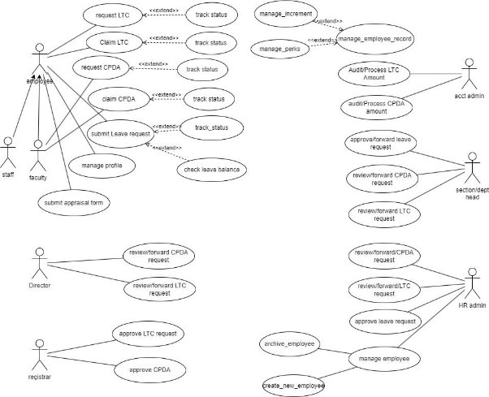

2. **Use case description**
1. **Use Case #1**

|Use Case ID|UC#1|
| - | - |
|Use Case Name|LTC form submission|
|Description|This use case describes the interaction between Faculty/Staff with the system to apply for LTC.|
|Actor|Faculty/Staff|
|Precondition|The Faculty/Staff must be logged in to the system.|
|Main Flow|
1. Faculty/Staff clicks on the LTC option on the panel on the right side.

2. LTC request form opens where Faculty/Staff fills the details.

3. Faculty/Staff clicks on the submit button.
|
|Postcondition|Faculty/Staff is redirected to the requests page having pending status on LTC request.|
|Alternate Flow||
|Postcondition||
|Sub Flow||
|Postcondition||
2. **Use Case #2**

|Use Case ID|UC#2|
| - | - |
|Use Case Name|LTC approval|
|Description|This use case describes the interaction between the Registrar/Director with the system to approve or reject an LTC request.|
|Actor|Registrar/Director|

|Precondition|The Registrar/Director must be logged in the system.|
| - | :- |
|Main Flow|
1. The Registrar/Director clicks on the LTC option on the panel on the right side.

2. The Registrar/Director clicks on the LTC requests tab on the left side panel.

3. A list of requests opens up and the registrar/director opens a request.

4. The Registrar/Director clicks on the APPROVE button.
|
|Postcondition|
The Registrar/Director is redirected to the LTC request page.

Faculty/Staff can see the approved status on his profile.
|
|Alternate Flow|The Registrar/Director clicks on the REJECT button.|
|Postcondition|
The Registrar/Director is redirected to the LTC request page.

Faculty/Staff can see not approved status with remarks on his profile.
|
|Sub Flow||
|Postcondition||
3. **Use Case #3**

|Use Case ID|UC#3|
| - | - |
|Use Case Name|CPDA form submission|
|Description|This use case describes the interaction between Faculty/Staff with the system to apply for CPDA.|
|Actor|Faculty/Staff|
|Precondition|The Faculty/Staff must be logged in to the system.|

|Main Flow|
1. Faculty/Staff clicks on the CPDA option on the panel on the right side.

2. CPDA request form opens where Faculty/Staff fills the details.

3. Faculty/Staff clicks on the submit button.
|
| - | :- |
|Postcondition|Faculty/Staff is redirected to the requests page having pending status on CPDA request.|
|Alternate Flow||
|Postcondition||
|Sub Flow||
|Postcondition||
4. **Use Case #4**

|Use Case ID|UC#4|
| - | - |
|Use Case Name|CPDA HOD\_Recommendation|
|Description|This use case describes the interaction between the HOD with the system to forward a CPDA request,|
|Actor|HOD|
|Precondition|The HOD must be logged in the system.|
|Main Flow|
1. The HOD clicks on the CPDA option on the panel on the right side.

2. The HOD clicks on the CPDA requests tab on the left side panel.

3. A list of requests opens up and HOD opens a request.

4. The HOD clicks on the APPROVE button.
|
|Postcondition|
The HOD is redirected to the CPDA request page.

The application is forwarded to Estt. Section.
|

|Alternate Flow|The HOD clicks on the REJECT button.|
| - | - |
|Postcondition|
The HOD is redirected to the CPDA request page.

Faculty/Staff can see not approved status with remarks on their profile.
|
|Sub Flow||
|Postcondition||
5. **Use Case #5**

|Use Case ID|UC#5|
| - | - |
|Use Case Name|CPDA Estt. Section|
|Description|This use case describes the interaction between the AR/DR and Dealing Asstt. with the system to forward a CPDA request,|
|Actor|AR/DR, Dealing Asstt.|
|Precondition|The AR/DR, Dealing Asstt. must be logged in the system.|
|Main Flow|
1. The AR/DR, Dealing Asstt. clicks on the CPDA option on the panel on the right side.

2. The AR/DR, Dealing Asstt. clicks on the CPDA requests tab on the left side panel.

3. A list of requests open up and AR/DR, Dealing Asstt. opens a request.

4. The AR/DR, Dealing Asstt. clicks on the APPROVE button.
|
|Postcondition|
The AR/DR, Dealing Asstt. is redirected to the CPDA request page.

The application is forwarded to Internal Audit.
|
|Alternate Flow|The AR/DR, Dealing Asstt. clicks on the REJECT button.|
|Postcondition|The AR/DR, Dealing Asstt. is redirected to the CPDA request page.|

||Faculty/Staff can see not approved status with remarks on their profile.|
| :- | :- |
|Sub Flow||
|Postcondition||
6. **Use Case #6**

|Use Case ID|UC#6|
| - | - |
|Use Case Name|CPDA Internal Audit|
|Description|This use case describes the interaction between the AR/DR and Dealing Asstt. with the system to forward a CPDA request|
|Actor|AR/DR, Dealing Asstt.|
|Precondition|The AR/DR, Dealing Asstt. must be logged in the system.|
|Main Flow|
1. The AR/DR, Dealing Asstt. clicks on the CPDA option on the panel on the right side.

2. The AR/DR, Dealing Asstt. clicks on the CPDA requests tab on the left side panel.

3. A list of requests opens up and AR/DR, Dealing Asstt. opens a request.

4. The AR/DR, Dealing Asstt. clicks on the APPROVE button.
|
|Postcondition|
The AR/DR, Dealing Asstt. is redirected to the CPDA request page.

The application is forwarded to the Director.
|
|Alternate Flow|The AR/DR, Dealing Asstt. clicks on the REJECT button.|
|Postcondition|
The AR/DR, Dealing Asstt. is redirected to the CPDA request page.

Faculty/Staff can see not approved status with remarks on their profile.
|

|Sub Flow||
| - | :- |
|Postcondition||
7. **Use Case #7**

|Use Case ID|UC#7|
| - | - |
|Use Case Name|CPDA form approval|
|Description|This use case describes the interaction between the Director with the system to approve a CPDA request|
|Actor|Director|
|Precondition|The Director must be logged in to the system.|
|Main Flow|
1. The Director clicks on the CPDA option on the panel on the right side.

2. The Director clicks on the CPDA requests tab on the left side panel.

3. A list of requests opens up and the Director opens a request.

4. The Director clicks on the APPROVE button.
|
|Postcondition|
The Director is redirected to the CPDA request page.

Faculty/Staff can see the approved status on their profile.
|
|Alternate Flow|
5\. The AR/DR clicks on the REJECT

button.
|
|Postcondition|
The AR/DR is redirected to the CPDA request page.

Faculty/Staff can see not approved status with remarks on their profile.
|
|Sub Flow||
|Postcondition||
8. **Use Case #8**

|Use Case ID|UC#8|
| - | - |
|Use Case Name|Appraisal|
|Description|This use case describes the interaction between Faculty/Staff with the system to apply for Appraisal.|
|Actor|Faculty/Staff|
|Precondition|The faculty/staff must be logged in to the system.|
|Main Flow|
1. Faculty/Staff clicks on the Appraisal option on the panel on the right side.

2. The appraisal request form opens where Faculty/Staff fills in the details.

3. Faculty/Staff clicks on the submit button.
|
|Postcondition|Faculty/Staff is redirected to the requests page having pending status on Appraisal request.|
|Alternate Flow||
|Postcondition||
|Sub Flow||
|Postcondition||
9. **Use Case #9**

|Use Case ID|UC#9|
| - | - |
|Use Case Name|Review and Remarks|
|Description|This use case describes the interaction between the Director, HOD with the system to review and give remarks on an appraisal|

||request|
| :- | - |
|Actor|Director, HOD|
|Precondition|The Director, HOD must be logged in the system.|
|Main Flow|
1. The HOD, Director clicks on the Appraisal option on the panel on the right side.

2. The HOD, Director clicks on the Appraisal requests tab on the left side panel.

3. A list of requests opens up and the HOD, Director opens a request.

4. The HOD, Director clicks on the APPROVE button.
|
|Postcondition|
The Director, HOD is redirected to the Appraisal request page.

Faculty/Staff can see the submitted status on their profile along with the remarks provided.
|
|Alternate Flow||
|Postcondition||
|Sub Flow||
|Postcondition||
10. **Use Case #10**

|Use Case ID|UC#10|
| - | - |
|Use Case Name|Assign Reviewer|
|Description|This use case describes the interaction of the Admin with the system to assign applications to authorities to review and give remarks on an application.|
|Actor|Admin|
|Precondition|The Admin must be logged in the system.|

|Main Flow|
1. The Admin clicks on the CPDA/LTC/Appraisal option on the panel on the right side.

2. A list of requests opens up and the admin opens a request.

3. The Admin can assign the role of reviewing the application to other users by filling up a form.

4. The Admin clicks on the ASSIGN button.
|
| - | :- |
|Postcondition|The Admin is redirected to the requests page. Faculty/Staff can see the submitted status on their profile along with the remarks provided.|
|Alternate Flow||
|Postcondition||
|Sub Flow||
|Postcondition||
11. **Use Case #11**

|Use Case ID|UC#11|
| - | - |
|Use Case Name|LTC Estt. Section|
|Description|This use case describes the interaction between the AR/DR and Dealing Asstt. with the system to forward a LTC request,|
|Actor|AR/DR, Dealing Asstt.|
|Precondition|The AR/DR, Dealing Asstt. must be logged in the system.|
|Main Flow|
5. The AR/DR, Dealing Asstt. clicks on the LTC option on the panel on the right side.

6. The AR/DR, Dealing Asstt. clicks on the LTC requests tab on the left side panel.

7. A list of requests open up and AR/DR, Dealing Asstt. opens a request.

8. The AR/DR, Dealing Asstt. clicks on the APPROVE button.
|
|Postcondition|The AR/DR, Dealing Asstt. is redirected to the LTC request page.|

||The application is forwarded to Internal Audit.|
| :- | :- |
|Alternate Flow|The AR/DR, Dealing Asstt. clicks on the REJECT button.|
|Postcondition|
The AR/DR, Dealing Asstt. is redirected to the LTC request page.

Faculty/Staff can see not approved status with remarks on their profile.
|
|Sub Flow||
|Postcondition||
12. **Use Case #12**

|Use Case ID|UC#13|
| - | - |
|Use Case Name|LTC Internal Audit|
|Description|This use case describes the interaction between the AR/DR and Dealing Asstt. with the system to forward a LTC request|
|Actor|AR/DR, Dealing Asstt.|
|Precondition|The AR/DR, Dealing Asstt. must be logged in the system.|
|Main Flow|
5. The AR/DR, Dealing Asstt. clicks on the LTC option on the panel on the right side.

6. The AR/DR, Dealing Asstt. clicks on the LTC requests tab on the left side panel.

7. A list of requests opens up and AR/DR, Dealing Asstt. opens a request.

8. The AR/DR, Dealing Asstt. clicks on the APPROVE button.
|
|Postcondition|
The AR/DR, Dealing Asstt. is redirected to the LTC request page.

The application is forwarded to the Director.
|
|Alternate Flow|The AR/DR, Dealing Asstt. clicks on the REJECT button.|

|Postcondition|
The AR/DR, Dealing Asstt. is redirected to the LTC request page.

Faculty/Staff can see not approved status with remarks on their profile.
|
| - | :- |
|Sub Flow||
|Postcondition||
13. **Use Case #13**

|Use Case ID|UC#14|
| - | - |
|Use Case Name|LTC HOD\_Recommendation|
|Description|This use case describes the interaction between the HOD with the system to forward a LTC request,|
|Actor|HOD|
|Precondition|The HOD must be logged in the system.|
|Main Flow|
5. The HOD clicks on the LTC option on the panel on the right side.

6. The HOD clicks on the LTC requests tab on the left side panel.

7. A list of requests opens up and HOD opens a request.

8. The HOD clicks on the APPROVE button.
|
|Postcondition|
The HOD is redirected to the LTC request page.

The application is forwarded to Estt. Section.
|
|Alternate Flow|The HOD clicks on the REJECT button.|
|Postcondition|
The HOD is redirected to the LTC request page.

Faculty/Staff can see not approved status with remarks on their profile.
|
|Sub Flow||
|Postcondition||
3. **Other Functional Requirements**
1. **Integration with External Systems:**

The system should integrate with other existing systems within the institution for seamless data exchange and consistency.

2. **Data Backup and Recovery:**

Regular automated data backups should be performed to ensure data integrity and facilitate recovery in case of system failures.

3. **Security Measures:**

Implement security measures, such as encryption, to safeguard sensitive information stored in the system.

Regular security audits and vulnerability assessments should be conducted.

4. **Other Constraints**
1. **User Interfaces**
- Login Page:

  The system should have a secure login page for Faculty/Staff, Registrar/Director, HOD, AR/DR, Dealing Asstt., Director, and Admin.

  Usernames and passwords must be securely stored and validated.

- Dashboard:

  Each user role should have a personalized dashboard displaying relevant information and options based on their role (e.g., LTC requests, CPDA requests, Appraisal requests).

- Navigation Panel:

  A clear and intuitive navigation panel should be available to easily access different modules such as LTC, CPDA, Appraisal, and Admin functions.

- Request Forms:

  Request forms for LTC, CPDA, and Appraisal should be user-friendly with clear instructions and validation checks for mandatory fields.

  Input fields should be labeled appropriately, and the form should provide feedback on successful submission.

- Status Display:

  Users should be able to view the status of their requests on their profile or a dedicated page.

  Status labels (e.g., pending, approved, not approved) should be easily understandable.

- Approval/Rejection Actions:

  Buttons for actions like "APPROVE" and "REJECT" should be clearly visible and accessible to the relevant roles.

  Confirmation messages should be displayed after approval or rejection, and users should be redirected appropriately.

- Remarks Section:

  For roles that can provide remarks (e.g., Director, HOD), there should be a text area for entering comments during the approval or rejection process.

- Requests List:

  Lists of requests should be well-organized and easily filterable by status, date, or other relevant criteria.

  Clicking on a request should open a detailed view of the request.

- Assignment Form:

  The Admin interface should include a form for assigning applications to specific users for review.

  This form should be straightforward, with options to select the application type and the user to whom it is assigned.

- Error Handling:

  The system should provide clear error messages and guidance in case of invalid inputs or system errors.

- Security Measures:

  Ensure that the system implements secure authentication, authorization, and data encryption to protect user information.

- Responsiveness:

  The user interface should be responsive and accessible on different devices, including desktops, tablets, and mobile phones.

- User Help/Documentation:

  Provide a help section or documentation to guide users through the system functionalities and processes.

- Logout Functionality:

  Include a secure logout option to ensure user sessions are properly terminated.

- Accessibility:

  Ensure the user interface complies with accessibility standards to accommodate users with disabilities.

2. **Software (Tech) Stack Used**
- Flutter Framework
- Dart Programming Language
- Android Studio IDE/VS code (As Preferred)
- Git Version Control
4. **Non-Functional Requirements**
1. Performance:
- The system should be responsive and provide timely feedback to users during application submission, approval, and other interactions.
- Response time for critical operations, such as viewing and approving applications, should be within acceptable limits (e.g., 2 seconds).
2. Scalability:
- The system should be scalable to accommodate an increasing number of users and applications over time.
- It should handle concurrent user activities without significant degradation in performance.
3. Availability:
- The system should have a high level of availability, aiming for at least 99.9% uptime.
- Scheduled maintenance windows, if any, should be communicated to users in advance.
4. Reliability:
- The system should be reliable, minimizing the occurrence of system failures, crashes, or unexpected downtime.
  1. It should have mechanisms in place for quick recovery in case of failures.
5. Security:
   1. Data transmission and storage should be encrypted to ensure the confidentiality and integrity of sensitive information.
   1. Access controls should be robust, and user authentication should be secure.
6. Usability:
- The user interface should be intuitive, user-friendly, and accessible to individuals with disabilities.
- User interactions should follow industry standards and best practices.
7. Compatibility:
- The system should be compatible with commonly used web browsers (e.g., Chrome, Firefox, Safari) and devices (desktops, tablets, mobile phones).
- Accessibility standards (e.g., WCAG) should be followed to ensure compatibility with assistive technologies.
8. Compliance:
- The system should comply with relevant laws, regulations, and institutional policies.
- It should adhere to data protection and privacy standards applicable to the institution.
9. Auditability:
- The system should maintain logs and audit trails for all user actions and system events.
- Logs should be secure, tamper-evident, and accessible to authorized administrators.
10. Interoperability:
- The system should be interoperable with other systems and platforms used within the institution.
- Standard data exchange formats (e.g., JSON, XML) should be supported for integration.
11. Documentation:
- Comprehensive documentation should be provided for users, administrators, and developers.
- Documentation should include user guides, system architecture, and API documentation.
5. **Module dependencies with other fusion modules**
1. **UI Level**

The GAD-1 module will be seamlessly integrated into the Fusion interface, ensuring a cohesive user experience. Faculty/staff, approval authorities, and administrators will access their respective functionalities through a unified dashboard. The UI will be designed to allow users to navigate easily between LTC, CPDA, Appraisal, and Admin functions, providing a user-friendly and efficient interaction.

2. **DB Level Dependencies**

At the database level, the GAD-1 module shares relevant data with other Fusion modules. Specifically, data related to user profiles, application statuses, and approval/rejection remarks will be stored and accessed across modules. Careful consideration will be given to ownership and user roles associated with shared data to maintain data integrity and security.

**5.3. Module Level Dependencies File Tracking Module:**

The HR module's entire form and request forwarding logic will rely on the API provided by the File Tracking System module in FusionIIIT. This API integration ensures seamless coordination, enabling effective tracking of various form and request statuses.

**Notification Module:**

To maintain a synchronized and timely response to requests, the Notification Module will play a vital role. The HR module will utilize the Notification Module's API to inform concerned actors about the submission and status updates of requests made by faculty/staff. This integration ensures that all relevant parties stay informed and can respond promptly.

**Dashboards Module:**

Access and interaction with CPDA, LTC, and appraisal forms/requests will be centralized through the Dashboards Module. All actors, including faculty/staff and administrators, will utilize this module to navigate and manage requests efficiently. This centralized approach enhances user experience and streamlines the overall workflow within the HR module.

**Appendix A – LTC Form![ref1]**

**PDPM**
**Indian Institute of Information Technology, Design & Manufacturing Jabalpur**

**(An Institute Established by MHRD, Govt. of India)**

**Dumna Airport Road, PO: Khamaria, Jabalpur 482 005 India**

**APPLICATION FOR GRANT OF L.T.C (TO BE SUBMITTED IN DUPLICATE)**

Block year: P.F. No………………………… Basic Pay

Rs…… ……… ………

1. Name\_\_\_\_\_\_\_\_\_\_\_\_\_\_\_\_\_\_\_\_\_\_\_\_\_\_\_\_\_\_\_\_\_\_\_\_\_\_\_\_\_\_\_\_\_\_\_\_\_\_\_\_\_\_\_
1. Designation\_\_\_\_\_\_\_\_\_\_\_\_\_\_\_\_\_\_\_\_\_\_\_\_\_\_\_\_\_\_\_\_\_\_\_\_\_\_\_\_\_\_\_\_\_\_\_\_\_\_\_
1. Department/Section\_\_\_\_\_\_\_\_\_\_\_\_\_\_\_\_\_\_\_\_\_\_\_\_\_\_\_\_\_\_\_\_\_\_\_\_\_\_\_\_\_\_\_\_\_
1. (a) Whether leave is required for availing L.T.C.? Yes\_\_\_\_\_\_\_\_\_\_\_\_\_\_\_\_\_\_ No:\_\_\_\_\_\_\_\_\_\_\_\_ (b) (i) If so, duration of leave applied for From\_\_\_\_\_\_\_\_\_\_\_\_\_\_\_\_\_\_ To:\_\_\_\_\_\_\_\_\_\_\_\_\_ (ii) Date of departure of family, if not availing himself \_\_\_\_\_\_\_\_\_\_\_\_\_\_\_\_\_\_\_\_\_\_\_ (c) Nature of leave\_\_\_\_\_\_\_\_\_\_\_\_\_\_\_\_\_\_\_\_\_\_\_\_\_\_\_\_\_\_\_\_

(d) Purpose\_\_\_\_\_\_\_\_\_\_\_\_\_\_\_\_\_\_\_\_\_\_\_\_\_\_\_\_\_\_\_\_\_\_\_\_\_\_\_

5. Whether L.T.C. is desired for going to home town or elsewhere? Home Town/Elsewhere (The place of the visit be also mentioned) Place
5. Address during leave\_\_\_\_\_\_\_\_\_\_\_\_\_\_\_\_\_\_\_\_\_\_\_\_\_\_\_\_\_\_\_\_\_\_\_\_\_\_\_\_\_\_\_\_\_\_\_\_\_\_\_\_\_\_\_\_\_\_\_ \_ \_\_\_\_\_\_\_\_\_\_\_\_\_\_\_\_\_\_\_\_\_\_\_\_\_\_\_\_\_\_\_\_\_\_\_\_\_\_\_\_\_\_\_\_\_\_\_\_\_\_\_\_\_\_\_\_\_\_\_\_ \_\_\_\_\_\_\_\_\_\_\_\_\_\_\_\_\_\_\_\_\_\_\_\_\_\_\_\_\_\_\_\_\_\_\_\_\_\_\_\_\_\_\_\_\_\_\_\_\_\_\_\_\_\_\_\_\_\_\_\_ 7. Mode: Rail/Road \_\_\_\_\_\_\_\_\_\_\_\_\_\_\_\_\_\_\_\_\_\_\_\_\_\_\_\_\_\_\_\_\_\_\_\_\_\_\_\_\_\_\_\_\_\_\_\_\_\_\_\_\_\_\_\_\_\_\_\_

   8\.

1) Details of family members for whom L.T.C. for this block has already been availed: a. \_\_\_\_\_\_\_\_\_\_\_\_\_\_\_\_\_\_\_\_\_\_\_\_\_\_\_\_\_\_\_\_\_\_\_
2. \_\_\_\_\_\_\_\_\_\_\_\_\_\_\_\_\_\_\_\_\_\_\_\_\_\_\_\_\_\_\_\_\_\_\_
2. \_\_\_\_\_\_\_\_\_\_\_\_\_\_\_\_\_\_\_\_\_\_\_\_\_\_\_\_\_\_\_\_\_\_\_
2) Details of family members who will avail L.T.C.
1) Self
1) Wife
1) Children

|S. No.|Full Name|Age|
| - | - | - |
||||
||||
||||
||||
||||
||||

|S. No.|Full Name|Age|Why fully dependent?|
| - | - | - | - |
|||||
|||||
|||||
|||||
|||||
|||||
4) Dependent parents, minor brothers, and sisters residing with the applicant: 9 Amount of advance required, if any:

   (i) Certified that family members for whom the L.T.C. is claimed are residing with me and are wholly dependent upon me.

   ii) Certified that the previous L.T.C. advance drawn by me on ……………………….. has been adjusted in the month of ………………………...............................................................................

10. Date: \_\_\_/\_\_\_/\_\_\_\_\_
10. Phone Number for contact \_\_\_\_\_\_\_\_\_\_\_\_\_\_\_\_\_\_\_\_ Signature
12. Specific recommendation of the Head of Department/Section

Approved/ Not Approved

Director/ Registrar

**Appendix B – CPDA Form![ref1]**

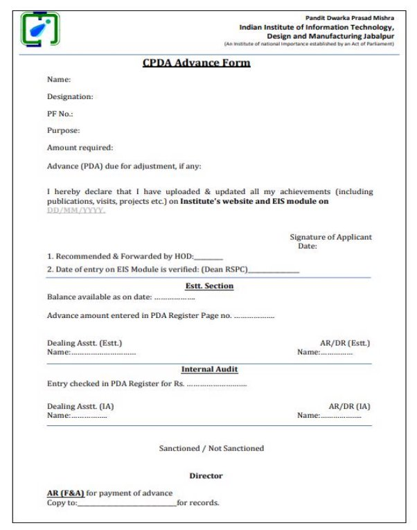

**Appendix C – Appraisal Form**

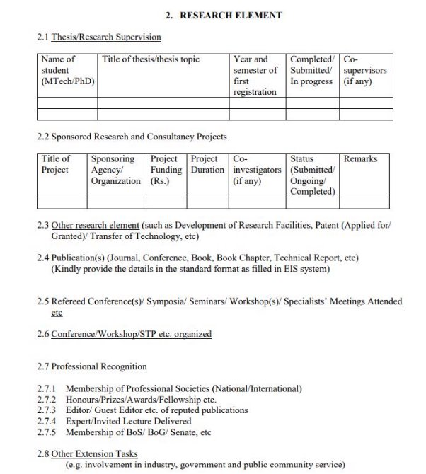

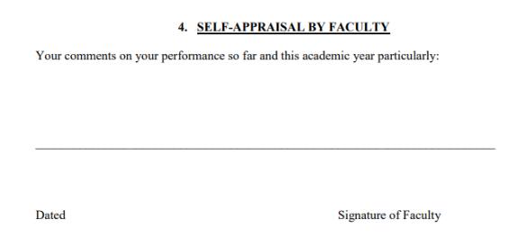

## SRS Web Interface

Prepared by (**Web Team**):

Tushar Solanki(21bcs224) Akshay Pahuja(21bcs017) Samyak Jain(21bcs184) Arpit Yadav(21bcs035) Arpit Kumar(21bcs033)

**Table of Contents**

**Introduction**

Introduction about Fusion Purpose of the module Scope of the module

**Use case/Actor Description Functional Requirements**

Use Case Diagram

Use Case Description

Other Functional Requirements Other constraints

- User Interfaces
- Software (Tech) Stack Used
- Business rules (if any)

**Non Functional Requirement**

**Module dependencies with other fusion modules**

UI level

DB level Dependencies Module level dependencies

**Introduction![ref1]**

In this section, we present a comprehensive overview of the contents of this Software Requirements Specification (SRS) document. It encompasses the scope, providing a detailed description of what is covered, and an overview that outlines the key elements included. The purpose of this document is outlined, emphasizing its role in specifying the requirements for the software under consideration.

Additionally, we furnish a list of abbreviations and definitions to ensure clarity and understanding throughout the document. This section serves as a guide for readers, offering a roadmap to navigate the subsequent details and specifications outlined in the SRS document.

**Purpose**

This document serves to provide a detailed description of the requirements for the "HR-1" module within the "Fusion" software. Its main purpose is to outline the system's objectives, constraints, and specifications, serving as a proposal for customer approval and a reference guide for the development team as they embark on creating the initial version of the system. By offering clear insights, it aims to establish a shared understanding among stakeholders regarding the envisioned functionalities of the "HR-1" module in the broader context of the "Fusion" software.

**Product Scope**

The HR-1 module consists of many activities. This software product will have a limited scope as some of the activities are taken care of by other software. This software will take care of the following activities:

- CPDA (Cumulative Professional Development Allowance)
- LTC (Leave Travel Concession)
- Appraisal

**Definitions, Acronyms, and Abbreviations**

Table 1 - Definitions

|**Term**|**Definition**|
| - | - |

|User|Someone who interacts with the application.|
| - | - |
|LTC|Leave Travel Concession|
|CPDA|Cumulative Professional Development Allowance|
|Appraisal|A formal assessment of the performance of an employee over a particular period.|
|Faculty|The teaching or research staff of university departments|
|Staff|All the people employed by a particular organization.|
|Director|A person who is in charge of an organization.|
|Dealing Asstt.|Deals with the receipts.|
|HOD|Head of Department|
|AR|Assistant Registrar|
|DR|Deputy Registrar|
|Stakeholder|Any person who has interaction with the system who is not a developer.|
|Registrar|An official is responsible for keeping a register or official records.|
|SRS|Software Requirements Specification|
|Admin|Assigns reviewers to applications.|

**References and Acknowledgments**

1. IEEE Software Engineering Standards Committee, “IEEE Std 830-1998, IEEE Recommended Practice for Software Requirements Specifications”, October 20, 1998.
1. “Fusion” - Open Source Software, https://github.com/FusionIIIT/Fusion

**User/Actor Description![ref1]**

Three types of users interact with the system: Users of the module, Approval Authorities, and Administrators. Each of these three types of users has a different use of the system so each of them has its own requirements.

**Faculty/Staff :**

Faculty/Staff members interact with the system to initiate various requests such as Appraisal, CPDA (Continuing Professional Development Activity), and LTC (Leave Travel Concession).

**Role**: They are applicants in different submission processes, seeking Appraisal assessment, professional development activities, or leave travel concessions.

**General Functionalities:**

- Faculty/Staff must log in to access respective functionalities.
- Click on the relevant option (Appraisal,CPDA,or LTC) to access the request form.
- Fill in details on the request form and submit the form.
- Redirected to the requests page with a pending status for the respective request.

**HR Admin :**

The HR Admin is a system user with elevated privileges responsible for assigning applications to reviewers.

**Role**: The Admin manages the application review process, assigning reviewers to assess applications.

**General Functionalities:**

- Log in to access administrative functions.
- Assign reviewers to applications by filling out a form.
- Open and manage a list of application requests.
- Faculty/Staff can view submission status and remarks on their profiles.
- Manages and updates Employee records.

**Director/Registrar :**

The Director/Registrar is a pivotal role in the system responsible for approving or rejecting LTC (Leave Travel Concession) and CPDA (Continuing Professional Development Activity) requests.

**Role**: They hold the authority to review and make decisions on LTC and CPDA requests, ensuring compliance and appropriateness.

**General Functionalities**:

- The Director/Registrar must log in to access their respective functionalities.
- Click on the relevant option (LTC or CPDA) to view the list of requests.
- Open a specific request and click on the APPROVE or REJECT button accordingly.
- Faculty/Staff can see the approved status on their profile after approval or the not approved status with remarks if rejected.

**Note** : Director manages requests from faculty and Registrar manages requests from Staff.

**HOD :**

- View the list of CPDA, LTC or Appraisal requests.
- Approves(forwards) or rejects the requests.
- Be redirected to the relevant request page.
- Faculty/Staff can see the submitted status and remarks on their profile after appraisal approval.
- For CPDA requests, forward the approved application to the Estt. Section.

**Accountant :**

- The Accountant manages audits, updates and reconciles financial transactions, ensuring accuracy and compliance.
- Conduct financial audits and implement corrective actions.
- Record, reconcile, and update financial transactions related to LTC and CPDA.

**Functional Requirements![ref1]**

**Use Case Diagram :**

**Use Case Description :**

**Use Case #1**

|Use Case ID|UC#1|
| - | - |
|Use Case Name|LTC form submission|
|Description|This use case describes the interaction between Faculty/Staff with the system to apply for LTC.|
|Actor|Faculty/Staff|
|Precondition|The Faculty/Staff must be logged in to the system.|
|Main Flow|
1. Faculty/Staff clicks on the LTC option on the panel on the right side.

2. LTC request form opens where Faculty/Staff fills the details.

3. Faculty/Staff clicks on the submit button.
|
|Postcondition|Faculty/Staff is redirected to the requests page having pending status on LTC request.|
|Alternate Flow||
|Postcondition||
|Sub Flow||
|Postcondition||
**Use Case #2**

|Use Case ID|UC#2|
| - | - |
|Use Case Name|LTC approval|
|Description|This use case describes the interaction between the Registrar/Director with the system to approve or reject an LTC request.|
|Actor|Registrar/Director|
|Precondition|The Registrar/Director must be logged in the system.|
|Main Flow|
1. The Registrar/Director clicks on the LTC option on the panel on the right side.

2. The Registrar/Director clicks on the LTC requests tab on the left side panel.

3. A list of requests opens up and the registrar/director opens a request.

4. The Registrar/Director clicks on the APPROVE button.
|
|Postcondition|
The Registrar/Director is redirected to the LTC request page.

Faculty/Staff can see the approved status on his profile.
|
|Alternate Flow|The Registrar/Director clicks on the REJECT button.|
|Postcondition|
The Registrar/Director is redirected to the LTC request page.

Faculty/Staff can see not approved status with remarks on his profile.
|
|Sub Flow||
|Postcondition||
**Use Case #3**

|Use Case ID|UC#3|
| - | - |
|Use Case Name|CPDA form submission|
|Description|This use case describes the interaction between Faculty/Staff with the system to apply for CPDA.|
|Actor|Faculty/Staff|
|Precondition|The Faculty/Staff must be logged in to the system.|
|Main Flow|
1. Faculty/Staff clicks on the CPDA option on the panel on the right side.

2. CPDA request form opens where Faculty/Staff fills the details.

3. Faculty/Staff clicks on the submit button.
|
|Postcondition|Faculty/Staff is redirected to the requests page having pending status on CPDA request.|
|Alternate Flow||
|Postcondition||
|Sub Flow||
|Postcondition||
**Use Case #4**

|Use Case ID|UC#4|
| - | - |
|Use Case Name|HOD\_Recommendation|
|Description|This use case describes the interaction between the HOD with the system to forward a CPDA request,|
|Actor|HOD|
|Precondition|The HOD must be logged in the system.|
|Main Flow|
1. The HOD clicks on the CPDA option on the panel on the right side.

2. The HOD clicks on the CPDA requests tab on the left side panel.

3. A list of requests opens up and HOD opens a request.

4. The HOD clicks on the APPROVE button.
|
|Postcondition|
The HOD is redirected to the CPDA request page.

The application is forwarded to Estt. Section.
|
|Alternate Flow|The HOD clicks on the REJECT button.|
|Postcondition|
The HOD is redirected to the CPDA request page.

Faculty/Staff can see not approved status with remarks on their profile.
|
|Sub Flow||
|Postcondition||

**Use Case #5**

|Use Case ID|UC#5|
| - | - |
|Use Case Name|Estt. Section|
|Description|This use case describes the interaction between the AR/DR and Dealing Asstt. with the system to forward a CPDA request,|
|Actor|AR/DR, Dealing Asstt.|
|Precondition|The AR/DR, Dealing Asstt. must be logged in the system.|
|Main Flow|
1. The AR/DR, Dealing Asstt. clicks on the CPDA option on the panel on the right side.

2. The AR/DR, Dealing Asstt. clicks on the CPDA requests tab on the left side panel.

3. A list of requests open up and AR/DR, Dealing Asstt. opens a request.

4. The AR/DR, Dealing Asstt. clicks on the APPROVE button.
|
|Postcondition|
The AR/DR, Dealing Asstt. is redirected to the CPDA request page.

The application is forwarded to Internal Audit.
|
|Alternate Flow|The AR/DR, Dealing Asstt. clicks on the REJECT button.|
|Postcondition|
The AR/DR, Dealing Asstt. is redirected to the CPDA request page.

Faculty/Staff can see not approved status with remarks on their profile.
|
|Sub Flow||
|Postcondition||

**Use Case #8****
|Use Case ID|UC#6|
| - | - |
|Use Case Name|Internal Audit|
|Description|This use case describes the interaction between the AR/DR and Dealing Asstt. with the system to forward a CPDA request|
|Actor|AR/DR, Dealing Asstt.|
|Precondition|The AR/DR, Dealing Asstt. must be logged in the system.|
|Main Flow|
1. The AR/DR, Dealing Asstt. clicks on the CPDA option on the panel on the right side.

2. The AR/DR, Dealing Asstt. clicks on the CPDA requests tab on the left side panel.

3. A list of requests opens up and AR/DR, Dealing Asstt. opens a request.

4. The AR/DR, Dealing Asstt. clicks on the APPROVE button.
|
|Postcondition|
The AR/DR, Dealing Asstt. is redirected to the CPDA request page.

The application is forwarded to the Director.
|
|Alternate Flow|The AR/DR, Dealing Asstt. clicks on the REJECT button.|
|Postcondition|
The AR/DR, Dealing Asstt. is redirected to the CPDA request page.

Faculty/Staff can see not approved status with remarks on their profile.
|
|Sub Flow||
|Postcondition||

|Use Case ID|UC#7|
| - | - |
|Use Case Name|CPDA form approval|
|Description|This use case describes the interaction between the Director with the system to approve a CPDA request|
|Actor|Director|
|Precondition|The Director must be logged in to the system.|
|Main Flow|
1. The Director clicks on the CPDA option on the panel on the right side.

2. The Director clicks on the CPDA requests tab on the left side panel.

3. A list of requests opens up and the Director opens a request.

4. The Director clicks on the APPROVE button.
|
|Postcondition|
The Director is redirected to the CPDA request page.

Faculty/Staff can see the approved status on their profile.
|
|Alternate Flow|
5\. The AR/DR clicks on the REJECT

button.
|
|Postcondition|
The AR/DR is redirected to the CPDA request page.

Faculty/Staff can see not approved status with remarks on their profile.
|
|Sub Flow||
|Postcondition||

|Use Case ID|UC#8|
| - | - |
|Use Case Name|Appraisal|
|Description|This use case describes the interaction between Faculty/Staff with the system to apply for Appraisal.|
|Actor|Faculty/Staff|
|Precondition|The faculty/staff must be logged in to the system.|
|Main Flow|
1. Faculty/Staff clicks on the Appraisal option on the panel on the right side.

2. The appraisal request form opens where Faculty/Staff fills in the details.

3. Faculty/Staff clicks on the submit button.
|
|Postcondition|Faculty/Staff is redirected to the requests page having pending status on Appraisal request.|
|Alternate Flow||
|Postcondition||
|Sub Flow||
|Postcondition||

**Use Case #9**

|Use Case ID|UC#9|
| - | - |
|Use Case Name|Review and Remarks|
|Description|This use case describes the interaction between the Director, HOD with the system to review and give remarks on an appraisal request|
|Actor|Director, HOD|
|Precondition|The Director, HOD must be logged in the system.|
|Main Flow|
1. The HOD, Director clicks on the Appraisal option on the panel on the right side.

2. The HOD, Director clicks on the Appraisal requests tab on the left side panel.

3. A list of requests opens up and the HOD, Director opens a request.

4. The HOD, Director clicks on the APPROVE button.
|
|Postcondition|
The Director, HOD is redirected to the Appraisal request page.

Faculty/Staff can see the submitted status on their profile along with the remarks provided.
|
|Alternate Flow||
|Postcondition||
|Sub Flow||
|Postcondition||

**Use Case #10****

|Use Case ID|UC#10|
| - | - |
|Use Case Name|Assign Reviewer|
|Description|This use case describes the interaction of the Admin with the system to assign applications to authorities to review and give remarks on an application.|
|Actor|Admin|
|Precondition|The Admin must be logged in the system.|
|Main Flow|
1. The Admin clicks on the CPDA/LTC/Appraisal option on the panel on the right side.

2. A list of requests opens up and the admin opens a request.

3. The Admin can assign the role of reviewing the application to other users by filling up a form.

4. The Admin clicks on the ASSIGN button.
|
|Postcondition|The Admin is redirected to the requests page. Faculty/Staff can see the submitted status on their profile along with the remarks provided.|
|Alternate Flow||
|Postcondition||
|Sub Flow||
|Postcondition||

**Other Functional Requirements:**

1. **Notification:**

Automate HR event alerts for employees, enhancing communication and engagement.

2. **Superuser/Admin Access:**

Grant elevated access to HR personnel for efficient system management.

3. **Form Editing:**

Enable employees to digitally edit HR forms, streamlining updates for data accuracy.

4. **Form Downloading:**

Enable employees to download the forms approved by the competent authority.

**Other Constraints: User Interfaces:**

The user interface should comply with the color scheming and dashboard design of the FUSIONIIT. Users should be able to navigate from one functionality to another. Inter module navigation should be smooth. All the functionalities should be easy to use and no specific training should be required for the usage of the module.

**Software (Tech) Stack Used: Frontend:**

**HTML**: The application's user interface is developed using HTML for structuring Web content

**CSS**: Styling in our application

**Backend:**

**Django**: Python web framework employed for building the application's back-end logic, facilitating efficient development and integration.

**Database:**

**PostgreSQL**: The relational database management system (RDBMS) used for storing and managing application data with a focus on scalability and performance.

**Version Control:** Git **Deployment:** Docker

**Business rules:**

1. Users must authenticate using a valid username and password to access the

system.

2. Different user roles (e.g., admin, faculty, student) have distinct access permissions,

and access is restricted based on these roles.

3. The system must comply with data privacy regulations, ensuring that sensitive user information is securely stored and accessed only by authorized personnel.

   4. Uploaded files must follow a specific naming convention for consistency and easier

management.

**Non-Functional Requirements** :

**Performance**: The system should be scalable for concurrent users and for huge data volumes of different actors.

**Reliability:** The system should have availability and Fault-tolerant error handling.

**Security**: Data encryption for sensitive information and role-based access control should be there in the product to ensure security.

**Usability:** The product will have a consistent and intuitive user interface. **Scalability:** Database scalability for courses and users. **Maintainability:** Modular architecture for easy updates.

**Module dependencies with other fusion modules : UI Level:**

The HR module can be accessed from the dashboard (the very first page after login) by the faculty, staff, and competent authorities or from the sidebar.

**DB Level Dependencies: Module Level Dependencies:**

GAD4, OS3 and GAD5 modules are having interactions with our module. Especially on GAD4 (File tracking module) for forwarding the requests.

**Appendix A – LTC Form![ref2]**

**PDPM**

**Indian Institute of Information Technology, Design & Manufacturing Jabalpur**

**(An Institute Established by MHRD, Govt. of India)**

**Dumna Airport Road, PO: Khamaria, Jabalpur 482 005 India**

**APPLICATION FOR GRANT OF L.T.C (TO BE SUBMITTED IN DUPLICATE)**

Block year: P.F. No………………………… Basic Pay

Rs………

…………

…

1. Name\_\_\_\_\_\_\_\_\_\_\_\_\_\_\_\_\_\_\_\_\_\_\_\_\_\_\_\_\_\_\_\_\_\_\_\_\_\_\_\_\_\_\_\_\_\_\_\_\_\_\_\_\_\_\_
1. Designation\_\_\_\_\_\_\_\_\_\_\_\_\_\_\_\_\_\_\_\_\_\_\_\_\_\_\_\_\_\_\_\_\_\_\_\_\_\_\_\_\_\_\_\_\_\_\_\_\_\_\_
1. Department/Section\_\_\_\_\_\_\_\_\_\_\_\_\_\_\_\_\_\_\_\_\_\_\_\_\_\_\_\_\_\_\_\_\_\_\_\_\_\_\_\_\_\_\_\_\_
1. (a) Whether leave is required for availing L.T.C.? Yes\_\_\_\_\_\_\_\_\_\_\_\_\_\_\_\_\_\_ No:\_\_\_\_\_\_\_\_\_\_\_\_ (b) (i) If so, duration of leave applied for From\_\_\_\_\_\_\_\_\_\_\_\_\_\_\_\_\_\_ To:\_\_\_\_\_\_\_\_\_\_\_\_\_ (ii) Date of departure of family, if not availing himself \_\_\_\_\_\_\_\_\_\_\_\_\_\_\_\_\_\_\_\_\_\_\_ (c) Nature of leave\_\_\_\_\_\_\_\_\_\_\_\_\_\_\_\_\_\_\_\_\_\_\_\_\_\_\_\_\_\_\_\_

(d) Purpose\_\_\_\_\_\_\_\_\_\_\_\_\_\_\_\_\_\_\_\_\_\_\_\_\_\_\_\_\_\_\_\_\_\_\_\_\_\_\_

5. Whether L.T.C. is desired for going to home town or elsewhere? Home

Town/Elsewhere (The place of the visit be also mentioned) Place

6. Address during leave\_\_\_\_\_\_\_\_\_\_\_\_\_\_\_\_\_\_\_\_\_\_\_\_\_\_\_\_\_\_\_\_\_\_\_\_\_\_\_\_\_\_\_\_\_\_\_\_\_\_\_\_\_\_\_\_\_ \_\_\_ \_\_\_\_\_\_\_\_\_\_\_\_\_\_\_\_\_\_\_\_\_\_\_\_\_\_\_\_\_\_\_\_\_\_\_\_\_\_\_\_\_\_\_\_\_\_\_\_\_\_\_\_\_\_\_\_\_\_\_\_ \_\_\_\_\_\_\_\_\_\_\_\_\_\_\_\_\_\_\_\_\_\_\_\_\_\_\_\_\_\_\_\_\_\_\_\_\_\_\_\_\_\_\_\_\_\_\_\_\_\_\_\_\_\_\_\_\_\_\_\_
6. Mode: Rail/Road \_\_\_\_\_\_\_\_\_\_\_\_\_\_\_\_\_\_\_\_\_\_\_\_\_\_\_\_\_\_\_\_\_\_\_\_\_\_\_\_\_\_\_\_\_\_\_\_\_\_\_\_\_\_\_\_\_\_\_\_

   8\.

1) Details of family members for whom L.T.C. for this block has already been availed: a. \_\_\_\_\_\_\_\_\_\_\_\_\_\_\_\_\_\_\_\_\_\_\_\_\_\_\_\_\_\_\_\_\_\_\_
   2. \_\_\_\_\_\_\_\_\_\_\_\_\_\_\_\_\_\_\_\_\_\_\_\_\_\_\_\_\_\_\_\_\_\_\_
   2. \_\_\_\_\_\_\_\_\_\_\_\_\_\_\_\_\_\_\_\_\_\_\_\_\_\_\_\_\_\_\_\_\_\_\_
1) Details of family members who will avail L.T.C.
1) Self
1) Wife
1) Children

   |S. No.|Full Name|Age|
   | - | - | - |
   ||||
   ||||
   ||||
   ||||
   ||||
   ||||
4) Dependent parents, minor brothers, and sisters residing with the applicant:

|S. No.|Full Name|Age|Why fully dependent?|
| - | - | - | - |
|||||
|||||
|||||

|||||
| :- | :- | :- | :- |
|||||
|||||
9 Amount of advance required, if any:

(i) Certified that family members for whom the L.T.C. is claimed are residing with me and are wholly dependent upon me. \_\_\_\_\_\_\_\_\_\_\_\_\_\_\_\_\_\_\_\_\_\_\_\_\_\_\_\_\_\_\_\_\_\_\_\_\_\_\_\_\_\_\_\_\_\_\_\_\_\_\_\_\_\_\_\_\_\_\_\_\_\_\_\_\_\_\_\_\_\_ \_\_\_\_\_\_\_\_\_\_\_\_\_\_\_ (ii) Certified that the previous L.T.C. advance drawn by me on ……………………….. has been adjusted in the month of ………………………...............................................................................

10. Date: \_\_\_/\_\_\_/\_\_\_\_\_
10. Phone Number for contact \_\_\_\_\_\_\_\_\_\_\_\_\_\_\_\_\_\_\_\_ Signature
12. Specific recommendation of the Head of Department/Section

Approved/ Not Approved

Director/ Registrar

**Appendix B – CPDA Form![ref2]**

**Appendix C – Appraisal Form![ref2]**

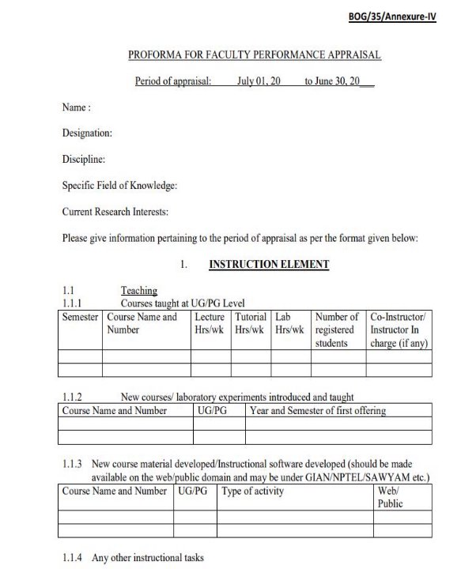

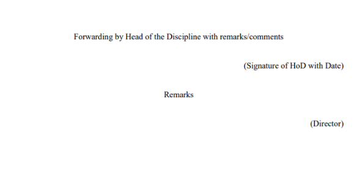

## API Specifications

**Module Name** – GAD1 (HR MODULE)

**Faculty Mentor: Dr. Aparajita Ojha Project Head: Dr Atul Gupta**

**Student Mentor** – Sanapala Anudeep (21BCS185) (Web)

Priyansh Prajapati (21BCS166) (App)

TEAM MEMBERS:

Web:

21bcs017 – Akshay Pahuja 21bcs033 – Arpit Kumar 21bcs035 – Arpit Yadav 21bcs184 – Samyak Jain 21bcs224 – Tushar Solanki

App:

21bcs077 – Dhruv Ghevariya 21bcs045 – Avdhesh Kumar 21bcs117 – Kishan Patel 21bcs140 – Naman Bhagat 21bcs151 – Omkar Wadekar

**API Documentation of GAD1 - HR Module**

**APIs in the module**

1. employee/submit\_ltc/ : Not Implemented
1. employee/approve\_ltc/id : Not Implemented
1. employee/reject\_ltc/id : Not Implemented
1. employee/forward\_ltc/id : Not Implemented
1. employee/track\_status\_ltc/id : Not Implemented
1. employee/withdraw\_ltc/id : Not Implemented
1. employee/view\_assigned\_ltc/id : Not Implemented
8. hr\_admin/assign\_reviewer\_ltc/id : Not Implemented.
8. hr\_admin/assign\_reviewer\_cpda/id : Not Implemented.
8. hr\_admin/assign\_reviewer\_appraisal/id : Not Implemented.
8. hr\_admin/assign\_reviewer\_leave\_application/id : Not Implemented.
8. hr\_admin/view\_ltc\_requests/id : Not Implemented.
8. hr\_admin/view\_cpda\_requests/id : Not Implemented.
8. hr\_admin/view\_appraisal\_requests/id : Not Implemented.
8. hr\_admin/view\_leave\_application/id : Not Implemented.
8. employee/submit\_leave\_application/ : Not Implemented.
8. employee/approve\_leave\_application/id : Not Implemented.
8. employee/reject\_leave\_application/id : Not Implemented. 19.employee/forward\_leave\_application/id : Not Implemented.
20. employee/track\_status\_leave\_application/id : Not Implemented.
20. employee/withdraw\_leave\_application/id : Not Implemented. 22.employee/view\_assigned\_leave\_applications/id : Not Implemented.
23. hr\_admin/get\_all\_emp\_records/id : Not Implemented.
23. hr\_admin/edit\_emp\_details/id : Not Implemented.
23. hr\_admin/create\_new/id : Not Implemented.
23. hr\_admin/archive\_emp/id : Not Implemented.
23. employee/submit\_cpda/ : Not Implemented.
23. employee/approve\_cpda/id : Not Implemented
23. employee/reject\_cpda/id : Not Implemented 30.employee/forward\_cpda/id : Not Implemented
31. employee/withdraw\_cpda/id : Not Implemented
31. employee/track\_status\_cpda/id : Not Implemented 33.employee/view\_assigned\_cpda/id : Not Implemented
34. employee/track\_status\_appraisal/ : Not Implemented
34. employee/submit\_appraisal/id : Not Implemented
34. employee/approve\_appraisal/id : Not Implemented
34. employee/reject\_appraisal/id : Not Implemented 38.employee/forward\_appraisal/id : Not Implemented
39. employee/withdraw\_appraisal/id : Not Implemented
39. employee/view\_assigned\_appraisal/id : Not Implemented

**Overview of the module:-**

GAD-1 Module is software designed to manage different administrative procedures related to the faculties of PDPM IIITDM Jabalpur.

The software is designed to provide automated features to the faculties and Administration Staff, to handle different faculties’ activities.

The different activities that come under this module are CPDA, LTC, and Appraisal.

The HR-1 module consists of many activities. This software product will have a limited scope as some of the activities are taken care of by other software. This software will take care of the following activities:

- CPDA (Cumulative Professional Development Allowance)
- LTC (Leave Travel Concession)
- Leave Application
- Appraisal

**APIs:-**

- **Already Implemented (**API’s are not yet implemented **)**

No API’s are implemented

- **Yet to be implemented or Partially Working** (API is not implemented so yet to be implemented or API is partially working i.e it has breakage.)

●

- LTC form submission
  - Index of apis used - 1, 5, 6
  - Description - Employee should be able to submit the LTC form after filling it.
  - Database - No table created
- LTC approval
- Index of apis used - 2, 3
- Description - Director should be able to approve or reject the LTC request.

■ Database - No table created

- CPDA form submission
  - Index of apis used - 27,31,32
  - Description - Employees should be able to submit the CPDA form after filling it.
  - Database - No table created
- CPDA HOD recommendation
  - Index of apis used - 29 ,30
  - Description - Assigned HOD should be able to forward the CPDA request to the Estt section.
  - Database - No table created
- CPDA ESTT section
  - Index of apis used - 29 , 30
  - Description - Assigned AR/DR should be able to forward the CPDA request to the Director.
  - Database - No table created
- CPDA Internal Audit
  - Index of apis used - 29 , 30
  - Description - Assigned AR/DR should be able to process the request application and forward the CPDA request to the Director.
  - Database - No table created
- CPDA form Approval
- Index of apis used - 28
- Description - Director should be able to approve or reject the CPDA form application.
- Database - No table created

- Appraisal
  - Index of apis used - 34 , 35, 39
  - Description - Employees should be able to apply for the appraisal by filling the form and submitting it.
  - Database - no table created
- Review and Remarks
  - Index of apis used - NONE
  - Description - Director and/or HOD should be able to review and give remarks on the appraisal request.
  - Database - No table created
- Assign reviewer
  - Index of apis used - 8,9,10,11
  - Description - HR Admin should be able to assign the different applications to the competent authorities for review and further procedure.
  - Database - No table created
- LTC Estt. Section
- Index of apis used - 3 , 4
- Description - Assigned AR/DR should be able to forward the LTC request to the Director.
- Database - No table created
- LTC Internal Audit
- Index of apis used - 3, 4
- Description - Assigned AR/DR should be able to process the request application and forward the LTC request to the Director.
- Database - No table created
- LTC HOD Recommendation
- Index of apis used - 3, 4
- Description - Assigned HOD should be able to forward the LTC request to the Estt section.
- Database - No table created
- Leave HOD Recommendation
  - Index of apis used - 18, 19
  - Description - Assigned HOD should be able to forward the leave application request to the Estt section.
  - Database - No table created
- Leave Estt. Section
  - Index of apis used - 18, 19
  - Description - Assigned AR/DR should be able to process the request and forward the leave application to the Director.
  - Database - No table created
- Leave Form Submission
- Index of apis used - 16 , 20 ,21
- Description: Employee should be able to submit the leave application form.
- Database - No table created

**Current problems you are facing with the module or in its use cases —**

- HR module not visible in right panel for faculty and staff
- APIs not implemented
- None of the use cases implemented
- Notifications not implemented
- Error handling not done
- REST framework not implemented (This will help in correctly implementing APIs)

**Google Doc Link : [https://docs.google.com/document/d/1mxz9Aaec3tUOlzOg_lp3NKL47ssxwRFA4ON UIEBB8es/edit?usp=sharing](https://docs.google.com/document/d/1mxz9Aaec3tUOlzOg_lp3NKL47ssxwRFA4ONUIEBB8es/edit?usp=sharing)**

## UI for Application

**Figma Profiles for GAD1-HR Module.**

1. **Module Description:**
1. Purpose of the module
- GAD-1 Module is software designed to manage different administrative procedures related to the faculties of PDPM IIITDM Jabalpur.
- The software is designed to provide automated features to the faculties and Administration Staff, to handle different faculties’ activities.
- The different activities that come under this module are CPDA, LTC, Appraisal and Leave.
2. Scope of the module
- The HR-1 module consists of many activities. This software product will have a limited scope as some of the activities are taken care of by other software. This software will take care of the following activities:
  - **CPDA (Cumulative Professional Development Allowance)**
  - **LTC (Leave Travel Concession)**
  - **Appraisal**
  - **Leave Application**

**Link to the SRS document:**

[https://docs.google.com/document/d/1lTsrDdmzvhmeGmX6wGZWXqneyihhgllv/edit?usp=sharin g&ouid=104740427720178212197&rtpof=true&sd=true](https://docs.google.com/document/d/1lTsrDdmzvhmeGmX6wGZWXqneyihhgllv/edit?usp=sharing&ouid=104740427720178212197&rtpof=true&sd=true)

**Link to the API status document:**

https://docs.google.com/document/d/1mxz9Aaec3tUOlzOg\_lp3NKL47ssxwRFA4ONUIEBB8es/ edit?usp=sharing

2. **Actors**
1. **Actor #1**

**Director**: A person who oversees an organization. Approves/declines the assigned CPDA, LTC, Appraisal and Leave applications based on reviews and recommendations received by the application during previous steps.

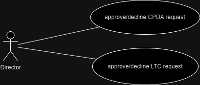

Figma Profiles:

[https://www.figma.com/file/2UGHHPKcJzpYQp5CHLyIj6/PR-GAD-1-HR?type=design&node-i d=0-1&mode=design&t=lXMwc1NttLJeV35P-0](https://www.figma.com/file/2UGHHPKcJzpYQp5CHLyIj6/PR-GAD-1-HR?type=design&node-id=0-1&mode=design&t=lXMwc1NttLJeV35P-0)

2. **Actor #2:**

**HOD**: Head of Department.

**Section Head**: Head of administrative sections of the organization. Forwards/declines/recommends the assigned CPDA, LTC, Appraisal and Leave applications.

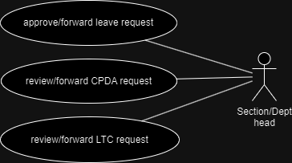

Figma Profiles:

[https://www.figma.com/file/2UGHHPKcJzpYQp5CHLyIj6/PR-GAD-1-HR?type=design&n ode-id=0-1&mode=design&t=lXMwc1NttLJeV35P-0](https://www.figma.com/file/2UGHHPKcJzpYQp5CHLyIj6/PR-GAD-1-HR?type=design&node-id=0-1&mode=design&t=lXMwc1NttLJeV35P-0)

3. **Actor #3:**

**Employee:** Applies for LTC, CPDA, leave on the application. Submits appraisal forms. Tracks status of all kinds of requests/applications on the application.They can also view,manage and update their profile with latest details using the application.

**Faculty**: The teaching or research staff of university departments. **Staff**: All the people employed by a particular organization.

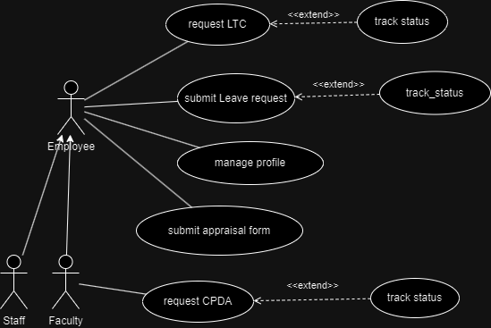

Figma Profiles:

[https://www.figma.com/file/2UGHHPKcJzpYQp5CHLyIj6/PR-GAD-1-HR?type=design&n ode-id=0-1&mode=design&t=lXMwc1NttLJeV35P-0](https://www.figma.com/file/2UGHHPKcJzpYQp5CHLyIj6/PR-GAD-1-HR?type=design&node-id=0-1&mode=design&t=lXMwc1NttLJeV35P-0)

4. **Actor #4:**

**Account Administrator (Dealing Asstt./ AR / DR)**: Deals with audit operations and processes. Manages and maintains an official record of all financial transactions in the organization. Approves/forwards/declines the requests/applications for LTC and CPDA based on employee’s account balance.

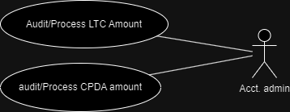

Figma Profiles:

[https://www.figma.com/file/2UGHHPKcJzpYQp5CHLyIj6/PR-GAD-1-HR?type=design&n ode-id=0-1&mode=design&t=lXMwc1NttLJeV35P-0](https://www.figma.com/file/2UGHHPKcJzpYQp5CHLyIj6/PR-GAD-1-HR?type=design&node-id=0-1&mode=design&t=lXMwc1NttLJeV35P-0)

5. **Actor #5:**

**Estt. Administrator(Dealing Asstt. / AR / DR)**: Manages and maintains an official record of employees and their personal as well as professional details.Forwards/declines the requests/applications for LTC, CPDA, leave based on previous records of employees. Assign applications to authorities for them to review and provide remarks on an application.

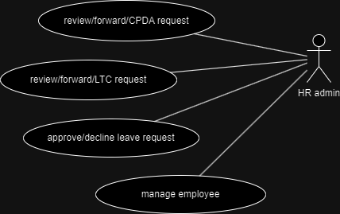

Figma Profiles:

[https://www.figma.com/file/2UGHHPKcJzpYQp5CHLyIj6/PR-GAD-1-HR?type=design&n ode-id=0-1&mode=design&t=lXMwc1NttLJeV35P-0](https://www.figma.com/file/2UGHHPKcJzpYQp5CHLyIj6/PR-GAD-1-HR?type=design&node-id=0-1&mode=design&t=lXMwc1NttLJeV35P-0)

6. **Actor #6:**

**Registrar**: An official who is responsible for keeping a register or official records. Approves/declines LTC, CPDA applications based on the reviews and recommendations received by the application during previous steps.

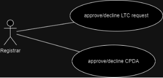

Figma Profiles:

[https://www.figma.com/file/2UGHHPKcJzpYQp5CHLyIj6/PR-GAD-1-HR?type=design&n ode-id=0-1&mode=design&t=lXMwc1NttLJeV35P-0](https://www.figma.com/file/2UGHHPKcJzpYQp5CHLyIj6/PR-GAD-1-HR?type=design&node-id=0-1&mode=design&t=lXMwc1NttLJeV35P-0)

**Link to this document:**

https://docs.google.com/document/d/1I8OwRkfAY0KGW\_7M9EP\_TJ8vf68b8LJg4K0j84dXRl8/e dit?usp=sharing

## UI for Web

**Module Name** – GAD1 (HR MODULE)

**Faculty Mentor: Dr. Aparajita Ojha Project Head: Dr Atul Gupta**

**Student Mentor** – Sanapala Anudeep (21BCS185) TEAM MEMBERS:

21bcs017 – Akshay Pahuja 21bcs033 – Arpit Kumar 21bcs035 – Arpit Yadav 21bcs184 – Samyak Jain 21bcs224 – Tushar Solanki

**Figma Profiles for GAD1-HR Module.**

1. **Module Description:**
1. Purpose of the module
- GAD-1 Module is software designed to manage different administrative procedures related to the faculties of PDPM IIITDM Jabalpur.
- The software is designed to provide automated features to the faculties and Administration Staff, to handle different faculties’ activities.
- The different activities that come under this module are CPDA, LTC, Appraisal and Leave.
2. Scope of the module
- The HR-1 module consists of many activities. This software product will have a limited scope as some of the activities are taken care of by other software. This software will take care of the following activities:
  - **CPDA (Cumulative Professional Development Allowance)**
  - **LTC (Leave Travel Concession)**
  - **Appraisal**
  - **Leave Application**

**Link to the SRS document:**

[https://docs.google.com/document/d/1ePd5JiKC0IjT2eeO_3pQhL3AMuk1jXhONDJNs7ZjYj4/edi t?usp=drivesdk](https://docs.google.com/document/d/1ePd5JiKC0IjT2eeO_3pQhL3AMuk1jXhONDJNs7ZjYj4/edit?usp=drivesdk)

**Link to the API status document:**

[https://docs.google.com/document/d/1mxz9Aaec3tUOlzOg_lp3NKL47ssxwRFA4ONUIEBB8es/ edit?usp=sharing](https://docs.google.com/document/d/1mxz9Aaec3tUOlzOg_lp3NKL47ssxwRFA4ONUIEBB8es/edit?usp=sharing)

2. **Actors**
1. **Actor #1**

**Director**: A person who oversees an organization. Approves/declines the assigned CPDA, LTC, Appraisal and Leave applications based on reviews and recommendations received by the application during previous steps.

**USE CASE #2, USE CASE #7, USE CASE #9**

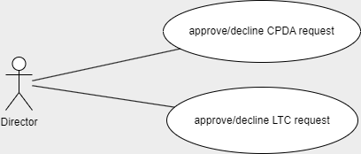

Figma Profiles:

[https://www.figma.com/file/sfnvW03B3gjIinVUdzyX7g/HR-module?type=design&node-id=0% 3A1&mode=design&t=80viHeXO3Ctyxn9O-1](https://www.figma.com/file/sfnvW03B3gjIinVUdzyX7g/HR-module?type=design&node-id=0%3A1&mode=design&t=80viHeXO3Ctyxn9O-1)

2. **Actor #2:**

**HOD**: Head of Department.

**Section Head**: Head of administrative sections of the organization. Forwards/declines/recommends the assigned CPDA, LTC, Appraisal and Leave applications. **USE CASE #4, USE CASE #9, USE CASE #13, USE CASE #14**

Figma Profiles:

[https://www.figma.com/file/sfnvW03B3gjIinVUdzyX7g/HR-module?type=design&node-id =0%3A1&mode=design&t=80viHeXO3Ctyxn9O-1](https://www.figma.com/file/sfnvW03B3gjIinVUdzyX7g/HR-module?type=design&node-id=0%3A1&mode=design&t=80viHeXO3Ctyxn9O-1)

3. **Actor #3:**

**Employee:** Applies for LTC, CPDA, leave on the application. Submits appraisal forms. Tracks status of all kinds of requests/applications on the application.They can also view,manage and update their profile with latest details using the application.

**Faculty**: The teaching or research staff of university departments. **Staff**: All the people employed by a particular organization.

**USE CASE #1, USE CASE #3, USE CASE #8, USE CASE #16**

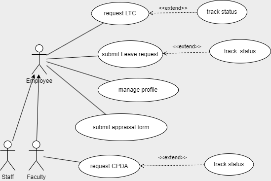

Figma Profiles:

[https://www.figma.com/file/sfnvW03B3gjIinVUdzyX7g/HR-module?type=design&node-id =0%3A1&mode=design&t=80viHeXO3Ctyxn9O-1](https://www.figma.com/file/sfnvW03B3gjIinVUdzyX7g/HR-module?type=design&node-id=0%3A1&mode=design&t=80viHeXO3Ctyxn9O-1)

4. **Actor #4:**

**Account Administrator (Dealing Asstt./ AR / DR)**: Deals with audit operations and processes. Manages and maintains an official record of all financial transactions in the organization. Approves/forwards/declines the requests/applications for LTC and CPDA based on employee’s account balance.

**USE CASE #5, USE CASE #6, USE CASE #11, USE CASE #12, USE CASE #15**

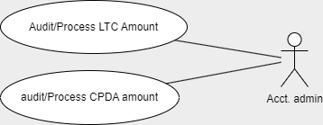

Figma Profiles:

[https://www.figma.com/file/sfnvW03B3gjIinVUdzyX7g/HR-module?type=design&node-id =0%3A1&mode=design&t=80viHeXO3Ctyxn9O-1](https://www.figma.com/file/sfnvW03B3gjIinVUdzyX7g/HR-module?type=design&node-id=0%3A1&mode=design&t=80viHeXO3Ctyxn9O-1)

5. **Actor #5:**

**HR Admin**: Manages and maintains an official record of employees and their personal as well as professional details.Forwards/declines the requests/applications for LTC, CPDA, leave based on previous records of employees. Assign applications to authorities for them to review and provide remarks on an application.

**USE CASE #10**

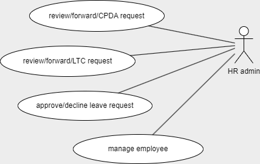

Figma Profiles:

[https://www.figma.com/file/sfnvW03B3gjIinVUdzyX7g/HR-module?type=design&node-id =0%3A1&mode=design&t=80viHeXO3Ctyxn9O-1](https://www.figma.com/file/sfnvW03B3gjIinVUdzyX7g/HR-module?type=design&node-id=0%3A1&mode=design&t=80viHeXO3Ctyxn9O-1)

6. **Actor #6:**

**Registrar**: An official who is responsible for keeping a register or official records. Approves/declines LTC, CPDA applications based on the reviews and recommendations received by the application during previous steps.

**USE CASE #2**

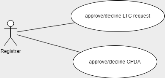

Figma Profiles:

[https://www.figma.com/file/sfnvW03B3gjIinVUdzyX7g/HR-module?type=design&node-id =0%3A1&mode=design&t=80viHeXO3Ctyxn9O-1](https://www.figma.com/file/sfnvW03B3gjIinVUdzyX7g/HR-module?type=design&node-id=0%3A1&mode=design&t=80viHeXO3Ctyxn9O-1)

**Link to this document:**

[https://docs.google.com/document/d/1tJ_ah1cM4WFMNw6wE3Ful3pC5bV04gaqKSZMOq9UW QQ/edit?usp=sharing](https://docs.google.com/document/d/1tJ_ah1cM4WFMNw6wE3Ful3pC5bV04gaqKSZMOq9UWQQ/edit?usp=sharing)

## Database Schema
**Module Name - HR (GAD-1)**

**Faculty Mentor - Dr. Aparajita Ojha**

**Student Mentor - Sanapala Anudeep(21bcs185) - Web**

**Prepared by (Web Team):**

**Tushar Solanki (21bcs224) Akshay Pahuja (21bcs017) Samyak Jain (21bcs184) Arpit Yadav (21bcs035) Arpit Kumar (21bcs033)**

**Database Documentation of [** GAD-1 - HR **]**

**Overview of the Module:**

GAD-1 Module is software designed to manage different administrative procedures related to the faculties of PDPM IIITDM Jabalpur.

The software is designed to provide automated features to the faculties and Administration Staff, to handle different faculties’ activities.

The different activities that come under this module are CPDA, LTC, and Appraisal.

The HR-1 module consists of many activities. This software product will have a limited scope as some of the activities are taken care of by other software. This software will take care of the following activities:

- CPDA (Cumulative Professional Development Allowance)
- LTC (Leave Travel Concession)
- Appraisal

**SRS Link:** ([https://docs.google.com/document/d/1ePd5JiKC0IjT2eeO_3pQhL3AMuk1jXhONDJNs7 ZjYj4/edit?usp=drivesdk ](https://docs.google.com/document/d/1ePd5JiKC0IjT2eeO_3pQhL3AMuk1jXhONDJNs7ZjYj4/edit?usp=drivesdk))

1. **ER Diagram : [GAD-1_HR_ER diagram**](https://app.diagrams.net/#G1xWNFfPgTKE-m2lck3OAKJRRsykxpuYQ5)**
1. **Database Schema Info : [GAD-1_HR_Database Schema**](https://docs.google.com/spreadsheets/d/1JaKz16HD2gT6FXPB2cWDpG-Bs04LEpjEYyVupj4V5Jc/edit?usp=sharing)**
3. **The changes required in the currently implemented Tables:**
- None of the Table is implemented.
4. **Data Availability for API and Functional Testing D.1 Tables that are already populated**
- None of the table is populated

**D.2 Tables required to be populated**

- LTC
- CPDA
- Appraisal
- Leave
