# Authentication Module Documentation

## Table of Contents
- [User-Centered Design (UCD)](#user-centered-design-ucd)
- [SRS Application](#srs-application)
- [SRS Web Interface](#srs-web-interface)
- [API Specifications](#api-specifications)
- [UI for Application](#ui-for-application)
- [UI for Web](#ui-for-web)
- [Database Schema](#database-schema)

## User-Centered Design (UCD)
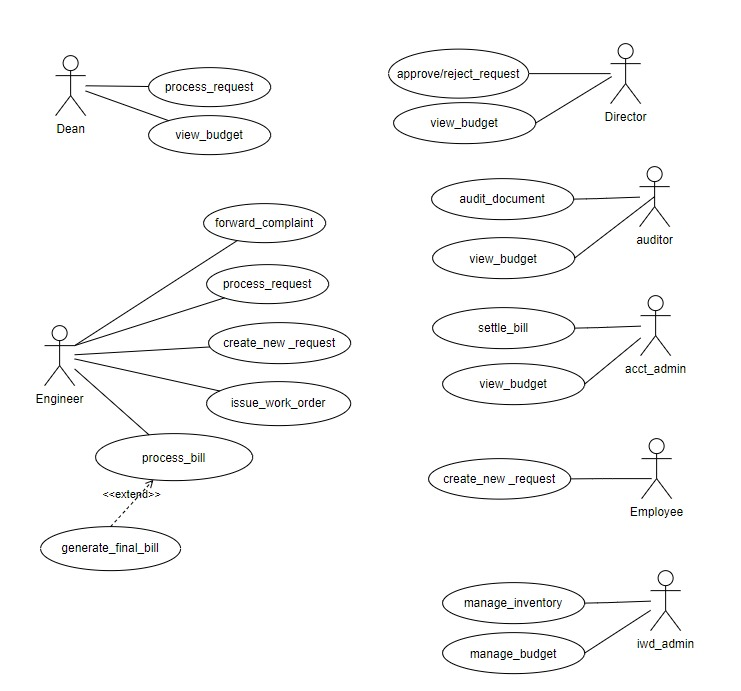

## SRS Application
# Institute Work Department ERP 

# Software Requirements Specification 

**Faculty Mentor:**  Dr Durgesh Singh  Student Mentor:  Gagan Singh - 21BCS084 

**Prepared by:**            

Kunal Raj – 21BCS118 Vidyadhar - 21BCS239 

Rishabh Nigam – 21BCS173 Kunal Marmat – 21BSM030 Vijay Kumar Saharan - 21BCS240 

## **1 Introduction** 

**1. Introduction about the Institute Work Department ERP** 

Fusion IIIT exemplifies the seamless integration and automation of diverse functions within the realm of Android development at PDPM IIITDM JABALPUR. Developed with precision using Python 3.8 and driven by the Django framework for the backend and Flutter for frontend, this initiative is a student-led venture designed to enhance the institute's operational capabilities in the Android app development sphere. From client administration management to academic prowess and various departmental tasks, Fusion IIIT serves as a comprehensive solution that harmonizes the intricacies of Android development.  

Visualize it as a digital wizard specifically tailored for the world of Android app development. It not only streamlines administrative processes but also ensures a smoother workflow for app development projects. Fusion IIIT extends its reach beyond conventional tasks, delving into various departments and sections to guarantee the seamless execution of every aspect of Android development on campus. On the administrative side, it adeptly manages complex paperwork and processes, while on the development side, it introduces efficiency to coding and project management. Fusion IIIT is more than just a development tool; it acts as a supportive companion, ensuring that the Android development environment at PDPM IIITDM Jabalpur operates seamlessly.  

In essence, Fusion IIIT for Android development is more than a mere tool – it's a dedicated ally that contributes to making the app development process at PDPM IIITDM Jabalpur more organized and enjoyable for everyone involved. 

**2. Purpose of the module** 

The IWD Module, seamlessly integrated into Fusion, assumes a dedicated role in overseeing the maintenance of campus property to ensure its efficient and effective upkeep. This specialized module takes on the primary responsibility of not only monitoring the condition of on-site assets but also promptly addressing any malfunctions that may arise. In doing so, it plays a crucial role in guaranteeing the smooth functioning of all physical elements on the campus, contributing to a well-maintained and operational environment. 

**3. Scope of the module**

The IWD module is integral to campus property management, going beyond basic maintenance. It ensures not only the preservation of assets but also implements strategic measures for enhanced efficiency. Proactively addressing issues related to malfunctioning property, the module optimizes overall functionality. Additionally, through meticulous planning and resource coordination, it contributes to a well-equipped and seamlessly operating campus environment. This comprehensive approach enhances the overall effectiveness and sustainability of campus infrastructure, fostering an optimal environment for learning and various activities within the campus community. 

## 2 User/Actor characteristics 

**1. Dean**

Role: Processes the requests from the engineer and passes it on to the director and he is the one who audits the final bill generated. 

Specific Functionalities: 

1. Efficiently processes the requests from the engineer.
1. Audits the final bill and keeps a comprehensive record of all the items used.  
**2. Director** 

Role: The director is the one who approves or rejects the requests from the engineer, processed by the dean.  

Specific Functionalities: 

1. Efficiently processes the requests from the engineer.
1. Audits the final bill and keeps a comprehensive record of all the items used. 

  **3. Auditor**

Role: The auditor reviews all submitted documents comprehensively. Specific Functionalities: 

1. The auditor reviews all the documents.
1. The auditor verifies the authenticity and accuracy of all the submitted documents.  
**4. Account Admin**

**Role:** The account admin settles the bill generated from the engineer and then sends it to the dean for a final audit. 

Specific Functionalities: 

1. The account admin settles the generated bill. 
1. The auditor verifies the authenticity of all the items mentioned in the bill. 
**5. Employee**

**Role:** The employee initiates a new work request.                                                    Specific Functionalities: 

1\. The employee can raise a new work request if there is a malfunction in any of the property. 

**6. IWD Admin**

**Role:** The IWD Admin oversees the inventory, providing engineers with access to manage and utilize the available resources. 

Specific Functionalities: 

1\.The IWD Admin manages the inventory. 

2\.The IWD Admin provides all the resources available to the engineers. 

**7. Complaint Manager**

**Role:** The complaint manager is responsible for forwarding the complaints received to the relevant authorities. 

Specific Functionalities: 

1\. The Complaint Manager systematically organizes, and stores all received complaints for easy reference. 

**8. Engineer**

**Role:** The Engineer initiates a new service request, issues the corresponding work order, facilitates the processing of the associated bill to be submitted to higher authorities. 

Specific Functionalities: 

1. The Engineer initiates a new request and the corresponding work order. 
1. The Engineer processes the bill to the higher authorities. 

3 Functional Requirements 

1. Use Case Diagram

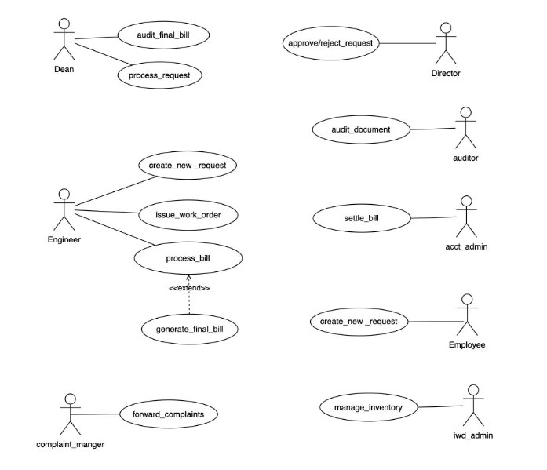

## 2. Use Case Description

This section describes each use case Description in the use case diagram in all details. 

1\. 
|UC ID |UC #1 |
| - | - |
|Use Case Name  |create\_new\_request  |
|Description  |The “Create new request” use case is used to create a new request to the higher authorities. |
|Actor  |Engineer, Employee |
|Precondition  |The engineer or the employee is logged into the portal. |

<table><tr><th colspan="1"></th><th colspan="2"></th></tr>
<tr><td colspan="1" rowspan="4" valign="top">Main Flow  </td><td colspan="1">M1 </td><td colspan="1" valign="top">The employee or the engineer goes to the “Create new request” tab. </td></tr>
<tr><td colspan="1">M2 </td><td colspan="1" valign="top">
They fill all the necessary and relevant Informa on 

related to their request. 
</td></tr>
<tr><td colspan="1">M3 </td><td colspan="1" valign="top">They click on the submit button. </td></tr>
<tr><td colspan="1">M4 </td><td colspan="1" valign="bottom">The request is now submitted to the higher authorities. </td></tr>
</table>

||||
| :- | :- | :- |
|Post Condi on  |The request is now submitted to the higher authority. ||
|Sub Flow  |NIL  ||
|Global Alternate Flow  |GA1 |
If a technical error occurs during the execution of any action (e.g., database failure, server issues), the

` `system displays an error message, and the request will not be submitted. 
|

2\. 

<table><tr><th colspan="1" valign="top"><b>UC ID</b> </th><th colspan="2" valign="top">UC#2 </th></tr>
<tr><td colspan="1"><b>Mark as read</b> <b>Use Case Name</b> </td><td colspan="2" valign="top">Issue_work_order </td></tr>
<tr><td colspan="1" valign="top"><b>Description</b> </td><td colspan="2" valign="bottom">The “issue_work_order” use case is used to Issue work order after the engineer’s or the employee's request is approved. </td></tr>
<tr><td colspan="1" valign="top"><b>Actor</b> </td><td colspan="2" valign="bottom">Engineer </td></tr>
<tr><td colspan="1" valign="top"><b>Precondition</b> </td><td colspan="2" valign="top">The engineer should be logged into the portal and the request must be approved by the director. </td></tr>
<tr><td colspan="1" rowspan="2" valign="top"><b>Main Flow</b> </td><td colspan="1">1 </td><td colspan="1" valign="bottom">The request is approved by the higher authorities. </td></tr>
<tr><td colspan="1">2 </td><td colspan="1" valign="bottom">Then the engineer issues the corresponding work order for the approved request. </td></tr>
</table>

|**Post conditions** |The work order for the approved request is issued. ||
| - | :- | :- |
|**Sub Flow** |NIL ||

3\. 

||**UC ID** |UC#3 |
| :- | - | - |
||**Use Case Name** |Process\_bill |
||**Description** |
The “process\_bill” use case is used 

To list down all the items used and submit it to the higher 
|
|||Authorities for verification. |

<table><tr><th colspan="1"></th><th colspan="1"><b>Actor</b> </th><th colspan="1"></th><th colspan="3" valign="top">Engineer </th></tr>
<tr><td colspan="1"></td><td colspan="1"><b>Precondition</b> </td><td colspan="1"></td><td colspan="3" valign="top">The engineer should be logged into the Portal and the bill must be generated. </td></tr>
<tr><td colspan="1"></td><td colspan="1"></td><td colspan="1"></td><td colspan="3"></td></tr>
<tr><td colspan="1"></td><td colspan="1"></td><td colspan="1"></td><td colspan="1" valign="top">1 </td><td colspan="2" valign="top">The engineer should navigate to the “Process_Bill” Section. </td></tr>
<tr><td colspan="1" rowspan="2"></td><td colspan="1" rowspan="2" valign="top"><b>Main flow</b> </td><td colspan="1"></td><td colspan="1"></td><td colspan="2"></td></tr>
<tr><td colspan="1"></td><td colspan="1" valign="top">2 </td><td colspan="2">The engineer should then submit the bill of all the </td></tr>
<tr><td colspan="1"></td><td colspan="1"></td><td colspan="1"></td><td colspan="1"></td><td colspan="2" valign="top">items used. </td></tr>
<tr><td colspan="1"></td><td colspan="1"></td><td colspan="1"></td><td colspan="1"></td><td colspan="2"></td></tr>
<tr><td colspan="1"></td><td colspan="1"></td><td colspan="1"></td><td colspan="1" valign="top">3 </td><td colspan="2" valign="top">The engineer should submit the form. </td></tr>
<tr><td colspan="1"></td><td colspan="1"></td><td colspan="1"></td><td colspan="1"></td><td colspan="2"></td></tr>
<tr><td colspan="1"></td><td colspan="1"><b>Post conditions</b> </td><td colspan="1"></td><td colspan="3">The bill will be submitted to the higher authorities for a final audit. </td></tr>
<tr><td colspan="1"></td><td colspan="1" valign="top"><b>Global Alternate Flow</b> </td><td colspan="1"></td><td colspan="1"></td><td colspan="1"></td><td colspan="1">NIL </td></tr>
<tr><td colspan="1"></td><td colspan="1" valign="top"><b>Sub Flow</b> </td><td colspan="1"></td><td colspan="1"></td><td colspan="1"></td><td colspan="1">NIL </td></tr>
</table>

4\. 

||**UC ID** |UC#4 ||
| :- | - | - | :- |
||**Use case Name** |Audit\_final\_bill ||
||**Description** |The “audit\_final\_bill” use case is used to audit the bill submitted by the engineer. ||
|||||
||**Actor** |Dean ||
||**Precondition** |The dean should be logged into the portal and the bill should be submitted by the engineer. ||
|||||
||**Main Flow** |1 |The dean navigates to the “Bills” tab. |

|||2 |The dean then audits the bill. ||||
| :- | :- | - | - | :- | :- | :- |
||||||||
||**Post Condition** |The final bill will be generated. |||||
||||||||
||**Alternate Flow** |A1 |1 |There might be corrections needed in the bill, so the bill will be sent back to the |||
|||||engineer |||
|||||and |||
|||||will be asked to correct it. |||
||**Sub Flow** |NIL |||||
||**Global Alternate Flow** |NIL |||||
5\. 

||**UC ID** |UC#4 ||
| :- | - | - | :- |
||**Use case Name** |Process\_request ||
||**Description** |The “process\_request” use case is used to process the request created by the engineer and pass it on to the director for ||
|||approval ||
|||or rejection. ||
||**Actor** |Dean ||
||**Precondition** |The dean should be logged into the portal and there should be at least one new request created by the engineer. ||
|||||
||**Main Flow** |1 |The dean navigates to the “New\_Requests” tab. |

||2 |The dean processes the new request and sends it to the director. ||||
| :- | - | :- | :- | :- | :- |
|**Post Condition** |The processed request will be submitted to the director for approval or rejection. |||||
|**Alternate Flow** |A1 |1 |
The dean might not process the newly created 

request by the engineer. 
|||
|**Sub Flow** |NIL |||||
|**Global Alternate Flow** |NIL |||||
6\. 

<table><tr><th colspan="1"></th><th colspan="1"><b>UC ID</b> </th><th colspan="2">UC#4 </th></tr>
<tr><td colspan="1"></td><td colspan="1" valign="top"><b>Use case Name</b> </td><td colspan="2" valign="top">Approve/reject_request </td></tr>
<tr><td colspan="1"></td><td colspan="1" valign="top"><b>Description</b> </td><td colspan="2" valign="top">The “approve/reject_request” use case is used to approve or reject the request processed by the dean. </td></tr>
<tr><td colspan="1"></td><td colspan="1"></td><td colspan="2"></td></tr>
<tr><td colspan="1"></td><td colspan="1"><b>Actor</b> </td><td colspan="2" valign="top">Director </td></tr>
<tr><td colspan="1"></td><td colspan="1" valign="top"><b>Precondition</b> </td><td colspan="2" valign="top">The director should be logged into the portal and there should be at least one request processed by the dean. </td></tr>
<tr><td colspan="1"></td><td colspan="1"></td><td colspan="2"></td></tr>
<tr><td colspan="1"></td><td colspan="1" valign="top"><b>Main Flow</b> </td><td colspan="1" valign="top">1 </td><td colspan="1" valign="top">The director navigates to the “Requests” tab. </td></tr>
<tr><td colspan="1" rowspan="2"></td><td colspan="1" rowspan="2"></td><td colspan="1"></td><td colspan="1"></td></tr>
<tr><td colspan="1" valign="top">2 </td><td colspan="1" valign="top">The director then approves or rejects the request. </td></tr>
</table>

|**Post Condition** |The request if approved then will be passed on to the engineer to issue the work order. ||
| - | :- | :- |
|**Alternate Flow** |NIL ||
|**Sub Flow** |NIL ||
|**Global Alternate Flow** |NIL ||
7\. 

<table><tr><th colspan="1"></th><th colspan="1"><b>UC ID</b> </th><th colspan="4">UC#4 </th></tr>
<tr><td colspan="1"></td><td colspan="1" valign="top"><b>Use case Name</b> </td><td colspan="4" valign="top">Audit_document </td></tr>
<tr><td colspan="1"></td><td colspan="1" valign="top"><b>Description</b> </td><td colspan="4" valign="top">The “audit document” use case is used to audit all the submitted documents for their authenticity. </td></tr>
<tr><td colspan="1"></td><td colspan="1"></td><td colspan="4"></td></tr>
<tr><td colspan="1"></td><td colspan="1"><b>Actor</b> </td><td colspan="4" valign="top">Auditor </td></tr>
<tr><td colspan="1"></td><td colspan="1"><b>Precondition</b> </td><td colspan="4" valign="top">The auditor should be logged into the portal and there should be documents submitted to be verified. </td></tr>
<tr><td colspan="1"></td><td colspan="1"></td><td colspan="4"></td></tr>
<tr><td colspan="1"></td><td colspan="1" valign="top"><b>Main Flow</b> </td><td colspan="3" valign="top">1 </td><td colspan="1" valign="top">The auditor navigates to the “Documents” tab. </td></tr>
<tr><td colspan="1" rowspan="2"></td><td colspan="1" rowspan="2"></td><td colspan="3"></td><td colspan="1"></td></tr>
<tr><td colspan="3">2 </td><td colspan="1">The auditor then audits all the submitted </td></tr>
<tr><td colspan="1"></td><td colspan="1"></td><td colspan="3"></td><td colspan="1" valign="top">documents. </td></tr>
<tr><td colspan="1"></td><td colspan="1"></td><td colspan="3"></td><td colspan="1"></td></tr>
<tr><td colspan="1"></td><td colspan="2" valign="top"><b>Post Condition</b> </td><td colspan="3" valign="top">If the auditor feels the submitted documents are valid, he/she may ask the user to submit the documents again. </td></tr>
<tr><td colspan="1"></td><td colspan="2"><b>Alternate Flow</b> </td><td colspan="1">NIL </td><td colspan="2"></td></tr>
</table>

|**Sub Flow** |NIL ||
| - | - | :- |
|**Global Alternate Flow** |NIL ||
8\. 

<table><tr><th colspan="1"></th><th colspan="1"><b>UC ID</b> </th><th colspan="4">UC#4 </th></tr>
<tr><td colspan="1"></td><td colspan="1" valign="top"><b>Use case Name</b> </td><td colspan="4" valign="top">settle_bill </td></tr>
<tr><td colspan="1"></td><td colspan="1" valign="top"><b>Description</b> </td><td colspan="4" valign="top">The “settle_bill” use case is used to settle the bill and send it to the dean for further audits. </td></tr>
<tr><td colspan="1"></td><td colspan="1"></td><td colspan="4"></td></tr>
<tr><td colspan="1"></td><td colspan="1"><b>Actor</b> </td><td colspan="4" valign="top">account Admin </td></tr>
<tr><td colspan="1"></td><td colspan="1" valign="top"><b>Precondition</b> </td><td colspan="4" valign="top">The account admin should be logged into the portal. </td></tr>
<tr><td colspan="1"></td><td colspan="1"></td><td colspan="4"></td></tr>
<tr><td colspan="1"></td><td colspan="1" valign="top"><b>Main Flow</b> </td><td colspan="3" valign="top">1 </td><td colspan="1" valign="top">The account admin navigates to the “Bills” tab. </td></tr>
<tr><td colspan="1" rowspan="2"></td><td colspan="1" rowspan="2"></td><td colspan="3"></td><td colspan="1"></td></tr>
<tr><td colspan="3">2 </td><td colspan="1">The account admin then settles the final bill and </td></tr>
<tr><td colspan="1"></td><td colspan="1"></td><td colspan="3"></td><td colspan="1" valign="top">then sends it to the dean for a final audit. </td></tr>
<tr><td colspan="1"></td><td colspan="1"></td><td colspan="3"></td><td colspan="1"></td></tr>
<tr><td colspan="1"></td><td colspan="2" valign="top"><b>Post Condition</b> </td><td colspan="3" valign="top">The bill will be issued and then sent to the dean. </td></tr>
<tr><td colspan="1"></td><td colspan="2"></td><td colspan="3"></td></tr>
<tr><td colspan="1"></td><td colspan="2"><b>Alternate Flow</b> </td><td colspan="1">NIIL </td></tr>
<tr><td colspan="1"></td><td colspan="2"><b>Sub Flow</b> </td><td colspan="3">NIL </td></tr>
</table>

|**Global Alternate Flow** |NIL ||
| - | - | :- |
9\. 

<table><tr><th colspan="1"></th><th colspan="1"><b>UC ID</b> </th><th colspan="4">UC#4 </th></tr>
<tr><td colspan="1"></td><td colspan="1" valign="top"><b>Use case Name</b> </td><td colspan="4" valign="top">Manage inventory </td></tr>
<tr><td colspan="1"></td><td colspan="1" valign="top"><b>Description</b> </td><td colspan="4" valign="top">The “Manage inventory” use case is used to manage all the available resources by the IWD admin. </td></tr>
<tr><td colspan="1"></td><td colspan="1"></td><td colspan="4"></td></tr>
<tr><td colspan="1"></td><td colspan="1"><b>Actor</b> </td><td colspan="4" valign="top">IWD admin </td></tr>
<tr><td colspan="1"></td><td colspan="1" valign="top"><b>Precondition</b> </td><td colspan="4" valign="top">The IWD admin should be logged into the portal. </td></tr>
<tr><td colspan="1"></td><td colspan="1"></td><td colspan="4"></td></tr>
<tr><td colspan="1"></td><td colspan="1" valign="top"><b>Main Flow</b> </td><td colspan="3" valign="top">1 </td><td colspan="1" valign="top">The IWD admin navigates to the “Inventory” tab. </td></tr>
<tr><td colspan="1" rowspan="2"></td><td colspan="1" rowspan="2"></td><td colspan="3"></td><td colspan="1"></td></tr>
<tr><td colspan="3">2 </td><td colspan="1">The IWD admin then ensures all the important </td></tr>
<tr><td colspan="1"></td><td colspan="1"></td><td colspan="3"></td><td colspan="1" valign="top">resources are available and well managed. </td></tr>
<tr><td colspan="1"></td><td colspan="1"></td><td colspan="3"></td><td colspan="1"></td></tr>
<tr><td colspan="1"></td><td colspan="2" valign="top"><b>Post Condition</b> </td><td colspan="3" valign="top">The inventory is fully equipped. </td></tr>
<tr><td colspan="1"></td><td colspan="2"></td><td colspan="3"></td></tr>
<tr><td colspan="1"></td><td colspan="2"><b>Alternate Flow</b> </td><td colspan="1">NIL </td></tr>
<tr><td colspan="1"></td><td colspan="2"><b>Sub Flow</b> </td><td colspan="3">NIL </td></tr>
<tr><td colspan="1"></td><td colspan="2" valign="top"><b>Global Alternate Flow</b> </td><td colspan="1" valign="top">NIL </td><td colspan="2"></td></tr>
</table>

10\. 
<table><tr><th colspan="1"></th><th colspan="1"><b>UC ID</b> </th><th colspan="4">UC#4 </th></tr>
<tr><td colspan="1"></td><td colspan="1" valign="top"><b>Use case Name</b> </td><td colspan="4" valign="top">Forward complaints </td></tr>
<tr><td colspan="1"></td><td colspan="1" valign="top"><b>Description</b> </td><td colspan="4" valign="bottom">The “Forward complaints” use case is used to forward any complaint issued which is related to the property inside the </td></tr>
<tr><td colspan="1"></td><td colspan="1"></td><td colspan="4" valign="top">campus. </td></tr>
<tr><td colspan="1"></td><td colspan="1"><b>Actor</b> </td><td colspan="4" valign="top">Complaint manager </td></tr>
<tr><td colspan="1"></td><td colspan="1" valign="top"><b>Precondition</b> </td><td colspan="4" valign="top">The complaint manager should be logged into the portal and there should be complaints issued. </td></tr>
<tr><td colspan="1"></td><td colspan="1"></td><td colspan="4"></td></tr>
<tr><td colspan="1"></td><td colspan="1" valign="top"><b>Main Flow</b> </td><td colspan="3" valign="top">1 </td><td colspan="1">The complaint manager navigates to the </td></tr>
<tr><td colspan="1"></td><td colspan="1"></td><td colspan="3"></td><td colspan="1" valign="top">“Complaints” tab. </td></tr>
<tr><td colspan="1" rowspan="2"></td><td colspan="1" rowspan="2"></td><td colspan="3"></td><td colspan="1"></td></tr>
<tr><td colspan="3">2 </td><td colspan="1">The complaint manager then forwards the </td></tr>
<tr><td colspan="1"></td><td colspan="1"></td><td colspan="3"></td><td colspan="1" valign="top">complaints to the higher authorities. </td></tr>
<tr><td colspan="1"></td><td colspan="1"></td><td colspan="3"></td><td colspan="1"></td></tr>
<tr><td colspan="1"></td><td colspan="2" valign="top"><b>Post Condition</b> </td><td colspan="3">The issued complaint will be forwarded to the respected authority. </td></tr>
<tr><td colspan="1"></td><td colspan="2"><b>Alternate Flow</b> </td><td colspan="1">NIL </td></tr>
<tr><td colspan="1"></td><td colspan="2"><b>Sub Flow</b> </td><td colspan="3">NIL </td></tr>
<tr><td colspan="1"></td><td colspan="2" valign="top"><b>Global Alternate Flow</b> </td><td colspan="1" valign="top">NIL </td><td colspan="2"></td></tr>
</table>

### 3. Other Functional Requirements 
   1. Utilization of the IWD module will be mandatory for all modules, whether to generate work orders or report issues concerning the institute's property. 
   1. The Super Admin in Fusion must have the capability to allocate roles to IWD-Admin and other participants within the IWD module. 
   1. The system must operate continuously to facilitate prompt registration of requests, ensuring efficient management of the institute's property. 
### 4. Other Constraints 
**1. User Interfaces** 

The user interface must adhere to the color scheme and dashboard design standards set by FUSION IIIT. Users should experience seamless navigation between different functionalities, ensuring smooth inter-module transitions. All functionalities should be user-friendly, requiring no specific training for module usage. 

**2. Tech Stack Used** 

Backend: Django (Python-Based Framework). Frontend: Flutter 

**3. Business Rules (If Any)** NIL 

   ## 4 Non-Functional Requirements 

**1. Performance:**

The system is expected to promptly respond to user interactions. Response times for activities such as creating new requests and generating bills should be minimized.

**2. Scalability:**

The system must be capable of handling many concurrent users. Performance evaluations should be conducted under increasing load conditions to ensure scalability. 

**3. Availability:**

The system is required to maintain a high level of availability, aiming for 99.9% uptime. 

**4. Security:**

Data confidentiality and integrity are paramount. Role-based authorization should be implemented to ensure that users can only perform actions relevant to their assigned roles 

## **5.Module Dependencies within Fusion Modules** 

**1. UI Level Integration in Fusion:**

At the UI level, the IWD Module seamlessly integrates with other modules by adopting the exact theme followed by those modules.

**2. DB Level Dependencies:** 

The databases used in the IWD module operate independently and are not reliant on the databases of other modules.

**3. Module Level Dependencies:** 

The IWD module interacts with the "Purchase and Store" module to efficiently manage resources and collaborates with the "Complaint Management System" module to escalate registered complaints to higher authorities.

## SRS Web Interface
# Software Requirements Specification

# GAD-2 IWD (WEB)

**Team Details**

1. M. Harshitha Reddy (21BCS139) 
1. N.V.V.N. Bruhath (21BCS149) 
1. Srivatsa Potdar (21BCS206) 
1. S.V.R. Puneeth Kumar (21BCS215) 
1. Thota Vamsi Krishna (21BCS222)  

**Student Mentor**  : Kushagra Yadav (21BCS121) 

**Faculty Mentor**  : Dr. Durgesh Singh 

## 1\. Introduction

**1. Introduction about the Fusion** 

Fusion IIIT stands as a testament to the seamless integra  on and automa  on of diverse func  ons within IIIITDM JABALPUR Cra  ed with precision using Python 3.8 and powered by the Django Web framework, this ini  a  ve is a student-driven endeavour designed to elevate the ins  tute's opera  onal landscape. 

Encompassing everything from the client administra  on management to academic prowess and miscellaneous departmental tasks, Fusion IIIT is a holis  c solu  on that harmonizes the intricacies of campus life. 

Imagine it as a digital wizard that takes care of everything, from organizing the administra  ve to making academics smoother. It's not just limited to the usual tasks Fusion IIIT jumps into various departments and sec  ons, making sure every corner of campus life runs smoothly. In the admin side, it handles the complicated paperwork and processes. For academics, it brings a digital touch, making learning and managing courses easier. But it doesn't stop there, Fusion IIIT is like a friendly companion for all the different parts of the campus, making sure everything works well. 

In simpler terms, Fusion IIIT is not just a tool – it's a helpful friend, making life at PDPM IIITDM Jabalpur more organized and enjoyable for everyone. 

**2. Purpose of the module** 

The IWD Module within Fusion is dedicated to overseeing the upkeep of campus property, ensuring that it is efficiently maintained. 

Its primary responsibility is to guarantee the smooth func  oning of all on-site assets, promptly addressing any malfunc  ons that may arise. 

**3. Scope of the module**

The scope of the IWD module extends to comprehensive property management within the campus. This encompasses not only the maintenance of exis  ng assets but also the implementa  on of measures to enhance their efficiency. The module’s preview includes proac  vely addressing any issues related to 

malfunctioning property and implemen  ng solu  on to op  mize the overall 

functionality of campus assets.  

Additionally, it involves strategic planning and coordina  on of resources to ensure a well-equipped and smoothly opera  ng campus environment. 

## 2\.User/Actor Descrip  on(characteris  cs):

**1. Dean :**

Role: Processes the requests from the engineer and passes it on to the director and he is the one who audits the final bill generated. 

Specific Func  onali  es:

1. Efficiently processes the requests from the engineer. 
1. Audits the final bill and keeps a comprehensive record of all the items used. 
**2. Director :**

Role: the director is the one who approves or rejects the requests from the engineer, processed by the dean. 

Specific Func  onali  es:

1\.  The director on his/her will can approve or reject the request a  er thoroughly 

examining the request. 

**3. Auditor :**

Role: The auditor reviews all submi  ed documents comprehensively. 

Specific Func  onali  es:

1. The auditor reviews all the documents. 
1. The auditor verifies the authen  city and accuracy of all the submi  ed documents. 
4. Account Admin :

Role: The account admin se  les the bill generated from the engineer and then sends it to the dean for a final audit. 

Specific Func  onali  es:

1. The account admin se  les the generated bill. 
1. The auditor verifies the authen  city of all the items men  oned in the bill. 
**5. Employee :**

Role: The employee ini  ates a new work request. 

Specific Func  onali  es:

1\.  The employee can raise a new work request if there is a malfunc  on in any 

of the property. 

**6. IWD Admin :**

Role: The IWD Admin oversees the inventory, providing engineers with access to manage and u  lize the available resources. 

Specific Func  onali  es:

1. The IWD Admin manages the inventory. 
1. The IWD Admin provides all the resources available to the engineers. 
**7. Complaint Manager :**

Role: The complaint manager is responsible for forwarding the received complaints to the relevant authori  es. 

Specific Func  onali  es:

1\. The Complaint Manager systema  cally organises and stores all received complaints for w=easy reference. 

**8. Engineer :**

Role: The Engineer ini  ates a new service request, issues the corresponding work work order, facilitates the processing of the associated bill to be submi  ed to higher authori  es. 

Specific Func  onali  es:

1. The Engineer ini  ates a new request and the corresponding work order. 
1. The Engineer process the bill to the higher authori  es. 
1. Func  onal Requirements
1. Use Case Diagram 

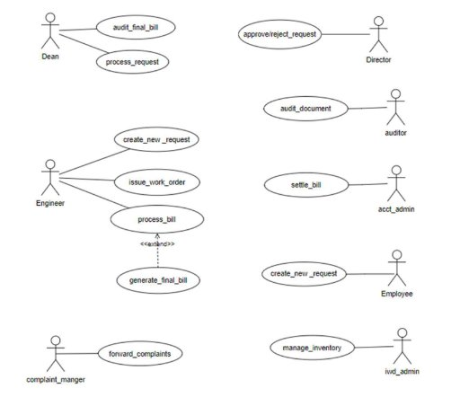

### 2. Use case Descrip  on 

This sec  on describes each use case Descrip  on in the use case diagram in all details. 

\1) 

|UC ID||UC#1||
| - | :- | - | :- |
|||||
|||||
|Use Case Name ||create\_new\_request ||
|||The “Create new request” use case is used to create a ||
|Descrip  on||new request to the higher authori  es. ||
|||||
|Actor||Engineer, Employee ||
|Precondi  on ||The engineer or the employee is logged into the  ||
|||portal. ||
|||M1|The employee or the engineer goes to the |
||||“Create new request” tab. |
|||||
|||||
|||M2|They fill all the necessary and |
||||` `relevant Informa  on  |
|Main Flow |||related to their request. |
|||||
|||M3|They click on the submit bu  on. |
|||||
|||M4|The request is now submi  ed to  |
||||The higher authori  es. |
|||||
|||||

|Post Condi  on |The request is now submi  ed to the higher           authority. |||
| - | - | :- | :- |
|Sub Flow|NIL|||
|
`            `Global Alternate 

`                     `Flow
|GA1|If a technical error occurs during the execu  on of  any ac  on (e.g., database failure, server issues), the  system displays an error message and the request  will not be submi  ed. ||

\2)

<table><tr><th colspan="1">UC ID</th><th colspan="2">UC#2</th></tr>
<tr><td colspan="1" valign="top">
mark as read

Use Case Name 
</td><td colspan="2" valign="top">Issue_work_order </td></tr>
<tr><td colspan="1" valign="top">Descrip  on</td><td colspan="2" valign="top">
The “issue_work_order” use case is used to                             Issue work order a  er the engineer’s or 

`                           `The emplyee’s request is approved. 
</td></tr>
<tr><td colspan="1">Actor</td><td colspan="2" valign="top">Engineer </td></tr>
<tr><td colspan="1" valign="top">Precondi  on</td><td colspan="2" valign="top">The engineer should be logged into the portal and the request must be approved by the director. </td></tr>
<tr><td colspan="1" rowspan="2" valign="top">Main Flow </td><td colspan="1" valign="top">1</td><td colspan="1" valign="top">`         `The request is approved by the higher authori  es. </td></tr>
<tr><td colspan="1" valign="top">2</td><td colspan="1" valign="top">Then the engineer issues the corresponding work order for the approved request. </td></tr>
</table>

|Post condi  ons |The work order for the approved request is issued.|
| - | - |
|Sub Flow|NIL|

\3)

<table><tr><th colspan="1">UC ID</th><th colspan="3">UC#3</th></tr>
<tr><td colspan="1" valign="top">Use Case Name </td><td colspan="3" valign="top">process_bill </td></tr>
<tr><td colspan="1" valign="top">Descrip  on</td><td colspan="3" valign="top">
The “process_bill” use case is used  

To list down all the items used and submit it to the higher  Authori  es for verfifica  on. 
</td></tr>
<tr><td colspan="1">Actor</td><td colspan="3" valign="top">Engineer </td></tr>
<tr><td colspan="1" valign="top">Precondi  on</td><td colspan="3" valign="top">`             `The engineer should be logged into the                 Portal and the bill must be generated. </td></tr>
<tr><td colspan="1" rowspan="2" valign="top">Main flow </td><td colspan="1" valign="top">1</td><td colspan="2" valign="top">The engineer should navigate to the “Process Bill”  Sec  on. </td></tr>
<tr><td colspan="1" valign="top">2</td><td colspan="2" valign="top">The engineer should then submit the bill of all the items used. </td></tr>
<tr><td colspan="1"></td><td colspan="1" valign="top">3</td><td colspan="2" valign="top">The engineer should submit the form. </td></tr>
<tr><td colspan="1">Post condi  ons </td><td colspan="3">The bill will be submi  ed to the higher authori  es for a final audit.</td></tr>
<tr><td colspan="1" valign="top">Global Alternate Flow </td><td colspan="1"></td><td colspan="1"></td><td colspan="1">NIL </td></tr>
</table>

|Sub Flow|NIL|
| - | - |

\4)

<table><tr><th colspan="1" valign="top">UC ID</th><th colspan="5" valign="top">UC#4</th></tr>
<tr><td colspan="1" valign="top">Use case Name </td><td colspan="5" valign="top">Audit_final_bill </td></tr>
<tr><td colspan="1" valign="top">Descrip  on</td><td colspan="5" valign="top">The “audit_final_bill” use case is used to audit the bill submi  ed by the engineer. </td></tr>
<tr><td colspan="1">Actor</td><td colspan="5" valign="top">Dean </td></tr>
<tr><td colspan="1" valign="top">Precondi  on</td><td colspan="5" valign="top">The dean should be logged into the portal and the bill should be submi  ed by the engineer. </td></tr>
<tr><td colspan="1" rowspan="2" valign="top">Main Flow</td><td colspan="3" valign="top">1</td><td colspan="2" valign="top">The dean navigates to the “Bills” tab. </td></tr>
<tr><td colspan="3" valign="top">2 </td><td colspan="2" valign="top">The dean then audits the bill. </td></tr>
<tr><td colspan="2" valign="top">Post Condi  on </td><td colspan="4" valign="top">The final bill will be generated. </td></tr>
<tr><td colspan="2" valign="top">Alternate Flow</td><td colspan="1" valign="top">A1</td><td colspan="2" valign="top">1</td><td colspan="1" valign="top">There might be correc  ons needed in the bill, so the bill will be sent back to the engineer and </td></tr>
</table>

||||will be asked to correct it. |
| :- | :- | :- | - |
|Sub Flow|NIL|||
|Global Alternate Flow|NIL|||
\5)

<table><tr><th colspan="1">UC ID</th><th colspan="2">UC#4</th></tr>
<tr><td colspan="1" valign="top">Use case Name </td><td colspan="2" valign="top">Process_request </td></tr>
<tr><td colspan="1" valign="top">Descrip  on</td><td colspan="2" valign="top">
The “process_request” use case is used to process the request created by the engineer and pass it on to the director for approval 

or rejec  on. 
</td></tr>
<tr><td colspan="1" valign="top">Actor</td><td colspan="2" valign="top">Dean </td></tr>
<tr><td colspan="1" valign="top">Precondi  on</td><td colspan="2" valign="top">The dean should be logged into the portal and there should be at least one new request created by the engineer. </td></tr>
<tr><td colspan="1" rowspan="2" valign="top">Main Flow</td><td colspan="1" valign="top">1</td><td colspan="1" valign="top">The dean navigates to the “New Requests” tab. </td></tr>
<tr><td colspan="1" valign="top">2 </td><td colspan="1" valign="top">The dean processes the new request and sends it to  the director. </td></tr>
</table>

|Post Condi  on |The processed request will be submi  ed to the director for approval or rejec  on. |||
| - | :- | :- | :- |
|Alternate Flow|A1|1|The dean might not process the newly created request by the engineer. |
|Sub Flow|NIL|||
|Global Alternate Flow|NIL|||
\6)

|UC ID|UC#4|
| - | - |
|Use case Name |Approve/reject\_request |
|Descrip  on|The “approve/reject\_request” use case is used to approve or reject the request processed by the dean. |
|Actor|Director |
|Precondi  on|The director should be logged into the portal and there should be at least one request processed by the dean. |

<table><tr><th colspan="1" rowspan="2" valign="top">Main Flow</th><th colspan="3" valign="top">1</th><th colspan="1" valign="top">The director navigates to the “Requests” tab. </th></tr>
<tr><td colspan="3" valign="top">2 </td><td colspan="1" valign="top">The director then approves or rejects the request. </td></tr>
<tr><td colspan="2" valign="top">Post Condi  on </td><td colspan="3" valign="top">The request if approved then will be passed on to the engineer to issue work order. </td></tr>
<tr><td colspan="2">Alternate Flow</td><td colspan="1" valign="top">NIL </td><td colspan="2"></td></tr>
<tr><td colspan="2" valign="top">Sub Flow</td><td colspan="3" valign="top">NIL</td></tr>
<tr><td colspan="2" valign="top">Global Alternate Flow</td><td colspan="1" valign="top">NIL</td><td colspan="2"></td></tr>
</table>
\7)

|UC ID|UC#4|
| - | - |
|Use case Name |Audit\_document |
|Descrip  on|The “audit\_document” use case is used to audit all the submi  ed documents for its authen  city. |
|Actor|Auditor |

<table><tr><th colspan="1" valign="top">Precondi  on</th><th colspan="4" valign="top">The auditor should be logged into the portal and there should be documents submi  ed to be verified. </th></tr>
<tr><td colspan="1" rowspan="2" valign="top">Main Flow</td><td colspan="3" valign="top">1</td><td colspan="1" valign="top">The auditor navigates to the “Documents” tab. </td></tr>
<tr><td colspan="3" valign="top">2 </td><td colspan="1" valign="top">The auditor then audits all the submi  ed documents. </td></tr>
<tr><td colspan="2" valign="top">Post Condi  on </td><td colspan="3" valign="top">If the auditor feels the submi  ed documents are valid, he/she may ask the user to submit the documents again. </td></tr>
<tr><td colspan="2">Alternate Flow</td><td colspan="1" valign="top">NIL </td><td colspan="2"></td></tr>
<tr><td colspan="2" valign="top">Sub Flow</td><td colspan="3" valign="top">NIL</td></tr>
<tr><td colspan="2" valign="top">Global Alternate Flow</td><td colspan="1" valign="top">NIL</td><td colspan="2"></td></tr>
</table>
\8)

<table><tr><th colspan="1">UC ID</th><th colspan="4">UC#4</th></tr>
<tr><td colspan="1" valign="top">Use case Name </td><td colspan="4" valign="top">se  le_bill </td></tr>
<tr><td colspan="1" valign="top">Descrip  on</td><td colspan="4" valign="top">The “se  le_bill” use case is used to se  le the bill and send it to the dean for further audits. </td></tr>
<tr><td colspan="1">Actor</td><td colspan="4" valign="top">account Admin </td></tr>
<tr><td colspan="1" valign="top">Precondi  on</td><td colspan="4" valign="top">The account admin should be logged into the portal. </td></tr>
<tr><td colspan="1" rowspan="2" valign="top">Main Flow</td><td colspan="3" valign="top">1</td><td colspan="1" valign="top">The account admin navigates to the “Bills” tab. </td></tr>
<tr><td colspan="3" valign="top">2 </td><td colspan="1" valign="top">The account admin then se  les the final bill and then sends it to the dean for a final audit. </td></tr>
<tr><td colspan="2" valign="top">Post Condi  on </td><td colspan="3" valign="top">The bill will be issued and then sent to the dean. </td></tr>
<tr><td colspan="2">Alternate Flow</td><td colspan="1" valign="top">NIIL </td><td colspan="2"></td></tr>
<tr><td colspan="2">Sub Flow</td><td colspan="3">NIL</td></tr>
<tr><td colspan="2" valign="top">Global Alternate Flow</td><td colspan="1" valign="top">NIL</td><td colspan="2"></td></tr>
</table>
\9)

<table><tr><th colspan="1" valign="top">UC ID</th><th colspan="4" valign="top">UC#4</th></tr>
<tr><td colspan="1" valign="top">Use case Name </td><td colspan="4" valign="top">Manage_inventory </td></tr>
<tr><td colspan="1" valign="top">Descrip  on</td><td colspan="4" valign="top">The “Manage_inventory” use case is used to manage all the available resources by the IWD admin. </td></tr>
<tr><td colspan="1" valign="top">Actor</td><td colspan="4" valign="top">IWD admin </td></tr>
<tr><td colspan="1" valign="top">Precondi  on</td><td colspan="4" valign="top">The IWD admin should be logged into the portal. </td></tr>
<tr><td colspan="1" rowspan="2" valign="top">Main Flow</td><td colspan="3" valign="top">1</td><td colspan="1" valign="top">The IWD admin navigates to the “Inventory” tab. </td></tr>
<tr><td colspan="3" valign="top">2 </td><td colspan="1" valign="top">The IWD admin then ensures all the important resources are available and well managed. </td></tr>
<tr><td colspan="2" valign="top">Post Condi  on </td><td colspan="3" valign="top">The inventory is fully equipped. </td></tr>
<tr><td colspan="2">Alternate Flow</td><td colspan="1" valign="top">NIL </td><td colspan="2"></td></tr>
<tr><td colspan="2" valign="top">Sub Flow</td><td colspan="3" valign="top">NIL</td></tr>
</table>

|Global Alternate Flow|NIL||
| - | - | :- |
\10)

<table><tr><th colspan="1" valign="top">UC ID</th><th colspan="4" valign="top">UC#4</th></tr>
<tr><td colspan="1" valign="top">Use case Name </td><td colspan="4" valign="top">Forward_complaints </td></tr>
<tr><td colspan="1" valign="top">Descrip  on</td><td colspan="4" valign="top">The “Forward_complaints” use case is used to forward any complaint issued which is related to the property inside the campus. </td></tr>
<tr><td colspan="1">Actor</td><td colspan="4" valign="top">Complaint_manager </td></tr>
<tr><td colspan="1" valign="top">Precondi  on</td><td colspan="4" valign="top">The complaint manager should be logged into the portal and there should be complaints issued. </td></tr>
<tr><td colspan="1" rowspan="2" valign="top">Main Flow</td><td colspan="3" valign="top">1</td><td colspan="1" valign="top">The complaint manager navigates to the “Complaints” tab. </td></tr>
<tr><td colspan="3" valign="top">2 </td><td colspan="1" valign="top">The complaint manager then forwards the complaints to the higher authori  es. </td></tr>
<tr><td colspan="2" valign="top">Post Condi  on </td><td colspan="3" valign="top">The issued complaint will be forward to the respected autohority. </td></tr>
<tr><td colspan="2">Alternate Flow</td><td colspan="1" valign="top">NIL </td><td colspan="2"></td></tr>
<tr><td colspan="2" valign="top">Sub Flow</td><td colspan="3" valign="top">NIL</td></tr>
</table>

|Global Alternate Flow|NIL||
| - | - | :- |
## 3\. Other Func  onal Requirements  

1) All the modules will make use of the IWD module for issuing work order or if they want to report a problem related to the ins  tute’s property. 
1) The Super admin of Fusion should be able to assign roles for IWD-Admin and all the other actors of the IWD module. 
1) The system should be running all the   me for the quick registra  on of requests to efficiently manage the ins  tute’s property. 
### 4. Other constraints 
**1. User Interfaces** 

The user interface should comply with the colour scheming and dashboard design of the FUSION IIIT. Users should be able to navigate from one func  onality to other. Inter module naviga  on should be smooth. All the func  onali  es should be easy to use and no specific training should be required for the usage of the module. 

**2. Tech Stack Used**
1) Backend: Django(Python Based Web-Framework). 
1) Frontend:( HTML ,CSS , JavaScript ). 

   **3. Business rules (if any)** NIL 

     ## 4. Non- Func  onal Requirements
**1. Performance:**

The system should respond to user interac  ons quickly. Response   me for crea  ng new requests, genera  on of bills etc. should be less. 

**2. Scalability:**

The system should handle a mass of concurrent users. System performance should be evaluated under increasing load condi  ons. 

**3. Availability:**

The system should be available 99.9% of the   me.

**4. Security:**

Ensure data confiden  ality and integrity. Role-based authoriza  on ensures that users can only perform ac  ons relevant to their designated roles. 

## 5. Module dependencies with other fusion modules
**1. UI Level**

Integra  on in Fusion :-      

At UI level, IWD Module will seamlessly integrates with other Modules, As It followed exact theme followed by other modules.  

**2. DB Level Dependencies:**

1\.  This databases used in the IWD module are not dependent on the database of 

the other modules. 

**3. Module Level Dependencies:**

The IWD module will be interac  ng with the “Purchase and Store” module for efficient management of resources and with the “Complaint Management System” module for forwarding the registered complaints to the higher authori  es.  

## API Specifications
# GAD-2 IWD Module (Web)

### **Student Mentor**: Kushagra Yadav (21BCS121)

---

## **Overview**

The **IWD Module** in the Fusion ERP system plays a vital role in maintaining and managing campus infrastructure. It handles both the routine upkeep of assets and the construction of new properties, ensuring efficient management and smooth operations across the campus.

The module ensures:
- Swift resolution of any on-site asset malfunctions.
- Coordination of construction and development of new campus properties.

---

## **API Documentation**

### **Implemented APIs**

1. **`/page1_1`**
   - **Parameters**: `aes_file`, `dASAName`, `nitNiqno`, `proth`, `emdDetails`, `preBidDate`, `technicalBidDate`, `financialBidDate`.
   - **Description**: Stores important details related to the work being done and approved requests.

2. **`/page2_1`**
   - **Parameters**: `corrigendum`, `addendum`, `preBid`, `technicalBid`, `qualifiedAgencies`, `financialBid`, `lowAgency`, `letterOfIntent`, `workOrder`, `agreementLetter`, `milestones`.
   - **Description**: Stores the necessary documents and information required for the issued work.

3. **`/corrigendumInput`** (Partially Implemented)
   - **Parameters**: `id`, `issueDate`, `nitNo`, `name`, `lastDate`, `lastTime`, `env1BidOpeningDate`, `env1BidOpeningTime`, `env2BidOpeningDate`, `env2BidOpeningTime`.
   - **Description**: Users can correct errors during the submission of their documents.

4. **`/addendumInput`**
   - **Parameters**: `id`, `issueDate`, `nitNiqNo`, `name`, `openDate`, `openTime`.
   - **Description**: Allows users to submit updated documents.

5. **`/milestoneForm`**
   - **Parameters**: `id`, `description`, `timeAllowed`, `amountWithheld`.
   - **Description**: Timeframe for agencies to resolve payment issues.

6. **`/TechnicalBidForm`**
   - **Parameters**: `id`, `requirements`.
   - **Description**: Lists details and requirements in the bidding process.

7. **`/extensionForm`**
   - **Parameters**: `id`, `hindrance`, `periodOfHindrance`, `periodOfExtension`.
   - **Description**: Agencies can request deadline extensions.

8. **`/letterOfIntent`**
   - **Parameters**: `id`, `nitNiqNo`, `dateOfOpening`, `agency`, `name`, `tenderValue`.
   - **Description**: Communicates agency intent regarding the assigned work.

9. **`/workOrderForm`**
   - **Parameters**: `id`, `issueDate`, `nitNiqNo`, `agency`, `name`, `amount`, `time`, `startDate`, `completionDate`, `deposit`, `contractDay`.
   - **Description**: Submits work order details for assigned tasks.

10. **`/agreement`**
    - **Parameters**: `id`, `date`, `dateOfOpening`, `agencyName`, `workName`, `fdrSum`.
    - **Description**: Formal agreement submission for assigned work.

11. **`/page3_1`**
    - **Parameters**: `id`, `extensionOfTime`, `actualCostOfBidding`.
    - **Description**: Submit details for extension requests.

### **API Views**

1. **`/page1View`** (Partially Implemented)
   - **Description**: Administrator can view details from `page1_1` submissions.

2. **`/page2View`**
   - **Description**: Administrator can view details from `page2_1` submissions.

3. **`/page3View`**
   - **Description**: Administrator can view details from `page3_1` submissions.

4. **`/extensionFormView`**
   - **Description**: Administrator can view details from `extensionForm`.

5. **`/workOrderFormView`**
   - **Description**: Administrator can view details from `workOrderForm`.

6. **`/letterOfIntentFormView`**
   - **Description**: Administrator can view details from `letterOfIntent`.

7. **`/preBidDetailsFormView`**
   - **Description**: Administrator can view details from the pre-bid form.

---

## **APIs Under Development**

1. **`/create_new_request`** (UC#1)  
   - **Description**: Users can create new requests for maintenance or construction.  
   - **Database**: Not yet created.

2. **`/forward_complaints`** (UC#10)  
   - **Description**: Forward complaints to higher authorities.  
   - **Database**: Not yet created.

3. **`/process_request`** (UC#5)  
   - **Description**: Dean processes the user request.  
   - **Database**: Not yet created.

4. **`/audit_final_bill`** (UC#4)  
   - **Description**: Dean audits the final bill submitted by the agency.  
   - **Database**: Not yet created.

5. **`/approve_reject_request`** (UC#6)  
   - **Description**: Director approves or rejects the processed request.  
   - **Database**: Not yet created.

6. **`/audit_document`** (UC#7)  
   - **Description**: Auditor reviews and requests corrections on user-submitted documents.  
   - **Database**: Not yet created.

7. **`/settle_bill`** (UC#8)  
   - **Description**: Account admin processes bill settlement.  
   - **Database**: Not yet created.

8. **`/manage_inventory`** (UC#9)  
   - **Description**: IWD admin manages and ensures availability of resources.  
   - **Database**: Not yet created.

---

## **Use Case Diagram**

---

## **Current Issues**

- The use case diagram was recently updated, and many specified use cases are yet to be implemented.

---

**Google Doc Link**: [Modules Testing Assignment](https://docs.google.com/document/d/1YHGPKiRUQ0TMEIk8w4HZ7sWOhSeqEkCdI3leq7ubZ_k/edit?usp=sharing)

## UI for Application
# **Institute Work Department (IWD GAD-2)**

**Faculty Mentor:** Dr. Durgesh Singh  
**Student Mentor:** Gagan Singh (21BCS084)

### **Prepared by:**
- Kunal Raj (21BCS118)
- Vidyadhar Rishabh Nigam (21BCS239)
- Kunal Marmat (21BCS173)
- Vijay Kumar Saharan (21BSM030)
- (21BCS240)

---

## **Figma Profiles for IWD (GAD-2)**

### **1. Module Description:**

The Institute Work Department module serves as the nerve center of our esteemed institute's operational excellence, where precision and collaboration intersect to uphold standards of efficiency and resource utilization. Within this pivotal framework, stakeholders including the dean, director, employees, and administrative personnel converge to orchestrate seamless processes and ensure optimal allocation of resources.

At the helm, the dean and director wield decision-making authority, guiding the approval or rejection of requests vital to our institute's functioning. Meanwhile, employees serve as catalysts for innovation, initiating requests that reflect frontline perspectives. Administrative personnel, adept at financial stewardship and inventory management, ensure fiscal integrity through diligent budget oversight, audit compliance, and meticulous inventory supervision.

United in our commitment to excellence, we strive to propel the institute towards new horizons of achievement. With strategic oversight and collaborative engagement, the Institute Work Department module stands as a testament to our collective determination to thrive in an ever-evolving landscape.

---

### **2. Actors**

#### 1. **ENGINEER :-**
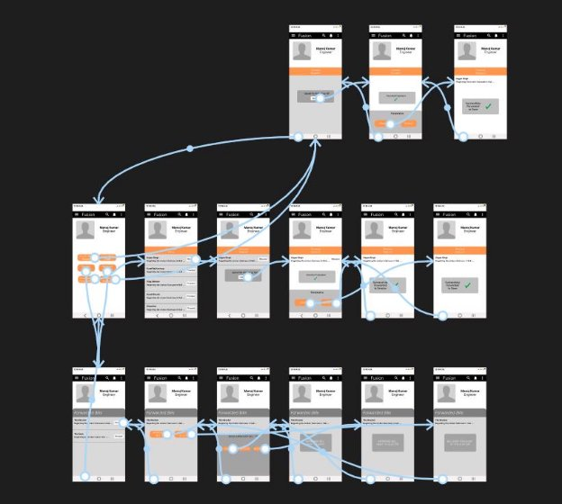

#### 2. **DEAN :-**
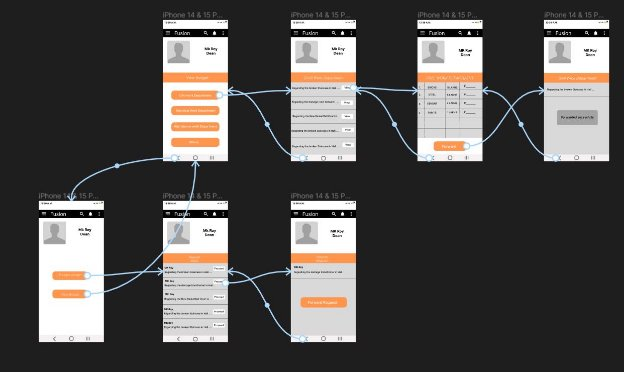

#### 3. **DIRECTOR :-**
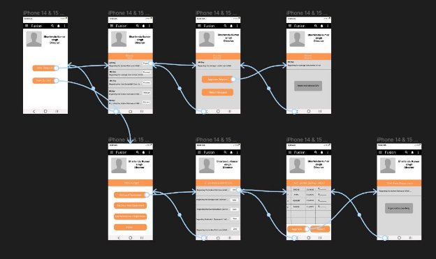

#### 4. **IWD ADMIN :-**
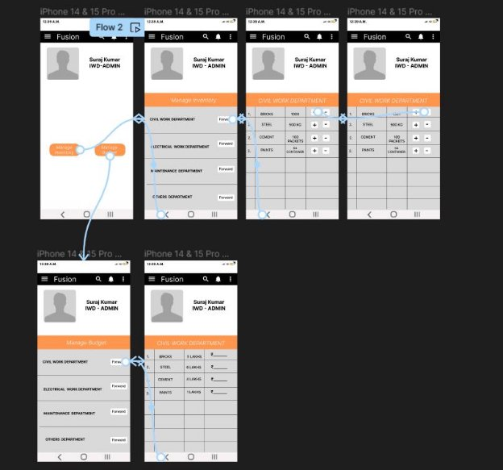

#### 5. **AUDITOR :-**
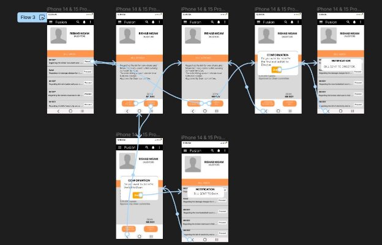

#### 6. **ACCOUNT ADMIN :-**
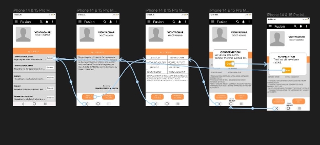

---

## **Figma Profile Design Guidelines and Additional Considerations**

1. **Cross-Platform Compatibility:**
   - Verify that Figma designs and features are compatible across app version only.

2. **Dimension Standardization:**
   - All Figma designs have the same dimensions around 360px width for mobile.

3. **Actor-Oriented Use Case-Based Design:**
   - All Figma designs are strictly based on use cases of actors and have a maintained consistency with previous and newly added designs.
   - Each actor has a different page in Figma profiles.

---

**Figma Link:**  
[PR IWD Figma](https://www.figma.com/file/BtzObStu5I2G9ymx2FBGpD/PR-IWD?type=design&node-id=0-1&mode=design&t=duiCPiqFDn6q15Pe-0)

## UI for Web
# **Figma Profiles for GAD-2 IWD (Web)** 

## **Module Description:**  

The IWD Module within Fusion plays a crucial role in overseeing the upkeep of campus property and ensuring its efficient maintenance. Its primary responsibility is to guarantee the smooth functioning of all on-site assets, promptly addressing any malfunctions that may arise.  

Additionally, the IWD Module actively oversees and manages the construction of new properties, demonstrating a comprehensive approach to both maintaining existing assets and facilitating the development of new ones on the campus.

This dual focus reinforces its commitment to the overall well-being and advancement of the campus infrastructure.

[GAD-2 IWD Use Case Specifications](https://docs.google.com/document/d/1RkqFgSMCQy3FLpzJ5aYf903HNKyPsBHDczrxVLfBsiY/edit?usp=sharing)  
[GAD-2 IWD Figma](https://www.figma.com/file/TxWEHzOMPx6PfSYEYYTjf4/GAD-2-IWD?type=design&node-id=0%3A1&mode=design&t=lcPPPmDURlZnBGNI-1)

---

## **Actors**

### 1. **Engineer** 

The Engineer initiates a new service request, issues the corresponding work order, and facilitates the processing of the associated bill to be submitted to higher authorities.

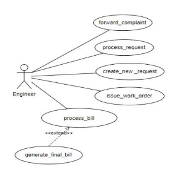

---

### 2. **Dean** 

Processes the requests from the engineer and passes it on to the director. The dean can also view the budget.

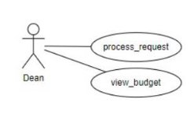

---

### 3. **Director** 

The director is responsible for approving or rejecting the requests from the engineer, processed by the dean.

---

### 4. **Auditor** 

The auditor reviews all submitted documents comprehensively.

---

### 5. **Account Admin** 

The account admin settles the bill generated from the engineer.

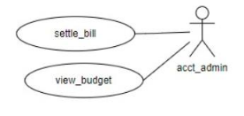

---

### 6. **Employee** 

The employee initiates a new work request.

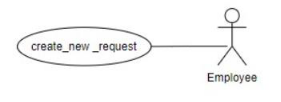

---

### 7. **IWD Admin** 

The IWD Admin manages the budget and oversees the inventory, providing engineers with access to manage and utilize the available resources.

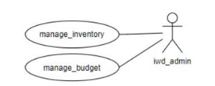

---

[GAD-2 IWD Figma](https://www.figma.com/file/TxWEHzOMPx6PfSYEYYTjf4/GAD-2-IWD?type=design&node-id=0%3A1&mode=design&t=lcPPPmDURlZnBGNI-1)

## Database Schema
**Module Name: GAD – 2 IWD (Android)**

**Faculty Mentor: Dr. Durgesh Singh**

**Student Mentor: Gagan Singh (21BCS084)**

# Database Documentation of GAD-2 IWD 4.0 Overview of the Module:

The IWD Module within Fusion plays a crucial role in overseeing the upkeep of campus

property and ensuring its efficient maintenance. Its primary responsibility is to guarantee the smooth functioning of all on-site assets, promptly addressing any malfunctions that may arise.

Additionally, the IWD Module actively oversees and manages the construction of new properties, demonstrating a comprehensive approach to both maintaining existing assets and facilitating the development of new ones on the campus.

This dual focus reinforces its commitment to the overall well-being and advancement of the campus infrastructure.

# SRS: [GAD-2 IWD SRS](https://docs.google.com/document/d/1RkqFgSMCQy3FLpzJ5aYf903HNKyPsBHDczrxVLfBsiY/edit?usp=sharing)

1.  **ER Diagram (to be created using draw.io):** [**GAD-2 IWD ER Diagram**](https://drive.google.com/file/d/1pdCAvco5E2FzhusLHgvMGGCvQpehhrG8/view?usp=sharing) (drawio file)

[**GAD-2 IWD ER Diagram**](https://drive.google.com/file/d/1lgoKUWfAzsCQNrejGadUMikM2Tgpae3R/view?usp=sharing) (image)

# Database Schema Info (in the Google sheet): [GAD-2 IWD Database Info](https://docs.google.com/spreadsheets/d/1DaAEwrLOSPppYQrBtUf4LI6VLLCbXIe3Y8rRHm8dPBo/edit?usp=sharing)

1.  **Mention all the changes required in the currently implemented Tables:- (These changes will be done in this current version 4.0)**

1.) The use case diagram for the GAD-2 IWD module was recently updated following a review with Atul Gupta Sir. Currently only one table within the module has been correctly implemented to meet our needs.

2.) We have thought to implement the tables listed in the excel sheet into the system.

# Data Availability for API and Functional Testing

*   1.  **Mention the tables that are already populated**
        *   iwdModuleV2\_addendum
        *   iwdModuleV2\_aesdetails
        *   iwdModuleV2\_agreement
        *   iwdModuleV2\_corrigendumtable
        *   iwdModuleV2\_extensionoftimedetails
        *   iwdModuleV2\_financialbiddetails
        *   iwdModuleV2\_financialcontractordetails
        *   iwdModuleV2\_letterofintentdetails
        *   iwdModuleV2\_milestones
        *   iwdModuleV2\_nooftechnicalbidtimes
        *   iwdModuleV2\_pageonedetails
        *   iwdModuleV2\_pagethreedetails
        *   iwdModuleV2\_pagetwodetails
        *   iwdModuleV2\_prebiddetails
        *   iwdModuleV2\_projects
        *   iwdModuleV2\_technicalbidcontractordetails
        *   iwdModuleV2\_technicalbiddetails

The tables implemented above are not essential for the functionality of the GAD-2 IWD Module.

*   *   *   iwdModuleV2\_workorderform

# Mention the tables required to be populated

*   *   *   iwdModuleV2\_requests
        *   iwdModuleV2\_documents
        *   iwdModuleV2\_bills
