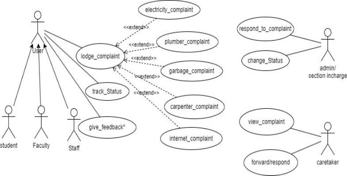
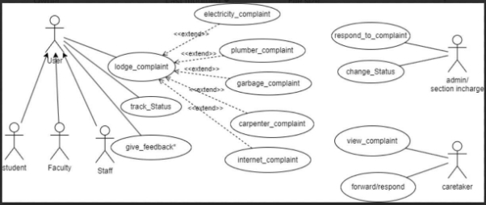
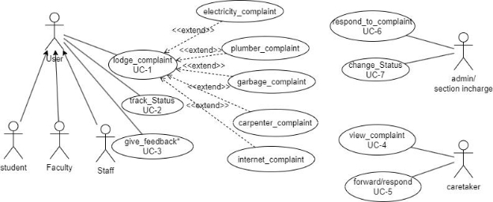
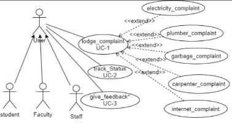
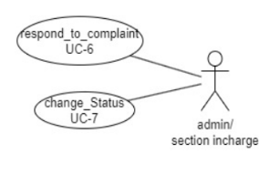
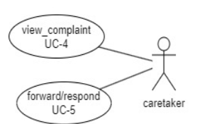

# Authentication Module Documentation

## Table of Contents
- [User-Centered Design (UCD)](#user-centered-design-ucd)
- [SRS Application](#srs-application)
- [SRS Web Interface](#srs-web-interface)
- [API Specifications](#api-specifications)
- [UI for Application](#ui-for-application)
- [UI for Web](#ui-for-web)
- [Database Schema](#database-schema)

## User-Centered Design (UCD)

## SRS Application
 

**Prepared by:** Ananya Sharma (21BCS020), Armin Patel (21BCS031), Chahit Kolte (21BCS062), Harsh Chauhan (21BCS094), Harshith Sudar (21BCS097) 

**Student Mentor:** Hardik Pratap Singh (21BCS090) 
**Faculty Mentor:** Dr. Avinash Chandra Pandey 

## Table of Contents
1. [Introduction](#introduction)
   - [Introduction about the Fusion – A brief Description](#introduction-about-the-fusion-a-brief-description)
   - [Purpose of module](#purpose-of-module)
   - [Scope of module](#scope-of-module)
2. [User/Actor Characteristics](#useractor-characteristics)
3. [System Features (Functional Requirements)](#system-features-functional-requirements)
   - [Use Case Diagram](#use-case-diagram)
   - [Use Case Descriptions](#use-case-descriptions)
4. [Non-Functional Requirements](#non-functional-requirements)
5. [Dependencies](#dependencies)

## 1. Introduction 

### 1.1 Introduction about the Fusion – A brief Description 
FusionIIIT at PDPM Indian Institute of Information Technology, Design, and Manufacturing, Jabalpur, exemplifies the seamless integration and automation of diverse functions. Developed by students using Python 3.8 and powered by the Django Web framework, this initiative is a testament to the institute's commitment to improving operational efficiency and enriching campus life. In the administrative domain, FusionIIIT manages intricate paperwork and processes, simplifying administrative tasks for a more streamlined approach. On the academic side, it introduces a digital facet to learning and course management, enhancing the educational experience. However, its impact extends beyond the conventional, reaching various departments and sections to ensure the smooth operation of every aspect of campus life.

Visualize FusionIIIT as a digital wizard that not only organizes administrative processes and elevates academic experiences but also lends support to miscellaneous departmental tasks. It acts as a supportive companion, overseeing the seamless functioning of every facet of campus life.

Beyond being a mere tool, FusionIIIT emerges as a reliable friend dedicated to enhancing organization and enjoyment in the lives of everyone at PDPM IIITDM Jabalpur. 

### 1.2 Purpose of the module: 
The central complaint system is designed to efficiently manage and resolve issues pertaining to electricity, hostels, and cleanliness in each campus building. The primary goal of this software is to provide a swift and effective mechanism for addressing concerns raised by individuals within the campus community, ensuring a seamless resolution process. Additionally, it serves as a communication platform, facilitating a direct connection between users and the relevant Caretaker/Supervisor for each department.

### 1.3 Scope of the module: 
The complaint management system by offering a comprehensive and efficient platform for students to register their concerns. Beyond simple registration, the system facilitates real-time tracking and visibility of complaints for respective authorities.

## 2. User/Actor Characteristics 
### 2.1 Student / Faculty / Staff 
Individuals who would lodge the complaints. 
**Role:** Creation of complaint 

**Specific Functionalities:**  
- Lodge complaint through the Fusion portal 
- Specify details of the complaint 
- Choose the complaint category 
- Track Complaint status 
- Provide Feedback 

### 2.2 Admin / Section In-Charge 
Admin or Section In-Charge of the service. 
**Role:** Oversee the complaints, able to respond and change the status of complaints 

**Specific Functionalities:** 
- View Complaints 
- Respond to complaints 
- Change the status of complaints 
- Manage worker/caretaker 

### 2.3 Caretaker 
Caretaker of the particular service like internet, electricity. 
**Role:** View and resolve complaints, manage worker 

**Specific Functionalities:** 
- View Complaints 
- Respond to complaints 
- Assign worker 

## 3. System Features (Functional Requirements) 
### 3.1 Use Case Diagram 

### 3.2 Use Case Description 

#### **Use Case #1** 
| UC ID | UC #1 |
|-------|-------|
| Use Case Name | lodge_complaint |
| Description | Report issues to the concerning administration |
| Actor(s) | Staff, Student, Faculty |
| Pre-Condition | User must be logged in |
| Main Flow | 1) The user fills all the necessary columns and clicks on the submit button. 2) System Displays the message of the complaint being successfully received. |
| Post-Condition | The complaint is successfully received by the system and stored in the database. |
| Alternate Flow | If the User is not logged in, the system prompts them to log in. |
| Sub Flow | none |
| Global Alternate Flow | none |

#### **Use Case #2** 
| UC ID | UC #2 |
|-------|-------|
| Use Case Name | track_status |
| Description | Check the status of the complaint |
| Actor(s) | Staff, Student, Faculty |
| Pre-Condition | The user must have a complaint registered. |
| Main Flow | 1) User checks the complaint history for the status. 2) User checks his complaint whether it has been overlooked/resolved by the caretaker within a given timestamp or not. |
| Post-Condition | none |
| Alternate Flow | none |
| Sub Flow | none |
| Global Alternate Flow | none |

#### **Use Case #3** 
| UC ID | UC #3 |
|-------|-------|
| Use Case Name | give_feedback |
| Description | Rate resolution of the complaint |
| Actor(s) | Staff, Student, Faculty |
| Pre-Condition | User must have a complaint lodged |
| Main Flow | 1) The user selects the complaint they want to provide feedback on. 2) The user enters their feedback. 3) The system stores the feedback. |
| Post-Condition | none |
| Alternate Flow | none |
| Sub Flow | none |
| Global Alternate Flow | none |

#### **Use Case #4** 
| UC ID | UC #4 |
|-------|-------|
| Use Case Name | view_complaint |
| Description | View complaint details |
| Actor(s) | Caretaker |
| Pre-Condition | Caretaker must be logged in. |
| Main Flow | 1) Caretaker clicks on view complaints. 2) New page with all complaints and their complainter appears. |
| Post-Condition | Caretaker chooses a complaint to assign worker to it. |
| Alternate Flow | none |
| Sub Flow | none |
| Global Alternate Flow | none |

#### **Use Case #5** 
| UC ID | UC #5 |
|-------|-------|
| Use Case Name | forward/respond |
| Description | Forward the complaint to admin/section in charge. |
| Actor(s) | Caretaker |
| Pre-Condition | Caretaker cannot handle problem by himself. |
| Main Flow | 1) Caretaker forwards the complaint. |
| Post-Condition | Problem is to be managed by admin/section in charge. |
| Alternate Flow | none |
| Sub Flow | none |
| Global Alternate Flow | none |

#### **Use Case #6** 
| UC ID | UC #6 |
|-------|-------|
| Use Case Name | respond_to_complaint |
| Description | Respond/comment on the complaint by the administration |
| Actor(s) | Caretaker, admin |
| Pre-Condition | User is authorized to view the complaint |
| Main Flow | 1) Caretaker views the complaint. 2) Caretaker takes necessary action to resolve the complaint and responds accordingly. |
| Post-Condition | none |
| Alternate Flow | none |
| Sub Flow | none |
| Global Alternate Flow | none |

#### **Use Case #7** 
| UC ID | UC #7 |
|-------|-------|
| Use Case Name | change_status |
| Description | Update complaint status as needed |
| Actor(s) | Admin, caretaker |
| Pre-Condition | User is logged in with the role of admin or caretaker |
| Main Flow | 1) Selects a complaint. 2) Selects a new status for the complaint. |
| Post-Condition | System updates the complaint status. |
| Alternate Flow | none |
| Sub Flow | none |
| Global Alternate Flow | none |

## 4. Non-Functional Requirements 

1. **Performance:** 
   The system should respond to user interactions quickly. Response time for booking actions, inventory updates, and notifications should be less.

2. **Scalability:** 
   The system should handle a mass of concurrent users. System performance should be evaluated under increasing load conditions.

3. **Availability:** 
   The system should be available 99.9% of the time.

4. **Security:** 
   Ensure data confidentiality and integrity. Role-based authorization ensures users can only perform actions relevant to their designated roles.

## 5. Dependencies 

### 5.1 Integration at the UI Level: 
Users log into the Fusion application and land on the main dashboard. The user (student, staff, faculty, and other community members of IIITDMJ) can add a complaint by filling in the required input fields. Lodgers can also see the complaint status and history.

### 5.2 Integration at the Back-end Level: 
The API endpoints should manage user authentication and serve data regarding complaints. Data should be stored in a robust and efficient database system, ensuring that information retrieval is optimized.
Data dependencies of the Complaint registration module:

| S.no | Table Name                         | Foreign Key       | Referenced Table       |
|------|------------------------------------|-------------------|------------------------|
| 1    | complaint_system_caretaker         | staff_Id_Id       | globals_extrainfo      |
| 2    | complaint_system_hall              | staff_id_id       | globals_extrainfo      |
| 3    | complaint_system_student_complaint | complainer_id     | globals_extrainfo      |
| 4    | complaint_system_supervisor        | sup_id_id         | globals_extrainfo      |
| 5    | complaint_system_workers           | caretaker_id_id   | complaint_system_caretaker |

### 5.3 Module Level
The Complaint registration module interacts with the Notification, Dashboard, and File Transfering system.

## SRS Web Interface

**Faculty Mentor:** Dr. Avinash Chandra Pandey 

**Prepared by:** 
Ayushi Mourya (21BCS050)  
Bachuwar Esha (21BCS052)  
Kirankumar G (21BCS116)  
Nidhi Barapatre (21BCS146)  
Sadanand Jaiswal (21BCS180) 

**Mentor:** Pratik Kumar (21BCS164) 

## 1. Introduction 

### 1.1 Introduction about the Fusion – A brief Description 

FusionIIIT stands as a testament to the seamless integration and automation of diverse functions within PDPM Indian Institute of Information Technology, Design and Manufacturing, Jabalpur. Crafted with precision using Python 3.8 and powered by the Django Web framework, this initiative is a student-driven endeavor designed to elevate the institute's operational landscape. Encompassing everything from efficient administration management to academic prowess and miscellaneous departmental tasks, FusionIIIT is a holistic solution that harmonizes the intricacies of campus life. 

Imagine it as a digital wizard that takes care of everything, from organizing the administrative stuff to making academics smoother. It's not just limited to the usual tasks; FusionIIIT jumps into various departments and sections, making sure every corner of campus life runs smoothly. 

In the admin side, it handles the complicated paperwork and processes. For academics, it brings a digital touch, making learning and managing courses easier. But it doesn't stop there; FusionIIIT is like a friendly companion for all the different parts of the campus, making sure everything works well. 

In simpler terms, FusionIIIT is not just a tool – it's a helpful friend, making life at PDPM IIITDM Jabalpur more organized and enjoyable for everyone. 

### 1.2 Purpose of the module 

The Centralized complaint system combines the issues related to Computer Center, Hostels, and Cleanliness under one roof. This software aims at solving problems of students as well as staff as soon as possible by providing a platform to connect them directly to the Warden/Caretaker/Supervisor of the respective departments. It will allow immediate addressal of complaints.

### 1.3 Scope of the module 

This module aims to provide a comprehensive solution for efficiently managing and documenting user complaints within our institute. This system is designed to replace traditional paper-based complaint tracking methods, ensuring a centralized and organized approach to handling user complaints and their feedback. 

## 2. User / Actor Characteristics 

### 2.1 User (Student, Faculty, Staff) 

Represents individuals who intend to lodge a complaint regarding various issues of hostels. 

**Specific Functionalities:**  

- Users can lodge complaints. 
- Users can track the status of their complaints. 
- Users can give feedback. 

### 2.2 Admin / Section Incharge 

Represents individuals who intend to respond to complaints registered by the Users only when the complaint has been forwarded by the caretaker or has not been handled by the caretaker within a specified time period. 

**Specific Functionalities:** 

- Admin/ Section Incharge can respond to the complaints. 
- Admin/ Section Incharge can change the status of complaints. 

### 2.3 Caretaker 

Represents individuals who will be receiving all the complaints and taking actions accordingly. If the complaint remains unresolved or cannot be handled at this level, it will be forwarded to the higher concerned authorities (Admin/ Section Incharge). 

**Specific Functionalities:** 

- Caretaker can view the complaints registered by the users. 
- Caretaker can respond to the complaints. 
- Caretaker can forward the complaints to the respective higher authorities. 

## 3. Functional Requirements 

### 3.1 Use Case Diagram 

The figure represents the use case diagram for the module features.  

### 3.2 Use Case Description 

#### 3.2.1 Use Case #1 

| UC ID | UC#1 |
|-------|------|
| **Use Case Name** | lodge_complaint | 
| **Actor** | Student, Staff, Faculty |
| **Pre-Condition** | The user must fill all the necessary fields in the complaint page. |
| **Main Flow** | 1. User fills all the necessary columns and clicks on the submit button.   2. System displays a message that the complaint has been successfully received. |
| **Post-Condition** | The complaint is successfully received by the system and stored in the database. |

#### 3.2.2 Use Case #2 

| UC ID | UC#2 |
|-------|------|
| **Use Case Name** | track_Status | 
| **Description** | After logging into the system, the user can see the complaint history and the status of the respective complaints. |
| **Actor** | Student, Staff, Faculty |
| **Pre-Condition** | User must be logged-in. |
| **Main Flow** | 1. User chooses the Complaint History to check the status of the complaints.   2. System displays the page showing the status of all the complaints, i.e., whether the complaint has been addressed by the caretaker or not, with the time and date when the user registered the complaint.   3. User can see which of their complaints are resolved, kept on hold, and complaints that are declined. |
| **Alternate Flow** | NIL |

#### 3.2.3 Use Case #3 

| UC ID | UC#3 |
|-------|------|
| **Use Case Name** | give_feedback | 
| **Description** | User has the option to give feedback on the service after their complaint has been resolved. |
| **Actors** | Student, Staff, Faculty |
| **Pre-Condition** | User must be logged-in. |
| **Main Flow** | 1. User chooses the feedback option given on the first page.   2. System shows the next page.   3. User chooses the type of feedback, i.e., whether the feedback is about CC (Library+CC), hostel, residential, or garbage.   4. User gives the feedback.   5. User submits the feedback.   6. System displays the initial page. |
| **Post-Condition** | Feedback is successfully received by the system and stored in the database. |
| **Alternate Flow** | NIL |

#### 3.2.4 Use Case #4 

| UC ID | UC#4 |
|-------|------|
| **Use Case Name** | change_status | 
| **Description** | Admin/Section Incharge can change the status of the complaint. |
| **Actor** | Admin/Section Incharge |
| **Pre-Condition** | The user must be logged-in. Then they must click on the unresolved complaints, thereafter on Hold Complaints. |
| **Main Flow** | 1. System displays the page of on-hold complaints.   2. User clicks on the change status button at the corner.   3. User changes the state of work from unresolved to resolved. |
| **Post-Condition** | Student/Staff gets notified with the changed status of the complaint. |
| **Alternate Flow** | NIL |

#### 3.2.5 Use Case #5 

| UC ID | UC#5 |
|-------|------|
| **Use Case Name** | respond_to_complaint | 
| **Description** | Enables Admin/Section Incharge to efficiently respond to a complaint forwarded by the caretaker. |
| **Actor** | Admin/Section Incharge |
| **Pre-Condition** | The user must be logged-in. There should be an existing unresolved complaint. |
| **Main Flow** | 1. User navigates to the “View Complaint” section.   2. Chooses a complaint.   3. Drafts and submits a response to the complaint. |
| **Post-Condition** | Successfully respond to the complaint. |
| **Alternate Flow** | If no complaints are available, the system notifies the admin/section in charge that there are no complaints to view. |

#### 3.2.6 Use Case #6 

| UC ID | UC#6 |
|-------|------|
| **Use Case Name** | view_complaint | 
| **Description** | Caretaker can view the complaint details. |
| **Actor** | Caretaker |
| **Pre-Condition** | The Caretaker must be logged-in. There should be an existing complaint submitted by the User. |
| **Main Flow** | 1. Caretaker logs into the Complaint Management System.   2. Navigates to the “View Complaint” section.   3. Selects a complaint from the list. |
| **Post-Condition** | NIL |
| **Alternate Flow** | If no complaints are available, the system notifies the caretaker that there are no complaints to view. |

#### 3.2.7 Use Case #7 

| UC ID | UC#7 |
|-------|------|
| **Use Case Name** | forward_respond | 
| **Description** | Caretaker can forward the complaint to concerned higher authorities or respond to the complaint if it has been resolved or will be resolved without the interference of higher authorities. |
| **Actor** | Caretaker |
| **Pre-Condition** | The Caretaker must be logged-in. There should be an existing complaint submitted by the User. |
| **Main Flow** | 1. Caretaker logs into the Complaint Management System.   2. Navigates to the “View Complaint” section.   3. Selects a complaint from the list.   4. Chooses to forward the complaint or to respond directly.   5. If forwarding, selects the appropriate authority to forward to.   6. If responding, drafts and submits a response. |
| **Post-Condition** | Complaint is either forwarded or a response is provided to the User. |
| **Alternate Flow** | If no complaints are available, the system notifies the caretaker that there are no complaints to view. |

## 4. Non-functional Requirements 

### 4.1 Usability 

- The system must have a user-friendly interface that facilitates easy navigation and complaint submission. 

### 4.2 Performance 

- The system should be able to handle up to 1000 simultaneous users without significant performance degradation. 

### 4.3 Reliability 

- The system should be available 99.9% of the time and must provide a means of data recovery in case of failures. 

### 4.4 Security 

- The system should ensure that all user data is encrypted and secured against unauthorized access. 

### 4.5 Maintainability 

- The system should be designed in a way that allows for easy updates and maintenance without significant downtime. 

### 4.6 Scalability 

- The system should be able to scale up to accommodate future growth in user base and additional features. 

### 4.7 Compatibility 

- The system must be compatible with various web browsers, including Chrome, Firefox, and Safari. 

### 4.8 Regulatory Compliance 

- The system must comply with relevant data protection regulations, including GDPR.

## 5. Assumptions and Dependencies 

- It is assumed that all users will have basic knowledge of how to use web applications. 
- The system will depend on an underlying database to store complaint records and user information.

## 6. Glossary 

- **User:** An individual who submits a complaint. 
- **Caretaker:** An individual responsible for addressing complaints. 
- **Admin/Section Incharge:** An authority that oversees the complaint management process. 
- **Complaint:** A formal expression of dissatisfaction raised by a user regarding services.

## 7. References 

- [Fusion ERP Documentation](https://github.com/KNsreeja07/Fusion)

## API Specifications

**Student Mentor** - Hardik Pratap Singh (21BCS090)

---

## **API Documentation of GAD3 - Complaint Module**

Please mention all the APIs used in the module below:

1. **user/detail/complain_id/** - Already implemented  
   - Parameters: complaint id  
   - Description: Get details of a particular complaint

2. **newcomplain/** - Already implemented  
   - Parameters: none  
   - Description: Lodge a new complaint

3. **studentcomplain/** - Already implemented  
   - Parameters: none  
   - Description: View complaints of the currently logged-in user

4. **updatecomplain/complain_id/** - Already implemented  
   - Parameters: complaint id  
   - Description: Update a particular complaint

5. **removecomplain/complain_id** - Already implemented  
   - Parameters: complaint id  
   - Description: Delete a particular complaint

6. **workers/** - Already implemented  
   - Parameters: none  
   - Description: Get a list of workers

7. **addworker/** - Already implemented  
   - Parameters: none  
   - Description: Add a new worker

8. **removeworker/worker_id** - Already implemented  
   - Parameters: worker id  
   - Description: Delete a particular worker

9. **updateworker/worker_id** - Already implemented  
   - Parameters: worker_id  
   - Description: Update a particular worker’s details

10. **caretakers/** - Already implemented  
    - Parameters: none  
    - Description: Get the list of caretakers

11. **addcaretaker/** - Already implemented  
    - Parameters: none  
    - Description: Add a new caretaker

12. **removecaretaker/caretaker_id** - Already implemented  
    - Parameters: caretaker id  
    - Description: Remove a caretaker

13. **updatecaretaker/caretaker_id** - Already implemented  
    - Parameters: caretaker id  
    - Description: Update a caretaker

14. **supervisors/** - Already implemented  
    - Parameters: none  
    - Description: Get a list of supervisors

15. **addsupervisor/** - Already implemented  
    - Parameters: none  
    - Description: Add a new supervisor

16. **removesupervisor/supervisor_id** - Already implemented  
    - Parameters: supervisor id  
    - Description: Remove a supervisor

17. **update supervisor/supervisor_id** - Already implemented  
    - Parameters: supervisor id  
    - Description: Update a particular supervisor

---

## **Overview of the Module:**

The central complaint system is designed to efficiently manage and resolve issues related to electricity, hostels, and cleanliness in each campus building. The primary goal of this software is to provide a swift and effective mechanism for addressing concerns raised by individuals within the campus community, ensuring a seamless resolution process. Additionally, it serves as a communication platform, facilitating a direct connection between users and the relevant Caretaker/Supervisor for each department.

---

## **APIs:**

### Already Implemented (This means that API is already implemented and working as expected.)

- **Lodge_Complaint**
  - Lodge New Complaint
  - API Index: 2
  - Database: Complaint_system_studentcomplain

- **Track_Status**
  - Track Status of complaint
  - API Index: 1
  - Database: Complaint_system_studentcomplain

- **Response_Complaint**
  - Respond to the lodged Complaint
  - API Index: 4
  - Database: Complaint_system_studentcomplain

- **Change_Status**
  - Change status of lodged complaint after resolving the complaint
  - API Index: 4
  - Database: Complaint_system_studentcomplain

- **View_Complaint**
  - View Lodged Complaint
  - API Index: 1, 3
  - Database: Complaint_system_studentcomplain

- **Feedback**
  - Provide Feedback on the complaint
  - API Index: 4
  - Database: Complaint_system_studentcomplain

---

### Yet to be implemented or Partially Working (API is not implemented)

- **Forward**: Not Implemented  
  API has to be developed from scratch using the API provided by the FTS module. Complaints can be forwarded to the admin by the caretaker.  
  Database: Complaint_system_studentcomplain

---

## **Current Problems You Are Facing with the Module or in Its Use Cases:**

- Forward Complaint Functionality

---

**Google doc:** [API Status - GAD3](https://docs.google.com/document/d/1wd8fYVKhvaygebrva4bh33ZsFIuG8jmE6VmxOIk2biI/edit)

## UI for Application
 **Figma Profiles for Complaint Management System (GAD-3)**

## **(Mobile)**

### 1. **Complaint Management System:**

The complaint management system by offering a comprehensive and efficient platform for students ,faculty and staff to register their concerns. Beyond simple registration, the system facilitates real-time tracking and visibility of complaints for respective authorities. The central complaint system is designed to efficiently manage and resolve issues pertaining to electricity, hostels, and cleanliness in each campus building. The primary goal of this software is to provide a swift and effective mechanism for addressing concerns raised by individuals within the campus community, ensuring a seamless resolution process. Additionally, it serves as a communication platform, facilitating a direct connection between users and the relevant Caretaker/Supervisor for each department.

[https://docs.google.com/document/d/1dJHY26FsPyBjdr-SN4Ajc971ur-s9l WsFapipFiXNKk/edit](https://docs.google.com/document/d/1dJHY26FsPyBjdr-SN4Ajc971ur-s9lWsFapipFiXNKk/edit)

FigmaLink:[https://www.figma.com/file/6BO0R8Aw4w1K4YDv66fehx/app_student-(Co py)?type=design&node-id=0%3A1&mode=design&t=tPq1CZUvVmxrsO8a-1](https://www.figma.com/file/6BO0R8Aw4w1K4YDv66fehx/app_student-\(Copy\)?type=design&node-id=0%3A1&mode=design&t=tPq1CZUvVmxrsO8a-1)

### 2. **Actors**

1. **Complainer(Student ,Faculty ,Staff)**

   User (who must be logged in to complain)Each actor has a specific role or action within the scenario.Staff, Students, and Faculty: They are users who can lodge complaints.User: This refers to any user who is logged in and wishes to complain. Overall, the actors involved in this scenario are the individuals who can lodge complaints (Staff, Student, Faculty) and the users who must be logged in to complain.

[https://www.figma.com/proto/hf18Oo2Jp4OBNcNm488eMr/app_student?type=design&node-i d=101-2&t=1gvRBCWZgufpWqnM-1&scaling=scale-down&page-id=0%3A1&starting-point-n ode-id=101%3A2&mode=design](https://www.figma.com/proto/hf18Oo2Jp4OBNcNm488eMr/app_student?type=design&node-id=101-2&t=1gvRBCWZgufpWqnM-1&scaling=scale-down&page-id=0%3A1&starting-point-node-id=101%3A2&mode=design)

2. **Admin / Section In-Charge**

The Admin or Section In-Charge aims to utilize the system to efficiently oversee and manage complaints within their designated area, such as hostels. They seek to view, respond to, and update the status of complaints and manage workers or caretakers assigned to address these issues effectively.

[https://www.figma.com/proto/mqrcZncc2cJ1YD0t1ip9U8/app_supervisor?type=design&node-i d=1-50&t=DgaNWXU3Y9WQ6IDw-1&scaling=min-zoom&page-id=0%3A1&starting-point-nod e-id=1%3A50&mode=design](https://www.figma.com/proto/mqrcZncc2cJ1YD0t1ip9U8/app_supervisor?type=design&node-id=1-50&t=DgaNWXU3Y9WQ6IDw-1&scaling=min-zoom&page-id=0%3A1&starting-point-node-id=1%3A50&mode=design)

3. **Caretaker**

The Caretaker is the individual who is responsible for viewing complaint details within the system. The Caretaker is a user with specific privileges related to managing complaints.The Caretaker must be logged into the system to view complaints.Once logged in, the Caretaker clicks on the option to view complaints.A new page is generated, displaying all the complaints along with details such as the complainant's information.The Caretaker can then choose a specific complaint from

the list and proceed to assign a worker to address it.

[https://www.figma.com/proto/zNkKIdmdRvKSrvrPTQiLWk/app_caretaker?type=design&node-id =3-68&t=ICBY9xeIIrw6EaHQ-1&scaling=min-zoom&page-id=0%3A1&starting-point-node-id=3% 3A68&mode=design](https://www.figma.com/proto/zNkKIdmdRvKSrvrPTQiLWk/app_caretaker?type=design&node-id=3-68&t=ICBY9xeIIrw6EaHQ-1&scaling=min-zoom&page-id=0%3A1&starting-point-node-id=3%3A68&mode=design)

**Figma Profile Design Guidelines and Additional Considerations**

1. **Cross-Platform Compatibility:**
- Verify that Figma designs and features are compatible across web and app versions.
2. **Dimension Standardization:**
- Ensure all Figma designs have the same dimensions: 1920 x 1080 for web and around 360px width for mobile.

  ### **3.3Actor-oriented Use Case-Based Design:**

- Strictly base all Figma designs on the use cases of actors and maintain consistency with previous and newly added designs.

  -- Each actor should have a different page in Figma

- If the Figma profiles already exist make sure all the actors have their own Figma profiles and also wireframe those across all use cases for that actor
- Figma link (only) for reference (Figma Layout):

[https://www.figma.com/file/pzhw34xBvEK0hm5Yx4bh0P/Fusion-APP?type=design&nod e-id=0%3A1&mode=design&t=J0f6T5YoUiKbp17u-1](https://www.figma.com/file/pzhw34xBvEK0hm5Yx4bh0P/Fusion-APP?type=design&node-id=0%3A1&mode=design&t=J0f6T5YoUiKbp17u-1)

## UI for Web

## **Mentor Name:** Pratik kumar(21bcs164)
## **Faculty Mentor:** Dr. Avinash Chandra Panday

**Team Members:** Ayushi Mourya(21bcs050) Bachuwar Esha(21bcs052) Kirankumar G(21bcs116) Nidhi Barapatre(21bcs146) Sadanand Jaiswal(21bcs180)

# **Figma Profiles for Complaint management system**

## 1. **Module Description:**

The Centralized complaint system combines the issues related to Computer Center, Hostels and Cleanliness under one roof. This software aims at solving problems of students as well as staff as soon as possible by providing a platform to connect them directly to the Warden/Caretaker/Supervisor of the respective departments. It will allow immediate addressal of complaints.

**LINK:[https://docs.google.com/document/d/16STOV_4FzIiVFrsdtY0BtX3BByxNRI-B4CF AaE6vlwQ/edit?usp=sharing**](https://docs.google.com/document/d/16STOV_4FzIiVFrsdtY0BtX3BByxNRI-B4CFAaE6vlwQ/edit?usp=sharing)**

## 2. **Actors**
### 2.1 **User (Student, Faculty, Staff):**

Represents individuals who intend to lodge a complaint regarding various issues of hostels.

Specific Functionalities:

- Users can lodge complaints.
- Users can track status of their complaints.
- Users can give feedback.

**FigmaLink:[https://www.figma.com/file/vWbQ5GL6FLWNjumuttIALr/User?type=design&no de-id=0-1&mode=design&t=rdzD8P2SvZBEMI02-0**](https://www.figma.com/file/vWbQ5GL6FLWNjumuttIALr/User?type=design&node-id=0-1&mode=design&t=rdzD8P2SvZBEMI02-0)**

### 2.2 **. Admin /Section Incharge:**

Represents individuals who intend to respond to complaint registered by the Users only when the complaint has been forwarded by the caretaker or not been handled by the caretaker within a specified time period.

Specific Functionalities:

- Admin/ Section Incharge can respond to the complaints.
- Admin/ Section Incharge can change the status of complaint:

USE CASE:

**FigmaLink:[https://www.figma.com/file/cofPpnUXgw4xD09UfRMKSc/Admin%2FS ection-Incharge?type=design&node-id=1%3A12&mode=design&t=mXfrAPfoclP RNYhE-1**](https://www.figma.com/file/cofPpnUXgw4xD09UfRMKSc/Admin%2FSection-Incharge?type=design&node-id=1%3A12&mode=design&t=mXfrAPfoclPRNYhE-1)**

### **2.3. Caretaker:**

Represents individuals who will be receiving all the complaints and taking actions accordingly. If the complaint remains unresolved or can not be handled at this level, it will be forwarded to the higher concerned authorities (Admin/ Section Incharge).

Specific Functionalities:

- Caretaker can view the complaints registered by the users.
- Caretaker can respond to the complaints.
- Caretaker can forward the complaints to the respective higher authorities.

## USE CASE:

**FigmaLink:[https://www.figma.com/file/rCt6pciPSBmwqryM09TQnk/Caretaker?type=desig n&node-id=19-211&mode=design&t=KBbAfjTSHndE0s8P-0**](https://www.figma.com/file/rCt6pciPSBmwqryM09TQnk/Caretaker?type=design&node-id=19-211&mode=design&t=KBbAfjTSHndE0s8P-0)**

## Database Schema

**Faculty Mentor** - Dr. Avinash Chandra Pandey  
**Student Mentor** - Hardik Pratap Singh (21BCS090)

---

## **Database Documentation of GAD-3 Complaint Management System 4.0**

### **Overview of the Module:**

The Centralized complaint system combines issues related to the Computer Center, Hostels, and Cleanliness under one roof. This software aims to solve the problems of students and staff as soon as possible by providing a platform to connect them directly to the Warden/Caretaker/Supervisor of the respective departments. It allows for the immediate addressing of complaints.

---

### **SRS:**   
[**https://drive.google.com/drive/folders/1hu3qziVNPqExgmbRvBnoOEIs1tcbdhrp?usp=sharing**](https://drive.google.com/drive/folders/1hu3qziVNPqExgmbRvBnoOEIs1tcbdhrp?usp=sharing)

---

### **A. ER Diagram (to be created using draw.io):**    
[**https://drive.google.com/file/d/14EbfEHyxEtVkXuQagIhjfde45ottBVfr/view**](https://drive.google.com/file/d/14EbfEHyxEtVkXuQagIhjfde45ottBVfr/view)

---

### **B. Database Schema Info (in the Google sheet):**   
[**https://docs.google.com/spreadsheets/d/1mvTjGnzoAMMkW7CwIA058el-sfEm9L1Yfm9OA_0eDgM/edit#gid=0**](https://docs.google.com/spreadsheets/d/1mvTjGnzoAMMkW7CwIA058el-sfEm9L1Yfm9OA_0eDgM/edit#gid=0)

---

### **C. Mention all the changes required in the currently implemented Tables:**  
(These changes will be done in this current version 4.0)

#### 1. **complaint_system_studentcomplain**
   1. **worker_id_id**
      - To be removed
      - Assignment of workers should be done offline.
   2. **sup_id_id**
      - To be added.
      - Redirected complaints should be forwarded to a specific section incharge.

#### 2. **complaint_system_workers**
   - To be removed completely.

---

### **D. Data Availability for API and Functional Testing**

#### **D.1 Mention the tables that are already populated:**
   - complaint_system_studentcomplain
   - complaint_system_caretaker

#### **D.2 Mention the tables required to be populated:**
   - complaint_system_supervisor
   - complaint_system_hall

#### **D.3 Mention any difficulties faced by your team regarding populating any table (if any):**
   - (To be filled if any difficulties arise)

