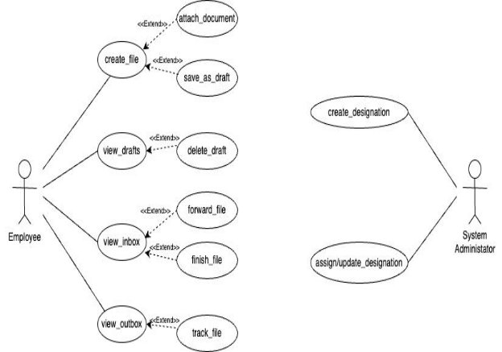
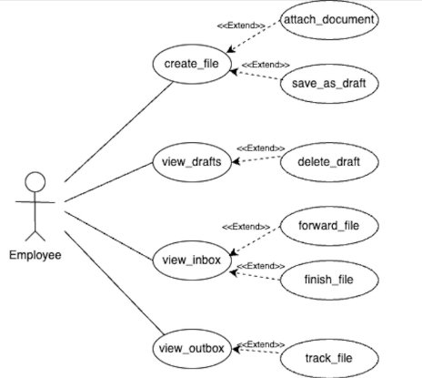
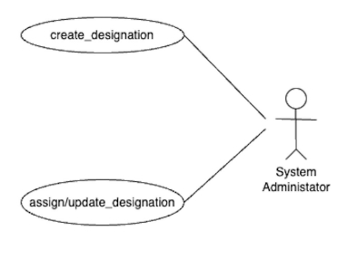

# Authentication Module Documentation

## Table of Contents
- [User-Centered Design (UCD)](#user-centered-design-ucd)
- [SRS Application](#srs-application)
- [SRS Web Interface](#srs-web-interface)
- [API Specifications](#api-specifications)
- [UI for Application](#ui-for-application)
- [UI for Web](#ui-for-web)
- [Database Schema](#database-schema)

## User-Centered Design (UCD)

## SRS Application

**Prepared by:**

- Divyansh Tripathi - 21BCS078
- Siddhant Raj - 21BCS199
- Advay Sagarkar - 21BCS011
- Samruddhi Khade - 21BCS115
- Bhakti Balanse - 21BCS053
- Yash Rastogi - 21BCS249
- Aishwarya Saxena - 21BCS013
- Kallam Yashwanth - 21BCS106
- Venkatesh Kumar - 21BCS127
- Sudhanshu - 21BCS210

**Faculty Mentor:** Avinash Chandra Pandey  
**Student Mentor:** Priyanshu Agarwal-21bcs167, Vansh Mittal-21bcs234

---

## 1. Introduction

### 1.1 Introduction about the Fusion – A Brief Description

Fusion IIIT is a special project at PDPM Indian Institute of Information Technology, Design, and Manufacturing in Jabalpur. It's like a smart helper created by students using Python 3.8 and Django Web framework. The goal is to make things easier and better at the institute.

Fusion IIIT does many things. First, it helps with administrative tasks, making paperwork and processes simpler and more organized. It's like a superhero for efficient management. Second, in academics, it adds a digital touch to make learning better and easily manage courses. But Fusion IIIT doesn't stop there; it helps in different departments and sections, making sure everything runs smoothly on campus.

### 1.2 Purpose of the module

The primary objective of the file tracking module is to establish, uphold, and oversee the creation, maintenance, and management of files, while systematically tracking their progress. This module facilitates the seamless transfer and receipt of files related to IIIT work, empowering students, faculty members, or designated individuals to engage in efficient file-related activities within the system.

Designed for simplicity and user interaction, this module aims to create a user-friendly experience for all members utilizing the system. Whether it involves transferring or receiving files pertinent to IIIT-related tasks, the module ensures a smooth and straightforward process, fostering effective collaboration and streamlined file management within the IIIT community.

### 1.3 Scope of the module

The scope of the File Tracking System encompasses several key aspects to enhance user experience and ensure security. This includes creating a user-friendly interface tailored for employees, establishing a secure mode for system interactions, and implementing secure processes for file creation, tracking, and visualizing the entire file flow. The system prioritizes secured storage of confidential data on the server and grants appropriate privileges to different authorities. Additionally, it aims to efficiently handle a large number of files. Moreover, authenticated users will have the privilege to modify their account settings, such as the registered email address and login password, contributing to a more personalized and secure user environment.

---

## 2. User/Actor Characteristics

### 2.1 Employee

Represents individuals who are employed by the institution such as Faculty and Staff Members who wish to share important files.

**Role:** They are responsible for managing files and attaching extra information so that further actions can be taken on them.

**Specific Functionalities:**

- Create files and attach documents necessary to them
- Receive files from other employees and forward them with documents attached
- Tracks files that are sent or forwarded by the individual to other employees
- Can finish file whose objective has been achieved and send them to archive
- Save unfinished files to draft so that they can be edited later

### 2.2 System Administrator

**Role:** Supervises and manages the designations of employee accounts 

**Specific Functionalities:**

- Creating new designations
- Managing mapping of designations of employees

---

## 3. Functional Requirements

### 3.1 Use Case Diagram

**([useCase draw.io](https://app.diagrams.net/#G1zSkuoL04nwgNblDc3lMn0HgREDf1S66O))**

We have incorporated a few changes in the use case diagram by introducing new use cases - view_inbox, view_outbox to differentiate between the received and sent files respectively.

The use cases - forward_file, finish_file have been included in the view_inbox giving these functionalities to the user, either to forward the received file or to add remarks placing it to archives.

### 3.2 Use Case Description

Documentation of various use cases is as follows:

| **UC ID** | UC#1 |
|-----------|------|
| **Use case Name** | create_file |
| **Description** | The "create file" use case allows the employee to create a new file, give a description to it, attach files and add remarks to it. The employee can then send the created file to another employee by entering their name and designation through the Fusion portal. |
| **Actor** | Employee |
| **Precondition** | The employee is logged in into the portal. |
| **Main Flow** | 1. The employee navigates to the "create file" section.   2. The system displays the sections to add descriptions, content, remarks and attach files.   3. The employee fills the respective sections and then enters the name and designation of the next employee to whom the file is to be sent.   4. The employee has the option to save the created file as a draft or send it to the next employee. [A1] |
| **Postconditions** | The created file is sent to the next employee and an entry is made in the tracking section. |
| **Alternate Flow** | A1   1. The file is saved as draft in the drafts folder. |
| **Sub Flow** | NIL |
| **Global Alternate Flow** | NIL |

| **UC ID** | UC#2 |
|-----------|------|
| **Use case Name** | view_drafts |
| **Description** | The view_drafts use case allows the user to view drafts that have been saved by the user and allows them to complete it. |
| **Actor** | Employee |
| **Precondition** | The employee is logged in into the system. |
| **Main Flow** | 1. The employee navigates to the "Drafts" section and selects his designation to view the saved drafts.   2. The system displays the list of drafts saved by the user.   3. The employee can complete the draft or delete it. [A1][A2] |
| **Postconditions** | The created file is sent to the next employee and an entry is made in the tracking section. |
| **Alternate Flow** | A1   1. The user completes the file and sends it to the next user.   A2   1. The user deletes the draft and it is removed from the drafts section. |
| **Sub Flow** | NIL |
| **Global Alternate Flow** | NIL |

| **UC ID** | UC#3 |
|-----------|------|
| **Use case Name** | view_inbox |
| **Description** | The view_inbox use case allows the user to view the files that have been received by the user and allows them to add remarks and forward it to the next user. |
| **Actor** | Employee |
| **Precondition** | The employee is logged in into the system. |
| **Main Flow** | 1. The employee navigates to the "inbox" section and selects his designation to view the inbox.   2. The system displays the list of files, who sent it along with file ID.   3. The employee can add remarks to the file or forward it to the next employee. [A1][A2] |
| **Postconditions** | The file is sent to the next employee and an entry is made in the tracking section. |
| **Alternate Flow** | A1   1. The user adds remarks and forwards the file. |
| **Sub Flow** | NIL |
| **Global Alternate Flow** | NIL |

## UC#4: view_outbox
| **UC ID** | UC#4 |
|-----------|------|
| **Use case Name** | view_outbox |
| **Description** | The view_outbox use case allows the user to view files that have been sent by them to other employees. |
| **Actor** | Employee |
| **Precondition** | The employee is logged in into the system. |

### Main Flow
1. The employee navigates to the "Outbox" section and selects his designation to view the files sent.
2. The system displays the list of files sent by the user. [A1]

| **Postconditions** | The user has successfully viewed the outbox and now can track the files. |
|--------------------|-----------------------------------------------------|
| **Alternate Flow**  |  |
| A1                  | 1. The user can track the file by seeing the status in outbox. |
| **Sub Flow**       | NIL |
| **Global Alternate Flow** | NIL |

---

## UC#5: create_designation
| **UC ID** | UC#5 |
|-----------|------|
| **Use case Name** | create_designation |
| **Description** | The create_designation use case allows the SA to create new users and assign designation to them. |
| **Actor** | System administrator (SA) |
| **Precondition** | The administrator is logged in into the system. |

### Main Flow
1. The SA enters the details for the new user such as PFId [A1], email address [A1], full name [A1], password [A1], confirm password [A2], and indicates whether the new user account is of a new system administrator or not.
2. Click the “Create User” button. A success message is displayed back.
3. The SA will be redirected to the Dashboard.

| **Postconditions** | A new user will be created successfully and entry will be made into the database. |
|--------------------|-----------------------------------------------------|
| **Alternate Flow**  |  |
| A1                  | 1. PFId, new password and retype new password fields should not be empty and should contain valid PFid, valid password. |
| A2                  | 1. The confirm (retype) password and password fields must be the same. If not, an error pops up. |
| **Sub Flow**       | NIL |
| **Global Alternate Flow** | NIL |

---

## UC#6: assign/update designation
| **UC ID** | UC#6 |
|-----------|------|
| **Use case Name** | assign/update designation |
| **Description** | The assign/update designation use case allows the user to view files that have been sent by them to other employees. |
| **Actor** | System administrator (SA) |
| **Precondition** | The administrator is logged in into the system. |

### Main Flow
1. The SA assigns or updates the existing designations. [A1][A2]
2. Click the “Save” button. A success message is displayed back.
3. The SA will be redirected to the Dashboard.

| **Postconditions** | The designation is successfully updated and assigned. |
|--------------------|-----------------------------------------------------|
| **Alternate Flow**  |  |
| A1                  | 1. The SA updates the designation. |
| A2                  | 1. The SA assigns the designation. |
| **Sub Flow**       | NIL |
| **Global Alternate Flow** | NIL |

---

# Other Functional Requirements

1. The user should be able to attach a variety of types of files with the file they are sending and should be able to view them easily as well.
2. The user must be able to browse their computer and attach the required attachments to the main file.
3. The **Super admin** as well as the System Administrator of Fusion should be able to assign designations, and the inbox of the designations should be different as well.
4. The notifications generated should be able to redirect the user into the inbox.
5. The file tracking module must be able to integrate multiple workflows into the system.

# Other Constraints

## User Interfaces
The user interface should comply with the color scheming and dashboard design of the FUSIONIIT. Users should be able to navigate from one functionality to another. Intermodule navigation should be smooth. All the functionalities should be easy to use, and no specific training should be required for the usage of the module.

## Tech Stack Used
- Django Web Framework
- Django Rest Framework

# Business Rules

1. System Administrator can only manage user accounts, but cannot perform any operations on their files.
2. Only authenticated users with proper credentials are allowed access to the File Tracking System of only those files that are associated with them.
3. User roles and permissions determine the actions they can perform within the system.
4. Each file must follow a standardized workflow for processing, ensuring consistency.
5. Only administrators can modify system-wide settings.

# Non-Functional Requirements

## Security
Ensure data confidentiality and integrity. Role-based authorization provided by Django ensures that users can only perform actions relevant to their designated roles. This ensures that only authorized users with the correct designation can access the files that are associated with the actor.

# Module Dependencies with Other Fusion Modules

## UI Level
- The File tracking interface is accessed through the dashboard and therefore has a dependency on the dashboard UI.
- The File Tracking System is also dependent on the notifications tab of a user, to showcase notifications when they are received for an incoming file.

## DB Level Dependencies
### Outbound Dependencies:
| Sr No. | DB Model | Owner           | User         |
|--------|----------|----------------|--------------|
| 1      | File     | file tracking   | office_module |

### Inbound Dependencies:
| Sr No. | DB Model         | Owner | User         |
|--------|------------------|-------|--------------|
| 1      | ExtraInfo        | global| file tracking|
| 2      | Designation      | global| file tracking|
| 3      | HoldsDesignation  | global| file tracking|

## Module Level Dependencies
- The File Tracking module has a dependency on the notifications module for the generation of notifications.

## SRS Web Interface

**Prepared by:**

- Divyansh Tripathi - 21BCS078
- Siddhant Raj - 21BCS199
- Advay Sagarkar - 21BCS011
- Samruddhi Khade - 21BCS115
- Bhakti Balanse - 21BCS053
- Yash Rastogi - 21BCS249
- Aishwarya Saxena - 21BCS013
- Kallam Yashwanth - 21BCS106
- Venkatesh Kumar - 21BCS127
- Sudhanshu - 21BCS210

**Faculty Mentor:** Avinash Chandra Pandey  
**Student Mentor:** Priyanshu Agarwal-21bcs167, Vansh Mittal-21bcs234

---

## 1. Introduction

### 1.1 Introduction about the Fusion – A Brief Description

Fusion IIIT is a special project at PDPM Indian Institute of Information Technology, Design, and Manufacturing in Jabalpur. It's like a smart helper created by students using Python 3.8 and Django Web framework. The goal is to make things easier and better at the institute.

Fusion IIIT does many things. First, it helps with administrative tasks, making paperwork and processes simpler and more organized. It's like a superhero for efficient management. Second, in academics, it adds a digital touch to make learning better and easily manage courses. But Fusion IIIT doesn't stop there; it helps in different departments and sections, making sure everything runs smoothly on campus.

### 1.2 Purpose of the module

The primary objective of the file tracking module is to establish, uphold, and oversee the creation, maintenance, and management of files, while systematically tracking their progress. This module facilitates the seamless transfer and receipt of files related to IIIT work, empowering students, faculty members, or designated individuals to engage in efficient file-related activities within the system.

Designed for simplicity and user interaction, this module aims to create a user-friendly experience for all members utilizing the system. Whether it involves transferring or receiving files pertinent to IIIT-related tasks, the module ensures a smooth and straightforward process, fostering effective collaboration and streamlined file management within the IIIT community.

### 1.3 Scope of the module

The scope of the File Tracking System encompasses several key aspects to enhance user experience and ensure security. This includes creating a user-friendly interface tailored for employees, establishing a secure mode for system interactions, and implementing secure processes for file creation, tracking, and visualizing the entire file flow. The system prioritizes secured storage of confidential data on the server and grants appropriate privileges to different authorities. Additionally, it aims to efficiently handle a large number of files. Moreover, authenticated users will have the privilege to modify their account settings, such as the registered email address and login password, contributing to a more personalized and secure user environment.

---

## 2. User/Actor Characteristics

### 2.1 Employee

Represents individuals who are employed by the institution such as Faculty and Staff Members who wish to share important files.

**Role:** They are responsible for managing files and attaching extra information so that further actions can be taken on them.

**Specific Functionalities:**

- Create files and attach documents necessary to them
- Receive files from other employees and forward them with documents attached
- Tracks files that are sent or forwarded by the individual to other employees
- Can finish file whose objective has been achieved and send them to archive
- Save unfinished files to draft so that they can be edited later

### 2.2 System Administrator

**Role:** Supervises and manages the designations of employee accounts 

**Specific Functionalities:**

- Creating new designations
- Managing mapping of designations of employees

---

## 3. Functional Requirements

### 3.1 Use Case Diagram

**([useCase draw.io](https://app.diagrams.net/#G1zSkuoL04nwgNblDc3lMn0HgREDf1S66O))**

We have incorporated a few changes in the use case diagram by introducing new use cases - view_inbox, view_outbox to differentiate between the received and sent files respectively.

The use cases - forward_file, finish_file have been included in the view_inbox giving these functionalities to the user, either to forward the received file or to add remarks placing it to archives.

### 3.2 Use Case Description

Documentation of various use cases is as follows:

| **UC ID** | UC#1 |
|-----------|------|
| **Use case Name** | create_file |
| **Description** | The "create file" use case allows the employee to create a new file, give a description to it, attach files and add remarks to it. The employee can then send the created file to another employee by entering their name and designation through the Fusion portal. |
| **Actor** | Employee |
| **Precondition** | The employee is logged in into the portal. |
| **Main Flow** | 1. The employee navigates to the "create file" section.   2. The system displays the sections to add descriptions, content, remarks and attach files.   3. The employee fills the respective sections and then enters the name and designation of the next employee to whom the file is to be sent.   4. The employee has the option to save the created file as a draft or send it to the next employee. [A1] |
| **Postconditions** | The created file is sent to the next employee and an entry is made in the tracking section. |
| **Alternate Flow** | A1   1. The file is saved as draft in the drafts folder. |
| **Sub Flow** | NIL |
| **Global Alternate Flow** | NIL |

| **UC ID** | UC#2 |
|-----------|------|
| **Use case Name** | view_drafts |
| **Description** | The view_drafts use case allows the user to view drafts that have been saved by the user and allows them to complete it. |
| **Actor** | Employee |
| **Precondition** | The employee is logged in into the system. |
| **Main Flow** | 1. The employee navigates to the "Drafts" section and selects his designation to view the saved drafts.   2. The system displays the list of drafts saved by the user.   3. The employee can complete the draft or delete it. [A1][A2] |
| **Postconditions** | The created file is sent to the next employee and an entry is made in the tracking section. |
| **Alternate Flow** | A1   1. The user completes the file and sends it to the next user.   A2   1. The user deletes the draft and it is removed from the drafts section. |
| **Sub Flow** | NIL |
| **Global Alternate Flow** | NIL |

| **UC ID** | UC#3 |
|-----------|------|
| **Use case Name** | view_inbox |
| **Description** | The view_inbox use case allows the user to view the files that have been received by the user and allows them to add remarks and forward it to the next user. |
| **Actor** | Employee |
| **Precondition** | The employee is logged in into the system. |
| **Main Flow** | 1. The employee navigates to the "inbox" section and selects his designation to view the inbox.   2. The system displays the list of files, who sent it along with file ID.   3. The employee can add remarks to the file or forward it to the next employee. [A1][A2] |
| **Postconditions** | The file is sent to the next employee and an entry is made in the tracking section. |
| **Alternate Flow** | A1   1. The user adds remarks and forwards the file. |
| **Sub Flow** | NIL |
| **Global Alternate Flow** | NIL |

## UC#4: view_outbox
| **UC ID** | UC#4 |
|-----------|------|
| **Use case Name** | view_outbox |
| **Description** | The view_outbox use case allows the user to view files that have been sent by them to other employees. |
| **Actor** | Employee |
| **Precondition** | The employee is logged in into the system. |

### Main Flow
1. The employee navigates to the "Outbox" section and selects his designation to view the files sent.
2. The system displays the list of files sent by the user. [A1]

| **Postconditions** | The user has successfully viewed the outbox and now can track the files. |
|--------------------|-----------------------------------------------------|
| **Alternate Flow**  |  |
| A1                  | 1. The user can track the file by seeing the status in outbox. |
| **Sub Flow**       | NIL |
| **Global Alternate Flow** | NIL |

---

## UC#5: create_designation
| **UC ID** | UC#5 |
|-----------|------|
| **Use case Name** | create_designation |
| **Description** | The create_designation use case allows the SA to create new users and assign designation to them. |
| **Actor** | System administrator (SA) |
| **Precondition** | The administrator is logged in into the system. |

### Main Flow
1. The SA enters the details for the new user such as PFId [A1], email address [A1], full name [A1], password [A1], confirm password [A2], and indicates whether the new user account is of a new system administrator or not.
2. Click the “Create User” button. A success message is displayed back.
3. The SA will be redirected to the Dashboard.

| **Postconditions** | A new user will be created successfully and entry will be made into the database. |
|--------------------|-----------------------------------------------------|
| **Alternate Flow**  |  |
| A1                  | 1. PFId, new password and retype new password fields should not be empty and should contain valid PFid, valid password. |
| A2                  | 1. The confirm (retype) password and password fields must be the same. If not, an error pops up. |
| **Sub Flow**       | NIL |
| **Global Alternate Flow** | NIL |

---

## UC#6: assign/update designation
| **UC ID** | UC#6 |
|-----------|------|
| **Use case Name** | assign/update designation |
| **Description** | The assign/update designation use case allows the user to view files that have been sent by them to other employees. |
| **Actor** | System administrator (SA) |
| **Precondition** | The administrator is logged in into the system. |

### Main Flow
1. The SA assigns or updates the existing designations. [A1][A2]
2. Click the “Save” button. A success message is displayed back.
3. The SA will be redirected to the Dashboard.

| **Postconditions** | The designation is successfully updated and assigned. |
|--------------------|-----------------------------------------------------|
| **Alternate Flow**  |  |
| A1                  | 1. The SA updates the designation. |
| A2                  | 1. The SA assigns the designation. |
| **Sub Flow**       | NIL |
| **Global Alternate Flow** | NIL |

---

# Other Functional Requirements

1. The user should be able to attach a variety of types of files with the file they are sending and should be able to view them easily as well.
2. The user must be able to browse their computer and attach the required attachments to the main file.
3. The **Super admin** as well as the System Administrator of Fusion should be able to assign designations, and the inbox of the designations should be different as well.
4. The notifications generated should be able to redirect the user into the inbox.
5. The file tracking module must be able to integrate multiple workflows into the system.

# Other Constraints

## User Interfaces
The user interface should comply with the color scheming and dashboard design of the FUSIONIIT. Users should be able to navigate from one functionality to another. Intermodule navigation should be smooth. All the functionalities should be easy to use, and no specific training should be required for the usage of the module.

## Tech Stack Used
- Django Web Framework
- Django Rest Framework

# Business Rules

1. System Administrator can only manage user accounts, but cannot perform any operations on their files.
2. Only authenticated users with proper credentials are allowed access to the File Tracking System of only those files that are associated with them.
3. User roles and permissions determine the actions they can perform within the system.
4. Each file must follow a standardized workflow for processing, ensuring consistency.
5. Only administrators can modify system-wide settings.

# Non-Functional Requirements

## Security
Ensure data confidentiality and integrity. Role-based authorization provided by Django ensures that users can only perform actions relevant to their designated roles. This ensures that only authorized users with the correct designation can access the files that are associated with the actor.

# Module Dependencies with Other Fusion Modules

## UI Level
- The File tracking interface is accessed through the dashboard and therefore has a dependency on the dashboard UI.
- The File Tracking System is also dependent on the notifications tab of a user, to showcase notifications when they are received for an incoming file.

## DB Level Dependencies
### Outbound Dependencies:
| Sr No. | DB Model | Owner           | User         |
|--------|----------|----------------|--------------|
| 1      | File     | file tracking   | office_module |

### Inbound Dependencies:
| Sr No. | DB Model         | Owner | User         |
|--------|------------------|-------|--------------|
| 1      | ExtraInfo        | global| file tracking|
| 2      | Designation      | global| file tracking|
| 3      | HoldsDesignation  | global| file tracking|

## Module Level Dependencies
- The File Tracking module has a dependency on the notifications module for the generation of notifications.

## API Specifications

## Student Mentor:
- Priyanshu Agarwal - 21BCS167
- Vansh Mittal - 21BCS234

## Prepared by:
- Divyansh Tripathi - 21BCS078
- Siddhant Raj - 21BCS199
- Advay Sagarkar - 21BCS011
- Samruddhi Khade - 21BCS115
- Bhakti Balanse - 21BCS053

---

## WEB API DOCUMENTATION

### Module Description:
The primary objective of the file tracking module is to establish, uphold, and oversee the creation, maintenance, and management of files, while systematically tracking their progress. This module facilitates the seamless transfer and receipt of files related to IIIT work, empowering students, faculty members, or designated individuals to engage in efficient file-related activities within the system.

The System allows people to share, view, track, and forward files and can be used by other modules to implement a specific ‘file-motion’ workflow.

### Main Actors in this module are:
- **Employee (Staff)**
- **System Administrator**

---

### APIs Used and Status: VIEWS STATUS
These are the already implemented web views that serve static-rendered templates. There are minor bugs in some of the views but the implementation and logic are otherwise updated.

1. **filetracking(request):** Already implemented
2. **drafts(request):** Already implemented
3. **fileview(request,id):** Already implemented
4. **fileview1(request,id):** Already implemented
5. **fileview2(request,id):** Already implemented
6. **outward(request,id):** Already implemented
7. **inward(request,id):** Already implemented
8. **confirmdelete(request,id):** Already implemented
9. **forward(request,id):** Already implemented
10. **archive_design(request):** Already implemented
11. **archive(request,id):** Already implemented
12. **archive_finish(request,id):** Already implemented
13. **finish_design(request):** Already implemented
14. **finish_fileview(request,id):** Already implemented
15. **finish(request,id):** Already implemented
16. **AjaxDropdown1(request):** Already implemented
17. **AjaxDropdown(request):** Already implemented
18. **test(request):** Already implemented
19. **delete(request,id):** Already implemented
20. **forward_inward(request,id):** Already implemented

- [GAD-4 File Tracking Use Cases](https://docs.google.com/document/d/1Ow-XYX79gOBDzpJQiwQI5FPUiqClaqF7wMN2-ogirXE/edit?usp=sharing)

---

### Use Cases
- **create_file - UC#1**
  - Index of views used: 1, 9, 13, 14, 15, 16, 17, 18
  - **Description:** Allows the employee to create a new file, give a description to it, attach files, and add remarks to it.
  - **Database:** File, Tracking, Designation, HoldsDesignation, User, ExtraInfo

- **view_drafts - UC#2**
  - Index of views used: 2, 3, 8, 10, 11, 12, 18, 19
  - **Description:** Allows the user to view drafts that have been saved by the user and allows them to complete it.
  - **Database:** File, HoldsDesignation, User, ExtraInfo

- **view_inbox - UC#3**
  - Index of views used: 5, 7, 8, 9, 13, 14, 15, 18, 19, 20
  - **Description:** Allows the user to view the files that have been received by the user and allows them to add remarks and forward it to the next user.
  - **Database:** File, Tracking, HoldsDesignation, User, ExtraInfo

- **view_outbox - UC#4**
  - Index of views used: 4, 6, 8, 18, 19
  - **Description:** Allows the user to view files that have been sent by them to other employees.
  - **Database:** File, Tracking, Designation, HoldsDesignation, User, ExtraInfo

---

### DETAILED VIEW EXPLANATION

- **filetracking(request):**
  - **Use case (as per SRS):** UC#1
  - **Purpose:**
    - Handles file creation and tracking within the application.
    - Requires user authentication for access.
  - **Database:** File, Tracking, Designation, HoldsDesignation, User, ExtraInfo

- **drafts(request):**
  - **Use case (as per SRS):** UC#2
  - **Purpose:**
    - Retrieves the user's designation and renders it on the "drafts" template.
    - Requires user authentication for access.
  - **Database:** Designation.

- **fileview(request,id):**
  - **Use case (as per SRS):** UC#2
  - **Purpose:**
    - Displays files created by the user, specifically those without tracking entries (likely drafts).
    - Requires user authentication for access.
  - **Database:** ExtraInfo, file, Tracking, HoldsDesignation

- **fileview1(request,id):**
  - **Use case (as per SRS):** UC#4
  - **Purpose:**
    - Displays files sent by the user to others, serving as an "Outbox" feature.
    - Requires user authentication for access.
  - **Database:** Tracking, HoldsDesignation.

- **fileview2(request,id):**
  - **Use case (as per SRS):** UC#3
  - **Purpose:**
    - Displays files received by the user from others, serving as an "Inbox" feature.
    - Requires user authentication for access.
  - **Database:** Tracking, HoldsDesignation.

- **outward(request):**
  - **Use case (as per SRS):** UC#4
  - **Purpose:**
    - Fetches the different designations held by the user and renders them on the "outward" template.
    - Requires user authentication for access.
  - **Database:** Designation.

- **inward(request):**
  - **Use case (as per SRS):** UC#3
  - **Purpose:**
    - Fetches the different designations held by the user and renders them on the "inward" template.
    - Requires user authentication for access.
  - **Database:** Designation.

- **confirmdelete(request,id):**
  - **Use case (as per SRS):** UC#2, UC#3, UC#4
  - **Purpose:**
    - Displays a file deletion confirmation page for a specific file.
    - Requires user authentication for access.
    - Serves as an intermediary step before actual deletion, allowing user confirmation.
  - **Database:** File

- **forward(request,id):**
  - **Use case (as per SRS):** UC#1, UC#3
  - **Purpose:**
    - Handles forwarding of received files, including marking as read, adding remarks and attachments, and recording forwarding events in the "Tracking" model.
  - **Database:** File, Tracking, HoldsDesignation, User, Designation.

- **archive_design(request):**
  - **Use case (as per SRS):** UC#2
  - **Purpose:**
    - Renders the "archive_design" template, providing the user's designations for selection or display.
    - Likely serves as the initial step in an archive-related process.
    - Requires user authentication for access.
    - Employs select_related for optimized database queries.
  - **Database:** HoldsDesignation

- **archive(request, id):**
  - **Use case (as per SRS):** UC#2
  - **Purpose:**
    - Displays a list of archived files, likely for viewing or further actions.
    - Requires user authentication for access.
  - **Database:** File, HoldsDesignation, ExtraInfo

- **archive_finish(request, id):**
  - **Use case (as per SRS):** UC#2
  - **Purpose:**
    - Renders details of a specific archived file, likely for review or final actions.
    - Requires user authentication for access.
  - **Database:** File, Tracking

- **finish_design(request):**
  - **Use case (as per SRS):** UC#1, UC#3
  - **Purpose:**
    - Renders the "finish_design" template, providing the user's designations for selection or display.
    - Serves as the initial step in a process related to finalizing files.
    - Requires user authentication for access.
    - Interacts primarily with the "HoldsDesignation" model to retrieve designation information.
    - Employs select_related for optimized database queries.
    - The specific file finalization logic is handled by a separate view or function, triggered from the "finish_design" template.
  - **Database:** HoldsDesignation

- **finish_fileview(request, id):**
  - **Use case (as per SRS):** UC#1, UC#3
  - **Purpose:**
    - Displays a list of files awaiting finalization, specifically those uploaded by the current user and not yet read by any recipient.
    - Serves as a step in the file finalization process.
    - Requires user authentication for access.
    - The list likely serves as a reference for the user to proceed with finalizing specific files.
  - **Database:** File, Tracking

- **finish(request, id):**
  - **Use case (as per SRS):** UC#1, UC#3
  - **Purpose:**
    - Finalizes a file by marking it as completed within the system, updating its status and associated tracking information.
    - Requires user authentication for access.
    - Interacts with the "Tracking" model to update file status and may also involve notifying relevant parties or logging actions for audit purposes.
  - **Database:** File, Tracking

- **AjaxDropdown1(request):**
  - **Use case (as per SRS):** UC#1
  - **Purpose:**
    - Serves as an endpoint for fetching dropdown options dynamically, likely for forms within the module.
    - Facilitates user interactions by providing real-time selections based on existing data.
    - Can be utilized by JavaScript on the frontend for seamless user experience.
  - **Database:** Designation

- **AjaxDropdown(request):**
  - **Use case (as per SRS):** UC#1
  - **Purpose:**
    - Similar to `AjaxDropdown1`, this endpoint likely serves a different set of dropdown options or data for dynamic forms.
    - Enhances user experience by enabling live updates of selectable options based on user input or selections.
  - **Database:** HoldsDesignation

- **test(request):**
  - **Use case (as per SRS):** UC#1
  - **Purpose:**
    - A test endpoint used for development and debugging purposes, possibly for testing AJAX calls or form submissions.
    - Likely not a part of the final module but serves to ensure that individual components are functioning correctly.
  - **Database:** None

- **delete(request, id):**
  - **Use case (as per SRS):** UC#2, UC#3, UC#4
  - **Purpose:**
    - Permanently deletes a specified file from the system, requiring user confirmation before proceeding.
    - Essential for maintaining file management and preventing unauthorized deletions.
    - Requires user authentication for access.
  - **Database:** File

- **forward_inward(request, id):**
  - **Use case (as per SRS):** UC#1, UC#3
  - **Purpose:**
    - Similar to the `forward` function, but specifically handles the forwarding of inward files, with tracking and remarks as necessary.
  - **Database:** File, Tracking, HoldsDesignation, User, Designation

# CURRENT PROBLEMS WITH THE FILE TRACKING MODULE (GAD-4)

## Issues Identified

1. **Use Case #3: `view_inbox ← archive_file`**
   - **Description:** This use case can be implemented using a PATCH request endpoint as utilized in the front end. 
   - **Considerations:** Its interaction with other modules needs to be taken into account to ensure seamless functionality.

2. **Use Case #2: Drafts Logic Implementation**
   - **Description:** The logic for handling drafts needs to be implemented separately for each module. 
   - **Current Status:** The drafts logic is currently only implemented for the file tracking module.

---

## References
- [Google Doc Link: GAD-4 FileTracking API](https://docs.google.com/document/d/1kp8H_cpCyEAWIONtiNtKNlnxLBp5mJ1nHHxrCkYQoFU/edit)

## UI for Application

## 1. Module Description

The primary objective of the file tracking module is to establish, uphold, and oversee the creation, maintenance, and management of files, while systematically tracking their progress. This module facilitates the seamless transfer and receipt of files related to IIIT work, empowering students, faculty members, or designated individuals to engage in efficient file-related activities within the system.

The System allows people to share, view, track, and forward files and can be used by other modules to implement a specific ‘file-motion’ workflow.

## Use Case Specification

### UC1# create_file

The "create file" use case allows the employee to create a new file, give a description to it, attach files, and add remarks to it. The employee can then send the created file to another employee by entering their name and designation through the Fusion portal.

### UC2# view_drafts

The view_drafts use case allows the user to view drafts that have been saved by the user and allows them to complete it.

### UC3# view_inbox

The view_inbox use case allows the user to view the files that have been received by the user and allows them to add remarks and forward it to the next user.

### UC4# view_outbox

The view_outbox use case allows the user to view files that have been sent by them to other employees.

### UC5# create_designation

The create_designation use case allows the SA to create new users and assign designations to them.

### UC6# assign/update designation

The assign/update designation use case allows the user to view files that have been sent by them to other employees.

## Actors

### 1. Employee (Staff)

Employees aim to use the system for managing various aspects of file creation, tracking, and communication. They may use it to organize documents, collaborate with others, track tasks, and ensure the smooth flow of information within their workflow or organization.

#### Use Case for Employee (Staff)

**Figma Profile:** [Employee](https://www.figma.com/file/oHcPnpdJgHgBhy2abHOQAt/FTS-mobile?type=design&node-id=0-1&mode=design&t=oZp3gsWetkhkqYue-0)

### 2. System Administrator

System Administrator aims to use the system to streamline file management processes by assigning specific roles and responsibilities to users. By defining and assigning designations within the system, they ensure that the right people have access to the appropriate files and that workflows are efficiently managed. This actor could be a system administrator or a file management coordinator within the organization, responsible for organizing and optimizing file tracking procedures.

#### Use Case for System Administrator

**Figma Profile:** [System Administrator](https://www.figma.com/file/oHcPnpdJgHgBhy2abHOQAt/FTS-mobile?type=design&node-id=531-37&mode=design&t=oZp3gsWetkhkqYue-0)

## Figma Profile Design Guidelines and Additional Considerations

1. **Cross-Platform Compatibility:**
   - Yes, Figma designs are compatible with both web and app versions.
2. **Dimension Standardization:**
   - Yes, all Figma designs have the dimensions around 360px width for mobile.

## 5.3 Actor-Oriented Use Case-Based Design

- No Figma designs were made previously; we have made them from scratch.

### Employee Use-Case Based Design

[Employee Use-Case Based Design](https://www.figma.com/file/oHcPnpdJgHgBhy2abHOQAt/FTS-mobile?type=design&node-id=0-1&mode=design&t=oZp3gsWetkhkqYue-0)

### System Administrator Use-Case Based Design

[System Administrator Use-Case Based Design](https://www.figma.com/file/oHcPnpdJgHgBhy2abHOQAt/FTS-mobile?type=design&node-id=531-37&mode=design&t=oZp3gsWetkhkqYue-0)

## UI for Web

## 1. Module Description

The primary objective of the file tracking module is to establish, uphold, and oversee the creation, maintenance, and management of files, while systematically tracking their progress. This module facilitates the seamless transfer and receipt of files related to IIIT work, empowering students, faculty members, or designated individuals to engage in efficient file-related activities within the system.

The System allows people to share, view, track, and forward files and can be used by other modules to implement a specific ‘file-motion’ workflow.

## Use Case Specification

### UC1# create_file

The "create file" use case allows the employee to create a new file, give a description to it, attach files and add remarks to it. The employee can then send the created file to another employee by entering their name and designation through the Fusion portal.

### UC2# view_drafts

The view_drafts use case allows the user to view drafts that have been saved by the user and allows them to complete it.

### UC3# view_inbox

The view_inbox use case allows the user to view the files that have been received by the user and allows them to add remarks and forward it to the next user.

### UC4# view_outbox

The view_outbox use case allows the user to view files that have been sent by them to other employees.

### UC5# create_designation

The create_designation use case allows the SA to create new users and assign designation to them.

### UC6# assign/update designation

The assign/update designation use case allows the user to view files that have been sent by them to other employees.

## Actors

### 1. Employee (Staff)

Employees aim to use the system for managing various aspects of file creation, tracking, and communication. They may use it to organize documents, collaborate with others, track tasks, and ensure the smooth flow of information within their workflow or organization.

#### Use Case for Employee (Staff)

**Web Figma Profile:** [Employee View Web](https://www.figma.com/file/khjAgboyK1ppY1YMiAGRPS/FILE-TRACKING---WEB?type=design&node-id=0%3A1&mode=design&t=9U9dIXcQq6u7Qz5k-1)

### 2. System Administrator

System Administrator aims to use the system to streamline file management processes by assigning specific roles and responsibilities to users. By defining and assigning designations within the system, they ensure that the right people have access to the appropriate files and that workflows are efficiently managed. This actor could be a system administrator or a file management coordinator within the organization, responsible for organizing and optimizing file tracking procedures.

#### Use Case for System Administrator

**Figma Profile:** [SysAdmin Web](https://www.figma.com/file/khjAgboyK1ppY1YMiAGRPS/FILE-TRACKING---WEB?type=design&node-id=0-1&mode=design)

## Figma Profile Design Guidelines and Additional Considerations

1. **Cross-Platform Compatibility:**
   - Yes, figma designs are compatible with both web and app versions.
2. **Dimension Standardization:**
   - Yes, all Figma designs have the correct Dimensions.

## 5.3 Actor-Oriented Use Case-Based Design

- No figma designs were made previously, we have made them from scratch.

## Database Schema

**Faculty Mentor** - Dr. Avinash Chandra Pandey  
**Student Mentor** - Priyanshu Aggarwal, Vansh Mittal  

## Database Documentation of [GAD 4 - File Tracking System] 4.0

### Overview of the Module:

- **SRS:** [Link](https://docs.google.com/document/u/0/d/1t1t1nLu7sUACYa1DWW3l45sC31nYY9U9IR3xQQDyhUw/edit)  
- **A. ER Diagram (to be created using draw.io):** [ER Diagram](https://app.diagrams.net/?src=about#G1gN5vxqYqs67pQrPvOdHRCJUskix0LfEZ)   
- **B. Database Schema Info (in the Google sheet):** [Database Schema](https://docs.google.com/spreadsheets/d/1VwzdAB8SQV-psVPPrHrowAeJNAIXNpELAfc7Kb6e7jg/edit#gid=0)  
- **C. Mention all the changes required in the currently implemented Tables:**  
  **(These changes will be done in this current version 4.0)**

#### 1) File  
- **src_module:**  
  1) **Change:** Added a new character field to the File model.  
  2) **Justification:** This addition helps identify the module or source within the system that generated or uploaded the file. This information is valuable for:  
     - Categorizing and tracking files based on their origin.  
     - Improving search and filtering capabilities based on the source module.  
     - Understanding the context and usage of different files within the system.  

- **src_object_id:**  
  a) **Change:** Added a new nullable character field to the File model.  
  b) **Justification:** This addition allows storing an identifier for the specific object within the source module that the file is associated with. This provides more granular tracking and linking compared to just the module name.

- **file_extra_JSON:**  
  - **Change:** Added a new nullable JSON field to the File model.  
  - **Justification:** This addition offers a flexible way to store additional information related to the file without modifying the main model structure.

---

#### 2) Tracking  
- **tracking_extra_JSON**  
  1) **Change:** Added a new nullable JSON field to the Tracking model.  
  2) **Justification:** This addition offers a flexible way to store additional information related to the file tracking process without modifying the main model structure.

### D. Data Availability for API and Functional Testing

#### D.1 Mention the tables that are already populated
- File  
- Tracking

#### D.2 Mention the tables required to be populated
- None

#### D.3 Mention any difficulties faced by your team regarding populating any table (if any)

