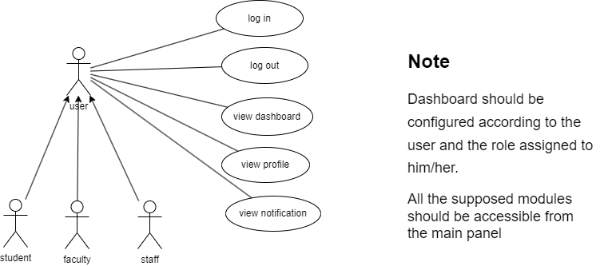
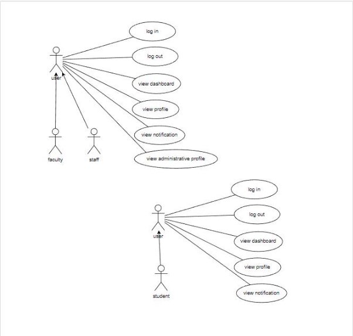

# Authentication Module Documentation

## Table of Contents
- [User-Centered Design (UCD)](#user-centered-design-ucd)
- [SRS Application](#srs-application)
- [SRS Web Interface](#srs-web-interface)
- [API Specifications](#api-specifications)
- [UI for Application](#ui-for-application)
- [UI for Web](#ui-for-web)
- [Database Schema](#database-schema)

## User-Centered Design (UCD)

## SRS Application
# Fusion ERP

## Software Requirements Specification

**for**

**GAD-5-DASHBOARD**

**Prepared by:**

Pranjal Jha – 21BCS161  
Sukul Sarve - 21BCS213  
Suraj Kanojiya – 21BCS216  
Tushar Gupta – 21BCS223  
Nikhil Gupta – 21BCS147  
Arpit Tak – 21BCS034  

## 1. Introduction

### 1.1 Introduction about the Fusion – A Brief Description

FusionIIIT stands as a testament to the seamless integration and automation of diverse functions within PDPM Indian Institute of Information Technology, Design and Manufacturing, Jabalpur. Crafted with precision using Python 3.8 and powered by the Django Web framework, this initiative is a student-driven endeavor designed to elevate the institute's operational landscape. Encompassing everything from efficient administration management to academic prowess and miscellaneous departmental tasks, FusionIIIT is a holistic solution that harmonizes the intricacies of campus life.

### 1.2 Purpose of the Module

The primary purpose of the FusionIIIT Dashboard Module is to provide an intuitive and efficient platform for different user roles to access and manage their profiles, navigate to specific modules, and receive notifications from various departments. It aims to streamline administrative processes, enhance academic management, and foster communication across different levels within the institute.

### 1.3 Scope of the Module

The Dashboard Module encompasses profile management for users such as Students, Head of Department, Dean Academics, Dr Acad, Chairperson, Director, and Faculty. It allows users to view and manage their profiles, access specific modules based on their roles, and receive notifications from different departments. Administrative profiles are accessible for all roles except students.

## 2. User/Actor Characteristics

### 2.1 Student

- **Role**: Accesses academic and personal information.  
- **Specific Functionalities**:
  - Views and updates personal profile.
  - Navigates to academic modules.
  - Receives notifications related to academics.

### 2.2 Staff

- **Role**: Manages administrative functions for the department.  
- **Specific Functionalities**:
  - Views and manages administrative profiles.
  - Navigates to department-specific modules.
  - Receives department-related notifications.

### 2.3 Faculty

- **Role**: Manages academic-related tasks and receives notifications.  
- **Specific Functionalities**:
  - Views and manages academic profiles.
  - Navigates to academic modules.
  - Receives academic-related notifications.

## 3. Functional Requirements

### 3.1 Use Case Diagram

### 3.2 Use Case Description

#### Use Case 1: Access Dashboard

| UC ID           | UC#1                                                   |
| --------------- | ------------------------------------------------------ |
| **Use Case Name** | Access Dashboard                                       |
| **Description**  | Users with different roles access the FusionIIIT Dashboard to perform role-specific functions and view relevant information. |
| **Actors**       | Student, HOD, Dean Academics, Dr Acad, Chairperson, Director, Faculty |
| **Precondition** | Users are logged in with valid credentials.            |
| **Main Flow**    | 1. The user logs in to the system. 2. The system authenticates the user's credentials. 3. The user is directed to the Dashboard. 4. Based on the user's role, specific modules and information are displayed. |
| **Post conditions** | The user is successfully logged into the Dashboard and can access role-specific functionalities. |
| **Alternate Flow** | NIL                                                   |

#### Use Case 2: View Profile

| UC ID           | UC#2                                                   |
| --------------- | ------------------------------------------------------ |
| **Use Case Name** | View Profile                                           |
| **Description**  | Users can view and update their personal profiles through the FusionIIIT Dashboard. |
| **Actors**       | Student, HOD, Dean Academics, Dr Acad, Chairperson, Director, Faculty |
| **Precondition** | Users are logged in with valid credentials.            |
| **Main Flow**    | 1. The user navigates to the "View Profile" section on the Dashboard. 2. The system displays the user's profile information. 3. The user has the option to update their profile information. |
| **Post conditions** | The user's profile information is displayed, and updates are reflected in the system. |
| **Alternate Flow** | NIL                                                   |

#### Use Case 3: Navigate to Modules

| UC ID           | UC#3                                                   |
| --------------- | ------------------------------------------------------ |
| **Use Case Name** | Navigate to Modules                                    |
| **Description**  | Users navigate to specific modules on the Dashboard based on their roles. |
| **Actors**       | Student, HOD, Dean Academics, Dr Acad, Chairperson, Director, Faculty |
| **Precondition** | Users are logged in with valid credentials.            |
| **Main Flow**    | 1. The user navigates to the "Modules" section on the Dashboard. 2. The system displays a list of modules based on the user's role. 3. The user selects a specific module to access role-specific functionalities. |
| **Post conditions** | The user successfully navigates to the selected module and can perform role-specific tasks. |
| **Alternate Flow** | NIL                                                   |

#### Use Case 4: View Administrative Profile

| UC ID           | UC#4                                                   |
| --------------- | ------------------------------------------------------ |
| **Use Case Name** | View Administrative Profile                            |
| **Description**  | Users with administrative roles can view and manage administrative profiles through the FusionIIIT Dashboard. |
| **Actors**       | HOD, Dean Academics, Dr Acad, Chairperson, Director, Faculty |
| **Precondition** | Users with administrative roles are logged in with valid credentials. |
| **Main Flow**    | 1. The user with an administrative role navigates to the "View Administrative Profile" section on the Dashboard. 2. The system displays the administrative profile information. 3. The user can update administrative profile details. |
| **Post conditions** | The administrative profile information is displayed, and updates are reflected in the system. |
| **Alternate Flow** | NIL                                                   |

#### Use Case 5: Receive Notifications

| UC ID           | UC#5                                                   |
| --------------- | ------------------------------------------------------ |
| **Use Case Name** | Receive Notifications                                  |
| **Description**  | Users receive notifications from various modules and departments through the FusionIIIT Dashboard. |
| **Actors**       | Student, HOD, Dean Academics, Dr Acad, Chairperson, Director, Faculty |
| **Precondition** | Users are logged in with valid credentials.            |
| **Main Flow**    | 1. The user navigates to the "Notifications" section on the Dashboard. 2. The system displays a list of notifications from different modules and departments. 3. The user receives and views relevant notifications. |
| **Post conditions** | The user is informed about important updates and announcements. |
| **Alternate Flow** | NIL                                                   |

### 3.3 Other Functional Requirements

- Implement a search feature that allows users to quickly find specific information or modules within the dashboard.
- Each user role (Student, HOD, Dean Academics, Dr Acad, Chairperson, Director, Faculty) should have access to module-specific functionalities relevant to their responsibilities.
- The dashboard must be accessible from every module.
- Enable seamless integration between different modules to allow users to navigate smoothly between various functionalities.
- Users should have the option to set their preferred language for the dashboard interface.
- Include a feedback mechanism within the dashboard to gather input from users about their experience.
- Customize notification preferences based on user roles to ensure individuals receive relevant and important updates.
- Provide users with the option to switch between dark and light modes for the dashboard interface.
- It should provide a responsive and user-friendly interface.

### 3.4 Other Constraints

#### 3.4.1 User Interfaces

The user interface should comply with the color scheme and dashboard design of FUSIONIIT. Users should be able to navigate from one functionality to another. Inter-module navigation should be smooth. All functionalities should be easy to use, and no specific training should be required for the usage of the module.

#### 3.4.2 Tech Stack Used

- Django for backend  
- Python 3.8  
- HTML, CSS for frontend

## 4. Non-Functional Requirements

### 4.1 Performance

The system should respond to user interactions quickly. Response time for viewing profiles, administrative profiles, and notifications should be low.

### 4.2 Scalability

The system should handle a mass of concurrent users. System performance should be evaluated under increasing load conditions.

### 4.3 Availability

The system should be available 99.9% of the time.

### 4.4 Security

Ensure data confidentiality and integrity. Role-based authorization ensures that users can only perform actions relevant to their designated roles.

# 5. Module Dependencies with Other Fusion Modules

## 5.1. UI Level

This module will be seamlessly integrated into Fusion at the UI level, providing a unified interface for various actors. Each actor, depending on their role (Student, HOD, Dean Academics, Dr Acad, Chairperson, Director, Faculty), will access the module's functionalities through a role-specific dashboard. For example, students will have access to academic modules, while administrative roles will see additional administrative functionalities. The UI will be designed to ensure an intuitive and user-friendly experience for all actors.

## 5.3. Module Level Dependencies

This module will be accessible from every module from the top and the available sidebar.

## SRS Web Interface
# Fusion ERP

## Software Requirements Specification

**for**

**GAD-5-DASHBOARD**

**Prepared by:**

Pranjal Jha – 21BCS161  
Sukul Sarve - 21BCS213  
Suraj Kanojiya – 21BCS216  
Tushar Gupta – 21BCS223  
Nikhil Gupta – 21BCS147  
Arpit Tak – 21BCS034  

## 1. Introduction

### 1.1 Introduction about the Fusion – A Brief Description

FusionIIIT stands as a testament to the seamless integration and automation of diverse functions within PDPM Indian Institute of Information Technology, Design and Manufacturing, Jabalpur. Crafted with precision using Python 3.8 and powered by the Django Web framework, this initiative is a student-driven endeavor designed to elevate the institute's operational landscape. Encompassing everything from efficient administration management to academic prowess and miscellaneous departmental tasks, FusionIIIT is a holistic solution that harmonizes the intricacies of campus life.

### 1.2 Purpose of the Module

The primary purpose of the FusionIIIT Dashboard Module is to provide an intuitive and efficient platform for different user roles to access and manage their profiles, navigate to specific modules, and receive notifications from various departments. It aims to streamline administrative processes, enhance academic management, and foster communication across different levels within the institute.

### 1.3 Scope of the Module

The Dashboard Module encompasses profile management for users such as Students, Head of Department, Dean Academics, Dr Acad, Chairperson, Director, and Faculty. It allows users to view and manage their profiles, access specific modules based on their roles, and receive notifications from different departments. Administrative profiles are accessible for all roles except students.

## 2. User/Actor Characteristics

### 2.1 Student

- **Role**: Accesses academic and personal information.  
- **Specific Functionalities**:
  - Views and updates personal profile.
  - Navigates to academic modules.
  - Receives notifications related to academics.

### 2.2 Staff

- **Role**: Manages administrative functions for the department.  
- **Specific Functionalities**:
  - Views and manages administrative profiles.
  - Navigates to department-specific modules.
  - Receives department-related notifications.

### 2.3 Faculty

- **Role**: Manages academic-related tasks and receives notifications.  
- **Specific Functionalities**:
  - Views and manages academic profiles.
  - Navigates to academic modules.
  - Receives academic-related notifications.

## 3. Functional Requirements

### 3.1 Use Case Diagram

### 3.2 Use Case Description

#### Use Case 1: Access Dashboard

| UC ID           | UC#1                                                   |
| --------------- | ------------------------------------------------------ |
| **Use Case Name** | Access Dashboard                                       |
| **Description**  | Users with different roles access the FusionIIIT Dashboard to perform role-specific functions and view relevant information. |
| **Actors**       | Student, HOD, Dean Academics, Dr Acad, Chairperson, Director, Faculty |
| **Precondition** | Users are logged in with valid credentials.            |
| **Main Flow**    | 1. The user logs in to the system. 2. The system authenticates the user's credentials. 3. The user is directed to the Dashboard. 4. Based on the user's role, specific modules and information are displayed. |
| **Post conditions** | The user is successfully logged into the Dashboard and can access role-specific functionalities. |
| **Alternate Flow** | NIL                                                   |

#### Use Case 2: View Profile

| UC ID           | UC#2                                                   |
| --------------- | ------------------------------------------------------ |
| **Use Case Name** | View Profile                                           |
| **Description**  | Users can view and update their personal profiles through the FusionIIIT Dashboard. |
| **Actors**       | Student, HOD, Dean Academics, Dr Acad, Chairperson, Director, Faculty |
| **Precondition** | Users are logged in with valid credentials.            |
| **Main Flow**    | 1. The user navigates to the "View Profile" section on the Dashboard. 2. The system displays the user's profile information. 3. The user has the option to update their profile information. |
| **Post conditions** | The user's profile information is displayed, and updates are reflected in the system. |
| **Alternate Flow** | NIL                                                   |

#### Use Case 3: Navigate to Modules

| UC ID           | UC#3                                                   |
| --------------- | ------------------------------------------------------ |
| **Use Case Name** | Navigate to Modules                                    |
| **Description**  | Users navigate to specific modules on the Dashboard based on their roles. |
| **Actors**       | Student, HOD, Dean Academics, Dr Acad, Chairperson, Director, Faculty |
| **Precondition** | Users are logged in with valid credentials.            |
| **Main Flow**    | 1. The user navigates to the "Modules" section on the Dashboard. 2. The system displays a list of modules based on the user's role. 3. The user selects a specific module to access role-specific functionalities. |
| **Post conditions** | The user successfully navigates to the selected module and can perform role-specific tasks. |
| **Alternate Flow** | NIL                                                   |

#### Use Case 4: View Administrative Profile

| UC ID           | UC#4                                                   |
| --------------- | ------------------------------------------------------ |
| **Use Case Name** | View Administrative Profile                            |
| **Description**  | Users with administrative roles can view and manage administrative profiles through the FusionIIIT Dashboard. |
| **Actors**       | HOD, Dean Academics, Dr Acad, Chairperson, Director, Faculty |
| **Precondition** | Users with administrative roles are logged in with valid credentials. |
| **Main Flow**    | 1. The user with an administrative role navigates to the "View Administrative Profile" section on the Dashboard. 2. The system displays the administrative profile information. 3. The user can update administrative profile details. |
| **Post conditions** | The administrative profile information is displayed, and updates are reflected in the system. |
| **Alternate Flow** | NIL                                                   |

#### Use Case 5: Receive Notifications

| UC ID           | UC#5                                                   |
| --------------- | ------------------------------------------------------ |
| **Use Case Name** | Receive Notifications                                  |
| **Description**  | Users receive notifications from various modules and departments through the FusionIIIT Dashboard. |
| **Actors**       | Student, HOD, Dean Academics, Dr Acad, Chairperson, Director, Faculty |
| **Precondition** | Users are logged in with valid credentials.            |
| **Main Flow**    | 1. The user navigates to the "Notifications" section on the Dashboard. 2. The system displays a list of notifications from different modules and departments. 3. The user receives and views relevant notifications. |
| **Post conditions** | The user is informed about important updates and announcements. |
| **Alternate Flow** | NIL                                                   |

### 3.3 Other Functional Requirements

- Implement a search feature that allows users to quickly find specific information or modules within the dashboard.
- Each user role (Student, HOD, Dean Academics, Dr Acad, Chairperson, Director, Faculty) should have access to module-specific functionalities relevant to their responsibilities.
- The dashboard must be accessible from every module.
- Enable seamless integration between different modules to allow users to navigate smoothly between various functionalities.
- Users should have the option to set their preferred language for the dashboard interface.
- Include a feedback mechanism within the dashboard to gather input from users about their experience.
- Customize notification preferences based on user roles to ensure individuals receive relevant and important updates.
- Provide users with the option to switch between dark and light modes for the dashboard interface.
- It should provide a responsive and user-friendly interface.

### 3.4 Other Constraints

#### 3.4.1 User Interfaces

The user interface should comply with the color scheme and dashboard design of FUSIONIIT. Users should be able to navigate from one functionality to another. Inter-module navigation should be smooth. All functionalities should be easy to use, and no specific training should be required for the usage of the module.

#### 3.4.2 Tech Stack Used

- Django for backend  
- Python 3.8  
- HTML, CSS for frontend

## 4. Non-Functional Requirements

### 4.1 Performance

The system should respond to user interactions quickly. Response time for viewing profiles, administrative profiles, and notifications should be low.

### 4.2 Scalability

The system should handle a mass of concurrent users. System performance should be evaluated under increasing load conditions.

### 4.3 Availability

The system should be available 99.9% of the time.

### 4.4 Security

Ensure data confidentiality and integrity. Role-based authorization ensures that users can only perform actions relevant to their designated roles.

# 5. Module Dependencies with Other Fusion Modules

## 5.1. UI Level

This module will be seamlessly integrated into Fusion at the UI level, providing a unified interface for various actors. Each actor, depending on their role (Student, HOD, Dean Academics, Dr Acad, Chairperson, Director, Faculty), will access the module's functionalities through a role-specific dashboard. For example, students will have access to academic modules, while administrative roles will see additional administrative functionalities. The UI will be designed to ensure an intuitive and user-friendly experience for all actors.

## 5.3. Module Level Dependencies

This module will be accessible from every module from the top and the available sidebar.

## API Specifications
# Module Name – GAD – 5 (DASHBOARD MODULE)
**Student Mentor** – Pranjal Jha (21BCS161)

## API Documentation of GAD-5 - DASHBOARD Module

### Overview of the module

The purpose of the project entitled as DASHBOARD is to provide an intuitive and efficient platform for different user roles to access and manage their profiles, navigate to specific modules, and receive notifications from various departments.  

- Access Dashboard  
- View Profile  
- Navigate to Modules  
- View Administrative Profile  
- Receive Notifications  

### APIs in the module

1. **/accounts/login/** - Already implemented  
   - **Parameters required** – login, password  
   - **Description** - Login takes `{login and password}` as parameters and returns the details of the user for the dashboard.  

2. **/notifications/api/unread_list** – Yet to be implemented  

3. **/accounts/logout/** - Already implemented  
   - **Parameters required** - csrfmiddlewaretoken  
   - **Description** - Logout takes `{csrfmiddlewaretoken}` as parameters and redirects to the login page.  

### APIs

#### Already Implemented 
*(This means that API is already implemented and working as expected.)* 

- **login - UC#1**  
  - **Index of APIs used** - 1  
  - **Description** - Login takes `{login and password}` as parameters and returns the details of the user for the dashboard.  
  - **Database** – auth_user, globals_designation  

- **logout - UC#3**  
  - **Index of APIs used** - 3  
  - **Description** - Logout takes `{csrfmiddlewaretoken}` as parameters and redirects to the login page.  
  - **Database** – auth_user  

#### Yet to be implemented or Partially Working
*(API is not implemented so yet to be implemented or API is partially working i.e., it has breakage.)* 

- **notification - UC#2**  
  - **Index of APIs used** - 2  
  - **Description** - Function of this endpoint to fetch all the notifications across all the modules and show in the dashboard.  
  - **Database** – Yet to be decided  

### Current Problems You Are Facing with the Module or in Its Use Cases 

- NA  

## APIs in the Mobile Module

1. **/api/auth/login/** - Already implemented  
   - **Parameters required** – login, password  
   - **Description** - Login takes `{login and password}` as parameters and returns the details of the user for the dashboard.  

2. **notification api** – Yet to be implemented  

3. **/api/auth/logout/** - Already implemented  
   - **Parameters required** -  
   - **Description** - Logout takes `{}` as parameters and redirects to the login page.  

4. **/api/dashboard/** - Already implemented  
   - **Parameters required** – userId  
   - **Description** - Getting info about position, designation of the user based on which other functionality will run.  

### APIs

#### Already Implemented 
*(This means that API is already implemented and working as expected.)* 

- **login - UC#1**  
  - **Index of APIs used** - 1  
  - **Description** - Login takes `{login and password}` as parameters and returns the details of the user for the dashboard.  
  - **Database** – auth_user  

- **logout - UC#3**  
  - **Index of APIs used** - 3  
  - **Description** - Logout takes `{}` as parameters and redirects to the login page.  
  - **Database** – auth_user  

- **dashboard - UC#4**  
  - **Index of APIs used** - 4  
  - **Description** - Getting info about position, designation of the user based on which other functionality will run.  
  - **Database** – auth_users, globals_designation  

#### Yet to be implemented or Partially Working
*(API is not implemented so yet to be implemented or API is partially working i.e., it has breakage.)* 

- **notification - UC#2**  
  - **Index of APIs used** - 2  
  - **Description** - Function of this endpoint to fetch all the notifications across all the modules and show in the dashboard.  
  - **Database** – Yet to be decided  

### Current Problems You Are Facing with the Module or in Its Use Cases 

- NA  

### Google Drive Link
[Google Drive Link](https://docs.google.com/document/d/1REn6oT77pC3-fXn0PJB_IPOolEfzNZOyXYULqSnxq-Y/edit?addon_store)

## UI for Application
**Figma Profiles for Dashboard \[web and mobile\]**

## Student Mentor : Pranjal Jha	(21bcs161 ) Teammates:

Tushar Gupta(21bcs223) Nikhil Gupta(21bcs147) Sukul Sarve(21bcs213) Arpit Tak(21bcs034) Suraj Kanojiya(21bcs216)

1. **Module Description:**

The primary purpose of the FusionIIIT Dashboard Module is to provide an intuitive and efficient platform for different user roles to access and manage their profiles, navigate to specific modules, and receive notifications from various departments. It aims to streamline administrative processes, enhance academic management, and foster communication across different levels within the institute.

The Dashboard Module encompasses profile management for users such as Students, Head of Department, Dean Academics, Dr Acad, Chairperson, Director, and Faculty. It allows users to view and manage their profiles, access specific modules based on their roles, and receive notifications from different departments. Administrative profiles are accessible for all roles except students.

\-

2. # **Actors**

   1. ## Student:

Role: Accesses academic and personal information. Specific Functionalities:  
Views and updates personal profile. Navigates to academic modules.  
Receives notifications related to academics.

2. ## Staff

Role: Manages administrative functions for the department. Specific Functionalities:  
Views and manages administrative profiles. Navigates to department-specific modules. Receives department-related notifications.

3. ## Faculty:

Role: Manages academic-related tasks and receives notifications. Specific Functionalities:

Views and manages academic profiles. Navigates to academic modules.  
Receives academic-related notifications.  

**Figma Link:**

### **For Android: https://[www.figma.com/file/mmuXkFSpFshs59AfCUWYNi/Android-](http://www.figma.com/file/mmuXkFSpFshs59AfCUWYNi/Android-) Dashboard?type=design\&node-id=0-1\&mode=design\&t=zYQM42Yg1LpjEQwF-0**

**For Web: https://[www.figma.com/file/2h39lXg4FflmfNuPFijs7x/ass-](http://www.figma.com/file/2h39lXg4FflmfNuPFijs7x/ass-) 3?type=design\&node-id=0-1\&mode=design\&t=ALrW5rYBqGo14Cch-0**

**Figma Profile Design Guidelines and Additional Considerations**

1. **Cross-Platform Compatibility:**

- Verify that Figma designs and features are compatible across both web and app versions.

  2. ### **Dimension Standardization:**

- Ensure all Figma designs have the same dimensions: 1920 x 1080 for web and around 360px width for mobile.

  3. ### **Actor-oriented Use Case-Based Design:**

- Strictly base all Figma designs on use cases of actors and maintain consistency with previous and newly added designs.

\-- Each actor should have different page in figma

- If the Figma profiles are already existing make sure all the actors have their own figma profiles and also wireframe those across all use cases for that actor

- Figma link (only) for reference (Figma profiles created by the previous batch): https://[www.figma.com/file/pzhw34xBvEK0hm5Yx4bh0P/Fusion-](http://www.figma.com/file/pzhw34xBvEK0hm5Yx4bh0P/Fusion-) APP?type=design\&node-id=0%3A1\&mode=design\&t=J0f6T5YoUiKbp17u-1

## UI for Web
**Figma Profiles for Dashboard \[web and mobile\]**

## Student Mentor : Pranjal Jha	(21bcs161 ) Teammates:

Tushar Gupta(21bcs223) Nikhil Gupta(21bcs147) Sukul Sarve(21bcs213) Arpit Tak(21bcs034) Suraj Kanojiya(21bcs216)

1. **Module Description:**

The primary purpose of the FusionIIIT Dashboard Module is to provide an intuitive and efficient platform for different user roles to access and manage their profiles, navigate to specific modules, and receive notifications from various departments. It aims to streamline administrative processes, enhance academic management, and foster communication across different levels within the institute.

The Dashboard Module encompasses profile management for users such as Students, Head of Department, Dean Academics, Dr Acad, Chairperson, Director, and Faculty. It allows users to view and manage their profiles, access specific modules based on their roles, and receive notifications from different departments. Administrative profiles are accessible for all roles except students.

\-

2. # **Actors**

   1. ## Student:

Role: Accesses academic and personal information. Specific Functionalities:  
Views and updates personal profile. Navigates to academic modules.  
Receives notifications related to academics.

2. ## Staff

Role: Manages administrative functions for the department. Specific Functionalities:  
Views and manages administrative profiles. Navigates to department-specific modules. Receives department-related notifications.

3. ## Faculty:

Role: Manages academic-related tasks and receives notifications. Specific Functionalities:

Views and manages academic profiles. Navigates to academic modules.  
Receives academic-related notifications.  

**Figma Link:**

### **For Android: https://[www.figma.com/file/mmuXkFSpFshs59AfCUWYNi/Android-](http://www.figma.com/file/mmuXkFSpFshs59AfCUWYNi/Android-) Dashboard?type=design\&node-id=0-1\&mode=design\&t=zYQM42Yg1LpjEQwF-0**

**For Web: https://[www.figma.com/file/2h39lXg4FflmfNuPFijs7x/ass-](http://www.figma.com/file/2h39lXg4FflmfNuPFijs7x/ass-) 3?type=design\&node-id=0-1\&mode=design\&t=ALrW5rYBqGo14Cch-0**

**Figma Profile Design Guidelines and Additional Considerations**

1. **Cross-Platform Compatibility:**

- Verify that Figma designs and features are compatible across both web and app versions.

  2. ### **Dimension Standardization:**

- Ensure all Figma designs have the same dimensions: 1920 x 1080 for web and around 360px width for mobile.

  3. ### **Actor-oriented Use Case-Based Design:**

- Strictly base all Figma designs on use cases of actors and maintain consistency with previous and newly added designs.

\-- Each actor should have different page in figma

- If the Figma profiles are already existing make sure all the actors have their own figma profiles and also wireframe those across all use cases for that actor

- Figma link (only) for reference (Figma profiles created by the previous batch): https://[www.figma.com/file/pzhw34xBvEK0hm5Yx4bh0P/Fusion-](http://www.figma.com/file/pzhw34xBvEK0hm5Yx4bh0P/Fusion-) APP?type=design\&node-id=0%3A1\&mode=design\&t=J0f6T5YoUiKbp17u-1

## Database Schema
# Module Name – GAD 5 (Dashboard)
**Faculty Mentor** – Prof. Neelam Dayal  
**Student Mentor** – Pranjal Jha  

## Database Documentation of [GAD 5 – Dashboard (mobile and web)] 4.0

### Overview of the Module

The primary purpose of the FusionIIIT Dashboard Module is to provide an intuitive and efficient platform for different user roles to access and manage their profiles, navigate to specific modules, and receive notifications from various departments. It aims to streamline administrative processes, enhance academic management, and foster communication across different levels within the institute. 

The Dashboard Module encompasses profile management for users such as Students, Head of Department, Dean Academics, Dr Acad, Chairperson, Director, and Faculty. It allows users to view and manage their profiles, access specific modules based on their roles, and receive notifications from different departments. Administrative profiles are accessible for all roles except students.

### SRS

#### A. ER Diagram (to be using draw.io)
[Gad-5 ER-Diagram](https://drive.google.com/file/d/1Sxtx5wRC04rpED-tkIBq6QEt3lGYyMJH/view?usp=sharing)

#### B. Database Schema Info (in the Google Sheet)
[Dashboard Database Schema Info](https://docs.google.com/spreadsheets/d/1hHYEP9QZEXUS0MWdLNA1US_2Ptxrod95LNrkszavuN0/edit#gid=0)

#### C. Mention All the Changes Required in the Currently Implemented Tables
*(These changes will be done in the current version 4.0)*

1. **auth_user**

   - **last_login**
     - **Change**: last login needs to be removed  
     - **Justification**: not using this field anywhere  

2. **globals_holdsdesignation**

   - **user_id**
     - **Change**: remove user_id  
     - **Justification**: working_id and user_id have the same reference  

3. **globals_feedback**

   - **Remove Feedback table**

#### D. Data Availability for API and Functional Testing

##### D1. Mention the Tables That Are Already Populated

- auth_user  
- globals_departmentinfo  
- globals_extrainfo  
- globals_designation  
- globals_staff  
- globals_holdsdesignation  
- globals_faculty  
- academic_information_student  
- notifications_notification  

##### D2. Mention the Tables Required to Be Populated

##### D3. Mention Any Difficulties Faced by Your Team Regarding Populating Any Table

