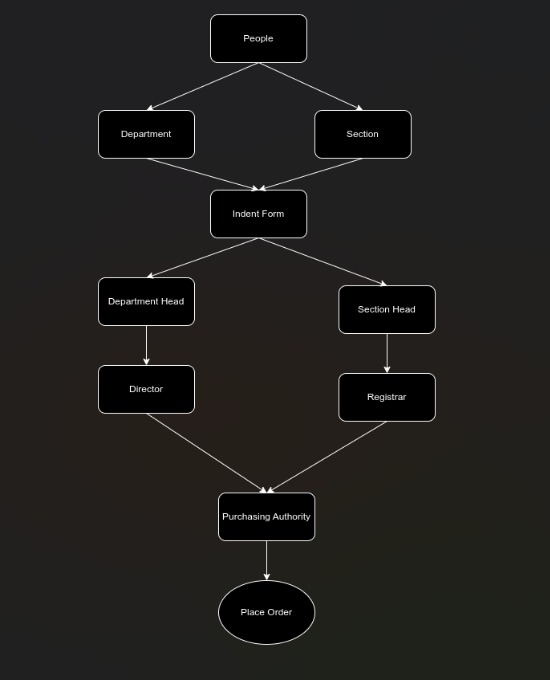
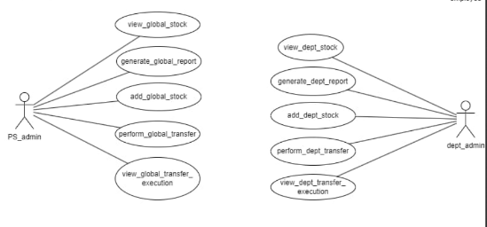
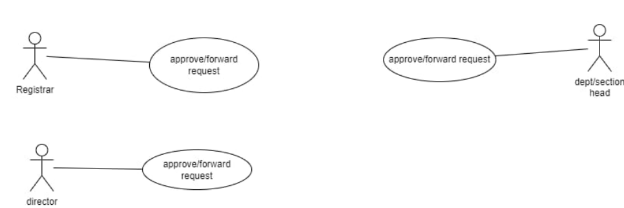
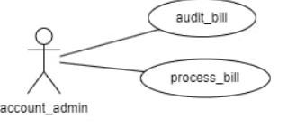
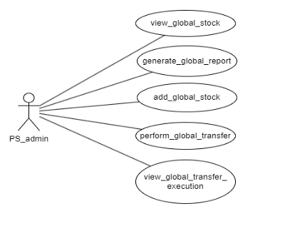
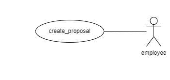
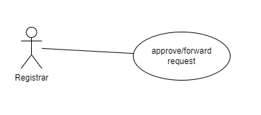
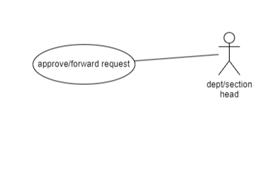

# GAD6 - Purchase and Store Documentation

## Table of Contents
1. [User-Centered Design (UCD)](#user-centered-design-ucd)
2. [SRS App](#srs-app)
3. [SRS Web Interface](#srs-web-interface)
4. [API Specifications](#api-specifications)
5. [UI for App](#ui-for-app)
6. [UI for Web](#ui-for-web)
7. [Database Schema](#database-schema)

## User-Centered Design (UCD)
### Overview

## SRS App
### Functional Requirements
#### Software Requirements Specification for Purchase and Store-Procedures**

**Prepared by:**

Utkarsh Raj(21BCS229)(Mentor)  
Naveen Kumar(21BCS142)  
Shreyansh Gupta(21BCS196)  
Somil Ajmera(21BCS204)  
Sarvagya Jain(21BCS186)  
Vaibhav Agarwal(21BCS231)  

---

## **Table of Contents**

**1.**      **Introduction**  	                                                   **3**  
**1.1**      **Purpose**                                          **3**  
**1.2**      **Module Scope**                               **3**  
**1.3**      **References**                                   **3**  

**2.**      **Overall Description**  	                                         **4**  
**2.1**      **Module Perspective**       	                   **4**  
**2.2**      **Module Functions**       	                   **4**  

**3.**      **Flow Diagram**   	                                               **5**  

**4.**      **System Features (Functional Requirements)**         **6**  
**4.1**       **Indent Filing**                              **6**  
**4.2**       **Indent Approval**                        **8** 	                             

**5.**      **Non Functional Requirements**   	                     **12**  
**6.**   **Dependency**                                                               **13**  
**7.**   **Tech Stack**                                                                **13**

---

## **1. Introduction**

### **1.1 Purpose**

There exists a lot of time overhead and paper-work involved in the process from indent filing of stock to its final issuance to the indenter. The whole process is quite cumbersome and also inconvenient for different actors involved in this process. With the use of Purchase and Store, the whole notion of indent filing would undergo a major shift from the paper-work based approval of stocks to online.

The project aims at designing and implementing a user-friendly approval of filed indent, which addresses the above-mentioned shortcomings of the traditional system. It would also cater to the needs of different classes of users, i.e., Employee(s), Head(s), Director, Registrar, Purchase Officer, and Dealing assistant.

### **1.2 Module Scope**

The Scope of the Purchase and Store Procedures includes:

- Providing a means for filing an indent. 
- Providing a means for tracking the status of the filled indent.  
- Providing secured means to get the indent approved.
- Providing a means to keep track of stocks procured/present.

### **1.3 References**

1. [Indent Form](https://www.iiitdmj.ac.in/downloads/forms/Indent%20Form.pdf)

---

## **2. Overall Description**

### **2.1 Module Perspective**

Indenter (faculty/staff) has a web-based user-interface through which they can interact with the Purchase and Store Procedures and perform indent filing. There is a login page for the users (faculty/staff) from where they can log into their accounts. After successfully logging into the account, the user can file an indent for the required product by filling up the indent form and forwarding it to his head/boss. Indentors can also view the status of its approval by higher authorities. This form is part of the employee-side interface.

Higher authorities (Head/Director) also have a web-based user-interface through which they can interact with this module and can view the received application of indent filed by the indenter. He/She can also give a remark for its approval/rejection. These form the part of the head/director interface.

Purchasing officer also has a web-based user-interface through which he/she can view the approved application and can check the current availability of funds with the corresponding department to give it financial approval.

Dealing assistant has a web-based user interface through which he/she can maintain the entry of procured stocks in the database.

Finally, the bill payment will be processed by the account section.

### **2.2 Module Functions**

This module can be used to file an indent by a faculty/staff member, get the indent approved by authorities, manage stocks, and also ensure a transparent system to keep track of the application status and payments involved.

An indenter is allowed to fill indent form(s), which will be sent for approval to the concerned person (Director/Registrar), and after approval, the procurement procedure will be initiated. When the item(s) are delivered, an entry of procured items will be made in stock tables followed by payment for the items received.

---

## **3. Flow Diagram**

Following are the users of the module:

- **Indenter**: A person serving the PDPM-IIITDM Jabalpur in some capacity, like a faculty or a staff member, with a PF number and an official institute email ID, which will be used to access the system.
- **Approver**: A person who will approve the indent filed by the indenter. Depending on the indenter, the approver can be Director (in case of faculty) and Registrar (in case of staff). In some cases, the file needs to be approved by an intermediate authority (like HOD) before it is sent to the upper authority.
- **Purchasing Officer**: The person responsible for the procurement of the items approved by authorities.

---

## **4. System Features (Functional Requirements)**

Here we require a file tracking system for all the interfaces for file forwarding. We also need a notification list to check the latest application we received. We need to allow only authorized persons to log in (secured login) through the particular module. We also need an accept or reject option only for the head/director. The designated person should only do the procurement stock entry (dealing assistant), and others should not have access to the database.

### **4.1 Indent Filing**

#### **Use Case #1: Indent Filing**

| UC ID       | UC#1              |
|-------------|--------------------|
| **Use case Name** | indent_filing |
| **Description** | This use case specifies filing of an indent by the indenter. After the form is filled, it is forwarded to higher authorities for approval. |
| **Actor** | Indenter |
| **Precondition** | The indenter must be logged into the system. |
| **Main Flow** | S No. Description |
| 1 | A Purchase and Store Dashboard is displayed initially to indenter after successful login. |
| 2 | The system presents the option of filing a new indent or tracking the status of past indents filed. |
| 3 | An employee selects one of the listed options to perform file operations. |
| 4 | Operations: File an Indent (create by filling form), View Indent Status (previous indents). |
| 5 | A successful message is displayed when indent is filed. |
| **Postcondition** | After operations are successfully performed, they will be reflected in the database. |

---

### **4.2 Indent Approval**

#### **Use Case #1: Section Approval**

| UC ID       | UC#2              |
|-------------|--------------------|
| **Use case Name** | Department/Section Approval |
| **Description** | This use case specifies the procedure for acceptance/rejection of proposed indent by department/section. |
| **Actor** | Head/Director/Registrar |
| **Precondition** | The user must be logged into the system. |
| **Main Flow** | S No. Description |
| 1 | User finds all proposed indents in his Inbox. |
| 2 | The user has the option to accept/reject the indent. Remarks can be added. |
| 3 | The indenter is notified about the status (acceptance/rejection) along with remarks. |
| 4 | If accepted, the Purchasing Officer is notified to proceed with procurement; otherwise, the indenter can edit/re-file. |

---

## Non-Functional Requirements
### **5. Non Functional Requirements**

- User-friendly UI
- The app should provide real-time transaction updates with minimal latency, aiming for a response time of less than 2 seconds for transaction queries.
- The app should be compatible with the latest versions of popular mobile operating systems (iOS and Android).
- The system should handle a minimum of 1000 concurrent users querying transactions simultaneously without significant performance degradation.
- Comprehensive logging should be implemented to capture relevant information for debugging and auditing purposes.

---

### **6. Dependency**

- File tracking system module

---

### **7. Tech Stack**

- **Flutter (Dart)**: Flutter is an open-source UI software development toolkit by Google, using Dart programming language, for building natively compiled applications for mobile.
- **PostgreSQL**: PostgreSQL is a powerful open-source relational database management system known for its extensibility, scalability, and robust support for complex queries.

## SRS Web Interface
### Features
Detailed features of the web interface.

### Technical Specifications
Technologies used, frameworks, and other technical details.

## API Specifications
**Module Name**: GAD-6 (Purchase and Store)  
**Student Mentor**: Siddharth Tandon (21BCS200)

---

### **Overview of the Module**

This module enables faculty/staff members to file an indent, get it approved by authorities, manage stocks, and ensure a transparent system for tracking application status and payments involved.

---

### **Endpoints**

#### 1. **Create Proposal**
- **Endpoint**: `purchase-and-store/create_proposal/request{usertype,data}`
- **Parameters Required**: `usertype`, `data`
- **Description**: Allows employees to file an indent (create a proposal) by filling out an online form.

#### 2. **Forward Request**
- **Endpoint**: `purchase-and-store/forward_request/request{usertype,data}`
- **Parameters Required**: `usertype`, `data`
- **Description**: Enables department/section heads, directors, or registrars to approve and forward the indent from their section.

#### 3. **View Stock**
- **Endpoint**: `purchase-and-store/view_stock/{usertype}`
- **Parameters Required**: `usertype`
- **Description**: Allows PS_admin or Department admin to view available stocks.
- **Status**: Implemented

#### 4. **Add Stock**
- **Endpoint**: `purchase-and-store/add_stock/request{usertype,data}`
- **Parameters Required**: `usertype`, `data`
- **Description**: Allows PS_admin or Department admin to add, modify, or delete stock information.

#### 5. **Generate Report**
- **Endpoint**: `purchase-and-store/generate_report/{usertype}`
- **Parameters Required**: `usertype`
- **Description**: Allows PS_admin to view reports of all departments after stock updates; Department admin can view department-specific reports.

#### 6. **Perform Transfer**
- **Endpoint**: `purchase-and-store/perform_transfer/request{usertype,data}`
- **Parameters Required**: `usertype`, `data`
- **Description**: Allows PS_admin to transfer items to other departments, and Department admin to transfer items to other departments or the Global administrator.

#### 7. **View Transfer Execution**
- **Endpoint**: `purchase-and-store/view_transfer_execution/{usertype}`
- **Parameters Required**: `usertype`
- **Description**: Enables PS_admin and Department admin to view details of transferred items/stocks.

#### **Implemented Endpoints**

- **View Global Stock**
  - **Endpoint**: `purchase-and-store/stock_view/`
  - **Description**: Allows PS_admin to view stocks in the stock maintenance system.
  - **Database**: Uses the `StockEntry` table.

#### **Partially Working or Not Implemented Endpoints**

- **Add Global Stock**: `purchase-and-store/entry/` (requires form for stock addition/modification)
- **Generate Global Report**: `purchase-and-store/generate_report/` (redirect to a page displaying stock update reports)
- **Perform Global Transfer**: `purchase-and-store/perform_transfer/` (enable item transfer options)
- **View Global Transfer Execution**: `purchase-and-store/view_transfer_execution/` (display transfer report)
- **View Department Stock**: `purchase-and-store/view_stock/` (display department stock details)
- **Add Department Stock**: `purchase-and-store/add_stock/` (form for stock entries modification)
- **Generate Department Report**: `purchase-and-store/generate_report/` (show department-specific stock reports)
- **Perform Department Transfer**: `purchase-and-store/perform_transfer/` (allow transfers to other departments)
- **View Department Transfer Execution**: `purchase-and-store/view_transfer_execution/` (show department transfer report)
- **Create Proposal**: `purchase-and-store/create_proposal/` (form for filing indent)
- **Approve/Forward Request**: `purchase-and-store/forward_request/` (approve/forward indent list)

---

### **Request/Response Formats**

#### Create Proposal
- **Request**: `{ "usertype": <user_type>, "data": <form_data> }`
- **Response**: Confirmation of proposal creation or error message.

#### Forward Request
- **Request**: `{ "usertype": <user_type>, "data": <indent_data> }`
- **Response**: Status of request forwarded for approval.

#### View Stock
- **Request**: `{ "usertype": <user_type> }`
- **Response**: JSON object containing stock details or error message.

#### Add Stock
- **Request**: `{ "usertype": <user_type>, "data": <stock_data> }`
- **Response**: Status of stock addition/modification.

#### Generate Report
- **Request**: `{ "usertype": <user_type> }`
- **Response**: Report details in JSON or error message.

#### Perform Transfer
- **Request**: `{ "usertype": <user_type>, "data": <transfer_data> }`
- **Response**: Confirmation of item transfer or error.

#### View Transfer Execution
- **Request**: `{ "usertype": <user_type> }`
- **Response**: JSON with transfer execution details or error.

---

### **Authentication**

- **User Authentication**: Each API requires the `usertype` parameter to verify the type of user accessing the endpoint (e.g., `PS_admin`, `Department admin`, etc.).
- **Access Control**: Currently lacking in implemented APIs, allowing unauthorized access to endpoints. Access control is needed to restrict API access to authenticated users only, depending on their role (e.g., only PS_admins can view global stock).
- **Recommendations**:
  - Implement role-based access controls.
  - Integrate token-based or session-based authentication for secure access.
  - Enforce SSL/TLS to protect data in transit.
## UI for App

---

**Prepared by:**
- Utkarsh Raj (21BCS229) (Mentor)
- Naveen Kumar (21BCS142)
- Shreyansh Gupta (21BCS196)
- Somil Ajmera (21BCS204)
- Sarvagya Jain (21BCS186)
- Vaibhav Agarwal (21BCS231)

---

### **Figma Profiles for GAD-6 Purchase and Store**

#### 1. Module Description

This module allows faculty/staff to file an indent, get approval from authorities, manage stocks, and track application status and payments. After approvals, procurement initiates, stock entries are made, and payment processing follows.

---

### **Design Principles**

The following guidelines were followed to ensure a clean, consistent, and user-friendly interface:

- **Cross-Platform Compatibility**: Figma designs are verified for both web and mobile compatibility.
- **Dimension Standardization**: All designs follow the dimensions of 1920 x 1080 for web interfaces and approximately 360px width for mobile screens to ensure visual coherence.
- **User Role-Specific UI**: The module features dedicated UIs for each user role, including indenter (faculty/staff), higher authorities (heads/directors), purchasing officers, and dealing assistants.
- **Transparency and Accessibility**: Interface elements prioritize transparency and accessibility, ensuring ease of use for users at all levels.
- **Clear Navigation**: Each user interface is designed with straightforward navigation paths to allow users to perform tasks efficiently, such as filing indents, approving requests, and updating stock.

---

### **Screenshots**

#### Use Case Diagram - Overview

[Figma Link 1](https://www.figma.com/file/ECMLhDHZ6keplyCMZsCYKr/Fusion-PR?type=design&node-id=40-808&mode=design&t=JmewxAVYlEx4L3b1-0)  
[Figma Link 2](https://www.figma.com/file/ECMLhDHZ6keplyCMZsCYKr/Fusion-PR?type=design&node-id=40-804&mode=design&t=JmewxAVYlEx4L3b1-0)

#### Use Case Diagram - UC#2

[Figma Link 1](https://www.figma.com/file/ECMLhDHZ6keplyCMZsCYKr/Fusion-PR?type=design&node-id=40-805&mode=design&t=JmewxAVYlEx4L3b1-0)  
[Figma Link 2](https://www.figma.com/file/ECMLhDHZ6keplyCMZsCYKr/Fusion-PR?type=design&node-id=40-806&mode=design&t=JmewxAVYlEx4L3b1-0)

#### Use Case Diagram - UC#1

[Figma Link](https://www.figma.com/file/ECMLhDHZ6keplyCMZsCYKr/Fusion-PR?type=design&node-id=0-1&mode=design&t=JmewxAVYlEx4L3b1-0)

#### Use Case Diagram - UC#3

[Figma Link](https://www.figma.com/file/ECMLhDHZ6keplyCMZsCYKr/Fusion-PR?type=design&node-id=40-807&mode=design&t=JmewxAVYlEx4L3b1-0)

---

### **User Flow**

#### 1. **Indent Filing and Approval**

- **Indenter**: Faculty/staff log into their account, access the indent form, fill it out, and submit it for approval.
- **Higher Authorities**: Head or Director logs in to review the indent application. They can approve or reject with remarks.
- **Purchasing Officers**: View approved applications and check department funds for financial approval.

#### 2. **Stock Management**

- **Dealing Assistants**: Maintain records of procured items in the stock system, ensuring up-to-date stock entries.

#### 3. **Bill Payment**

- **Accounts Section**: Processes payment after the procured items are entered into stock, completing the purchase and store procedure.

---

This structure maintains consistency and clarity, with a logical flow across **Design Principles**, **Screenshots**, and **User Flow** for the GAD-6 Purchase and Store module.

## UI for Web
### Figma Profiles for GAD-6 Purchase and Store

#### Module Description

This module allows faculty/staff/employees to file an indent and seek approval from authorities. Main objectives include stock management, system transparency, and tracking application status and payments. After approvals, the procurement procedure is sent for department/section admin approval, items are entered into stock tables upon delivery, and payment processing follows. Admins can view and manage stock details specific to their department, while the global admin/PS admin has oversight on all global stock details and manages transfers.

[Use Case Document](https://drive.google.com/file/d/1hbWGh6hf8qkIzrVlXZDLc7BT9KapfEDQ/view?usp=drive_link)

---

### **Design Elements**

### **Actors**

#### PS_Admin (UC#4, UC#5, UC#6, UC#7, UC#8)

- **Role**: Manages global stock information, including viewing, adding, modifying, and deleting stocks. Can transfer items across departments and view transfer history.
- **Figma Link**: [PS_Admin](https://www.figma.com/file/BWjywD4oGOFkhoWu6AfiS9/Fusion-figma-PS-1?type=design&node-id=0-1&mode=design&t=dV3cmlV8gcUmL6yn-0)
  
  

#### Dept_Admin

- **Role**: Manages department-specific stocks, including viewing, adding, modifying, and deleting stocks. Can also transfer items within and outside the department.
- **Figma Link**: [Dept_Admin](https://www.figma.com/file/BWjywD4oGOFkhoWu6AfiS9/Fusion-figma-PS-1?type=design&node-id=0-1&mode=design&t=dV3cmlV8gcUmL6yn-0)
  
  

#### Employee (UC#1)

- **Role**: Files indents for items required, initiating the approval process.
- **Figma Link**: [Employee](https://www.figma.com/file/BWjywD4oGOFkhoWu6AfiS9/Fusion-figma-PS-1?type=design&node-id=0-1&mode=design&t=dV3cmlV8gcUmL6yn-0)
  
  

#### Registrar (UC#2)

- **Role**: Reviews and approves or rejects indents from employees within their section.
- **Figma Link**: [Registrar](https://www.figma.com/file/BWjywD4oGOFkhoWu6AfiS9/Fusion-figma-PS-1?type=design&node-id=0-1&mode=design&t=dV3cmlV8gcUmL6yn-0)
  
  

#### Director (UC#2)

- **Role**: Similar to Registrar, the Director can approve or reject indents from the section.
- **Figma Link**: [Director](https://www.figma.com/file/BWjywD4oGOFkhoWu6AfiS9/Fusion-figma-PS-1?type=design&node-id=0-1&mode=design&t=dV3cmlV8gcUmL6yn-0)
  
  

#### Dept/Section Head (UC#2)

- **Role**: Responsible for approving or rejecting indents within their section.
- **Figma Link**: [Dept/Section Head](https://www.figma.com/file/BWjywD4oGOFkhoWu6AfiS9/Fusion-figma-PS-1?type=design&node-id=0-1&mode=design&t=dV3cmlV8gcUmL6yn-0)
  
  

#### Account_Admin (UC#3)

- **Role**: Audits and processes bills for orders and stocks across all departments.
- **Figma Link**: [Account_Admin](https://www.figma.com/file/BWjywD4oGOFkhoWu6AfiS9/Fusion-figma-PS-1?type=design&node-id=0-1&mode=design&t=dV3cmlV8gcUmL6yn-0)
  
  

---

## **Responsive Design**

Each interface is designed for compatibility across multiple device types:

- **Web and Mobile Adaptation**: Interfaces are responsive, with 1920 x 1080 dimensions for web and approximately 360px width for mobile, ensuring consistent and seamless use across platforms.
- **Role-Based Customization**: UI elements are adjusted based on the specific roles, providing relevant functions and views for each type of user, from employees to admin personnel.

---

## **Accessibility**

Designs incorporate accessibility features to ensure usability for all users:

- **High Contrast and Readability**: Colors and font sizes are selected to maximize readability, especially for visually impaired users.
- **Keyboard Navigation**: Interfaces are optimized for navigation via keyboard shortcuts, supporting users who may not use a mouse.
- **Clear Labels and Instructions**: Input fields, buttons, and links are clearly labeled to assist all users in understanding and interacting with the system effectively.

---

This organized structure provides a clear understanding of the **Design Elements**, **Responsive Design**, and **Accessibility** considerations for the GAD-6 Purchase and Store module.

## Database Schema
### **Module Name - Purchase and Store**

**Faculty Mentor**: Dr. Durgesh Singh  
**Student Mentor**: Mr. Siddharth Tandon (21BCS200)

---

### **Database Documentation of [GAD-6 - Purchase and Store] 4.0**

---

#### **Overview of the Module**

- **SRS**:  
  [SRS Link](https://drive.google.com/file/d/1o6GN8lzYsG22QPhQidlkZKFLqLaAhQfI/view?usp=drive_link)

---

### **ER Diagrams**

- The ER Diagram for the module, created using draw.io, visualizes entities and their relationships.
- **Link**: [ER Diagram](https://drive.google.com/file/d/18lrA4hUj913Ir9QdB24UWXG6D52zA3ud/view)

---

### **Tables and Relationships**

#### **Database Schema Information**
Detailed schema information is maintained in a Google Sheet:  
[Database Schema for GAD-6](https://docs.google.com/spreadsheets/d/136ha-y73jrIciTNwYA5yw1uNdJs1ipKx6vcQ6c9le_4/edit?usp=sharing)

#### **Table Changes in Version 4.0**

1. **StockEntry Table**
   - **dept**  
     - **Change**: New attribute.
     - **Justification**: Identifies the department/section for stock ownership, supporting API functions like `view_global_stock`, `add_global_stock`, and various transfer-related views and executions.

   - **to_dept**  
     - **Change**: New attribute.
     - **Justification**: Records the department/section the stock was transferred from, facilitating `perform_global_transfer` and `view_global_transfer_execution`.

   - **transfer**  
     - **Change**: New attribute.
     - **Justification**: Indicates if the stock has been transferred, aiding transfer tracking across API functions.

2. **IndentFile Table**
   - **department**  
     - **Change**: New attribute.
     - **Justification**: Indicates the department/section for which the indent is filed, assisting in the approval workflow by next-level actors.

---

### **Data Flow**

#### **D. Data Availability for API and Functional Testing**

##### **D.1. Mention the Tables That Are Already Populated**
- Currently, no tables are specified as populated.

##### **D.2. Mention the Tables Required to Be Populated**
- **IndentFile**: For filing and tracking indents.
- **StockEntry**: For managing and updating stock information.

##### **D.3. Mention Any Difficulties Faced by Your Team Regarding Populating Any Table (if any)**
- No specific difficulties reported by the team regarding data population.

---

This restructured document provides clarity on the **ER Diagrams**, **Tables and Relationships**, and **Data Flow** aspects of the GAD-6 Purchase and Store module.

