# Authentication Module Documentation

## Table of Contents
1. [User-Centered Design (UCD)](#user-centered-design-ucd)
2. [SRS Application](#srs-app)
3. [SRS Web Interface](#srs-web-interface)
4. [API Specifications](#api-specifications)
5. [UI for Application](#ui-for-app)
6. [UI for Web](#ui-for-web)
7. [Database Schema](#database-schema)

## User-Centered Design (UCD)
### Overview

## SRS App
### Functional Requirements
# Fusion ERP

## Software Requirements Specification

### for 

## GAD-7-RSPC (App)

### Team Members:

1. **Abhishek Kumar** (21BCS004)
2. **Agastya Sharma** (21BCS012)
3. **Aditya Kumar Vyas** (21BCS008)
4. **Abhay Singh** (21BCS002)
5. **Abhilash Chandanshive** (21BCS003)

---

## 1. Introduction

### 1.1 Introduction about the Fusion – A Brief Description

FusionIIIT stands as a testament to the seamless integration and automation of diverse functions within PDPM Indian Institute of Information Technology, Design and Manufacturing, Jabalpur. Crafted with precision using Python 3.8 and powered by the Django Web framework, this initiative is a student-driven endeavor designed to elevate the institute's operational landscape. 

Encompassing everything from efficient administration management to academic prowess and miscellaneous departmental tasks, FusionIIIT is a holistic solution that harmonizes the intricacies of campus life.

Imagine it as a digital wizard that takes care of everything, from organizing the administrative tasks to making academics smoother. It's not just limited to the usual tasks; FusionIIIT engages various departments, ensuring that every corner of campus life runs smoothly.

On the administrative side, it handles complicated paperwork and processes. For academics, it brings a digital touch, facilitating learning and course management. But it doesn't stop there; FusionIIIT is like a friendly companion for all the different parts of the campus, ensuring everything works well.

In simpler terms, FusionIIIT is not just a tool – it's a helpful friend, making life at PDPM IIITDM Jabalpur more organized and enjoyable for everyone.

### 1.2 Purpose of the Module

The RSPC Module is an integral part of the Fusion project, tasked with maintaining records of professors' projects, achievements, conferences, book publications, and more. It serves as a platform for professors and staff members to input project details, which are not visible to other users. Additionally, the module manages profiles of professors and staff, encompassing their projects and achievements.

This mobile application is tailored to streamline various activities associated with the Dean RSPC department of PDPM IIITDM Jabalpur. It aims to provide automated features for faculty, deans, and staff, covering activities such as project funds, EIS, and more.

The software will also incorporate a consultancy section where users can input details of consultancy projects, including consultant name, client name, project start and end dates, and financial outlay.

### 1.3 Scope of the Module 

The scope of the RSPC Module is to provide a platform for professors and staff members to manage their projects, achievements, conferences, book publications, etc. It also maintains their profiles and allows them to add projects and their details. The module ensures that the information added by professors and staff members is not visible to other users of the system. 

In addition to the specific design components of this software, this document will clarify the design team’s goals of creating value-added software that not only captures faculty data correctly but also efficiently stores, sorts, retrieves, and delivers this critical information where it is needed by the Dean and Staff. This software is deliberately focused on Faculty data and dean responsibilities. 

### Functionality regarding appointment management and billing

**Actors:** Faculty, Dean RSPC, Head of Department (HOD), Deputy Registrar, Dean RSPC Staff, Director, Admin.

---

## 2. Actors

### 2.1 Faculty

A person who applies for different types of permissions:

- Online Apply for Project Registration
- Reallocation of the fund Among Different Heads
- Request for closure of project
- Request for staff appointment 

### 2.2 Dean RSPC

A person who approves/rejects different types of applications or forwards them to the director, depending on the rights.

### 2.3 Head of Department

A person who checks and forwards the different types of applications to the Dean RSPC staff.

### 2.4 Deputy Registrar

A person who checks and forwards the different types of applications to the Dean RSPC staff.

### 2.5 Dean RSPC Staff

A person who checks and forwards the different types of applications to the Dean RSPC (Not in the use case diagram).

### 2.6 Director

Approves the fund request.

---

## 3. Functional Requirements

### 3.1 Use Case Diagram

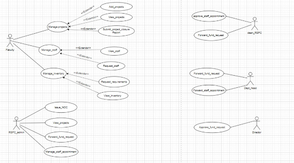

---

### 3.2 	Use case Description

<table><tr><th colspan="1" valign="top"><b>UC ID</b></th><th colspan="3" valign="top">UC#1</th></tr>
<tr><td colspan="1" valign="top"><b>Use case name</b></td><td colspan="3" valign="top"><b>manage_projects</b></td></tr>
<tr><td colspan="1" valign="top"><b>Description</b></td><td colspan="3" valign="top">The "Manage Projects" use case allows the Faculty to add, view and submit closure reports of the project requests to the Fusion portal.</td></tr>
<tr><td colspan="1" valign="top"><b>Actor</b></td><td colspan="3" valign="top">Faculty</td></tr>
<tr><td colspan="1" valign="top"><b>Precondition</b></td><td colspan="3" valign="top">The Faculty is logged into the system.</td></tr>
<tr><td colspan="1" rowspan="5" valign="top"><b>Main Flow</b></td><td colspan="1" valign="top">1</td><td colspan="2" valign="top">`   `The Faculty navigates to the "Manage Projects" section.</td></tr>
<tr><td colspan="1" valign="top">2</td><td colspan="2" valign="top">The system displays the “Add Projects”, ”View Projects”, “Submit Project Closure Report” sections.</td></tr>
<tr><td colspan="1" valign="top">3</td><td colspan="2" valign="top">The Faculty can navigate to the “Add Projects” section and add a new project by providing the details.  [A1]</td></tr>
<tr><td colspan="1" valign="top">4</td><td colspan="2" valign="top">The Faculty can navigate to the “View Projects” section and view the completed project details. </td></tr>
<tr><td colspan="1" valign="top">5</td><td colspan="2" valign="top">The Faculty can navigate to the “Submit Project Closure Report” section and submit the closure report of a pending project. [A1]</td></tr>
<tr><td colspan="1" valign="top"><b>Post conditions</b> </td><td colspan="3" valign="top">The Faculty is navigated to “Add Projects” or ”View Projects” or “Submit Project Closure Report” sections .</td></tr>
<tr><td colspan="1" valign="top"><b>Alternate Flow</b></td><td colspan="1" valign="top">`  `A1</td><td colspan="1" valign="top">1</td><td colspan="1" valign="top">Faculty presses the cancel button while filling the form .</td></tr>
<tr><td colspan="1" valign="top"><b>Sub Flow</b></td><td colspan="3" valign="top">NIL</td><td colspan="1"> </td></tr>
<tr><td colspan="1" valign="top"><b>Global Alternate Flow</b></td><td colspan="1" valign="top">GA</td><td colspan="2" valign="top">If a technical error occurs during the execution of any action (e.g., database failure, server issues), the system displays an error message and logs the incident.</td><td colspan="1">
 

 

 

 

 
</td></tr>
<tr><td colspan="1"></td><td colspan="1"></td><td colspan="1"></td><td colspan="1"></td><td colspan="1"></td></tr>
</table>
** 
**

|**UC ID**|UC#2|||
| :- | :- | :- | :- |
|**Use case name**|**Add\_projects**|||
|**Description**|The "Add Projects" use case allows the Faculty to add projects to the Fusion portal.|||
|**Actor**|Faculty|||
|**Precondition**|The Faculty is navigated into the “Manage Projects” section.|||
|**Main Flow**|1|`   `Faculty selects the “Add Projects” section.||
|** |2|Faculty need to fill the form and can submit it.||
|**Post conditions** |The Faculty is navigated to “Add Projects” or ”View Projects” or “Submit Project Closure Report” sections .|||
|**Alternate Flow**|`  `A1|1|Faculty is navigated to Manage Projects Section.|
|**Sub Flow**|NIL|||
|**Global Alternate Flow**|GA|If a technical error occurs during the execution of any action (e.g., database failure, server issues), the system displays an error message and logs the incident.||

|**UC ID**|UC#3|||
| :- | :- | :- | :- |
|**Use case name**|**View\_projects**|||
|**Description**|The "View projects" use case allows the Faculty to view the projects for which the closure reports are submitted.|||
|**Actor**|Faculty|||
|**Precondition**|The Faculty is navigated into the “Manage projects” section.|||
|**Main Flow**|1|` `The faculty selects the “View projects” section.||
|** |2|The faculty views the projects. ||
|**Post conditions** |Faculty is navigated to the “Manage Projects” Section.|||
|**Alternate Flow**|`  `A1|1|Faculty clicks on the “back” button to navigate back to the dashboard|

|**UC ID**|UC#4|||
| :- | :- | :- | :- |
|**Use case name**|**Submit project closure report**|||
|**Description**|The “Submit project closure report” use case allows the Faculty to submit closure reports for completed projects.|||
|**Actor**|Faculty|||
|**Precondition**|The Faculty is navigated into the “Manage projects” section.|||
|**Main Flow**|1|` `The faculty selects the “Submit project closure report” section.||
|** |2|The faculty is given a list of projects for which the closure reports are not submitted||
|**Post conditions** |Faculty is navigated to the “Manage Projects” Section.|||
|**Alternate Flow**|`  `A1|1|Faculty clicks on the “back” button to navigate back to the dashboard|

**

<table><tr><th colspan="1" valign="top"><b>UC ID</b></th><th colspan="2" valign="top">UC#5</th></tr>
<tr><td colspan="1" valign="top"><b>Use case name</b></td><td colspan="2" valign="top"><b>manage_staff</b></td></tr>
<tr><td colspan="1" valign="top"><b>Description</b></td><td colspan="2" valign="top">The "Manage staff" use case allows the Faculty to request for staff and view the already assigned staff</td></tr>
<tr><td colspan="1" valign="top"><b>Actor</b></td><td colspan="2" valign="top">Faculty</td></tr>
<tr><td colspan="1" valign="top"><b>Precondition</b></td><td colspan="2" valign="top">The Faculty is logged into the system.</td></tr>
<tr><td colspan="1" rowspan="4" valign="top"><b>Main Flow</b></td><td colspan="1" valign="top">1</td><td colspan="1" valign="top">`   `The Faculty navigates to the "Manage staff" section.</td></tr>
<tr><td colspan="1" valign="top">2</td><td colspan="1" valign="top">The system displays the “View staff”, ”Request staff”, sections.</td></tr>
<tr><td colspan="1" valign="top">3</td><td colspan="1" valign="top">The Faculty can navigate to the “View staff” section to view staff of existing projects</td></tr>
<tr><td colspan="1" valign="top">4</td><td colspan="1" valign="top">The Faculty can navigate to the “Request staff” section and request for staff </td></tr>
<tr><td colspan="1" valign="top"><b>Post conditions</b> </td><td colspan="2" valign="top">The Faculty is navigated to “View staff” or ”Request staff”, sections .</td></tr>
</table>
**

|**UC ID**|UC#6|||
| :- | :- | :- | :- |
|**Use case name**|**View\_staff**|||
|**Description**|The "View staff" use case allows the Faculty to view the existing staff for the projects.|||
|**Actor**|Faculty|||
|**Precondition**|The Faculty is navigated into the “Manage staff” section.|||
|**Main Flow**|1|` `The faculty selects the “View staff” section.||
|** |2|The faculty views the staff assigned to the projects.||
|**Post conditions** |Faculty is navigated to the “Manage staff” Section.|||
|**Alternate Flow**|`  `A1|1|Faculty clicks on the “back” button to navigate back to the dashboard|

|**UC ID**|UC#7|||
| :- | :- | :- | :- |
|**Use case name**|**Request\_staff**|||
|**Description**|The "Request staff" use case allows the Faculty to request staff for the projects.|||
|**Actor**|Faculty|||
|**Precondition**|The Faculty is navigated into the “Manage staff” section.|||
|**Main Flow**|1|` `The faculty selects the “Request staff” section.||
|** |2|The faculty requests the staff.||
|**Post conditions** |Faculty is navigated to the “Manage staff” Section.|||
|**Alternate Flow**|`  `A1|1|Faculty clicks on the “back” button to navigate back to the dashboard|

<table><tr><th colspan="1" valign="top"><b>UC ID</b></th><th colspan="2" valign="top">UC#8</th></tr>
<tr><td colspan="1" valign="top"><b>Use case name</b></td><td colspan="2" valign="top"><b>manage_inventory</b></td></tr>
<tr><td colspan="1" valign="top"><b>Description</b></td><td colspan="2" valign="top">The "Manage inventory" use case allows the Faculty to request for funds and view the already allocated funds.</td></tr>
<tr><td colspan="1" valign="top"><b>Actor</b></td><td colspan="2" valign="top">Faculty</td></tr>
<tr><td colspan="1" valign="top"><b>Precondition</b></td><td colspan="2" valign="top">The Faculty is logged into the system.</td></tr>
<tr><td colspan="1" rowspan="4" valign="top"><b>Main Flow</b></td><td colspan="1" valign="top">1</td><td colspan="1" valign="top">`   `The Faculty navigates to the "Manage inventory" section.</td></tr>
<tr><td colspan="1" valign="top">2</td><td colspan="1" valign="top">The system displays the “View inventory”, ”Request requirements”, sections.</td></tr>
<tr><td colspan="1" valign="top">3</td><td colspan="1" valign="top">The Faculty can navigate to the “View inventory” section to view inventory of existing projects</td></tr>
<tr><td colspan="1" valign="top">4</td><td colspan="1" valign="top">The Faculty can navigate to the “Request requirements” section and request for requirements(funds).</td></tr>
<tr><td colspan="1" valign="top"><b>Post conditions</b> </td><td colspan="2" valign="top">The Faculty is navigated to “View inventory” or ”Request requirements”, section .</td></tr>
</table>
**

|**UC ID**|UC#9|||
| :- | :- | :- | :- |
|**Use case name**|**View\_inventory**|||
|**Description**|The "View inventory" use case allows the Faculty to view the existing inventory for the projects.|||
|**Actor**|Faculty|||
|**Precondition**|The Faculty is navigated into the “Manage inventory” section.|||
|**Main Flow**|1|` `The faculty selects the “View inventory” section.||
|** |2|The faculty views the inventory allocated to the projects.||
|**Post conditions** |Faculty is navigated to the “Manage inventory” Section.|||
|**Alternate Flow**|`  `A1|1|Faculty clicks on the “back” button to navigate back to the dashboard|

|**UC ID**|UC#10|||
| :- | :- | :- | :- |
|**Use case name**|**Request\_requirements**|||
|**Description**|The "Request requirements" use case allows the Faculty to request requirements for the projects.|||
|**Actor**|Faculty|||
|**Precondition**|The Faculty is navigated into the “Manage inventory” section.|||
|**Main Flow**|1|` `The faculty selects the “Request requirements” section.||
|** |2|The faculty requests the requirements or funds.||
|**Post conditions** |Faculty is navigated to the “Manage inventory” Section.|||
|**Alternate Flow**|`  `A1|1|Faculty clicks on the “back” button to navigate back to the dashboard|

<table><tr><th colspan="1" valign="top"><b>UC ID</b></th><th colspan="3" valign="top">UC#11</th></tr>
<tr><td colspan="1" valign="top"><b>Use case name</b></td><td colspan="3" valign="top"><b>view_projects</b></td></tr>
<tr><td colspan="1" valign="top"><b>Description</b></td><td colspan="3" valign="top">The "View Projects" use case allows the RSPC admin to  view  projects submitted by faculty.</td></tr>
<tr><td colspan="1" valign="top"><b>Actor</b></td><td colspan="3" valign="top">Rspc Admin</td></tr>
<tr><td colspan="1" valign="top"><b>Precondition</b></td><td colspan="3" valign="top">The Rspc Admin is logged in into the system.</td></tr>
<tr><td colspan="1" rowspan="2" valign="top"><b>Main Flow</b></td><td colspan="1" valign="top">1</td><td colspan="2" valign="top">The Rspc Admin navigates to the "View Projects" section.</td></tr>
<tr><td colspan="1" valign="top">2</td><td colspan="2" valign="top">The system displays the list of ongoing and closed projects.</td></tr>
<tr><td colspan="1" valign="top"><b>Post conditions</b> </td><td colspan="3" valign="top">The Rspc Admin is able to view projects list </td></tr>
<tr><td colspan="1" rowspan="2" valign="top"><b>Alternate Flow</b></td><td colspan="1" rowspan="2" valign="top">A1</td><td colspan="1" valign="top">1</td><td colspan="1" valign="top">Rspc Admin clicks on back which navigates to dashboard</td></tr>
<tr><td colspan="1" valign="top">2</td><td colspan="1" valign="top"> </td></tr>
</table>
**

<table><tr><th colspan="1" valign="top"><b>UC ID</b></th><th colspan="3" valign="top">UC#12</th></tr>
<tr><td colspan="1" valign="top"><b>Use case name</b></td><td colspan="3" valign="top"><b>Forward_fund_request</b></td></tr>
<tr><td colspan="1" valign="top"><b>Description</b></td><td colspan="3" valign="top">The "Forward_fund_request" use case allows the RSPC admin to  forward fund requests of projects submitted by faculty to dean RSPC.</td></tr>
<tr><td colspan="1" valign="top"><b>Actor</b></td><td colspan="3" valign="top">Rspc Admin</td></tr>
<tr><td colspan="1" valign="top"><b>Precondition</b></td><td colspan="3" valign="top">The Rspc Admin is logged in into the system.</td></tr>
<tr><td colspan="1" rowspan="2" valign="top"><b>Main Flow</b></td><td colspan="1" valign="top">1</td><td colspan="2" valign="top">The Rspc Admin navigates to the "Forward_fund_request" section.</td></tr>
<tr><td colspan="1" valign="top">2</td><td colspan="2" valign="top">The system displays the list of fund requests.</td></tr>
<tr><td colspan="1" valign="top"> </td><td colspan="1" valign="top">3</td><td colspan="2" valign="top">Forwards to Dean RSPCon clicking forward button</td></tr>
<tr><td colspan="1" valign="top"><b>Post conditions</b> </td><td colspan="3" valign="top">The Rspc Admin is able to view projects fund request list and able to forward to Dean RSPC</td></tr>
<tr><td colspan="1" valign="top"><b>Alternate Flow</b></td><td colspan="1" valign="top">A1</td><td colspan="1" valign="top">1</td><td colspan="1" valign="top">Rspc Admin clicks on back which navigates to dashboard</td></tr>
</table>

<table><tr><th colspan="1" valign="top"><b>UC ID</b></th><th colspan="3" valign="top">UC#13</th></tr>
<tr><td colspan="1" valign="top"><b>Use case name</b></td><td colspan="3" valign="top"><b>manage_staff_appointment</b></td></tr>
<tr><td colspan="1" valign="top"><b>Description</b></td><td colspan="3" valign="top">The "manage_staff-appointment" use case allows the RSPC admin to  staff requests of projects submitted by faculty to dean RSPC..</td></tr>
<tr><td colspan="1" valign="top"><b>Actor</b></td><td colspan="3" valign="top">Rspc Admin</td></tr>
<tr><td colspan="1" valign="top"><b>Precondition</b></td><td colspan="3" valign="top">The Rspc Admin is logged in into the system.</td></tr>
<tr><td colspan="1" rowspan="2" valign="top"><b>Main Flow</b></td><td colspan="1" valign="top">1</td><td colspan="2" valign="top">The Rspc Admin navigates to the "manage_staff-appointment" section.</td></tr>
<tr><td colspan="1" valign="top">2</td><td colspan="2" valign="top">The system displays the list of approved projects.</td></tr>
<tr><td colspan="1" valign="top"> </td><td colspan="1" valign="top">3</td><td colspan="2" valign="top">Forwards to Dean RSPC on clicking forward button</td></tr>
<tr><td colspan="1" valign="top"><b>Post conditions</b> </td><td colspan="3" valign="top">The Rspc Admin is able to view staff requests list</td></tr>
<tr><td colspan="1" rowspan="2" valign="top"><b>Alternate Flow</b></td><td colspan="1" rowspan="2" valign="top">A1</td><td colspan="1" valign="top">1</td><td colspan="1" valign="top">Rspc Admin clicks on back which navigates to dashboard</td></tr>
<tr><td colspan="1" valign="top">2</td><td colspan="1" valign="top"> </td></tr>
</table>
**

<table><tr><th colspan="1" valign="top"><b>UC ID</b></th><th colspan="3" valign="top">UC#14</th></tr>
<tr><td colspan="1" valign="top"><b>Use case name</b></td><td colspan="3" valign="top"><b>issue_NOC</b></td></tr>
<tr><td colspan="1" valign="top"><b>Description</b></td><td colspan="3" valign="top">The "issue_NOC" use case allows the RSPC admin to issue NOC to faculty.</td></tr>
<tr><td colspan="1" valign="top"><b>Actor</b></td><td colspan="3" valign="top">Rspc Admin</td></tr>
<tr><td colspan="1" valign="top"><b>Precondition</b></td><td colspan="3" valign="top">The Rspc Admin is logged in into the system.</td></tr>
<tr><td colspan="1" rowspan="2" valign="top"><b>Main Flow</b></td><td colspan="1" valign="top">1</td><td colspan="2" valign="top">The Rspc Admin navigates to the "issue_NOC" section.</td></tr>
<tr><td colspan="1" valign="top">2</td><td colspan="2" valign="top">The system displays the list of closure project reports.</td></tr>
<tr><td colspan="1" valign="top"> </td><td colspan="1" valign="top">3</td><td colspan="2" valign="top">Forwards NOC to faculty</td></tr>
<tr><td colspan="1" valign="top"><b>Post conditions</b> </td><td colspan="3" valign="top">The Rspc Admin is able to view closed project list </td></tr>
<tr><td colspan="1" rowspan="2" valign="top"><b>Alternate Flow</b></td><td colspan="1" rowspan="2" valign="top">A1</td><td colspan="1" valign="top">1</td><td colspan="1" valign="top">Rspc Admin clicks on back which navigates to dashboard</td></tr>
<tr><td colspan="1" valign="top">2</td><td colspan="1" valign="top"> </td></tr>
</table>
**

**

**

**

<table><tr><th colspan="1" valign="top"><b>UC ID</b></th><th colspan="3" valign="top">UC#15</th></tr>
<tr><td colspan="1" valign="top"><b>Use case name</b></td><td colspan="3" valign="top"><b>forward_staff_appointment</b></td></tr>
<tr><td colspan="1" valign="top"><b>Description</b></td><td colspan="3" valign="top">The "forward_staff_appointment" use case allows the Department head to forward staff appointment requests.</td></tr>
<tr><td colspan="1" valign="top"><b>Actor</b></td><td colspan="3" valign="top">Department head</td></tr>
<tr><td colspan="1" valign="top"><b>Precondition</b></td><td colspan="3" valign="top">The Department head is logged in into the system.</td></tr>
<tr><td colspan="1" rowspan="2" valign="top"><b>Main Flow</b></td><td colspan="1" valign="top">1</td><td colspan="2" valign="top">The system displays the “Forward staff appointment”, and “Forward fund requests” sections.</td></tr>
<tr><td colspan="1" valign="top">2</td><td colspan="2" valign="top">The Department head can navigate to the “Forward staff appointment” section and forward the staff appointment request for approval.</td></tr>
<tr><td colspan="1" valign="top"><b>Post conditions</b> </td><td colspan="3" valign="top">The Department head has forwarded the staff appointment requests</td></tr>
<tr><td colspan="1" rowspan="2" valign="top"><b>Alternate Flow</b></td><td colspan="1" valign="top">A1</td><td colspan="1" valign="top">1</td><td colspan="1" valign="top">Department head clicks on the “back” which navigates to the dashboard.</td></tr>
<tr><td colspan="1" valign="top">A4</td><td colspan="1" valign="top">2</td><td colspan="1" valign="top">Department navigates to the “forward fund requests” section.</td><td colspan="1"> </td></tr>
</table>
**

**

<table><tr><th colspan="1" valign="top"><b>UC ID</b></th><th colspan="3" valign="top">UC#16</th></tr>
<tr><td colspan="1" valign="top"><b>Use case name</b></td><td colspan="3" valign="top"><b>forward_fund_requests</b></td></tr>
<tr><td colspan="1" valign="top"><b>Description</b></td><td colspan="3" valign="top">The "forward_fund_requests" use case allows the Department head to forward fund requests.</td></tr>
<tr><td colspan="1" valign="top"><b>Actor</b></td><td colspan="3" valign="top">Department head</td></tr>
<tr><td colspan="1" valign="top"><b>Precondition</b></td><td colspan="3" valign="top">The Department head is logged in into the system.</td></tr>
<tr><td colspan="1" rowspan="2" valign="top"><b>Main Flow</b></td><td colspan="1" valign="top">1</td><td colspan="2" valign="top">The system displays the “Forward staff appointment”, and “Forward fund requests” sections.</td></tr>
<tr><td colspan="1" valign="top">2</td><td colspan="2" valign="top">The Department head can navigate to the “Forward fund requests” section and forward the fund requests for approval.</td></tr>
<tr><td colspan="1" valign="top"><b>Post conditions</b> </td><td colspan="3" valign="top">The Department head has forwarded the fund requests</td></tr>
<tr><td colspan="1" rowspan="2" valign="top"><b>Alternate Flow</b></td><td colspan="1" valign="top">A1</td><td colspan="1" valign="top">1</td><td colspan="1" valign="top">Department head clicks on the “back” which navigates to the dashboard.</td></tr>
<tr><td colspan="1" valign="top">A4</td><td colspan="1" valign="top">2</td><td colspan="1" valign="top">Department navigates to the “forward staff appointment ” section.</td><td colspan="1"> </td></tr>
</table>
**

<table><tr><th colspan="1" valign="top"><b>UC ID</b></th><th colspan="3" valign="top">UC#17</th></tr>
<tr><td colspan="1" valign="top"><b>Use case name</b></td><td colspan="3" valign="top"><b>Approve_staff_appointment</b></td></tr>
<tr><td colspan="1" valign="top"><b>Description</b></td><td colspan="3" valign="top">The "Approve_staff_appointment" use case allows the Dean RSPC to Approve staff appointment requests.</td></tr>
<tr><td colspan="1" valign="top"><b>Actor</b></td><td colspan="3" valign="top">Dean RSPC</td></tr>
<tr><td colspan="1" valign="top"><b>Precondition</b></td><td colspan="3" valign="top">The Dean RSPC is logged in into the system.</td></tr>
<tr><td colspan="1" rowspan="2" valign="top"><b>Main Flow</b></td><td colspan="1" valign="top">1</td><td colspan="2" valign="top">The system displays the “Approve staff appointment”, and “Forward fund requests” sections.</td></tr>
<tr><td colspan="1" valign="top">2</td><td colspan="2" valign="top">The Dean RSPC can navigate to the “Approve staff appointment” section and Approves the staff appointment request.</td></tr>
<tr><td colspan="1" valign="top"><b>Post conditions</b> </td><td colspan="3" valign="top">The Dean RSPC has Approved the staff appointment requests</td></tr>
<tr><td colspan="1" rowspan="2" valign="top"><b>Alternate Flow</b></td><td colspan="1" valign="top">A1</td><td colspan="1" valign="top">1</td><td colspan="1" valign="top">Dean RSPC clicks on the “back” which navigates to the dashboard.</td></tr>
<tr><td colspan="1" valign="top">A4</td><td colspan="1" valign="top">2</td><td colspan="1" valign="top">Dean RSPC navigates to the “forward fund requests” section.</td><td colspan="1"> </td></tr>
</table>
**

**

<table><tr><th colspan="1" valign="top"><b>UC ID</b></th><th colspan="3" valign="top">UC#18</th></tr>
<tr><td colspan="1" valign="top"><b>Use case name</b></td><td colspan="3" valign="top"><b>forward_fund_requests</b></td></tr>
<tr><td colspan="1" valign="top"><b>Description</b></td><td colspan="3" valign="top">The "forward_fund_requests" use case allows the Dean RSPC to forward fund requests.</td></tr>
<tr><td colspan="1" valign="top"><b>Actor</b></td><td colspan="3" valign="top">Dean RSPC</td></tr>
<tr><td colspan="1" valign="top"><b>Precondition</b></td><td colspan="3" valign="top">The Dean RSPC is logged in into the system.</td></tr>
<tr><td colspan="1" rowspan="2" valign="top"><b>Main Flow</b></td><td colspan="1" valign="top">1</td><td colspan="2" valign="top">The system displays the “Approve staff appointment”, and “Forward fund requests” sections.</td></tr>
<tr><td colspan="1" valign="top">2</td><td colspan="2" valign="top">The Dean RSPC can navigate to the “Forward fund requests” section and forward the fund requests for approval.</td></tr>
<tr><td colspan="1" valign="top"><b>Post conditions</b> </td><td colspan="3" valign="top">The Dean RSPC has forwarded the fund requests</td></tr>
<tr><td colspan="1" rowspan="2" valign="top"><b>Alternate Flow</b></td><td colspan="1" valign="top">A1</td><td colspan="1" valign="top">1</td><td colspan="1" valign="top">Dean RSPC clicks on the “back” which navigates to the dashboard.</td></tr>
<tr><td colspan="1" valign="top">A4</td><td colspan="1" valign="top">2</td><td colspan="1" valign="top">Dean RSPC navigates to the “Approve staff appointment ” section.</td><td colspan="1"> </td></tr>
</table>
**

<table><tr><th colspan="1" valign="top"><b>UC ID</b></th><th colspan="3" valign="top">UC#19</th></tr>
<tr><td colspan="1" valign="top"><b>Use case name</b></td><td colspan="3" valign="top"><b>Approve_fund_requests</b></td></tr>
<tr><td colspan="1" valign="top"><b>Description</b></td><td colspan="3" valign="top">The "Approve_fund_requests" use case allows the Director to Approve fund requests</td></tr>
<tr><td colspan="1" valign="top"><b>Actor</b></td><td colspan="3" valign="top">Director</td></tr>
<tr><td colspan="1" valign="top"><b>Precondition</b></td><td colspan="3" valign="top">The Director is logged in into the system.</td></tr>
<tr><td colspan="1" rowspan="2" valign="top"><b>Main Flow</b></td><td colspan="1" valign="top">1</td><td colspan="2" valign="top">The system displays the “Approve fund requests”.</td></tr>
<tr><td colspan="1" valign="top">2</td><td colspan="2" valign="top">The Director can navigate to the “Approve fund requests”.</td></tr>
<tr><td colspan="1" valign="top"><b>Post conditions</b> </td><td colspan="3" valign="top">The Director has approved the fund  requests</td></tr>
<tr><td colspan="1" valign="top"><b>Alternate Flow</b></td><td colspan="1" valign="top">A1</td><td colspan="1" valign="top">1</td><td colspan="1" valign="top">Director clicks on the “back” which navigates to the dashboard.</td></tr>
</table>

## Non-Functional Requirements

### 3.3 Other Functional Requirements

#### 1. Login and Authentication

The module must have a login and authentication system to ensure that only professors and staff members can access their profiles and add information related to their projects, achievements, etc.

#### 2. Profile Management

Professors and staff members must be able to create and manage their profiles.

- Profiles should include information related to their projects, achievements, conferences, book publications, etc.
- The module must ensure that the information added by professors and staff members is not visible to other users of the system.

#### 3. Project Management

Professors and staff members must be able to add projects and their details.

- The module must provide a platform to add project details, such as the title, start and end date, description, collaborators, funding agency, etc.
- Professors and staff members must be able to view, edit, and delete their projects.

#### 4. Achievement Management

Professors and staff members must be able to add their achievements, such as awards, grants, patents, publications, etc.

- The module must provide a platform to add achievement details, such as the title, date, description, collaborators, funding agency, etc.
- Professors and staff members must be able to view, edit, and delete their achievements.

#### 5. Conference Management

Professors and staff members must be able to add details related to conferences they have attended or organized, such as the name of the conference, date, venue, etc.

- The module must provide a platform to add conference details.
- Professors and staff members must be able to view, edit, and delete their conference details.

#### 6. Book Publication Management

Professors and staff members must be able to add details related to books they have authored or edited, such as the title, date, publisher, etc.

- The module must provide a platform to add book publication details.
- Professors and staff members must be able to view, edit, and delete their book publication details.

#### 7. Search and Filter

The module must allow professors and staff members to search and filter their projects, achievements, conferences, book publications, etc.

---

## 3.4 Other Constraints

### 3.4.1 User Interfaces

The software provides a good graphical interface for the user. Any administrator can operate on the system, performing the required tasks. The user interface of this project is dependent on the UI Team. The theme used in the project will be provided by the UI Team.

### 3.4.2 Tech Stack Used

- **Web Application:** 
  - Uses Django framework for frontend and backend functionality.
  - PostgreSQL is used as the RDBMS.

- **Mobile Application:** 
  - Uses Flutter SDK for its frontend and Django API for its backend.
  - MySQL is used for the database.

### 3.4.3 Business Rules (if any)

---

## Non-Functional Requirements

The following are the non-functional requirements of the RSPC Module:

### 4.1 Security

- The module must ensure that the information added by professors and staff members is not visible to other users of the system.
- The login and authentication system must be secure.

### 4.2 Usability

- The module must be easy to use and navigate.
- The user interface must be intuitive and user-friendly.

### 4.3 Performance

- The module must be fast and responsive.
- The search and filter functionality must be optimized for performance.

### 4.4 Scalability

The system should handle a mass of concurrent users. System performance should be evaluated under increasing load conditions.

---

## Flow Diagram

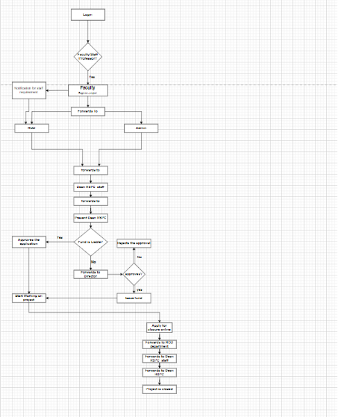

---

## SRS Web Interface
### Features

# Fusion ERP

**Software Requirements Specification**  
**for**  
**GAD-7 RSPC MODULE (web)**

**Prepared by:**  
Banda Satwik (21BCS054)  
Basetty Kuladeep (21BCS055)  
Chandolu Manish Babu (21BCS063)  
Kaukuntla Prudvi Raj (21BCS111)  
Nara Sharan Kumar (21BCS141)  

**Faculty Mentor:**  
Prof. Aparajita Ojha  

**Student Mentor:**  
Harsh Bansal (21BCS093)  

## 1. Introduction

### 1.1 Introduction about the Fusion – A brief Description

FusionIIIT stands as a testament to the seamless integration and automation of diverse functions within PDPM Indian Institute of Information Technology, Design and Manufacturing, Jabalpur. Crafted with precision using Python 3.8 and powered by the Django Web framework, this initiative is a student-driven endeavor designed to elevate the institute's operational landscape. Encompassing everything from efficient administration management to academic prowess and miscellaneous departmental tasks, FusionIIIT is a holistic solution that harmonizes the intricacies of campus life.

Imagine it as a digital wizard that takes care of everything, from organizing the administrative stuff to making academics smoother. It's not just limited to the usual tasks; FusionIIIT jumps into various departments and sections, making sure every corner of campus life runs smoothly.

In the admin side, it handles the complicated paperwork and processes. For academics, it brings a digital touch, making learning and managing courses easier. But it doesn't stop there; FusionIIIT is like a friendly companion for all the different parts of the campus, making sure everything works well.

In simpler terms, FusionIIIT is not just a tool – it's a helpful friend, making life at PDPM IIITDM Jabalpur more organized and enjoyable for everyone.

### 1.2 Purpose of the module

The RSPC Module is a part of the Fusion project that is responsible for maintaining the record of projects of professors, their achievements, conferences, book publications, etc. It provides a platform for professors and staff members to add projects and their details, which are not visible to other users of the system. In addition, the module also maintains the profiles of professors and staff members, which includes their projects, achievements, etc. This is software designed to manage different activities related to the dean RSPC department of PDPM IIITDM Jabalpur. The software is designed to provide automated features to Faculty, Dean, and Staff. The different activities that come under the dean RSPC department such as project funds, eis etc.

### 1.3 Scope of the module

The scope of the RSPC Module is to provide a platform for professors and staff members to manage their projects, achievements, conferences, book publications, etc. It also maintains their profiles and allows them to add projects and their details. The module ensures that the information added by professors and staff members is not visible to other users of the system. In addition to the specific design components of this software, this document will make clear the design team’s goals of creating value-added software which not only correctly captures faculty data, but then efficiently stores it, sorts it, retrieves it, and delivers this critical care information where it is needed by Dean and Staff.

## 2. User/Actor Characteristics

### 2.1 Faculty

Represents individuals who register the project.

- **Role:** Initiates the Application for Research Project  
- **Specific Functionalities:**
  - Online Apply for Project Registration
  - Request for Extension of project
  - Reallocation of the fund Among Different Heads
  - Request for closure of project

### 2.2 RSPC_ADMIN (STAFF)

- **Role:** Forwards different types of applications to the DEAN RSPC.  
- **Specific Functionalities:**
  - Forward applications to Dean RSPC based on requirement.
  - Manage staff appointment
  - View projects
  - Issue NOC

### 2.3 DEAN (RSPC)

Dean Research, Sponsored Projects and Consultancy (RSPC) in the institute to provide specialized administrative and managerial support and awareness for the operation of Sponsored Research Projects, Consultancy, Fieldwork, IPR related issues as well as to co-ordinate and facilitate all Research & Development activities in the Institute.

- **Role:** Approves/rejects different types of applications or forwards to the director depending upon the rights.  
- **Specific Functionalities:**
  - Approves/rejects different types of applications.
  - Forward applications to Director based on requirement.

### 2.4 HEAD OF DEPARTMENT

- **Role:** Responsible for checking and forwarding the different types of applications to the dean RSPC staff.  
- **Specific Functionalities:**
  - Forwards Applications to DEAN RSPC ADMIN
  - Forwards Staff appointment request

### 2.5 Director

- **Role:** Approves Project fund request.  
- **Specific Functionalities:**
  - Approves/Rejects project fund request.

## 3. Functional Requirements

### 3.1 Use Case Diagram

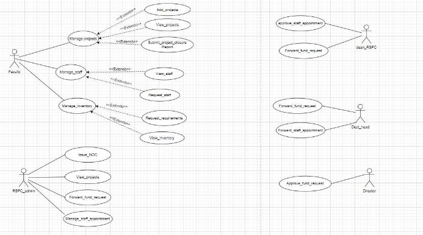

### 3.2 Use Case Description

#### UC#1: Manage Projects

| **UC ID** | UC#1 |
|-----------|-------|
| **Use case name** | manage_projects |
| **Description** | The "Manage Projects" use case allows the Faculty to add, view and submit closure reports of the project requests to the Fusion portal. |
| **Actor** | Faculty |
| **Precondition** | The Faculty is logged into the system. |

| **Main Flow** |  |
|---------------|---|
| 1 | The Faculty navigates to the "Manage Projects" section. |
| 2 | The system displays the “Add Projects”, ”View Projects”, “Submit Project Closure Report” sections. |
| 3 | The Faculty can navigate to the “Add Projects” section and add a new project by providing the details. [A1] |
| 4 | The Faculty can navigate to the “View Projects” section and view the completed project details. |
| 5 | The Faculty can navigate to the “Submit Project Closure Report” section and submit the closure report of a pending project. [A1] |

| **Post conditions** | The Faculty is navigated to “Add Projects” or ”View Projects” or “Submit Project Closure Report” sections. |
|---------------------|---|
| **Alternate Flow** | A1: Faculty presses the cancel button while filling the form. |
| **Sub Flow** | NIL |
| **Global Alternate Flow** | GA: If a technical error occurs during the execution of any action (e.g., database failure, server issues), the system displays an error message and logs the incident. |

#### UC#2: Add Projects

| **UC ID** | UC#2 |
|-----------|-------|
| **Use case name** | Add_projects |
| **Description** | The "Add Projects" use case allows the Faculty to add projects to the Fusion portal. |
| **Actor** | Faculty |
| **Precondition** | The Faculty is navigated into the “Manage Projects” section. |

| **Main Flow** |  |
|---------------|---|
| 1 | Faculty selects the “Add Projects” section. |
| 2 | Faculty fills the form and submits it. |

| **Post conditions** | The Faculty is navigated to “Add Projects” or ”View Projects” or “Submit Project Closure Report” sections. |
|---------------------|---|
| **Alternate Flow** | A1: Faculty is navigated to Manage Projects Section. |
| **Sub Flow** | NIL |
| **Global Alternate Flow** | GA: If a technical error occurs during the execution of any action (e.g., database failure, server issues), the system displays an error message and logs the incident. |

#### UC#3: View Projects

| **UC ID** | UC#3 |
|-----------|-------|
| **Use case name** | View_projects |
| **Description** | The "View projects" use case allows the Faculty to view the projects for which the closure reports are submitted. |
| **Actor** | Faculty |
| **Precondition** | The Faculty is navigated into the “Manage projects” section. |

| **Main Flow** |  |
|---------------|---|
| 1 | The faculty selects the “View projects” section. |
| 2 | The faculty views the projects. |

| **Post conditions** | Faculty is navigated to the “Manage Projects” Section. |
|---------------------|---|
| **Alternate Flow** | A1: Faculty clicks on the “back” button to navigate back to the dashboard. |

#### UC#4: Submit Project Closure Report

| **UC ID** | UC#4 |
|-----------|-------|
| **Use case name** | Submit project closure report |
| **Description** | The “Submit project closure report” use case allows the Faculty to submit closure reports for completed projects. |
| **Actor** | Faculty |
| **Precondition** | The Faculty is navigated into the “Manage projects” section. |

| **Main Flow** |  |
|---------------|---|
| 1 | The faculty selects the “Submit project closure report” section. |
| 2 | The faculty is given a list of projects for which the closure reports are not submitted. |

| **Post conditions** | Faculty is navigated to the “Manage Projects” Section. |
|---------------------|---|
| **Alternate Flow** | A1: Faculty clicks on the “back” button to navigate back to the dashboard. |

#### UC#5: Manage Staff

|**UC ID**|UC#5|
| - | - |
|**Use case name**|**manage\_staff**|
|**Description**|The "Manage staff" use case allows the Faculty to request for staff and view the already assigned staff|
|**Actor**|Faculty|

<table><tr><th colspan="1" valign="top"><b>Precondition</b></th><th colspan="2" valign="top">The Faculty is logged into the system.</th></tr>
<tr><td colspan="1" rowspan="4" valign="top"><b>Main Flow</b></td><td colspan="1" valign="bottom">1</td><td colspan="1" valign="bottom">The Faculty navigates to the "Manage staff" section.</td></tr>
<tr><td colspan="1" valign="top">2</td><td colspan="1" valign="bottom">The system displays the “View staff”, ”Request staff”, sections.</td></tr>
<tr><td colspan="1" valign="top">3</td><td colspan="1" valign="bottom">The Faculty can navigate to the “View staff” section to view staff of existing projects</td></tr>
<tr><td colspan="1" valign="top">4</td><td colspan="1" valign="top">The Faculty can navigate to the “Request staff” section and request for staff</td></tr>
<tr><td colspan="1" valign="top"><b>Post conditions</b></td><td colspan="2">The Faculty is navigated to “View staff” or ”Request staff”, sections .</td></tr>
</table>

|**UC ID**|UC#6||
| - | - | :- |
|**Use case name**|**View\_staff**||
|**Description**|The "View staff" use case allows the Faculty to view the existing staff for the projects.||
|**Actor**|Faculty||
|**Precondition**|The Faculty is navigated into the “Manage staff” section.||
|**Main Flow**|1|The faculty selects the “View staff” section.|
||2|The faculty views the staff assigned to the projects.|
|**Post conditions**|Faculty is navigated to the “Manage staff” Section.||

|**Alternate Flow**|A 1||Faculty clicks on the “back” button to navigate back to the dashboard|
| - | - | :- | :- |

|**UC ID**|UC#7|||
| - | - | :- | :- |
|**Use case name**|**Request\_staff**|||
|**Description**|The "Request staff" use case allows the Faculty to request staff for the projects.|||
|**Actor**|Faculty|||
|**Precondition**|The Faculty is navigated into the “Manage staff” section.|||
|**Main Flow**|1|The faculty selects the “Request staff” section.||
||2|The faculty requests the staff.||
|**Post conditions**|Faculty is navigated to the “Manage staff” Section.|||
|**Alternate Flow**|A 1||Faculty clicks on the “back” button to navigate back to the dashboard|

|**UC ID**|UC#8|
| - | - |
|**Use case name**|**manage\_inventory**|

<table><tr><th colspan="1" valign="top"><b>Description</b></th><th colspan="2" valign="top">The "Manage inventory" use case allows the Faculty to request for funds and view the already allocated funds.</th></tr>
<tr><td colspan="1" valign="top"><b>Actor</b></td><td colspan="2" valign="top">Faculty</td></tr>
<tr><td colspan="1" valign="top"><b>Precondition</b></td><td colspan="2" valign="top">The Faculty is logged into the system.</td></tr>
<tr><td colspan="1" rowspan="4" valign="top"><b>Main Flow</b></td><td colspan="1" valign="bottom">1</td><td colspan="1" valign="bottom">The Faculty navigates to the "Manage inventory" section.</td></tr>
<tr><td colspan="1" valign="top">2</td><td colspan="1" valign="bottom">The system displays the “View inventory”, ”Request requirements”, sections.</td></tr>
<tr><td colspan="1" valign="top">3</td><td colspan="1" valign="bottom">The Faculty can navigate to the “View inventory” section to view inventory of existing projects</td></tr>
<tr><td colspan="1" valign="top">4</td><td colspan="1" valign="top">The Faculty can navigate to the “Request requirements” section and request for requirements(funds).</td></tr>
<tr><td colspan="1" valign="top"><b>Post conditions</b></td><td colspan="2">The Faculty is navigated to “View inventory” or ”Request requirements”, section .</td></tr>
</table>

|**UC ID**|UC#9|
| - | - |
|**Use case name**|**View\_inventory**|
|**Description**|The "View inventory" use case allows the Faculty to view the existing inventory for the projects.|
|**Actor**|Faculty|
|**Precondition**|The Faculty is navigated into the “Manage inventory” section.|

|**Main Flow**|1|The faculty selects the “View inventory” section.||
| - | - | - | :- |
||2|The faculty views the inventory allocated to the projects.||
|**Post conditions**|Faculty is navigated to the “Manage inventory” Section.|||
|**Alternate Flow**|A 1||Faculty clicks on the “back” button to navigate back to the dashboard|

|**UC ID**|UC#10|||
| - | - | :- | :- |
|**Use case name**|**Request\_requirements**|||
|**Description**|The "Request requirements" use case allows the Faculty to request requirements for the projects.|||
|**Actor**|Faculty|||
|**Precondition**|The Faculty is navigated into the “Manage inventory” section.|||
|**Main Flow**|1|The faculty selects the “Request requirements” section.||
||2|The faculty requests the requirements or funds.||
|**Post conditions**|Faculty is navigated to the “Manage inventory” Section.|||
|**Alternate Flow**|A 1||Faculty clicks on the “back” button to navigate back to the dashboard|

<table><tr><th colspan="1" valign="bottom"><b>UC ID</b></th><th colspan="3" valign="bottom">UC#11</th></tr>
<tr><td colspan="1" valign="bottom"><b>Use case name</b></td><td colspan="3" valign="bottom"><b>view_projects</b></td></tr>
<tr><td colspan="1" valign="top"><b>Description</b></td><td colspan="3" valign="bottom">The "View Projects" use case allows the RSPC admin to view projects submitted by faculty.</td></tr>
<tr><td colspan="1" valign="bottom"><b>Actor</b></td><td colspan="3" valign="bottom">Rspc Admin</td></tr>
<tr><td colspan="1" valign="bottom"><b>Precondition</b></td><td colspan="3" valign="bottom">The Rspc Admin is logged in into the system.</td></tr>
<tr><td colspan="1" rowspan="2" valign="top"><b>Main Flow</b></td><td colspan="1" valign="bottom">1</td><td colspan="2" valign="bottom">The Rspc Admin navigates to the "View Projects" section.</td></tr>
<tr><td colspan="1" valign="bottom">2</td><td colspan="2" valign="bottom">The system displays the list of ongoing and closed projects.</td></tr>
<tr><td colspan="1" valign="bottom"><b>Post conditions</b></td><td colspan="3" valign="bottom">The Rspc Admin is able to view projects list</td></tr>
<tr><td colspan="1" rowspan="2" valign="top"><b>Alternate Flow</b></td><td colspan="1" rowspan="2" valign="top">A 1</td><td colspan="1"></td><td colspan="1" valign="bottom">Rspc Admin clicks on back which navigates to dashboard</td></tr>
<tr><td colspan="1"></td><td colspan="1"></td></tr>
</table>

<table><tr><th colspan="1" valign="bottom"><b>UC ID</b></th><th colspan="2" valign="bottom">UC#12</th></tr>
<tr><td colspan="1" valign="bottom"><b>Use case name</b></td><td colspan="2" valign="bottom"><b>Forward_fund_request</b></td></tr>
<tr><td colspan="1" valign="top"><b>Description</b></td><td colspan="2" valign="bottom">The "Forward_fund_request" use case allows the RSPC admin to forward fund requests of projects submitted by faculty to dean RSPC.</td></tr>
<tr><td colspan="1" valign="bottom"><b>Actor</b></td><td colspan="2" valign="bottom">Rspc Admin</td></tr>
<tr><td colspan="1" valign="bottom"><b>Precondition</b></td><td colspan="2" valign="bottom">The Rspc Admin is logged in into the system.</td></tr>
<tr><td colspan="1" rowspan="2" valign="top"><b>Main Flow</b></td><td colspan="1" valign="top">1</td><td colspan="1" valign="bottom">The Rspc Admin navigates to the "Forward_fund_request" section.</td></tr>
<tr><td colspan="1" valign="bottom">2</td><td colspan="1" valign="bottom">The system displays the list of fund requests.</td></tr>
</table>

||3|Forwards to Dean RSPCon clicking forward button||
| :- | - | - | :- |
|**Post conditions**|The Rspc Admin is able to view projects fund request list and able to forward to Dean RSPC|||
|**Alternate Flow**|A 1||Rspc Admin clicks on back which navigates to dashboard|

<table><tr><th colspan="1" valign="bottom"><b>UC ID</b></th><th colspan="3" valign="bottom">UC#13</th></tr>
<tr><td colspan="1" valign="bottom"><b>Use case name</b></td><td colspan="3" valign="bottom"><b>manage_staff_appointment</b></td></tr>
<tr><td colspan="1" valign="top"><b>Description</b></td><td colspan="3" valign="bottom">The "manage_staff-appointment" use case allows the RSPC admin to staff requests of projects submitted by faculty to dean RSPC..</td></tr>
<tr><td colspan="1" valign="bottom"><b>Actor</b></td><td colspan="3" valign="bottom">Rspc Admin</td></tr>
<tr><td colspan="1" valign="bottom"><b>Precondition</b></td><td colspan="3" valign="bottom">The Rspc Admin is logged in into the system.</td></tr>
<tr><td colspan="1" rowspan="2" valign="top"><b>Main Flow</b></td><td colspan="1" valign="top">1</td><td colspan="2" valign="bottom">The Rspc Admin navigates to the "manage_staff-appointment" section.</td></tr>
<tr><td colspan="1" valign="bottom">2</td><td colspan="2" valign="bottom">The system displays the list of approved projects.</td></tr>
<tr><td colspan="1"></td><td colspan="1" valign="bottom">3</td><td colspan="2" valign="bottom">Forwards to Dean RSPC on clicking forward button</td></tr>
<tr><td colspan="1" valign="bottom"><b>Post conditions</b></td><td colspan="3" valign="bottom">The Rspc Admin is able to view staff requests list</td></tr>
<tr><td colspan="1" rowspan="2" valign="top"><b>Alternate Flow</b></td><td colspan="1" rowspan="2" valign="top">A 1</td><td colspan="1"></td><td colspan="1" valign="bottom">Rspc Admin clicks on back which navigates to dashboard</td></tr>
<tr><td colspan="1"></td><td colspan="1"></td></tr>
</table>

|**UC ID**|UC#14|
| - | - |
|**Use case name**|**issue\_NOC**|
|**Description**|The "issue\_NOC" use case allows the RSPC admin to issue NOC to faculty.|

<table><tr><th colspan="1" valign="bottom"><b>Actor</b></th><th colspan="3" valign="bottom">Rspc Admin</th></tr>
<tr><td colspan="1" valign="bottom"><b>Precondition</b></td><td colspan="3" valign="bottom">The Rspc Admin is logged in into the system.</td></tr>
<tr><td colspan="1" rowspan="2" valign="top"><b>Main Flow</b></td><td colspan="1" valign="bottom">1</td><td colspan="2" valign="bottom">The Rspc Admin navigates to the "issue_NOC" section.</td></tr>
<tr><td colspan="1" valign="bottom">2</td><td colspan="2" valign="bottom">The system displays the list of closure project reports.</td></tr>
<tr><td colspan="1"></td><td colspan="1" valign="bottom">3</td><td colspan="2" valign="bottom">Forwards NOC to faculty</td></tr>
<tr><td colspan="1" valign="bottom"><b>Post conditions</b></td><td colspan="3" valign="bottom">The Rspc Admin is able to view closed project list</td></tr>
<tr><td colspan="1" rowspan="2" valign="top"><b>Alternate Flow</b></td><td colspan="1" rowspan="2" valign="top">A 1</td><td colspan="1"></td><td colspan="1" valign="bottom">Rspc Admin clicks on back which navigates to dashboard</td></tr>
<tr><td colspan="1"></td><td colspan="1"></td></tr>
</table>

|**UC ID**|UC#15||
| - | - | :- |
|**Use case name**|**forward\_staff\_appointment**||
|**Description**|The "forward\_staff\_appointment" use case allows the Department head to forward staff appointment requests.||
|**Actor**|Department head||
|**Precondition**|The Department head is logged in into the system.||
|**Main Flow**|1|The system displays the “Forward staff appointment”, and “Forward fund requests” sections.|

<table><tr><th colspan="1"></th><th colspan="1" valign="top">2</th><th colspan="2" valign="bottom">The Department head can navigate to the “Forward staff appointment” section and forward the staff appointment request for approval.</th></tr>
<tr><td colspan="1" valign="top"><b>Post conditions</b></td><td colspan="3">The Department head has forwarded the staff appointment requests</td></tr>
<tr><td colspan="1" rowspan="2" valign="top"><b>Alternate Flow</b></td><td colspan="1" valign="bottom">A 1</td><td colspan="1"></td><td colspan="1" valign="bottom">Department head clicks on the “back” which navigates to the dashboard.</td></tr>
<tr><td colspan="1" valign="bottom">A 4</td><td colspan="1"></td><td colspan="1" valign="bottom">Department navigates to the “forward fund requests” section.</td></tr>
</table>

<table><tr><th colspan="1" valign="bottom"><b>UC ID</b></th><th colspan="2" valign="bottom">UC#16</th></tr>
<tr><td colspan="1" valign="top"><b>Use case name</b></td><td colspan="2" valign="top"><b>forward_fund_requests</b></td></tr>
<tr><td colspan="1" valign="top"><b>Description</b></td><td colspan="2" valign="top">The "forward_fund_requests" use case allows the Department head to forward fund requests.</td></tr>
<tr><td colspan="1" valign="top"><b>Actor</b></td><td colspan="2" valign="top">Department head</td></tr>
<tr><td colspan="1" valign="top"><b>Precondition</b></td><td colspan="2" valign="top">The Department head is logged in into the system.</td></tr>
<tr><td colspan="1" rowspan="2" valign="top"><b>Main Flow</b></td><td colspan="1" valign="top">1</td><td colspan="1" valign="bottom">The system displays the “Forward staff appointment”, and “Forward fund requests” sections.</td></tr>
<tr><td colspan="1" valign="top">2</td><td colspan="1" valign="bottom">The Department head can navigate to the “Forward fund requests” section and forward the fund requests for approval.</td></tr>
<tr><td colspan="1" valign="top"><b>Post conditions</b></td><td colspan="2" valign="top">The Department head has forwarded the fund requests</td></tr>
</table>

<table><tr><th colspan="1" rowspan="2" valign="top"><b>Alternate Flow</b></th><th colspan="1" valign="bottom">A 1</th><th colspan="1"></th><th colspan="1" valign="bottom">Department head clicks on the “back” which navigates to the dashboard.</th></tr>
<tr><td colspan="1" valign="bottom">A 4</td><td colspan="1"></td><td colspan="1" valign="bottom">Department navigates to the “forward staff appointment ” section.</td></tr>
</table>

<table><tr><th colspan="1" valign="bottom"><b>UC ID</b></th><th colspan="3" valign="bottom">UC#17</th></tr>
<tr><td colspan="1" valign="top"><b>Use case name</b></td><td colspan="3" valign="top"><b>Approve_staff_appointment</b></td></tr>
<tr><td colspan="1" valign="top"><b>Description</b></td><td colspan="3" valign="top">The "Approve_staff_appointment" use case allows the Dean RSPC to Approve staff appointment requests.</td></tr>
<tr><td colspan="1" valign="top"><b>Actor</b></td><td colspan="3" valign="top">Dean RSPC</td></tr>
<tr><td colspan="1" valign="top"><b>Precondition</b></td><td colspan="3" valign="top">The Dean RSPC is logged in into the system.</td></tr>
<tr><td colspan="1" rowspan="2" valign="top"><b>Main Flow</b></td><td colspan="1" valign="top">1</td><td colspan="2" valign="bottom">The system displays the “Approve staff appointment”, and “Forward fund requests” sections.</td></tr>
<tr><td colspan="1" valign="top">2</td><td colspan="2" valign="bottom">The Dean RSPC can navigate to the “Approve staff appointment” section and Approves the staff appointment request.</td></tr>
<tr><td colspan="1" valign="top"><b>Post conditions</b></td><td colspan="3" valign="top">The Dean RSPC has Approved the staff appointment requests</td></tr>
<tr><td colspan="1" rowspan="2" valign="top"><b>Alternate Flow</b></td><td colspan="1" valign="bottom">A 1</td><td colspan="1"></td><td colspan="1" valign="bottom">Dean RSPC clicks on the “back” which navigates to the dashboard.</td></tr>
<tr><td colspan="1" valign="bottom">A 4</td><td colspan="1"></td><td colspan="1" valign="bottom">Dean RSPC navigates to the “forward fund requests” section.</td></tr>
</table>

<table><tr><th colspan="1" valign="bottom"><b>UC ID</b></th><th colspan="3" valign="bottom">UC#18</th></tr>
<tr><td colspan="1" valign="top"><b>Use case name</b></td><td colspan="3" valign="top"><b>forward_fund_requests</b></td></tr>
<tr><td colspan="1" valign="top"><b>Description</b></td><td colspan="3" valign="top">The "forward_fund_requests" use case allows the Dean RSPC to forward fund requests.</td></tr>
<tr><td colspan="1" valign="top"><b>Actor</b></td><td colspan="3" valign="top">Dean RSPC</td></tr>
<tr><td colspan="1" valign="top"><b>Precondition</b></td><td colspan="3" valign="top">The Dean RSPC is logged in into the system.</td></tr>
<tr><td colspan="1" rowspan="2" valign="top"><b>Main Flow</b></td><td colspan="1" valign="top">1</td><td colspan="2" valign="bottom">The system displays the “Approve staff appointment”, and “Forward fund requests” sections.</td></tr>
<tr><td colspan="1" valign="top">2</td><td colspan="2" valign="bottom">The Dean RSPC can navigate to the “Forward fund requests” section and forward the fund requests for approval.</td></tr>
<tr><td colspan="1" valign="top"><b>Post conditions</b></td><td colspan="3" valign="top">The Dean RSPC has forwarded the fund requests</td></tr>
<tr><td colspan="1" rowspan="2" valign="top"><b>Alternate Flow</b></td><td colspan="1" valign="bottom">A 1</td><td colspan="1"></td><td colspan="1" valign="bottom">Dean RSPC clicks on the “back” which navigates to the dashboard.</td></tr>
<tr><td colspan="1" valign="bottom">A 4</td><td colspan="1"></td><td colspan="1" valign="bottom">Dean RSPC navigates to the “Approve staff appointment ” section.</td></tr>
</table>

|**UC ID**|UC#19|
| - | - |
|**Use case name**|**Approve\_fund\_requests**|
|**Description**|The "Approve\_fund\_requests" use case allows the Director to Approve fund requests|

<table><tr><th colspan="1" valign="top"><b>Actor</b></th><th colspan="3" valign="top">Director</th></tr>
<tr><td colspan="1" valign="top"><b>Precondition</b></td><td colspan="3" valign="top">The Director is logged in into the system.</td></tr>
<tr><td colspan="1" rowspan="2" valign="top"><b>Main Flow</b></td><td colspan="1" valign="top">1</td><td colspan="2" valign="top">The system displays the “Approve fund requests”.</td></tr>
<tr><td colspan="1" valign="bottom">2</td><td colspan="2" valign="bottom">The Director can navigate to the “Approve fund requests”.</td></tr>
<tr><td colspan="1" valign="top"><b>Post conditions</b></td><td colspan="3" valign="top">The Director has approved the fund requests</td></tr>
<tr><td colspan="1" valign="top"><b>Alternate Flow</b></td><td colspan="1" valign="bottom">A 1</td><td colspan="1"></td><td colspan="1" valign="bottom">Director clicks on the “back” which navigates to the dashboard.</td></tr>
</table>

### **3.3. Other Functional Requirements**

1  This module will make use of the **communication module** for sending notifications and alerts to various actors involved in the module suitably for booking confirmations, rejections, or modifications, etc.
1  Automated email or SMS notifications for booking confirmations, rejections, or modifications.
1  Alerts for critical inventory levels and other important updates.
1  The **Super admin** of Fusion should be able to assign roles for VH In charge and VH caretaker.
1  The system should be able to deal with offline bookings.
1  The category conversion of the visitors may be possible subjected to the approval of the competent authority.
1  Changes in the tariff may be possible time to time and the decision of the institute authorities.
1  …

### Technical Specifications

**3.4 Other constraints**

1. **User Interfaces**

The user interface should comply with the colour scheming and dashboard design of the FUSIONIIT. Users should be able to navigate from one functionality to other. Inter module navigation should be smooth. All the functionalities should be easy to use and no specific training should be required for the usage of the module

2. **Tech Stack Used**

FRONTEND- HTML,CSS,Python BACKEND- DJANGO DATABASE- PostgreSQL

3. **Business rules (if any)**

1\. NA

4. **Non- Functional Requirements**
1. **Performance:**

The system should respond to user interactions quickly. Response time for booking actions, inventory updates, and notifications should be less.

2. **Scalability:**

The system should handle a mass of concurrent users. System performance should be evaluated under increasing load conditions.

3. **Availability:**

The system should be available 99.9% of the time.

4. **Security:**

Ensure data confidentiality and integrity. Role-based authorization ensures that users can only perform actions relevant to their designated roles.

5. **Module dependencies with other fusion modules**

**5.1. UI Level**

Whenever faculty wants to start a project we would add the project and request for funds and staff appointment ,these requests are carried through RSPC admin to the Department head where the requests are again forwarded to the Dean RSPC , now Dean RSPC forwards the fund request to the Director.

Once the Director approves the request , Dean RSPC takes care of staff appointment and approves it .Once all requests are approved ,RSPC admin issues NOC to the project ,Once NOC is issued ,the faculty can start working on the project

In [Figma](https://www.figma.com/file/w2Mx7biMn2PJsYsPm7Qxdi/GAD-7?type=design&node-id=0-1&mode=design) we have demonstrated the following webpages

**5.2 DB Level Dependencies**

- This module will share the Notification schema with the notifications module.
- This module will share project information schema from the database with the purchase and store module.
- This module will share information regarding the NOCs issued with File Tracking module

**5.3. Module Level Dependencies**

FILE TRACKING MODULE(GAD4)-

- Once a request from the Director is approved , RSPC admin will issue NOC to the faculty.

NOTIFICATIONS MODULE(OS3)-

- Whenever a faculty adds a project,submits a project closure report , RSPC admin gets a notification alerting about the action.
- Whenever a faculty requests for staff , it will be notified to the RSPC admin.
- Whenever a faculty requests for requirements ,it will be notified to the RSPC admin.
- All forwarded requests from RSPC admin will be notified to the Department Head.
- All forwarded requests from the Department Head will be notified to the Dean RSPC.
- All forwarded requests from Dean RSPC will be notified to the Director.
- Once the requests are approved ,it will be notified to the faculty,RSPC admin.

PURCHASE AND STORE MODULE (GAD6)-

- Once the Fund requests are approved ,the purchase store admin will be notified.

## API Specifications
### **Module Name** - GAD-7 (RSPC MODULE)  
### **Student Mentor** - Harsh Bansal (21BCS093)  
#### **Group Members:**

- Banda Satwik (21bcs054)
- Basetty Kuladeep (21bcs055)
- Chandolu Manish Babu (21BCS63)
- Kaukuntla Prudhvi Raj (21BCS111)
- Nara Sharan Kumar (21bcs141)

---

## **API Documentation of OS2 - PHC Module**

### **Endpoints**

1. **/research_procedures/consult_insert**  
   *(Implemented but not working)*

2. **/research_procedures/transfer_insert**  
   *(Implemented but not working)*

3. **/research_procedures/project/project_insert**  
   *(Not Implemented)*

4. **/research_procedures/project/view**  
   *(Not Implemented)*

5. **/research_procedures/project/closure_report**  
   *(Not Implemented)*

6. **/research_procedures/staff/view_staff**  
   *(Not Implemented)*

7. **/research_procedures/staff/request_staff**  
   *(Not Implemented)*

8. **/research_procedures/inventory/request_requirements**  
   *(Not Implemented)*

9. **/research_procedures/inventory/view**  
   *(Not Implemented)*

10. **/research_procedures/forward_fund_request**  
    *(Not Implemented)*

11. **/research_procedures/forward_staff_appointment**  
    *(Not Implemented)*

12. **/research_procedures/approve_fund_request**  
    *(Not Implemented)*

13. **/research_procedures/forward_fund_request**  
    *(Not Implemented)*

14. **/research_procedures/approve_staff_appointment**  
    *(Not Implemented)*

15. **/research_procedures/issue_noc**  
    *(Not Implemented)*

16. **/research_procedures/view_projects**  
    *(Not Implemented)*

17. **/research_procedures/forward_fund_request**  
    *(Not Implemented)*

18. **/research_procedures/manage_staff_appointment**  
    *(Not Implemented)*

---

### **Request/Response Formats**

#### **Add_projects UC #2**
- **Index of APIs used:** 3
- **Description:** RSPC admin should be able to add the approved project.
- **Database:** No table created.

#### **View_projects UC #3**
- **Index of APIs used:** 4
- **Description:** Faculty should be able to view projects.
- **Database:** No table created.

#### **Submit_project_closure_report UC #4**
- **Index of APIs used:** 5
- **Description:** Faculty should be able to add the closure report of the pending projects.
- **Database:** No table created.

#### **View_staff UC #6**
- **Index of APIs used:** 6
- **Description:** Faculty should be able to view their staff.
- **Database:** No table created.

#### **Request_staff UC #7**
- **Index of APIs used:** 7
- **Description:** Faculty should be able to request staff.
- **Database:** No table created.

#### **View_inventory UC #9**
- **Index of APIs used:** 9
- **Description:** Faculty can view the allotted inventory.
- **Database:** No table created.

#### **Request_requirements UC #10**
- **Index of APIs used:** 8
- **Description:** Faculty should be able to request requirements.
- **Database:** No table created.

#### **Forward_fund_request UC #12**
- **Index of APIs used:** 10
- **Description:** RSPC admin should be able to forward fund requests to Dean RSPC.
- **Database:** No table created.

#### **issue_NOC UC #14**
- **Index of APIs used:** 15
- **Description:** The "issue_NOC" use case allows the RSPC admin to issue NOC to faculty.
- **Database:** No table created.

#### **Forward_staff_appointment UC #15**
- **Index of APIs used:** 11
- **Description:** The "forward_staff_appointment" use case allows the Department head to forward staff appointment requests.
- **Database:** No table created.

#### **Forward_fund_requests UC #16**
- **Index of APIs used:** 13
- **Description:** The "forward_fund_requests" use case allows the Department head to forward fund requests.
- **Database:** No table created.

#### **Approve_staff_appointment UC #17**
- **Index of APIs used:** 14
- **Description:** The "Approve_staff_appointment" use case allows the Dean RSPC to approve staff appointment requests.
- **Database:** No table created.

#### **Forward_fund_requests UC #18**
- **Index of APIs used:** 17
- **Description:** The "forward_fund_requests" use case allows the Dean RSPC to forward fund requests.
- **Database:** No table created.

#### **Approve_fund_requests UC #18**
- **Index of APIs used:** 12
- **Description:** The "Approve_fund_requests" use case allows the Dean RSPC to approve fund requests.
- **Database:** No table created.

---

## **Authentication**

Authentication details and protocols have not been provided. Future updates may include OAuth or JWT-based authentication mechanisms for API access.

---

## **Google Doc Link:** 
[RSPC-API-report](https://docs.google.com/document/d/1icXoa_sXRJmT1rtlJ8tGfh8rz1xl7Q5PV01H3H-e_rI/edit?usp=sharing)

---

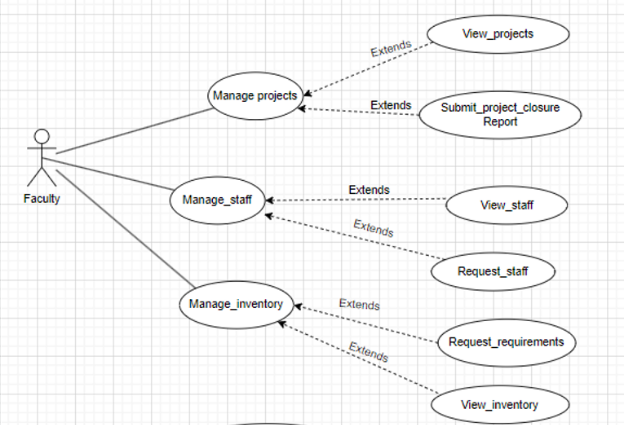

## UI for App
### Figma Profiles for RSPC

### 1. Module Description

The scope of the RSPC Module is to provide a platform for professors and staff members to manage their projects, achievements, conferences, book publications, etc. It also maintains their profiles and allows them to add projects and their details. The module ensures that the information added by professors and staff members is not visible to other users of the system. In addition to the specific design components of this software, this document will clarify the design team’s goals of creating value-added software that not only correctly captures faculty data but also efficiently stores, sorts, retrieves, and delivers this critical information where it is needed by the Dean and Staff.

---

### 2. Actors

#### 2.1 Faculty

**Role:** Initiates the Application for Research Project

**Specific Functionalities:**

- Online apply for project registration
- Request for extension of project
- Reallocation of funds among different heads
- Request for closure of project

**Figma Link:** [View Figma Design](https://www.figma.com/file/fkiZw7fEiJjCFHYsJBIMs6/Untitled?type=design&node-id=38-2&mode=design&t=clg3niqjWfHP7i6D-0)

---

#### 2.2 RSPC_ADMIN (STAFF)

**Role:** Forwards different types of applications to the DEAN RSPC.

**Specific Functionalities:**

- Forward applications to Dean RSPC based on requirements
- Manage staff appointment
- View projects
- Issue NOC

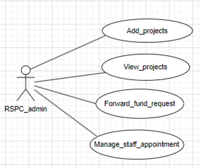

**Figma Link:** [View Figma Design](https://www.figma.com/file/fkiZw7fEiJjCFHYsJBIMs6/Untitled?type=design&node-id=38-168&mode=design&t=WcDIVx7dU51oFLlV-0)

---

#### 2.3 DEAN (RSPC)

The Dean Research, Sponsored Projects, and Consultancy (RSPC) in the institute provides specialized administrative and managerial support and awareness for the operation of Sponsored Research Projects, Consultancy, Fieldwork, IPR-related issues, and facilitates all Research & Development activities in the Institute.

**Role:** Approves/rejects different types of applications or forwards them to the Director based on rights.

**Specific Functionalities:**

- Approves/rejects different types of applications
- Forwards applications to Director based on requirements

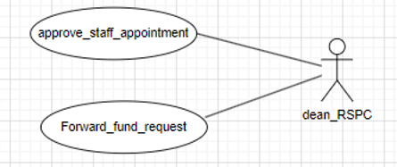

**Figma Link:** [View Figma Design](https://www.figma.com/file/4dyeYNUX7goxtOF0iqpFuN/Untitled?type=design&node-id=0-1&mode=design&t=Pom82qdfWShOKFUq-0)

---

#### 2.4 HEAD OF DEPARTMENT

**Role:** Responsible for checking and forwarding different types of applications to the Dean RSPC staff.

**Specific Functionalities:**

- Forwards applications to DEAN RSPC ADMIN
- Forwards staff appointment requests

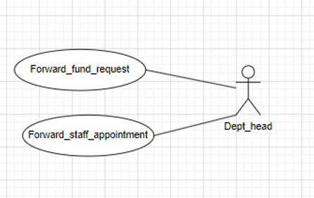

**Figma Link:** [View Figma Design](https://www.figma.com/file/4dyeYNUX7goxtOF0iqpFuN/Untitled?type=design&node-id=1-63&mode=design&t=tigI7HXlsOdBWK5J-0)

---

#### 2.5 Director

**Role:** Approves project fund requests.

**Specific Functionalities:**

- Approves/rejects project fund requests

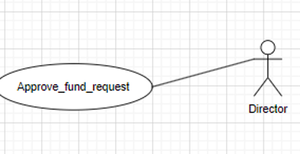

**Figma Link:** [View Figma Design](https://www.figma.com/file/nWLmLnvpPnQYceKPfSMpDa/Untitled?type=design&node-id=0%3A1&mode=design&t=bMXOrGBBtlCigcTI-1)

---

### 3. Functional Requirements

#### 3.1 Use Case Diagram

*..*

#### 3.2 Use Case Description

<table><tr><th valign="top"><b>UC ID</b></th><th colspan="3" valign="top">UC#1</th><th valign="top"> </th></tr>
<tr><td valign="top"><b>Use case name</b></td><td colspan="3" valign="top"><b>manage_projects</b></td><td valign="top"> </td></tr>
<tr><td valign="top"><b>Description</b></td><td colspan="3" valign="top">The "Manage Projects" use case allows the Faculty to add, view and submit closure reports of the project requests to the Fusion portal.</td><td valign="top"> </td></tr>
<tr><td valign="top"><b>Actor</b></td><td colspan="3" valign="top">Faculty</td><td valign="top"> </td></tr>
<tr><td valign="top"><b>Precondition</b></td><td colspan="3" valign="top">The Faculty is logged into the system.</td><td valign="top"> </td></tr>
<tr><td rowspan="5" valign="top"><b>Main Flow</b></td><td valign="top">1</td><td colspan="2" valign="top">`   `The Faculty navigates to the "Manage Projects" section.</td><td valign="top"> </td></tr>
<tr><td valign="top">2</td><td colspan="2" valign="top">The system displays the “Add Projects”, ”View Projects”, “Submit Project Closure Report” sections.</td><td valign="top"> </td></tr>
<tr><td valign="top">3</td><td colspan="2" valign="top">The Faculty can navigate to the “Add Projects” section and add a new project by providing the details.  [A1]</td><td valign="top"> </td></tr>
<tr><td valign="top">4</td><td colspan="2" valign="top">The Faculty can navigate to the “View Projects” section and view the completed project details.</td><td valign="top"> </td></tr>
<tr><td valign="top">5</td><td colspan="2" valign="top">The Faculty can navigate to the “Submit Project Closure Report” section and submit the closure report of a pending project. [A1]</td><td valign="top"> </td></tr>
<tr><td valign="top"><b>Post conditions</b></td><td colspan="3" valign="top">The Faculty is navigated to “Add Projects” or ”View Projects” or “Submit Project Closure Report” sections .</td><td valign="top"> </td></tr>
<tr><td valign="top"><b>Alternate Flow</b></td><td valign="top">`  `A1</td><td valign="top">1</td><td valign="top">Faculty presses the cancel button while filling the form .</td><td valign="top"> </td></tr>
<tr><td valign="top"><b>Sub Flow</b></td><td colspan="3" valign="top">NIL</td><td valign="top"> </td></tr>
<tr><td valign="top"><b>Global Alternate Flow</b></td><td valign="top">GA</td><td colspan="2" valign="top">If a technical error occurs during the execution of any action (e.g., database failure, server issues), the system displays an error message and logs the incident.</td><td valign="top">
 

 

 

 

 
</td></tr>
<tr><td valign="top"></td><td valign="top"></td><td valign="top"></td><td valign="top"></td><td valign="top"></td></tr>
</table>
** 
**

|**UC ID**|UC#3|||
| :- | :- | :- | :- |
|**Use case name**|**View\_projects**|||
|**Description**|The "View projects" use case allows the Faculty to view the projects for which the closure reports are submitted.|||
|**Actor**|Faculty|||
|**Precondition**|The Faculty is navigated into the “Manage projects” section.|||
|**Main Flow**|1|` `The faculty selects the “View projects” section.||
|** |2|The faculty views the projects.||
|**Post conditions**|Faculty is navigated to the “Manage Projects” Section.|||
|**Alternate Flow**|`  `A1|1|Faculty clicks on the “back” button to navigate back to the dashboard|

|**UC ID**|UC#4|||
| :- | :- | :- | :- |
|**Use case name**|**Submit project closure report**|||
|**Description**|The “Submit project closure report” use case allows the Faculty to submit closure reports for completed projects.|||
|**Actor**|Faculty|||
|**Precondition**|The Faculty is navigated into the “Manage projects” section.|||
|**Main Flow**|1|` `The faculty selects the “Submit project closure report” section.||
|** |2|The faculty is given a list of projects for which the closure reports are not submitted||
|**Post conditions**|Faculty is navigated to the “Manage Projects” Section.|||
|**Alternate Flow**|`  `A1|1|Faculty clicks on the “back” button to navigate back to the dashboard|

**

<table><tr><th valign="top"><b>UC ID</b></th><th colspan="2" valign="top">UC#5</th></tr>
<tr><td valign="top"><b>Use case name</b></td><td colspan="2" valign="top"><b>manage_staff</b></td></tr>
<tr><td valign="top"><b>Description</b></td><td colspan="2" valign="top">The "Manage staff" use case allows the Faculty to request for staff and view the already assigned staff</td></tr>
<tr><td valign="top"><b>Actor</b></td><td colspan="2" valign="top">Faculty</td></tr>
<tr><td valign="top"><b>Precondition</b></td><td colspan="2" valign="top">The Faculty is logged into the system.</td></tr>
<tr><td rowspan="4" valign="top"><b>Main Flow</b></td><td valign="top">1</td><td valign="top">`   `The Faculty navigates to the "Manage staff" section.</td></tr>
<tr><td valign="top">2</td><td valign="top">The system displays the “View staff”, ”Request staff”, sections.</td></tr>
<tr><td valign="top">3</td><td valign="top">The Faculty can navigate to the “View staff” section to view staff of existing projects</td></tr>
<tr><td valign="top">4</td><td valign="top">The Faculty can navigate to the “Request staff” section and request for staff</td></tr>
<tr><td valign="top"><b>Post conditions</b></td><td colspan="2" valign="top">The Faculty is navigated to “View staff” or ”Request staff”, sections .</td></tr>
</table>
**

|**UC ID**|UC#6|||
| :- | :- | :- | :- |
|**Use case name**|**View\_staff**|||
|**Description**|The "View staff" use case allows the Faculty to view the existing staff for the projects.|||
|**Actor**|Faculty|||
|**Precondition**|The Faculty is navigated into the “Manage staff” section.|||
|**Main Flow**|1|` `The faculty selects the “View staff” section.||
|** |2|The faculty views the staff assigned to the projects.||
|**Post conditions**|Faculty is navigated to the “Manage staff” Section.|||
|**Alternate Flow**|`  `A1|1|Faculty clicks on the “back” button to navigate back to the dashboard|

|**UC ID**|UC#7|||
| :- | :- | :- | :- |
|**Use case name**|**Request\_staff**|||
|**Description**|The "Request staff" use case allows the Faculty to request staff for the projects.|||
|**Actor**|Faculty|||
|**Precondition**|The Faculty is navigated into the “Manage staff” section.|||
|**Main Flow**|1|` `The faculty selects the “Request staff” section.||
|** |2|The faculty requests the staff.||
|**Post conditions**|Faculty is navigated to the “Manage staff” Section.|||
|**Alternate Flow**|`  `A1|1|Faculty clicks on the “back” button to navigate back to the dashboard|

<table><tr><th valign="top"><b>UC ID</b></th><th colspan="2" valign="top">UC#8</th></tr>
<tr><td valign="top"><b>Use case name</b></td><td colspan="2" valign="top"><b>manage_inventory</b></td></tr>
<tr><td valign="top"><b>Description</b></td><td colspan="2" valign="top">The "Manage inventory" use case allows the Faculty to request for funds and view the already allocated funds.</td></tr>
<tr><td valign="top"><b>Actor</b></td><td colspan="2" valign="top">Faculty</td></tr>
<tr><td valign="top"><b>Precondition</b></td><td colspan="2" valign="top">The Faculty is logged into the system.</td></tr>
<tr><td rowspan="4" valign="top"><b>Main Flow</b></td><td valign="top">1</td><td valign="top">`   `The Faculty navigates to the "Manage inventory" section.</td></tr>
<tr><td valign="top">2</td><td valign="top">The system displays the “View inventory”, ”Request requirements”, sections.</td></tr>
<tr><td valign="top">3</td><td valign="top">The Faculty can navigate to the “View inventory” section to view inventory of existing projects</td></tr>
<tr><td valign="top">4</td><td valign="top">The Faculty can navigate to the “Request requirements” section and request for requirements(funds).</td></tr>
<tr><td valign="top"><b>Post conditions</b></td><td colspan="2" valign="top">The Faculty is navigated to “View inventory” or ”Request requirements”, section .</td></tr>
</table>
**

|**UC ID**|UC#9|||
| :- | :- | :- | :- |
|**Use case name**|**View\_inventory**|||
|**Description**|The "View inventory" use case allows the Faculty to view the existing inventory for the projects.|||
|**Actor**|Faculty|||
|**Precondition**|The Faculty is navigated into the “Manage inventory” section.|||
|**Main Flow**|1|` `The faculty selects the “View inventory” section.||
|** |2|The faculty views the inventory allocated to the projects.||
|**Post conditions**|Faculty is navigated to the “Manage inventory” Section.|||
|**Alternate Flow**|`  `A1|1|Faculty clicks on the “back” button to navigate back to the dashboard|

|**UC ID**|UC#10|||
| :- | :- | :- | :- |
|**Use case name**|**Request\_requirements**|||
|**Description**|The "Request requirements" use case allows the Faculty to request requirements for the projects.|||
|**Actor**|Faculty|||
|**Precondition**|The Faculty is navigated into the “Manage inventory” section.|||
|**Main Flow**|1|` `The faculty selects the “Request requirements” section.||
|** |2|The faculty requests the requirements or funds.||
|**Post conditions**|Faculty is navigated to the “Manage inventory” Section.|||
|**Alternate Flow**|`  `A1|1|Faculty clicks on the “back” button to navigate back to the dashboard|

<table><tr><th valign="top"><b>UC ID</b></th><th colspan="3" valign="top">UC#11</th></tr>
<tr><td valign="top"><b>Use case name</b></td><td colspan="3" valign="top"><b>view_projects</b></td></tr>
<tr><td valign="top"><b>Description</b></td><td colspan="3" valign="top">The "View Projects" use case allows the RSPC admin to  view  projects submitted by faculty.</td></tr>
<tr><td valign="top"><b>Actor</b></td><td colspan="3" valign="top">Rspc Admin</td></tr>
<tr><td valign="top"><b>Precondition</b></td><td colspan="3" valign="top">The Rspc Admin is logged in into the system.</td></tr>
<tr><td rowspan="2" valign="top"><b>Main Flow</b></td><td valign="top">1</td><td colspan="2" valign="top">The Rspc Admin navigates to the "View Projects" section.</td></tr>
<tr><td valign="top">2</td><td colspan="2" valign="top">The system displays the list of ongoing and closed projects.</td></tr>
<tr><td valign="top"><b>Post conditions</b></td><td colspan="3" valign="top">The Rspc Admin is able to view projects list</td></tr>
<tr><td rowspan="2" valign="top"><b>Alternate Flow</b></td><td rowspan="2" valign="top">A1</td><td valign="top">1</td><td valign="top">Rspc Admin clicks on back which navigates to dashboard</td></tr>
<tr><td valign="top">2</td><td valign="top"> </td></tr>
</table>
**

<table><tr><th valign="top"><b>UC ID</b></th><th colspan="3" valign="top">UC#12</th></tr>
<tr><td valign="top"><b>Use case name</b></td><td colspan="3" valign="top"><b>Forward_fund_request</b></td></tr>
<tr><td valign="top"><b>Description</b></td><td colspan="3" valign="top">The "Forward_fund_request" use case allows the RSPC admin to  forward fund requests of projects submitted by faculty to dean RSPC.</td></tr>
<tr><td valign="top"><b>Actor</b></td><td colspan="3" valign="top">Rspc Admin</td></tr>
<tr><td valign="top"><b>Precondition</b></td><td colspan="3" valign="top">The Rspc Admin is logged in into the system.</td></tr>
<tr><td rowspan="2" valign="top"><b>Main Flow</b></td><td valign="top">1</td><td colspan="2" valign="top">The Rspc Admin navigates to the "Forward_fund_request" section.</td></tr>
<tr><td valign="top">2</td><td colspan="2" valign="top">The system displays the list of fund requests.</td></tr>
<tr><td valign="top"> </td><td valign="top">3</td><td colspan="2" valign="top">Forwards to Dean RSPCon clicking forward button</td></tr>
<tr><td valign="top"><b>Post conditions</b></td><td colspan="3" valign="top">The Rspc Admin is able to view projects fund request list and able to forward to Dean RSPC</td></tr>
<tr><td valign="top"><b>Alternate Flow</b></td><td valign="top">A1</td><td valign="top">1</td><td valign="top">Rspc Admin clicks on back which navigates to dashboard</td></tr>
</table>

<table><tr><th valign="top"><b>UC ID</b></th><th colspan="3" valign="top">UC#13</th></tr>
<tr><td valign="top"><b>Use case name</b></td><td colspan="3" valign="top"><b>manage_staff_appointment</b></td></tr>
<tr><td valign="top"><b>Description</b></td><td colspan="3" valign="top">The "manage_staff-appointment" use case allows the RSPC admin to  staff requests of projects submitted by faculty to dean RSPC..</td></tr>
<tr><td valign="top"><b>Actor</b></td><td colspan="3" valign="top">Rspc Admin</td></tr>
<tr><td valign="top"><b>Precondition</b></td><td colspan="3" valign="top">The Rspc Admin is logged in into the system.</td></tr>
<tr><td rowspan="2" valign="top"><b>Main Flow</b></td><td valign="top">1</td><td colspan="2" valign="top">The Rspc Admin navigates to the "manage_staff-appointment" section.</td></tr>
<tr><td valign="top">2</td><td colspan="2" valign="top">The system displays the list of approved projects.</td></tr>
<tr><td valign="top"> </td><td valign="top">3</td><td colspan="2" valign="top">Forwards to Dean RSPC on clicking forward button</td></tr>
<tr><td valign="top"><b>Post conditions</b></td><td colspan="3" valign="top">The Rspc Admin is able to view staff requests list</td></tr>
<tr><td rowspan="2" valign="top"><b>Alternate Flow</b></td><td rowspan="2" valign="top">A1</td><td valign="top">1</td><td valign="top">Rspc Admin clicks on back which navigates to dashboard</td></tr>
<tr><td valign="top">2</td><td valign="top"> </td></tr>
</table>
**

|**UC ID**|UC#2|||
| :- | :- | :- | :- |
|**Use case name**|**Add\_projects**|||
|**Description**|The "Add Projects" use case allows the Rspc Admin  to add projects to the Fusion portal.|||
|**Actor**|Rspc Admin|||
|**Precondition**|The Rspc Admin is logged in into the system.|||
|**Main Flow**|1|`   `Rspc Admin selects the “Add Projects” section.||
|** |2|` `Rspc Admin need to fill the form and can submit it.||
|**Post conditions**|Rspc Admin has added a project|||
|**Alternate Flow**|`  `A1|1|Rspc Admin clicks on back which navigates to dashboard|
|**Sub Flow**|NIL|||
|**Global Alternate Flow**|GA|If a technical error occurs during the execution of any action (e.g., database failure, server issues), the system displays an error message and logs the incident.||

**

**

**

<table><tr><th valign="top"><b>UC ID</b></th><th colspan="3" valign="top">UC#15</th><th valign="top"> </th></tr>
<tr><td valign="top"><b>Use case name</b></td><td colspan="3" valign="top"><b>forward_staff_appointment</b></td><td valign="top"> </td></tr>
<tr><td valign="top"><b>Description</b></td><td colspan="3" valign="top">The "forward_staff_appointment" use case allows the Department head to forward staff appointment requests.</td><td valign="top"> </td></tr>
<tr><td valign="top"><b>Actor</b></td><td colspan="3" valign="top">Department head</td><td valign="top"> </td></tr>
<tr><td valign="top"><b>Precondition</b></td><td colspan="3" valign="top">The Department head is logged in into the system.</td><td valign="top"> </td></tr>
<tr><td rowspan="2" valign="top"><b>Main Flow</b></td><td valign="top">1</td><td colspan="2" valign="top">The system displays the “Forward staff appointment”, and “Forward fund requests” sections.</td><td valign="top"> </td></tr>
<tr><td valign="top">2</td><td colspan="2" valign="top">The Department head can navigate to the “Forward staff appointment” section and forward the staff appointment request for approval.</td><td valign="top"> </td></tr>
<tr><td valign="top"><b>Post conditions</b></td><td colspan="3" valign="top">The Department head has forwarded the staff appointment requests</td><td valign="top"> </td></tr>
<tr><td rowspan="2" valign="top"><b>Alternate Flow</b></td><td valign="top">A1</td><td valign="top">1</td><td valign="top">Department head clicks on the “back” which navigates to the dashboard.</td><td valign="top"> </td></tr>
<tr><td valign="top">A4</td><td valign="top">2</td><td valign="top">Department navigates to the “forward fund requests” section.</td><td valign="top"> </td></tr>
</table>
**

**

<table><tr><th valign="top"><b>UC ID</b></th><th colspan="3" valign="top">UC#16</th><th valign="top"> </th></tr>
<tr><td valign="top"><b>Use case name</b></td><td colspan="3" valign="top"><b>forward_fund_requests</b></td><td valign="top"> </td></tr>
<tr><td valign="top"><b>Description</b></td><td colspan="3" valign="top">The "forward_fund_requests" use case allows the Department head to forward fund requests.</td><td valign="top"> </td></tr>
<tr><td valign="top"><b>Actor</b></td><td colspan="3" valign="top">Department head</td><td valign="top"> </td></tr>
<tr><td valign="top"><b>Precondition</b></td><td colspan="3" valign="top">The Department head is logged in into the system.</td><td valign="top"> </td></tr>
<tr><td rowspan="2" valign="top"><b>Main Flow</b></td><td valign="top">1</td><td colspan="2" valign="top">The system displays the “Forward staff appointment”, and “Forward fund requests” sections.</td><td valign="top"> </td></tr>
<tr><td valign="top">2</td><td colspan="2" valign="top">The Department head can navigate to the “Forward fund requests” section and forward the fund requests for approval.</td><td valign="top"> </td></tr>
<tr><td valign="top"><b>Post conditions</b></td><td colspan="3" valign="top">The Department head has forwarded the fund requests</td><td valign="top"> </td></tr>
<tr><td rowspan="2" valign="top"><b>Alternate Flow</b></td><td valign="top">A1</td><td valign="top">1</td><td valign="top">Department head clicks on the “back” which navigates to the dashboard.</td><td valign="top"> </td></tr>
<tr><td valign="top">A4</td><td valign="top">2</td><td valign="top">Department navigates to the “forward staff appointment ” section.</td><td valign="top"> </td></tr>
</table>
**

<table><tr><th valign="top"><b>UC ID</b></th><th colspan="3" valign="top">UC#17</th><th valign="top"> </th></tr>
<tr><td valign="top"><b>Use case name</b></td><td colspan="3" valign="top"><b>Approve_staff_appointment</b></td><td valign="top"> </td></tr>
<tr><td valign="top"><b>Description</b></td><td colspan="3" valign="top">The "Approve_staff_appointment" use case allows the Dean RSPC to Approve staff appointment requests.</td><td valign="top"> </td></tr>
<tr><td valign="top"><b>Actor</b></td><td colspan="3" valign="top">Dean RSPC</td><td valign="top"> </td></tr>
<tr><td valign="top"><b>Precondition</b></td><td colspan="3" valign="top">The Dean RSPC is logged in into the system.</td><td valign="top"> </td></tr>
<tr><td rowspan="2" valign="top"><b>Main Flow</b></td><td valign="top">1</td><td colspan="2" valign="top">The system displays the “Approve staff appointment”, and “Forward fund requests” sections.</td><td valign="top"> </td></tr>
<tr><td valign="top">2</td><td colspan="2" valign="top">The Dean RSPC can navigate to the “Approve staff appointment” section and Approves the staff appointment request.</td><td valign="top"> </td></tr>
<tr><td valign="top"><b>Post conditions</b></td><td colspan="3" valign="top">The Dean RSPC has Approved the staff appointment requests</td><td valign="top"> </td></tr>
<tr><td rowspan="2" valign="top"><b>Alternate Flow</b></td><td valign="top">A1</td><td valign="top">1</td><td valign="top">Dean RSPC clicks on the “back” which navigates to the dashboard.</td><td valign="top"> </td></tr>
<tr><td valign="top">A4</td><td valign="top">2</td><td valign="top">Dean RSPC navigates to the “forward fund requests” section.</td><td valign="top"> </td></tr>
</table>
**

**

<table><tr><th valign="top"><b>UC ID</b></th><th colspan="3" valign="top">UC#18</th><th valign="top"> </th></tr>
<tr><td valign="top"><b>Use case name</b></td><td colspan="3" valign="top"><b>forward_fund_requests</b></td><td valign="top"> </td></tr>
<tr><td valign="top"><b>Description</b></td><td colspan="3" valign="top">The "forward_fund_requests" use case allows the Dean RSPC to forward fund requests.</td><td valign="top"> </td></tr>
<tr><td valign="top"><b>Actor</b></td><td colspan="3" valign="top">Dean RSPC</td><td valign="top"> </td></tr>
<tr><td valign="top"><b>Precondition</b></td><td colspan="3" valign="top">The Dean RSPC is logged in into the system.</td><td valign="top"> </td></tr>
<tr><td rowspan="2" valign="top"><b>Main Flow</b></td><td valign="top">1</td><td colspan="2" valign="top">The system displays the “Approve staff appointment”, and “Forward fund requests” sections.</td><td valign="top"> </td></tr>
<tr><td valign="top">2</td><td colspan="2" valign="top">The Dean RSPC can navigate to the “Forward fund requests” section and forward the fund requests for approval.</td><td valign="top"> </td></tr>
<tr><td valign="top"><b>Post conditions</b></td><td colspan="3" valign="top">The Dean RSPC has forwarded the fund requests</td><td valign="top"> </td></tr>
<tr><td rowspan="2" valign="top"><b>Alternate Flow</b></td><td valign="top">A1</td><td valign="top">1</td><td valign="top">Dean RSPC clicks on the “back” which navigates to the dashboard.</td><td valign="top"> </td></tr>
<tr><td valign="top">A4</td><td valign="top">2</td><td valign="top">Dean RSPC navigates to the “Approve staff appointment ” section.</td><td valign="top"> </td></tr>
</table>
**

<table><tr><th valign="top"><b>UC ID</b></th><th colspan="3" valign="top">UC#19</th></tr>
<tr><td valign="top"><b>Use case name</b></td><td colspan="3" valign="top"><b>Approve_fund_requests</b></td></tr>
<tr><td valign="top"><b>Description</b></td><td colspan="3" valign="top">The "Approve_fund_requests" use case allows the Director to Approve fund requests</td></tr>
<tr><td valign="top"><b>Actor</b></td><td colspan="3" valign="top">Director</td></tr>
<tr><td valign="top"><b>Precondition</b></td><td colspan="3" valign="top">The Director is logged in into the system.</td></tr>
<tr><td rowspan="2" valign="top"><b>Main Flow</b></td><td valign="top">1</td><td colspan="2" valign="top">The system displays the “Approve fund requests”.</td></tr>
<tr><td valign="top">2</td><td colspan="2" valign="top">The Director can navigate to the “Approve fund requests”.</td></tr>
<tr><td valign="top"><b>Post conditions</b></td><td colspan="3" valign="top">The Director has approved the fund  requests</td></tr>
<tr><td valign="top"><b>Alternate Flow</b></td><td valign="top">A1</td><td valign="top">1</td><td valign="top">Director clicks on the “back” which navigates to the dashboard.</td></tr>
</table>

Final Figma Link :: <https://www.figma.com/file/fkiZw7fEiJjCFHYsJBIMs6/RSPC-APP?type=design&node-id=0%3A1&mode=design&t=4hKamRrgUypDD4Ub-1>

## UI for Web
### **Figma Profiles for RSPC WEB Module**

---

#### **1. Module Description**

The RSPC Module is a part of the Fusion project, designed to maintain records of professors' projects, achievements, conferences, book publications, and more. It provides professors and staff with a platform to add project details that are not visible to other system users. This module manages various activities under the Dean RSPC department of PDPM IIITDM Jabalpur, offering automated features for Faculty, Dean, and Staff, including project funds, EIS, and more.

---

#### **2. Design Elements**

##### **Faculty**

- **Role:** Initiates applications for research projects.
- **Functionalities:**
  - View projects
  - Request for staff
  - View staff
  - View inventory
  - Request for funds
  - Request for project closure

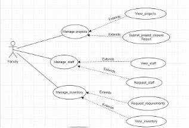

[Figma Design for Faculty](https://www.figma.com/proto/w2Mx7biMn2PJsYsPm7Qxdi/GAD-7?type=design&node-id=289-1560&t=CUOboRHhwtbrbAGA-0&scaling=scale-down-width&page-id=0%3A1&starting-point-node-id=289%3A1560&show-proto-sidebar=1)

#### **RSPC_ADMIN (STAFF)**

- **Role:** Forwards various applications to the DEAN RSPC.
- **Functionalities:**
  - Forward applications to Dean RSPC
  - Manage staff appointments
  - View and add projects

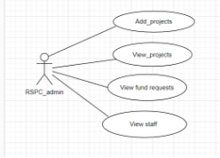

[Figma Design for RSPC_ADMIN](https://www.figma.com/proto/w2Mx7biMn2PJsYsPm7Qxdi/GAD-7?type=design&node-id=128-649&t=CUOboRHhwtbrbAGA-0&scaling=min-zoom&page-id=0%3A1&starting-point-node-id=128%3A649&show-proto-sidebar=1)

#### **DEAN (RSPC)**

- **Role:** Approves or rejects applications, or forwards them to the Director.
- **Functionalities:**
  - Approve/reject applications
  - Forward applications to the Director

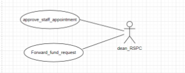

[Figma Design for DEAN](https://www.figma.com/proto/w2Mx7biMn2PJsYsPm7Qxdi/GAD-7?type=design&node-id=11-288&t=CUOboRHhwtbrbAGA-0&scaling=min-zoom&page-id=0%3A1&starting-point-node-id=128%3A649&show-proto-sidebar=1)

#### **HEAD OF DEPARTMENT**

- **Role:** Forwards applications to Dean RSPC Staff.
- **Functionalities:**
  - Forward applications to DEAN RSPC ADMIN
  - Forward staff appointment requests

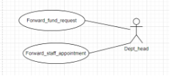

[Figma Design for HEAD OF DEPARTMENT](https://www.figma.com/proto/w2Mx7biMn2PJsYsPm7Qxdi/GAD-7?type=design&node-id=225-566&t=CUOboRHhwtbrbAGA-0&scaling=min-zoom&page-id=0%3A1&starting-point-node-id=128%3A649&show-proto-sidebar=1)

#### **DIRECTOR**

- **Role:** Approves project fund requests.
- **Functionalities:**
  - Approve/reject project fund requests

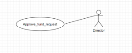

[Figma Design for DIRECTOR](https://www.figma.com/proto/w2Mx7biMn2PJsYsPm7Qxdi/GAD-7?type=design&node-id=197-833&t=CUOboRHhwtbrbAGA-0&scaling=min-zoom&page-id=0%3A1&starting-point-node-id=128%3A649&show-proto-sidebar=1)

---

### **3. Responsive Design**

- Ensures a consistent, user-friendly interface across all devices.
- Layouts and elements are optimized for desktops, tablets, and mobile devices.
- User roles and permissions remain intact regardless of screen size to maintain usability.

---

### **4. Accessibility**

- Designed to meet accessibility standards, ensuring ease of use for individuals with disabilities.
- High-contrast color schemes, alt text for images, and screen reader support are incorporated.
- Role-based features allow intuitive navigation tailored to each user category (Faculty, Staff, Dean, etc.).

---

### **Figma File (Designs) Link**

[View Complete Figma File](https://www.figma.com/file/w2Mx7biMn2PJsYsPm7Qxdi/GAD-7?type=design&node-id=197-833&mode=design&t=CUOboRHhwtbrbAGA-0)

---

## Database Schema
### **Module Name - RSPC (GAD-7)**

**Faculty Mentor:**  

**Student Mentor:** Yogesh Saini (21BCS250)

---

### **Database Documentation of [GAD-7 - RSPC] 4.0**

---

#### **1. ER Diagrams**

- **ER Diagram Creation:**  
  - To be created using draw.io  
  - [Example ER Diagram](https://drive.google.com/file/d/1kmG8brbNB10QXaFAynjsmBUCKIbs5VSx/view)

---

#### **2. Tables and Relationships**

##### **A. Database Schema Information**  
- Located in a Google Sheet for reference and updates.  
- [Example Database Schema Template](https://docs.google.com/spreadsheets/d/1zII3DuGzHmhpvQKzWX6SUeIBOF5BukEzft3_Siq4RcE/edit#gid=0)

##### **B. Changes Required in Currently Implemented Tables**

1. **Projects**
   - **Change:** Merging Consultancy projects with Research projects.
   - **Attribute:** `Project type`
   - **Justification:** To specify if it is a research or consultancy project.

2. **Patents**
   - **Change:** Removal of the table, as it is no longer relevant to the updated use case.

3. **Tech Transfers**
   - **Change:** Removal of the table due to its irrelevance in the updated use case.

4. **Facultys**
   - **Change:** Fix rendering issue to access fields in the table.

---

#### **3. Data Flow**

##### **Data Availability for API and Functional Testing**

**Tables Already Populated:**
- [Consultancy projects](http://127.0.0.1:8000/admin/research_procedures/consultancyproject/)
- [Patents](http://127.0.0.1:8000/admin/research_procedures/patent/)
- [Research projects](http://127.0.0.1:8000/admin/research_procedures/researchproject/)
- [Tech transfers](http://127.0.0.1:8000/admin/research_procedures/techtransfer/)
- [Facultys](http://127.0.0.1:8000/admin/globals/faculty/)

**Tables Required to Be Populated:**
- `Project_staff_info`
- `Funds`
- `Requests`
- `Inventory`

--- 

