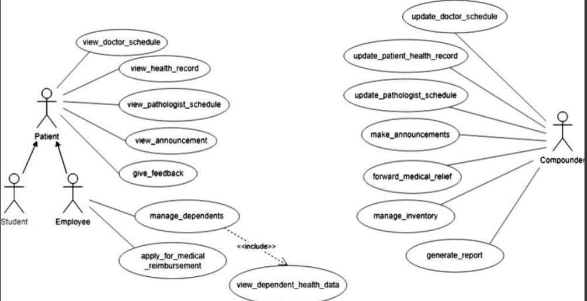
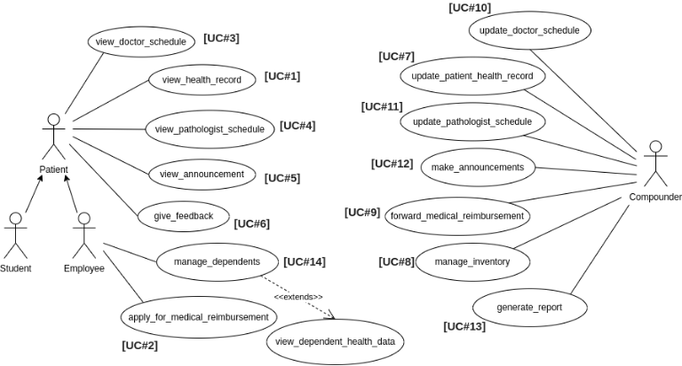

# Authentication Module Documentation

## Table of Contents
1. [User-Centered Design (UCD)](#user-centered-design-ucd)
2. [SRS Application](#srs-application)
3. [SRS Web Interface](#srs-web-interface)
4. [API Specifications](#api-specifications)
5. [UI for Application](#ui-for-application)
6. [UI for Web](#ui-for-web)
7. [Database Schema](#database-schema)

## User-Centered Design (UCD)
### Overview

## SRS Application
**Fusion ERP**

**Software Requirements Specification**

**OS-2-PRIMARYHEALTHCENTER MOBILEAPP**

Faculty Mentor:

Dr. Sraban Kumar Mohanty

Prepared by :

21bcs163 Pratham (**Team Lead**) 21bcs241 Vikas

21bcs243 Vishal Bairagi 21bcs245 Vishnu J Nair 21bcs246 Vishwajeet Toppo 21bcs247 Yadav Pritesh

1  **Introduction**
1. **Introduction about the Fusion – A brief Description**

FusionIIIT stands as a testament to the seamless integration and automation of diverse functions within PDPM Indian Institute of Information Technology, Design and Manufacturing, Jabalpur. Crafted with precision using Python 3.8 and powered by the Django Web framework, this initiative is a student-driven endeavor designed to elevate the institute's operational landscape. Encompassing everything from efficient administration management to academic prowess and miscellaneous departmental tasks, FusionIIIT is a holistic solution that harmonizes the intricacies of campus life.

Imagine it as a digital wizard that takes care of everything, from organizing the administrative stuff to making academics smoother. It's not just limited to the usual tasks; FusionIIIT jumps into various departments and sections, making sure every corner of campus life runs smoothly.

In the admin side, it handles the complicated paperwork and processes. For academics, it brings a digital touch, making learning and managing courses easier. But it doesn't stop there; FusionIIIT is like a friendly companion for all the different parts of the campus, making sure everything works well.

In simpler terms, FusionIIIT is not just a tool – it's a helpful friend, making life at PDPM IIITDM Jabalpur more organized and enjoyable for everyone.

2. **Purpose of the module:**

The purpose of the project entitled as PRIMARY HEALTH CENTRE MANAGEMENT SYSTEM is to computerize the Office Management and to manage different activities related to Primary Health Centre of PDPM IIITDM Jabalpur.

- Patient Registration and Record Management.
- Appointment and Prescription Record Keeping
- Doctor Availability and Scheduling
- Implementing measures to ensure the security and privacy of patient data
3. **Scope of the module**

The users of this module will be the registered students of the Institute (PDPM IIITDM Jabalpur), Faculty Members and their dependencies(family members).

This software system will be a Mobile application based Health Care Management System to be used by the above-mentioned people. Interface will enable the actors to view schedules for consulting doctors, to keep a track of their health records.

The compounder will be able to update the Doctor's schedule and patient log, manage the inventory, and make announcements of updates.

2  **User/Actor characteristics**

There are two types of users that interact with the system.

- Patient (Students &Employees)
- Compounder

**UserRoles and Permissions**:

Patients should have access to the following features:

- **View doctorschedule:** Patients should be able to see the schedule of doctors and their availability.
- **View announcements:** Patients should be able to view important announcements from the health center.
- **View health record**: Patients should have access to their own health records.
- **Request ambulance:** Patients should be able to request an ambulance in case of emergencies.
- **Provide feedback:** Patients should be able to provide feedback on their experiences.
- **View pathologist schedule**: Patients would have access to the schedule of pathologists visiting the health center.

Patients who are employees should have additional access to:

- **Dependency health record:** Staff members should be able to manage health records of their dependents.
- **Apply formedical relief:** Patients(specifically employees) should be able to apply for medical relief if needed.

Compounder (admin) should have access to the following features:

- **Update doctorschedule:** Compounder should be able to update the schedule of doctors.
- **Update patient log:** Compounder should be able to update patient logs and records.
- **Make announcements:** Compounders should be able to create and publish announcements.
- **Generate reports:** Compounder should be able to generate reports based on various parameters.
- **Forward medical relief:** Compounder should be able to process and forward medical relief requests.
- **Manage inventory:** Compounder should be able to manage the inventory of medicines and medical supplies.
- **Update pathologist schedule**: Compounder will be able to update the schedule of the pathologist
3  **Functional Requirements**
1. **UserAuthentication:** The system should have a secure user authentication mechanism to ensure that only registered students, faculty members, dependents, and compounders can access the application.
1. **UserRoles and Permissions:** Different user roles (students, faculty, dependents, compounders) with specific permissions should be defined to regulate access to various features and data within the application.
1. **Doctor's Schedule:** The system should display the schedule of consulting doctors, including their availability, timings, and consultation slots.Users should be able to request, book, or cancel appointments through the application.
1. **Health Records Management:** Users should have the ability to view and update their health records, including medical history, prescriptions, and appointments.The system should allow users to upload relevant health documents or reports.
1. **Compounder's Features:** Compounders should be able to update doctor schedules, including adding or modifying consultation slots. Inventory management functionalities for tracking medical supplies, updating stock levels, and generating alerts for low inventory.

Use Case Diagram

Use case Description

<table><tr><th colspan="1" valign="top"><b>UCID</b></th><th colspan="4" valign="top">UC#1</th></tr>
<tr><td colspan="1"><b>Use case Name</b></td><td colspan="4" valign="top">view_health_record</td></tr>
<tr><td colspan="1" valign="top"><b>Description</b></td><td colspan="4">Our system empowers patients to effortlessly track real-time health updates and access historical records for themselves and dependents. User-friendly and secure, it transforms health management into a personalized, proactive experience.</td></tr>
<tr><td colspan="1" valign="top"><b>Actor</b></td><td colspan="4" valign="top"><b>Patient</b></td></tr>
<tr><td colspan="1" valign="top"><b>Precondition</b></td><td colspan="4" valign="top">The Patient is logged in into the system.</td></tr>
<tr><td colspan="1" rowspan="2" valign="top"><b>Main Flow</b></td><td colspan="1" valign="top">1</td><td colspan="3" valign="top">The patient opens the "View Health Record"section.</td></tr>
<tr><td colspan="1" valign="top">2</td><td colspan="3" valign="top">The system displays a list of health records along with their latest statues[A1]</td></tr>
<tr><td colspan="1"><b>Post conditions</b></td><td colspan="4" valign="top">The health records are reflected in the database.</td></tr>
<tr><td colspan="1" valign="top"><b>Alternate Flow</b></td><td colspan="1" valign="top">A1</td><td colspan="2" valign="top">1</td><td colspan="1">If a newly registered patient has no existing health records to view.</td></tr>
<tr><td colspan="1" rowspan="2" valign="top"><b>Sub Flow</b></td><td colspan="2" valign="top">1</td><td colspan="2" valign="top">The patient goes to manage dependencies.</td></tr>
<tr><td colspan="2" valign="top">2</td><td colspan="2" valign="top">The patient also view health records of their dependencies[SA1]</td></tr>
<tr><td colspan="1"></td><td colspan="2" valign="top">3</td><td colspan="2" valign="top">The patient can add/delete a dependency.</td></tr>
<tr><td colspan="1" valign="top"><b>Alternate Sub Flow</b></td><td colspan="2" valign="top">SA1</td><td colspan="2" valign="top">If no dependencies exist, the system notifies the patient that no dependent health records are currently available.</td></tr>
<tr><td colspan="1" rowspan="2" valign="top"><b>Global Alternate Flow</b></td><td colspan="1" valign="top">GA1</td><td colspan="3">Due to high traffic, logging in may be temporarily affected. We apologize for the inconvenience</td></tr>
<tr><td colspan="1" valign="top">GA2</td><td colspan="3" valign="top">If a technical error occurs during the execution of any action (e.g., database failure, server issues), the system displays an error message and logs the incident.</td></tr>
</table>

<table><tr><th colspan="1"><b>UCID</b></th><th colspan="2">UC#2</th></tr>
<tr><td colspan="1"><b>Use case Name</b></td><td colspan="2">apply_for_medical_reimbursement</td></tr>
<tr><td colspan="1" valign="top"><b>Description</b></td><td colspan="2">The "apply_for_medical_reimbursement"use case allows employees to apply for medical relief by requesting a medical certificate. This certificate is official documentation to support their need for medical assistance or leave due to health reasons.</td></tr>
<tr><td colspan="1"><b>Actor</b></td><td colspan="2"><b>Patient(employee)</b></td></tr>
<tr><td colspan="1" valign="top"><b>Precondition</b></td><td colspan="2" valign="top">The employee logged in to the system.</td></tr>
<tr><td colspan="1" rowspan="3" valign="top"><b>Main Flow</b></td><td colspan="1" valign="top">1</td><td colspan="1" valign="top">The employee navigates to the "medical relief"section.</td></tr>
<tr><td colspan="1" valign="top">2</td><td colspan="1" valign="top">The system displays a form.</td></tr>
<tr><td colspan="1">3</td><td colspan="1">The employee fills out the form.[A1]</td></tr>
<tr><td colspan="1"></td><td colspan="1">4</td><td colspan="1">The system asks for a confirmation</td></tr>
<tr><td colspan="1"></td><td colspan="1" valign="top">5</td><td colspan="1" valign="top">The employee confirms the submission[A2]</td></tr>
<tr><td colspan="1"></td><td colspan="1" valign="top">6</td><td colspan="1" valign="top">The system returns to the employee ‘Dashboard’</td></tr>
<tr><td colspan="1" valign="top"><b>Postconditions</b></td><td colspan="2" valign="top">The form was successfully submitted and stored in the database.</td></tr>
</table>

<table><tr><th colspan="1" valign="top"><b>Alternate Flow</b></th><th colspan="1" valign="top">A1</th><th colspan="1" valign="top">1</th><th colspan="1">The employee chooses not to confirm but rather chooses to cancel.</th></tr>
<tr><td colspan="1" valign="top"><b>Sub Flow</b></td><td colspan="3" valign="top">NIL</td></tr>
<tr><td colspan="1" rowspan="2" valign="top"><b>Global Alternate Flow</b></td><td colspan="1" valign="top">GA1</td><td colspan="2" valign="top">The employee can ‘cancel’the procedure at any time by exercising such an option and will be directed to the dashboard.</td></tr>
<tr><td colspan="1" valign="top">GA2</td><td colspan="2" valign="top">If a technical error occurs during the execution of any action (e.g., database failure, server issues), the system displays an error message and logs the incident.</td></tr>
</table>

<table><tr><th colspan="1" valign="top"><b>UCID</b></th><th colspan="2" valign="top">UC#3</th></tr>
<tr><td colspan="1" valign="top"><b>Use case Name</b></td><td colspan="2" valign="top">view_doctor_schedule</td></tr>
<tr><td colspan="1" valign="top"><b>Description</b></td><td colspan="2">The "View Doctor Schedule"use case allows patients to view doctor schedules in PHC through the Fusion portal.</td></tr>
<tr><td colspan="1" valign="top"><b>Actor</b></td><td colspan="2" valign="top"><b>Patient</b></td></tr>
<tr><td colspan="1"><b>Precondition</b></td><td colspan="2">The patient is logged in into the system.</td></tr>
<tr><td colspan="1" rowspan="3" valign="top"><b>Main Flow</b></td><td colspan="1">1</td><td colspan="1">The patient navigates to the "View Doctor Schedule"section.</td></tr>
<tr><td colspan="1">2</td><td colspan="1">The system displays doctor schedules.</td></tr>
<tr><td colspan="1" valign="top">3</td><td colspan="1" valign="top">The patient view doctor schedule and book appointment accordingly</td></tr>
<tr><td colspan="1" valign="top"><b>Post conditions</b></td><td colspan="2" valign="top">The patient viewed the doctor schedule</td></tr>
<tr><td colspan="1" valign="top"><b>Global Alternate Flow</b></td><td colspan="1" valign="top">GA1</td><td colspan="1" valign="top">If a technical error occurs during the execution of any action (e.g., database failure, server issues), the system displays an error message and logs the incident.</td></tr>
</table>

<table><tr><th colspan="1"><b>UCID</b></th><th colspan="2">UC#4</th></tr>
<tr><td colspan="1" valign="top"><b>Use case Name</b></td><td colspan="2" valign="top">view_pathologist_schedule</td></tr>
<tr><td colspan="1" valign="top"><b>Description</b></td><td colspan="2" valign="top">The "View Pathologist Schedule"use case allows patients to view pathologist schedules in PHC through the Fusion portal.</td></tr>
<tr><td colspan="1" valign="top"><b>Actor</b></td><td colspan="2" valign="top"><b>Patient</b></td></tr>
<tr><td colspan="1" valign="top"><b>Precondition</b></td><td colspan="2" valign="top">The patient is logged in into the system.</td></tr>
<tr><td colspan="1" rowspan="2" valign="top"><b>Main Flow</b></td><td colspan="1">1</td><td colspan="1">The patient navigates to the "View Pathologist Schedule"section.</td></tr>
<tr><td colspan="1">2</td><td colspan="1">The system displays a pathologist schedule.</td></tr>
</table>

||3|The patient views the schedule.|
| :- | - | - |
|**Post conditions**||The updated pathologist schedule information is reflected in the database.|
|**Global Alternate Flow**|GA1|If a technical error occurs during the execution of any action (e.g., database failure, server issues), the system displays an error message and logs the incident.|

<table><tr><th colspan="1"><b>UCID</b></th><th colspan="2">UC#5</th></tr>
<tr><td colspan="1"><b>Use case Name</b></td><td colspan="2">view_announcements</td></tr>
<tr><td colspan="1" valign="top"><b>Description</b></td><td colspan="2">The "view_announcement"use case allows patient to see the latest announcement made on the Fusion portal by the compounder.</td></tr>
<tr><td colspan="1"><b>Actor</b></td><td colspan="2"><b>Patient</b></td></tr>
<tr><td colspan="1"><b>Precondition</b></td><td colspan="2">The patient is logged in into the system.</td></tr>
<tr><td colspan="1" rowspan="2" valign="top"><b>Main Flow</b></td><td colspan="1">1</td><td colspan="1">The patient navigates to the "Announcement"section.</td></tr>
<tr><td colspan="1">2</td><td colspan="1">The patient sees the latest announcements.</td></tr>
<tr><td colspan="1" valign="top"><b>Global Alternate Flow</b></td><td colspan="1" valign="top">GA1</td><td colspan="1">If a technical error occurs during the execution of any action (e.g., database failure, server issues), the system displays an error message and logs the incident.</td></tr>
</table>

<table><tr><th colspan="1"><b>UCID</b></th><th colspan="2">UC#6</th></tr>
<tr><td colspan="1"><b>Use case Name</b></td><td colspan="2">give_feedback</td></tr>
<tr><td colspan="1" valign="top"><b>Description</b></td><td colspan="2" valign="top">The "give_feedback"use case allows a patient to provide his/her feedback on the Fusion portal by the compounder.</td></tr>
<tr><td colspan="1" valign="top"><b>Actor</b></td><td colspan="2" valign="top"><b>Patient</b></td></tr>
<tr><td colspan="1"><b>Precondition</b></td><td colspan="2">The patient is logged in into the system.</td></tr>
<tr><td colspan="1" rowspan="2" valign="top"><b>Main Flow</b></td><td colspan="1">1</td><td colspan="1">The patient navigates to the "Feedback"section.</td></tr>
<tr><td colspan="1" valign="top">2</td><td colspan="1" valign="top">The patient fills the feedback form.</td></tr>
<tr><td colspan="1"></td><td colspan="1" valign="top">3</td><td colspan="1" valign="top">The patient submits the form.</td></tr>
<tr><td colspan="1" valign="top"><b>Global Alternate Flow</b></td><td colspan="1" valign="top">GA1</td><td colspan="1" valign="top">If a technical error occurs during the execution of any action (e.g., database failure, server issues), the system displays an error message and logs the incident.</td></tr>
</table>

|**UCID**|UC#7|
| - | - |
|**Use case Name**|update\_patient\_health\_record|
|**Description**|Compounder have the capability to diligently update patient logs, ensuring they accurately reflect the latest treatments and any changes in the health record, promoting comprehensive and up-to-date patient information|
|**Actor**|**Compounder**|
|**Precondition**|The Compounder is logged in into the system.|

<table><tr><th colspan="1" rowspan="2" valign="top"><b>Main Flow</b></th><th colspan="1">1</th><th colspan="3">The compounder opens the "update Health Record"section of a specific patient.</th></tr>
<tr><td colspan="1">2</td><td colspan="3">The system displays previous list of health records.[A1]</td></tr>
<tr><td colspan="1"></td><td colspan="1">3</td><td colspan="3">Compounder enter new records of latest appointment happened.[A2]</td></tr>
<tr><td colspan="1"><b>Post conditions</b></td><td colspan="4" valign="top">The health records changes/updates are reflected in the database.</td></tr>
<tr><td colspan="1" valign="top"><b>Alternate Flow</b></td><td colspan="1" valign="top">A1</td><td colspan="2" valign="top">1</td><td colspan="1" valign="top">If a newly registered patient has no existing health records to view.</td></tr>
<tr><td colspan="1"></td><td colspan="1" valign="top">A2</td><td colspan="2" valign="top">1</td><td colspan="1" valign="top">If the appointment was canceled, nothing new happened in the health record.</td></tr>
<tr><td colspan="1" valign="top"><b>Sub Flow</b></td><td colspan="4" valign="top">The compounder also update health records of their dependencies[SA1]</td></tr>
<tr><td colspan="1" valign="top"><b>Alternate Sub Flow</b></td><td colspan="2" valign="top">SA1</td><td colspan="2">If no dependencies exist, the system notifies the compounder that no dependent health records are currently available.</td></tr>
<tr><td colspan="1" rowspan="2" valign="top"><b>Global Alternate Flow</b></td><td colspan="1" valign="top">GA1</td><td colspan="3">Due to high traffic, logging in may be temporarily affected. We apologize for the inconvenience</td></tr>
<tr><td colspan="1" valign="top">GA2</td><td colspan="3">If a technical error occurs during the execution of any action (e.g., database failure, server issues), the system displays an error message and logs the incident.</td></tr>
</table>

<table><tr><th colspan="1"><b>UCID</b></th><th colspan="2">UC#8</th></tr>
<tr><td colspan="1"><b>Use case Name</b></td><td colspan="2">manage_inventory</td></tr>
<tr><td colspan="1" valign="top"><b>Description</b></td><td colspan="2">The "manage_inventory"use case allows the compounder to check the available stocks of medicines, blood and beds available and update accordingly through the Fusion portal.</td></tr>
<tr><td colspan="1"><b>Actor</b></td><td colspan="2"><b>Compounder</b></td></tr>
<tr><td colspan="1"><b>Precondition</b></td><td colspan="2">The compounder is logged in into the system.</td></tr>
<tr><td colspan="1" rowspan="3" valign="top"><b>Main Flow</b></td><td colspan="1">1</td><td colspan="1">The compounder navigates to the "Inventory"section.</td></tr>
<tr><td colspan="1">2</td><td colspan="1">The compounder goes to the medicines section.</td></tr>
<tr><td colspan="1">3</td><td colspan="1">The compounder selects a medicine to update if required.</td></tr>
<tr><td colspan="1"></td><td colspan="1">4</td><td colspan="1">The compounder goes to the blood bank section and updates if required.</td></tr>
<tr><td colspan="1"></td><td colspan="1" valign="top">5</td><td colspan="1" valign="top">The compounder goes to the bed section and updates if required.</td></tr>
<tr><td colspan="1" valign="top"><b>Post conditions</b></td><td colspan="2" valign="top">The updated information is reflected in the database.</td></tr>
<tr><td colspan="1" valign="top"><b>Global Alternate Flow</b></td><td colspan="1" valign="top">GA1</td><td colspan="1">If a technical error occurs during the execution of any action (e.g., database failure, server issues), the system displays an error message and logs the incident.</td></tr>
</table>

|**UC ID**|UC#9|
| - | - |
|**Use case Name**|forward\_medical\_reimbursement|

<table><tr><th colspan="1" valign="top"><b>Description</b></th><th colspan="3">The "forward_medical_reimbursement "use case enables the compounder to either approve or deny a patient's request for medical relief.</th></tr>
<tr><td colspan="1" valign="top"><b>Actor</b></td><td colspan="3" valign="top"><b>Compounder</b></td></tr>
<tr><td colspan="1" valign="top"><b>Precondition</b></td><td colspan="3" valign="top">The compounder logged in to the system.</td></tr>
<tr><td colspan="1" rowspan="8" valign="top"><b>Main Flow</b></td><td colspan="1">1</td><td colspan="2">The compounder chose the option to see the pending requests for medical relief.</td></tr>
<tr><td colspan="1" valign="top">2</td><td colspan="2" valign="top">The system presents a list of the pending requests for leave.</td></tr>
<tr><td colspan="1" valign="top">3</td><td colspan="2" valign="top">The compounder selects one of the ’ pending requests for medical relief’ to view details.</td></tr>
<tr><td colspan="1" valign="top">4</td><td colspan="2" valign="top">A form containing the details of the medical relief request gets displayed along with options for actions to be taken</td></tr>
<tr><td colspan="1" valign="top">5</td><td colspan="2" valign="top">The compounder chooses an action [A1]</td></tr>
<tr><td colspan="1" valign="top">6</td><td colspan="2" valign="top">The System asks for a confirmation</td></tr>
<tr><td colspan="1" valign="top">7</td><td colspan="2" valign="top">The compounder confirms for the action [A2]</td></tr>
<tr><td colspan="1">8</td><td colspan="2">The system presents an acknowledgment including all the furnished details of the leave request and action taken</td></tr>
<tr><td colspan="1"></td><td colspan="1">9</td><td colspan="2">The system returns to the compounder ‘Dashboard’</td></tr>
<tr><td colspan="1" valign="top"><b>Postconditions</b> </td><td colspan="3" valign="top">The updated information about medical relief is reflected in the database.</td></tr>
<tr><td colspan="1" rowspan="4" valign="top"><b>Alternate Flow</b></td><td colspan="1" rowspan="2" valign="top">A1</td><td colspan="1" valign="top">1</td><td colspan="1" valign="top">In the case of the ‘reject’ option, the system seeks the reason/comments from the compounder. The compounder provides the comments and confirm</td></tr>
<tr><td colspan="1" valign="top">2</td><td colspan="1"><b>Post-condition</b> – The system returns to the compounder ‘Dashboard’ – initial screen.</td></tr>
<tr><td colspan="1" rowspan="2" valign="top">A2</td><td colspan="1" valign="top">1</td><td colspan="1" valign="top">The compounder chooses not to confirm.</td></tr>
<tr><td colspan="1" valign="top">2</td><td colspan="1"><b>Post-condition</b> – The system displays the form with the data filled in so far.</td></tr>
<tr><td colspan="1" valign="top"><b>Sub Flow</b></td><td colspan="3">The employee is notified of the compounder action as the status update of the application</td></tr>
<tr><td colspan="1" valign="top"><b>Global Alternate Flow</b></td><td colspan="1" valign="top">GA1</td><td colspan="2" valign="top">If a technical error occurs during the execution of any action (e.g., database failure, server issues), the system displays an error message and logs the incident.</td></tr>
</table>

|**UCID**|UC#10|
| - | - |
|**Use case Name**|update\_doctor\_schedule|
|**Description**|The "Update Doctor Schedule"use case allows the compounder to update doctor schedules in PHC through the Fusion portal.|

<table><tr><th colspan="1"><b>Actor</b></th><th colspan="3"><b>Compounder</b></th></tr>
<tr><td colspan="1"><b>Precondition</b></td><td colspan="3">The Compounder is logged in into the system.</td></tr>
<tr><td colspan="1" rowspan="3" valign="top"><b>Main Flow</b></td><td colspan="1">1</td><td colspan="2">The Compounder navigates to the "Update Doctor Schedule" section.</td></tr>
<tr><td colspan="1">2</td><td colspan="2">The system displays a list of doctor schedules</td></tr>
<tr><td colspan="1">3</td><td colspan="2">The compounder update doctor schedules accordingly</td></tr>
<tr><td colspan="1" valign="top"><b>Post conditions</b></td><td colspan="3" valign="top">The updated doctor schedule information is reflected in the database.</td></tr>
<tr><td colspan="1" valign="top"><b>Alternate Flow</b></td><td colspan="1" valign="top">A1</td><td colspan="1" valign="top">1</td><td colspan="1" valign="top">No doctor is available so compounder not update any schedule, Only reviewed it.</td></tr>
<tr><td colspan="1" valign="top"><b>Sub Flow</b></td><td colspan="3" valign="top">NIL</td></tr>
<tr><td colspan="1" valign="top"><b>Global Alternate Flow</b></td><td colspan="1" valign="top">GA1</td><td colspan="2">If a technical error occurs during the execution of any action (e.g., database failure, server issues), the system displays an error message and logs the incident.</td></tr>
</table>

<table><tr><th colspan="1"><b>UCID</b></th><th colspan="3">UC#11</th></tr>
<tr><td colspan="1" valign="top"><b>Use case Name</b></td><td colspan="3" valign="top">update_pathologist_schedule</td></tr>
<tr><td colspan="1" valign="top"><b>Description</b></td><td colspan="3" valign="top">The "Update Pathologist Schedule"use case allows the compounder to update pathologist schedules in PHC through the Fusion portal.</td></tr>
<tr><td colspan="1" valign="top"><b>Actor</b></td><td colspan="3" valign="top"><b>Compounder</b></td></tr>
<tr><td colspan="1" valign="top"><b>Precondition</b></td><td colspan="3" valign="top">The Compounder is logged in into the system.</td></tr>
<tr><td colspan="1" rowspan="3" valign="top"><b>Main Flow</b></td><td colspan="1" valign="top">1</td><td colspan="2" valign="top">The Compounder navigates to the "Update Pathologist Schedule" section.</td></tr>
<tr><td colspan="1" valign="top">2</td><td colspan="2" valign="top">The system displays a list of pathologist schedules.</td></tr>
<tr><td colspan="1" valign="top">3</td><td colspan="2" valign="top">The compounder updates pathologist schedules accordingly.</td></tr>
<tr><td colspan="1" valign="top"><b>Post conditions</b></td><td colspan="3" valign="top">The updated pathologist schedule information is reflected in the database.</td></tr>
<tr><td colspan="1" valign="top"><b>Alternate Flow</b></td><td colspan="1" valign="top">A1</td><td colspan="1" valign="top">1</td><td colspan="1">
No pathologist is available so compounder not update any schedule,

Only reviewed it.
</td></tr>
<tr><td colspan="1"><b>Sub Flow</b></td><td colspan="3">NIL</td></tr>
<tr><td colspan="1" valign="top"><b>Global Alternate Flow</b></td><td colspan="1" valign="top">GA1</td><td colspan="2">If a technical error occurs during the execution of any action (e.g., database failure, server issues), the system displays an error message and logs the incident.</td></tr>
</table>

<table><tr><th colspan="1"><b>UCID</b></th><th colspan="2">UC#12</th></tr>
<tr><td colspan="1"><b>Use case Name</b></td><td colspan="2">make_announcements</td></tr>
<tr><td colspan="1" valign="top"><b>Description</b></td><td colspan="2">The "make_announcement"use case allows patient to see the latest announcement made on the Fusion portal by the compounder.</td></tr>
<tr><td colspan="1"><b>Actor</b></td><td colspan="2"><b>Compounder</b></td></tr>
<tr><td colspan="1"><b>Precondition</b></td><td colspan="2">The compounder is logged in into the system.</td></tr>
<tr><td colspan="1" rowspan="2" valign="top"><b>Main Flow</b></td><td colspan="1">1</td><td colspan="1">The compounder navigates to the "Announcement"section.</td></tr>
<tr><td colspan="1">2</td><td colspan="1">The patient makes the latest announcements.</td></tr>
<tr><td colspan="1" valign="top"><b>Global Alternate Flow</b></td><td colspan="1" valign="top">GA1</td><td colspan="1">If a technical error occurs during the execution of any action (e.g., database failure, server issues), the system displays an error message and logs the incident.</td></tr>
</table>

<table><tr><th colspan="1"><b>UCID</b></th><th colspan="2">UC#13</th></tr>
<tr><td colspan="1"><b>Use case Name</b></td><td colspan="2">generate_report</td></tr>
<tr><td colspan="1" valign="top"><b>Description</b></td><td colspan="2" valign="top">The "generate_report"use case allows the compounder to generate a medical report of a patient on the Fusion portal by the compounder.</td></tr>
<tr><td colspan="1" valign="top"><b>Actor</b></td><td colspan="2" valign="top"><b>Compounder</b></td></tr>
<tr><td colspan="1"><b>Precondition</b></td><td colspan="2">The compounder is logged in into the system.</td></tr>
<tr><td colspan="1" rowspan="4" valign="top"><b>Main Flow</b></td><td colspan="1">1</td><td colspan="1">The compounder navigates to the health records of a patient.</td></tr>
<tr><td colspan="1" valign="top">2</td><td colspan="1" valign="top">The compounder navigates to generate report.</td></tr>
<tr><td colspan="1" valign="top">3</td><td colspan="1" valign="top">The compounder fills the required details.</td></tr>
<tr><td colspan="1" valign="top">4</td><td colspan="1" valign="top">Submit the form.</td></tr>
<tr><td colspan="1" valign="top"><b>Global Alternate Flow</b></td><td colspan="1" valign="top">GA1</td><td colspan="1" valign="top">If a technical error occurs during the execution of any action (e.g., database failure, server issues), the system displays an error message and logs the incident.</td></tr>
</table>

6. **UserInterfaces**

The user interface should comply with the colour scheming and dashboard design of the FUSION\_IIIT. Users should be able to navigate from one functionality to another. Inter module navigation should be smooth. All the functionalities should be easy to use and no specific training should be required for the usage of the module

7. **Tech Stack Used**
- Flutter
- Dart
- VS Code
- Android Studio
4  **Non- Functional Requirements**
1. **Performance:** The system should respond to user interactions quickly. Response time for booking actions, inventory updates, and notifications should be less.
1. **Scalability:** The system should handle a mass of concurrent users. System performance should be evaluated under increasing load conditions.
1. **Availability:** The system should be available 99.9%of the time.
1. **Security:** Ensure data confidentiality and integrity. Role-based authorization ensures that users can only perform actions relevant to their designated roles.

   5  **Module dependencies with other fusion modules**
1. **UILevel Dependency**

   Users log in to the Fusion application and are presented with the main dashboard. The user (student, employees) can track his/her health records. The employees can also view the health records of their dependencies.

2. **DB Level Dependencies**

   Following are the tables and their respective dependencies.

<table><tr><th colspan="1" valign="top"><b>S.no.</b></th><th colspan="1" valign="top"><b>Table Name</b></th><th colspan="1" valign="top"><b>Foreign Key</b></th><th colspan="1" valign="top"><b>Reference Table</b></th></tr>
<tr><td colspan="1" rowspan="3" valign="top">1</td><td colspan="1" rowspan="3" valign="top">health_center_appointment</td><td colspan="1">user_id</td><td colspan="1">globals_extrainfo</td></tr>
<tr><td colspan="1" valign="top">doctor_id</td><td colspan="1" valign="top">health_center_doctor</td></tr>
<tr><td colspan="1" valign="top">schedule_id</td><td colspan="1" valign="top">health_center_schedule</td></tr>
<tr><td colspan="1" valign="top">2</td><td colspan="1" valign="top">health_center_ambulance_request</td><td colspan="1" valign="top">user_id</td><td colspan="1" valign="top">globals_extrainfo</td></tr>
<tr><td colspan="1" valign="top">3</td><td colspan="1" valign="top">health_center_complaint</td><td colspan="1" valign="top">user_id</td><td colspan="1" valign="top">globals_extrainfo</td></tr>
<tr><td colspan="1">4</td><td colspan="1">health_center_expiry</td><td colspan="1">medicine_id</td><td colspan="1">health_center_medicine</td></tr>
<tr><td colspan="1" rowspan="3" valign="top">5</td><td colspan="1" rowspan="3" valign="top">health_center_hospital_admit</td><td colspan="1">doctor_id</td><td colspan="1">health_center_doctor</td></tr>
<tr><td colspan="1">hospital_name_id</td><td colspan="1">health_center_hospital</td></tr>
<tr><td colspan="1">user_id</td><td colspan="1">globals_extrainfo</td></tr>
</table>

<table><tr><th colspan="1" rowspan="2" valign="top">6</th><th colspan="1" rowspan="2" valign="top">health_center_medicine</th><th colspan="1" valign="top">medicine_id</th><th colspan="1" valign="top">health_center_stock</th></tr>
<tr><td colspan="1">patient_id</td><td colspan="1">globals_extrainfo</td></tr>
<tr><td colspan="1" rowspan="2" valign="top">7</td><td colspan="1" rowspan="2" valign="top">health_center_prescribed_medicine</td><td colspan="1">medicine_id</td><td colspan="1">health_center_stock</td></tr>
<tr><td colspan="1">prescription_id</td><td colspan="1">health_center_prescription</td></tr>
<tr><td colspan="1" rowspan="3" valign="top">8</td><td colspan="1" rowspan="3" valign="top">health_center_prescription</td><td colspan="1" valign="top">appointment_id</td><td colspan="1" valign="top">health_center_appointment</td></tr>
<tr><td colspan="1" valign="top">doctor_id</td><td colspan="1" valign="top">health_center_doctor</td></tr>
<tr><td colspan="1" valign="top">user_id</td><td colspan="1" valign="top">globals_extrainfo</td></tr>
<tr><td colspan="1" valign="top">9</td><td colspan="1" valign="top">health_center_schedule</td><td colspan="1" valign="top">doctor_id</td><td colspan="1" valign="top">health_center_doctor</td></tr>
</table>

3. **Module Level Dependencies**
- FTS (File Tracking System)
  - To keep track of the files/documents under process when a compounder forwards a medical reimbursement form.
- HR
  - To get the data of students and employees.
- Notifications
  - To trigger notification to the patient for any new announcement.
- Dashboard

○ To provide a unified and real-time interface for monitoring and tracking

health records.

## SRS Web Interface
### Features
#### HEALTH CENTER (Web)

#### Software Requirements Specification (OS2 Module)

**Faculty Mentor:** Dr. Sraban Kumar Mohanty  
**Team Members:**  
- Manjith Kumar (21bcs070)  
- Lohith (21bcs156)  
- Teja (21bcs136)  
- Joshi (21bcs153)  

**Team Mentor:** Prabhat Suman (21bcs157)  
**Prem Charan (21bcs152)**  

---

### Table of Contents

1. [Introduction](#introduction)
   - [Introduction about Fusion - A brief description](#introduction-about-fusion)
   - [Purpose of the module](#purpose-of-the-module)
   - [Scope of the module - Actors, Functionalities](#scope-of-the-module)
2. [User/Actor Description (characteristics)](#useractor-description)
3. [Functional Requirements](#functional-requirements)
   - [Use Case Diagram](#use-case-diagram)
   - [Use Case Description](#use-case-description)
4. [Non-Functional Requirements](#non-functional-requirements)
5. [Module Dependencies with Other Modules](#module-dependencies)

---

### 1. Introduction

#### Introduction about Fusion - A Brief Description

**FusionIIIT** stands as a testament to the seamless integration and automation of diverse functions within PDPM Indian Institute of Information Technology, Design and Manufacturing, Jabalpur. Crafted with precision using Python 3.8 and powered by the Django Web framework, this initiative is a student-driven endeavor designed to elevate the institute's operational landscape. Encompassing everything from efficient administration management to academic prowess and miscellaneous departmental tasks, FusionIIIT is a holistic solution that harmonizes the intricacies of campus life.

In simpler terms, FusionIIIT is not just a tool – it's a helpful friend, making life at PDPM IIITDM Jabalpur more organized and enjoyable for everyone.

#### Purpose of the Module

The purpose of the project entitled **PRIMARY HEALTH CENTRE MANAGEMENT SYSTEM** is to computerize the Office Management and to manage different activities related to the Primary Health Centre of PDPM IIITDM Jabalpur. We aim to develop software that is user-friendly, simple, fast, and cost-effective. The system includes:

- Registration of patients
- Storing patient details into the system
- Maintaining records of medical stock inventory
- Viewing all previous appointments and prescriptions of the patient
- Searching for the availability of doctors and their timings

Traditionally, these tasks were done manually.

#### Scope of the Module - Actors, Functionalities

The users of this module will be the registered students at the Institute (PDPM IIITDM Jabalpur), faculty members, and their dependents (family members). This software system will be a mobile application-based Health Care Management System for the mentioned users. The interface will enable actors to view schedules for consulting doctors and keep track of their health records. The compounder will be able to:

- Update the doctor’s schedule and patient log
- Manage the inventory
- Make announcements of updates

---

### 2. User/Actor Characteristics

There are mainly two types of users that interact in this system:

#### Patient (Students & Employees)

Patients should have access to the following features:

- **View Doctor Schedule:** See the schedule of doctors and their availability.
- **View Announcements:** Access important announcements from the health center.
- **Apply for Medical Relief:** Apply for medical relief if needed.
- **View Health Record:** Access their own health records.
- **Request Ambulance:** Request an ambulance in case of emergencies.
- **Provide Feedback:** Provide feedback on their experiences.
- **Make Appointment Request:** Request an appointment with a doctor.

Patients who are staff (employees) should have additional access to:

- **Dependency Health Record:** Manage the health records of their dependents.
- **Apply for Medical Relief:** Specifically apply for medical relief if needed.

#### Compounder

The compounder should have the following features:

- **Update Doctor Schedule:** Update the schedule of doctors.
- **Update Patient Log:** Update patient logs and records.
- **Make Announcements:** Create and publish announcements.
- **Generate Reports:** Generate reports based on various parameters.
- **Forward Medical Relief:** Process and forward medical relief requests.
- **Manage Inventory:** Manage the inventory of medicines and medical supplies.
- **Process Appointment Requests:** Handle appointment requests from patients.
- **Process Ambulance Requests:** Handle ambulance requests from patients.
- **View Feedback from Patients:** Access feedback provided by patients.

---

### 3. Functional Requirements

- **User Authentication:** The system should have a secure user authentication mechanism to ensure that only registered students, faculty members, dependents, and compounders can access the application.
  
- **User Roles and Permissions:** Different user roles (students, faculty, dependents, compounders) with specific permissions should be defined to regulate access to various features and data within the application.
  
- **Doctor's Schedule:** The system should display the schedule of consulting doctors, including their availability, timings, and consultation slots. Users should be able to request, book, or cancel appointments through the application.
  
- **Health Records Management:** Users should have the ability to view and update their health records, including medical history, prescriptions, and appointments. The system should allow users to upload relevant health documents or reports.
  
- **Compounder's Features:** Compounders should be able to update doctor schedules, including adding or modifying consultation slots. Inventory management functionalities for tracking medical supplies, updating stock levels, and generating alerts for low inventory.

### Use Case Diagram

### Use Case Description

<table><tr><th colspan="1" valign="top">UC ID </th><th colspan="4" valign="top">UC#1 </th></tr>
<tr><td colspan="1">Use case Name </td><td colspan="4" valign="top">view_health_record </td></tr>
<tr><td colspan="1" valign="top">Description </td><td colspan="4">Our system empowers patients to effortlessly track real-time health updates and access historical records for themselves and dependents. User-friendly and secure, it transforms health management into a personalized, proactive experience. </td></tr>
<tr><td colspan="1" valign="top">Actor </td><td colspan="4" valign="top">Patient </td></tr>
<tr><td colspan="1" valign="top">Precondition </td><td colspan="4" valign="top">The Patient is logged in into the system. </td></tr>
<tr><td colspan="1" rowspan="2" valign="top">Main Flow </td><td colspan="1" valign="top">1 </td><td colspan="3" valign="top">The patient opens the "View Health Record" section. </td></tr>
<tr><td colspan="1">2 </td><td colspan="3">The system displays a list of health records along with their latest statues[A1] </td></tr>
<tr><td colspan="1">Post conditions </td><td colspan="4" valign="top">The health records are reflected in the database. </td></tr>
<tr><td colspan="1" valign="top">Alternate Flow </td><td colspan="2" valign="top">A1 </td><td colspan="1" valign="top">1 </td><td colspan="1">If a newly registered patient has no existing health records to view. </td></tr>
<tr><td colspan="1" rowspan="2" valign="top">Sub Flow </td><td colspan="2" valign="top">1 </td><td colspan="2">The patient goes to manage dependencies. </td></tr>
<tr><td colspan="2" valign="top">2 </td><td colspan="2" valign="top">The patient also view health records of their dependencies[SA1] </td></tr>
<tr><td colspan="1"></td><td colspan="2">3 </td><td colspan="2">The patient can add/delete a dependency. </td></tr>
<tr><td colspan="1" valign="top">Alternate Sub Flow </td><td colspan="2" valign="top">SA1 </td><td colspan="2">If no dependencies exist, the system notifies the patient that no dependent health records are currently available. </td></tr>
<tr><td colspan="1" rowspan="2" valign="top">Global Alternate Flow </td><td colspan="2" valign="top">GA1 </td><td colspan="2">Due to high traffic, logging in may be temporarily affected. We apologize for the inconvenience </td></tr>
<tr><td colspan="2" valign="top">GA2 </td><td colspan="2">If a technical error occurs during the execution of any action (e.g., database failure, server issues), the system displays an error message and logs the incident. </td></tr>
</table>

<table><tr><th colspan="1" valign="top">UC ID </th><th colspan="2" valign="top">UC#2 </th></tr>
<tr><td colspan="1" valign="top">Use case Name </td><td colspan="2" valign="top">apply_for_medical_reimbursement</td></tr>
<tr><td colspan="1" valign="top">Description </td><td colspan="2">The "apply_for_medical_reimbursement" use case allows employees to apply for medical relief by requesting a medical certificate. This certificate is official documentation to support their need for medical assistance or leave due to health reasons. </td></tr>
<tr><td colspan="1" valign="top">Actor </td><td colspan="2" valign="top">Patient(employee) </td></tr>
<tr><td colspan="1" valign="top">Precondition </td><td colspan="2" valign="top">The employee logged in to the system. </td></tr>
<tr><td colspan="1" rowspan="3" valign="top">Main Flow </td><td colspan="1">1 </td><td colspan="1">The employee navigates to the "medical relief" section. </td></tr>
<tr><td colspan="1">2 </td><td colspan="1">The system displays a form. </td></tr>
<tr><td colspan="1" valign="top">3 </td><td colspan="1" valign="top">The employee fills out the form.[A1] </td></tr>
<tr><td colspan="1"></td><td colspan="1">4 </td><td colspan="1">The system asks for a confirmation </td></tr>
<tr><td colspan="1"></td><td colspan="1">5 </td><td colspan="1">The employee confirms the submission[A2] </td></tr>
<tr><td colspan="1"></td><td colspan="1">6 </td><td colspan="1">The system returns to the employee ‘Dashboard’ </td></tr>
<tr><td colspan="1" valign="top">Postconditions </td><td colspan="2" valign="top">The form was successfully submitted and stored in the database. </td></tr>
</table>

<table><tr><th colspan="1" valign="top">Alternate Flow </th><th colspan="1" valign="top">A1 </th><th colspan="1" valign="top">1 </th><th colspan="1">The employee chooses not to confirm but rather chooses to cancel. </th></tr>
<tr><td colspan="1" valign="top">Sub Flow </td><td colspan="3" valign="top">NIL </td></tr>
<tr><td colspan="1" rowspan="2" valign="top">Global Alternate Flow </td><td colspan="1" valign="top">GA1 </td><td colspan="2">The employee can ‘cancel’ the procedure at any time by exercising such an option and will be directed to the dashboard. </td></tr>
<tr><td colspan="1" valign="top">GA2 </td><td colspan="2">If a technical error occurs during the execution of any action (e.g., database failure, server issues), the system displays an error message and logs the incident. </td></tr>
</table>

<table><tr><th colspan="1" valign="top">UC ID </th><th colspan="2" valign="top">UC#3 </th></tr>
<tr><td colspan="1" valign="top">Use case Name </td><td colspan="2" valign="top">view_doctor_schedule </td></tr>
<tr><td colspan="1" valign="top">Description </td><td colspan="2">The "View Doctor Schedule" use case allows patients to view doctor schedules in PHC through the Fusion portal. </td></tr>
<tr><td colspan="1">Actor </td><td colspan="2">Patient </td></tr>
<tr><td colspan="1">Precondition </td><td colspan="2">The patient is logged in into the system. </td></tr>
<tr><td colspan="1" rowspan="3" valign="top">Main Flow </td><td colspan="1">1 </td><td colspan="1">The patient navigates to the "View Doctor Schedule" section. </td></tr>
<tr><td colspan="1">2 </td><td colspan="1">The system displays doctor schedules. </td></tr>
<tr><td colspan="1">3 </td><td colspan="1" valign="top">The patient view doctor schedule and book appointmentaccordingly</td></tr>
<tr><td colspan="1" valign="top">Post conditions </td><td colspan="2" valign="top">The patient viewed the doctor schedule </td></tr>
<tr><td colspan="1" valign="top">Global Alternate Flow </td><td colspan="1" valign="top">GA1 </td><td colspan="1" valign="top">If a technical error occurs during the execution of any action (e.g., database failure, server issues), the system displays an error message and logs the incident. </td></tr>
</table>

<table><tr><th colspan="1">UC ID </th><th colspan="2">UC#4 </th></tr>
<tr><td colspan="1" valign="top">Use case Name </td><td colspan="2" valign="top">view_pathologist_schedule </td></tr>
<tr><td colspan="1" valign="top">Description </td><td colspan="2" valign="top">The "View Pathologist Schedule" use case allows patients to view pathologist schedules in PHC through the Fusion portal. </td></tr>
<tr><td colspan="1" valign="top">Actor </td><td colspan="2" valign="top">Patient </td></tr>
<tr><td colspan="1" valign="top">Precondition </td><td colspan="2" valign="top">The patient is logged in into the system. </td></tr>
<tr><td colspan="1" rowspan="2" valign="top">Main Flow </td><td colspan="1">1 </td><td colspan="1">The patient navigates to the "View Pathologist Schedule" section. </td></tr>
<tr><td colspan="1">2 </td><td colspan="1">The system displays a pathologist schedule. </td></tr>
</table>

||3 |The patient views the schedule. |
| :- | - | - |
|Post conditions ||The updated pathologist schedule information is reflected in the database. |
|Global Alternate Flow |GA1 |If a technical error occurs during the execution of any action (e.g., database failure, server issues), the system displays an error message and logs the incident. |

<table><tr><th colspan="1" valign="top">UC ID </th><th colspan="2" valign="top">UC#5 </th></tr>
<tr><td colspan="1" valign="top">Use case Name </td><td colspan="2" valign="top">view_announcements </td></tr>
<tr><td colspan="1" valign="top">Description </td><td colspan="2">The "view_announcement" use case allows patient to see the latest announcement made on the Fusion portal by the compounder. </td></tr>
<tr><td colspan="1" valign="top">Actor </td><td colspan="2" valign="top">Patient </td></tr>
<tr><td colspan="1" valign="top">Precondition </td><td colspan="2" valign="top">The patient is logged in into the system. </td></tr>
<tr><td colspan="1" rowspan="2" valign="top">Main Flow </td><td colspan="1" valign="top">1 </td><td colspan="1" valign="top">The patient navigates to the "Announcement" section. </td></tr>
<tr><td colspan="1" valign="top">2 </td><td colspan="1" valign="top">The patient sees the latest announcements. </td></tr>
<tr><td colspan="1" valign="top">Global Alternate Flow </td><td colspan="1" valign="top">GA1 </td><td colspan="1">If a technical error occurs during the execution of any action (e.g., database failure, server issues), the system displays an error message and logs the incident. </td></tr>
</table>

<table><tr><th colspan="1" valign="top">UC ID </th><th colspan="2" valign="top">UC#6 </th></tr>
<tr><td colspan="1" valign="top">Use case Name </td><td colspan="2" valign="top">give_feedback </td></tr>
<tr><td colspan="1" valign="top">Description </td><td colspan="2">The "give_feedback" use case allows a patient to provide his/herfeedback on the Fusion portal by the compounder. </td></tr>
<tr><td colspan="1" valign="top">Actor </td><td colspan="2" valign="top">Patient </td></tr>
<tr><td colspan="1" valign="top">Precondition </td><td colspan="2" valign="top">The patient is logged in into the system. </td></tr>
<tr><td colspan="1" rowspan="2" valign="top">Main Flow </td><td colspan="1" valign="top">1 </td><td colspan="1" valign="top">The patient navigates to the "Feedback" section. </td></tr>
<tr><td colspan="1" valign="top">2 </td><td colspan="1" valign="top">The patient fills the feedback form. </td></tr>
<tr><td colspan="1"></td><td colspan="1" valign="top">3 </td><td colspan="1" valign="top">The patient submits the form. </td></tr>
<tr><td colspan="1" valign="top">Global Alternate Flow </td><td colspan="1" valign="top">GA1 </td><td colspan="1">If a technical error occurs during the execution of any action (e.g., database failure, server issues), the system displays an error message and logs the incident. </td></tr>
</table>

|UC ID |UC#7 |
| - | - |
|Use case Name |update\_patient\_health\_record |
|Description |Compounder have the capability to diligently update patient logs, ensuring they accurately reflect the latest treatments and any changes in the health record, promoting comprehensive and up-to-date patient information |
|Actor |Compounder |
|Precondition |The Compounder is logged in into the system. |

<table><tr><th colspan="1" rowspan="2" valign="top">Main Flow </th><th colspan="1">1 </th><th colspan="3">The compounder opens the "update Health Record" section of a specific patient. </th></tr>
<tr><td colspan="1" valign="top">2 </td><td colspan="3" valign="top">The system displays previous list of health records.[A1] </td></tr>
<tr><td colspan="1"></td><td colspan="1">3 </td><td colspan="3">Compounder enter new records of latest appointment happened.[A2] </td></tr>
<tr><td colspan="1">Post conditions </td><td colspan="4" valign="top">The health records changes/updates are reflected in the database. </td></tr>
<tr><td colspan="1" valign="top">Alternate Flow </td><td colspan="1" valign="top">A1 </td><td colspan="2" valign="top">1 </td><td colspan="1">If a newly registered patient has no existing health records to view. </td></tr>
<tr><td colspan="1"></td><td colspan="1" valign="top">A2 </td><td colspan="2" valign="top">1 </td><td colspan="1">If the appointment was canceled, nothing new happened in the health record. </td></tr>
<tr><td colspan="1" valign="top">Sub Flow </td><td colspan="4" valign="top">The compounder also update health records of their dependencies[SA1] </td></tr>
<tr><td colspan="1" valign="top">Alternate Sub Flow </td><td colspan="2" valign="top">SA1 </td><td colspan="2">If no dependencies exist, the system notifies the compounder that no dependent health records are currently available. </td></tr>
<tr><td colspan="1" rowspan="2" valign="top">Global Alternate Flow </td><td colspan="2" valign="top">GA1 </td><td colspan="2">Due to high traffic, logging in may be temporarily affected. We apologize for the inconvenience </td></tr>
<tr><td colspan="2" valign="top">GA2 </td><td colspan="2">If a technical error occurs during the execution of any action (e.g., database failure, server issues), the system displays an error message and logs the incident. </td></tr>
</table>

<table><tr><th colspan="1" valign="top">UC ID </th><th colspan="2" valign="top">UC#8 </th></tr>
<tr><td colspan="1" valign="top">Use case Name </td><td colspan="2" valign="top">manage_inventory </td></tr>
<tr><td colspan="1" valign="top">Description </td><td colspan="2">The "manage_inventory" use case allows the compounder to check the available stocks of medicines, blood and beds available and update accordingly through the Fusion portal. </td></tr>
<tr><td colspan="1" valign="top">Actor </td><td colspan="2" valign="top">Compounder </td></tr>
<tr><td colspan="1" valign="top">Precondition </td><td colspan="2" valign="top">The compounder is logged in into the system. </td></tr>
<tr><td colspan="1" rowspan="3" valign="top">Main Flow </td><td colspan="1" valign="top">1 </td><td colspan="1" valign="top">The compounder navigates to the "Inventory" section. </td></tr>
<tr><td colspan="1" valign="top">2 </td><td colspan="1" valign="top">The compounder goes to the medicines section. </td></tr>
<tr><td colspan="1" valign="top">3 </td><td colspan="1" valign="top">The compounder selects a medicine to update if required. </td></tr>
<tr><td colspan="1"></td><td colspan="1">4 </td><td colspan="1">The compounder goes to the blood bank section and updates if required. </td></tr>
<tr><td colspan="1"></td><td colspan="1">5 </td><td colspan="1">The compounder goes to the bed section and updates if required. </td></tr>
<tr><td colspan="1">Post conditions </td><td colspan="2" valign="top">The updated information is reflected in the database. </td></tr>
<tr><td colspan="1" valign="top">Global Alternate Flow </td><td colspan="1" valign="top">GA1 </td><td colspan="1">If a technical error occurs during the execution of any action (e.g., database failure, server issues), the system displays an error message and logs the incident. </td></tr>
</table>

|UC ID |UC#9 |
| - | - |
|Use case Name |forward\_medical\_reimbursement |

<table><tr><th colspan="1" valign="top">Description </th><th colspan="3">The "forward_medical_reimbursement " use case enables the compounder to either approve or deny a patient's request for medical relief. </th></tr>
<tr><td colspan="1">Actor </td><td colspan="3">Compounder </td></tr>
<tr><td colspan="1" valign="top">Precondition </td><td colspan="3" valign="top">The compounder logged in to the system. </td></tr>
<tr><td colspan="1" rowspan="8" valign="top">Main Flow </td><td colspan="1">1 </td><td colspan="2">The compounder chose the option to see the pending requests for medical relief. </td></tr>
<tr><td colspan="1">2 </td><td colspan="2">The system presents a list of the pending requests for leave. </td></tr>
<tr><td colspan="1">3 </td><td colspan="2">The compounder selects one of the ’ pending requests for medical relief’ to view details. </td></tr>
<tr><td colspan="1" valign="top">4 </td><td colspan="2">A form containing the details of the medical relief request gets displayed along with options for actions to be taken </td></tr>
<tr><td colspan="1">5 </td><td colspan="2">The compounder chooses an action [A1] </td></tr>
<tr><td colspan="1" valign="top">6 </td><td colspan="2" valign="top">The System asks for a confirmation </td></tr>
<tr><td colspan="1">7 </td><td colspan="2">The compounder confirms for the action [A2] </td></tr>
<tr><td colspan="1">8 </td><td colspan="2">The system presents an acknowledgment including all the furnished details of the leave request and action taken </td></tr>
<tr><td colspan="1"></td><td colspan="1">9 </td><td colspan="2">The system returns to the compounder ‘Dashboard’ </td></tr>
<tr><td colspan="1" valign="top">Postconditions </td><td colspan="3">The updated information about medical relief is reflected in the database. </td></tr>
<tr><td colspan="1" rowspan="4" valign="top">Alternate Flow </td><td colspan="1" rowspan="2" valign="top">A1 </td><td colspan="1" valign="top">1 </td><td colspan="1">In the case of the ‘reject’ option, the system seeks the reason/comments from the compounder. The compounder provides the comments and confirm </td></tr>
<tr><td colspan="1" valign="top">2 </td><td colspan="1">Post-condition – The system returns to the compounder ‘Dashboard’ – initial screen. </td></tr>
<tr><td colspan="1" rowspan="2" valign="top">A2 </td><td colspan="1" valign="top">1 </td><td colspan="1" valign="top">The compounder chooses not to confirm. </td></tr>
<tr><td colspan="1" valign="top">2 </td><td colspan="1">Post-condition – The system displays the form with the data filled in so far. </td></tr>
<tr><td colspan="1" valign="top">Sub Flow </td><td colspan="3">The employee is notified of the compounder action as the status update of the application </td></tr>
<tr><td colspan="1" valign="top">Global Alternate Flow </td><td colspan="1" valign="top">GA1 </td><td colspan="2">If a technical error occurs during the execution of any action (e.g., database failure, server issues), the system displays an error message and logs the incident. </td></tr>
</table>

|UC ID |UC#10 |
| - | - |
|Use case Name |update\_doctor\_schedule |
|Description |The "Update Doctor Schedule" use case allows the compounder to update doctor schedules in PHC through the Fusion portal. |

<table><tr><th colspan="1">Actor </th><th colspan="3">Compounder </th></tr>
<tr><td colspan="1">Precondition </td><td colspan="3">The Compounder is logged in into the system. </td></tr>
<tr><td colspan="1" rowspan="3" valign="top">Main Flow </td><td colspan="1">1 </td><td colspan="2" valign="top">The Compounder navigates to the "Update Doctor Schedule"section.</td></tr>
<tr><td colspan="1">2 </td><td colspan="2">The system displays a list of doctor schedules </td></tr>
<tr><td colspan="1">3 </td><td colspan="2">The compounder update doctor schedules accordingly </td></tr>
<tr><td colspan="1" valign="top">Post conditions </td><td colspan="3" valign="top">The updated doctor schedule information is reflected in the database. </td></tr>
<tr><td colspan="1" valign="top">Alternate Flow </td><td colspan="1" valign="top">A1 </td><td colspan="1" valign="top">1 </td><td colspan="1" valign="top">No doctor is available so compounder not update any schedule, Only reviewed it. </td></tr>
<tr><td colspan="1" valign="top">Sub Flow </td><td colspan="3" valign="top">NIL </td></tr>
<tr><td colspan="1" valign="top">Global Alternate Flow </td><td colspan="1" valign="top">GA1 </td><td colspan="2" valign="top">If a technical error occurs during the execution of any action (e.g., database failure, server issues), the system displays an error message and logs the incident. </td></tr>
</table>

<table><tr><th colspan="1">UC ID </th><th colspan="3">UC#11 </th></tr>
<tr><td colspan="1" valign="top">Use case Name </td><td colspan="3" valign="top">update_pathologist_schedule </td></tr>
<tr><td colspan="1" valign="top">Description </td><td colspan="3" valign="top">The "Update Pathologist Schedule" use case allows the compounder to update pathologist schedules in PHC through the Fusion portal. </td></tr>
<tr><td colspan="1" valign="top">Actor </td><td colspan="3" valign="top">Compounder </td></tr>
<tr><td colspan="1" valign="top">Precondition </td><td colspan="3" valign="top">The Compounder is logged in into the system. </td></tr>
<tr><td colspan="1" rowspan="3" valign="top">Main Flow </td><td colspan="1" valign="top">1 </td><td colspan="2" valign="top">The Compounder navigates to the "Update Pathologist Schedule" section. </td></tr>
<tr><td colspan="1" valign="top">2 </td><td colspan="2" valign="top">The system displays a list of pathologist schedules. </td></tr>
<tr><td colspan="1" valign="top">3 </td><td colspan="2" valign="top">The compounder updates pathologist schedules accordingly. </td></tr>
<tr><td colspan="1" valign="top">Post conditions </td><td colspan="3" valign="top">The updated pathologist schedule information is reflected in thedatabase.</td></tr>
<tr><td colspan="1" valign="top">Alternate Flow </td><td colspan="1" valign="top">A1 </td><td colspan="1" valign="top">1 </td><td colspan="1">
No pathologist is available so compounder not update any schedule, 

Only reviewed it. 
</td></tr>
<tr><td colspan="1">Sub Flow </td><td colspan="3">NIL </td></tr>
<tr><td colspan="1" valign="top">Global Alternate Flow </td><td colspan="1" valign="top">GA1 </td><td colspan="2">If a technical error occurs during the execution of any action (e.g., database failure, server issues), the system displays an error message and logs the incident. </td></tr>
</table>

<table><tr><th colspan="1" valign="top">UC ID </th><th colspan="2" valign="top">UC#12 </th></tr>
<tr><td colspan="1" valign="top">Use case Name </td><td colspan="2" valign="top">make_announcements</td></tr>
<tr><td colspan="1" valign="top">Description </td><td colspan="2">The "make_announcement" use case allows patient to see the latest announcement made on the Fusion portal by the compounder. </td></tr>
<tr><td colspan="1" valign="top">Actor </td><td colspan="2" valign="top">Compounder </td></tr>
<tr><td colspan="1" valign="top">Precondition </td><td colspan="2" valign="top">The compounder is logged in into the system. </td></tr>
<tr><td colspan="1" rowspan="2" valign="top">Main Flow </td><td colspan="1" valign="top">1 </td><td colspan="1" valign="top">The compounder navigates to the "Announcement" section. </td></tr>
<tr><td colspan="1" valign="top">2 </td><td colspan="1" valign="top">The patient makes the latest announcements. </td></tr>
<tr><td colspan="1" valign="top">Global Alternate Flow </td><td colspan="1" valign="top">GA1 </td><td colspan="1">If a technical error occurs during the execution of any action (e.g., database failure, server issues), the system displays an error message and logs the incident. </td></tr>
</table>

<table><tr><th colspan="1" valign="top">UC ID </th><th colspan="2" valign="top">UC#13 </th></tr>
<tr><td colspan="1" valign="top">Use case Name </td><td colspan="2" valign="top">generate_report </td></tr>
<tr><td colspan="1" valign="top">Description </td><td colspan="2">The "generate_report" use case allows the compounder to generate a medical report of a patient on the Fusion portal by the compounder. </td></tr>
<tr><td colspan="1" valign="top">Actor </td><td colspan="2" valign="top">Compounder </td></tr>
<tr><td colspan="1" valign="top">Precondition </td><td colspan="2" valign="top">The compounder is logged in into the system. </td></tr>
<tr><td colspan="1" rowspan="4" valign="top">Main Flow </td><td colspan="1" valign="top">1 </td><td colspan="1" valign="top">The compounder navigates to the health records of a patient. </td></tr>
<tr><td colspan="1" valign="top">2 </td><td colspan="1" valign="top">The compounder navigates to generate report. </td></tr>
<tr><td colspan="1" valign="top">3 </td><td colspan="1" valign="top">The compounder fills the required details. </td></tr>
<tr><td colspan="1" valign="top">4 </td><td colspan="1" valign="top">Submit the form. </td></tr>
<tr><td colspan="1" valign="top">Global Alternate Flow </td><td colspan="1" valign="top">GA1 </td><td colspan="1">If a technical error occurs during the execution of any action (e.g., database failure, server issues), the system displays an error message and logs the incident. </td></tr>
</table>

# User Interfaces

The user interface of the PHC_OS2 Module should comply with the color scheme and dashboard design of **FUSIONIIIT**. Users should be able to navigate seamlessly between functionalities, ensuring smooth inter-module navigation. All functionalities must be user-friendly, eliminating the need for specific training for effective usage.

---

## Tech Stack Used

- **Python**
- **Django**
- **PostgreSQL**

---

### Technical Specifications

### Performance

The performance of the college portal is a crucial non-functional requirement that guarantees the system reacts quickly to user input. This involves:

- **Low Downtime:** Ensuring minimal service interruptions.
- **Speedy Page Loads:** Reducing the time taken for pages to load.
- **Effective Data Processing:** Facilitating fast and efficient handling of user requests.

A smooth and responsive user experience is vital for staff, instructors, and students who rely on the portal for various administrative and academic activities.

### Security

Security is critical for a college portal that handles sensitive student and institutional data. Strong security measures must be implemented to protect against:

- **Data Breaches**
- **Unauthorized Access**
- **Cyber Threats**

These measures include encryption, authentication, and access controls. The reliability and privacy of the data stored in the portal depend on a robust security framework.

### Usability

Usability focuses on how easy it is to use the college portal. An intuitive interface ensures that users of all technical skill levels can effectively engage with the portal. Prioritizing usability leads to:

- Increased user satisfaction
- Reduced learning curve
- Higher frequency of use among academics, administrative staff, and students

### Maintainability

Maintainability refers to how easily the college portal can be updated, modified, and maintained over time. A well-maintained system allows for:

- Quick updates and bug fixes
- Efficient addition of new features

This ensures the portal's longevity and reduces overall maintenance costs by adapting to changing institutional needs and technological advancements.

### Scalability

A college portal must be scalable to handle varying levels of usage. Key aspects include:

- **Handling Increased Traffic:** The portal should maintain performance during user base growth or peak activity periods.
- **Future-Proofing:** Ensuring the system can keep pace with evolving user demands and technological advancements.

---

## Module Dependencies with Other Fusion Modules

### UI Level Dependencies

- **Notification Module:**  
  Essential for communication, this module handles appointment requests, feedback reviews, ambulance requests, and announcements.

- **Dashboard Module:**  
  Provides a centralized interface for users, displaying real-time notifications, facilitating message management, and offering an overview of recent announcements and appointment requests. It streamlines user interactions within the organization.

### DB Level Dependencies

The following database schemas are shared among the modules:

- **Patient Schema**
- **Compounder Schema**

---

## API Specifications
### OS2 - PHC Module

**Student Mentor:** Prabhat Suman (21BCS157)

---

### API Documentation of OS2 - PHC Module

---

### Endpoints

#### **Student View APIs**
1. **`GET student_view_api/schedule`** - Fetches the schedule for doctors and pathologists.
2. **`GET student_view_api/prescription`** - Retrieves prescription records for students.
3. **`GET student_view_api/medicines`** - Provides a list of medicines prescribed to students.
4. **`GET student_view_api/complaints`** - Shows student complaints.
5. **`GET student_view_api/doctors`** - Lists available doctors.
6. **`GET student_view_api/view_announcement`** - Not implemented; fetches announcements relevant to students.

#### **Compounder View APIs**
1. **`GET compounder_view_api/all_complaints`** - Lists all complaints submitted by students.
2. **`GET compounder_view_api/all_hospitals`** - Displays all available hospitals.
3. **`GET compounder_view_api/hospital_list`** - Retrieves a list of hospitals.
4. **`GET compounder_view_api/stocks`** - Checks current stock inventory.
5. **`GET compounder_view_api/schedule`** - Views doctor schedules.
6. **`GET compounder_view_api/live_meds`** - Lists live medicines in stock.
7. **`GET compounder_view_api/presc_hist`** - Provides prescription history.
8. **`GET compounder_view_api/hospitals`** - Lists specific hospitals based on criteria.
9. **`GET compounder_view_api/doctors`** - Displays doctors for a specific compounder.

#### **Student Request APIs**
1. **`POST student_request_api/complaints`** - Submits a student complaint.

#### **Compounder Request APIs**
1. **`POST compounder_request_api/doctoradd`** - Adds a doctor to the schedule.
2. **`POST compounder_request_api/doctorremove`** - Removes a doctor from the schedule.
3. **`POST compounder_request_api/doctorscheduleadd`** - Adds doctor schedules.
4. **`POST compounder_request_api/doctorscheduleremove`** - Removes doctor schedules.
5. **`POST compounder_request_api/medicineadd`** - Adds new medicine to stock.
6. **`POST compounder_request_api/stockadd`** - Updates stock with a new medicine.
7. **`POST compounder_request_api/prescriptionsubmit`** - Submits a new prescription for students.
8. **`POST compounder_request_api/prescripmedicineadd`** - Adds medicine to a prescription.
9. **`POST compounder_request_api/complaintresponse`** - Responds to a complaint.
10. **`POST compounder_request_api/make_announcements`** - Not implemented; used for making announcements related to PHC.
11. **`POST compounder_request_api/forward_medical_relief`** - Not implemented; forwards medical relief applications.

#### **Employee APIs**
1. **`GET employee_view_api/view_dependent_health_data`** - Not implemented; allows employees to view dependent health data.
2. **`POST employee_request_api/manage_dependents`** - Not implemented; manages information about dependents.
3. **`POST employee_request_api/apply_for_medical_relief`** - Not implemented; employees apply for medical reimbursement.

---

### Overview of the Module

The purpose of the project entitled **PRIMARY HEALTH CENTRE MANAGEMENT SYSTEM** is to computerize the Office Management and manage different activities related to the Primary Health Centre of PDPM IIITDM Jabalpur.

**Key Features:**
- Patient Registration and Record Management
- Appointment and Prescription Record Keeping
- Doctor Availability and Scheduling
- Implementing measures to ensure the security and privacy of patient data

---

### API Details

#### Already Implemented APIs

1. **view_doctor_schedule**
   - **Index of APIs Used:** 1, 5
   - **Description:** Patients should be able to see the schedule of doctors and their availability.
   - **Database:** `health_center_schedule`

2. **view_health_record**
   - **Index of APIs Used:** 2, 3
   - **Description:** Patients should have access to their own health records.
   - **Database:** `health_center_prescribed_medicine`, `health_center_prescription`

3. **view_pathologist_schedule**
   - **Index of APIs Used:** 5
   - **Description:** Patients should be able to see the schedule of pathologists and their availability.
   - **Database:** `health_center_schedule`

4. **give_feedback**
   - **Index of APIs Used:** 4
   - **Description:** Patients should be able to provide feedback on their experiences.
   - **Database:** `health_center_complaint`

5. **update_doctor_schedule**
   - **Index of APIs Used:** 16, 17, 18, 19
   - **Description:** Compounders should be able to update the schedule of doctors.
   - **Database:** `health_center_schedule`

6. **update_patient_health_record**
   - **Index of APIs Used:** 22, 23
   - **Description:** Compounders should be able to update patient logs and records.
   - **Database:** `health_center_prescribed_medicine`, `health_center_prescription`

7. **update_pathologist_schedule**
   - **Index of APIs Used:** 16, 17, 18, 19
   - **Description:** Compounders will be able to update the schedule of the pathologist.
   - **Database:** `health_center_schedule`

8. **manage_inventory**
   - **Index of APIs Used:** 9, 11, 21
   - **Description:** Compounders should be able to manage the inventory of medicines and medical supplies.
   - **Database:** `health_center_stock`, `health_center_medicine`

9. **generate_report**
   - **Index of APIs Used:** 22, 23
   - **Description:** Compounders should be able to generate reports based on various parameters.
   - **Database:** `health_center_prescribed_medicine`, `health_center_prescription`

---

#### Yet to be Implemented or Partially Working APIs

1. **make_announcements**
   - **Index of APIs Used:** 28
   - **Description:** Compounders will be able to make any announcements related to PHC using this API.
   - **Database:** No table created

2. **view_announcement**
   - **Index of APIs Used:** 30
   - **Description:** Students will be able to view any announcements related to PHC using this API.
   - **Database:** No table created

3. **forward_medical_relief**
   - **Index of APIs Used:** 29
   - **Description:** Process the request for medical reimbursement from employees and forward it to the concerned authorities for acceptance.
   - **Database:** No table created

4. **manage_dependents**
   - **Index of APIs Used:** 25, 26
   - **Description:** Employees will be able to use this API to manage all information about dependents, such as their health records.
   - **Database:** No table created

---

### Current Problems with the Module or Use Cases

- **manage_dependents**
- **apply_for_medical_relief**
- **make_announcements**
- **view_announcements**

---

### Additional Resources

[Modules Testing Assignment.docx](https://docs.google.com/document/d/1gZ3FD60y9aitltMzB1RMeObb-KgUvGyq/edit?usp=sharing&ouid=104512684967527548096&rtpof=true&sd=true)

---

## UI for Application
### Figma Profiles for OS-2 Primary Health Center Mobile App

---

### 1. Module Description

This module focuses on computerizing the Office Management and managing different activities related to the Primary Health Centre of PDPM IIITDM Jabalpur.

- **Patient Registration and Record Management**
- **Appointment and Prescription Record-Keeping**
- **Doctor Availability and Scheduling**
- **Implementing measures to ensure the security and privacy of patient data**

The users of this module will be the registered students of the Institute (PDPM IIITDM Jabalpur), faculty members, and their dependents (family members).

This software system will be a mobile application-based Health Care Management System for the mentioned users. The interface will enable the actors to view schedules for consulting doctors and keep track of their health records. The compounder will be able to update the doctor's schedule and patient log, manage the inventory, and announce updates.

**Link to SRS:** [OS-2 PHC Mobile SRS](https://docs.google.com/document/d/1Q0jaZeIraLcIEix6UtpEcZ8AZbii58TJ3xTmPF83IZc/edit?usp=sharing)

---

### 2. Actors 

#### 2.1 Patient (Students & Employees)

Patients should have access to the following features:

- **View Doctor Schedule [UC#3]:** Patients should be able to see the schedule of doctors and their availability.
- **View Announcements [UC#5]:** Patients should be able to view important announcements from the health center.
- **View Health Record [UC#1]:** Patients should have access to their health records.
- **Provide Feedback [UC#6]:** Patients should be able to provide feedback on their experiences.
- **View Pathologist Schedule [UC#4]:** Patients would have access to the schedule of pathologists visiting the health center.

Patients who are employees should have additional access to:

- **Dependency Health Record [UC#14]:** Staff members should be able to manage the health records of their dependents.
- **Apply for Medical Reimbursement [UC#2]:** Patients (specifically employees) should be able to apply for medical relief if needed.

**Link to the Figma Profile for Patient:**  
<https://www.figma.com/file/5UCgwFi5R6xK0t7kZWhzjS/OS2-PHC-Patient?type=design&node-id=0%3A1&mode=design&t=PTsWCkUUSjlGTrcN-1>

### 2.2 Compounder

The compounder (admin) should have access to the following features:

- **Update Doctor Schedule [UC#10]:** Compounder should be able to update the schedule of doctors.
- **Update Patient Log [UC#7]:** Compounder should be able to update patient logs and records.
- **Make Announcements [UC#12]:** Compounders should be able to create and publish announcements.
- **Generate Reports [UC#13]:** Compounder should be able to generate reports based on various parameters.
- **Forward Medical Reimbursement [UC#9]:** Compounder should be able to process and forward medical relief requests.
- **Manage Inventory [UC#8]:** Compounder should be able to manage the inventory of medicines and medical supplies.
- **Update Pathologist Schedule [UC#11]:** Compounder will be able to update the schedule of the pathologist.

**Link to the Figma Profile for Compounder:**  
<https://www.figma.com/file/qGSgtyrIiDC338K6lNNaLd/OS2-PHC-Compounder?type=design&node-id=0%3A1&mode=design&t=KBzrLq6Zy2zyrSUD-1>

---

### 3. Figma Profile Design Guidelines and Additional Considerations

#### 3.1 Cross-Platform Compatibility

- All the Figma designs and features are compatible across both web and app versions.

#### 3.2 Dimension Standardization

- All Figma designs have the same dimensions: 430 px width for mobile.

#### 3.3 Actor-Oriented Use Case-Based Design

- All Figma designs are based on the use cases of actors and maintain consistency with previous and newly added designs.
- Each actor has a different page in Figma.

---

## UI for Web
### Figma Profiles for OS-2 Primary Health Center Web Application

**Team Members:**  
**Prem Charan (21bcs152)**  
**Manjith Kumar (21bcs070)**  
**Joshi Kiran (21bcs153)**  
**Teja (21bcs136)**  
**Lohith (21bcs156)**  

**Team Mentor:** Prabhat Suman (21bcs157)  

---

### 1. Module Description

This module focuses on computerizing the Office Management and managing different activities related to the Primary Health Centre of PDPM IIITDM Jabalpur.

- **Patient Registration and Record Management**
- **Appointment and Prescription Record-Keeping**
- **Doctor Availability and Scheduling**
- **Implementing measures to ensure the security and privacy of patient data**

The users of this module will be the registered students of the Institute (PDPM IIITDM Jabalpur), faculty members, and their dependents (family members).

This software system will be a web application-based Health Care Management System for the mentioned users. The interface will enable the actors to view schedules for consulting doctors and keep track of their health records. The compounder will be able to update the doctor's schedule and patient log, manage the inventory, and announce updates.

**Link to SRS:** [SRS_PHC_WEB_FINAL1.pdf](https://drive.google.com/file/d/1uGx_zFH2Vd_AdA1XcS52T6JkoRAzhDu6/view?usp=drive_link)

---

### 2. Actors 

#### 2.1 Patient (Students & Employees)

Patients should have access to the following features:

- **View Doctor Schedule [UC#3]:** Patients should be able to see the schedule of doctors and their availability.
- **View Announcements [UC#5]:** Patients should be able to view important announcements from the health center.
- **View Health Record [UC#1]:** Patients should have access to their own health records.
- **Provide Feedback [UC#6]:** Patients should be able to provide feedback on their experiences.
- **View Pathologist Schedule [UC#4]:** Patients would have access to the schedule of pathologists visiting the health center.

Patients who are employees should have additional access to:

- **Dependency Health Record [UC#14]:** Staff members should be able to manage health records of their dependents.
- **Apply for Medical Reimbursement [UC#2]:** Patients (specifically employees) should be able to apply for medical relief if needed.

**Link to the Figma Profile for Patient:**  
<https://www.figma.com/file/H3cQI4gZkGtffGXyI1hfFG/OS-2-WEB-APPLICATION-PHC?type=design&node-id=89%3A1677&mode=design&t=flkCGZ48zCM3D0Pi-1>

### 2.2 Compounder

The compounder (admin) should have access to the following features:

- **Update Doctor Schedule [UC#10]:** Compounder should be able to update the schedule of doctors.
- **Update Patient Log [UC#7]:** Compounder should be able to update patient logs and records.
- **Make Announcements [UC#12]:** Compounders should be able to create and publish announcements.
- **Generate Reports [UC#13]:** Compounder should be able to generate reports based on various parameters.
- **Forward Medical Reimbursement [UC#9]:** Compounder should be able to process and forward medical relief requests.
- **Manage Inventory [UC#8]:** Compounder should be able to manage the inventory of medicines and medical supplies.
- **Update Pathologist Schedule [UC#11]:** Compounder will be able to update the schedule of the pathologist.

**Link to the Figma Profile for Compounder:**  
<https://www.figma.com/file/H3cQI4gZkGtffGXyI1hfFG/OS-2-WEB-APPLICATION-PHC?type=design&node-id=0%3A1&mode=design&t=AxPrYz1hBTR7Skip-1>

---

## 3. Figma Profile Design Guidelines and Additional Considerations

### 3.1 Cross-Platform Compatibility

- All the Figma designs and features are compatible across both web and app versions.

### 3.2 Dimension Standardization

- All Figma designs have the same dimensions: 1920 x 1080 width for web.

### 3.3 Actor-Oriented Use Case-Based Design

- All Figma designs are based on the use cases of actors and maintain consistency with previous and newly added designs.
- Each actor has a different page in Figma.

---

## Database Schema
### PHC_OS2 (Web) Module Documentation

**Faculty Mentor:** Dr. Sraban Kumar Mohanty  
**Student Mentor:** Prabhat Suman (21BCS157)  

---

### Database Documentation of PHC_OS2 Module 4.0

---

#### Purpose of the Module

The purpose of the project entitled **PRIMARY HEALTH CENTRE MANAGEMENT SYSTEM** is to computerize the Office Management and manage various activities related to the Primary Health Centre of PDPM IIITDM Jabalpur.

**Key Features:**
- Patient Registration and Record Management
- Prescription Record Keeping
- Doctor Availability and Scheduling
- Implementing measures to ensure the security and privacy of patient data

The users of this module will include registered students of the Institute (PDPM IIITDM Jabalpur), faculty members, and their dependents (family members). This software system will be a mobile application-based Health Care Management System enabling users to view schedules for consulting doctors and track their health records.

---

#### ER Diagrams

- **Entity Relationship Diagram (ER Diagram):** A visual representation of the database structure and the relationships between entities for the PHC_OS2 module.
- **Reference:** [ER Diagram](https://drive.google.com/file/d/1dIrDk7uLQUEB6ll_9nJNCubThZEU7HAg/view?usp=drive_link)

---

### Tables and Relationships

#### Changes Required in Currently Implemented Tables

1. **health_center_stock (UC#8)**
   - **Field:** `Supplier`
   - **Change:** Add this field to store the name of the supplier associated with stocks ordered.
   
2. **health_center_complaint (UC#6)**
   - **Field:** `Complaint`
   - **Change:** Remove this field, as feedback will cover both positive and negative reviews.

#### Tables to be Removed

*(The following tables will be removed as their functionalities are not required in the new use case diagram.)*
- **health_center_ambulance_request**
- **health_center_appointment**
- **health_center_hospital**
- **health_center_hospital_admit**
- **health_center_counter**

#### Tables to be Added

*(These tables need to be added to support the functionalities in the updated use case diagram.)*
- **health_center_medical_relief** - Supports the medical relief functionality for employees.
- **health_center_dependency_list** - Manages the list of dependents for employees. (If this table is not globally created, it should be created specifically for this module.)

#### Reference for Database Schema
- [PHC_OS2 Database Schema Info](https://docs.google.com/spreadsheets/d/1oIbkOaGccI2lvZD6w31BYY260ykXHN-Fgh6bs8EjXr4/edit?usp=sharing)

---

### Data Flow

#### D.1 Populated Tables

*(Tables that already have data necessary for module functions)*
- **health_center_complaint (UC#6)**
- **health_center_doctor (UC#10, UC#3)**

#### D.2 Tables Required to be Populated

*(Tables that still need data to support functionalities)*
- **health_center_doctor (UC#10, UC#3)**
- **health_center_schedule (UC#10, UC#11, UC#3, UC#4)**
- **health_center_medicine (UC#8)**
- **health_center_prescribed_medicine (UC#13)**
- **health_center_prescription (UC#7, UC#1)**
- **health_center_stock (UC#8)**
- **health_center_expiry (UC#8)**

#### D.3 Difficulties Faced

*(Challenges encountered while populating certain tables, if any)*

---

### Additional Resources

- **SRS Document:** [SRS_PHC_WEB_FINAL1.pdf](https://drive.google.com/file/d/13ejGaBRrsafzDtfKfWQgFNYndwlCXJTS/view?usp=drive_link)
- **Database Status Report:** [PHC_OS2 Database Status Report](https://docs.google.com/document/d/1gUs6zrLwOWPo70dL_Zmc078Di4RP_iMET0i_faHOlZg/edit?usp=sharing)

---
