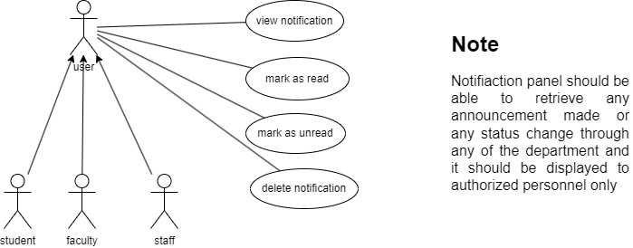

# Notifications Module Documentation

## Table of Contents
- [User-Centered Design (UCD)](#user-centered-design-ucd)
- [SRS Application](#srs-application)
- [SRS Web Interface](#srs-web-interface)
- [API Specifications](#api-specifications)
- [UI for Application](#ui-for-application)
- [UI for Web](#ui-for-web)
- [Database Schema](#database-schema)

## User-Centered Design (UCD)

## SRS Application

FUSION ERP
Software requirement specification 

OS-3 
NOTIFICATION(APP) 

**Team Details** 

**T.A Pradhyumn (21BCS219) Prateek Pratap Singh(21BCS162) Sahil Gautam(21BCS182)**

**Arjit Patel(Student Mentor)** 

**Dr. NEELAM DAYAL (FACULTY MENTOR)** 

1. INTRODUCTION 
1. INTRODUCTION ABOUT THE FUSION – A BRIEF DESCRIPTION 

FusionIIIT exemplifies the seamless integration and automation of diverse functions at PDPM Indian Institute of Information Technology, Design and Manufacturing, Jabalpur. This student-driven initiative, meticulously crafted using Python 3.8 and powered by the Django Web framework, aims to enhance the operational landscape of the institute. From streamlining administration management to fostering academic excellence and handling miscellaneous departmental tasks, FusionIIIT serves as a comprehensive solution that aligns with the intricacies of campus life. 

Picture it as a digital wizard that oversees every aspect, from organizing administrative affairs to facilitating smoother academic processes. Its reach extends beyond the conventional tasks, actively engaging with various departments and sections to ensure the seamless functioning of every facet of campus life. 

On the administrative front, FusionIIIT efficiently manages complex paperwork and processes, lifting the burden from staff members. In the realm of academics, it introduces a digital touch, simplifying learning and course management. However, its role transcends these boundaries; FusionIIIT emerges as a friendly companion for every corner of the campus, diligently overseeing and optimizing operations. 

In essence, FusionIIIT is not merely a tool; it embodies a supportive ally, contributing to a more organized and enjoyable life at PDPM IIITDM Jabalpur for everyone involved. 

2. PURPOSE OF THE MODULE 

The Notification Management module facilitates a user-friendly interface for efficient handling of notifications within the app. Users can seamlessly receive, read, mark as unread, and delete notifications, enhancing control and convenience. The module aims to optimize resource utilization, ensuring operational efficiency and user satisfaction in managing communication within the application.

3. SCOPE OF THE MODULE 

The Notification Management module facilitates efficient handling of notifications within the app, enabling users to receive, read, mark as unread, and delete notifications. It focuses on optimizing user control, providing administrators with tools for effective system management. The scope includes enhancing user experience, resource optimization, and maintaining operational efficiency in communication.

2. USER/ACTOR CHARACTERISTICS  

2\.1 STUDENT / FACULTY / STAFF : 

` `Role: Can generate a notification relevant to the particular module.

` `SPECIFIC FUNCTIONALITIES :   

1\.The user can open the module by clicking on the module name present in the notification while viewing it. 

2\.The user can click on mark as read on a new notification. 

3\.The user can click on mark as unread on a already marked as read notification. 4.The user can delete a notification.

3. FUNCTIONAL REQUIREMENTS  
1. USE CASE DIAGRAM  

2. USE CASE DESCRIPTION  

This section describes each use case Description in the use case diagram in all details.

1\.     

|**UC ID** |UC#1 ||
| - | - | :- |
|**Use case Name** |view notification ||
|**Description** |The " View Notification " use case allows the User to view notifications about their activity from different modules through the Fusion portal. ||
|**Actor** |User (Student/Faculty/Staff) ||
|**Preconditio n** |The User is logged in into the portal and has minimum 1 notification. ||
|**Main Flow** |1 |The User navigates to the “Notifications” section in the dashboard. |

2  Thnoentifi ctahteiounsers. gets displayed the list of their 

3  The User selects a notification to view. 

The User can now read the content of that 

4  notification and can see from which module it 

came from 

**Post**  If that particular notification was new it no longer **conditions**   remains new because it is been read by the user. **Sub Flow**  NIL 

**Global**  GA If a technical error occurs during the execution **Alternate**  1  of any action (e.g., database failure, server **Flow**  issues), the system displays an error message 

and logs the incident. 

2\.

<table><tr><th colspan="1"><b>UC ID</b> </th><th colspan="2">UC#2 </th></tr>
<tr><td colspan="1"><b>Use case Name</b> </td><td colspan="2" valign="top">mark as read </td></tr>
<tr><td colspan="1" valign="top"><b>Description</b> </td><td colspan="2">The "Mark as Read" use case allows the User to mark a new notification as read if they wish not </td></tr>
<tr><td colspan="1"><b>Actor</b> </td><td colspan="2">User (Student/Faculty/Staff) </td></tr>
<tr><td colspan="1"><b>Preconditio n</b> </td><td colspan="2">The User is logged in into the portal and has minimum 1 notification. </td></tr>
<tr><td colspan="1" rowspan="3" valign="top"><b>Main Flow</b> </td><td colspan="1">1 </td><td colspan="1">The User navigates to the “Notifications” section in the dashboard. </td></tr>
<tr><td colspan="1">2 </td><td colspan="1">Then the user gets displayed the list of their notifications. </td></tr>
<tr><td colspan="1">3 </td><td colspan="1">The User selects a notification to view. </td></tr>
</table>

||4 |The User can now read the content of that notification and can see from which module it came from |
| :- | - | :- |
|**Post conditions**  |If that particular notification was new it no longer remains new because it is been read by the user. ||
|**Alternate Flow** |The user cancels the mark as read action. ||
|**Sub Flow** |NIL ||
|**Global Alternate Flow** |GA 1 |If a technical error occurs during the execution of any action (e.g., database failure, server issues), the system displays an error message and logs the incident. |

3\. 

<table><tr><th colspan="1"><b>UC ID</b> </th><th colspan="2">UC#3 </th></tr>
<tr><td colspan="1"><b>Use case Name</b> </td><td colspan="2" valign="top">mark as unread </td></tr>
<tr><td colspan="1" valign="top"><b>Description</b> </td><td colspan="2">The "Mark as Unread" use case allows the User to mark an already read notification as unread if they wish not to have that notification as read through the Fusion portal. </td></tr>
<tr><td colspan="1"><b>Actor</b> </td><td colspan="2">User (Student/Faculty/Staff) </td></tr>
<tr><td colspan="1"><b>Preconditio n</b> </td><td colspan="2">The User is logged in into the portal and has minimum 1 notification. </td></tr>
<tr><td colspan="1" rowspan="2" valign="top"><b>Main Flow</b> </td><td colspan="1">1 </td><td colspan="1">The User navigates to the “Notifications” section in the dashboard. </td></tr>
<tr><td colspan="1">2 </td><td colspan="1">Then the user gets displayed the list of their notifications. </td></tr>
</table>

3  The User selects a notification to view. 

The User can now read the content of that 

4  notification and can see from which module it 

came from 

**Post**  That particular already marked as read notification **conditions**   now becomes new.

**Alternate**  The user cancels the mark as unread action. 

**Flow** 

**Sub Flow**  NIL 

**Global**  GA If a technical error occurs during the execution **Alternate**  1  of any action (e.g., database failure, server **Flow**  issues), the system displays an error message 

and logs the incident. 

4\. 

<table><tr><th colspan="1"><b>UC ID</b> </th><th colspan="2">UC#4 </th></tr>
<tr><td colspan="1"><b>Use case Name</b> </td><td colspan="2" valign="top">Delete notification </td></tr>
<tr><td colspan="1" valign="top"><b>Description</b> </td><td colspan="2">The "Delete Notification" use case allows the User to delete a notification from the notifications they get displayed through the Fusion portal. </td></tr>
<tr><td colspan="1"><b>Actor</b> </td><td colspan="2">User (Student/Faculty/Staff) </td></tr>
<tr><td colspan="1"><b>Preconditio n</b> </td><td colspan="2">The User is logged in into the portal and has minimum 1 notification. </td></tr>
<tr><td colspan="1" rowspan="3" valign="top"><b>Main Flow</b> </td><td colspan="1">1 </td><td colspan="1">The User navigates to the “Notifications” section in the dashboard. </td></tr>
<tr><td colspan="1">2 </td><td colspan="1">Then the user gets displayed the list of their notifications. </td></tr>
<tr><td colspan="1">3 </td><td colspan="1">The User selects a notification to view. </td></tr>
</table>

||4 |The User can now read the content of that notification and can see from which module it came from |
| :- | - | :- |
|**Post conditions**  |That particular notification now gets deleted and longer displayed to the User.||
|**Alternate Flow** |The user cancels the delete action . ||
|**Sub Flow** |NIL ||
|**Global Alternate Flow** |GA 1 |If a technical error occurs during the execution of any action (e.g., database failure, server issues), the system displays an error message and logs the incident. |

3. OTHER FUNCTIONAL REQUIREMENTS  
- Notification Integration: 
- All modules will utilize the Notification module for issuing notifications and alerts to relevant stakeholders. This includes raising concerns about grades or any other pertinent issues. 
- Notification Generation and Visibility: 
- Each module must facilitate the creation and visibility of notifications for respective users. 
- Critical Inventory Alerts: 
- The system will generate alerts for critical inventory levels and other crucial updates. 
4. OTHER CONSTRAINTS  
1. User Interfaces

` `The user interface should comply with the color scheming and dashboard design of the FUSIONIIIT. Users should be able to navigate from one functionality to other. Inter module navigation should be smooth. All the functionalities should be easy to use and no specific training should be required for the usage of the module. 

2. Tech Stack Used 
   1) Backend: Django(Python Based Web-Framework). 
   1) Frontend: Flutter(Dart Based framework) 
2. Business rules : Acad-Admin will take care of verified results and will look after any screwing patterns in gradings.

   4. NON- FUNCTIONAL REQUIREMENTS  
1. **PERFORMANCE:** 
- Swift response to user interactions is imperative. The notification module should exhibit low response times for generating notifications and managing read/unread statuses. 
2. **SCALABILITY:** 
- The notification module should efficiently handle a significant number of concurrent users. Scalability testing should be conducted under varying load conditions to ensure optimal performance. 
3. **AVAILABILITY:** 
- The notification module is expected to maintain a high level of availability, targeting a 99.9% uptime. Users should experience minimal downtime for seamless access. 
5. MODULE DEPENDENCIES WITH OTHER FUSION MODULES 
1. **UI LEVEL**  

`    `Integration in Fusion 

At the UI level, the Notification Module seamlessly integrates with other modules, maintaining a consistent theme across the Fusion platform. Upon signing into the Fusion portal, users will find a notification bar in the dashboard, offering the following functionalities: 

2. **DB LEVEL DEPENDENCIES:** 
- Mark as read 
- Mark as unread 
- Description of the notification and the module name. Clicking the module name redirects to that specific module. 
- Every module will share the notifications schema with the notifications module. 
3. **MODULE LEVEL DEPENDENCIES :** 
1. In the file tracking module, upon sending a notification, the sender will receive an acknowledgment notification confirming that the file has been sent successfully. Simultaneously, the recipient will be notified that the file has been received.** 
1. The doctor appointment form within the health center module is not working, while the ambulance request function is operational, and ambulance requests are directed to the compounder. After submitting feedback, it is unclear who receives the notifications. 
1. Notifications are not functioning in the visitors hostel module due to its incomplete functionality. The form details are not being transmitted to the caretaker responsible for the visitors' hostel. 
1. Within the gymkhana module, all notifications are operational, except for the club membership form, where the selection of the club is not functioning, rendering it inactive. The co-convener can send voting poll notifications to specific batches, event notifications to all batches, and session notifications to all batches within the gymkhana module. 
1. In the research procedures module, the patent form is not working, so it is currently non-functional in generating notifications. Similarly, within the other academic procedures module, both the leave module and assistant - claimship module forms have notification functions defined, but they are not working. These are currently not active for generating notifications. 
6. In the complaint system module, once a student submits a complaint, a notification will be forwarded to the designated caretaker assigned to handle that specific complaint. 
6. Within the mess module, notifications will be accessible upon submission of feedback, requests for changes in the mess menu, and leave or vacation requests from the staff. Additionally, when a student is added to the mess committee, they will receive a notification informing them of their new role. 
6. In the Department module the publication of an announcement by the department head, notifications will be sent to both the department's students and the head of the department. These notifications will be accessible in the announcements section. 

## SRS Web Interface

**Software Requirements** 

**Specification**

**OS-3 NOTIFICATIONS (WEB)**

` `**Team Details**

**Dr.Neelam Dayal** (**Faculty Mentor**)

Shaik Nida Afsheen (21BCS189)

Pateel Rishitha Reddy (21BCS155)

Vandana Manoj Kumar (21BCS130)

Rongali Kishan Koushal (21BCS179) Sudhanshu Patil(21BCS209) (**Student** **Mentor)**

**1. Introduction**

1. **Introduction about the Fusion** 

Fusion IIIT stands as a testament to the seamless integration and automation of diverse functions within IIIITDM JABALPUR Crafted with precision using Python 3.8 and powered by the Django Web framework, this initiative is a student-driven endeavor designed to elevate the institute's operational landscape. Encompassing everything from ecient administration management to academic prowess and miscellaneous departmental tasks, Fusion IIIT is a holistic solution that harmonizes the intricacies of campus life.

Imagine it as a digital wizard that takes care of everything, from organizing the administrative stu to making academics smoother. It's not just limited to the usual tasks Fusion IIIT jumps into various departments and sections, making sure every corner of campus life runs smoothly. In the admin side, it handles the complicated paperwork and processes. For academics, it brings a digital touch, making learning and managing courses easier. But it doesn't stop there, Fusion IIIT is like a friendly companion for all the dierent parts of the campus, making sure everything works well.

In simpler terms, Fusion IIIT is not just a tool – it's a helpful friend, making life at PDPM IIITDM Jabalpur more organized and enjoyable for everyone.

2. **Purpose of the module**

Enhance user engagement by delivering timely and relevant information through notifications.

Facilitate communication by updating users on events, messages, and interactions within the Django project.

Provide feedback to users, confirming successful actions and alerting them to errors.

3. **Scope of the module** 

Notify the User about relevant events, such as interactions with their content and updates from others students and faculty.

For every module there will be dierent type of notifications according to the unique needs and activities associated with each individual module.

**2.User/Actor Description(characteristics):**

**2.1 Students/Faculty/Sta:**

**Role:** Can generate a notification relevant to the particular module.

**Specific Functionalities:**

1\.The user can open the module by clicking on the module name present in the notification while viewing it.

2\.The user can click on mark as read on a new notification. 3.The user can click on mark as unread on a already marked as read notification. 4.The user can delete a notification.

3. **Functional Requirements**
1. **Use Case Diagram**

2. **Use case Description**

This section describes each use case Description in the use case diagram in all details. 

**1)**

<table><tr><th colspan="1"><b>UC ID</b></th><th colspan="2">UC#1</th></tr>
<tr><td colspan="1"><b>Use case Name</b></td><td colspan="2"><b>view notification</b></td></tr>
<tr><td colspan="1" valign="top"><b>Description</b></td><td colspan="2">The "</b> View Notification " use case allows the User to view notifications about their activity from dierent modules through the Fusion portal.</td></tr>
<tr><td colspan="1"><b>Actor</b></td><td colspan="2">User (Student/Faculty/Sta)</td></tr>
<tr><td colspan="1" valign="top"><b>Precondition</b></td><td colspan="2" valign="top">` `The User is logged in into the portal and has minimum 1 notification.</td></tr>
<tr><td colspan="1" rowspan="2" valign="top"><b>Main Flow</b></td><td colspan="1" valign="top">M1</td><td colspan="1" valign="top">The User navigates to the “Notifications” section in the dashboard.</td></tr>
<tr><td colspan="1" valign="top">M2</td><td colspan="1" valign="top">Then the user gets displayed the list of their notifications.</td></tr>
<tr><td colspan="1"></td><td colspan="1" valign="top">M3</td><td colspan="1" valign="top">The User selects a notification to view.</td></tr>
<tr><td colspan="1"></td><td colspan="1" valign="top">M4</td><td colspan="1">The User can now read the content of that notification and can see from which module it came from[A1].</td></tr>
</table>

|**Alternate Flow**|4|If the user clicks on the module name in the notification, they should be redirected to that particular module from which the notification came from.||
| - | - | :- | :- |
|**Sub Flow**|NIL|||
|**Global Alternate Flow**|GA1||If a technical error occurs during the execution of any action (e.g., database failure, server issues), the system displays an error message and logs the incident.|

**2)**

<table><tr><th colspan="1"><b>UC ID</b></th><th colspan="2">UC#2</th></tr>
<tr><td colspan="1"><b>Use case Name</b></td><td colspan="2"><b>mark as read</b></td></tr>
<tr><td colspan="1" valign="top"><b>Description</b></td><td colspan="2">` `The "Mark as Read" use case allows the User to mark a new notification as read if they wish not to have that notification as new through the Fusion portal.</td></tr>
<tr><td colspan="1"><b>Actor</b></td><td colspan="2">User (Student/Faculty/Sta)</td></tr>
<tr><td colspan="1" valign="top"><b>Precondition</b></td><td colspan="2" valign="top">` `The User is logged in into the portal and has minimum 1 new notification. </td></tr>
<tr><td colspan="1" rowspan="2" valign="top"><b>Main Flow</b></td><td colspan="1" valign="top">1</td><td colspan="1" valign="top">The User navigates to the “Notifications” section in the dashboard.</td></tr>
<tr><td colspan="1" valign="top">2</td><td colspan="1" valign="top">Then the user gets displayed the list of their notifications.</td></tr>
<tr><td colspan="1"></td><td colspan="1" valign="top">3</td><td colspan="1" valign="top">The User hovers over a new notification to mark as read.</td></tr>
<tr><td colspan="1"></td><td colspan="1" valign="top">4</td><td colspan="1" valign="top">The User marks the notification as read from the options when the notification is hovered. [A1]</td></tr>
</table>

|**Post conditions** |That particular new notification no longer remains new as is marked as read|||
| - | :- | :- | :- |
|**Alternate Flow**|A1|4|The user cancels the mark as read action.|
|**Sub Flow**|NIL|||
|**Global Alternate Flow**|GA1|If a technical error occurs during the execution of any action (e.g., database failure, server issues), the system displays an error message and logs the incident.||

**3)**

<table><tr><th colspan="1"><b>UC ID</b></th><th colspan="2">UC#3</th></tr>
<tr><td colspan="1"><b>Use case Name</b></td><td colspan="2"><b>mark as unread</b></td></tr>
<tr><td colspan="1" valign="top"><b>Description</b></td><td colspan="2">The "Mark as Unread" use case allows the User to mark an already read notification as unread if they wish not to have that notification as read through the Fusion portal.</td></tr>
<tr><td colspan="1"><b>Actor</b></td><td colspan="2">User (Student/Faculty/Sta)</td></tr>
<tr><td colspan="1" valign="top"><b>Precondition</b></td><td colspan="2">The User is logged in into the portal and has minimum 1 already marked as read notification.</td></tr>
<tr><td colspan="1" rowspan="2" valign="top"><b>Main Flow</b></td><td colspan="1" valign="top">1</td><td colspan="1">The User navigates to the “Notifications” section in the dashboard.</td></tr>
<tr><td colspan="1" valign="top">2</td><td colspan="1">Then the user gets displayed the list of their notifications.</td></tr>
<tr><td colspan="1"></td><td colspan="1" valign="top">3</td><td colspan="1">The User hovers over an already marked as read notification to mark as unread. </td></tr>
<tr><td colspan="1"></td><td colspan="1" valign="top">4</td><td colspan="1">The User marks the notification as unread from the options when the notification is hovered. [A1]</td></tr>
</table>

|**Post conditions** |That particular already marked as read notification now becomes new.|||
| - | :- | :- | :- |
|**Alternate Flow**|A1|4|The user cancels the mark as unread action.|
|**Sub Flow**|NIL|||
|**Global Alternate Flow**|GA1|If a technical error occurs during the execution of any action (e.g., database failure, server issues), the system displays an error message and logs the incident.||

**4)**

<table><tr><th colspan="1"><b>UC ID</b></th><th colspan="2">UC#4</th></tr>
<tr><td colspan="1"><b>Use case Name</b></td><td colspan="2"><b>delete notification</b></td></tr>
<tr><td colspan="1" valign="top"><b>Description</b></td><td colspan="2">The "Delete Notification" use case allows the User to delete a notification from the notifications they get displayed through the Fusion portal.</td></tr>
<tr><td colspan="1"><b>Actor</b></td><td colspan="2">User (Student/Faculty/Sta)</td></tr>
<tr><td colspan="1" valign="top"><b>Precondition</b></td><td colspan="2">The User is logged in into the portal and has minimum 1 notification.</td></tr>
<tr><td colspan="1" rowspan="4" valign="top"><b>Main Flow</b></td><td colspan="1" valign="top">1</td><td colspan="1">The User navigates to the “Notifications” section in the dashboard.</td></tr>
<tr><td colspan="1" valign="top">2</td><td colspan="1">Then the user gets displayed the list of their notifications.</td></tr>
<tr><td colspan="1">3</td><td colspan="1">The User hovers over a notification to delete. </td></tr>
<tr><td colspan="1" valign="top">4</td><td colspan="1">The User deletes the notification from the options when the notification is hovered. [A1]</td></tr>
</table>

|**Post conditions** |That particular notification now gets deleted and longer displayed to the User.|||
| - | :- | :- | :- |
|**Alternate Flow**|A1|1|The user cancels the delete action.|
|**Sub Flow**|NIL|||
|**Global Alternate Flow**|GA1|If a technical error occurs during the execution of any action (e.g., database failure, server issues), the system displays an error message and logs the incident.||

**3.3. Other Functional Requirements** 

1) All  the  modules  will  make  use  of  the  **Notification  module**  for  sending notifications and alerts to various actors involved in the module.
1) A module  typically  should  allow  the  generation  of  notifications  and  their visibility for the relevant users.
1) A module should implement the block of code of the notifications module to send the notifications of that specific module smoothly.
4. **Other constraints**
1. **User Interfaces**

The user interface should comply with the color scheming and dashboard design of the  FUSIONIIIT. Users  should  be  able  to  navigate  from  one  functionality  to  other. Inter module navigation should be smooth. All the functionalities should be easy to 

use and no specific training should be required for the usage of the module.

2. **Tech Stack Used**
1) Backend: Django (Python Based Web-Framework).
1) Frontend:( HTML, CSS, JavaScript).
4. **Non- Functional Requirements**
1. **Performance:**

The  system  should  respond  to  user  interactions  quickly.  Response  time  for Generating notification, Marking as read and unread should be less.

2. **Scalability:**

The system should handle a mass of concurrent users. System performance should be evaluated under increasing load conditions.

3. **Availability:**

The system should be available 99.9% of the time.

4. **Security:**

Ensure  data  confidentiality  and  integrity.  Role-based  authorization  ensures  that users can only perform actions relevant to their designated roles.

5. **Module dependencies with other fusion modules**
1. **UI Level**

**Integration in Fusion :-**      

At UI level, Notification Module will seamlessly integrates with other modules to send their respective notifications.

After the user sign in into the fusion portal in the dashboard there will be a notification bar, the following functionalities will be available:

- Mark as read
- Mark as unread
- Delete Notification
- Description of the notification and the module name by clicking the module name it will be redirected to that particular module. 
2. **DB Level Dependencies:**
   1. All the modules will be able to see the information of the notification which is stored in the database. 
   1. Every module will share the Notification schema with the notifications module.
3. **Module Level Dependencies:**
1. In the **file tracking module**, upon sending a notification, the sender will receive an acknowledgment notification confirming that the file has been sent successfully. Simultaneously, the recipient will be notified that the file hasbeenreceived.
1. The doctor appointment form within the **health center module** is not working, while the ambulance request function is operational, and ambulance requests are directed to the compounder. After submitting feedback, it is unclear who receives thenotifications.
1. Notifications are not functioning in the **visitors hostel module** due to its incomplete functionality. The form details are not being transmitted to the 

   caretaker responsible for the visitors'hostel.

4. Within the **gymkhana module,** all notifications are operational, except for the club membership form, where the selection of the club is not functioning, rendering it inactive. . The co-convener can send voting poll notifications to specific batches, event notifications to all batches, and session notifications to all batches within the gymkhanamodule.
4. In the **research procedures module**, the patent form is not working, so it is currently non-functional in generating notifications. Similarly, within the other academic procedures module, both the **leave module** and **assistant - claimship module** forms have notification functions defined, but they are not working. These are currently not active for generatingnotifications.
4. In the **complaint system module**, once a student submits a complaint, a notification will be forwarded to the designated caretaker assigned to handle that specificcomplaint.
4. Within the **mess module**, notifications will be accessible upon submission of feedback, requests for changes in the mess menu, and leave or vacation requests from the sta. Additionally, when a student is added to the mess committee, they will receive a notification informing them oftheirnewrole.
4. In **Department module** the publication of an announcement by the department head, notifications will be sent to both the department's students and the head of the department. These notifications will be accessible in the announcementssection.

## API Specifications
Module Name-OS3\_NOTIFICATIONS\_WEB Student Mentor – SUDHANSHU PATIL (21BCS209) 

**API used in the module**  

There are no actual APIs implemented here in this module. 

Notifications are dispatched by invoking functions within the views of the notification module from various modules. Each module triggers the function by passing the necessary parameters, resulting in the delivery of the corresponding message. The URLs have been hard coded and requests are being rendered 

**Overview of the module:-**  

Notify the User about relevant events, such as interactions with their content and updates from others students and faculty. For every module there will be different type of notifications according to the unique needs and activities associated with each individual module. 

- View notification 
- Delete notification 
- Make announcement 
- Mark as read 
- Mark as unread 
1. In the **file tracking module**, upon sending a notification, the sender will receive an acknowledgment notification confirming that the file has been sent successfully. Simultaneously, the recipient will be notified that the file has been received. 

*def* file\_tracking\_notif(*sender*, *recipient*,*title*):     url='filetracking:inward'

`    `module='File Tracking'

`    `*sender* = *sender*

`    `*recipient* = *recipient*

`    `verb = *title*

`    `notify.send(*sender*=*sender*, *recipient*=*recipient*, *url*=url, *module*=module, *verb*=verb) 

This notification takes sender id and recipient id and title as parameters and 

   sends a notification using the notify.send function. The notification content is determined based on the type parameter, and it includes information about the sender, recipient, URL, and module.The above function was invoked within the file tracking module file, and it forwarded the arguments that the function needs to utilize in order to dispatch the notification. 

file\_tracking\_notif(*request*.user,receiver\_id,subject)

`                `messages.success(*request*,'File sent successfully') 

2. The doctor appointment form within the **health center module** is not working, while the ambulance request function is operational, and ambulance requests are directed to the compounder. After submitting feedback, it is unclear who receives 

   the notifications. Following the argument passage, the function sends a specific message corresponding to the provided type. 

   *def* healthcare\_center\_notif(*sender*, *recipient*, *type*): 

   `    `url='healthcenter:healthcenter'

   `    `module='Healthcare Center'

   `    `*sender* = *sender*

   `    `*recipient* = *recipient*

   `    `verb = '' 

   `    `if *type* == 'appoint': 

   `        `verb = "Your Appointment has been booked"

   `    `if *type* == 'amb\_request': 

   `        `verb = "Your Ambulance request has been placed"

   `    `if *type* == 'Presc': 

   `        `verb = "You have been prescribed some medicine"

   `    `if *type* == 'appoint\_req': 

   `        `verb = "You have a new appointment request"

   `    `if *type* == 'amb\_req': 

   `        `verb = "You have a new ambulance request"

   ` `notify.send(*sender*=*sender*, *recipient*=*recipient*, *url*=url, *module*=module, *verb*=verb) 

3. Notifications are not functioning in the **Visitors hostel module** due to its incomplete functionality. The form details are not being transmitted to the caretaker responsible for the visitors' hostel.  

*def* visitors\_hostel\_notif(*sender*, *recipient*, *type*): 

`    `url='visitorhostel:visitorhostel'

`    `module="Visitor's Hostel"

`    `*sender* = *sender*

`    `*recipient* = *recipient*

`    `verb = '' 

`    `if *type* =='booking\_confirmation': 

`        `verb='Your booking has been confirmed '

`    `elif *type* =='booking\_cancellation\_request\_accepted': 

`        `verb='Your Booking Cancellation Request has been accepted '     elif *type* =='booking\_request': 

`        `verb='New Booking Request '

`    `elif *type* =='cancellation\_request\_placed': 

`        `verb='New Booking Cancellation Request '

`    `elif *type* =='booking\_forwarded': 

`        `verb='New Forwarded Booking Request '

`    `elif *type* =='booking\_rejected': 

`        `verb='Your Booking Request has been rejected '

`    `notify.send(*sender*=*sender*, *recipient*=*recipient*, *url*=url, *module*=module, *verb*=verb) 

visitors\_hostel\_notif(*request*.user, bd.intender, 'booking\_confirmation') 

`        `return HttpResponseRedirect('/visitorhostel/')     else: 

`        `return HttpResponseRedirect('/visitorhostel/') 

4. Within the **Gymkhana module**, all notifications are operational, except for the club membership form, where the selection of the club is not functioning, rendering it inactive. The co-convener can send voting poll notifications to specific batches, event notifications to all batches, and session notifications to all batches within the gymkhana module. 

   The notifications mentioned earlier can be directed to either an individual or a group, such as the entire batch of 2021.** 

   **GYMKHANA\_VOTING** 

`  `*def* gymkhana\_voting(*sender*, *recipient*, *type*, *title*, *desc*):     url = 'gymkhana:gymkhana'

`    `module = 'Gymkhana Module'

`    `*sender* = *sender*

`    `*recipient* = *recipient*

`    `*title* = *title*

`    `*desc* = *desc* 

`    `verb = "" 

`    `if *type* == 'voting\_open': 

`        `verb = "Voting is open for {}".format(*title*) 

`    `notify.send(*sender*=*sender*, 

`                `*recipient*=*recipient*, 

`                `*url*=url,

`                `*module*=module,

`                `*verb*=verb,

`                `*description*=*desc* 

`                `) 

**GYMKHANA\_SESSION** 

`     `*def* gymkhana\_session(*sender*, *recipient*, *type*, *club*, *desc*, *venue*):     url = 'gymkhana:gymkhana'

`    `module = 'Gymkhana Module'

`    `sender = sender

`    `recipient = recipient

`    `desc = desc 

`    `verb = "" 

`    `if type == 'new\_session': 

`       `verb = "A session by {} Club will be organised in {}".format(club, venue)

`    `notify.send(*sender*=sender,

`                `*recipient*=recipient,                 *url*=url,

`                `*module*=module,

`                `*verb*=verb,

`                `*description*=desc 

`                `) 

**GYMKHANA\_SESSION** 

*def* gymkhana\_event(*sender*, *recipient*, *type*, *club*, *event\_name*, *desc*, *venue*): 

`    `url = 'gymkhana:gymkhana'

`    `module = 'Gymkhana Module'

`    `*sender* = *sender*

`    `*recipient* = *recipient*

`    `*desc* = *desc* 

`    `verb = "" 

`   `if type == 'new\_event': 

`   `verb = "{} event by {} Club will be organised in{}".format(event\_name,club,venue)

`    `notify.send(*sender*=sender,

`                `*recipient*=recipient,                 *url*=url,

`                `*module*=module,

`                `*verb*=verb,

`                `*description*=desc 

`    `) 

5. In the **research procedures module**, the patent form is not working, so it is currently non-functional in generating notifications. Similarly, within the other academic procedures module, both the leave module and assistant claimship module forms have notification functions defined, but they are not working. These are currently not active for generating notifications 
5. In the **complaint system module**, once a student submits a complaint, a notification will be forwarded to the designated caretaker assigned to handle that 

   specific complaint. 

7. Within the **mess module**, notifications will be accessible upon submission of feedback, requests for changes in the mess menu, and leave or vacation requests from the staff. Additionally, when a student is added to the mess committee, they will receive a notification informing them of their new role.  
7. In **Department module** the publication of an announcement by the department head, notifications will be sent to both the department's students and the head of the department. These notifications will be accessible in the announcements section. 

**mark-as-read-and-redirect/()/**  this URL marks a notification as read and redirects the user based on the notification's data.  

urlpatterns = [ 

`        `pattern(*r*'^mark-as-read-and-redirect/(?P<slug>\d+)/$', views.mark\_as\_read\_and\_redirect, *name*='mark\_as\_read\_and\_redirect'),     ] + urlpatterns

The above URL uses make use of  the mark\_as\_read\_and\_redirect function 

If the notification is related to the "Complaint System" module, it redirects the user to a specific URL with additional parameters. Otherwise, it redirects the user to a general URL provided in the notification's data. 

*def* mark\_as\_read\_and\_redirect(*request*, *slug*=None): 

`    `notification\_id = slug2id(*slug*) 

`    `notification = get\_object\_or\_404( 

`        `Notification, *recipient*=*request*.user, *id*=notification\_id)

`    `notification.mark\_as\_read()

`    `if(notification.data['module'] == 'Complaint System'):      

`        `complaint\_id=notification.description

`        `return HttpResponseRedirect(reverse(notification.data['url'],*kwargs*={'detailcomp\_id1 ':complaint\_id}))

`    `else: 

`        `return HttpResponseRedirect(reverse(notification.data['url'])) 

**Current problems you are facing with the module or in its use cases —** 

- **View notification**: Determining the recipient's credentials is proving challenging, making it somewhat difficult to verify the successful delivery of notifications. 
- **delete notification**: This Use Case is not currently implemented 

  https://docs.google.com/document/d/1RmU9u\_wzTndrFj0oJnj58qF9fVSRyhOK/edit? usp=sharing&ouid=102720302826588816157&rtpof=true&sd=true 

## UI for Application

**Figma Profiles for [OS-3 NOTIFICATIONS (app)]**

1. **Module Description:**

The Notifications module facilitates a user-friendly interface for efficient handling of notifications within the app. Users can seamlessly receive, read, mark as unread, and delete notifications, enhancing control and convenience. The module aims to optimize resource utilization, ensuring operational efficiency and user satisfaction in managing communication within the application.

The Notification Management module facilitates efficient handling of notifications within the app, enabling users to receive, read, mark as unread, and delete notifications. It focuses on optimizing user control, providing administrators with tools for effective system management.

[https://drive.google.com/file/d/1LcCwG6rTUEKbruLxq4OzkeAAVK6IGD0j/view?usp= drive_link](https://drive.google.com/file/d/1LcCwG6rTUEKbruLxq4OzkeAAVK6IGD0j/view?usp=drive_link)

2. **Actors**

**2.1 USER (**Student/Faculty/Staff**)** Specific Functionalities:

1\.The user can open the module by clicking on the module name present in the notification while viewing it.

2\.The user can click on mark as read on a new notification.

3\.The user can click on mark as unread on a already marked as read notification. 4.The user can delete a notification.

**FIGMA PROFILE:**

[https://www.figma.com/proto/JmOdqFmLNSzdOCPauKpp8c/FUSION-IIIT?type=design&nod e-id=0-1&t=0HSXxgtOrpVjKxZs-0&scaling=min-zoom&page-id=0%3A1&starting-point-node-i d=4%3A37](https://www.figma.com/proto/JmOdqFmLNSzdOCPauKpp8c/FUSION-IIIT?type=design&node-id=0-1&t=0HSXxgtOrpVjKxZs-0&scaling=min-zoom&page-id=0%3A1&starting-point-node-id=4%3A37)

## UI for Web

**Figma Profiles for [Module Name]**

1. **Module Description:**

Notify the User about relevant events, such as interactions with their content and updates from others students and faculty. For every module there will be different type of notifications according to the unique needs and activities associated with each individual module.

- View notification
- Delete notification
- View announcement
- Mark as read
- Mark as unread Link to SRS:

[https://drive.google.com/file/d/1tfBk8F1_bgLN68eDFhznlMFbS5u1owCB/view?usp=s haring](https://drive.google.com/file/d/1tfBk8F1_bgLN68eDFhznlMFbS5u1owCB/view?usp=sharing)

2. **Actors**

**2.1 Students/Faculty/Staff**:

1\.The user can open the module by clicking on the module name present in the notification while viewing it.

2\.The user can click on mark as read on a new notification.

3\.The user can click on mark as unread on a already marked as read notification. 4.The user can delete a notification.

Link to Figma profile:

[https://www.figma.com/file/rZyApozI8fI0VjJx09ovrJ/14941?type=design&node-id=0%3A 1&mode=design&t=J0lt6rtlqLul0xsU-1](https://www.figma.com/file/rZyApozI8fI0VjJx09ovrJ/14941?type=design&node-id=0%3A1&mode=design&t=J0lt6rtlqLul0xsU-1)

**Figma Profile Design Guidelines and Additional Considerations**

1. **Cross-Platform Compatibility:**
- All the Figma designs and features are compatible across both web and app versions.
2. **Dimension Standardization:**
- All Figma designs have the same dimensions: 1920 x 1080 for web **Actor-oriented Use Case-Based Design:**
- Strictly base all Figma designs on use cases of actors and maintain consistency with previous and newly added designs.

## Database Schema

**Module Name - OS3** – **web \_notifications Faculty Mentor – Dr. Neelam Dayal**

**Student Mentor – Sudhanshu Patil(21bcs209)**

**Database Documentation of [** OS3 – web notifications**] 4.0**

**Overview of the Module:**

Notify the User about relevant events, such as interactions with their content and updates from others students and faculty. For every module there will be different type of notifications according to the unique needs and activities associated with each individual module.

- View notification
- Delete notification
- Make announcement
- Mark as read
- Mark as unread

**SRS: [https://drive.google.com/file/d/1tfBk8F1_bgLN68eDFhznlMFbS5u1owCB/view?usp=s haring](https://drive.google.com/file/d/1tfBk8F1_bgLN68eDFhznlMFbS5u1owCB/view?usp=sharing)**

1. **ER Diagram (to be created using draw.io): [ER Diagram**](https://drive.google.com/file/d/1TYsMXQbP7nvFQ0lj9dBwEdmPlpmIS-YD/view?usp=sharing)**
1. **Database Schema Info (in the Google sheet): [Database Schema**](https://docs.google.com/spreadsheets/d/17lIl4pC3DOH7_vfMSTPSIP5UptSBacl6/edit?usp=sharing&ouid=102720302826588816157&rtpof=true&sd=true)**
1. **Changes required in the currently implemented Tables:-**

1\. notifications\_notification

- No changes
4. **Data Availability for API and Functional Testing D.1 Mention the tables that are already populated**
- Id
- level
- unread
- verb
- timestamp
- public
- action\_object\_id
- recipient\_id
- deleted
- emailed
- data
- actor\_content\_type\_id

**D.2 Mention the tables required to be populated**

- description
- target\_content\_type\_id

**D.3 Mention any difficulties faced by your team regarding populating any table (if any)**

- It is difficult to understand the purpose of the attributes as there are multiple attributes which nearly have the same meaning and it will create a confusion to see the format of data in the database

