# Authentication Module Documentation

## Table of Contents
- [User-Centered Design (UCD)](#user-centered-design-ucd)
- [SRS Application](#srs-application)
- [SRS Web Interface](#srs-web-interface)
- [API Specifications](#api-specifications)
- [UI for Application](#ui-for-application)
- [UI for Web](#ui-for-web)
- [Database Schema](#database-schema)

## User-Centered Design (UCD)

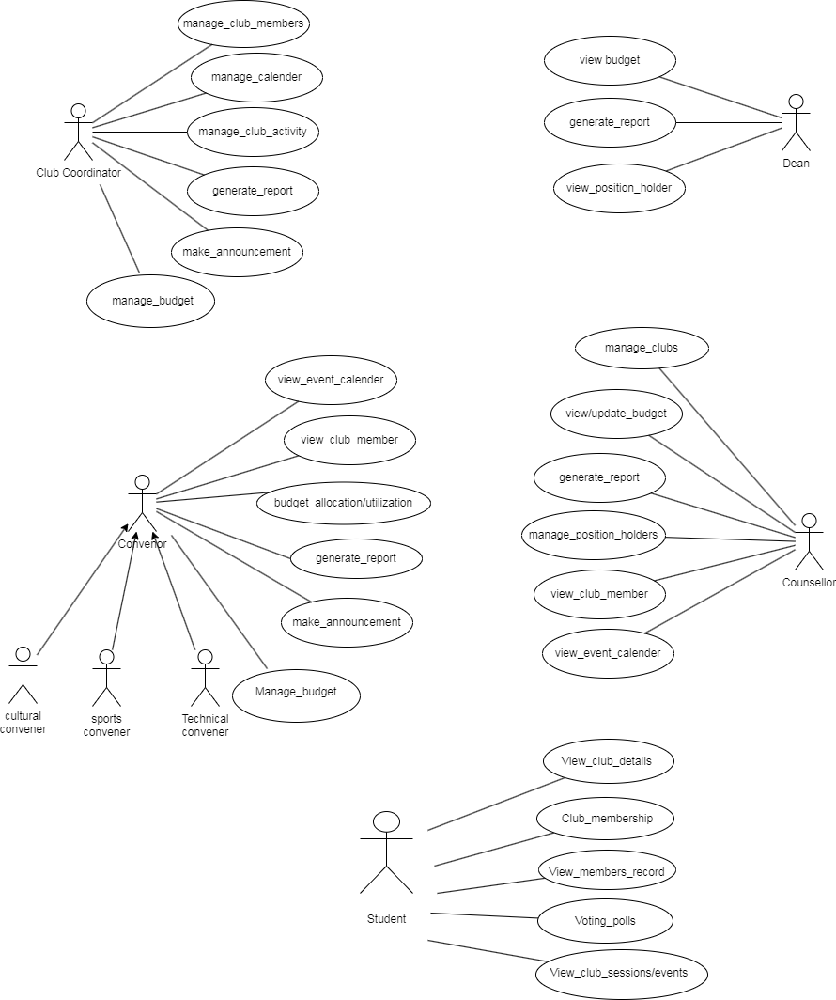

## SRS Application
**Prepared by:**

**Student Mentor : Hardik Sharma 21bcs092**

**Team Members:**

1. **Anushri Thakre 21bcs029**
1. **Bhawna Chilwal 21bcs057**
1. **Suyash Suman 21bcs217**
1. **Suman Kumar 21bcs214**
1. **Govind Kumar 21bcs088**
1. **Introduction**
1. **Introduction about the Fusion – A brief Description**

FusionIIIT, a testament to seamless integration and automation at PDPM Indian Institute of Information Technology, Design and Manufacturing, Jabalpur, embodies precision through Python 3.8 and the Django Web framework. Initiated and driven by students, this endeavor aims to elevate the institute's operational landscape comprehensively. From streamlining administration management to enhancing academic excellence and addressing miscellaneous departmental tasks, FusionIIIT is a holistic solution that seamlessly harmonizes the intricacies of campus life.

Picture it as a digital wizard overseeing everything, from organizing administrative tasks to facilitating smoother academic processes. Its scope extends beyond the conventional, diving into various departments and sections to ensure every facet of campus life runs seamlessly. On the administrative side, FusionIIIT efficiently manages complex paperwork and processes. In academics, it introduces a digital touch, simplifying learning and course management. But it goes beyond these realms; FusionIIIT serves as a friendly companion to all corners of the campus, ensuring optimal functionality.

In essence, FusionIIIT is more than just a tool; it's a helpful companion, making life at PDPM IIITDM Jabalpur organized and enjoyable for everyone.

2. **Purpose of the module:**

The purpose of the document is to gather and analyze and give an in-depth insight of the complete Student Gymkhana System of IIITDM Jabalpur. It will define the users and functionality of the Software.

Also, we shall predict and sort out how we hope this product will be used in order to gain a better understanding of the Software, outline concepts that may be developed later, and document ideas that are being considered, but may be discarded as the product develops. This document describes the project's target audience and its user interface, hardware and software requirements. It defines how our client, team and audience see the product and its functionality. Nonetheless, it helps any designer and developer to assist in Software Development Lifecycle (SDLC) processes.

3. **Scope of the module**

The Software System Gymkhana which is available as a Online Web Services Portal and as a mobile application to make various events and activities of Gymkhana easier with various tools. Accessing the information and performing certain activities will be easy using the Software. Software will facilitate various Gymkhana Activities and Administration.

2. **User/Actor characteristics**
1. **Dean**:

It play a vital role in representing and advocating for student interests, fostering a vibrant campus culture. They serve as a key liaison between students and the administration, contributing to the dynamic and inclusive nature of the campus community.

**Role:** The Student Dean takes on responsibilities such as reviewing budgets, generating reports, and overseeing position holders. Their multifaceted role involves financial oversight, administrative reporting, and ensuring the effective functioning of key leadership positions within the organization.

**Specific Functionality**

1. View Budget
1. Generate Report
1. View Position Holder·
2. **Counsellor:**

· As a Gymkhana counselor, the role involves not only providing emotional support but also actively managing clubs, updating budgets, generating

reports, and overseeing administrative functions, contributing to the holistic well-being and organizational efficiency within the campus community.

**Role:**

As a Gymkhana counselor, the multifaceted role includes tasks such as viewing

and updating budgets, managing clubs, generating reports, overseeing position holders, viewing club members, and maintaining the event calendar. This dynamic function contributes to both the emotional well-being of students and the efficient operation of various activities within the organization.

**Specific Functionalities:**

1. Manage Clubs
1. View/Update budget
1. Generate Report
1. Manage Position Holder
1. View Club member
1. View event calendar
3. **Convenor:**

As a Gymkhana club convenor in cultural, sports, or technical domains, the role involves orchestrating and managing respective club activities, fostering participation, and ensuring the successful execution of events to enhance the diverse and dynamic extracurricular landscape of the institution.

**Role:**

As the convenor in cultural, sports, or technical domains within Gymkhana, the role encompasses tasks such as managing event calendars, overseeing club memberships, allocating budgets, generating reports, and making announcements. This multifaceted responsibility involves ensuring the smooth

operation and success of various club activities, maintaining financial transparency, and fostering effective communication within the club and the broader organization.

**Specific Functionalities:**

1. View Event Calender
1. View Club member

   3. Budget Allocation
1. Generate Report

   3. Make Announcements
4. **Club Coordinator (Student):**

Represent a person who is accountable for managing different activities like managing club members, calenders, generating reports etc.

**Role:**The club coordinator oversees and coordinates the activities of the club, ensuring smooth operation, effective communication, and alignment with organizational goals.

**Specific Functionalities:**

1. Manage Club Members
1. Manage club calenders
1. Manage club activity
1. Generate Report
1. Make announcements

**3. Functional Requirements**

1. **Use Case Diagram**

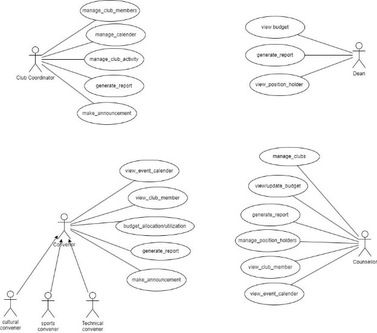

2. **Use case Description**

|UC ID|UC#1|
| - | - |
|Use case Name|View\_budget|

<table><tr><th colspan="1" valign="top">Description</th><th colspan="3" valign="bottom">The "View Budget" use case allows the Dean of the college hostel to review, approve, reject, edit, cancel, and view_budget for the visitor hostel through the Fusion portal.</th></tr>
<tr><td colspan="1" valign="top">Actor</td><td colspan="3" valign="top">Dean</td></tr>
<tr><td colspan="1" valign="top">Precondition</td><td colspan="3" valign="top">The dean is logged in into the system.</td></tr>
<tr><td colspan="1" rowspan="4" valign="top">Main Flow</td><td colspan="1" valign="top">1</td><td colspan="2" valign="top">The Dean navigates to the "View_budget" section.</td></tr>
<tr><td colspan="1" valign="top">2</td><td colspan="2" valign="top">The system displays the list of Budget with its respective information.</td></tr>
<tr><td colspan="1" valign="top">3</td><td colspan="2" valign="top">The Dean selects a Budget to review. [A1][A2]</td></tr>
<tr><td colspan="1" valign="top">4</td><td colspan="2" valign="top">The Dean views the respective Budget. [A3][A4]</td></tr>
<tr><td colspan="1" valign="top">Post conditions</td><td colspan="3" valign="top">The Budget information is viewed by the Dean.</td></tr>
<tr><td colspan="1" rowspan="2" valign="top">Alternate Flow</td><td colspan="1" rowspan="2" valign="top">A1</td><td colspan="1" valign="top">1</td><td colspan="1" valign="top">The request is pending. The dean selects the View_Budget action.</td></tr>
<tr><td colspan="1" valign="top">2</td><td colspan="1" valign="top">The system updates the Budget status to "Approved" and the same is reflected to the Intender.</td></tr>
<tr><td colspan="1" valign="top">Sub Flow</td><td colspan="3" valign="top">NIL</td></tr>
</table>

|Global Alternat e Flow|G A 1|If a technical error occurs during the execution of any action (e.g., database failure, server issues), the system displays an error message and logs the incident.|
| :-: | - | :-: |

<table><tr><th colspan="1" valign="top">UC ID</th><th colspan="2" valign="top">UC#2</th></tr>
<tr><td colspan="1" valign="top">Use case Name</td><td colspan="2" valign="top">View_position_holder</td></tr>
<tr><td colspan="1" valign="top">Description</td><td colspan="2" valign="bottom">The "View Position Holder'' allows the Dean to access and review information related to position holders associated with the College Management System. Position holders may include individuals or entities responsible for specific roles or responsibilities within the hostel's operations.</td></tr>
<tr><td colspan="1" valign="top">Actor</td><td colspan="2" valign="top">Dean</td></tr>
<tr><td colspan="1" valign="top">Precondition</td><td colspan="2" valign="top">The Dean must be logged into the System with valid credentials.</td></tr>
<tr><td colspan="1" rowspan="3" valign="top">Main Flow</td><td colspan="1" valign="top">1</td><td colspan="1" valign="top">The Caretaker navigates to the "view_position_holder" section.</td></tr>
<tr><td colspan="1" valign="top">2</td><td colspan="1" valign="top">The system displays the list of position_holders with its respective status.</td></tr>
<tr><td colspan="1" valign="top">3</td><td colspan="1" valign="top">The Dean selects a Position_holder to review. [A1][A2]</td></tr>
</table>

<table><tr><th colspan="1"></th><th colspan="1" valign="top">4</th><th colspan="2"></th></tr>
<tr><td colspan="1" valign="top">Post conditions</td><td colspan="3" valign="top">The Position_holder section is reviewed by Dean.</td></tr>
<tr><td colspan="1" valign="top">Alternate Flow</td><td colspan="1" valign="top">A1</td><td colspan="1" valign="top">1</td><td colspan="1" valign="bottom">If there are errors or issues during the retrieval of position holder information, the system displays appropriate error messages, and the Dean may take corrective actions or seek technical support.</td></tr>
<tr><td colspan="1" valign="top">Sub Flow</td><td colspan="3" valign="top">NIL</td></tr>
<tr><td colspan="1" rowspan="2" valign="top">Global Alternate Flow</td><td colspan="1" valign="top">GA1</td><td colspan="2" valign="top">The system displays a notification to users, including the Dean, informing them about the temporary unavailability of position holder information</td></tr>
<tr><td colspan="1" valign="top">GA2</td><td colspan="2" valign="top">If a technical error occurs during the execution of any action (e.g., database failure, server issues), the system displays an error message and logs the incident.</td></tr>
</table>

|UC ID|UC#3|
| - | - |
|Use case Name|Generate\_report|

![ref1]

<table><tr><th colspan="1" valign="top">Description</th><th colspan="3" valign="bottom">The "Generate Report" enables the actors to create comprehensive reports related to his work. This functionality empowers the actors to obtain details insights of the associated Management. The generated reports serve as valuable tools for strategic decision-making, financial planning, and performance analysis.</th></tr>
<tr><td colspan="1" valign="top">Actor</td><td colspan="3" valign="top">Dean ,Club-Corodinator , Convenor, Counsellor</td></tr>
<tr><td colspan="1" valign="top">Precondition</td><td colspan="3" valign="top">The actor is logged in into the system.</td></tr>
<tr><td colspan="1" rowspan="4" valign="top">Main Flow</td><td colspan="1" valign="top">1</td><td colspan="2" valign="top">The Actor navigates to the "Report" section.</td></tr>
<tr><td colspan="1" valign="top">2</td><td colspan="2" valign="top">The system displays the query to generate reports.</td></tr>
<tr><td colspan="1" valign="top">3</td><td colspan="2" valign="top">The actors press the generate button for report generation. [A1][A2]</td></tr>
<tr><td colspan="1" valign="top">4</td><td colspan="2" valign="top">The actor views the generated report. [A3][A4]</td></tr>
<tr><td colspan="1" valign="top">Post conditions</td><td colspan="3" valign="top">The generated report is viewed by actors.</td></tr>
<tr><td colspan="1" rowspan="2" valign="top">Alternate Flow</td><td colspan="1" rowspan="2" valign="top">A1</td><td colspan="1" valign="top">1</td><td colspan="1" valign="top">The request is pending. The Actor selects the "generate" action.</td></tr>
<tr><td colspan="1" valign="top">2</td><td colspan="1" valign="top">The system generate the reports .</td></tr>
<tr><td colspan="1" valign="top">Sub Flow</td><td colspan="3" valign="top">NIL</td></tr>
</table>

<table><tr><th colspan="1" rowspan="2" valign="top">Global Alternate Flow</th><th colspan="1" valign="top">GA1</th><th colspan="1" valign="top">The system displays a notification to users, including the Dean, informing them about the temporary unavailability of report generation services.</th></tr>
<tr><td colspan="1" valign="top">GA2</td><td colspan="1" valign="bottom">If a technical error occurs during the execution of any action (e.g., database failure, server issues), the system displays an error message and logs the incident.</td></tr>
</table>

<table><tr><th colspan="1" valign="top">UC ID</th><th colspan="2" valign="top">UC#4</th></tr>
<tr><td colspan="1" valign="top">Use case Name</td><td colspan="2" valign="top">View_position_holder</td></tr>
<tr><td colspan="1" valign="top">Description</td><td colspan="2" valign="bottom">The "View Position Holder'' allows the Dean to access and review information related to position holders associated with the College Management System. Position holders may include individuals or entities responsible for specific roles or responsibilities within the hostel's operations.</td></tr>
<tr><td colspan="1" valign="top">Actor</td><td colspan="2" valign="top">Dean</td></tr>
<tr><td colspan="1" valign="top">Precondition</td><td colspan="2" valign="top">The Dean must be logged into the System with valid credentials.</td></tr>
<tr><td colspan="1" rowspan="2" valign="top">Main Flow</td><td colspan="1" valign="top">1</td><td colspan="1" valign="top">The Caretaker navigates to the "view_position_holder" section.</td></tr>
<tr><td colspan="1" valign="top">2</td><td colspan="1" valign="top">The system displays the list of position_holders with its respective status.</td></tr>
</table>

<table><tr><th colspan="1" rowspan="2"></th><th colspan="1" valign="top">3</th><th colspan="2" valign="top">The Dean selects a Position_holder to review. [A1][A2]</th></tr>
<tr><td colspan="1" valign="top">4</td><td colspan="2"></td></tr>
<tr><td colspan="1" valign="top">Post conditions</td><td colspan="3" valign="top">The Position_holder section is reviewed by Dean.</td></tr>
<tr><td colspan="1" valign="top">Alternate Flow</td><td colspan="1" valign="top">A1</td><td colspan="1" valign="top">1</td><td colspan="1" valign="bottom">If there are errors or issues during the retrieval of position holder information, the system displays appropriate error messages, and the Dean may take corrective actions or seek technical support.</td></tr>
<tr><td colspan="1" valign="top">Sub Flow</td><td colspan="3" valign="top">NIL</td></tr>
<tr><td colspan="1" rowspan="2" valign="top">Global Alternate Flow</td><td colspan="1" valign="top">GA1</td><td colspan="2" valign="top">The system displays a notification to users, including the Dean, informing them about the temporary unavailability of position holder information</td></tr>
<tr><td colspan="1" valign="top">GA2</td><td colspan="2" valign="top">If a technical error occurs during the execution of any action (e.g., database failure, server issues), the system displays an error message and logs the incident.</td></tr>
</table>

|UC ID|UC#05|
| - | - |
|Use case Name|Manage\_Clubs|
|Description|This use case is used to navigate to different clubs so counsellor can manage positions, view and update budget and generate reports.|

<table><tr><th colspan="1" valign="top">Actor</th><th colspan="3" valign="top">Counsellor</th></tr>
<tr><td colspan="1" valign="top">Precondition</td><td colspan="3" valign="top">Counsellor must be logged into the system with valid credentials.</td></tr>
<tr><td colspan="1" rowspan="2" valign="top">Main Flow</td><td colspan="1" valign="top">1</td><td colspan="2" valign="top">Navigate to different clubs and manage club members.</td></tr>
<tr><td colspan="1" valign="top">2</td><td colspan="2" valign="top">Generate report.</td></tr>
<tr><td colspan="1" valign="top">Post conditions</td><td colspan="3" valign="top">The updated booking information is reflected in the database.</td></tr>
<tr><td colspan="1" rowspan="2" valign="top">Alternate Flow</td><td colspan="1" valign="top">A1</td><td colspan="1" valign="top">1</td><td colspan="1" valign="top">Counsellor cancels the operation of club activity in some special conditions.</td></tr>
<tr><td colspan="1" valign="top">A2</td><td colspan="1" valign="top">1</td><td colspan="1" valign="top">If the participation in the activities are not good then counsellor can take appropriate decisions.</td></tr>
</table>

|UC ID|UC#06|
| - | - |
|Use case Name|View\_Update\_Budget|

<table><tr><th colspan="1" valign="top">Description</th><th colspan="3" valign="bottom">In this use case, the actor, who plays the role of a counselor, interacts with a system to view and update budget information. The counselor is responsible for managing and maintaining budgetary details, ensuring that financial resources are allocated appropriately.</th></tr>
<tr><td colspan="1" valign="top">Actor</td><td colspan="3" valign="top">Counsellor</td></tr>
<tr><td colspan="1" valign="top">Precondition</td><td colspan="3" valign="top">Counsellor must be logged into the system with valid credentials.</td></tr>
<tr><td colspan="1" rowspan="3" valign="top">Main Flow</td><td colspan="1" valign="top">1</td><td colspan="2" valign="top">After successful login, the counselor navigates to the budget module.</td></tr>
<tr><td colspan="1" valign="top">2</td><td colspan="2" valign="top">The system retrieves and displays the current budget details including income, expenses, and available funds.</td></tr>
<tr><td colspan="1" valign="top">3</td><td colspan="2" valign="top">The system presents a form or interface allowing the counselor to make changes.</td></tr>
<tr><td colspan="1"></td><td colspan="1" valign="top">4</td><td colspan="2" valign="top">After updating the budget, the counselor confirms the changes and saves the updated budget information.</td></tr>
<tr><td colspan="1" valign="top">Post conditions</td><td colspan="3" valign="top">The counselor's changes are reflected in the budget details and database for future reference.</td></tr>
<tr><td colspan="1" rowspan="2" valign="top">Alternate Flow</td><td colspan="1" valign="top">A1</td><td colspan="1" valign="top">1</td><td colspan="1" valign="top">At any point during the update process, the counselor may choose to cancel the changes.</td></tr>
<tr><td colspan="1" valign="top">A2</td><td colspan="1" valign="top">1</td><td colspan="1" valign="top">if the system identifies errors or inconsistencies in the entered data, it notifies the counselor and prompts them to correct the issues before saving.</td></tr>
</table>

<table><tr><th colspan="1" valign="top">UC ID</th><th colspan="2" valign="top">UC#7</th></tr>
<tr><td colspan="1" valign="top">Use case Name</td><td colspan="2" valign="top">Manage_positions</td></tr>
<tr><td colspan="1" valign="top">Description</td><td colspan="2" valign="bottom">Counselor manage positions related to various roles or responsibilities within the organization's gymkhana activities. Positions may include roles such as club presidents, event coordinators, or other leadership roles associated with extracurricular and sports activities.</td></tr>
<tr><td colspan="1" valign="top">Actor</td><td colspan="2" valign="top">Counselor</td></tr>
<tr><td colspan="1" valign="top">Precondition</td><td colspan="2" valign="top">Counselor must be logged into the system with valid credentials.</td></tr>
<tr><td colspan="1" rowspan="3" valign="top">Main Flow</td><td colspan="1" valign="top">1</td><td colspan="1" valign="top">After successful login, the counselor navigates to the gymkhana module within the system.</td></tr>
<tr><td colspan="1" valign="top">2</td><td colspan="1" valign="top">The system presents a list of existing positions or allows the counselor to create a new position and edit / modify positions.</td></tr>
<tr><td colspan="1" valign="top">3</td><td colspan="1" valign="top">The counselor has the option to create a new position by providing details such as title, description,</td></tr>
<tr><td colspan="1"></td><td colspan="1" valign="top">4</td><td colspan="1" valign="top">The counselor confirms and saves the changes.</td></tr>
<tr><td colspan="1" valign="top">Post conditions</td><td colspan="2" valign="top">The positions within the gymkhana module are updated based on the counselor's actions.</td></tr>
</table>

<table><tr><th colspan="1" rowspan="2" valign="top">Alternate Flow</th><th colspan="1" valign="top">A1</th><th colspan="1" valign="top">1</th><th colspan="1" valign="bottom">If the counselor provides invalid or incomplete details while creating or editing a position, the system should notify them and prompt for correction.</th></tr>
<tr><td colspan="1" valign="top">A2</td><td colspan="1" valign="top">1</td><td colspan="1" valign="top">At any point during the position management process, the counselor may choose to cancel the changes. The system should revert to the previous state, discarding any modifications made during the current session. So the system stores previous records.</td></tr>
</table>

<table><tr><th colspan="1" valign="bottom">UC ID</th><th colspan="2" valign="bottom">UC#8</th></tr>
<tr><td colspan="1" valign="bottom">Use case Name</td><td colspan="2" valign="top">View_club_members</td></tr>
<tr><td colspan="1" valign="top">Description</td><td colspan="2" valign="bottom">The actor, interacts with the gymkhana module to view information about club members associated with various extracurricular clubs within the organization.</td></tr>
<tr><td colspan="1" valign="bottom">Actor</td><td colspan="2" valign="bottom">Counsellor</td></tr>
<tr><td colspan="1" valign="bottom">Preconditio n</td><td colspan="2" valign="top">Counsellor must be logged into the system with valid credentials.</td></tr>
<tr><td colspan="1" rowspan="3" valign="top">Main Flow</td><td colspan="1" valign="bottom">1</td><td colspan="1" valign="bottom">The counsellor selects the option to view club members.</td></tr>
<tr><td colspan="1" valign="top">2</td><td colspan="1" valign="bottom">The system presents a list of clubs or allows the counsellor to search for a specific club.</td></tr>
<tr><td colspan="1" valign="top">3</td><td colspan="1" valign="bottom">The counselor has the option to apply filters or sorting parameters to refine the list based on specific criteria.</td></tr>
<tr><td colspan="1"></td><td colspan="1" valign="bottom">4</td><td colspan="1" valign="bottom">The counselor confirms and saves the changes.</td></tr>
<tr><td colspan="1" valign="bottom">Post conditions</td><td colspan="2" valign="bottom">The positions within the gymkhana module are updated based on the counselor's actions.</td></tr>
</table>

|Alternate Flow|A1|1|If there is error parsing the server or database, it should show error.|
| :- | - | - | :- |

<table><tr><th colspan="1" valign="top">UC ID</th><th colspan="2" valign="top">UC#9</th><th colspan="1"></th></tr>
<tr><td colspan="1" valign="top">Use case Name</td><td colspan="2" valign="top">View_Event_Calender</td><td colspan="1"></td></tr>
<tr><td colspan="1" valign="top">Description</td><td colspan="2" valign="bottom">The "View Event Calendar" use case allows the Convenor to access and review the calendar of events .This functionality allows Convenor to stay informed about scheduled activities, meetings, facilitating effective coordination and planning.</td><td colspan="1"></td></tr>
<tr><td colspan="1" valign="top">Actor</td><td colspan="2" valign="top">Convenor</td><td colspan="1"></td></tr>
<tr><td colspan="1" valign="top">Precondition</td><td colspan="2" valign="top">The Dean is logged in into the system.</td><td colspan="1"></td></tr>
<tr><td colspan="1" rowspan="2" valign="top">Main Flow</td><td colspan="1" valign="top">1</td><td colspan="1" valign="top">Navigates to the Event Calendar Section.</td><td colspan="1"></td></tr>
<tr><td colspan="1" valign="top">2</td><td colspan="1" valign="top">Views Existing Calendar Events.</td><td colspan="1"></td></tr>
</table>

<table><tr><th colspan="1" rowspan="2"></th><th colspan="1" valign="top">3</th><th colspan="2" valign="top">Communicates with Committee Members.</th><th colspan="1"></th></tr>
<tr><td colspan="1" valign="top">4</td><td colspan="2" valign="top">Plans and Prepares for Meetings:.</td><td colspan="1"></td></tr>
<tr><td colspan="1" valign="top">Post conditions</td><td colspan="3" valign="top">The Convenor has a clear understanding of the scheduled events within the committee or organizational group.</td><td colspan="1"></td></tr>
<tr><td colspan="1" rowspan="4" valign="top">Alternate Flow</td><td colspan="1" rowspan="4"></td><td colspan="1" valign="top">1</td><td colspan="1" valign="bottom">If there are errors or issues during the event calendar viewing process the system displays appropriate error messages.</td><td colspan="1"></td></tr>
<tr><td colspan="1" valign="top">2</td><td colspan="1" valign="top">The Convenor may take corrective actions or seek technical support.</td><td colspan="1"></td></tr>
<tr><td colspan="1" valign="top">1</td><td colspan="1" valign="top">The Convenor selects the "Cancel Event" option.</td></tr>
<tr><td colspan="1" valign="top">2</td><td colspan="1" valign="bottom">The system prompts the Convenor to confirm the cancellation and provide a reason for cancellation..</td></tr>
<tr><td colspan="1" valign="top">Sub Flow</td><td colspan="3" valign="top">NIL</td></tr>
<tr><td colspan="1" rowspan="2" valign="top">Global Alternate Flow</td><td colspan="1" valign="top">GA1</td><td colspan="2" valign="bottom">The system displays a notification to users, including the Convenor, informing them about the temporary unavailability of the event calendar..</td></tr>
<tr><td colspan="1" valign="top">GA2</td><td colspan="2" valign="bottom">Users are advised to retry accessing the event calendar after a specified time or are directed to a dedicated system status page for updates.</td></tr>
</table>

|UC ID|UC#12||
| - | - | :- |

<table><tr><th colspan="1" valign="top">Use case Name</th><th colspan="3" valign="top">View_Club_Member</th><th colspan="1"></th></tr>
<tr><td colspan="1" valign="top">Description</td><td colspan="3" valign="bottom">The "View Club Members" use case enables the Convenor to access and review the list of members associated with a specific club or committee. Convenor can use this feature to stay informed about the club's membership, roles.</td><td colspan="1"></td></tr>
<tr><td colspan="1" valign="top">Actor</td><td colspan="3" valign="top">Convenor</td><td colspan="1"></td></tr>
<tr><td colspan="1" valign="top">Precondition</td><td colspan="3" valign="top">The Convenor is logged in into the system.</td><td colspan="1"></td></tr>
<tr><td colspan="1" rowspan="4" valign="top">Main Flow</td><td colspan="1" valign="top">1</td><td colspan="2" valign="top">Navigates to the Club Management Section</td><td colspan="1"></td></tr>
<tr><td colspan="1" valign="top">2</td><td colspan="2" valign="top">Views Existing Club Members.</td><td colspan="1"></td></tr>
<tr><td colspan="1" valign="top">3</td><td colspan="2" valign="top">Reviews Member Details.</td><td colspan="1"></td></tr>
<tr><td colspan="1" valign="top">4</td><td colspan="2" valign="top">Coordinates Club Activities.</td><td colspan="1"></td></tr>
<tr><td colspan="1" valign="top">Post conditions</td><td colspan="3" valign="bottom">The Convenor has gained insights into the composition and roles of club members, facilitating effective coordination and planning for club activities.</td><td colspan="1"></td></tr>
<tr><td colspan="1" rowspan="2" valign="top">Alternate Flow</td><td colspan="1" rowspan="2"></td><td colspan="1" valign="top">1</td><td colspan="1" valign="bottom">If there are errors or issues during the event calendar viewing process the system displays appropriate error messages.</td><td colspan="1"></td></tr>
<tr><td colspan="1" valign="top">2</td><td colspan="1" valign="top">The Convenor may take corrective actions or seek technical support.</td><td colspan="1"></td></tr>
</table>
1  The Convenor selects the "Cancel Event" option.![ref2]
1  The system prompts the Convenor to confirm the cancellation and provide a reason for cancellation..

Sub Flow NIL

Global GA1 The system displays a notification to users, including the Alternate Flow Convenor, informing them about the temporary

unavailability of the view club member.

GA2 Users are advised to retry accessing the view club

member after a specified time or are directed to a dedicated system status page for updates.

|UC ID|UC#13||
| - | - | :- |
|Use case Name|Budget Allocation/Utilization||
|Description|The "Budget Allocation" use case enables the Convenor to allocate funds and resources to various aspects of a specific club. This functionality is for effective financial management and strategic planning, allowing the Convenor to distribute resources based on the club's priorities, goals, and planned activities.||
|Actor|Convenor||
|Precondition|The Convenor is logged in into the system.||

<table><tr><th colspan="1" rowspan="4" valign="top">Main Flow</th><th colspan="1" valign="top">1</th><th colspan="2" valign="top">Navigates to the Budget Management Section</th><th colspan="1"></th></tr>
<tr><td colspan="1" valign="top">2</td><td colspan="2" valign="top">Views Existing Budget Details.</td><td colspan="1"></td></tr>
<tr><td colspan="1" valign="top">3</td><td colspan="2" valign="top">Allocates Funds to Budget Categories.</td><td colspan="1"></td></tr>
<tr><td colspan="1" valign="top">4</td><td colspan="2" valign="top">Verifies Allocation.</td><td colspan="1"></td></tr>
<tr><td colspan="1" valign="top">Post conditions</td><td colspan="3" valign="top">The budget is successfully allocated, and the system reflects the updated budget details.</td><td colspan="1"></td></tr>
<tr><td colspan="1" rowspan="4" valign="top">Alternate Flow</td><td colspan="1" rowspan="4"></td><td colspan="1" valign="top">1</td><td colspan="1" valign="bottom">If there are errors or issues during the budget allocation process ,the system displays appropriate error messages.</td><td colspan="1"></td></tr>
<tr><td colspan="1" valign="top">2</td><td colspan="1" valign="top">The Convenor may take corrective actions or seek technical support.</td><td colspan="1"></td></tr>
<tr><td colspan="1" valign="top">1</td><td colspan="1" valign="bottom">The Convenor selects the "Cancel Budget Allocation" option.</td></tr>
<tr><td colspan="1" valign="top">2</td><td colspan="1" valign="bottom">The system prompts the Convenor to confirm the cancellation and provide a reason for cancellation..</td></tr>
<tr><td colspan="1" valign="top">Sub Flow</td><td colspan="3" valign="top">NIL</td></tr>
<tr><td colspan="1" rowspan="2" valign="top">Global Alternate Flow</td><td colspan="1" valign="top">GA1</td><td colspan="2" valign="bottom">The system displays a notification to users, including the Convenor, informing them about the temporary unavailability of the budget allocation option.</td></tr>
<tr><td colspan="1" valign="top">GA2</td><td colspan="2" valign="bottom">Users are advised to retry accessing the budget allocation option after a specified time or are directed to a dedicated system status page for updates.</td></tr>
</table>

<table><tr><th colspan="1" valign="bottom">UC ID</th><th colspan="3" valign="bottom">UC#15</th></tr>
<tr><td colspan="1" valign="bottom">Use case Name</td><td colspan="3" valign="top">Make Announcement</td></tr>
<tr><td colspan="1" valign="top">Description</td><td colspan="3" valign="bottom">It involves accessing the "Make Announcement" feature, providing a form to compose and publish announcements to club members, and allowing the Convenor to either cancel the announcement creation or attach files related to the announcement.</td></tr>
<tr><td colspan="1" valign="bottom">Actor</td><td colspan="3" valign="bottom">Convenor</td></tr>
<tr><td colspan="1" valign="top">Precondition</td><td colspan="3" valign="bottom">Convenor must be logged into the system with valid credentials.</td></tr>
<tr><td colspan="1" rowspan="2" valign="top">Main Flow</td><td colspan="1" valign="bottom">1</td><td colspan="2" valign="bottom">Convenor accesses the "Make Announcement" feature.</td></tr>
<tr><td colspan="1" valign="top">2</td><td colspan="2" valign="bottom">System provides a form to compose and publish announcements to other club members and actors.</td></tr>
<tr><td colspan="1">Post conditions</td><td colspan="3">The updated booking information is reflected in the database.</td></tr>
<tr><td colspan="1" rowspan="2" valign="top">Global Alternate Flow</td><td colspan="1" rowspan="2" valign="top">A1</td><td colspan="1" valign="bottom">1</td><td colspan="1" valign="bottom">Convenor cancels the announcement creation.</td></tr>
<tr><td colspan="1" valign="top">2</td><td colspan="1" valign="bottom">Convenor attaches files or media to the announcement.</td></tr>
</table>

d;ajkfadk;

|UC ID|UC#16||
| - | - | :- |
|Use case Name|View\_Event\_Calender||

<table><tr><th colspan="1" valign="top">Description</th><th colspan="3" valign="bottom">The "View Event Calendar" use case allows the Counsellor to access and review the calendar of events .This functionality allows Counsellor to stay informed about scheduled activities, meetings, facilitating effective coordination and planning.</th><th colspan="1"></th></tr>
<tr><td colspan="1" valign="top">Actor</td><td colspan="3" valign="top">Counsellor</td><td colspan="1"></td></tr>
<tr><td colspan="1" valign="top">Precondition</td><td colspan="3" valign="top">The Dean is logged in into the system.</td><td colspan="1"></td></tr>
<tr><td colspan="1" rowspan="4" valign="top">Main Flow</td><td colspan="1" valign="top">1</td><td colspan="2" valign="top">Navigates to the Event Calendar Section.</td><td colspan="1"></td></tr>
<tr><td colspan="1" valign="top">2</td><td colspan="2" valign="top">Views Existing Calendar Events.</td><td colspan="1"></td></tr>
<tr><td colspan="1" valign="top">3</td><td colspan="2" valign="top">Communicates with Committee Members.</td><td colspan="1"></td></tr>
<tr><td colspan="1" valign="top">4</td><td colspan="2" valign="top">Plans and Prepares for Meetings:.</td><td colspan="1"></td></tr>
<tr><td colspan="1" valign="top">Post conditions</td><td colspan="3" valign="top">The Counsellor has a clear understanding of the scheduled events within the committee or organizational group.</td><td colspan="1"></td></tr>
<tr><td colspan="1" rowspan="4" valign="top">Alternate Flow</td><td colspan="1" rowspan="4"></td><td colspan="1" valign="top">1</td><td colspan="1" valign="bottom">If there are errors or issues during the event calendar viewing process the system displays appropriate error messages.</td><td colspan="1"></td></tr>
<tr><td colspan="1" valign="top">2</td><td colspan="1" valign="top">The Counsellor may take corrective actions or seek technical support.</td><td colspan="1"></td></tr>
<tr><td colspan="1" valign="top">1</td><td colspan="1" valign="top">The Counsellor selects the "Cancel Event" option.</td></tr>
<tr><td colspan="1" valign="top">2</td><td colspan="1" valign="bottom">The system prompts the Counsellor to confirm the cancellation and provide a reason for cancellation..</td></tr>
</table>

<table><tr><th colspan="1" valign="top">Sub Flow</th><th colspan="2" valign="top">NIL</th></tr>
<tr><td colspan="1" rowspan="2" valign="top">Global Alternate Flow</td><td colspan="1" valign="top">GA1</td><td colspan="1" valign="bottom">The system displays a notification to users, including the Counsellor, informing them about the temporary unavailability of the event calendar..</td></tr>
<tr><td colspan="1" valign="top">GA2</td><td colspan="1" valign="bottom">Users are advised to retry accessing the event calendar after a specified time or are directed to a dedicated system status page for updates.</td></tr>
</table>

<table><tr><th colspan="1" valign="top">UC ID</th><th colspan="2" valign="top">UC#5</th></tr>
<tr><td colspan="1" valign="top">Use case Name</td><td colspan="2" valign="top">View_budget</td></tr>
<tr><td colspan="1" valign="top">Description</td><td colspan="2" valign="bottom">The "View Budget" use case allows the Dean of the college hostel to review, approve, reject, edit, cancel, and view_budget for the visitor hostel through the Fusion portal.</td></tr>
<tr><td colspan="1" valign="top">Actor</td><td colspan="2" valign="top">Dean</td></tr>
<tr><td colspan="1" valign="top">Precondition</td><td colspan="2" valign="top">The dean is logged in into the system.</td></tr>
<tr><td colspan="1" rowspan="3" valign="top">Main Flow</td><td colspan="1" valign="top">1</td><td colspan="1" valign="top">The Dean navigates to the "View_budget" section.</td></tr>
<tr><td colspan="1" valign="top">2</td><td colspan="1" valign="top">The system displays the list of Budget with its respective information.</td></tr>
<tr><td colspan="1" valign="top">3</td><td colspan="1" valign="top">The Dean selects a Budget to review. [A1][A2]</td></tr>
</table>

<table><tr><th colspan="1"></th><th colspan="1" valign="top">4</th><th colspan="2" valign="top">The Dean views the respective Budget. [A3][A4]</th></tr>
<tr><td colspan="1" valign="top">Post conditions</td><td colspan="3" valign="top">The Budget information is viewed by the Dean.</td></tr>
<tr><td colspan="1" rowspan="2" valign="top">Alternate Flow</td><td colspan="1" rowspan="2" valign="top">A1</td><td colspan="1" valign="top">1</td><td colspan="1" valign="top">The request is pending. The dean selects the View_Budget action.</td></tr>
<tr><td colspan="1" valign="top">2</td><td colspan="1" valign="top">The system updates the Budget status to "Approved" and the same is reflected to the Intender.</td></tr>
<tr><td colspan="1" valign="top">Sub Flow</td><td colspan="3" valign="top">NIL</td></tr>
</table>

|Global Alternat e Flow|G A 1|If a technical error occurs during the execution of any action (e.g., database failure, server issues), the system displays an error message and logs the incident.|
| :-: | - | :-: |

|UC ID|UC#6|
| - | - |
|Use case Name|Generate\_report|

![ref1]

<table><tr><th colspan="1" valign="top">Description</th><th colspan="3" valign="bottom">The "Generate Report" enables the actors to create comprehensive reports related to his work. This functionality empowers the actors to obtain details insights of the associated Management. The generated reports serve as valuable tools for strategic decision-making, financial planning, and performance analysis.</th></tr>
<tr><td colspan="1" valign="top">Actor</td><td colspan="3" valign="top">Dean ,Club-Corodinator , Convenor, Counsellor</td></tr>
<tr><td colspan="1" valign="top">Precondition</td><td colspan="3" valign="top">The actor is logged in into the system.</td></tr>
<tr><td colspan="1" rowspan="4" valign="top">Main Flow</td><td colspan="1" valign="top">1</td><td colspan="2" valign="top">The Actor navigates to the "Report" section.</td></tr>
<tr><td colspan="1" valign="top">2</td><td colspan="2" valign="top">The system displays the query to generate reports.</td></tr>
<tr><td colspan="1" valign="top">3</td><td colspan="2" valign="top">The actors press the generate button for report generation. [A1][A2]</td></tr>
<tr><td colspan="1" valign="top">4</td><td colspan="2" valign="top">The actor views the generated report. [A3][A4]</td></tr>
<tr><td colspan="1" valign="top">Post conditions</td><td colspan="3" valign="top">The generated report is viewed by actors.</td></tr>
<tr><td colspan="1" rowspan="2" valign="top">Alternate Flow</td><td colspan="1" rowspan="2" valign="top">A1</td><td colspan="1" valign="top">1</td><td colspan="1" valign="top">The request is pending. The Actor selects the "generate" action.</td></tr>
<tr><td colspan="1" valign="top">2</td><td colspan="1" valign="top">The system generate the reports .</td></tr>
<tr><td colspan="1" valign="top">Sub Flow</td><td colspan="3" valign="top">NIL</td></tr>
</table>

<table><tr><th colspan="1" rowspan="2" valign="top">Global Alternate Flow</th><th colspan="1" valign="top">GA1</th><th colspan="1" valign="top">The system displays a notification to users, including the Dean, informing them about the temporary unavailability of report generation services.</th></tr>
<tr><td colspan="1" valign="top">GA2</td><td colspan="1" valign="bottom">If a technical error occurs during the execution of any action (e.g., database failure, server issues), the system displays an error message and logs the incident.</td></tr>
</table>

<table><tr><th colspan="1" valign="top">UC ID</th><th colspan="2" valign="top">UC#08</th></tr>
<tr><td colspan="1" valign="top">Use case Name</td><td colspan="2" valign="top">Manage_Clubs</td></tr>
<tr><td colspan="1" valign="top">Description</td><td colspan="2" valign="bottom">This use case is used to navigate to different clubs so counsellor can manage positions, view and update budget and generate reports.</td></tr>
<tr><td colspan="1" valign="top">Actor</td><td colspan="2" valign="top">Counsellor</td></tr>
<tr><td colspan="1" valign="top">Precondition</td><td colspan="2" valign="top">Counsellor must be logged into the system with valid credentials.</td></tr>
<tr><td colspan="1" rowspan="2" valign="top">Main Flow</td><td colspan="1" valign="top">1</td><td colspan="1" valign="top">Navigate to different clubs and manage club members.</td></tr>
<tr><td colspan="1" valign="top">2</td><td colspan="1" valign="top">Generate report.</td></tr>
<tr><td colspan="1" valign="top">Post conditions</td><td colspan="2" valign="top">The updated booking information is reflected in the database.</td></tr>
</table>

<table><tr><th colspan="1" rowspan="2" valign="top">Alternate Flow</th><th colspan="1" valign="top">A1</th><th colspan="1" valign="top">1</th><th colspan="1" valign="top">Counsellor cancels the operation of club activity in some special conditions.</th></tr>
<tr><td colspan="1" valign="top">A2</td><td colspan="1" valign="top">1</td><td colspan="1" valign="top">If the participation in the activities are not good then counsellor can take appropriate decisions.</td></tr>
</table>

|UC ID|UC#09||
| - | - | :- |
|Use case Name|View\_Update\_Budget||
|Description|In this use case, the actor, who plays the role of a counselor, interacts with a system to view and update budget information. The counselor is responsible for managing and maintaining budgetary details, ensuring that financial resources are allocated appropriately.||
|Actor|Counsellor||
|Precondition|Counsellor must be logged into the system with valid credentials.||
|Main Flow|1|After successful login, the counselor navigates to the budget module.|

<table><tr><th colspan="1" rowspan="2"></th><th colspan="1" valign="top">2</th><th colspan="2" valign="top">The system retrieves and displays the current budget details including income, expenses, and available funds.</th></tr>
<tr><td colspan="1" valign="top">3</td><td colspan="2" valign="top">The system presents a form or interface allowing the counselor to make changes.</td></tr>
<tr><td colspan="1"></td><td colspan="1" valign="top">4</td><td colspan="2" valign="top">After updating the budget, the counselor confirms the changes and saves the updated budget information.</td></tr>
<tr><td colspan="1" valign="top">Post conditions</td><td colspan="3" valign="top">The counselor's changes are reflected in the budget details and database for future reference.</td></tr>
<tr><td colspan="1" rowspan="2" valign="top">Alternate Flow</td><td colspan="1" valign="top">A1</td><td colspan="1" valign="top">1</td><td colspan="1" valign="top">At any point during the update process, the counselor may choose to cancel the changes.</td></tr>
<tr><td colspan="1" valign="top">A2</td><td colspan="1" valign="top">1</td><td colspan="1" valign="top">if the system identifies errors or inconsistencies in the entered data, it notifies the counselor and prompts them to correct the issues before saving.</td></tr>
</table>

|UC ID|UC#10|
| - | - |
|Use case Name|Manage\_positions|
|Description|Counselor manage positions related to various roles or responsibilities within the organization's gymkhana activities. Positions may include roles such as club presidents, event|

<table><tr><th colspan="1"></th><th colspan="3" valign="top">coordinators, or other leadership roles associated with extracurricular and sports activities.</th></tr>
<tr><td colspan="1" valign="top">Actor</td><td colspan="3" valign="top">Counselor</td></tr>
<tr><td colspan="1" valign="top">Precondition</td><td colspan="3" valign="top">Counselor must be logged into the system with valid credentials.</td></tr>
<tr><td colspan="1" rowspan="3" valign="top">Main Flow</td><td colspan="1" valign="top">1</td><td colspan="2" valign="top">After successful login, the counselor navigates to the gymkhana module within the system.</td></tr>
<tr><td colspan="1" valign="top">2</td><td colspan="2" valign="top">The system presents a list of existing positions or allows the counselor to create a new position and edit / modify positions.</td></tr>
<tr><td colspan="1" valign="top">3</td><td colspan="2" valign="top">The counselor has the option to create a new position by providing details such as title, description,</td></tr>
<tr><td colspan="1"></td><td colspan="1" valign="top">4</td><td colspan="2" valign="top">The counselor confirms and saves the changes.</td></tr>
<tr><td colspan="1" valign="top">Post conditions</td><td colspan="3" valign="top">The positions within the gymkhana module are updated based on the counselor's actions.</td></tr>
<tr><td colspan="1" rowspan="2" valign="top">Alternate Flow</td><td colspan="1" valign="top">A1</td><td colspan="1" valign="top">1</td><td colspan="1" valign="bottom">If the counselor provides invalid or incomplete details while creating or editing a position, the system should notify them and prompt for correction.</td></tr>
<tr><td colspan="1" valign="top">A2</td><td colspan="1" valign="top">1</td><td colspan="1" valign="top">At any point during the position management process, the counselor may choose to cancel the changes. The system should revert to the previous state, discarding any modifications made during the current session. So the system stores previous records.</td></tr>
</table>

|UC ID|UC#11|
| - | - |

<table><tr><th colspan="1" valign="bottom">Use case Name</th><th colspan="3" valign="top">View_club_members</th></tr>
<tr><td colspan="1" valign="top">Description</td><td colspan="3" valign="bottom">The actor, interacts with the gymkhana module to view information about club members associated with various extracurricular clubs within the organization.</td></tr>
<tr><td colspan="1" valign="bottom">Actor</td><td colspan="3" valign="bottom">Counsellor</td></tr>
<tr><td colspan="1" valign="bottom">Preconditio n</td><td colspan="3" valign="top">Counsellor must be logged into the system with valid credentials.</td></tr>
<tr><td colspan="1" rowspan="3" valign="top">Main Flow</td><td colspan="1" valign="bottom">1</td><td colspan="2" valign="bottom">The counsellor selects the option to view club members.</td></tr>
<tr><td colspan="1" valign="top">2</td><td colspan="2" valign="bottom">The system presents a list of clubs or allows the counsellor to search for a specific club.</td></tr>
<tr><td colspan="1" valign="top">3</td><td colspan="2" valign="bottom">The counselor has the option to apply filters or sorting parameters to refine the list based on specific criteria.</td></tr>
<tr><td colspan="1"></td><td colspan="1" valign="bottom">4</td><td colspan="2" valign="bottom">The counselor confirms and saves the changes.</td></tr>
<tr><td colspan="1" valign="bottom">Post conditions</td><td colspan="3" valign="bottom">The positions within the gymkhana module are updated based on the counselor's actions.</td></tr>
<tr><td colspan="1" valign="bottom">Alternate Flow</td><td colspan="1" valign="top">A1</td><td colspan="1" valign="top">1</td><td colspan="1" valign="bottom">If there is error parsing the server or database, it should show error.</td></tr>
</table>

|UC ID|UC#12||
| - | - | :- |
|Use case Name|View\_Event\_Calender||

<table><tr><th colspan="1" valign="top">Description</th><th colspan="3" valign="bottom">The "View Event Calendar" use case allows the Counsellor to access and review the calendar of events .This functionality allows Counsellor to stay informed about scheduled activities, meetings, facilitating effective coordination and planning.</th><th colspan="1"></th></tr>
<tr><td colspan="1" valign="top">Actor</td><td colspan="3" valign="top">Counsellor</td><td colspan="1"></td></tr>
<tr><td colspan="1" valign="top">Precondition</td><td colspan="3" valign="top">The Dean is logged in into the system.</td><td colspan="1"></td></tr>
<tr><td colspan="1" rowspan="4" valign="top">Main Flow</td><td colspan="1" valign="top">1</td><td colspan="2" valign="top">Navigates to the Event Calendar Section.</td><td colspan="1"></td></tr>
<tr><td colspan="1" valign="top">2</td><td colspan="2" valign="top">Views Existing Calendar Events.</td><td colspan="1"></td></tr>
<tr><td colspan="1" valign="top">3</td><td colspan="2" valign="top">Communicates with Committee Members.</td><td colspan="1"></td></tr>
<tr><td colspan="1" valign="top">4</td><td colspan="2" valign="top">Plans and Prepares for Meetings:.</td><td colspan="1"></td></tr>
<tr><td colspan="1" valign="top">Post conditions</td><td colspan="3" valign="top">The Counsellor has a clear understanding of the scheduled events within the committee or organizational group.</td><td colspan="1"></td></tr>
<tr><td colspan="1" rowspan="4" valign="top">Alternate Flow</td><td colspan="1" rowspan="4"></td><td colspan="1" valign="top">1</td><td colspan="1" valign="bottom">If there are errors or issues during the event calendar viewing process the system displays appropriate error messages.</td><td colspan="1"></td></tr>
<tr><td colspan="1" valign="top">2</td><td colspan="1" valign="top">The Counsellor may take corrective actions or seek technical support.</td><td colspan="1"></td></tr>
<tr><td colspan="1" valign="top">1</td><td colspan="1" valign="top">The Counsellor selects the "Cancel Event" option.</td></tr>
<tr><td colspan="1" valign="top">2</td><td colspan="1" valign="bottom">The system prompts the Counsellor to confirm the cancellation and provide a reason for cancellation..</td></tr>
</table>

<table><tr><th colspan="1" valign="top">Sub Flow</th><th colspan="2" valign="top">NIL</th></tr>
<tr><td colspan="1" rowspan="2" valign="top">Global Alternate Flow</td><td colspan="1" valign="top">GA1</td><td colspan="1" valign="bottom">The system displays a notification to users, including the Counsellor, informing them about the temporary unavailability of the event calendar..</td></tr>
<tr><td colspan="1" valign="top">GA2</td><td colspan="1" valign="bottom">Users are advised to retry accessing the event calendar after a specified time or are directed to a dedicated system status page for updates.</td></tr>
</table>

<table><tr><th colspan="1" valign="top">UC ID</th><th colspan="2" valign="top">UC#13</th><th colspan="1"></th></tr>
<tr><td colspan="1" valign="top">Use case Name</td><td colspan="2" valign="top">View_Event_Calender</td><td colspan="1"></td></tr>
<tr><td colspan="1" valign="top">Description</td><td colspan="2" valign="bottom">The "View Event Calendar" use case allows the Convenor to access and review the calendar of events .This functionality allows Convenor to stay informed about scheduled activities, meetings, facilitating effective coordination and planning.</td><td colspan="1"></td></tr>
<tr><td colspan="1" valign="top">Actor</td><td colspan="2" valign="top">Convenor</td><td colspan="1"></td></tr>
<tr><td colspan="1" valign="top">Precondition</td><td colspan="2" valign="top">The Dean is logged in into the system.</td><td colspan="1"></td></tr>
<tr><td colspan="1" rowspan="2" valign="top">Main Flow</td><td colspan="1" valign="top">1</td><td colspan="1" valign="top">Navigates to the Event Calendar Section.</td><td colspan="1"></td></tr>
<tr><td colspan="1" valign="top">2</td><td colspan="1" valign="top">Views Existing Calendar Events.</td><td colspan="1"></td></tr>
</table>

<table><tr><th colspan="1" rowspan="2"></th><th colspan="1" valign="top">3</th><th colspan="2" valign="top">Communicates with Committee Members.</th><th colspan="1"></th></tr>
<tr><td colspan="1" valign="top">4</td><td colspan="2" valign="top">Plans and Prepares for Meetings:.</td><td colspan="1"></td></tr>
<tr><td colspan="1" valign="top">Post conditions</td><td colspan="3" valign="top">The Convenor has a clear understanding of the scheduled events within the committee or organizational group.</td><td colspan="1"></td></tr>
<tr><td colspan="1" rowspan="4" valign="top">Alternate Flow</td><td colspan="1" rowspan="4"></td><td colspan="1" valign="top">1</td><td colspan="1" valign="bottom">If there are errors or issues during the event calendar viewing process the system displays appropriate error messages.</td><td colspan="1"></td></tr>
<tr><td colspan="1" valign="top">2</td><td colspan="1" valign="top">The Convenor may take corrective actions or seek technical support.</td><td colspan="1"></td></tr>
<tr><td colspan="1" valign="top">1</td><td colspan="1" valign="top">The Convenor selects the "Cancel Event" option.</td></tr>
<tr><td colspan="1" valign="top">2</td><td colspan="1" valign="bottom">The system prompts the Convenor to confirm the cancellation and provide a reason for cancellation..</td></tr>
<tr><td colspan="1" valign="top">Sub Flow</td><td colspan="3" valign="top">NIL</td></tr>
<tr><td colspan="1" rowspan="2" valign="top">Global Alternate Flow</td><td colspan="1" valign="top">GA1</td><td colspan="2" valign="bottom">The system displays a notification to users, including the Convenor, informing them about the temporary unavailability of the event calendar..</td></tr>
<tr><td colspan="1" valign="top">GA2</td><td colspan="2" valign="bottom">Users are advised to retry accessing the event calendar after a specified time or are directed to a dedicated system status page for updates.</td></tr>
</table>

|UC ID|UC#14||
| - | - | :- |

<table><tr><th colspan="1" valign="top">Use case Name</th><th colspan="3" valign="top">View_Club_Member</th><th colspan="1"></th></tr>
<tr><td colspan="1" valign="top">Description</td><td colspan="3" valign="bottom">The "View Club Members" use case enables the Convenor to access and review the list of members associated with a specific club or committee. Convenor can use this feature to stay informed about the club's membership, roles.</td><td colspan="1"></td></tr>
<tr><td colspan="1" valign="top">Actor</td><td colspan="3" valign="top">Convenor</td><td colspan="1"></td></tr>
<tr><td colspan="1" valign="top">Precondition</td><td colspan="3" valign="top">The Convenor is logged in into the system.</td><td colspan="1"></td></tr>
<tr><td colspan="1" rowspan="4" valign="top">Main Flow</td><td colspan="1" valign="top">1</td><td colspan="2" valign="top">Navigates to the Club Management Section</td><td colspan="1"></td></tr>
<tr><td colspan="1" valign="top">2</td><td colspan="2" valign="top">Views Existing Club Members.</td><td colspan="1"></td></tr>
<tr><td colspan="1" valign="top">3</td><td colspan="2" valign="top">Reviews Member Details.</td><td colspan="1"></td></tr>
<tr><td colspan="1" valign="top">4</td><td colspan="2" valign="top">Coordinates Club Activities.</td><td colspan="1"></td></tr>
<tr><td colspan="1" valign="top">Post conditions</td><td colspan="3" valign="bottom">The Convenor has gained insights into the composition and roles of club members, facilitating effective coordination and planning for club activities.</td><td colspan="1"></td></tr>
<tr><td colspan="1" rowspan="2" valign="top">Alternate Flow</td><td colspan="1" rowspan="2"></td><td colspan="1" valign="top">1</td><td colspan="1" valign="bottom">If there are errors or issues during the event calendar viewing process the system displays appropriate error messages.</td><td colspan="1"></td></tr>
<tr><td colspan="1" valign="top">2</td><td colspan="1" valign="top">The Convenor may take corrective actions or seek technical support.</td><td colspan="1"></td></tr>
</table>
1  The Convenor selects the "Cancel Event" option.![ref2]
1  The system prompts the Convenor to confirm the cancellation and provide a reason for cancellation..

Sub Flow NIL

Global GA1 The system displays a notification to users, including the Alternate Flow Convenor, informing them about the temporary

unavailability of the view club member.

GA2 Users are advised to retry accessing the view club

member after a specified time or are directed to a dedicated system status page for updates.

|UC ID|UC#15||
| - | - | :- |
|Use case Name|Budget Allocation/Utilization||
|Description|The "Budget Allocation" use case enables the Convenor to allocate funds and resources to various aspects of a specific club. This functionality is for effective financial management and strategic planning, allowing the Convenor to distribute resources based on the club's priorities, goals, and planned activities.||
|Actor|Convenor||
|Precondition|The Convenor is logged in into the system.||

<table><tr><th colspan="1" rowspan="4" valign="top">Main Flow</th><th colspan="1" valign="top">1</th><th colspan="2" valign="top">Navigates to the Budget Management Section</th><th colspan="1"></th></tr>
<tr><td colspan="1" valign="top">2</td><td colspan="2" valign="top">Views Existing Budget Details.</td><td colspan="1"></td></tr>
<tr><td colspan="1" valign="top">3</td><td colspan="2" valign="top">Allocates Funds to Budget Categories.</td><td colspan="1"></td></tr>
<tr><td colspan="1" valign="top">4</td><td colspan="2" valign="top">Verifies Allocation.</td><td colspan="1"></td></tr>
<tr><td colspan="1" valign="top">Post conditions</td><td colspan="3" valign="top">The budget is successfully allocated, and the system reflects the updated budget details.</td><td colspan="1"></td></tr>
<tr><td colspan="1" rowspan="4" valign="top">Alternate Flow</td><td colspan="1" rowspan="4"></td><td colspan="1" valign="top">1</td><td colspan="1" valign="bottom">If there are errors or issues during the budget allocation process ,the system displays appropriate error messages.</td><td colspan="1"></td></tr>
<tr><td colspan="1" valign="top">2</td><td colspan="1" valign="top">The Convenor may take corrective actions or seek technical support.</td><td colspan="1"></td></tr>
<tr><td colspan="1" valign="top">1</td><td colspan="1" valign="bottom">The Convenor selects the "Cancel Budget Allocation" option.</td></tr>
<tr><td colspan="1" valign="top">2</td><td colspan="1" valign="bottom">The system prompts the Convenor to confirm the cancellation and provide a reason for cancellation..</td></tr>
<tr><td colspan="1" valign="top">Sub Flow</td><td colspan="3" valign="top">NIL</td></tr>
<tr><td colspan="1" rowspan="2" valign="top">Global Alternate Flow</td><td colspan="1" valign="top">GA1</td><td colspan="2" valign="bottom">The system displays a notification to users, including the Convenor, informing them about the temporary unavailability of the budget allocation option.</td></tr>
<tr><td colspan="1" valign="top">GA2</td><td colspan="2" valign="bottom">Users are advised to retry accessing the budget allocation option after a specified time or are directed to a dedicated system status page for updates.</td></tr>
</table>

<table><tr><th colspan="1" valign="bottom">UC ID</th><th colspan="3" valign="bottom">UC#16</th></tr>
<tr><td colspan="1" valign="bottom">Use case Name</td><td colspan="3" valign="top">Make Announcement</td></tr>
<tr><td colspan="1" valign="top">Description</td><td colspan="3" valign="bottom">It involves accessing the "Make Announcement" feature, providing a form to compose and publish announcements to club members, and allowing the Convenor to either cancel the announcement creation or attach files related to the announcement.</td></tr>
<tr><td colspan="1" valign="bottom">Actor</td><td colspan="3" valign="bottom">Convenor</td></tr>
<tr><td colspan="1" valign="top">Precondition</td><td colspan="3" valign="bottom">Convenor must be logged into the system with valid credentials.</td></tr>
<tr><td colspan="1" rowspan="2" valign="top">Main Flow</td><td colspan="1" valign="bottom">1</td><td colspan="2" valign="bottom">Convenor accesses the "Make Announcement" feature.</td></tr>
<tr><td colspan="1" valign="top">2</td><td colspan="2" valign="bottom">System provides a form to compose and publish announcements to other club members and actors.</td></tr>
<tr><td colspan="1">Post conditions</td><td colspan="3">The updated booking information is reflected in the database.</td></tr>
<tr><td colspan="1" rowspan="2" valign="top">Global Alternate Flow</td><td colspan="1" rowspan="2" valign="top">A1</td><td colspan="1" valign="bottom">1</td><td colspan="1" valign="bottom">Convenor cancels the announcement creation.</td></tr>
<tr><td colspan="1" valign="top">2</td><td colspan="1" valign="bottom">Convenor attaches files or media to the announcement.</td></tr>
</table>

<table><tr><th colspan="1" valign="top">UC ID</th><th colspan="3" valign="top">UC#17</th></tr>
<tr><td colspan="1" valign="top">Use case Name</td><td colspan="3" valign="top">Manage_Club_Members</td></tr>
<tr><td colspan="1" valign="top">Description</td><td colspan="3" valign="bottom">This use case empowers the Club Coordinator to oversee and administer the membership details and to maintain an organized and efficient club structure, ensuring that members are appropriately registered, engaged, and informed.</td></tr>
<tr><td colspan="1" valign="top">Actor</td><td colspan="3" valign="top">Club Coordinator</td></tr>
<tr><td colspan="1" valign="top">Precondition</td><td colspan="3" valign="top">Club coordinator must be logged into the system with valid credentials.</td></tr>
<tr><td colspan="1" rowspan="3" valign="top">Main Flow</td><td colspan="1" valign="top">1</td><td colspan="2" valign="top">Send club announcements and notifications.</td></tr>
<tr><td colspan="1" valign="top">2</td><td colspan="2" valign="top">Navigates to the Club Management Section</td></tr>
<tr><td colspan="1" valign="top">3</td><td colspan="2" valign="top">Views Existing Club Members</td></tr>
<tr><td colspan="1"></td><td colspan="1" valign="top">4</td><td colspan="2" valign="top">Verified Member Roles and Responsibilities</td></tr>
<tr><td colspan="1" valign="top">Post conditions</td><td colspan="3" valign="bottom">The club member roster is updated according to the Club Coordinator's actions, and club members are informed of any relevant announcements or changes.</td></tr>
<tr><td colspan="1" valign="top">Alternate Flow</td><td colspan="1" valign="top">A1</td><td colspan="1" valign="top">1</td><td colspan="1" valign="bottom">If there are errors or issues during the member management process, the system displays appropriate error messages.</td></tr>
</table>

||A2|2|The Club Coordinator takes the appropriate action(cancel) accordingly.|
| :- | - | - | :- |

<table><tr><th colspan="1" valign="top">UC ID</th><th colspan="3" valign="top">UC#18</th></tr>
<tr><td colspan="1" valign="top">Use case Name</td><td colspan="3" valign="top">Manage_Calendar</td></tr>
<tr><td colspan="1" valign="top">Description</td><td colspan="3" valign="top">This use case displays the current calendar with scheduled events, and provides options for the Club Coordinator to either cancel the operation or modify an event date/time.</td></tr>
<tr><td colspan="1" valign="top">Actor</td><td colspan="3" valign="top">Club Coordinator</td></tr>
<tr><td colspan="1" valign="top">Precondition</td><td colspan="3" valign="top">Club coordinator must be logged into the system with valid credentials.</td></tr>
<tr><td colspan="1" rowspan="2" valign="top">Main Flow</td><td colspan="1" valign="top">1</td><td colspan="2" valign="top">Navigates to the club management section.</td></tr>
<tr><td colspan="1" valign="top">2</td><td colspan="2" valign="top">View existing calendar events.</td></tr>
<tr><td colspan="1"></td><td colspan="1" valign="top">3</td><td colspan="2" valign="top">Add / edit / remove calendar events.</td></tr>
<tr><td colspan="1" valign="top">Post conditions</td><td colspan="3" valign="top">The updated information is reflected in the database.</td></tr>
<tr><td colspan="1" valign="top">Alternate Flow</td><td colspan="1" valign="top">A1</td><td colspan="1" valign="top">1</td><td colspan="1" valign="top">If there are errors or issues during the calendar management process (e.g., data validation errors,</td></tr>
</table>

<table><tr><th colspan="1" rowspan="2"></th><th colspan="1"></th><th colspan="1"></th><th colspan="1" valign="top">system unavailability), the system displays appropriate error messages.</th></tr>
<tr><td colspan="1" valign="top">A2</td><td colspan="1" valign="top">1</td><td colspan="1" valign="top">The Club Coordinator may take corrective actions or seek technical support</td></tr>
</table>

<table><tr><th colspan="1" valign="bottom">UC ID</th><th colspan="2" valign="bottom">UC#19</th></tr>
<tr><td colspan="1" valign="bottom">Use case Name</td><td colspan="2" valign="top">Manage_Club_Activity</td></tr>
<tr><td colspan="1" valign="top">Descriptio n</td><td colspan="2" valign="top">This functionality enables the Club Coordinator to plan, organize, and monitor the club's activities.</td></tr>
<tr><td colspan="1" valign="bottom">Actor</td><td colspan="2" valign="bottom">Club Coordinator</td></tr>
<tr><td colspan="1" valign="bottom">Preconditi on</td><td colspan="2" valign="bottom">Club coordinator must be logged into the system with valid credentials.</td></tr>
<tr><td colspan="1" rowspan="3" valign="top">Main Flow</td><td colspan="1" valign="top">1</td><td colspan="1" valign="bottom">Club Coordinator selects "Manage Club Activity" from the dashboard.</td></tr>
<tr><td colspan="1" valign="top">2</td><td colspan="1" valign="bottom">System displays a list of current club activities with options to edit or delete.</td></tr>
<tr><td colspan="1" valign="top">3</td><td colspan="1" valign="bottom">In club activities there will be the proper place, venue and timing for the activity. If it is open to all or only club registered members.</td></tr>
<tr><td colspan="1" valign="bottom">Post conditions</td><td colspan="2" valign="top">The updated information is reflected in the database.</td></tr>
</table>

<table><tr><th colspan="1" valign="bottom">UC ID</th><th colspan="3" valign="bottom">UC#19</th></tr>
<tr><td colspan="1" rowspan="2" valign="top">Alternate Flow</td><td colspan="1" rowspan="2" valign="top">A 1</td><td colspan="1" valign="bottom">1</td><td colspan="1" valign="bottom">The Club Coordinator cancels the operation.</td></tr>
<tr><td colspan="1" valign="bottom">2</td><td colspan="1" valign="bottom">Club Coordinator creates a new club activity.</td></tr>
</table>

<table><tr><th colspan="1" valign="bottom">UC ID</th><th colspan="3" valign="bottom">UC#20</th></tr>
<tr><td colspan="1" valign="bottom">Use case Name</td><td colspan="3" valign="top">Make Announcement</td></tr>
<tr><td colspan="1" valign="top">Description</td><td colspan="3" valign="bottom">It involves accessing the "Make Announcement" feature, providing a form to compose and publish announcements to club members, and allowing the Club Coordinator to either cancel the announcement creation or attach files related to the announcement.</td></tr>
<tr><td colspan="1" valign="bottom">Actor</td><td colspan="3" valign="bottom">Club Coordinator</td></tr>
<tr><td colspan="1" valign="top">Precondition</td><td colspan="3" valign="bottom">Club coordinator must be logged into the system with valid credentials.</td></tr>
<tr><td colspan="1" rowspan="2" valign="top">Main Flow</td><td colspan="1" valign="top">1</td><td colspan="2" valign="bottom">Club Coordinator accesses the "Make Announcement" feature.</td></tr>
<tr><td colspan="1" valign="top">2</td><td colspan="2" valign="bottom">System provides a form to compose and publish announcements to other club members and actors.</td></tr>
<tr><td colspan="1" valign="bottom">Post conditions</td><td colspan="3" valign="top">The updated booking information is reflected in the database.</td></tr>
<tr><td colspan="1" rowspan="2"></td><td colspan="1" rowspan="2" valign="top">A1</td><td colspan="1" valign="bottom">1</td><td colspan="1" valign="bottom">Club Coordinator cancels the announcement creation.</td></tr>
<tr><td colspan="1" valign="top">2</td><td colspan="1" valign="bottom">Club Coordinator attaches files or media to the announcement.</td></tr>
</table>

**3.3. Other Functional Requirements**

1. **Communication Module for Notifications:**

Implement a communication module to send notifications and alerts for various events in the Gymkhana module, such as scheduling of sports events, facility closures, or important updates.

2. **Automated Notifications for Activity Confirmations:**

Set up automated email or SMS notifications for confirmation, modification, or cancellation of sports activities, event registrations, or facility bookings within the gymkhana.

3. **Alerts for Equipment and Facility Management:**

Integrate alerts for monitoring critical levels of sports equipment, ensuring that there are notifications for maintenance requirements, equipment shortages, or any other important updates related to the gymkhana facilities.

4. **Role Assignment by Admin:**

Provide a feature for the Gymkhana admin (possibly a Super admin) to assign roles and permissions to individuals responsible for managing various aspects, such as sports facility in-charge, caretakers, or event coordinators.

5. **Offline Booking Support:**

Implement a system to handle offline bookings, allowing users to reserve sports facilities or register for events even when they are not connected to the internet. The system should synchronize data once the connection is restored.

6. **Approval Process for Membership Category Conversion:**

Allow for the conversion of membership categories within the gymkhana module, subject to approval from the relevant authority. For instance, upgrading a regular membership to premium membership based on certain criteria.

7. **Flexible Tariff Management:**

Enable the system to accommodate changes in tariffs over time. The decision-making authority, possibly the gymkhana management, should have the capability to modify fees, membership costs, or event charges based on institutional policies or other considerations.

**3.4 Other constraints**

1. **User Interfaces**

The user interface must align with the color scheme and dashboard design of FUSION IIIT, ensuring a cohesive visual experience. Users should experience seamless navigation between functionalities, with smooth inter-module transitions. The design prioritizes user-friendliness, aiming for intuitive usage where specific training is unnecessary for module operation.

2. **Tech Stack Used**

Mobile App: Flutter, Dart, Django, POSTGRE SQL

3. **Business rules**

   **Financial Updates from Offline Transactions:**

- A mechanism should be in place to manually update financial transactions conducted offline.
- Club Convenors and Student Deans can input and update financial data for offline transactions on the portal.
4. **Non- Functional Requirements**
1. Performance Requirements:
- Continuous 24/7 operation without disruptions: The Gymkhana application will operate continuously,ensuring uninterrupted access for users. Strategies like load balancing and redundancy willbe implemented to handle increased user traffic without downtime.
- Display proper error messages in case of database connection delays: Users will receive clear error messages in the event of any delays or issues in connecting to the Gymkhana database, aiding in user understanding and troubleshooting.
- Ensure the system does not exit without informing the user: The Gymkhana application willhandle errors gracefully,preventing sudden exits and providing informative messages to users if unexpected issues arise.
2. Scalability:
- Optimize storage and access methods for increased user data and usage over time: The database architecture and access methods willbe optimized to efficiently scale as the Gymkhana user base and data volume grow. Techniques like sharding and indexing willbe employed.
3. Availability:
- Accessible through browser or app with regular updates and feedback via Google Play Store: The Gymkhana application willbe accessible through web browsers and mobile apps, ensuring regular updates through platforms like the Google Play Store. Users willhave mechanisms for providing feedback.
4. Screen Adaption:
- Render layouts for different screen sizes with automatic font size and image adjustments: Gymkhana's user interfaces willbe designed to adapt to various screen sizes, automatically adjusting font sizes and images for a consistent and user-friendly experience across devices.
5. Safety Requirements:
- Secure transmission of information to the server without changes: Gymkhana will implement secure communication protocols, such as HTTPS, to guarantee the confidentiality and integrity of data transmitted between users and the server.
6. Security Requirements:
- WillImplement a robust login mechanism for Gymkhana Office Bearers and Administrator accounts: Gymkhana willfeature a secure authentication system, including robust login mechanisms and, where applicable, multi-factor authentication for Gymkhana Office Bearers and Administrators.
- Encrypt passwords securely: User passwords willbe stored securely in the database using strong encryption algorithms, safeguarding them from unauthorized access.
- Restrict data transmission to authorized machines: Access controls willbe in place to ensure that data transmission is restricted to authorized devices and users, preventing unauthorized access.
- Backend servers accessible only to authenticated administrators: Gymkhana's backend servers willgrant access exclusively to authenticated administrators, minimizing the risk of unauthorized access and enhancing overall security.
5. **Module dependencies with other fusion modules**
1. **UILevel**

The Gymkhana module will be seamlessly integrated into Fusion's user interface. The specific interactions with each module are as follows:

- academic.dart: The Gymkhana module might interact with the Academic module to check and coordinate events that align with academic schedules. For instance, avoiding facility bookings during critical exam periods.
- health.dart: There could be interactions with the Health module to promote wellness activities within the Gymkhana module or to coordinate events that encourage a healthy lifestyle.
- academic\_faculty.dart: Interaction with this module may occur for coordination of events or activities that involve faculty participation or require academic approval.
- complaints.dart: The Gymkhana module might handle complaints related to its own activities or facilities, and interactions could involve resolving complaints or addressing feedback.
- dashboard.dart: The Gymkhana module's dashboard might display key metrics and insights relevant to its own activities, bookings, and events.
- notification.dart: Interaction with the Notification module is essential for sending timely alerts and updates related to facility availability, event confirmations, and other Gymkhana-related notifications.
- profile.dart: The Gymkhana module could interact with the Profile module to access and update user profiles, especially for members involved in gymkhana activities or events.
- user.dart: This module might be essential for managing user roles, permissions, and authentication within the Gymkhana module.
2. **DB Level Dependencies**

The Gymkhana module's database dependencies include:

- academic.dart: Shared data may involve coordination of event schedules, ensuring that academic and Gymkhana activities do not conflict.
- health.dart: Interaction may include tracking health-related event participation or integrating health-related data into specific Gymkhana activities.
- academic\_faculty.dart: Dependencies could involve coordinating faculty involvement in Gymkhana events and maintaining related data.
- complaints.dart: The Gymkhana module might share data related to complaints and feedback, ensuring a holistic approach to addressing user concerns.
- dashboard.dart: The Gymkhana module's dashboard may aggregate data from various sources, including user activities and facility usage statistics.
- notification.dart: This module is crucial for storing and retrieving notification data, ensuring timely communication with Gymkhana module users.
- profile.dart: Shared data may involve user profiles, especially for members participating in gymkhana activities.
- user.dart: Essential for maintaining user-related data, roles, and permissions within the Gymkhana module.
3. **Module Level Dependencies**

Interactions between the Gymkhana module and other Fusion modules are essential for holistic functionality:

- academic.dart: Coordination of events to avoid scheduling conflicts during critical academic periods.
- health.dart: Integration of health-related activities or data into specific Gymkhana events.
- academic\_faculty.dart: Coordination of faculty involvement in Gymkhana activities and events.
- complaints.dart: Addressing and resolving complaints related to Gymkhana activities and facilities.
- dashboard.dart: Aggregation of data for comprehensive insights into Gymkhana activities.
- notification.dart: Timely communication of Gymkhana-related alerts and updates.
- profile.dart: Management of user profiles for members participating in gymkhana activities.
- user.dart: Maintenance of roles, permissions, and authentication within the Gymkhana module.

[ref1]: ./assets/Aspose.Words.f28f12b1-0184-49e2-9341-b960426511de.005.png
[ref2]: ./assets/Aspose.Words.f28f12b1-0184-49e2-9341-b960426511de.006.png

## SRS Web Interface

**Prepared by:**

**Student Mentor : Hardik Sharma 21bcs092**

**Team Members:**

1. **Anushri Thakre 21bcs029**
1. **Bhawna Chilwal 21bcs057**
1. **Suyash Suman 21bcs217**
1. **Suman Kumar 21bcs214**
1. **Govind Kumar 21bcs088**
1. **Introduction**
1. **Introduction about the Fusion – A brief Description**

FusionIIIT, a testament to seamless integration and automation at PDPM Indian Institute of Information Technology, Design and Manufacturing, Jabalpur, embodies precision through Python 3.8 and the Django Web framework. Initiated and driven by students, this endeavor aims to elevate the institute's operational landscape comprehensively. From streamlining administration management to enhancing academic excellence and addressing miscellaneous departmental tasks, FusionIIIT is a holistic solution that seamlessly harmonizes the intricacies of campus life.

Picture it as a digital wizard overseeing everything, from organizing administrative tasks to facilitating smoother academic processes. Its scope extends beyond the conventional, diving into various departments and sections to ensure every facet of campus life runs seamlessly. On the administrative side, FusionIIIT efficiently manages complex paperwork and processes. In academics, it introduces a digital touch, simplifying learning and course management. But it goes beyond these realms; FusionIIIT serves as a friendly companion to all corners of the campus, ensuring optimal functionality.

In essence, FusionIIIT is more than just a tool; it's a helpful companion, making life at PDPM IIITDM Jabalpur organized and enjoyable for everyone.

2. **Purpose of the module:**

The purpose of the document is to gather and analyze and give an in-depth insight of the complete Student Gymkhana System of IIITDM Jabalpur. It will define the users and functionality of the Software.

Also, we shall predict and sort out how we hope this product will be used in order to gain a better understanding of the Software, outline concepts that may be developed later, and document ideas that are being considered, but may be discarded as the product develops. This document describes the project's target audience and its user interface, hardware and software requirements. It defines how our client, team and audience see the product and its functionality. Nonetheless, it helps any designer and developer to assist in Software Development Lifecycle (SDLC) processes.

3. **Scope of the module**

The Software System Gymkhana which is available as a Online Web Services Portal and as a mobile application to make various events and activities of Gymkhana easier with various tools. Accessing the information and performing certain activities will be easy using the Software. Software will facilitate various Gymkhana Activities and Administration.

2. **User/Actor characteristics**
1. **Dean**:

It play a vital role in representing and advocating for student interests, fostering a vibrant campus culture. They serve as a key liaison between students and the administration, contributing to the dynamic and inclusive nature of the campus community.

**Role:** The Student Dean takes on responsibilities such as reviewing budgets, generating reports, and overseeing position holders. Their multifaceted role involves financial oversight, administrative reporting, and ensuring the effective functioning of key leadership positions within the organization.

**Specific Functionality**

1. View Budget
1. Generate Report
1. View Position Holder·
2. **Counsellor:**

· As a Gymkhana counselor, the role involves not only providing emotional support but also actively managing clubs, updating budgets, generating

reports, and overseeing administrative functions, contributing to the holistic well-being and organizational efficiency within the campus community.

**Role:**

As a Gymkhana counselor, the multifaceted role includes tasks such as viewing

and updating budgets, managing clubs, generating reports, overseeing position holders, viewing club members, and maintaining the event calendar. This dynamic function contributes to both the emotional well-being of students and the efficient operation of various activities within the organization.

**Specific Functionalities:**

1. Manage Clubs
1. View/Update budget
1. Generate Report
1. Manage Position Holder
1. View Club member
1. View event calendar
3. **Convenor:**

As a Gymkhana club convenor in cultural, sports, or technical domains, the role involves orchestrating and managing respective club activities, fostering participation, and ensuring the successful execution of events to enhance the diverse and dynamic extracurricular landscape of the institution.

**Role:**

As the convenor in cultural, sports, or technical domains within Gymkhana, the role encompasses tasks such as managing event calendars, overseeing club memberships, allocating budgets, generating reports, and making announcements. This multifaceted responsibility involves ensuring the smooth

operation and success of various club activities, maintaining financial transparency, and fostering effective communication within the club and the broader organization.

**Specific Functionalities:**

1. View Event Calender
1. View Club member

   3. Budget Allocation
1. Generate Report

   3. Make Announcements
4. **Club Coordinator (Student):**

Represent a person who is accountable for managing different activities like managing club members, calenders, generating reports etc.

**Role:**The club coordinator oversees and coordinates the activities of the club, ensuring smooth operation, effective communication, and alignment with organizational goals.

**Specific Functionalities:**

1. Manage Club Members
1. Manage club calenders
1. Manage club activity
1. Generate Report
1. Make announcements

**3. Functional Requirements**

1. **Use Case Diagram**

2. **Use case Description**

|UC ID|UC#1|
| - | - |
|Use case Name|View\_budget|

<table><tr><th colspan="1" valign="top">Description</th><th colspan="3" valign="bottom">The "View Budget" use case allows the Dean of the college hostel to review, approve, reject, edit, cancel, and view_budget for the visitor hostel through the Fusion portal.</th></tr>
<tr><td colspan="1" valign="top">Actor</td><td colspan="3" valign="top">Dean</td></tr>
<tr><td colspan="1" valign="top">Precondition</td><td colspan="3" valign="top">The dean is logged in into the system.</td></tr>
<tr><td colspan="1" rowspan="4" valign="top">Main Flow</td><td colspan="1" valign="top">1</td><td colspan="2" valign="top">The Dean navigates to the "View_budget" section.</td></tr>
<tr><td colspan="1" valign="top">2</td><td colspan="2" valign="top">The system displays the list of Budget with its respective information.</td></tr>
<tr><td colspan="1" valign="top">3</td><td colspan="2" valign="top">The Dean selects a Budget to review. [A1][A2]</td></tr>
<tr><td colspan="1" valign="top">4</td><td colspan="2" valign="top">The Dean views the respective Budget. [A3][A4]</td></tr>
<tr><td colspan="1" valign="top">Post conditions</td><td colspan="3" valign="top">The Budget information is viewed by the Dean.</td></tr>
<tr><td colspan="1" rowspan="2" valign="top">Alternate Flow</td><td colspan="1" rowspan="2" valign="top">A1</td><td colspan="1" valign="top">1</td><td colspan="1" valign="top">The request is pending. The dean selects the View_Budget action.</td></tr>
<tr><td colspan="1" valign="top">2</td><td colspan="1" valign="top">The system updates the Budget status to "Approved" and the same is reflected to the Intender.</td></tr>
<tr><td colspan="1" valign="top">Sub Flow</td><td colspan="3" valign="top">NIL</td></tr>
</table>

|Global Alternat e Flow|G A 1|If a technical error occurs during the execution of any action (e.g., database failure, server issues), the system displays an error message and logs the incident.|
| :-: | - | :-: |

<table><tr><th colspan="1" valign="top">UC ID</th><th colspan="2" valign="top">UC#2</th></tr>
<tr><td colspan="1" valign="top">Use case Name</td><td colspan="2" valign="top">View_position_holder</td></tr>
<tr><td colspan="1" valign="top">Description</td><td colspan="2" valign="bottom">The "View Position Holder'' allows the Dean to access and review information related to position holders associated with the College Management System. Position holders may include individuals or entities responsible for specific roles or responsibilities within the hostel's operations.</td></tr>
<tr><td colspan="1" valign="top">Actor</td><td colspan="2" valign="top">Dean</td></tr>
<tr><td colspan="1" valign="top">Precondition</td><td colspan="2" valign="top">The Dean must be logged into the System with valid credentials.</td></tr>
<tr><td colspan="1" rowspan="3" valign="top">Main Flow</td><td colspan="1" valign="top">1</td><td colspan="1" valign="top">The Caretaker navigates to the "view_position_holder" section.</td></tr>
<tr><td colspan="1" valign="top">2</td><td colspan="1" valign="top">The system displays the list of position_holders with its respective status.</td></tr>
<tr><td colspan="1" valign="top">3</td><td colspan="1" valign="top">The Dean selects a Position_holder to review. [A1][A2]</td></tr>
</table>

<table><tr><th colspan="1"></th><th colspan="1" valign="top">4</th><th colspan="2"></th></tr>
<tr><td colspan="1" valign="top">Post conditions</td><td colspan="3" valign="top">The Position_holder section is reviewed by Dean.</td></tr>
<tr><td colspan="1" valign="top">Alternate Flow</td><td colspan="1" valign="top">A1</td><td colspan="1" valign="top">1</td><td colspan="1" valign="bottom">If there are errors or issues during the retrieval of position holder information, the system displays appropriate error messages, and the Dean may take corrective actions or seek technical support.</td></tr>
<tr><td colspan="1" valign="top">Sub Flow</td><td colspan="3" valign="top">NIL</td></tr>
<tr><td colspan="1" rowspan="2" valign="top">Global Alternate Flow</td><td colspan="1" valign="top">GA1</td><td colspan="2" valign="top">The system displays a notification to users, including the Dean, informing them about the temporary unavailability of position holder information</td></tr>
<tr><td colspan="1" valign="top">GA2</td><td colspan="2" valign="top">If a technical error occurs during the execution of any action (e.g., database failure, server issues), the system displays an error message and logs the incident.</td></tr>
</table>

|UC ID|UC#3|
| - | - |
|Use case Name|Generate\_report|

![ref1]

<table><tr><th colspan="1" valign="top">Description</th><th colspan="3" valign="bottom">The "Generate Report" enables the actors to create comprehensive reports related to his work. This functionality empowers the actors to obtain details insights of the associated Management. The generated reports serve as valuable tools for strategic decision-making, financial planning, and performance analysis.</th></tr>
<tr><td colspan="1" valign="top">Actor</td><td colspan="3" valign="top">Dean ,Club-Corodinator , Convenor, Counsellor</td></tr>
<tr><td colspan="1" valign="top">Precondition</td><td colspan="3" valign="top">The actor is logged in into the system.</td></tr>
<tr><td colspan="1" rowspan="4" valign="top">Main Flow</td><td colspan="1" valign="top">1</td><td colspan="2" valign="top">The Actor navigates to the "Report" section.</td></tr>
<tr><td colspan="1" valign="top">2</td><td colspan="2" valign="top">The system displays the query to generate reports.</td></tr>
<tr><td colspan="1" valign="top">3</td><td colspan="2" valign="top">The actors press the generate button for report generation. [A1][A2]</td></tr>
<tr><td colspan="1" valign="top">4</td><td colspan="2" valign="top">The actor views the generated report. [A3][A4]</td></tr>
<tr><td colspan="1" valign="top">Post conditions</td><td colspan="3" valign="top">The generated report is viewed by actors.</td></tr>
<tr><td colspan="1" rowspan="2" valign="top">Alternate Flow</td><td colspan="1" rowspan="2" valign="top">A1</td><td colspan="1" valign="top">1</td><td colspan="1" valign="top">The request is pending. The Actor selects the "generate" action.</td></tr>
<tr><td colspan="1" valign="top">2</td><td colspan="1" valign="top">The system generate the reports .</td></tr>
<tr><td colspan="1" valign="top">Sub Flow</td><td colspan="3" valign="top">NIL</td></tr>
</table>

<table><tr><th colspan="1" rowspan="2" valign="top">Global Alternate Flow</th><th colspan="1" valign="top">GA1</th><th colspan="1" valign="top">The system displays a notification to users, including the Dean, informing them about the temporary unavailability of report generation services.</th></tr>
<tr><td colspan="1" valign="top">GA2</td><td colspan="1" valign="bottom">If a technical error occurs during the execution of any action (e.g., database failure, server issues), the system displays an error message and logs the incident.</td></tr>
</table>

<table><tr><th colspan="1" valign="top">UC ID</th><th colspan="2" valign="top">UC#4</th></tr>
<tr><td colspan="1" valign="top">Use case Name</td><td colspan="2" valign="top">View_position_holder</td></tr>
<tr><td colspan="1" valign="top">Description</td><td colspan="2" valign="bottom">The "View Position Holder'' allows the Dean to access and review information related to position holders associated with the College Management System. Position holders may include individuals or entities responsible for specific roles or responsibilities within the hostel's operations.</td></tr>
<tr><td colspan="1" valign="top">Actor</td><td colspan="2" valign="top">Dean</td></tr>
<tr><td colspan="1" valign="top">Precondition</td><td colspan="2" valign="top">The Dean must be logged into the System with valid credentials.</td></tr>
<tr><td colspan="1" rowspan="2" valign="top">Main Flow</td><td colspan="1" valign="top">1</td><td colspan="1" valign="top">The Caretaker navigates to the "view_position_holder" section.</td></tr>
<tr><td colspan="1" valign="top">2</td><td colspan="1" valign="top">The system displays the list of position_holders with its respective status.</td></tr>
</table>

<table><tr><th colspan="1" rowspan="2"></th><th colspan="1" valign="top">3</th><th colspan="2" valign="top">The Dean selects a Position_holder to review. [A1][A2]</th></tr>
<tr><td colspan="1" valign="top">4</td><td colspan="2"></td></tr>
<tr><td colspan="1" valign="top">Post conditions</td><td colspan="3" valign="top">The Position_holder section is reviewed by Dean.</td></tr>
<tr><td colspan="1" valign="top">Alternate Flow</td><td colspan="1" valign="top">A1</td><td colspan="1" valign="top">1</td><td colspan="1" valign="bottom">If there are errors or issues during the retrieval of position holder information, the system displays appropriate error messages, and the Dean may take corrective actions or seek technical support.</td></tr>
<tr><td colspan="1" valign="top">Sub Flow</td><td colspan="3" valign="top">NIL</td></tr>
<tr><td colspan="1" rowspan="2" valign="top">Global Alternate Flow</td><td colspan="1" valign="top">GA1</td><td colspan="2" valign="top">The system displays a notification to users, including the Dean, informing them about the temporary unavailability of position holder information</td></tr>
<tr><td colspan="1" valign="top">GA2</td><td colspan="2" valign="top">If a technical error occurs during the execution of any action (e.g., database failure, server issues), the system displays an error message and logs the incident.</td></tr>
</table>

|UC ID|UC#05|
| - | - |
|Use case Name|Manage\_Clubs|
|Description|This use case is used to navigate to different clubs so counsellor can manage positions, view and update budget and generate reports.|

<table><tr><th colspan="1" valign="top">Actor</th><th colspan="3" valign="top">Counsellor</th></tr>
<tr><td colspan="1" valign="top">Precondition</td><td colspan="3" valign="top">Counsellor must be logged into the system with valid credentials.</td></tr>
<tr><td colspan="1" rowspan="2" valign="top">Main Flow</td><td colspan="1" valign="top">1</td><td colspan="2" valign="top">Navigate to different clubs and manage club members.</td></tr>
<tr><td colspan="1" valign="top">2</td><td colspan="2" valign="top">Generate report.</td></tr>
<tr><td colspan="1" valign="top">Post conditions</td><td colspan="3" valign="top">The updated booking information is reflected in the database.</td></tr>
<tr><td colspan="1" rowspan="2" valign="top">Alternate Flow</td><td colspan="1" valign="top">A1</td><td colspan="1" valign="top">1</td><td colspan="1" valign="top">Counsellor cancels the operation of club activity in some special conditions.</td></tr>
<tr><td colspan="1" valign="top">A2</td><td colspan="1" valign="top">1</td><td colspan="1" valign="top">If the participation in the activities are not good then counsellor can take appropriate decisions.</td></tr>
</table>

|UC ID|UC#06|
| - | - |
|Use case Name|View\_Update\_Budget|

<table><tr><th colspan="1" valign="top">Description</th><th colspan="3" valign="bottom">In this use case, the actor, who plays the role of a counselor, interacts with a system to view and update budget information. The counselor is responsible for managing and maintaining budgetary details, ensuring that financial resources are allocated appropriately.</th></tr>
<tr><td colspan="1" valign="top">Actor</td><td colspan="3" valign="top">Counsellor</td></tr>
<tr><td colspan="1" valign="top">Precondition</td><td colspan="3" valign="top">Counsellor must be logged into the system with valid credentials.</td></tr>
<tr><td colspan="1" rowspan="3" valign="top">Main Flow</td><td colspan="1" valign="top">1</td><td colspan="2" valign="top">After successful login, the counselor navigates to the budget module.</td></tr>
<tr><td colspan="1" valign="top">2</td><td colspan="2" valign="top">The system retrieves and displays the current budget details including income, expenses, and available funds.</td></tr>
<tr><td colspan="1" valign="top">3</td><td colspan="2" valign="top">The system presents a form or interface allowing the counselor to make changes.</td></tr>
<tr><td colspan="1"></td><td colspan="1" valign="top">4</td><td colspan="2" valign="top">After updating the budget, the counselor confirms the changes and saves the updated budget information.</td></tr>
<tr><td colspan="1" valign="top">Post conditions</td><td colspan="3" valign="top">The counselor's changes are reflected in the budget details and database for future reference.</td></tr>
<tr><td colspan="1" rowspan="2" valign="top">Alternate Flow</td><td colspan="1" valign="top">A1</td><td colspan="1" valign="top">1</td><td colspan="1" valign="top">At any point during the update process, the counselor may choose to cancel the changes.</td></tr>
<tr><td colspan="1" valign="top">A2</td><td colspan="1" valign="top">1</td><td colspan="1" valign="top">if the system identifies errors or inconsistencies in the entered data, it notifies the counselor and prompts them to correct the issues before saving.</td></tr>
</table>

<table><tr><th colspan="1" valign="top">UC ID</th><th colspan="2" valign="top">UC#7</th></tr>
<tr><td colspan="1" valign="top">Use case Name</td><td colspan="2" valign="top">Manage_positions</td></tr>
<tr><td colspan="1" valign="top">Description</td><td colspan="2" valign="bottom">Counselor manage positions related to various roles or responsibilities within the organization's gymkhana activities. Positions may include roles such as club presidents, event coordinators, or other leadership roles associated with extracurricular and sports activities.</td></tr>
<tr><td colspan="1" valign="top">Actor</td><td colspan="2" valign="top">Counselor</td></tr>
<tr><td colspan="1" valign="top">Precondition</td><td colspan="2" valign="top">Counselor must be logged into the system with valid credentials.</td></tr>
<tr><td colspan="1" rowspan="3" valign="top">Main Flow</td><td colspan="1" valign="top">1</td><td colspan="1" valign="top">After successful login, the counselor navigates to the gymkhana module within the system.</td></tr>
<tr><td colspan="1" valign="top">2</td><td colspan="1" valign="top">The system presents a list of existing positions or allows the counselor to create a new position and edit / modify positions.</td></tr>
<tr><td colspan="1" valign="top">3</td><td colspan="1" valign="top">The counselor has the option to create a new position by providing details such as title, description,</td></tr>
<tr><td colspan="1"></td><td colspan="1" valign="top">4</td><td colspan="1" valign="top">The counselor confirms and saves the changes.</td></tr>
<tr><td colspan="1" valign="top">Post conditions</td><td colspan="2" valign="top">The positions within the gymkhana module are updated based on the counselor's actions.</td></tr>
</table>

<table><tr><th colspan="1" rowspan="2" valign="top">Alternate Flow</th><th colspan="1" valign="top">A1</th><th colspan="1" valign="top">1</th><th colspan="1" valign="bottom">If the counselor provides invalid or incomplete details while creating or editing a position, the system should notify them and prompt for correction.</th></tr>
<tr><td colspan="1" valign="top">A2</td><td colspan="1" valign="top">1</td><td colspan="1" valign="top">At any point during the position management process, the counselor may choose to cancel the changes. The system should revert to the previous state, discarding any modifications made during the current session. So the system stores previous records.</td></tr>
</table>

<table><tr><th colspan="1" valign="bottom">UC ID</th><th colspan="2" valign="bottom">UC#8</th></tr>
<tr><td colspan="1" valign="bottom">Use case Name</td><td colspan="2" valign="top">View_club_members</td></tr>
<tr><td colspan="1" valign="top">Description</td><td colspan="2" valign="bottom">The actor, interacts with the gymkhana module to view information about club members associated with various extracurricular clubs within the organization.</td></tr>
<tr><td colspan="1" valign="bottom">Actor</td><td colspan="2" valign="bottom">Counsellor</td></tr>
<tr><td colspan="1" valign="bottom">Preconditio n</td><td colspan="2" valign="top">Counsellor must be logged into the system with valid credentials.</td></tr>
<tr><td colspan="1" rowspan="3" valign="top">Main Flow</td><td colspan="1" valign="bottom">1</td><td colspan="1" valign="bottom">The counsellor selects the option to view club members.</td></tr>
<tr><td colspan="1" valign="top">2</td><td colspan="1" valign="bottom">The system presents a list of clubs or allows the counsellor to search for a specific club.</td></tr>
<tr><td colspan="1" valign="top">3</td><td colspan="1" valign="bottom">The counselor has the option to apply filters or sorting parameters to refine the list based on specific criteria.</td></tr>
<tr><td colspan="1"></td><td colspan="1" valign="bottom">4</td><td colspan="1" valign="bottom">The counselor confirms and saves the changes.</td></tr>
<tr><td colspan="1" valign="bottom">Post conditions</td><td colspan="2" valign="bottom">The positions within the gymkhana module are updated based on the counselor's actions.</td></tr>
</table>

|Alternate Flow|A1|1|If there is error parsing the server or database, it should show error.|
| :- | - | - | :- |

<table><tr><th colspan="1" valign="top">UC ID</th><th colspan="2" valign="top">UC#9</th><th colspan="1"></th></tr>
<tr><td colspan="1" valign="top">Use case Name</td><td colspan="2" valign="top">View_Event_Calender</td><td colspan="1"></td></tr>
<tr><td colspan="1" valign="top">Description</td><td colspan="2" valign="bottom">The "View Event Calendar" use case allows the Convenor to access and review the calendar of events .This functionality allows Convenor to stay informed about scheduled activities, meetings, facilitating effective coordination and planning.</td><td colspan="1"></td></tr>
<tr><td colspan="1" valign="top">Actor</td><td colspan="2" valign="top">Convenor</td><td colspan="1"></td></tr>
<tr><td colspan="1" valign="top">Precondition</td><td colspan="2" valign="top">The Dean is logged in into the system.</td><td colspan="1"></td></tr>
<tr><td colspan="1" rowspan="2" valign="top">Main Flow</td><td colspan="1" valign="top">1</td><td colspan="1" valign="top">Navigates to the Event Calendar Section.</td><td colspan="1"></td></tr>
<tr><td colspan="1" valign="top">2</td><td colspan="1" valign="top">Views Existing Calendar Events.</td><td colspan="1"></td></tr>
</table>

<table><tr><th colspan="1" rowspan="2"></th><th colspan="1" valign="top">3</th><th colspan="2" valign="top">Communicates with Committee Members.</th><th colspan="1"></th></tr>
<tr><td colspan="1" valign="top">4</td><td colspan="2" valign="top">Plans and Prepares for Meetings:.</td><td colspan="1"></td></tr>
<tr><td colspan="1" valign="top">Post conditions</td><td colspan="3" valign="top">The Convenor has a clear understanding of the scheduled events within the committee or organizational group.</td><td colspan="1"></td></tr>
<tr><td colspan="1" rowspan="4" valign="top">Alternate Flow</td><td colspan="1" rowspan="4"></td><td colspan="1" valign="top">1</td><td colspan="1" valign="bottom">If there are errors or issues during the event calendar viewing process the system displays appropriate error messages.</td><td colspan="1"></td></tr>
<tr><td colspan="1" valign="top">2</td><td colspan="1" valign="top">The Convenor may take corrective actions or seek technical support.</td><td colspan="1"></td></tr>
<tr><td colspan="1" valign="top">1</td><td colspan="1" valign="top">The Convenor selects the "Cancel Event" option.</td></tr>
<tr><td colspan="1" valign="top">2</td><td colspan="1" valign="bottom">The system prompts the Convenor to confirm the cancellation and provide a reason for cancellation..</td></tr>
<tr><td colspan="1" valign="top">Sub Flow</td><td colspan="3" valign="top">NIL</td></tr>
<tr><td colspan="1" rowspan="2" valign="top">Global Alternate Flow</td><td colspan="1" valign="top">GA1</td><td colspan="2" valign="bottom">The system displays a notification to users, including the Convenor, informing them about the temporary unavailability of the event calendar..</td></tr>
<tr><td colspan="1" valign="top">GA2</td><td colspan="2" valign="bottom">Users are advised to retry accessing the event calendar after a specified time or are directed to a dedicated system status page for updates.</td></tr>
</table>

|UC ID|UC#12||
| - | - | :- |

<table><tr><th colspan="1" valign="top">Use case Name</th><th colspan="3" valign="top">View_Club_Member</th><th colspan="1"></th></tr>
<tr><td colspan="1" valign="top">Description</td><td colspan="3" valign="bottom">The "View Club Members" use case enables the Convenor to access and review the list of members associated with a specific club or committee. Convenor can use this feature to stay informed about the club's membership, roles.</td><td colspan="1"></td></tr>
<tr><td colspan="1" valign="top">Actor</td><td colspan="3" valign="top">Convenor</td><td colspan="1"></td></tr>
<tr><td colspan="1" valign="top">Precondition</td><td colspan="3" valign="top">The Convenor is logged in into the system.</td><td colspan="1"></td></tr>
<tr><td colspan="1" rowspan="4" valign="top">Main Flow</td><td colspan="1" valign="top">1</td><td colspan="2" valign="top">Navigates to the Club Management Section</td><td colspan="1"></td></tr>
<tr><td colspan="1" valign="top">2</td><td colspan="2" valign="top">Views Existing Club Members.</td><td colspan="1"></td></tr>
<tr><td colspan="1" valign="top">3</td><td colspan="2" valign="top">Reviews Member Details.</td><td colspan="1"></td></tr>
<tr><td colspan="1" valign="top">4</td><td colspan="2" valign="top">Coordinates Club Activities.</td><td colspan="1"></td></tr>
<tr><td colspan="1" valign="top">Post conditions</td><td colspan="3" valign="bottom">The Convenor has gained insights into the composition and roles of club members, facilitating effective coordination and planning for club activities.</td><td colspan="1"></td></tr>
<tr><td colspan="1" rowspan="2" valign="top">Alternate Flow</td><td colspan="1" rowspan="2"></td><td colspan="1" valign="top">1</td><td colspan="1" valign="bottom">If there are errors or issues during the event calendar viewing process the system displays appropriate error messages.</td><td colspan="1"></td></tr>
<tr><td colspan="1" valign="top">2</td><td colspan="1" valign="top">The Convenor may take corrective actions or seek technical support.</td><td colspan="1"></td></tr>
</table>
1  The Convenor selects the "Cancel Event" option.![ref2]
1  The system prompts the Convenor to confirm the cancellation and provide a reason for cancellation..

Sub Flow NIL

Global GA1 The system displays a notification to users, including the Alternate Flow Convenor, informing them about the temporary

unavailability of the view club member.

GA2 Users are advised to retry accessing the view club

member after a specified time or are directed to a dedicated system status page for updates.

|UC ID|UC#13||
| - | - | :- |
|Use case Name|Budget Allocation/Utilization||
|Description|The "Budget Allocation" use case enables the Convenor to allocate funds and resources to various aspects of a specific club. This functionality is for effective financial management and strategic planning, allowing the Convenor to distribute resources based on the club's priorities, goals, and planned activities.||
|Actor|Convenor||
|Precondition|The Convenor is logged in into the system.||

<table><tr><th colspan="1" rowspan="4" valign="top">Main Flow</th><th colspan="1" valign="top">1</th><th colspan="2" valign="top">Navigates to the Budget Management Section</th><th colspan="1"></th></tr>
<tr><td colspan="1" valign="top">2</td><td colspan="2" valign="top">Views Existing Budget Details.</td><td colspan="1"></td></tr>
<tr><td colspan="1" valign="top">3</td><td colspan="2" valign="top">Allocates Funds to Budget Categories.</td><td colspan="1"></td></tr>
<tr><td colspan="1" valign="top">4</td><td colspan="2" valign="top">Verifies Allocation.</td><td colspan="1"></td></tr>
<tr><td colspan="1" valign="top">Post conditions</td><td colspan="3" valign="top">The budget is successfully allocated, and the system reflects the updated budget details.</td><td colspan="1"></td></tr>
<tr><td colspan="1" rowspan="4" valign="top">Alternate Flow</td><td colspan="1" rowspan="4"></td><td colspan="1" valign="top">1</td><td colspan="1" valign="bottom">If there are errors or issues during the budget allocation process ,the system displays appropriate error messages.</td><td colspan="1"></td></tr>
<tr><td colspan="1" valign="top">2</td><td colspan="1" valign="top">The Convenor may take corrective actions or seek technical support.</td><td colspan="1"></td></tr>
<tr><td colspan="1" valign="top">1</td><td colspan="1" valign="bottom">The Convenor selects the "Cancel Budget Allocation" option.</td></tr>
<tr><td colspan="1" valign="top">2</td><td colspan="1" valign="bottom">The system prompts the Convenor to confirm the cancellation and provide a reason for cancellation..</td></tr>
<tr><td colspan="1" valign="top">Sub Flow</td><td colspan="3" valign="top">NIL</td></tr>
<tr><td colspan="1" rowspan="2" valign="top">Global Alternate Flow</td><td colspan="1" valign="top">GA1</td><td colspan="2" valign="bottom">The system displays a notification to users, including the Convenor, informing them about the temporary unavailability of the budget allocation option.</td></tr>
<tr><td colspan="1" valign="top">GA2</td><td colspan="2" valign="bottom">Users are advised to retry accessing the budget allocation option after a specified time or are directed to a dedicated system status page for updates.</td></tr>
</table>

<table><tr><th colspan="1" valign="bottom">UC ID</th><th colspan="3" valign="bottom">UC#15</th></tr>
<tr><td colspan="1" valign="bottom">Use case Name</td><td colspan="3" valign="top">Make Announcement</td></tr>
<tr><td colspan="1" valign="top">Description</td><td colspan="3" valign="bottom">It involves accessing the "Make Announcement" feature, providing a form to compose and publish announcements to club members, and allowing the Convenor to either cancel the announcement creation or attach files related to the announcement.</td></tr>
<tr><td colspan="1" valign="bottom">Actor</td><td colspan="3" valign="bottom">Convenor</td></tr>
<tr><td colspan="1" valign="top">Precondition</td><td colspan="3" valign="bottom">Convenor must be logged into the system with valid credentials.</td></tr>
<tr><td colspan="1" rowspan="2" valign="top">Main Flow</td><td colspan="1" valign="bottom">1</td><td colspan="2" valign="bottom">Convenor accesses the "Make Announcement" feature.</td></tr>
<tr><td colspan="1" valign="top">2</td><td colspan="2" valign="bottom">System provides a form to compose and publish announcements to other club members and actors.</td></tr>
<tr><td colspan="1">Post conditions</td><td colspan="3">The updated booking information is reflected in the database.</td></tr>
<tr><td colspan="1" rowspan="2" valign="top">Global Alternate Flow</td><td colspan="1" rowspan="2" valign="top">A1</td><td colspan="1" valign="bottom">1</td><td colspan="1" valign="bottom">Convenor cancels the announcement creation.</td></tr>
<tr><td colspan="1" valign="top">2</td><td colspan="1" valign="bottom">Convenor attaches files or media to the announcement.</td></tr>
</table>

d;ajkfadk;

|UC ID|UC#16||
| - | - | :- |
|Use case Name|View\_Event\_Calender||

<table><tr><th colspan="1" valign="top">Description</th><th colspan="3" valign="bottom">The "View Event Calendar" use case allows the Counsellor to access and review the calendar of events .This functionality allows Counsellor to stay informed about scheduled activities, meetings, facilitating effective coordination and planning.</th><th colspan="1"></th></tr>
<tr><td colspan="1" valign="top">Actor</td><td colspan="3" valign="top">Counsellor</td><td colspan="1"></td></tr>
<tr><td colspan="1" valign="top">Precondition</td><td colspan="3" valign="top">The Dean is logged in into the system.</td><td colspan="1"></td></tr>
<tr><td colspan="1" rowspan="4" valign="top">Main Flow</td><td colspan="1" valign="top">1</td><td colspan="2" valign="top">Navigates to the Event Calendar Section.</td><td colspan="1"></td></tr>
<tr><td colspan="1" valign="top">2</td><td colspan="2" valign="top">Views Existing Calendar Events.</td><td colspan="1"></td></tr>
<tr><td colspan="1" valign="top">3</td><td colspan="2" valign="top">Communicates with Committee Members.</td><td colspan="1"></td></tr>
<tr><td colspan="1" valign="top">4</td><td colspan="2" valign="top">Plans and Prepares for Meetings:.</td><td colspan="1"></td></tr>
<tr><td colspan="1" valign="top">Post conditions</td><td colspan="3" valign="top">The Counsellor has a clear understanding of the scheduled events within the committee or organizational group.</td><td colspan="1"></td></tr>
<tr><td colspan="1" rowspan="4" valign="top">Alternate Flow</td><td colspan="1" rowspan="4"></td><td colspan="1" valign="top">1</td><td colspan="1" valign="bottom">If there are errors or issues during the event calendar viewing process the system displays appropriate error messages.</td><td colspan="1"></td></tr>
<tr><td colspan="1" valign="top">2</td><td colspan="1" valign="top">The Counsellor may take corrective actions or seek technical support.</td><td colspan="1"></td></tr>
<tr><td colspan="1" valign="top">1</td><td colspan="1" valign="top">The Counsellor selects the "Cancel Event" option.</td></tr>
<tr><td colspan="1" valign="top">2</td><td colspan="1" valign="bottom">The system prompts the Counsellor to confirm the cancellation and provide a reason for cancellation..</td></tr>
</table>

<table><tr><th colspan="1" valign="top">Sub Flow</th><th colspan="2" valign="top">NIL</th></tr>
<tr><td colspan="1" rowspan="2" valign="top">Global Alternate Flow</td><td colspan="1" valign="top">GA1</td><td colspan="1" valign="bottom">The system displays a notification to users, including the Counsellor, informing them about the temporary unavailability of the event calendar..</td></tr>
<tr><td colspan="1" valign="top">GA2</td><td colspan="1" valign="bottom">Users are advised to retry accessing the event calendar after a specified time or are directed to a dedicated system status page for updates.</td></tr>
</table>

<table><tr><th colspan="1" valign="top">UC ID</th><th colspan="2" valign="top">UC#5</th></tr>
<tr><td colspan="1" valign="top">Use case Name</td><td colspan="2" valign="top">View_budget</td></tr>
<tr><td colspan="1" valign="top">Description</td><td colspan="2" valign="bottom">The "View Budget" use case allows the Dean of the college hostel to review, approve, reject, edit, cancel, and view_budget for the visitor hostel through the Fusion portal.</td></tr>
<tr><td colspan="1" valign="top">Actor</td><td colspan="2" valign="top">Dean</td></tr>
<tr><td colspan="1" valign="top">Precondition</td><td colspan="2" valign="top">The dean is logged in into the system.</td></tr>
<tr><td colspan="1" rowspan="3" valign="top">Main Flow</td><td colspan="1" valign="top">1</td><td colspan="1" valign="top">The Dean navigates to the "View_budget" section.</td></tr>
<tr><td colspan="1" valign="top">2</td><td colspan="1" valign="top">The system displays the list of Budget with its respective information.</td></tr>
<tr><td colspan="1" valign="top">3</td><td colspan="1" valign="top">The Dean selects a Budget to review. [A1][A2]</td></tr>
</table>

<table><tr><th colspan="1"></th><th colspan="1" valign="top">4</th><th colspan="2" valign="top">The Dean views the respective Budget. [A3][A4]</th></tr>
<tr><td colspan="1" valign="top">Post conditions</td><td colspan="3" valign="top">The Budget information is viewed by the Dean.</td></tr>
<tr><td colspan="1" rowspan="2" valign="top">Alternate Flow</td><td colspan="1" rowspan="2" valign="top">A1</td><td colspan="1" valign="top">1</td><td colspan="1" valign="top">The request is pending. The dean selects the View_Budget action.</td></tr>
<tr><td colspan="1" valign="top">2</td><td colspan="1" valign="top">The system updates the Budget status to "Approved" and the same is reflected to the Intender.</td></tr>
<tr><td colspan="1" valign="top">Sub Flow</td><td colspan="3" valign="top">NIL</td></tr>
</table>

|Global Alternat e Flow|G A 1|If a technical error occurs during the execution of any action (e.g., database failure, server issues), the system displays an error message and logs the incident.|
| :-: | - | :-: |

|UC ID|UC#6|
| - | - |
|Use case Name|Generate\_report|

![ref1]

<table><tr><th colspan="1" valign="top">Description</th><th colspan="3" valign="bottom">The "Generate Report" enables the actors to create comprehensive reports related to his work. This functionality empowers the actors to obtain details insights of the associated Management. The generated reports serve as valuable tools for strategic decision-making, financial planning, and performance analysis.</th></tr>
<tr><td colspan="1" valign="top">Actor</td><td colspan="3" valign="top">Dean ,Club-Corodinator , Convenor, Counsellor</td></tr>
<tr><td colspan="1" valign="top">Precondition</td><td colspan="3" valign="top">The actor is logged in into the system.</td></tr>
<tr><td colspan="1" rowspan="4" valign="top">Main Flow</td><td colspan="1" valign="top">1</td><td colspan="2" valign="top">The Actor navigates to the "Report" section.</td></tr>
<tr><td colspan="1" valign="top">2</td><td colspan="2" valign="top">The system displays the query to generate reports.</td></tr>
<tr><td colspan="1" valign="top">3</td><td colspan="2" valign="top">The actors press the generate button for report generation. [A1][A2]</td></tr>
<tr><td colspan="1" valign="top">4</td><td colspan="2" valign="top">The actor views the generated report. [A3][A4]</td></tr>
<tr><td colspan="1" valign="top">Post conditions</td><td colspan="3" valign="top">The generated report is viewed by actors.</td></tr>
<tr><td colspan="1" rowspan="2" valign="top">Alternate Flow</td><td colspan="1" rowspan="2" valign="top">A1</td><td colspan="1" valign="top">1</td><td colspan="1" valign="top">The request is pending. The Actor selects the "generate" action.</td></tr>
<tr><td colspan="1" valign="top">2</td><td colspan="1" valign="top">The system generate the reports .</td></tr>
<tr><td colspan="1" valign="top">Sub Flow</td><td colspan="3" valign="top">NIL</td></tr>
</table>

<table><tr><th colspan="1" rowspan="2" valign="top">Global Alternate Flow</th><th colspan="1" valign="top">GA1</th><th colspan="1" valign="top">The system displays a notification to users, including the Dean, informing them about the temporary unavailability of report generation services.</th></tr>
<tr><td colspan="1" valign="top">GA2</td><td colspan="1" valign="bottom">If a technical error occurs during the execution of any action (e.g., database failure, server issues), the system displays an error message and logs the incident.</td></tr>
</table>

<table><tr><th colspan="1" valign="top">UC ID</th><th colspan="2" valign="top">UC#08</th></tr>
<tr><td colspan="1" valign="top">Use case Name</td><td colspan="2" valign="top">Manage_Clubs</td></tr>
<tr><td colspan="1" valign="top">Description</td><td colspan="2" valign="bottom">This use case is used to navigate to different clubs so counsellor can manage positions, view and update budget and generate reports.</td></tr>
<tr><td colspan="1" valign="top">Actor</td><td colspan="2" valign="top">Counsellor</td></tr>
<tr><td colspan="1" valign="top">Precondition</td><td colspan="2" valign="top">Counsellor must be logged into the system with valid credentials.</td></tr>
<tr><td colspan="1" rowspan="2" valign="top">Main Flow</td><td colspan="1" valign="top">1</td><td colspan="1" valign="top">Navigate to different clubs and manage club members.</td></tr>
<tr><td colspan="1" valign="top">2</td><td colspan="1" valign="top">Generate report.</td></tr>
<tr><td colspan="1" valign="top">Post conditions</td><td colspan="2" valign="top">The updated booking information is reflected in the database.</td></tr>
</table>

<table><tr><th colspan="1" rowspan="2" valign="top">Alternate Flow</th><th colspan="1" valign="top">A1</th><th colspan="1" valign="top">1</th><th colspan="1" valign="top">Counsellor cancels the operation of club activity in some special conditions.</th></tr>
<tr><td colspan="1" valign="top">A2</td><td colspan="1" valign="top">1</td><td colspan="1" valign="top">If the participation in the activities are not good then counsellor can take appropriate decisions.</td></tr>
</table>

|UC ID|UC#09||
| - | - | :- |
|Use case Name|View\_Update\_Budget||
|Description|In this use case, the actor, who plays the role of a counselor, interacts with a system to view and update budget information. The counselor is responsible for managing and maintaining budgetary details, ensuring that financial resources are allocated appropriately.||
|Actor|Counsellor||
|Precondition|Counsellor must be logged into the system with valid credentials.||
|Main Flow|1|After successful login, the counselor navigates to the budget module.|

<table><tr><th colspan="1" rowspan="2"></th><th colspan="1" valign="top">2</th><th colspan="2" valign="top">The system retrieves and displays the current budget details including income, expenses, and available funds.</th></tr>
<tr><td colspan="1" valign="top">3</td><td colspan="2" valign="top">The system presents a form or interface allowing the counselor to make changes.</td></tr>
<tr><td colspan="1"></td><td colspan="1" valign="top">4</td><td colspan="2" valign="top">After updating the budget, the counselor confirms the changes and saves the updated budget information.</td></tr>
<tr><td colspan="1" valign="top">Post conditions</td><td colspan="3" valign="top">The counselor's changes are reflected in the budget details and database for future reference.</td></tr>
<tr><td colspan="1" rowspan="2" valign="top">Alternate Flow</td><td colspan="1" valign="top">A1</td><td colspan="1" valign="top">1</td><td colspan="1" valign="top">At any point during the update process, the counselor may choose to cancel the changes.</td></tr>
<tr><td colspan="1" valign="top">A2</td><td colspan="1" valign="top">1</td><td colspan="1" valign="top">if the system identifies errors or inconsistencies in the entered data, it notifies the counselor and prompts them to correct the issues before saving.</td></tr>
</table>

|UC ID|UC#10|
| - | - |
|Use case Name|Manage\_positions|
|Description|Counselor manage positions related to various roles or responsibilities within the organization's gymkhana activities. Positions may include roles such as club presidents, event|

<table><tr><th colspan="1"></th><th colspan="3" valign="top">coordinators, or other leadership roles associated with extracurricular and sports activities.</th></tr>
<tr><td colspan="1" valign="top">Actor</td><td colspan="3" valign="top">Counselor</td></tr>
<tr><td colspan="1" valign="top">Precondition</td><td colspan="3" valign="top">Counselor must be logged into the system with valid credentials.</td></tr>
<tr><td colspan="1" rowspan="3" valign="top">Main Flow</td><td colspan="1" valign="top">1</td><td colspan="2" valign="top">After successful login, the counselor navigates to the gymkhana module within the system.</td></tr>
<tr><td colspan="1" valign="top">2</td><td colspan="2" valign="top">The system presents a list of existing positions or allows the counselor to create a new position and edit / modify positions.</td></tr>
<tr><td colspan="1" valign="top">3</td><td colspan="2" valign="top">The counselor has the option to create a new position by providing details such as title, description,</td></tr>
<tr><td colspan="1"></td><td colspan="1" valign="top">4</td><td colspan="2" valign="top">The counselor confirms and saves the changes.</td></tr>
<tr><td colspan="1" valign="top">Post conditions</td><td colspan="3" valign="top">The positions within the gymkhana module are updated based on the counselor's actions.</td></tr>
<tr><td colspan="1" rowspan="2" valign="top">Alternate Flow</td><td colspan="1" valign="top">A1</td><td colspan="1" valign="top">1</td><td colspan="1" valign="bottom">If the counselor provides invalid or incomplete details while creating or editing a position, the system should notify them and prompt for correction.</td></tr>
<tr><td colspan="1" valign="top">A2</td><td colspan="1" valign="top">1</td><td colspan="1" valign="top">At any point during the position management process, the counselor may choose to cancel the changes. The system should revert to the previous state, discarding any modifications made during the current session. So the system stores previous records.</td></tr>
</table>

|UC ID|UC#11|
| - | - |

<table><tr><th colspan="1" valign="bottom">Use case Name</th><th colspan="3" valign="top">View_club_members</th></tr>
<tr><td colspan="1" valign="top">Description</td><td colspan="3" valign="bottom">The actor, interacts with the gymkhana module to view information about club members associated with various extracurricular clubs within the organization.</td></tr>
<tr><td colspan="1" valign="bottom">Actor</td><td colspan="3" valign="bottom">Counsellor</td></tr>
<tr><td colspan="1" valign="bottom">Preconditio n</td><td colspan="3" valign="top">Counsellor must be logged into the system with valid credentials.</td></tr>
<tr><td colspan="1" rowspan="3" valign="top">Main Flow</td><td colspan="1" valign="bottom">1</td><td colspan="2" valign="bottom">The counsellor selects the option to view club members.</td></tr>
<tr><td colspan="1" valign="top">2</td><td colspan="2" valign="bottom">The system presents a list of clubs or allows the counsellor to search for a specific club.</td></tr>
<tr><td colspan="1" valign="top">3</td><td colspan="2" valign="bottom">The counselor has the option to apply filters or sorting parameters to refine the list based on specific criteria.</td></tr>
<tr><td colspan="1"></td><td colspan="1" valign="bottom">4</td><td colspan="2" valign="bottom">The counselor confirms and saves the changes.</td></tr>
<tr><td colspan="1" valign="bottom">Post conditions</td><td colspan="3" valign="bottom">The positions within the gymkhana module are updated based on the counselor's actions.</td></tr>
<tr><td colspan="1" valign="bottom">Alternate Flow</td><td colspan="1" valign="top">A1</td><td colspan="1" valign="top">1</td><td colspan="1" valign="bottom">If there is error parsing the server or database, it should show error.</td></tr>
</table>

|UC ID|UC#12||
| - | - | :- |
|Use case Name|View\_Event\_Calender||

<table><tr><th colspan="1" valign="top">Description</th><th colspan="3" valign="bottom">The "View Event Calendar" use case allows the Counsellor to access and review the calendar of events .This functionality allows Counsellor to stay informed about scheduled activities, meetings, facilitating effective coordination and planning.</th><th colspan="1"></th></tr>
<tr><td colspan="1" valign="top">Actor</td><td colspan="3" valign="top">Counsellor</td><td colspan="1"></td></tr>
<tr><td colspan="1" valign="top">Precondition</td><td colspan="3" valign="top">The Dean is logged in into the system.</td><td colspan="1"></td></tr>
<tr><td colspan="1" rowspan="4" valign="top">Main Flow</td><td colspan="1" valign="top">1</td><td colspan="2" valign="top">Navigates to the Event Calendar Section.</td><td colspan="1"></td></tr>
<tr><td colspan="1" valign="top">2</td><td colspan="2" valign="top">Views Existing Calendar Events.</td><td colspan="1"></td></tr>
<tr><td colspan="1" valign="top">3</td><td colspan="2" valign="top">Communicates with Committee Members.</td><td colspan="1"></td></tr>
<tr><td colspan="1" valign="top">4</td><td colspan="2" valign="top">Plans and Prepares for Meetings:.</td><td colspan="1"></td></tr>
<tr><td colspan="1" valign="top">Post conditions</td><td colspan="3" valign="top">The Counsellor has a clear understanding of the scheduled events within the committee or organizational group.</td><td colspan="1"></td></tr>
<tr><td colspan="1" rowspan="4" valign="top">Alternate Flow</td><td colspan="1" rowspan="4"></td><td colspan="1" valign="top">1</td><td colspan="1" valign="bottom">If there are errors or issues during the event calendar viewing process the system displays appropriate error messages.</td><td colspan="1"></td></tr>
<tr><td colspan="1" valign="top">2</td><td colspan="1" valign="top">The Counsellor may take corrective actions or seek technical support.</td><td colspan="1"></td></tr>
<tr><td colspan="1" valign="top">1</td><td colspan="1" valign="top">The Counsellor selects the "Cancel Event" option.</td></tr>
<tr><td colspan="1" valign="top">2</td><td colspan="1" valign="bottom">The system prompts the Counsellor to confirm the cancellation and provide a reason for cancellation..</td></tr>
</table>

<table><tr><th colspan="1" valign="top">Sub Flow</th><th colspan="2" valign="top">NIL</th></tr>
<tr><td colspan="1" rowspan="2" valign="top">Global Alternate Flow</td><td colspan="1" valign="top">GA1</td><td colspan="1" valign="bottom">The system displays a notification to users, including the Counsellor, informing them about the temporary unavailability of the event calendar..</td></tr>
<tr><td colspan="1" valign="top">GA2</td><td colspan="1" valign="bottom">Users are advised to retry accessing the event calendar after a specified time or are directed to a dedicated system status page for updates.</td></tr>
</table>

<table><tr><th colspan="1" valign="top">UC ID</th><th colspan="2" valign="top">UC#13</th><th colspan="1"></th></tr>
<tr><td colspan="1" valign="top">Use case Name</td><td colspan="2" valign="top">View_Event_Calender</td><td colspan="1"></td></tr>
<tr><td colspan="1" valign="top">Description</td><td colspan="2" valign="bottom">The "View Event Calendar" use case allows the Convenor to access and review the calendar of events .This functionality allows Convenor to stay informed about scheduled activities, meetings, facilitating effective coordination and planning.</td><td colspan="1"></td></tr>
<tr><td colspan="1" valign="top">Actor</td><td colspan="2" valign="top">Convenor</td><td colspan="1"></td></tr>
<tr><td colspan="1" valign="top">Precondition</td><td colspan="2" valign="top">The Dean is logged in into the system.</td><td colspan="1"></td></tr>
<tr><td colspan="1" rowspan="2" valign="top">Main Flow</td><td colspan="1" valign="top">1</td><td colspan="1" valign="top">Navigates to the Event Calendar Section.</td><td colspan="1"></td></tr>
<tr><td colspan="1" valign="top">2</td><td colspan="1" valign="top">Views Existing Calendar Events.</td><td colspan="1"></td></tr>
</table>

<table><tr><th colspan="1" rowspan="2"></th><th colspan="1" valign="top">3</th><th colspan="2" valign="top">Communicates with Committee Members.</th><th colspan="1"></th></tr>
<tr><td colspan="1" valign="top">4</td><td colspan="2" valign="top">Plans and Prepares for Meetings:.</td><td colspan="1"></td></tr>
<tr><td colspan="1" valign="top">Post conditions</td><td colspan="3" valign="top">The Convenor has a clear understanding of the scheduled events within the committee or organizational group.</td><td colspan="1"></td></tr>
<tr><td colspan="1" rowspan="4" valign="top">Alternate Flow</td><td colspan="1" rowspan="4"></td><td colspan="1" valign="top">1</td><td colspan="1" valign="bottom">If there are errors or issues during the event calendar viewing process the system displays appropriate error messages.</td><td colspan="1"></td></tr>
<tr><td colspan="1" valign="top">2</td><td colspan="1" valign="top">The Convenor may take corrective actions or seek technical support.</td><td colspan="1"></td></tr>
<tr><td colspan="1" valign="top">1</td><td colspan="1" valign="top">The Convenor selects the "Cancel Event" option.</td></tr>
<tr><td colspan="1" valign="top">2</td><td colspan="1" valign="bottom">The system prompts the Convenor to confirm the cancellation and provide a reason for cancellation..</td></tr>
<tr><td colspan="1" valign="top">Sub Flow</td><td colspan="3" valign="top">NIL</td></tr>
<tr><td colspan="1" rowspan="2" valign="top">Global Alternate Flow</td><td colspan="1" valign="top">GA1</td><td colspan="2" valign="bottom">The system displays a notification to users, including the Convenor, informing them about the temporary unavailability of the event calendar..</td></tr>
<tr><td colspan="1" valign="top">GA2</td><td colspan="2" valign="bottom">Users are advised to retry accessing the event calendar after a specified time or are directed to a dedicated system status page for updates.</td></tr>
</table>

|UC ID|UC#14||
| - | - | :- |

<table><tr><th colspan="1" valign="top">Use case Name</th><th colspan="3" valign="top">View_Club_Member</th><th colspan="1"></th></tr>
<tr><td colspan="1" valign="top">Description</td><td colspan="3" valign="bottom">The "View Club Members" use case enables the Convenor to access and review the list of members associated with a specific club or committee. Convenor can use this feature to stay informed about the club's membership, roles.</td><td colspan="1"></td></tr>
<tr><td colspan="1" valign="top">Actor</td><td colspan="3" valign="top">Convenor</td><td colspan="1"></td></tr>
<tr><td colspan="1" valign="top">Precondition</td><td colspan="3" valign="top">The Convenor is logged in into the system.</td><td colspan="1"></td></tr>
<tr><td colspan="1" rowspan="4" valign="top">Main Flow</td><td colspan="1" valign="top">1</td><td colspan="2" valign="top">Navigates to the Club Management Section</td><td colspan="1"></td></tr>
<tr><td colspan="1" valign="top">2</td><td colspan="2" valign="top">Views Existing Club Members.</td><td colspan="1"></td></tr>
<tr><td colspan="1" valign="top">3</td><td colspan="2" valign="top">Reviews Member Details.</td><td colspan="1"></td></tr>
<tr><td colspan="1" valign="top">4</td><td colspan="2" valign="top">Coordinates Club Activities.</td><td colspan="1"></td></tr>
<tr><td colspan="1" valign="top">Post conditions</td><td colspan="3" valign="bottom">The Convenor has gained insights into the composition and roles of club members, facilitating effective coordination and planning for club activities.</td><td colspan="1"></td></tr>
<tr><td colspan="1" rowspan="2" valign="top">Alternate Flow</td><td colspan="1" rowspan="2"></td><td colspan="1" valign="top">1</td><td colspan="1" valign="bottom">If there are errors or issues during the event calendar viewing process the system displays appropriate error messages.</td><td colspan="1"></td></tr>
<tr><td colspan="1" valign="top">2</td><td colspan="1" valign="top">The Convenor may take corrective actions or seek technical support.</td><td colspan="1"></td></tr>
</table>
1  The Convenor selects the "Cancel Event" option.![ref2]
1  The system prompts the Convenor to confirm the cancellation and provide a reason for cancellation..

Sub Flow NIL

Global GA1 The system displays a notification to users, including the Alternate Flow Convenor, informing them about the temporary

unavailability of the view club member.

GA2 Users are advised to retry accessing the view club

member after a specified time or are directed to a dedicated system status page for updates.

|UC ID|UC#15||
| - | - | :- |
|Use case Name|Budget Allocation/Utilization||
|Description|The "Budget Allocation" use case enables the Convenor to allocate funds and resources to various aspects of a specific club. This functionality is for effective financial management and strategic planning, allowing the Convenor to distribute resources based on the club's priorities, goals, and planned activities.||
|Actor|Convenor||
|Precondition|The Convenor is logged in into the system.||

<table><tr><th colspan="1" rowspan="4" valign="top">Main Flow</th><th colspan="1" valign="top">1</th><th colspan="2" valign="top">Navigates to the Budget Management Section</th><th colspan="1"></th></tr>
<tr><td colspan="1" valign="top">2</td><td colspan="2" valign="top">Views Existing Budget Details.</td><td colspan="1"></td></tr>
<tr><td colspan="1" valign="top">3</td><td colspan="2" valign="top">Allocates Funds to Budget Categories.</td><td colspan="1"></td></tr>
<tr><td colspan="1" valign="top">4</td><td colspan="2" valign="top">Verifies Allocation.</td><td colspan="1"></td></tr>
<tr><td colspan="1" valign="top">Post conditions</td><td colspan="3" valign="top">The budget is successfully allocated, and the system reflects the updated budget details.</td><td colspan="1"></td></tr>
<tr><td colspan="1" rowspan="4" valign="top">Alternate Flow</td><td colspan="1" rowspan="4"></td><td colspan="1" valign="top">1</td><td colspan="1" valign="bottom">If there are errors or issues during the budget allocation process ,the system displays appropriate error messages.</td><td colspan="1"></td></tr>
<tr><td colspan="1" valign="top">2</td><td colspan="1" valign="top">The Convenor may take corrective actions or seek technical support.</td><td colspan="1"></td></tr>
<tr><td colspan="1" valign="top">1</td><td colspan="1" valign="bottom">The Convenor selects the "Cancel Budget Allocation" option.</td></tr>
<tr><td colspan="1" valign="top">2</td><td colspan="1" valign="bottom">The system prompts the Convenor to confirm the cancellation and provide a reason for cancellation..</td></tr>
<tr><td colspan="1" valign="top">Sub Flow</td><td colspan="3" valign="top">NIL</td></tr>
<tr><td colspan="1" rowspan="2" valign="top">Global Alternate Flow</td><td colspan="1" valign="top">GA1</td><td colspan="2" valign="bottom">The system displays a notification to users, including the Convenor, informing them about the temporary unavailability of the budget allocation option.</td></tr>
<tr><td colspan="1" valign="top">GA2</td><td colspan="2" valign="bottom">Users are advised to retry accessing the budget allocation option after a specified time or are directed to a dedicated system status page for updates.</td></tr>
</table>

<table><tr><th colspan="1" valign="bottom">UC ID</th><th colspan="3" valign="bottom">UC#16</th></tr>
<tr><td colspan="1" valign="bottom">Use case Name</td><td colspan="3" valign="top">Make Announcement</td></tr>
<tr><td colspan="1" valign="top">Description</td><td colspan="3" valign="bottom">It involves accessing the "Make Announcement" feature, providing a form to compose and publish announcements to club members, and allowing the Convenor to either cancel the announcement creation or attach files related to the announcement.</td></tr>
<tr><td colspan="1" valign="bottom">Actor</td><td colspan="3" valign="bottom">Convenor</td></tr>
<tr><td colspan="1" valign="top">Precondition</td><td colspan="3" valign="bottom">Convenor must be logged into the system with valid credentials.</td></tr>
<tr><td colspan="1" rowspan="2" valign="top">Main Flow</td><td colspan="1" valign="bottom">1</td><td colspan="2" valign="bottom">Convenor accesses the "Make Announcement" feature.</td></tr>
<tr><td colspan="1" valign="top">2</td><td colspan="2" valign="bottom">System provides a form to compose and publish announcements to other club members and actors.</td></tr>
<tr><td colspan="1">Post conditions</td><td colspan="3">The updated booking information is reflected in the database.</td></tr>
<tr><td colspan="1" rowspan="2" valign="top">Global Alternate Flow</td><td colspan="1" rowspan="2" valign="top">A1</td><td colspan="1" valign="bottom">1</td><td colspan="1" valign="bottom">Convenor cancels the announcement creation.</td></tr>
<tr><td colspan="1" valign="top">2</td><td colspan="1" valign="bottom">Convenor attaches files or media to the announcement.</td></tr>
</table>

<table><tr><th colspan="1" valign="top">UC ID</th><th colspan="3" valign="top">UC#17</th></tr>
<tr><td colspan="1" valign="top">Use case Name</td><td colspan="3" valign="top">Manage_Club_Members</td></tr>
<tr><td colspan="1" valign="top">Description</td><td colspan="3" valign="bottom">This use case empowers the Club Coordinator to oversee and administer the membership details and to maintain an organized and efficient club structure, ensuring that members are appropriately registered, engaged, and informed.</td></tr>
<tr><td colspan="1" valign="top">Actor</td><td colspan="3" valign="top">Club Coordinator</td></tr>
<tr><td colspan="1" valign="top">Precondition</td><td colspan="3" valign="top">Club coordinator must be logged into the system with valid credentials.</td></tr>
<tr><td colspan="1" rowspan="3" valign="top">Main Flow</td><td colspan="1" valign="top">1</td><td colspan="2" valign="top">Send club announcements and notifications.</td></tr>
<tr><td colspan="1" valign="top">2</td><td colspan="2" valign="top">Navigates to the Club Management Section</td></tr>
<tr><td colspan="1" valign="top">3</td><td colspan="2" valign="top">Views Existing Club Members</td></tr>
<tr><td colspan="1"></td><td colspan="1" valign="top">4</td><td colspan="2" valign="top">Verified Member Roles and Responsibilities</td></tr>
<tr><td colspan="1" valign="top">Post conditions</td><td colspan="3" valign="bottom">The club member roster is updated according to the Club Coordinator's actions, and club members are informed of any relevant announcements or changes.</td></tr>
<tr><td colspan="1" valign="top">Alternate Flow</td><td colspan="1" valign="top">A1</td><td colspan="1" valign="top">1</td><td colspan="1" valign="bottom">If there are errors or issues during the member management process, the system displays appropriate error messages.</td></tr>
</table>

||A2|2|The Club Coordinator takes the appropriate action(cancel) accordingly.|
| :- | - | - | :- |

<table><tr><th colspan="1" valign="top">UC ID</th><th colspan="3" valign="top">UC#18</th></tr>
<tr><td colspan="1" valign="top">Use case Name</td><td colspan="3" valign="top">Manage_Calendar</td></tr>
<tr><td colspan="1" valign="top">Description</td><td colspan="3" valign="top">This use case displays the current calendar with scheduled events, and provides options for the Club Coordinator to either cancel the operation or modify an event date/time.</td></tr>
<tr><td colspan="1" valign="top">Actor</td><td colspan="3" valign="top">Club Coordinator</td></tr>
<tr><td colspan="1" valign="top">Precondition</td><td colspan="3" valign="top">Club coordinator must be logged into the system with valid credentials.</td></tr>
<tr><td colspan="1" rowspan="2" valign="top">Main Flow</td><td colspan="1" valign="top">1</td><td colspan="2" valign="top">Navigates to the club management section.</td></tr>
<tr><td colspan="1" valign="top">2</td><td colspan="2" valign="top">View existing calendar events.</td></tr>
<tr><td colspan="1"></td><td colspan="1" valign="top">3</td><td colspan="2" valign="top">Add / edit / remove calendar events.</td></tr>
<tr><td colspan="1" valign="top">Post conditions</td><td colspan="3" valign="top">The updated information is reflected in the database.</td></tr>
<tr><td colspan="1" valign="top">Alternate Flow</td><td colspan="1" valign="top">A1</td><td colspan="1" valign="top">1</td><td colspan="1" valign="top">If there are errors or issues during the calendar management process (e.g., data validation errors,</td></tr>
</table>

<table><tr><th colspan="1" rowspan="2"></th><th colspan="1"></th><th colspan="1"></th><th colspan="1" valign="top">system unavailability), the system displays appropriate error messages.</th></tr>
<tr><td colspan="1" valign="top">A2</td><td colspan="1" valign="top">1</td><td colspan="1" valign="top">The Club Coordinator may take corrective actions or seek technical support</td></tr>
</table>

<table><tr><th colspan="1" valign="bottom">UC ID</th><th colspan="2" valign="bottom">UC#19</th></tr>
<tr><td colspan="1" valign="bottom">Use case Name</td><td colspan="2" valign="top">Manage_Club_Activity</td></tr>
<tr><td colspan="1" valign="top">Descriptio n</td><td colspan="2" valign="top">This functionality enables the Club Coordinator to plan, organize, and monitor the club's activities.</td></tr>
<tr><td colspan="1" valign="bottom">Actor</td><td colspan="2" valign="bottom">Club Coordinator</td></tr>
<tr><td colspan="1" valign="bottom">Preconditi on</td><td colspan="2" valign="bottom">Club coordinator must be logged into the system with valid credentials.</td></tr>
<tr><td colspan="1" rowspan="3" valign="top">Main Flow</td><td colspan="1" valign="top">1</td><td colspan="1" valign="bottom">Club Coordinator selects "Manage Club Activity" from the dashboard.</td></tr>
<tr><td colspan="1" valign="top">2</td><td colspan="1" valign="bottom">System displays a list of current club activities with options to edit or delete.</td></tr>
<tr><td colspan="1" valign="top">3</td><td colspan="1" valign="bottom">In club activities there will be the proper place, venue and timing for the activity. If it is open to all or only club registered members.</td></tr>
<tr><td colspan="1" valign="bottom">Post conditions</td><td colspan="2" valign="top">The updated information is reflected in the database.</td></tr>
</table>

<table><tr><th colspan="1" valign="bottom">UC ID</th><th colspan="3" valign="bottom">UC#19</th></tr>
<tr><td colspan="1" rowspan="2" valign="top">Alternate Flow</td><td colspan="1" rowspan="2" valign="top">A 1</td><td colspan="1" valign="bottom">1</td><td colspan="1" valign="bottom">The Club Coordinator cancels the operation.</td></tr>
<tr><td colspan="1" valign="bottom">2</td><td colspan="1" valign="bottom">Club Coordinator creates a new club activity.</td></tr>
</table>

<table><tr><th colspan="1" valign="bottom">UC ID</th><th colspan="3" valign="bottom">UC#20</th></tr>
<tr><td colspan="1" valign="bottom">Use case Name</td><td colspan="3" valign="top">Make Announcement</td></tr>
<tr><td colspan="1" valign="top">Description</td><td colspan="3" valign="bottom">It involves accessing the "Make Announcement" feature, providing a form to compose and publish announcements to club members, and allowing the Club Coordinator to either cancel the announcement creation or attach files related to the announcement.</td></tr>
<tr><td colspan="1" valign="bottom">Actor</td><td colspan="3" valign="bottom">Club Coordinator</td></tr>
<tr><td colspan="1" valign="top">Precondition</td><td colspan="3" valign="bottom">Club coordinator must be logged into the system with valid credentials.</td></tr>
<tr><td colspan="1" rowspan="2" valign="top">Main Flow</td><td colspan="1" valign="top">1</td><td colspan="2" valign="bottom">Club Coordinator accesses the "Make Announcement" feature.</td></tr>
<tr><td colspan="1" valign="top">2</td><td colspan="2" valign="bottom">System provides a form to compose and publish announcements to other club members and actors.</td></tr>
<tr><td colspan="1" valign="bottom">Post conditions</td><td colspan="3" valign="top">The updated booking information is reflected in the database.</td></tr>
<tr><td colspan="1" rowspan="2"></td><td colspan="1" rowspan="2" valign="top">A1</td><td colspan="1" valign="bottom">1</td><td colspan="1" valign="bottom">Club Coordinator cancels the announcement creation.</td></tr>
<tr><td colspan="1" valign="top">2</td><td colspan="1" valign="bottom">Club Coordinator attaches files or media to the announcement.</td></tr>
</table>

**3.3. Other Functional Requirements**

1. **Communication Module for Notifications:**

Implement a communication module to send notifications and alerts for various events in the Gymkhana module, such as scheduling of sports events, facility closures, or important updates.

2. **Automated Notifications for Activity Confirmations:**

Set up automated email or SMS notifications for confirmation, modification, or cancellation of sports activities, event registrations, or facility bookings within the gymkhana.

3. **Alerts for Equipment and Facility Management:**

Integrate alerts for monitoring critical levels of sports equipment, ensuring that there are notifications for maintenance requirements, equipment shortages, or any other important updates related to the gymkhana facilities.

4. **Role Assignment by Admin:**

Provide a feature for the Gymkhana admin (possibly a Super admin) to assign roles and permissions to individuals responsible for managing various aspects, such as sports facility in-charge, caretakers, or event coordinators.

5. **Offline Booking Support:**

Implement a system to handle offline bookings, allowing users to reserve sports facilities or register for events even when they are not connected to the internet. The system should synchronize data once the connection is restored.

6. **Approval Process for Membership Category Conversion:**

Allow for the conversion of membership categories within the gymkhana module, subject to approval from the relevant authority. For instance, upgrading a regular membership to premium membership based on certain criteria.

7. **Flexible Tariff Management:**

Enable the system to accommodate changes in tariffs over time. The decision-making authority, possibly the gymkhana management, should have the capability to modify fees, membership costs, or event charges based on institutional policies or other considerations.

**3.4 Other constraints**

1. **User Interfaces**

The user interface must align with the color scheme and dashboard design of FUSION IIIT, ensuring a cohesive visual experience. Users should experience seamless navigation between functionalities, with smooth inter-module transitions. The design prioritizes user-friendliness, aiming for intuitive usage where specific training is unnecessary for module operation.

2. **Tech Stack Used**

Mobile App: Flutter, Dart, Django, POSTGRE SQL

3. **Business rules**

   **Financial Updates from Offline Transactions:**

- A mechanism should be in place to manually update financial transactions conducted offline.
- Club Convenors and Student Deans can input and update financial data for offline transactions on the portal.
4. **Non- Functional Requirements**
1. Performance Requirements:
- Continuous 24/7 operation without disruptions: The Gymkhana application will operate continuously,ensuring uninterrupted access for users. Strategies like load balancing and redundancy willbe implemented to handle increased user traffic without downtime.
- Display proper error messages in case of database connection delays: Users will receive clear error messages in the event of any delays or issues in connecting to the Gymkhana database, aiding in user understanding and troubleshooting.
- Ensure the system does not exit without informing the user: The Gymkhana application willhandle errors gracefully,preventing sudden exits and providing informative messages to users if unexpected issues arise.
2. Scalability:
- Optimize storage and access methods for increased user data and usage over time: The database architecture and access methods willbe optimized to efficiently scale as the Gymkhana user base and data volume grow. Techniques like sharding and indexing willbe employed.
3. Availability:
- Accessible through browser or app with regular updates and feedback via Google Play Store: The Gymkhana application willbe accessible through web browsers and mobile apps, ensuring regular updates through platforms like the Google Play Store. Users willhave mechanisms for providing feedback.
4. Screen Adaption:
- Render layouts for different screen sizes with automatic font size and image adjustments: Gymkhana's user interfaces willbe designed to adapt to various screen sizes, automatically adjusting font sizes and images for a consistent and user-friendly experience across devices.
5. Safety Requirements:
- Secure transmission of information to the server without changes: Gymkhana will implement secure communication protocols, such as HTTPS, to guarantee the confidentiality and integrity of data transmitted between users and the server.
6. Security Requirements:
- WillImplement a robust login mechanism for Gymkhana Office Bearers and Administrator accounts: Gymkhana willfeature a secure authentication system, including robust login mechanisms and, where applicable, multi-factor authentication for Gymkhana Office Bearers and Administrators.
- Encrypt passwords securely: User passwords willbe stored securely in the database using strong encryption algorithms, safeguarding them from unauthorized access.
- Restrict data transmission to authorized machines: Access controls willbe in place to ensure that data transmission is restricted to authorized devices and users, preventing unauthorized access.
- Backend servers accessible only to authenticated administrators: Gymkhana's backend servers willgrant access exclusively to authenticated administrators, minimizing the risk of unauthorized access and enhancing overall security.
5. **Module dependencies with other fusion modules**
1. **UILevel**

Thes Gymkhana module will be seamlessly integrated into Fusion's user interface. The specific interactions with each module are as follows:

- academic.dart: The Gymkhana module might interact with the Academic module to check and coordinate events that align with academic schedules. For instance, avoiding facility bookings during critical exam periods.
- health.dart: There could be interactions with the Health module to promote wellness activities within the Gymkhana module or to coordinate events that encourage a healthy lifestyle.
- academic\_faculty.dart: Interaction with this module may occur for coordination of events or activities that involve faculty participation or require academic approval.
- complaints.dart: The Gymkhana module might handle complaints related to its own activities or facilities, and interactions could involve resolving complaints or addressing feedback.
- dashboard.dart: The Gymkhana module's dashboard might display key metrics and insights relevant to its own activities, bookings, and events.
- notification.dart: Interaction with the Notification module is essential for sending timely alerts and updates related to facility availability, event confirmations, and other Gymkhana-related notifications.
- profile.dart: The Gymkhana module could interact with the Profile module to access and update user profiles, especially for members involved in gymkhana activities or events.
- user.dart: This module might be essential for managing user roles, permissions, and authentication within the Gymkhana module.
2. **DB Level Dependencies**

The Gymkhana module's database dependencies include:

- academic.dart: Shared data may involve coordination of event schedules, ensuring that academic and Gymkhana activities do not conflict.
- health.dart: Interaction may include tracking health-related event participation or integrating health-related data into specific Gymkhana activities.
- academic\_faculty.dart: Dependencies could involve coordinating faculty involvement in Gymkhana events and maintaining related data.
- complaints.dart: The Gymkhana module might share data related to complaints and feedback, ensuring a holistic approach to addressing user concerns.
- dashboard.dart: The Gymkhana module's dashboard may aggregate data from various sources, including user activities and facility usage statistics.
- notification.dart: This module is crucial for storing and retrieving notification data, ensuring timely communication with Gymkhana module users.
- profile.dart: Shared data may involve user profiles, especially for members participating in gymkhana activities.
- user.dart: Essential for maintaining user-related data, roles, and permissions within the Gymkhana module.
3. **Module Level Dependencies**

Interactions between the Gymkhana module and other Fusion modules are essential for holistic functionality:

- academic.dart: Coordination of events to avoid scheduling conflicts during critical academic periods.
- health.dart: Integration of health-related activities or data into specific Gymkhana events.
- academic\_faculty.dart: Coordination of faculty involvement in Gymkhana activities and events.
- complaints.dart: Addressing and resolving complaints related to Gymkhana activities and facilities.
- dashboard.dart: Aggregation of data for comprehensive insights into Gymkhana activities.
- notification.dart: Timely communication of Gymkhana-related alerts and updates.
- profile.dart: Management of user profiles for members participating in gymkhana activities.
- user.dart: Maintenance of roles, permissions, and authentication within the Gymkhana module.

[ref1]: ./assets/Aspose.Words.f28f12b1-0184-49e2-9341-b960426511de.005.png
[ref2]: ./assets/Aspose.Words.f28f12b1-0184-49e2-9341-b960426511de.006.png

## API Specifications
### Mentor:  
**Vijaypal Singh Rathor**

### Team:  
- **Anurag Goswami** - 21BCS028 [MENTOR]  
- **Shobhit Kushwaha** - 21BCS194  
- **Rishabh Sharma** - 21BCS174  
- **Rohit Raj** - 21BCS178  
- **Rohan Parmar** - 21BCS176  
- **Pullivarthi Mahesh** - 21BCS168  

---

## Overview

**Fusion ERP** is an online web service portal that provides a centralized platform for accessing, collecting, and managing various services related to an institute's operations, especially concerning the student body. The services include: 
- Course Registration and Management 
- Mess Committee 
- Gymkhana 
- Examination 
- Hostel Management 
- Placement Cell 
- Primary Health Centre (PHC) 
- Other departments supporting student activities.

---

## Purpose of Gymkhana Web Module

The Gymkhana web module is part of the online web service portal responsible for the following:

1. Viewing details of all club activities, including their calendar, current coordinators, and members.
2. Submitting applications for new clubs and applying for membership in existing clubs through detailed forms.
3. Users (students and faculty) can view ongoing or upcoming club sessions and events.
4. Accessing public details related to current and previous club members.
5. Participating in elections and requesting nominations for club head figures.

---

## Scope of the Module Functionalities

- Hold Elections
- Ask for Nominations
- View Club Details
- View Member Records
- Form New Clubs
- Apply for Membership in Clubs
- Appoint Club Coordinators
- Allocate Budgets to Clubs
- Create and View Club Sessions and Events

### Actors:
- Dean
- Counsellor
- Convener
- Club Coordinator
- Student

---

## Use Case Diagram
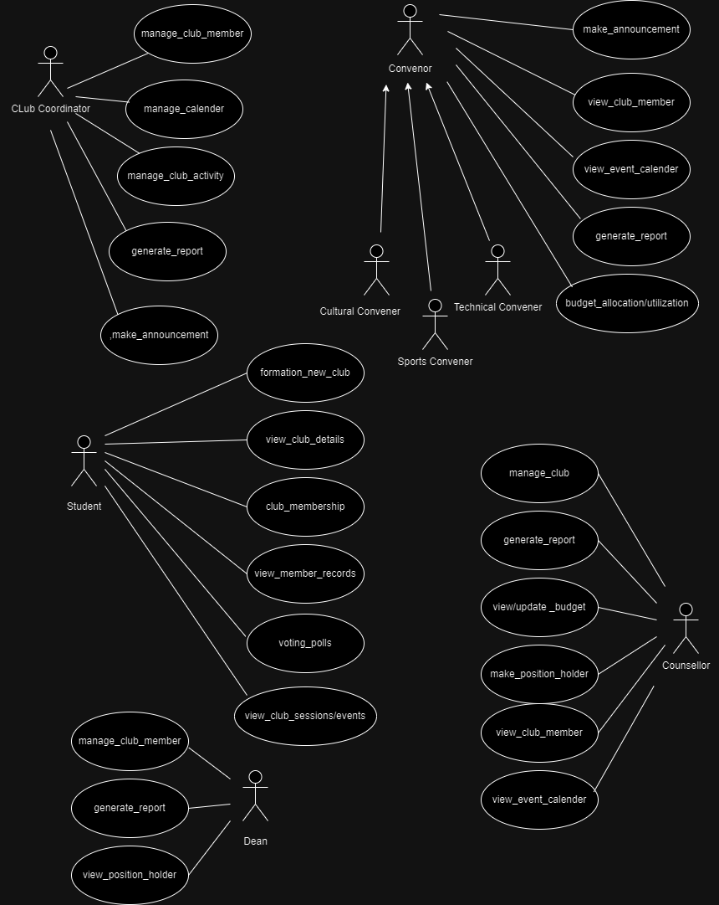

---

## API Status Report

### 1. **API:** [http://127.0.0.1:8000/gymkhana/api/voting_polls](http://127.0.0.1:8000/gymkhana/api/voting_polls)

- **Status:** Not working
- **Reasons:**
  - CSRF Token Failure.
  - CSRF Token not sent in request headers from the frontend.
  - Resource may be accessible only by superusers (club admins) or token expiry time may be too short.
- **Status Code:** 401 Unauthorized Access
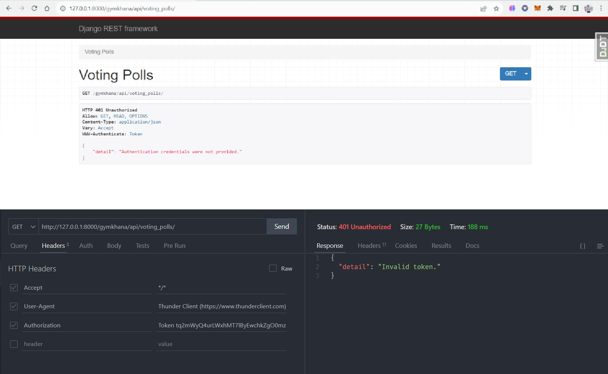

---

### 2. **API:** [http://127.0.0.1:8000/gymkhana/api/new_club](http://127.0.0.1:8000/gymkhana/api/new_club)

- **Status:** Not working
- **Reasons:**
  - CSRF Token Failure.
  - CSRF Token not sent in request headers from the frontend.
  - Resource may be accessible only by superusers (club admins) or token expiry time may be too short.
- **Status Code:** 401 Unauthorized Access
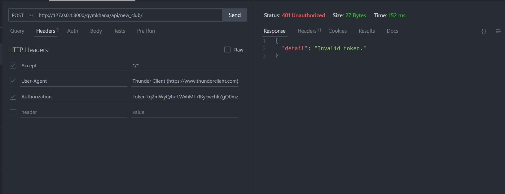
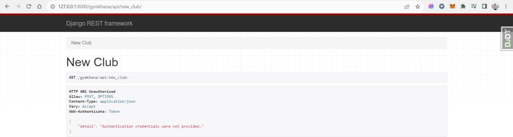

---

### 3. **API:** [http://127.0.0.1:8000/gymkhana/clubname](http://127.0.0.1:8000/gymkhana/clubname)

- **Status:** Not working
- **Reasons:**
  - CSRF Token Failure.
  - CSRF Token not sent in request headers from the frontend.
  - Resource may be accessible only by superusers (club admins) or token expiry time may be too short.
- **Status Code:** 401 Unauthorized Access
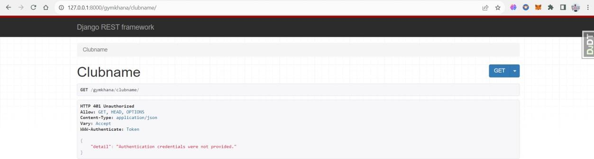

---

### 4. **API:** [http://127.0.0.1:8000/gymkhana](http://127.0.0.1:8000/gymkhana)

- **Status:** Working
- **Status Code:** 200 Success
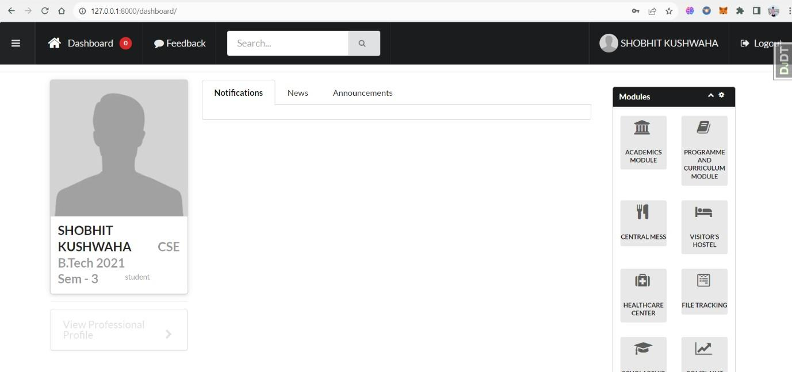
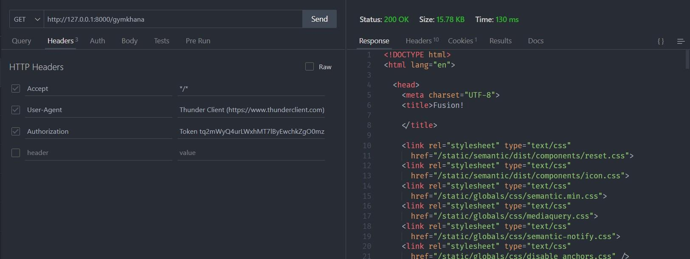

---

### 5. **API:** [http://127.0.0.1:8000/gymkhana/delete_requests](http://127.0.0.1:8000/gymkhana/delete_requests)

- **Status:** Not working
- **Reasons:**
  - API Functions not implemented.
  - Code block handling the request is not implemented.
- **Status Code:** 404 Not Found
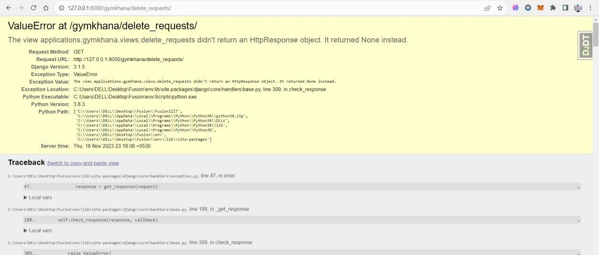

---

### 6. **API:** [http://127.0.0.1:8000/gymkhana/form_avail](http://127.0.0.1:8000/gymkhana/form_avail)

- **Status:** Not working
- **Reasons:**
  - API Functions not implemented.
  - Code block handling the request is not implemented.
- **Status Code:** 404 Not Found
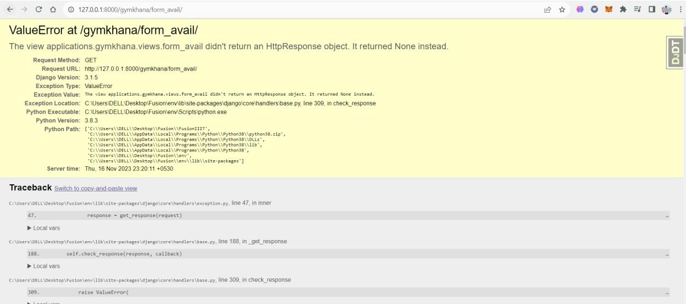
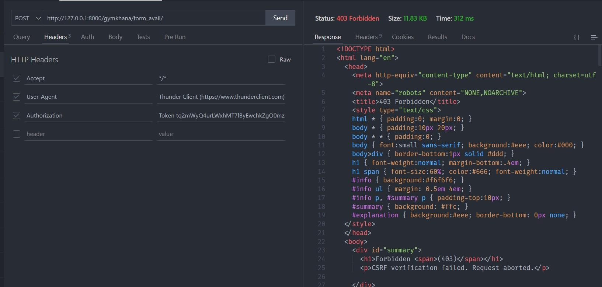

---

### 7. **API:** [http://127.0.0.1:8000/gymkhana/registration_form](http://127.0.0.1:8000/gymkhana/registration_form)

- **Status:** Not working
- **Status Code:** 500 Internal Server Error
- **Reasons:**
  - Database is empty; form requires fields like Coordinator & Coordinator Roll Numbers to be fetched from the database.
  - Cannot manually enter club details due to strict Primary Key Constraints.
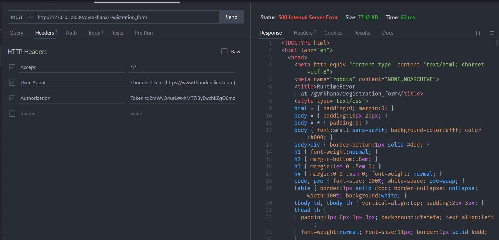

---

### 8. **API:** [http://127.0.0.1:8000/gymkhana/new_club](http://127.0.0.1:8000/gymkhana/new_club)

- **Status:** Not working
- **Status Code:** 500 Internal Server Error
- **Reasons:**
  - Database is empty; form requires fields like Coordinator & Coordinator Roll Numbers to be fetched from the database.
  - Cannot manually enter club details due to strict Primary Key Constraints.
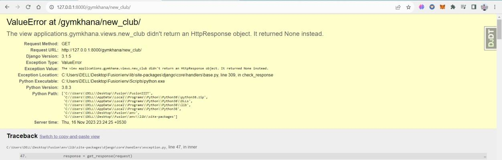
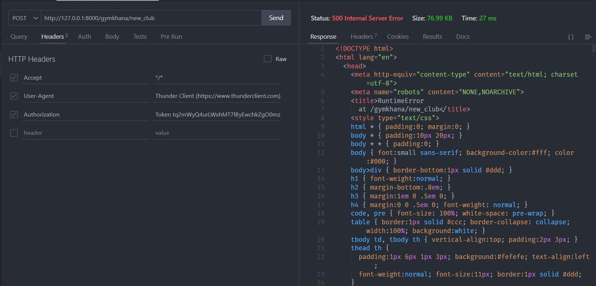

9\. API - <u>http://127.0.0.1:8000/gymkhana/approve</u>

> Status – Cannot determine as of now
>
> Status Code – 500 Internal Server Error
>
> Reasons –
>
> 1\. Cannot check because we cannot apply for club registration as the
> form for club registration is not working.

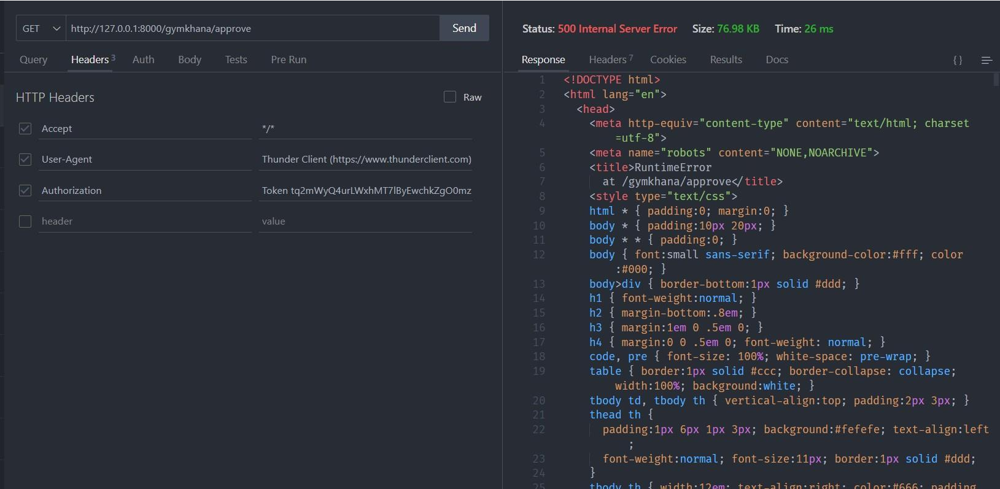

10\. API - <u>http://127.0.0.1:8000/gymkhana/reject</u>

> Status – Cannot determine as of now
>
> Status Code – 500 Internal Server Error
>
> Reasons –

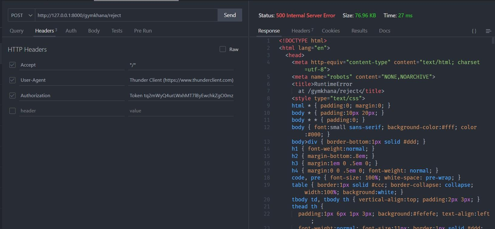

> 1\. Cannot check because we cannot apply for club registration as the
> form for club registration is not working.

11\. API -http://127.0.0.1:8000/gymkhana/new_session/

> Status – Not working

Reasons –

> 1\. API Functions not implemented
>
> 2\. Code block handling the particular request is not implemented.
>
> Status Code – 403 forbidden

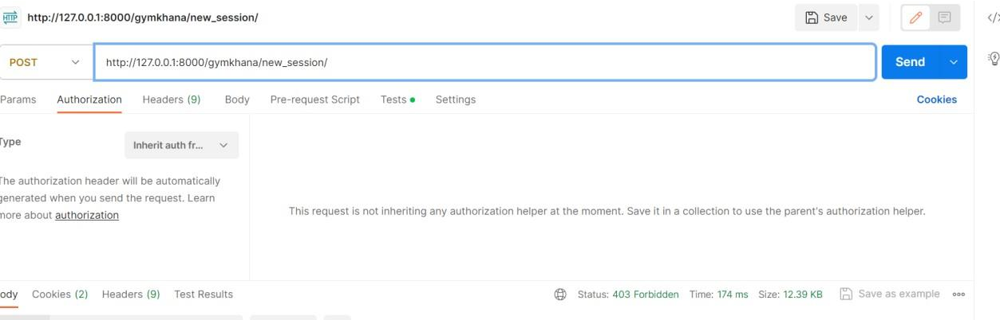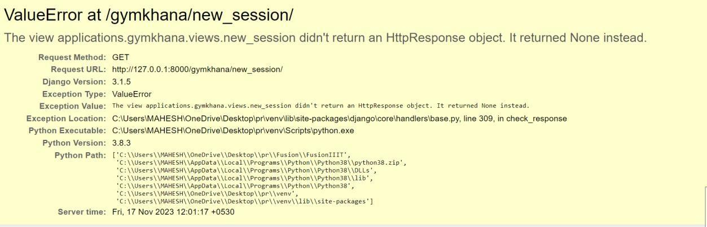

12\. API -http://127.0.0.1:8000/gymkhana/new_session/

> Status – Not working

Reasons –

> 1\. API Functions not implemented
>
> 2\. Code block handling the particular request is not implemented.
>
> Status Code – 403 forbidden

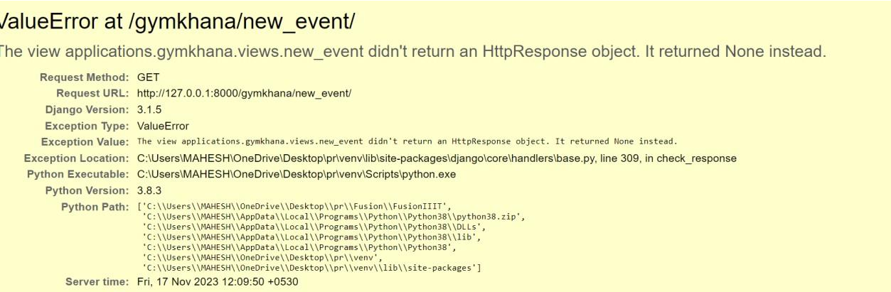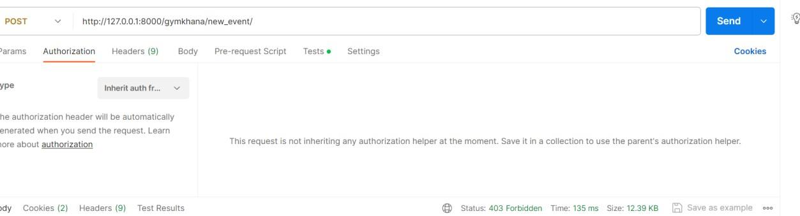

13\. API -http://127.0.0.1:8000/gymkhana/event_report/

> Status – Not working

Reasons –

> Status – Cannot determine as of now
>
> Status Code – 500 Internal Server Error

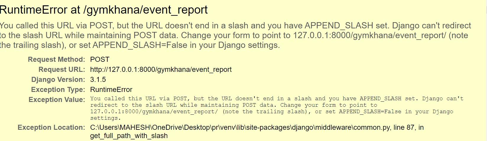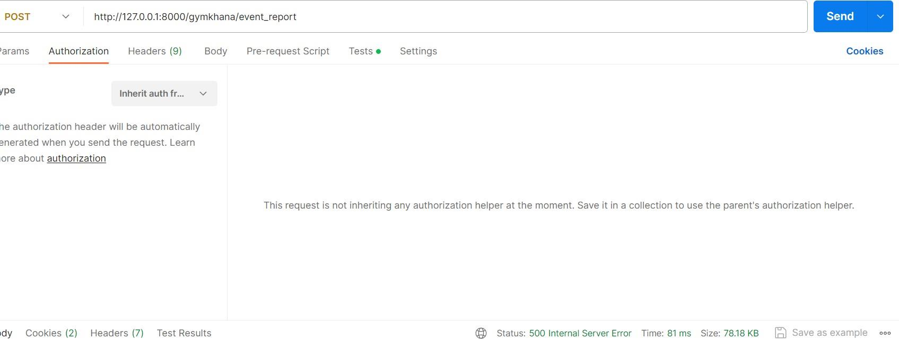

It is redirecting to gymkahana link …..

14\. API -http://127.0.0.1:8000/gymkhana/club_event_report/

> Status – Not working

Reasons –

> Status – Cannot determine as of now

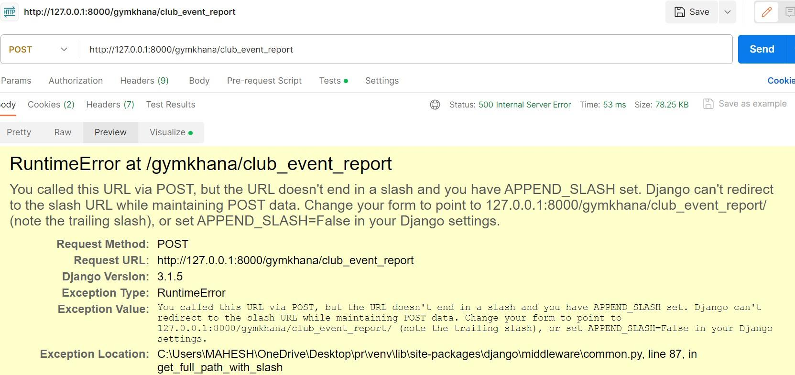

> Status Code – 500 Internal Server Error

It is redirecting to gymkahana link …..

15\. API -http://127.0.0.1:8000/gymkhana/change_head/

> Status – Not working

Reasons –

> 1\. API Functions not implemented
>
> 2.Code block handling the particular request is not implemented

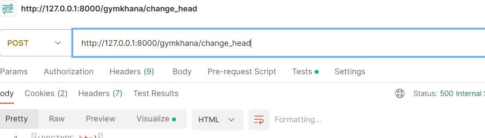

16\.

API -http://127.0.0.1:8000/gymkhana/club_budget/

> Status – Not working

Reasons –

> Status – Cannot determine as of now
>
> Status Code – 500 Internal Server Error

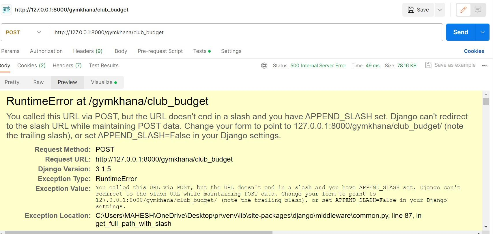

Function is created such that if request is not post then

It is redirecting to gymkahana link …..

17\. API -http://127.0.0.1:8000/gymkhana/club_event_report/

> Status – Not working

Reasons –

> Status – Cannot determine as of now
>
> Status Code – 500 Internal Server Error

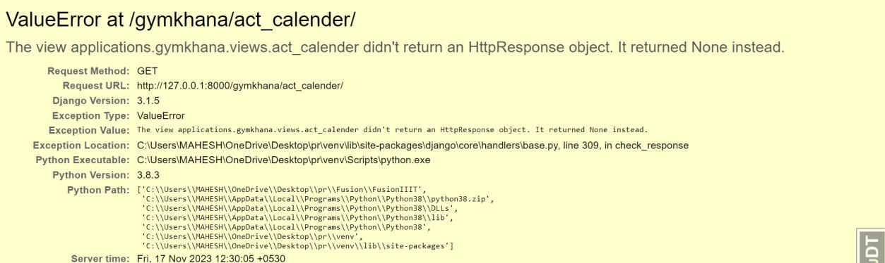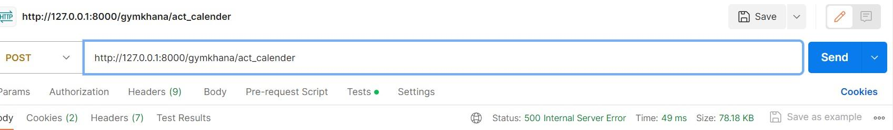

Function is created such that if request is not post then

It is redirecting to gymkahana link …..

18\. API -http://127.0.0.1:8000/gymkhana/club_event_report/

> Status – Not working

Reasons –

> Status – Cannot determine as of now
>
> Status Code – 500 Internal Server Error

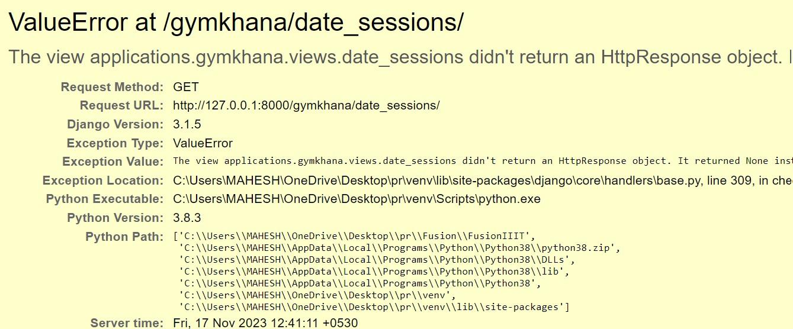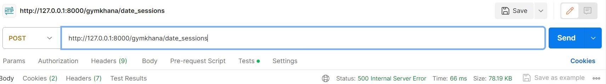

Function is created such that if request is not post then

It is redirecting to gymkahana link …..

19\. . API -http://127.0.0.1:8000/gymkhana/date_sessions/

> Status – working

Reasons –

> Status – Cannot determine as of now
>
> Status Code – 200 OK

20\. API -http://127.0.0.1:8000/gymkhana/delete_evenets/

> Status – Not working

Reasons –

> Status – Cannot determine as of now
>
> Status Code – 500 Internal Server Error

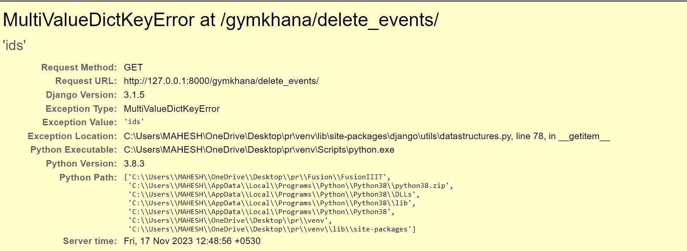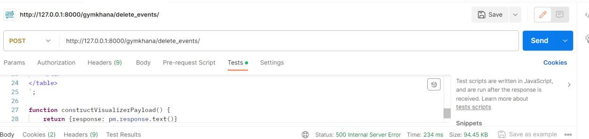

21.21.

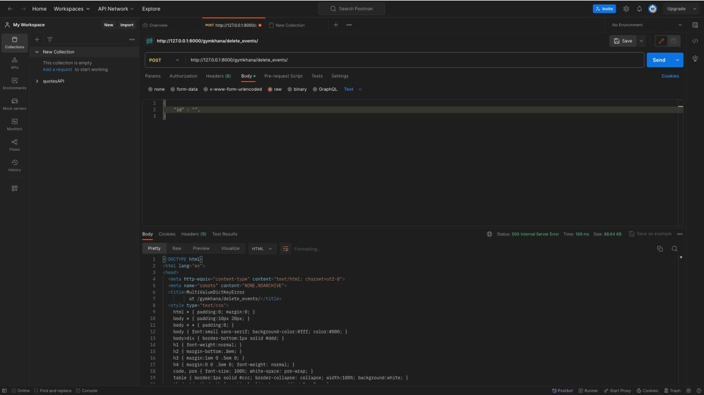

API :- http://127.0.0.1:8000/gymkhana/delete_events/

Status – Not working

Reasons –

> Status – Cannot determine as of now
>
> Status Code – 500 Internal Server Error

22:

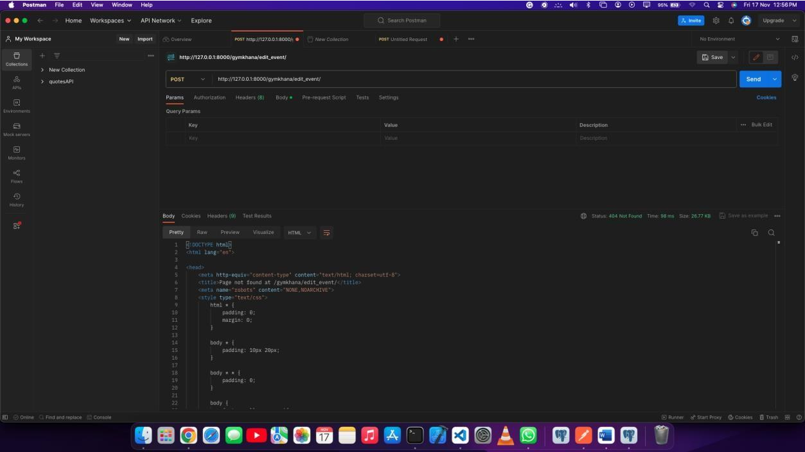

API :- <u>http://127.0.0.1:8000/gymkhana/edit_event/</u>

> Status – Not working

Reasons –

> Status – Cannot determine as of now
>
> Status Code – 404 Not Found

23\.

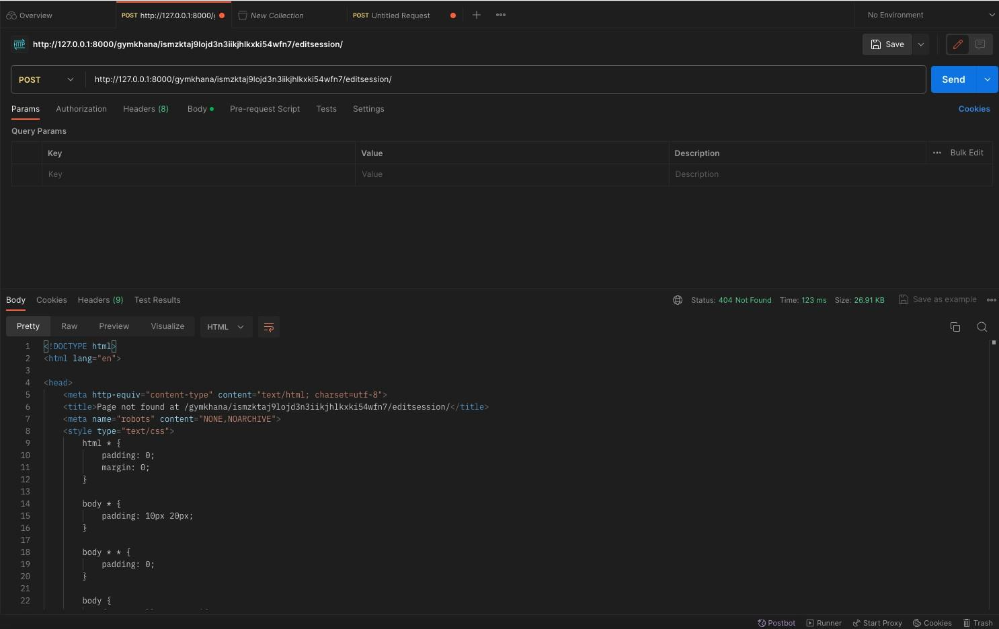

API -
<u>http://127.0.0.1:8000/gymkhana/ismzktaj9lojd3n3iikjhlkxki54wfn7/editsession/</u>

> Status – Not working

Reasons –

> Status – Cannot determine as of now
>
> Status Code – 404 Not Found

24:-

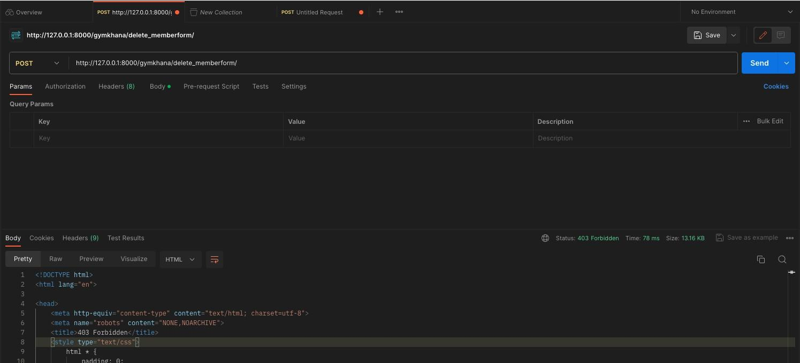

API - http://127.0.0.1:8000/gymkhana/delete_membeífoím/

> Status – Not working

Reasons –

CSRF Token expires as soon as we login and does not provide
authorization

> Status Code – 403 forbidden

25\.

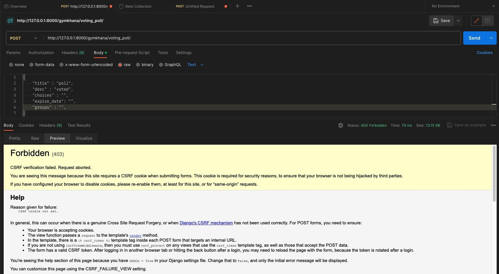

API:- http://127.0.0.1:8000/gymkhana/voting_poll/

Status – Not working Reasons –

CSRF verification failed. Request aborted

CSRF Token expires as soon as we login and does not provide
authorization

Status Code – 403 forbidden

26\.

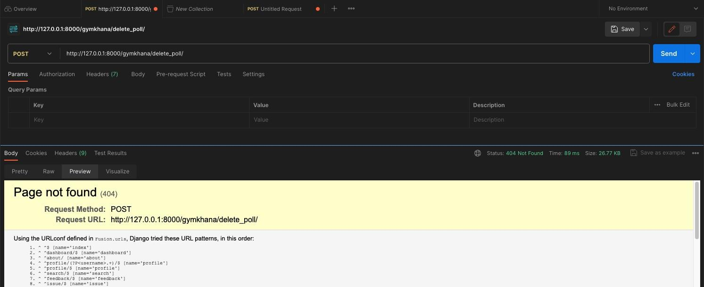

API :- http://127.0.0.1:8000/gymkhana/delete_poll/ Status – Not working

Reasons –

API Functions not implemented

Status Code – 404 Page Not Found

27\.

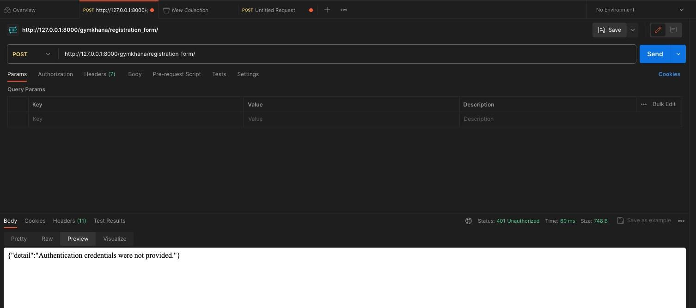

API - http://127.0.0.1:8000/gymkhana/íegistíation_foím/ Status – Not
working

> Reasons –
>
> Authentication credentials were not provided. Status Code – 401
> Unauthorized access

28\.

API:- http://127.0.0.1:8000/gymkhana/delete_íequests/

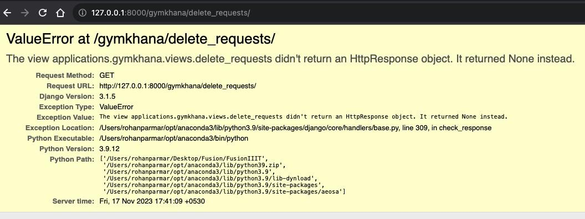

Status – Not working Reasons –

CSRF verification failed. Request aborted Status Code – 403 forbidden

29\.

API :- http://127.0.0.1:8000/gymkhana/club_membeíship/

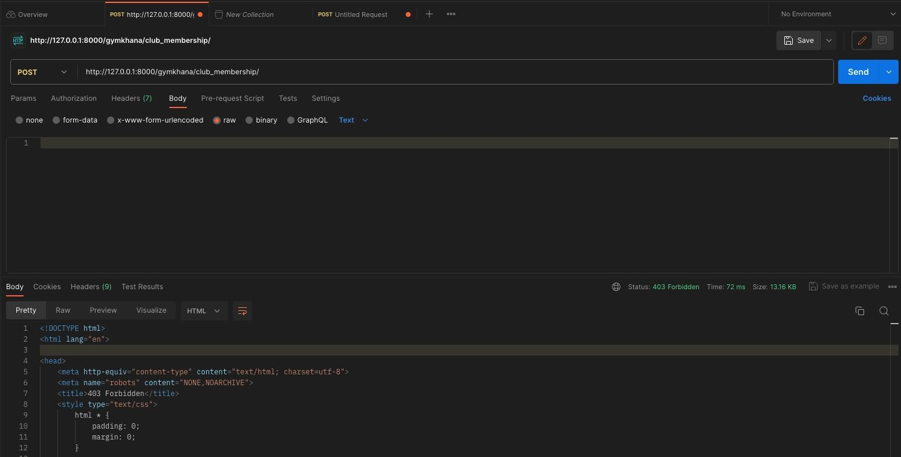

Status – Not working Reasons –

CSRF verification failed. Request aborted

CSRF Token expires as soon as we login and does not provide
authorization

Status Code – 403 forbidden

30\.

API :- http://127.0.0.1:8000/gymkhana/session_details

Status – Not working Reasons –

CSRF verification failed. Request aborted

CSRF Token expires as soon as we login and does not provide
authorization

Status Code – 401 Unauthorized

31\.

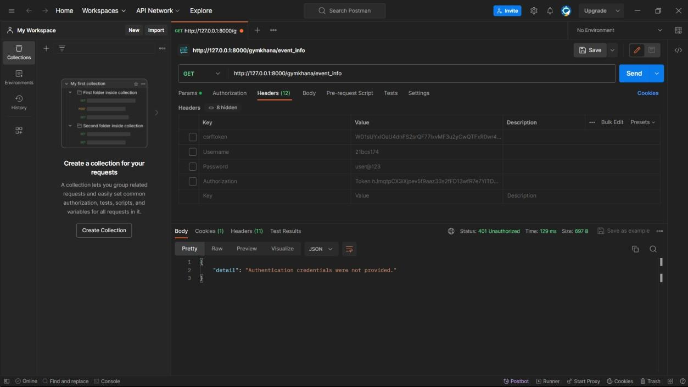

API :- http://127.0.0.1:8000/gymkhana/event_info

Status – Not working Reasons –

CSRF verification failed. Request aborted

Request not hitting the controllers and aborting from views

Status Code – 401 Unauthorized

32\.

API :- http://127.0.0.1:8000/gymkhana/club_budgetinfo

Status – Not working Reasons –

CSRF verification failed. Request aborted

Request not hitting the controllers and aborting from views

Status Code – 401 Unauthorized

33\.

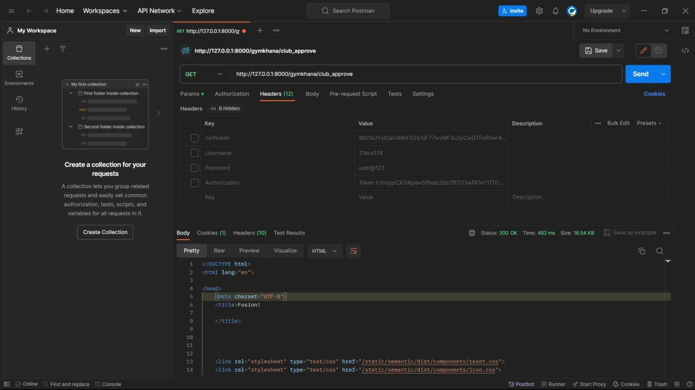

API :- http://127.0.0.1:8000/gymkhana/club_appíove

Status – Working Status Code – 200

34\.

API :- http://127.0.0.1:8000/gymkhana/club_íeject

Status – Working Status Code – 200

35\.

API :- http://127.0.0.1:8000/gymkhana/api/login

Status – Not working Reasons –

CSRF verification failed. Request aborted TTL is only 600ms

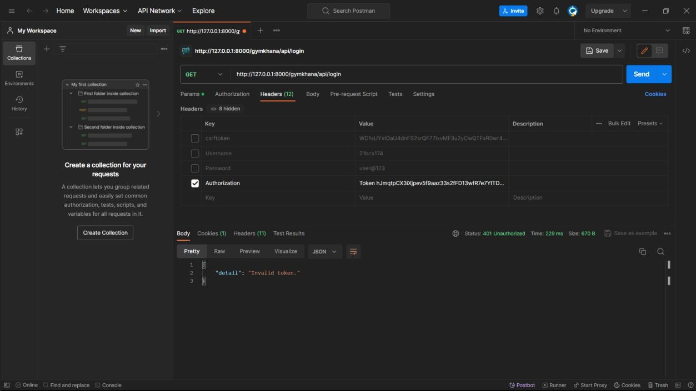Status Code – 401
Unauthorized

36\.

API :- http://127.0.0.1:8000/gymkhana/api/clubdetails

Status – Not working Reasons –

CSRF verification failed. Request aborted TTL is only 600ms

Status Code – 401
Unauthorized

37\. API :- http://127.0.0.1:8000/gymkhana/api/Fest_budget

> Status – Not working Reasons –
>
> CSRF verification failed. Request aborted TTL is only 600ms
>
> Status Code – 401 Unauthorized

38\. API :-http://127.0.0.1:8000/gymkhana/api/club_íepoít

Status – Not working Reasons –

CSRF verification failed. Request aborted TTL is only 600ms

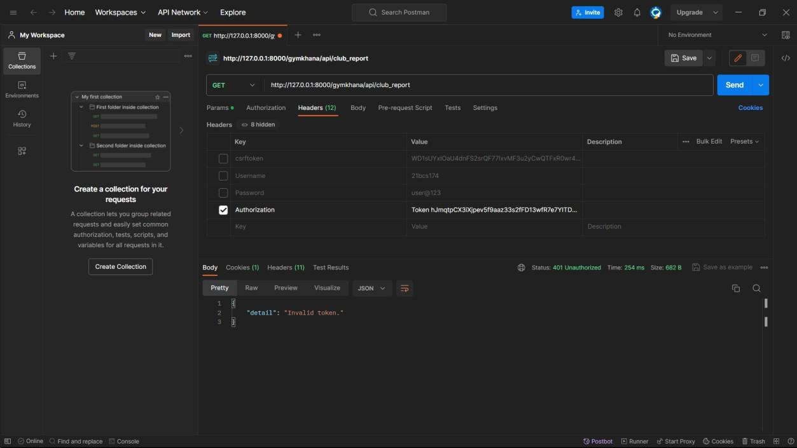Status Code – 401
Unauthorized

39\. API :-http://127.0.0.1:8000/gymkhana/api/íegisteíation_foím

Status – Not working Reasons –

Api not hitting the controllers .As shown in vs code terminal “test” is
not being printed.

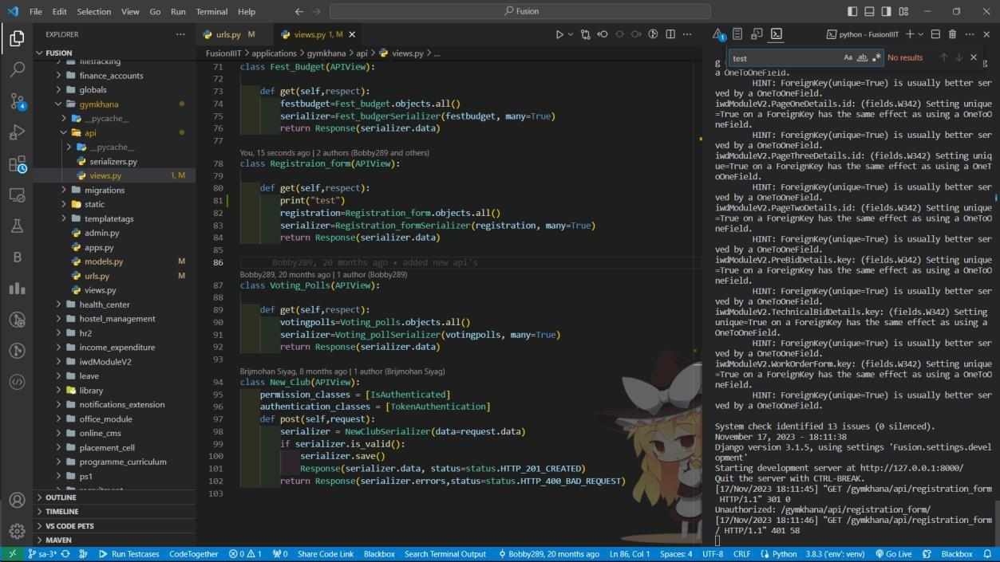Status Code – 401
Unauthorized

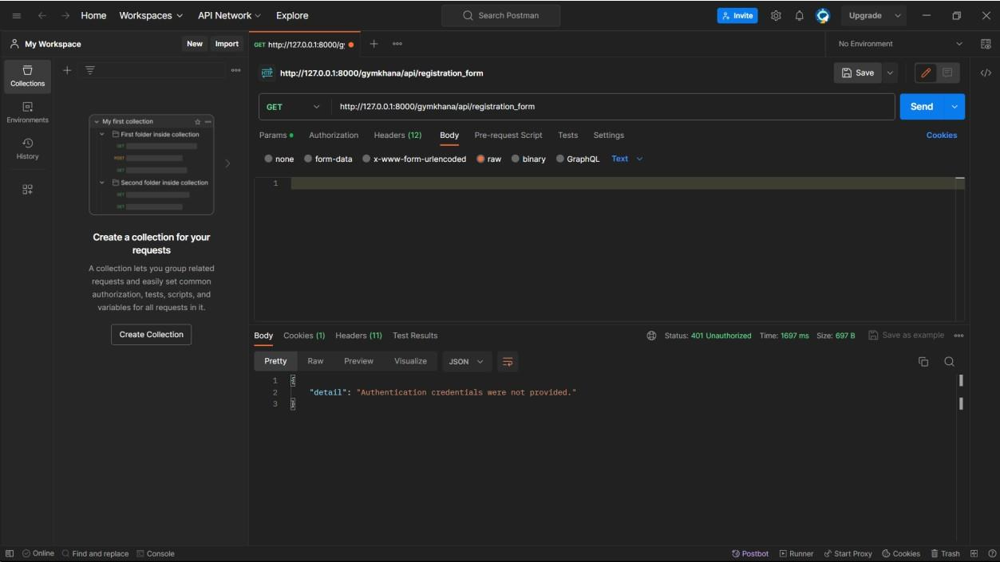

40\. API - http://localhost:8000/gymkhana/club_membership/

> Status – Not working
>
> Reasons –
>
> 1\. API Functions not implemented
>
> 2\. Code block handling the particular request is not implemented.
>
> 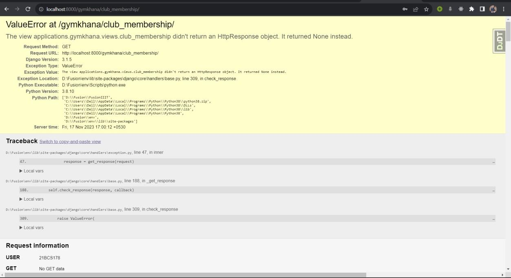 style="width:6.26555in;height:3.41458in" />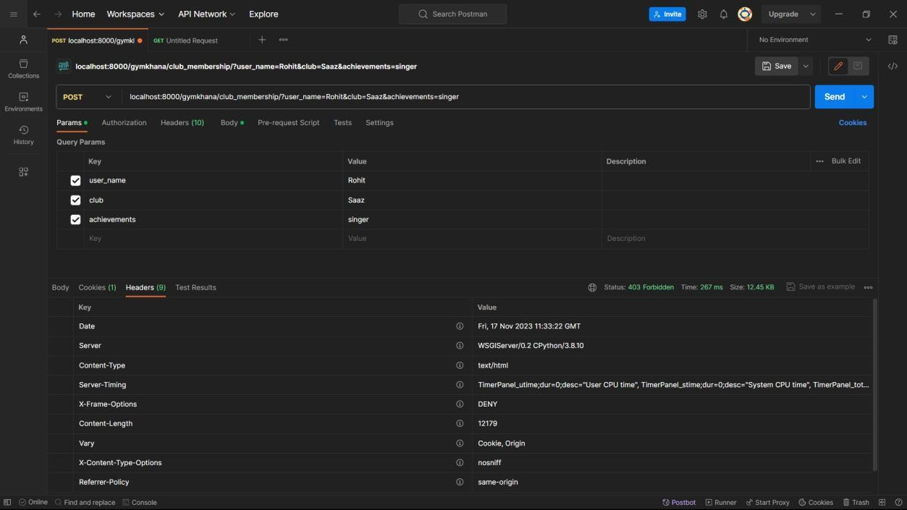 style="width:6.26667in;height:3.52486in" />Status Code – 403 Forbidden

41\. API - http://localhost:8000/gymkhana/faculty_data/

> Status – Not working
>
> Reasons -
>
> 1\. Missing key request. 2. Incorrect key name.
>
> 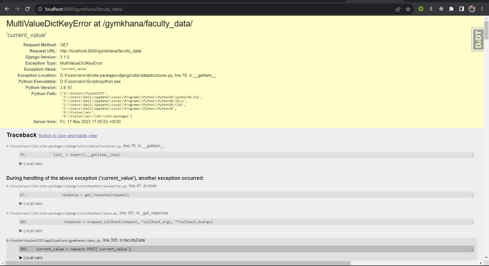 style="width:5.81806in;height:3.16944in" />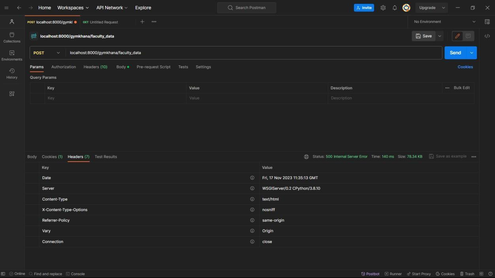 style="width:6.2625in;height:3.52958in" />Status Code – 500 Internal
> Server Error

42\. API - http://localhost:8000/gymkhana/faculty_data/

> Status – Not working
>
> Reasons –
>
> 1\. API Functions not implemented
>
> 2\. Code block handling the particular request is not implemented. 3.
> Missing key request.
>
> 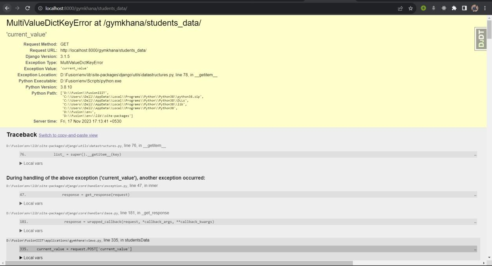 style="width:6.25972in;height:3.39986in" />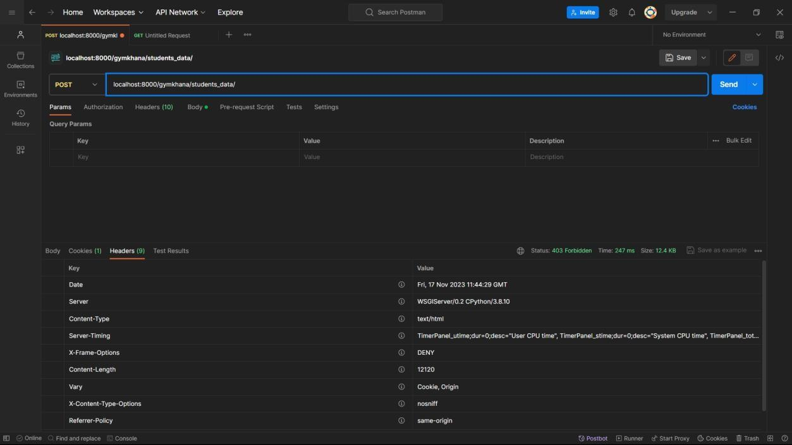 style="width:6.26667in;height:3.52486in" />Status Code – 403 Forbidden

43\. API - http://localhost:8000/gymkhana/get_venue/

> Status – Not working
>
> Reasons –
>
> 1\. There is a typo in the attribute or method name, or if the code
> assumes the existence of an attribute that hasn't been initialized or
> provided.
>
> 2\. If the structure of an object is expected to remain constant, but
> it dynamically changes during runtime

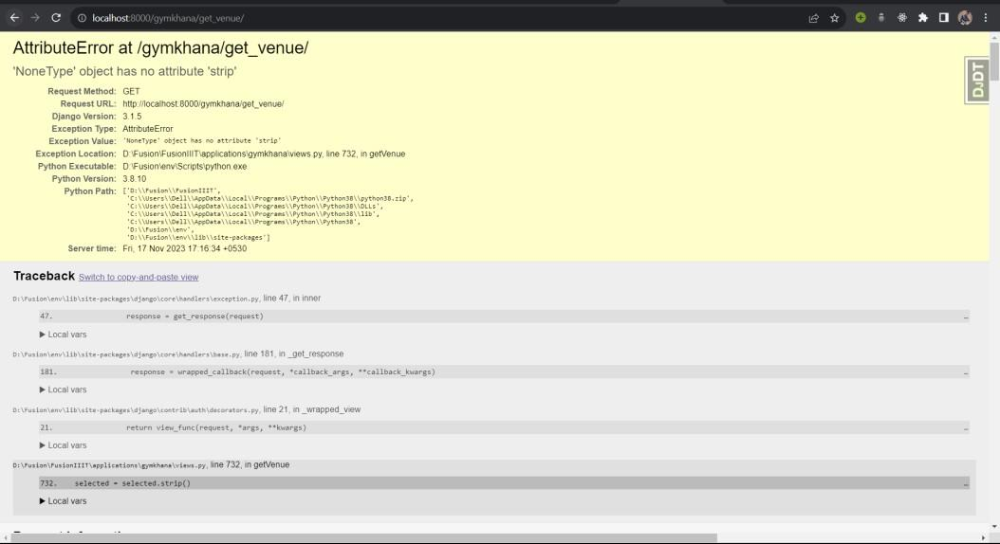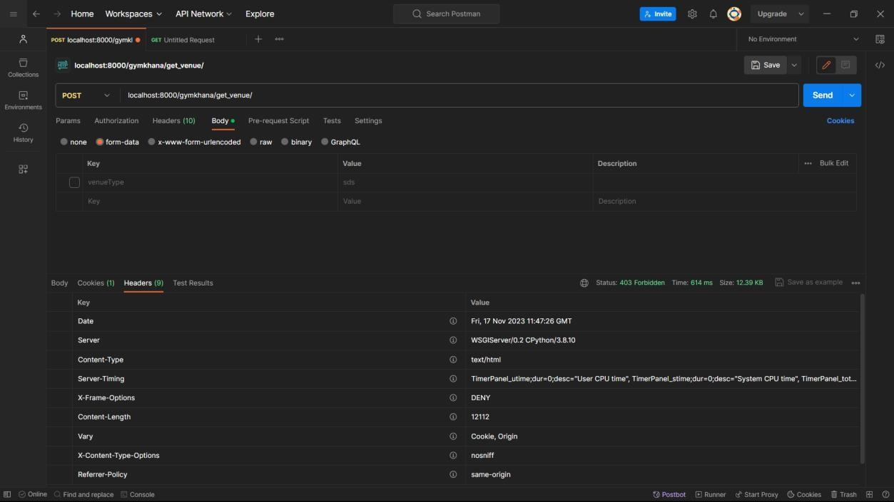Status Code – 403 Forbidden

44\. API - http:localhost:8000/gymkhana/core_team/

> Status – Not working
>
> Reasons –
>
> 1\. CSRFTokenFailure.
>
> 2\. The CSRF Token is not sent in the request headers from the
> frontend while making the request.
>
> 3\. Either the resource is only accessible by superusers (club admins)
> or the expiry time of token is very less.

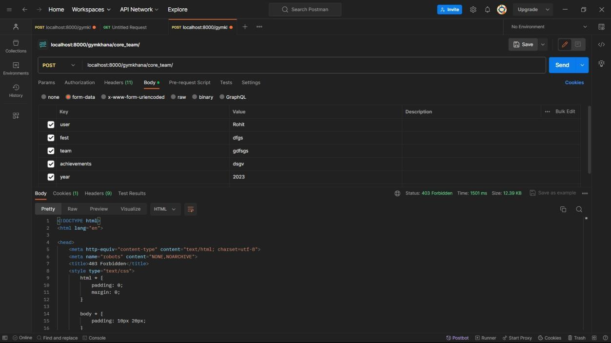Status Code – 403 Forbidden

45\. API - http:localhost:8000/gymkhana/festbudget/

> Status – Not working
>
> Reasons –
>
> 1\. CSRFTokenFailure.
>
> 2\. The CSRF Token is not sent in the request headers from the
> frontend while making the request.
>
> 3\. Either the resource is only accessible by superusers (club admins)
> or the expiry time of token is very less.
>
> 4\. Database is empty.

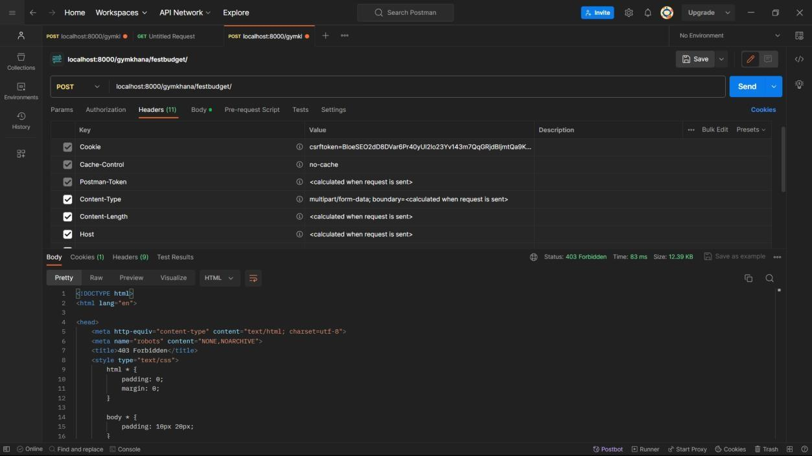Status Code – 403 Forbidden

46\. API - <u>http://localhost:8000/gymkhana/?P\<poll_id</u>\> Status –
Not working

> Reasons –
>
> 1\. Insufficient data to check this api. 2. Database is empty

Status Code – Can’t determine

## UI for Application
**Figma Profiles for GYMKHANA (Mobile)**
**

Student Mentor : Hardik Sharma (21bcs092 )

Teammates :

Anushri Thakre (21bcs029)

Bhawna Chilwal (21bcs057)

Suyash Suman (21bcs217 )

Suman Kumar (21bcs214 )

Govind Kumar (21bcs088 )
**

**1.**      **Module Description:**

The Gymkhana mobile module serves as a portable extension of the online web service portal, providing users with on-the-go access to various features related to club management and participation. Key functionalities of the Gymkhana mobile module include:

**Club Details Viewing:**

Users can easily access and view detailed information about all the clubs, including their activity calendars, current coordinators, and upcoming events directly from their mobile devices.

**Club Applications and Memberships:**

The module allows users to submit applications for new clubs and apply for membership in existing clubs. The mobile interface features user-friendly forms to streamline the application and membership processes.

**Club Sessions and Events:**

Users, whether students or faculty, can check and stay updated on ongoing or upcoming club sessions and events through the mobile module. This ensures that they remain informed about club activities at all times.

**Member Details:**

The mobile module enables users to access public details related to club members, both current and previous. This feature fosters transparency and community engagement within the club environment.

Overall, the Gymkhana mobile module extends the functionality of the web service portal to mobile devices, offering a convenient and accessible way for users to engage with club-related activities and services while on the move.

**2.**   **Actors**

**2.1 Student Dean**

`    `**View budget:** Gain a comprehensive view of the club's financial landscape, ensuring fiscal responsibility and strategic resource allocation.

**Generate reports:** Access detailed reports to evaluate the club's performance and contributions, facilitating informed decision-making.

**View position holders:** Easily view and acknowledge outstanding contributors within the club, recognizing and appreciating their efforts.

**2.2 Counselor:**

**Manage clubs:** Facilitate and guide the growth of clubs, ensuring they align with the institution's values and goals.

**View & Update budget:** Monitor and update the financial aspects of the clubs, promoting responsible resource management.

**Generate report:** Access insightful reports for an in-depth understanding of club dynamics and contributions.

**Manage position holders:** Acknowledge and support outstanding contributors, fostering a culture of recognition and motivation.

**View club members:** Easily access and manage club members, fostering a sense of inclusivity and engagement.

**View event calendar:** Stay connected with club activities by viewing members, events, and calendars, promoting holistic student development.

**2.3Convenor:**

Sub Actors

1\. Cultural convenor

2\. Sports convenor

3\. Technical convenor

**View event calendar:** Stay informed about upcoming events, ensuring effective planning and coordination between different club sectors.

**View club members**: Easily access and manage club members, fostering a sense of inclusivity and engagement.

**Budget allocation & utilization:** Efficiently allocate and monitor budgetary resources to optimize the impact of cultural, sports, and technical events.

**Generate reports:** Access detailed reports to assess the success of events and identify areas for improvement.

**Make announcements:** Effectively communicate updates and critical information to members, creating a cohesive and informed community.

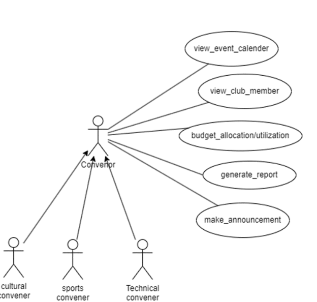
**

**

**

**2.4Club Coordinator:**
**

**Manage all the club members**: Effortlessly oversee and engage with all club members, fostering a sense of community and participation.

**Manage calendar:** Seamlessly organize and coordinate club activities, ensuring a well-planned and dynamic schedule.

**Manage club activities:** Streamline the execution of club activities, from planning to execution, to enhance the overall club experience.

**Generate reports:** Access comprehensive reports for insightful analysis, aiding in data-driven decision-making for continuous improvement.

**Make announcements**: Effectively communicate updates and vital information to the entire club, fostering transparency and engagement.

` `****
**

**

**

Link :

<https://www.figma.com/file/OzSIraRTFvdJ9ukOy0W0sJ/PR-assignment-3?type=design&node-id=0-1&mode=design&t=lFcOMrFLaY1h9OoJ-0>

** 
**

** 

**Figma Profile Design Guidelines and Additional Considerations**

**5.1 Cross-Platform Compatibility:**

\- Verify that Figma designs and features are compatible across both web and app versions.

**5.2 Dimension Standardization:**

\- Ensure all Figma designs have the same dimensions: 1920 x 1080 for web and around 360px width for mobile.

**5.3** **Actor-oriented Use Case-Based Design:**

\- Strictly base all Figma designs on use cases of actors and maintain consistency with previous and newly added designs.

-- Each actor should have different page in figma

\- If the Figma profiles are already existing make sure all the actors have their own figma profiles and also wireframe those across all use cases for that actor

\- Figma link (only) for reference (Figma profiles created by the previous batch):<https://www.figma.com/file/pzhw34xBvEK0hm5Yx4bh0P/Fusion-APP?type=design&node-id=0%3A1&mode=design&t=J0f6T5YoUiKbp17u-1>

## UI for Web
**Figma Profiles for Gymkhana Web Module**	

**Mentor –**

**Vijaypal Singh Rathor**
**

` `**Student Mentor -** 

`	`**21BCS028 - Anurag  Goswami**
**

**Team –**

**21BCS194 - Shobhit Kushwaha**

**21BCS174  -Rishabh Sharma**

**21BCS178 - Rohit Raj** 

**21BCS176 - Rohan Parmar** 

**21BCS168 - Pulivarthi Mahesh**

**1.**      **Module Description:**

Fusion ERP is an Online Web Service Portal which provides a centralised platform for accessing, collecting, and managing the various services related to an institutes operations related to the student body such as : - Course Registration and Management - Mess Committee - Gymkhana - Examination - Hostel Management - Placement Cell - Primary Health Centre (PHC) and the variety of other departments which are involved in the activities of the students as well as those departments which support these major departments. 

<Use case specifications of the module>

[FUSION_ERP\[2\]](https://docs.google.com/document/d/1Y3pNVTc2Ul5xY09O2r36fBgRumkuSOsjWmr9teJ57dc/edit?usp=sharing)

**2.**  	**Actors**

**2.1 Convener :**

- **View event calendar:** Stay informed about upcoming events, ensuring effective planning and coordination between different club sectors.
- **View club members:** Easily access and manage club members, fostering a sense of inclusivity and engagement.
- **Budget allocation & utilisation**: Efficiently allocate and monitor budgetary resources to optimise the impact of cultural, sports, and technical events.
- **Generate reports:** Access detailed reports to assess the success of events and identify areas for improvement.
- **Make announcements:** Effectively communicate updates and critical information to members, creating a cohesive and informed community.

`		`

**2.2 Counsellor :**

- **Manage clubs:** Facilitate and guide the growth of clubs, ensuring they align with the institution's values and goals. 
- **View & Update budget:** Monitor and update the financial aspects of the clubs, promoting responsible resource management.
- ` `**Generate report:** Access insightful reports for an in-depth understanding of club dynamics and contributions.
- **Manage position holders:** Acknowledge and support outstanding contributors, fostering a culture of recognition and motivation. 
- **View club members:** Easily access and manage club members, fostering a sense of inclusivity and engagement. 
- **View event calendar:** Stay connected with club activities by viewing members, events, and calendars, promoting holistic student development. 

`		`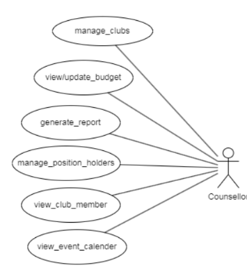
**

` `**2.3  Club Coordinator:** 

- **Manage all the club members:** Effortlessly oversee and engage with all club members, fostering a sense of community and participation.
- **Manage calendar:** Seamlessly organise and coordinate club activities, ensuring a well-planned and dynamic schedule.
- **Manage club activities:** Streamline the execution of club activities, from planning to execution, to enhance the overall club experience.
- **Generate reports:** Access comprehensive reports for insightful analysis, aiding in data-driven decision-making for continuous improvement.
- **Make announcements:** Effectively communicate updates and vital information to the entire club, fostering transparency and engagement.

`		`

**2.4 Dean** 

- **View budget:** Gain a comprehensive view of the club's financial landscape, ensuring fiscal responsibility and strategic resource allocation.
- **Generate reports:** Access detailed reports to evaluate the club's performance and contributions, facilitating informed decision-making.
- **View position holders:** Easily view and acknowledge outstanding contributors within the club, recognizing and appreciating their efforts.

`		`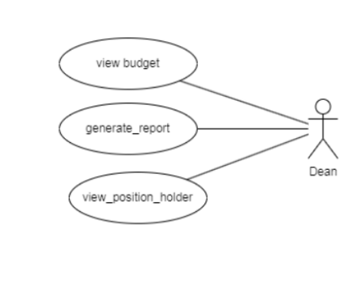

**2.5 Student**

- **View Club Details:** Everyone can view the details and event details of the interested details via this use case implementation.
- **Applying for membership of existing clubs:** Interested individuals can apply for membership in established clubs by submitting relevant information and meeting criteria.
- **View member records:** Interested individuals can view the current members of the particular club and the representatives for it.
- **Voting polls:** Particular set of students can cast their vote for the intended poll by the authority
- **View club session and events:** Interested individuals of a club can view the ongoing and upcoming session and events for any club they have participated.

\

** 

**Figma Profile Design Guidelines and Additional Considerations**

**5.1 Cross-Platform Compatibility:**

\- The Figma designs and features are compatible across both web and app versions.

**5.2 Dimension Standardization:**

\- All Figma designs have the same dimensions: 1920 x 1080 for web and around 360px width for mobile.

**5.3** **Actor-oriented Use Case-Based Design:**

\- Strictly base all Figma designs on use cases of actors and maintain consistency with previous and newly added designs.

-- Each actor have different page in figma

\- If the Figma profiles are already existing make sure all the actors have their own figma profiles and also wireframe those across all use cases for that actor

\- Updated Figma link for all profiles:https://www.figma.com/file/cjaTKXanJLKatb5qdqGDbV/Gymkhana-Module?type=design&node-id=0%3A1&mode=design&t=UPGhEROSEV0lc956-1

Assignment 3 Doc Link - [Assignment 3 Gymkhana Web Figma Profiles](https://docs.google.com/document/d/1u9aIhPi6VJhz-aze0m09N-bVHOBM4ZpOqCLhz2iTiiQ/edit)

## Database Schema
**Module Name - Gymkhana Web (SA3)**

**Faculty Mentor -  Dr. VijayPal Singh Rathore**

**Student Mentor - Anurag Goswami**

`  `**Database Documentation of SA-3 Gymkhana Web 4.0**

**Overview of the Module:** 

The Gymkhana web module is part of the online web service portal which is responsible for the following:

1. Viewing the details of all the club details including their activity calendar, the current coordinator and co-coordinator.
1. Submitting applications for new clubs, as well as applying to be a member of existing clubs. The module features detailed forms to facilitate such services.
1. The user (Student, faculty) can also view the ongoing or upcoming club sessions and events.
1. The user can also access the public details related to the members of the clubs (both current and previous).
1. The user can participate in elections, ask for nominations for head figures in a club.
**

**SRS:** [SRS-Gymkhana WEB](https://docs.google.com/document/d/1Y3pNVTc2Ul5xY09O2r36fBgRumkuSOsjWmr9teJ57dc/edit)

**A. ER Diagram:**  

[ER Gymkhana-Page-1.png](https://drive.google.com/file/d/1BSezCkcKb1MkrdxS4W7KtOrUXEDscSwT/view?usp=sharing)	

`  `**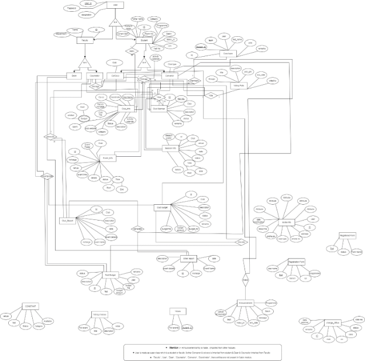**

**B. Database Schema Info (in the Google sheet):** 

[Gymkhana Database Schema Info](https://docs.google.com/spreadsheets/d/1YwTLBuiaOA-9f29gFGUz7vwsn0S7vR4Tg8dk7N-HW_g/edit#gid=0)

**C. Mention all the changes required in the currently implemented Tables:-
(These changes will be done in this current version 4.0)**

1) **Registeration\_form**
- Roll
1) Change: Primary key issue must be resolved from what module it is coming
1) Justification: Cannot be added due to key constraints

**      2.) **Form\_avalaible**

- Roll
1) Change: Primary key issue must be resolved from what module it is coming
1) Justification: Cannot be added due to key constraints

**D. Data Availability for API and Functional Testing**

**D.1	Mention the tables that are already populated**

- Club\_member
- Core\_team
- Session\_info
- Event\_info
- Club\_report
- Other\_report
- Voting\_polls
- Voting\_choices
- Voting\_voters

**D.2	Mention the tables required to be populated**

- Club\_info
- Form\_avalaible
- Registeration\_form
- Club\_budget
- Fest\_budget
- Change\_office

**D.3	Mention any difficulties faced by your team regarding populating any table** 	
**

`	`**Club\_info :** Club\_name attribute not reaching the controllers in views

**Club\_budget :** Club\_name attribute not reaching the controllers in views

**Registeration\_form :** primary key issue for student id from any random module

Doc Link : [FUSION_ERP_ASSIGNMENT_4_GYMKHANA_WEB](https://docs.google.com/document/d/1fONvKEL5ObFVQiziP_Vp7jkfgtFEoGJj20afkhe2XgQ/edit)

