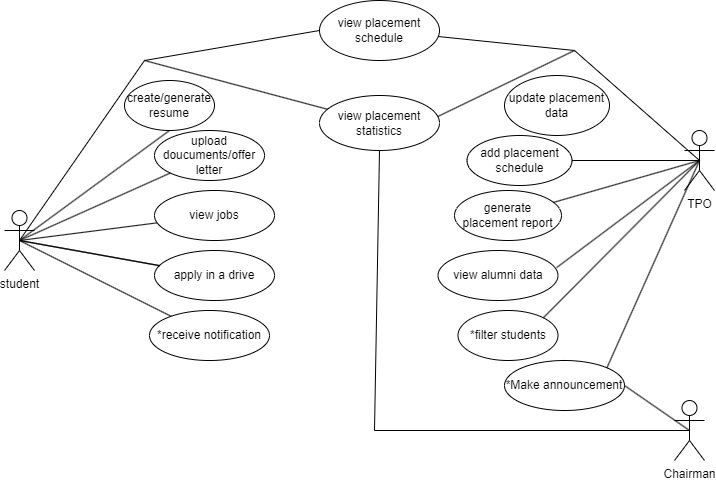

# Authentication Module Documentation

## Table of Contents
- [User-Centered Design (UCD)](#user-centered-design-ucd)
- [SRS Application](#srs-application)
- [SRS Web Interface](#srs-web-interface)
- [API Specifications](#api-specifications)
- [UI for Application](#ui-for-application)
- [UI for Web](#ui-for-web)
- [Database Schema](#database-schema)

## User-Centered Design (UCD)

## SRS Application
# Fusion ERP

## Software Requirements Specification

### SA-4 - Placement Cell

---

**Prepared by:**  
- **(21bcs044) Athira**  
- **(21bcs137) Haritha**  
- **(21bcs135) Shivani**  
- **(21bcs220) Ruthvika**  
- **(21bcs230) Deepthi**  

**Student Mentor:**  
**Rahul Shankla**

---

## Table of Contents

1. **Introduction**  
   1.1 Introduction about Fusion  
   1.2 Purpose of the Module  
   1.3 Scope of the Module  

2. **User/Actor Description (Characteristics)**  

3. **Functional Requirements**  
   3.1 Use Case Diagram  
   3.2 Use Case Description  
   3.3 Other Functional Requirements  
   3.4 Other Constraints  
   3.4.1 User Interfaces  
   3.4.2 Software (Tech) Stack Used  

4. **Non-Functional Requirements**  

5. **Module Dependencies with Other Fusion Modules**  
   5.1 UI Level  
   5.2 DB Level Dependencies  
   5.3 Module Level Dependencies  

---

## 1. Introduction

### 1.1 Introduction about Fusion – A Brief Description

FusionIIIT stands as a testament to the seamless integration and automation of diverse functions within PDPM Indian Institute of Information Technology, Design and Manufacturing, Jabalpur. Crafted with precision using the Dart and Flutter framework, this initiative is a student-driven endeavor designed to elevate the institute's operational landscape. Encompassing everything from efficient administration management to academic prowess and miscellaneous departmental tasks, FusionIIIT is a holistic solution that harmonizes the intricacies of campus life.

Imagine it as a digital wizard that takes care of everything, from organizing administrative tasks to making academics smoother. It's not just limited to the usual tasks; FusionIIIT engages various departments and sections, ensuring every corner of campus life runs smoothly.

On the administrative side, it handles complicated paperwork and processes. For academics, it brings a digital touch, making learning and managing courses easier. But it doesn't stop there; FusionIIIT acts as a friendly companion for all different parts of the campus, ensuring everything works well.

In simpler terms, FusionIIIT is not just a tool – it's a helpful friend, making life at PDPM IIITDM Jabalpur more organized and enjoyable for everyone.

### 1.2 Purpose of the Module

The purpose of the **Placement Cell Module** is to facilitate and streamline the processes related to placement activities at IIIT Jabalpur. This module is designed to manage placement-related interactions, recruitment activities, and informational flow among students, placement officers, and the chairman. It aids in efficient job posting updates, managing student profiles, application scheduling, placement statistics, reporting, and enhanced accessibility for students.

### 1.3 Scope of the Module

The placement cell module caters to three primary actors: **students, the placement officer,** and **the chairman**. The primary focus is to allow students to create and manage detailed profiles showcasing their academic achievements, skills, and interests by submitting relevant documents and updating resumes. It also aids in job searching, applications, tracking the status of applications, and managing interview schedules. Additionally, it allows the placement officer to generate reports on placement trends, success rates, and other relevant metrics, as well as to schedule and manage the placement calendar, which includes events, workshops, and interviews.

---

## 2. User/Actor Characteristics

### 2.1 Student

Students represent individuals studying at **PDPM IIITDM Jabalpur** and must have a roll number and an official institute email ID, which is necessary for accessing the system.

**Role:**  
Students participate in placement drives, workshops, and receive updates on statistics.

**Specific Functionalities:**
- **Profile Updates:** Students can regularly update their profiles to generate CVs.
- **Placement Notifications:** Final-year students receive notifications when companies visit for placements and can decide whether to apply.
- **PBI Notifications:** Third-year students receive notifications for pre-placement offers and can choose whether to apply.
- **Placement Summary Access:** Students can refer to past placement data and statistics.
- **Upcoming Schedules:** Students can see the schedule of companies coming for recruitment.

### 2.2 Placement Officer

The **Placement Officer** is responsible for coordinating with company HR executives to schedule interviews and plan recruitment events. This role requires having a **PF number** and an official institute email address for system access.

**Role:**  
The Placement Officer manages the overall operations of the placement cell, including scheduling placements, generating reports, and confirming the authenticity of the students.

**Specific Functionalities:**
- **Scheduling:** Coordinate placement events and interviews.
- **Reporting:** Generate reports related to student placements and trends.
- **Data Verification:** Confirm the authenticity of student profiles and information.

**2.3 	Chair man :**  	 

The Placement Chairman is the person who holds an upper authority in handling the Placement Cell Operations. 

**Specific Functionalities:** 

- The Placement Chairman holds the authority to oversee and review all activities conducted by the Placement Officer.  
- The Chairman can document visits to various companies and is empowered to recommend the postponement of a company's visit to the campus.  
- The Placement Chairman has the prerogative to furnish a list of companies to the Placement Officer, advising them to later approach these companies for potential campus recruitment sessions**.** 

**3. Functional Requirements** 

**3.1** 	**Use Case Diagram** 

**3.2** 	**Use case Description** 

<This section describes each use case in the use case diagram in all details. An example use case description is given below>  

<table><tr><th valign="top"><b>UC ID</b> </th><th colspan="3" valign="top">UC#1 </th><th valign="top"> </th></tr>
<tr><td valign="top"><b>Use case Name</b> </td><td colspan="3" valign="top"><b>View_jobs</b> </td><td valign="top"> </td></tr>
<tr><td valign="top"><b>Description</b> </td><td colspan="3" valign="top">The "View_jobs" use case allows the student to view the jobs available for the student to apply </td><td valign="top"> </td></tr>
<tr><td valign="top"><b>Actor</b> </td><td colspan="3" valign="top">student </td><td valign="top"> </td></tr>
<tr><td valign="top"><b>Precondition</b> </td><td colspan="3" valign="top">The student is logged into the system </td><td valign="top"> </td></tr>
<tr><td rowspan="3" valign="top"><b>Main Flow</b> </td><td>1 </td><td colspan="2">The Student navigates to the "View_jobs" section. </td><td valign="top"> </td></tr>
<tr><td>2 </td><td colspan="2">The system displays the list of jobs to register.  </td><td valign="top"> </td></tr>
<tr><td>3 </td><td colspan="2">The Student selects to view the details and requirements of the job. [A1] </td><td valign="top"> </td></tr>
<tr><td valign="top"><b>Post conditions</b>  </td><td colspan="3" valign="top">The information is reflected in the database. </td><td valign="top"> </td></tr>
<tr><td rowspan="2" valign="top"><b>Alternate Flow</b> </td><td rowspan="2" valign="top">A1 </td><td valign="top">1 </td><td valign="top">If the student is interested in applying for the job, he/she clicks it.[S1] </td><td valign="top"> </td></tr>
<tr><td valign="top">2 </td><td valign="top">He/she is directed to the corresponding website. </td><td valign="top"> </td></tr>
<tr><td valign="top"><b>Sub Flow</b> </td><td colspan="3" valign="top">The system displays the requirements needed for the job and further job details. </td><td> </td></tr>
<tr><td rowspan="2" valign="top"><b>Global Alternate Flow</b> </td><td valign="top">GA1 </td><td colspan="2" valign="top">The Student can ‘cancel’ the procedure at any time by exercising such an option and will be directed to the dashboard. </td><td> </td></tr>
<tr><td valign="top">GA2 </td><td colspan="2" valign="top">
If a technical error occurs during the execution of any action (e.g., database failure, server issues), the system displays an error message and logs the incident. 

 

 

 
</td><td>
 

 
</td></tr>
</table>

<table><tr><th valign="top"><b>UC ID</b> </th><th colspan="3" valign="top">UC#2 </th><th valign="top"> </th></tr>
<tr><td valign="top"><b>Use case Name</b> </td><td colspan="3" valign="top"><b>apply_in_a_drive</b> </td><td valign="top"> </td></tr>
<tr><td valign="top"><b>Description</b> </td><td colspan="3" valign="top">The "apply_in_a_drive" use case allows the student to apply for the available jobs </td><td valign="top"> </td></tr>
<tr><td valign="top"><b>Actor</b> </td><td colspan="3" valign="top">Student </td><td valign="top"> </td></tr>
<tr><td valign="top"><b>Precondition</b> </td><td colspan="3" valign="top">The student is logged in into the system. </td><td valign="top"> </td></tr>
<tr><td rowspan="3" valign="top"><b>Main Flow</b> </td><td>1 </td><td colspan="2">The student navigates to the "Apply in a drive" section. </td><td valign="top"> </td></tr>
<tr><td>2 </td><td colspan="2">The system displays the list of jobs to apply </td><td valign="top"> </td></tr>
<tr><td>3 </td><td colspan="2">The student selects a job to apply. [A1][A2] </td><td valign="top"> </td></tr>
<tr><td valign="top"><b>Post conditions</b>  </td><td colspan="3" valign="top">The updated information is reflected in the database. </td><td valign="top"> </td></tr>
<tr><td rowspan="8" valign="top"><b>Alternate Flow</b> </td><td rowspan="2" valign="top">A1 </td><td valign="top">1 </td><td valign="top">The job is not yet applied. The Student selects the "Apply" action. </td><td valign="top"> </td></tr>
<tr><td valign="top">2 </td><td valign="top">The system updates the status to "Applied" and the same is reflected to the Intender. </td><td valign="top"> </td></tr>
<tr><td rowspan="6" valign="top">A2 </td><td rowspan="3" valign="top">1 </td><td rowspan="3" valign="top">The Student selects the "Not interested" action.  </td><td valign="top"> </td></tr>
<tr><td> </td></tr>
<tr><td> </td></tr>
<tr><td rowspan="3" valign="top">2 </td><td rowspan="3" valign="top">The system updates the booking status to not interested and the same is reflected to the Intender. </td><td> </td></tr>
<tr><td> </td></tr>
<tr><td> </td></tr>
<tr><td valign="top"><b>Sub Flow</b> </td><td colspan="3" valign="top">NIL </td><td> </td></tr>
<tr><td valign="top"><b>Global Alternate Flow</b> </td><td valign="top">GA </td><td colspan="2" valign="top">
The student can ‘cancel’ the procedure at any time by exercising such an option and will be directed to the dashboard. 

 
</td><td>
 

 

 
</td></tr>
</table>

<table><tr><th valign="top"><b>UC ID</b> </th><th colspan="3" valign="top">UC#3 </th><th valign="top"> </th></tr>
<tr><td valign="top"><b>Use case Name</b> </td><td colspan="3" valign="top"><b>Upload_documents</b> </td><td valign="top"> </td></tr>
<tr><td valign="top"><b>Description</b> </td><td colspan="3" valign="top">The "upload documents" use case allows the student to upload his/her documents. </td><td valign="top"> </td></tr>
<tr><td valign="top"><b>Actor</b> </td><td colspan="3" valign="top">Student </td><td valign="top"> </td></tr>
<tr><td valign="top"><b>Precondition</b> </td><td colspan="3" valign="top">The Student is logged in into the system. </td><td valign="top"> </td></tr>
<tr><td rowspan="3" valign="top"><b>Main Flow</b> </td><td>1 </td><td colspan="2">The Student navigates to the "upload documents" section. </td><td valign="top"> </td></tr>
<tr><td>2 </td><td colspan="2">The student upload his/her documents.[A1][A2] </td><td valign="top"> </td></tr>
<tr><td>3 </td><td colspan="2">The student then submits the documents.  </td><td valign="top"> </td></tr>
<tr><td valign="top"><b>Post conditions</b>  </td><td colspan="3" valign="top">The documents are saved in the database. </td><td valign="top"> </td></tr>
<tr><td rowspan="8" valign="top"><b>Alternate Flow</b> </td><td rowspan="2" valign="top">A1 </td><td valign="top">1 </td><td valign="top">If the student accepts a job offer. The student uploads his/her offer letter </td><td valign="top"> </td></tr>
<tr><td valign="top">2 </td><td valign="top">The system updates the same is reflected to the Intender. </td><td valign="top"> </td></tr>
<tr><td rowspan="6" valign="top">A2 </td><td rowspan="3" valign="top">1 </td><td rowspan="3" valign="top">The student submits further relevant documents. </td><td valign="top"> </td></tr>
<tr><td> </td></tr>
<tr><td> </td></tr>
<tr><td rowspan="3" valign="top">2 </td><td rowspan="3" valign="top">The system updates and the same is reflected to the Intender. </td><td> </td></tr>
<tr><td> </td></tr>
<tr><td> </td></tr>
<tr><td valign="top"><b>Sub Flow</b> </td><td colspan="3" valign="top">NIL </td><td> </td></tr>
<tr><td rowspan="2" valign="top"><b>Global Alternate Flow</b> </td><td valign="top">GA1 </td><td colspan="2" valign="top">The Student can ‘cancel’ the procedure at any time by exercising such an option and will be directed to the dashboard. </td><td> </td></tr>
<tr><td valign="top">GA2 </td><td colspan="2" valign="top">
If a technical error occurs during the execution of any action (e.g., database failure, server issues), the system displays an error message and logs the incident. 

 

 

 
</td><td>
 

 
</td></tr>
</table>

<table><tr><th valign="top"><b>UC ID</b> </th><th colspan="3" valign="top">UC#4 </th><th valign="top"> </th></tr>
<tr><td valign="top"><b>Use case Name</b> </td><td colspan="3" valign="top"><b>Create /generate resume</b> </td><td valign="top"> </td></tr>
<tr><td valign="top"><b>Description</b> </td><td colspan="3" valign="top">The "create/generate resume" use case allows the student at the college hostel to create, generate, review, edit, and view his/her resume through the Fusion portal. </td><td valign="top"> </td></tr>
<tr><td valign="top"><b>Actor</b> </td><td colspan="3" valign="top">Student </td><td valign="top"> </td></tr>
<tr><td valign="top"><b>Precondition</b> </td><td colspan="3" valign="top">The student is logged in into the system. </td><td valign="top"> </td></tr>
<tr><td rowspan="4" valign="top"><b>Main Flow</b> </td><td>1 </td><td colspan="2">The student navigates to the "create/generate" section. </td><td valign="top"> </td></tr>
<tr><td>2 </td><td colspan="2">The system displays the existing resume. </td><td valign="top"> </td></tr>
<tr><td>3 </td><td colspan="2">The student selects to create/generate his/her resume. [A1] </td><td valign="top"> </td></tr>
<tr><td>4 </td><td colspan="2">The student views the complete resume information. </td><td valign="top"> </td></tr>
<tr><td valign="top"><b>Post conditions</b>  </td><td colspan="3" valign="top">The updated/New resume is reflected in the database. </td><td valign="top"> </td></tr>
<tr><td rowspan="2" valign="top"><b>Alternate Flow</b> </td><td rowspan="2" valign="top">A1 </td><td valign="top">1 </td><td valign="top">The student will select the desired template from the given templates. </td><td valign="top"> </td></tr>
<tr><td valign="top">2 </td><td valign="top">The student will add the necessary extra information to the resume and click “create”. </td><td valign="top"> </td></tr>
<tr><td valign="top"><b>Sub Flow</b> </td><td colspan="3" valign="top">NIL </td><td> </td></tr>
<tr><td rowspan="2" valign="top"><b>Global Alternate Flow</b> </td><td valign="top">GA1 </td><td colspan="2" valign="top">The student can ‘cancel’ the procedure at any time by exercising such an option and will be directed to the dashboard. </td><td> </td></tr>
<tr><td valign="top">GA2 </td><td colspan="2" valign="top">
If a technical error occurs during the execution of any action (e.g., database failure, server issues), the system displays an error message and logs the incident. 

 

 
</td><td>
 

 
</td></tr>
</table>

<table><tr><th valign="top"><b>UC ID</b> </th><th colspan="3" valign="top">UC#5 </th><th valign="top"> </th></tr>
<tr><td valign="top"><b>Use case Name</b> </td><td colspan="3" valign="top"><b>View_applications</b> </td><td valign="top"> </td></tr>
<tr><td valign="top"><b>Description</b> </td><td colspan="3" valign="top">The “View Application” feature in the Fusion portal is designed to enable college students to easily manage their job applications. This functionality allows students to review, edit, cancel, and view details related to their submitted job applications. </td><td valign="top"> </td></tr>
<tr><td valign="top"><b>Actor</b> </td><td colspan="3" valign="top">Student </td><td valign="top"> </td></tr>
<tr><td valign="top"><b>Precondition</b> </td><td colspan="3" valign="top">The student is logged in into the system. </td><td valign="top"> </td></tr>
<tr><td rowspan="4" valign="top"><b>Main Flow</b> </td><td>1 </td><td colspan="2">The student navigates to the "view applications" section. </td><td valign="top"> </td></tr>
<tr><td>2 </td><td colspan="2">The system displays the list of applications. </td><td valign="top"> </td></tr>
<tr><td>3 </td><td colspan="2">The student selects to review the list of applications. [A1] </td><td valign="top"> </td></tr>
<tr><td>4 </td><td colspan="2">The student views the applications information. [A2] </td><td valign="top"> </td></tr>
<tr><td valign="top"><b>Post conditions</b>  </td><td colspan="3" valign="top">The updated applications information is reflected in the database. </td><td valign="top"> </td></tr>
<tr><td rowspan="7" valign="top"><b>Alternate Flow</b> </td><td valign="top">A1 </td><td valign="top">1 </td><td valign="top">The application is not yet viewed. The student selects to “view” the applications. </td><td valign="top"> </td></tr>
<tr><td rowspan="6" valign="top">A2 </td><td rowspan="3" valign="top">1 </td><td rowspan="3" valign="top">The system will show all the details of applications. </td><td valign="top"> </td></tr>
<tr><td> </td></tr>
<tr><td> </td></tr>
<tr><td rowspan="3" valign="top">2 </td><td rowspan="3" valign="top">The student can see the application details. </td><td> </td></tr>
<tr><td> </td></tr>
<tr><td> </td></tr>
<tr><td valign="top"><b>Sub Flow</b> </td><td colspan="3" valign="top">NIL </td><td> </td></tr>
<tr><td rowspan="2" valign="top"><b>Global Alternate Flow</b> </td><td valign="top">GA1 </td><td colspan="2" valign="top">The student can ‘cancel’ the procedure at any time by exercising such an option and will be directed to the dashboard. </td><td> </td></tr>
<tr><td valign="top">GA2 </td><td colspan="2" valign="top">
If a technical error occurs during the execution of any action (e.g., database failure, server issues), the system displays an error message and logs the incident. 

 

 
</td><td>
 

 
</td></tr>
</table>

<table><tr><th valign="top"><b>UC ID</b> </th><th colspan="3" valign="top">UC#6 </th><th valign="top"> </th></tr>
<tr><td valign="top"><b>Use case Name</b> </td><td colspan="3" valign="top"><b>View_placement_schedule</b> </td><td valign="top"> </td></tr>
<tr><td valign="top"><b>Description</b> </td><td colspan="3" valign="top">The "view placement schedule" use case allows the student at the college to view the placement schedule through the Fusion portal. </td><td valign="top"> </td></tr>
<tr><td valign="top"><b>Actor</b> </td><td colspan="3" valign="top">Student </td><td valign="top"> </td></tr>
<tr><td valign="top"><b>Precondition</b> </td><td colspan="3" valign="top">The student is logged in into the system. </td><td valign="top"> </td></tr>
<tr><td rowspan="3" valign="top"><b>Main Flow</b> </td><td>1 </td><td colspan="2">The student navigates to the "view placement schedule" section. </td><td valign="top"> </td></tr>
<tr><td>2 </td><td colspan="2">The system displays the placement schedule. </td><td valign="top"> </td></tr>
<tr><td>3 </td><td colspan="2">The student can view the placement schedule. </td><td valign="top"> </td></tr>
<tr><td valign="top"><b>Post conditions</b>  </td><td colspan="3" valign="top">The updated information is reflected in the database. </td><td valign="top"> </td></tr>
<tr><td valign="top"><b>Alternate Flow</b> </td><td valign="top">NIL </td><td valign="top"> </td><td valign="top"> </td><td valign="top"> </td></tr>
<tr><td valign="top"><b>Sub Flow</b> </td><td colspan="3" valign="top">NIL </td><td> </td></tr>
<tr><td rowspan="2" valign="top"><b>Global Alternate Flow</b> </td><td valign="top">GA1 </td><td colspan="2" valign="top">The student can ‘cancel’ the procedure at any time by exercising such an option and will be directed to the dashboard. </td><td> </td></tr>
<tr><td valign="top">GA2 </td><td colspan="2" valign="top">
If a technical error occurs during the execution of any action (e.g., database failure, server issues), the system displays an error message and logs the incident. 

 

 
</td><td>
 

 
</td></tr>
</table>

<table><tr><th valign="top"><b>UC ID</b> </th><th colspan="3" valign="top">UC#7 </th><th valign="top"> </th></tr>
<tr><td valign="top"><b>Use case Name</b> </td><td colspan="3" valign="top"><b>List_jobs</b> </td><td valign="top"> </td></tr>
<tr><td valign="top"><b>Description</b> </td><td colspan="3" valign="top">The "list jobs" use case allows the TPO of the college to list the jobs that different companies offer and can also update it through the Fusion portal. </td><td valign="top"> </td></tr>
<tr><td valign="top"><b>Actor</b> </td><td colspan="3" valign="top">The Placement Officer (TPO) </td><td valign="top"> </td></tr>
<tr><td valign="top"><b>Precondition</b> </td><td colspan="3" valign="top">The TPO is logged into the system </td><td valign="top"> </td></tr>
<tr><td rowspan="3" valign="top"><b>Main Flow</b> </td><td>1 </td><td colspan="2">The TPO checks the list of the jobs </td><td valign="top"> </td></tr>
<tr><td>2 </td><td colspan="2">The system displays the list of the jobs of different companies. [A1]  </td><td valign="top"> </td></tr>
<tr><td>3 </td><td colspan="2">The TPO can add the new jobs in the list or remove the outdated jobs </td><td valign="top"> </td></tr>
<tr><td valign="top"><b>Post conditions</b>  </td><td colspan="3" valign="top">The updated list of the jobs is reflected in the database. </td><td valign="top"> </td></tr>
<tr><td rowspan="2" valign="top"><b>Alternate Flow</b> </td><td rowspan="2" valign="top">A1 </td><td valign="top">1 </td><td valign="top">The job shows outdated </td><td valign="top"> </td></tr>
<tr><td valign="top">2 </td><td valign="top">The TPO removes and update the list </td><td valign="top"> </td></tr>
<tr><td valign="top"><b>Sub Flow</b> </td><td colspan="3" valign="top">NIL </td><td> </td></tr>
<tr><td rowspan="2" valign="top"><b>Global Alternate Flow</b> </td><td valign="top">GA1 </td><td colspan="2" valign="top">The TPO can ‘cancel’ the procedure at any time by exercising such an option and will be directed to the dashboard. </td><td> </td></tr>
<tr><td valign="top">GA2 </td><td colspan="2" valign="top">
If a technical error occurs during the execution of any action (e.g., database failure, server issues), the system displays an error message and logs the incident. 

 

 
</td><td>
 

 
</td></tr>
</table>

<table><tr><th valign="top"><b>UC ID</b> </th><th colspan="3" valign="top">UC#8 </th><th valign="top"> </th></tr>
<tr><td valign="top"><b>Use case Name</b> </td><td colspan="3" valign="top"><b>Make announcements</b> </td><td valign="top"> </td></tr>
<tr><td valign="top"><b>Description</b> </td><td colspan="3" valign="top">The "Make announcements" use case allows the Placement Officer/chairman to make an announcement on the jobs or share any important information through the Fusion portal. </td><td valign="top"> </td></tr>
<tr><td valign="top"><b>Actor</b> </td><td colspan="3" valign="top">The Placement Officer/chairman </td><td valign="top"> </td></tr>
<tr><td valign="top"><b>Precondition</b> </td><td colspan="3" valign="top">The Placement Officer/chairman is logged in into the system. </td><td valign="top"> </td></tr>
<tr><td rowspan="4" valign="top"><b>Main Flow</b> </td><td>1 </td><td colspan="2">The Placement Officer/chairman navigates to the "Placement Module" section. </td><td valign="top"> </td></tr>
<tr><td>2 </td><td colspan="2">The Placement Officer/chairman navigates to the "Make announcement" section. </td><td valign="top"> </td></tr>
<tr><td>3 </td><td colspan="2">The Placement Officer/chairman selects create announcement. [A1] </td><td valign="top"> </td></tr>
<tr><td>4 </td><td colspan="2">The Placement Officer/chairman views the announcement.  </td><td valign="top"> </td></tr>
<tr><td valign="top"><b>Post conditions</b>  </td><td colspan="3" valign="top">The created announcement is sent to all the actors via notification module. </td><td valign="top"> </td></tr>
<tr><td rowspan="2" valign="top"><b>Alternate Flow</b> </td><td rowspan="2" valign="top">A1 </td><td valign="top">1 </td><td valign="top">The Placement Officer/chairman creates the notification and select the “Publish” option. </td><td valign="top"> </td></tr>
<tr><td valign="top">2 </td><td valign="top">The system sends the message and the same is reflected to the Intender. </td><td valign="top"> </td></tr>
<tr><td valign="top"><b>Sub Flow</b> </td><td colspan="3" valign="top">NIL </td><td> </td></tr>
<tr><td rowspan="2" valign="top"><b>Global Alternate Flow</b> </td><td valign="top">GA1 </td><td colspan="2" valign="top">The Placement Officer/chairman can ‘cancel’ the procedure at any time by exercising such an option and will be directed to the dashboard. </td><td> </td></tr>
<tr><td valign="top">GA2 </td><td colspan="2" valign="top">
If a technical error occurs during the execution of any action (e.g., database failure, server issues), the system displays an error message and logs the incident. 

 

 
</td><td>
 

 
</td></tr>
</table>

<table><tr><th valign="top"><b>UC ID</b> </th><th colspan="2" valign="top">UC#9 </th><th valign="top"> </th></tr>
<tr><td valign="top"><b>Use case Name</b> </td><td colspan="2" valign="top"><b>View statistics</b> </td><td valign="top"> </td></tr>
<tr><td valign="top"><b>Description</b> </td><td colspan="2" valign="top">This use case represents the interaction of a Placement Officer/Chairman with the system to review Placement statistics. </td><td valign="top"> </td></tr>
<tr><td valign="top"><b>Actor</b> </td><td colspan="2" valign="top">The Placement Officer/chairman </td><td valign="top"> </td></tr>
<tr><td valign="top"><b>Precondition</b> </td><td colspan="2" valign="top">The Placement Officer/chairman is logged in into the system. </td><td valign="top"> </td></tr>
<tr><td rowspan="4" valign="top"><b>Main Flow</b> </td><td>1 </td><td>The Placement Officer/chairman navigates to the "Placement Module" section. </td><td valign="top"> </td></tr>
<tr><td>2 </td><td>The Placement Officer/chairman navigates to the "View Statistics" section. </td><td valign="top"> </td></tr>
<tr><td>3 </td><td>A screen displaying all the statistics in the Recent-First order is displayed. Records can also be filtered. </td><td valign="top"> </td></tr>
<tr><td>4 </td><td>Batch Statistics can be viewed by clicking on the Batch statistics tab. </td><td valign="top"> </td></tr>
<tr><td valign="top"><b>Alternate Flow</b> </td><td colspan="2" valign="top">NA </td><td valign="top"> </td></tr>
<tr><td valign="top"><b>Post conditions</b>  </td><td colspan="2" valign="top">NA </td><td valign="top"> </td></tr>
<tr><td valign="top"><b>Sub Flow</b> </td><td colspan="2" valign="top">NA </td><td> </td></tr>
<tr><td rowspan="2" valign="top"><b>Global Alternate Flow</b> </td><td valign="top">GA1 </td><td valign="top">The Placement Officer/chairman can ‘cancel’ the procedure at any time by exercising such an option and will be directed to the dashboard. </td><td> </td></tr>
<tr><td valign="top">GA2 </td><td valign="top">
If a technical error occurs during the execution of any action (e.g., database failure, server issues), the system displays an error message and logs the incident. 

 

 
</td><td>
 

 
</td></tr>
</table>

<table><tr><th valign="top"><b>UC ID</b> </th><th colspan="3" valign="top">UC#10 </th><th valign="top"> </th></tr>
<tr><td valign="top"><b>Use case Name</b> </td><td colspan="3" valign="top"><b>Generate_report</b> </td><td valign="top"> </td></tr>
<tr><td valign="top"><b>Description</b> </td><td colspan="3" valign="top">The "<b>generate report</b> " use case allows the Placement Officer/chairman to generate the reports according to the statistic through the Fusion portal. </td><td valign="top"> </td></tr>
<tr><td valign="top"><b>Actor</b> </td><td colspan="3" valign="top">The Placement Officer/chairman </td><td valign="top"> </td></tr>
<tr><td valign="top"><b>Precondition</b> </td><td colspan="3" valign="top">The Placement Officer/chairman is logged in into the system. </td><td valign="top"> </td></tr>
<tr><td rowspan="4" valign="top"><b>Main Flow</b> </td><td>1 </td><td colspan="2">The Placement Officer/chairman navigates to the "generate report" section. </td><td valign="top"> </td></tr>
<tr><td>2 </td><td colspan="2">The Placement Officer/chairman enters the timeline, the data he/she wants. </td><td valign="top"> </td></tr>
<tr><td>3 </td><td colspan="2">The system generates the table according to the information. [A1] </td><td valign="top"> </td></tr>
<tr><td>4 </td><td colspan="2">The Placement Officer/chairman views the report. [A2] </td><td valign="top"> </td></tr>
<tr><td valign="top"><b>Post conditions</b>  </td><td colspan="3" valign="top">The updated information is reflected in the database. </td><td valign="top"> </td></tr>
<tr><td rowspan="8" valign="top"><b>Alternate Flow</b> </td><td rowspan="2" valign="top">A1 </td><td valign="top">1 </td><td valign="top">The Placement Officer/chairman selects the "Print" action. </td><td valign="top"> </td></tr>
<tr><td valign="top">2 </td><td valign="top">The system creates a pdf of the reports and prints it. </td><td valign="top"> </td></tr>
<tr><td rowspan="6" valign="top">A2 </td><td rowspan="3" valign="top">1 </td><td rowspan="3" valign="top">The Placement Officer/chairman selects the "Add info" action and make changes to entered information.  </td><td valign="top"> </td></tr>
<tr><td> </td></tr>
<tr><td> </td></tr>
<tr><td rowspan="3" valign="top">2 </td><td rowspan="3" valign="top">The system creates a pdf of the reports and prints it. </td><td> </td></tr>
<tr><td> </td></tr>
<tr><td> </td></tr>
<tr><td valign="top"><b>Sub Flow</b> </td><td colspan="3" valign="top">NIL </td><td> </td></tr>
<tr><td rowspan="2" valign="top"><b>Global Alternate Flow</b> </td><td valign="top">GA1 </td><td colspan="2" valign="top">The Placement Officer/chairman can ‘cancel’ the procedure at any time by exercising such an option and will be directed to the dashboard. </td><td> </td></tr>
<tr><td valign="top">GA2 </td><td colspan="2" valign="top">
If a technical error occurs during the execution of any action (e.g., database failure, server issues), the system displays an error message and logs the incident. 

 

 
</td><td>
 

 
</td></tr>
</table>

<table><tr><th valign="top"><b>UC ID</b> </th><th colspan="2" valign="top">UC#11 </th><th valign="top"> </th></tr>
<tr><td valign="top"><b>Use case Name</b> </td><td colspan="2" valign="top"><b>Manage_placement_schedule</b> </td><td valign="top"> </td></tr>
<tr><td valign="top"><b>Description</b> </td><td colspan="2" valign="top">The "Manage placement schedule” use case allows the TPO of the college to manage the schedule of the placements through the Fusion portal. </td><td valign="top"> </td></tr>
<tr><td valign="top"><b>Actor</b> </td><td colspan="2" valign="top">TPO </td><td valign="top"> </td></tr>
<tr><td valign="top"><b>Precondition</b> </td><td colspan="2" valign="top">The TPO is logged in into the system. </td><td valign="top"> </td></tr>
<tr><td rowspan="4" valign="top"><b>Main Flow</b> </td><td>1 </td><td>The TPO navigates to the "Manage placement schedule" section. </td><td valign="top"> </td></tr>
<tr><td>2 </td><td>
The system generates a form to be filled with event details 

 

 
</td><td valign="top"> </td></tr>
<tr><td>3 </td><td>The TPO fills the form specifying the dated events of the company </td><td valign="top"> </td></tr>
<tr><td>4 </td><td>The system returns to the “manage placement schedule” </td><td valign="top"> </td></tr>
<tr><td valign="top"><b>Post conditions</b>  </td><td colspan="2" valign="top">The updated information is reflected in the database. </td><td valign="top"> </td></tr>
<tr><td valign="top"><b>Alternate flow</b> </td><td colspan="2" valign="top">NIL </td><td valign="top"> </td></tr>
<tr><td valign="top"><b>Sub Flow</b> </td><td colspan="2" valign="top">NIL </td><td> </td></tr>
<tr><td rowspan="2" valign="top"><b>Global Alternate Flow</b> </td><td valign="top">GA1 </td><td valign="top">The TPO can ‘cancel’ the procedure at any time by exercising such an option and will be directed to the dashboard. </td><td> </td></tr>
<tr><td valign="top">GA2 </td><td valign="top">
If a technical error occurs during the execution of any action (e.g., database failure, server issues), the system displays an error message and logs the incident. 

 

 
</td><td>
 

 
</td></tr>
</table>

<table><tr><th valign="top"><b>UC ID</b> </th><th colspan="2" valign="top">UC#12 </th><th valign="top"> </th></tr>
<tr><td valign="top"><b>Use case Name</b> </td><td colspan="2" valign="top"><b>Update_data</b> </td><td valign="top"> </td></tr>
<tr><td valign="top"><b>Description</b> </td><td colspan="2" valign="top">The "update data " use case allows the TPO/Chairman of the college to add or announce any events in the college or add the new jobs in the list.  </td><td valign="top"> </td></tr>
<tr><td valign="top"><b>Actor</b> </td><td colspan="2" valign="top">TPO/Chairman </td><td valign="top"> </td></tr>
<tr><td valign="top"><b>Precondition</b> </td><td colspan="2" valign="top">The TPO/Chairman is logged in into the system. </td><td valign="top"> </td></tr>
<tr><td rowspan="4" valign="top"><b>Main Flow</b> </td><td>1 </td><td>The TPO/Chairman navigates to the "update data" section. </td><td valign="top"> </td></tr>
<tr><td>2 </td><td>The system displays the list of jobs or events with its respective status.  </td><td valign="top"> </td></tr>
<tr><td>3 </td><td>The TPO/Chairman updates the data </td><td valign="top"> </td></tr>
<tr><td>4 </td><td>The system updates the information. </td><td valign="top"> </td></tr>
<tr><td valign="top"><b>Post conditions</b>  </td><td colspan="2" valign="top">The updated information is reflected in the database. </td><td valign="top"> </td></tr>
<tr><td valign="top"><b>Alternate Flow</b> </td><td colspan="2" valign="top">NIL </td><td valign="top"> </td></tr>
<tr><td valign="top"><b>Sub Flow</b> </td><td colspan="2" valign="top">NIL </td><td valign="top"> </td></tr>
<tr><td rowspan="2" valign="top"><b>Global Alternate Flow</b> </td><td valign="top">GA1 </td><td valign="top">The TPO/Chairman can ‘cancel’ the procedure at any time by exercising such an option and will be directed to the dashboard. </td><td valign="top"> </td></tr>
<tr><td valign="top">GA2 </td><td valign="top">
If a technical error occurs during the execution of any action (e.g., database failure, server issues), the system displays an error message and logs the incident 

 
</td><td valign="top"> </td></tr>
</table>

<table><tr><th valign="top"><b>UC ID</b> </th><th colspan="2" valign="top">UC#13 </th><th valign="top"> </th></tr>
<tr><td valign="top"><b>Use case Name</b> </td><td colspan="2" valign="top">
<b>mange_alumni_data</b> 

 
</td><td valign="top"> </td></tr>
<tr><td valign="top"><b>Description</b> </td><td colspan="2" valign="top">The "Manage alumni data" use case allows the TPO of the college to maintain the data of old students of the college through the Fusion portal. </td><td valign="top"> </td></tr>
<tr><td valign="top"><b>Actor</b> </td><td colspan="2" valign="top">TPO </td><td valign="top"> </td></tr>
<tr><td valign="top"><b>Precondition</b> </td><td colspan="2" valign="top">The TPO is logged in into the system. </td><td valign="top"> </td></tr>
<tr><td rowspan="3" valign="top"><b>Main Flow</b> </td><td>1 </td><td>
The TPO navigates to the "Manage alumni data" section. 

 
</td><td valign="top"> </td></tr>
<tr><td>2 </td><td>The system displays the list of the students who passed out of the college in the last years. </td><td valign="top"> </td></tr>
<tr><td>3 </td><td>The TPO adds the new students name and their entire data to the list. </td><td valign="top"> </td></tr>
<tr><td valign="top"><b>Post conditions</b>  </td><td colspan="2" valign="top">The updated information is reflected in the database. </td><td valign="top"> </td></tr>
<tr><td valign="top"><b>Alternate flow</b> </td><td colspan="2" valign="top">NIL </td><td valign="top"> </td></tr>
<tr><td valign="top"><b>Sub Flow</b> </td><td colspan="2" valign="top">NIL </td><td> </td></tr>
<tr><td rowspan="2" valign="top"><b>Global Alternate Flow</b> </td><td valign="top">GA1 </td><td valign="top">The TPO can ‘cancel’ the procedure at any time by exercising such an option and will be directed to the dashboard. </td><td> </td></tr>
<tr><td valign="top">GA2 </td><td valign="top">
If a technical error occurs during the execution of any action (e.g., database failure, server issues), the system displays an error message and logs the incident. 

 

 
</td><td>
 

 
</td></tr>
</table>

**3.3. Other Functional Requirements** 

1. This module will make use of the **communication module** for notifying and alerting students about new companies, status of their applications, reminders of deadlines and so on. 
2. This module also depends on **examination module** for getting the details of students regarding their grades in different courses they have taken. 
3. Automated email or SMS notifications for interview confirmations, rejections, or updates. 
4. The **Super admin** of Fusion should be able to assign roles for the placement officer and chairman. 
5. The documents and offer letters uploaded by the students might be verified by the placement officer to prevent malpractices. 
6. Changes in the placement officer might happen time to time based on administrative decisions. 

**3.4 Other constraints** 

**3.4.1** 	**User Interfaces** 

Flutter framework: UI development must adhere to Flutter's guidelines and best 

practices. 

Cross-platform compatibility: UI elements must render consistently across Android, iOS, 

and potentially web. 

State management: Efficient management of UI state and data flow using appropriate 

Flutter techniques (e.g., Provider, BLoC, MobX). 

Navigation: Clear and intuitive navigation patterns tailored for mobile experiences. 

Device-specific features: Leverage device features like cameras, GPS, or sensors as 

needed for specific use cases. 

**3.4.2** 	**Tech Stack Used** 

Frontend: Flutter (Dart programming language) 

Backend: Django (Python), PostgreSQL 

API communication: RESTful APIs for data exchange between frontend and backend. 

Libraries and frameworks: Potential use of additional libraries for: 

Authentication (e.g., Django REST framework authentication) 

**3.4.3**	**Business rules (if any)** 

- Define a code of conduct for students participating in placement activities, outlining expected behaviour during interviews. 
- Ensure that all placement activities comply with relevant laws, regulations, and ethical standards. 
- Set guidelines for students regarding the acceptance of job offers, including deadlines for response and consequences for reneging on accepted offers. 
## 4. Non-Functional Requirement

### 4.1 Performance

The system response to user interaction should be spontaneous. Response time for submission of documents, interview updates, and notifications should be minimum.

### 4.2 Scalability

The system should handle a mass of concurrent users. System performance should be evaluated under increasing load conditions.

### 4.3 Availability

The system should be available 99.9% of the time.

### 4.4 Security

Ensure data confidentiality and integrity. Role-based authorization ensures that users can only perform actions relevant to their designated roles.

## 5. Module Dependencies with Other Fusion Modules

### 5.1 UI Level

Independent of other modules at the UI level.

### 5.2 DB Level Dependencies

Dependent on student list, grades list.

### 5.3 Module Level Dependencies

Dependent on the examination module for gradually updating the credits, given the student has finished and their performance.

## SRS Web Interface
## SA4 - PLACEMENT CELL

**Faculty Mentor:**

Dr. Pritee Khanna

**Prepared by:**

Akshay Anand - 21BCS015  
Kush Batla - 21BCS120  
Ayush Shinde - 21BCS047  
Hardik Rana - 21BEC091  
Vaibhavi Bhosale - 21BCS233  

**Mentor:**

Rahul Sankhla - 21BCS169  

## 1. Introduction

### 1.1 Introduction about Fusion – A Brief Description

FusionIIIT stands as a remarkable example of seamlessly integrating and automating diverse functions within PDPM Indian Institute of Information Technology, Design, and Manufacturing, Jabalpur. Developed meticulously using Python3 and driven by the Django Web framework, this student-led initiative aims to enhance the operational landscape of the institute. Covering a spectrum from efficient administration management to academic excellence and various departmental tasks, FusionIIIT stands out as a comprehensive solution that deals with all the complexities of campus life, from optimizing administrative processes to ensuring smoother academic journeys. FusionIIIT actively engages with various departments and sections, ensuring a seamless flow in every nook of campus life.

On the administrative side, FusionIIIT adeptly manages intricate paperwork and processes. In the academic sphere, it introduces a digital touch, simplifying learning and course management. Yet, FusionIIIT transcends its roles; it's more like a congenial companion, consistently contributing to the efficiency of life at PDPM IIITDM Jabalpur.

To put it simply, FusionIIIT goes beyond being just a tool; it embodies a supportive companion, significantly contributing to a more organized and enjoyable campus life experience for everyone at PDPM IIITDM Jabalpur.

### 1.2 Purpose of the Module

The Placement Cell module facilitates streamlined student-employer interaction, including resume creation and tracking, employer communication, interview scheduling, feedback collection, and analytics. It efficiently manages the logistics of interview scheduling, ensuring timely coordination between students and employers, enhancing the overall placement process.

### 1.3 Scope of the Module

The Placement Cell module at IIIT Jabalpur encompasses three primary actors: students, the chairman, and the Training and Placement Officer (TPO). Students utilize the module for tasks such as resume creation, submission, and interview scheduling, actively participating in the placement process. The chairman provides strategic guidance, offering oversight to ensure alignment with the institute's goals. The TPO plays a crucial role in managing day-to-day operations, facilitating communication between students and employers, overseeing interview scheduling logistics, and maintaining the overall efficiency of the placement process. This collaborative engagement among students, the chairman, and the TPO optimizes the placement experience, promoting successful interactions between students and potential employers at IIIT Jabalpur.

## 2. User/Actor Characteristics

### 2.1 Student

Represents individuals who intend to use this module for the Placement Cell and receive notifications of placement events, placement statistics, alumni details, generate CVs, etc. Students are divided based on program, discipline, year of joining, etc.

#### Specific Functionalities:

- A student can update his/her profile regularly so that the data can be extracted to generate his/her respective CV.
- A final year student will receive a notification when a company visits the campus for placement and he/she fulfills the criteria. He/she can decide whether he/she wants to apply for the company or not.
- Any student can refer to the past data pertaining to the previous year's Placement Summary (Visiting Companies, Packages Offered, Alumni Information, Positions Offered).
- A student can see the upcoming schedule of all the companies coming for recruitment.
- Shortlisted students will receive notifications regarding the placement rounds and current status.

### 2.2 Training and Placement Officer

A Placement Officer is the person who is in charge of contacting the company HR Executives for interview dates and scheduling events. He/She should have a PF number and an official institute email ID, which should be used for accessing the system.

#### Specific Functionalities:

- The Placement Officer will update all the records associated with the past placements offered on campus.
- The Placement Officer will regularly update the upcoming schedules of the companies.
- The Placement Officer will have the functionality to filter out students according to the company requirements and then send them notifications regarding whether they want to sit in the interview or not.
- The Placement Officer will enter information regarding the students selected or shortlisted and also send notifications to the respective students.
- The Placement Officer can check the validity and authenticity of the data entered by the students.

### 2.3 Chairman

The Placement Chairman is the person who holds upper authority in handling the Placement Cell operations. He/She should have a PF number and an official institute email ID, which should be used for accessing the system.

#### Specific Functionalities:

- The Placement Chairman can view placement statistics.
- The Placement Chairman can generate reports about the placement statistics.
- The Placement Chairman can make announcements regarding upcoming job fairs, campus recruitment drives, workshops, training programs, guest lectures, etc.

## 3. Functional Requirements

### 3.1 Use Case Diagram

2. **Use case Description i.**

 

|**UC ID**|UC#1||
| - | - | :- |
|**Use case Name**|create/generate\_resume||
|**Description**|This use case represents the interaction of a student with the system to view his/her CV.||
|**Actor**|Student||
|**Precondition**|The student must be logged in into the system.||
|**Main Flow**|1|The student chose the option to go to the ‘Placement Module’.|

<table><tr><th colspan="1" rowspan="3"></th><th colspan="1" valign="top">2</th><th colspan="1" valign="top">The system presents an option to create or generate the CV. He/she selects the relevant fields which he/she wants on the CV.</th></tr>
<tr><td colspan="1" valign="top">3</td><td colspan="1" valign="top">The student is redirected to a New Tab.</td></tr>
<tr><td colspan="1">4</td><td colspan="1">A report is generated with all the details pertaining to the student.</td></tr>
<tr><td colspan="1"><b>Post conditions</b> </td><td colspan="2">A report containing all the details and preferences selected by the student is generated and available for viewing or download.</td></tr>
<tr><td colspan="1"><b>Alternate Flow</b></td><td colspan="1">A1</td><td colspan="1">NA</td></tr>
<tr><td colspan="1"></td><td colspan="1" valign="top">A2</td><td colspan="1" valign="top">NA</td></tr>
<tr><td colspan="1"></td><td colspan="1" valign="top">A3</td><td colspan="1" valign="top">NA</td></tr>
<tr><td colspan="1"><b>Sub Flow</b></td><td colspan="2">NA</td></tr>
</table>

**ii.**

|**Use Case ID**|UC#2|||
| - | - | :- | :- |
|**Use Case Name**|Update Data(placement)|||
|**Description**|
This use case represents the interaction of a Placement Officer with the system to update Placement Records.

For this, the placement officer has to fill up a form specifying student details.
|||
|**Actor**|Placement Officer|||
|**Precondition**|The Placement Officer Must be logged into the dashboard.|||
|**Main Flow**|1|The Placement Officer chose the Placement Module option.||
||2|The Placement Officer selects the Past Records tab in the Placement Statistics Sidebar tab option.||
||3|The Placement Officer can search the record to be deleted. Or simultaneously add a new record by clicking on the Add button.||
||4|The Placement Officer clicks on the delete button corresponding to the respective student.||
||5|The system returns to the Placement Module.||
|**Post Conditions**|The details are successfully received by the system and reflected in the database.|||
|**Alternate Flow**|A1|The placement officer selects Delete a record.||
|||Post Condition: respective actions are done.||
|**Sub Flow**||NA||
|**Global Alternate Flow**|GA 1|The Placement Officer can ‘cancel’ the procedure at any time by clicking on the dashboard option.||
|||Post-condition – The system returns to the dashboard.||

**iii.**

|**Use Case ID**|UC#3|||
| - | - | :- | :- |
|**Use Case Name**|add\_placement\_schedule|||
|**Description**|
This use case represents the interaction of a Placement Officer with the system to maintain Placement schedule.

For this, the Placement officer has to fill up a form specifying dated events of any company.
|||
|**Actor**|Placement Officer|||
|**Precondition**|The Placement Officer Must be logged into the dashboard.|||
|**Main Flow**|1|The Placement Officer chose the Placement Module option.||
||2|The Placement Officer selects the Placement Schedule/activity tab from the Sidebar.||
||3|The system generates a form to be filled with the event details. On submitting, the event is scheduled.||
||4|The system returns to the Placement Module.||
|**Post Conditions**|The details are successfully received by the system and reflected in the database. Notifications are sent to respective people.|||
|**Alternate Flow**|NA|||
|**Sub Flow**|NA|||
|**Global Alternate Flow**|GA 1|The Placement Officer can ‘cancel’ the procedure at any time by clicking on the dashboard option.||
|||Post-condition – The system returns to the dashboard.||

**iv.**

**Use Case ID** UC#4

**Use Case Name** View\_placement\_schedule

**Description** This use case represents the interaction of a Placement

Officer/chairman with the system to maintain Placement schedule. For this, the Placement officer/chairman has to fill up a form specifying dated events of any company.

**Actor** Placement Officer/Student

**Precondition** The Placement Officer/Student Must be logged into the dashboard. **Main Flow** 1

2

3

**Post Conditions** The details are successfully received by the system and reflected in

the database. Notifications are sent to respective people.

**Alternate Flow** NA **Sub Flow** NA

|**Global Alternate Flow**|GA 1|The Placement Officer/chairman can ‘cancel’ the procedure at any time by clicking on the dashboard option.|
| :- | - | :- |
|||Post-condition – The system returns to the dashboard.|

**v.**

|**Use Case ID**|UC#5|||
| - | - | :- | :- |
|**Use Case Name**|View\_placement\_schedule\_activity|||
|**Description**|For this, the student has to fill up a form specifying dated events of any company.|||
|**Actor**|Student|||
|**Precondition**|The Student Must be logged into the dashboard.|||
|**Main Flow**|1|The Student chose the Placement Module option.||
||2|The Student selects the Placement activity / Schedule tab from the Sidebar.||
||3|The system generates a list of the scheduled events in the chronological order along with the indication that he/she accepted/rejected the event invitation.||
|**Post Conditions**|The details are successfully received by the system and reflected in the database. Notifications are sent to respective people.|||
|**Alternate Flow**|NA|||
|**Sub Flow**|NA|||
|**Global Alternate Flow**|GA 1|The Placement Officer can ‘cancel’ the procedure at any time by clicking on the dashboard option.||
|||Post-condition – The system returns to the dashboard.||

**vi.**

|**Use Case ID**|UC#6||
| - | - | :- |
|**Use Case Name**|view\_placement\_statistics||
|**Description**|This use case represents the interaction of a Placement Officer/Chairman with the system to review Placement statistics.||
|**Actor**|Placement Officer/Chairman||
|**Precondition**|The Placement Officer/Chairman Must be logged into the dashboard.||
|**Main Flow**|1|The Placement Officer/Chairman chose the Placement Module option.|
||2|The Placement Officer/Chairman selects the Placement Statistics option.|

||3|A screen displaying all the statistics in the Recent-First order is displayed. Records can also be filtered.||
| :- | - | :- | :- |
||4|Batch Statistics can be viewed by clicking on the Batch statistics tab.||
|**Post Conditions**|NA|||
|**Alternate Flow**|NA|||
|**Sub Flow**|NA|||
|**Global Alternate Flow**|GA 1|The Placement Officer can ‘cancel’ the procedure at any time by clicking on the dashboard option.||

**vii.**

|**Use Case ID**|UC#7|||
| - | - | :- | :- |
|**Use Case Name**|Generate report|||
|**Description**|This use case generates reports about the placement statistics|||
|**Actor**|Placement officer/Chairman|||
|**Precondition**|The Placement Chairman Must be logged into the dashboard.|||
|**Main Flow**|1|The Placement Chairman chose the Placement Statistics option.||
||2|The Placement Chairman then generates reports about the placement statistics||
|**Post Conditions**|NA|||
|**Alternate Flow**|NA|||
|**Sub Flow**|NA|||
|**Global Alternate Flow**|GA 1|The Placement Chairman can ‘cancel’ the procedure at any time by clicking on the dashboard option.||
|||Post-condition – The system returns to the dashboard.||
|**Use Case ID**|UC#7|||
|**Use Case Name**|Generate report|||
|**Description**|This use case generates reports about the placement statistics|||
|**Actor**|Placement officer/Chairman|||
|**Precondition**|The Placement Chairman Must be logged into the dashboard.|||
|**Main Flow**|1|The Placement Chairman chose the Placement Statistics option.||

**viii.**

|**Use Case ID**|UC#8|
| - | - |
|**Use Case Name**|Make announcement|
|**Description**|This use case gives the latest updates on the placement process|
|**Actor**|Placement Chairman|

|**Precondition**|The Placement Chairman Must be logged into the dashboard.||
| - | - | :- |
|**Main Flow**|1|PLACEMENT CHAIRMAN chooses to write a new announcement|
||2|The announcement gets published|
|**Post Conditions**|NA||
|**Alternate Flow**|NA||
|**Sub Flow**|NA||
|**Global Alternate Flow**|NA||

**ix.**

<table><tr><th colspan="1" valign="top"><b>Use Case ID</b></th><th colspan="2" valign="top">UC#9</th></tr>
<tr><td colspan="1" valign="top"><b>Use Case Name</b></td><td colspan="2" valign="top">upload_offer_letter/upload documents</td></tr>
<tr><td colspan="1" valign="top"><b>Description</b></td><td colspan="2" valign="top">This use case represents the interaction between the student and the system by allowing students to upload the offer letter or any other documents.</td></tr>
<tr><td colspan="1" valign="top"><b>Actor</b></td><td colspan="2" valign="top">Students</td></tr>
<tr><td colspan="1" valign="top"><b>Precondition</b></td><td colspan="2" valign="top">The Student Must be logged into the dashboard.</td></tr>
<tr><td colspan="1" valign="top"><b>Main Flow</b></td><td colspan="1" valign="top">1</td><td colspan="1">The student chose the option to go to the “Placement module”.</td></tr>
<tr><td colspan="1"></td><td colspan="1" valign="top">2</td><td colspan="1">The system presents the option to upload the offer letter or any other documents. He/She uploads the relevant files in the relevant fields.</td></tr>
<tr><td colspan="1" valign="top"><b>Post Conditions</b></td><td colspan="2" valign="top">The uploads are successfully received by the system and reflected in the database.</td></tr>
<tr><td colspan="1" rowspan="2" valign="top"><b>Alternate Flow</b></td><td colspan="2" valign="top">The system verifies the size of the uploaded files.</td></tr>
<tr><td colspan="2" valign="top">Postcondition- An error message is displayed to resize and upload the file</td></tr>
<tr><td colspan="1" valign="top"><b>Sub Flow</b></td><td colspan="2" valign="top">NA</td></tr>
<tr><td colspan="1"><b>Global Alternate Flow</b></td><td colspan="2" valign="top">NA</td></tr>
</table>

**x.**

|**Use Case ID**|UC#10||
| - | - | :- |
|**Use Case Name**|view\_past\_placement\_records||
|**Description**|
This use case represents the interaction of a student with the system to view past placement records and summary.

For this, the student has to filter data according to his requirements.
||
|**Actor**|Student||
|**Precondition**|The Student Must be logged into the dashboard.||
|**Main Flow**|1|The student chose the option to go to the ‘Placement Module’.|
||2|The system generates a screen showcasing all the valid placement cell facilities available to students.|
| :- | - | :- |
||3|The student selects the Placement Statistics sidebar tab option.|
||4|The system generates a screen consisting of filters (Company, Year; etc) to view specific data. The student enters filters. [A1]|
||5|A list of records is generated.|
||6|The student returns to the dashboard after viewing the records.|
|**Post Conditions**|NA||

**xi.**

|**Use Case ID**|UC#11|||
| - | - | :- | :- |
|**Use Case Name**|recieve\_notifications|||
|**Description**|This use case represents the interaction of a student with the system to view and respond to his/her important notifications regarding the companies visiting and their interview schedule.|||
|**Actor**|Student|||
|**Precondition**|The Student Must be logged into the dashboard.|||
|**Main Flow**|1|The student goes to the placement module.||
||2|The system generates the placement activity/ schedule page.||
||3|The student can view his/her notifications in the right side panel.||
||4|The student can respond to the important notifications from the notification panel itself.||
|**Post Conditions**|The response to the notifications is recorded in the database and is reflected at other valid screens.|||
|**Alternate Flow**|NA|||
|**Sub Flow**|NA|||
|**Global Alternate Flow**|GA 1|The student can return to the dashboard at any time by clicking on the dashboard option.||
|||Post-condition – The system returns to the student dashboard.||
|**Use Case ID**|UC#\*|||
|**Use Case Name**|recieve\_notifications|||
|**Description**|This use case represents the interaction of a student with the system to view and respond to his/her important notifications regarding the companies visiting and their interview schedule.|||

**xii.**

|**Use Case ID**|UC#12|
| - | - |
|**Use Case Name**|Alumni data|

|**Description**|This use case allows to view alumni data||
| - | - | :- |
|**Actor**|Placement officer||
|**Precondition**|The Placement officer Must be logged into the dashboard.||
|**Main Flow**|1|The officer selects the batch and student|
||2|The officer gets details of the alumni|
|**Post Conditions**|NA||
|**Alternate Flow**|NA||
|**Sub Flow**|NA||
|**Global Alternate Flow**|NA||
|**Use Case ID**|UC#12||
|**Use Case Name**|Alumni data||
|**Description**|This use case allows to view alumni data||
|**Actor**|Placement officer||
|**Precondition**|The Placement officer Must be logged into the dashboard.||

**xiii.**

|**Use Case ID**|UC#13||
| - | - | :- |
|**Use Case Name**|view\_jobs||
|**Description**|This use case allows to see the available jobs||
|**Actor**|Students||
|**Precondition**|The Student Must be logged into the dashboard.||
|**Main Flow**|1|The student chose the option to go to the “Placement module”.|
||2|The student chose the jobs option|
|**Post Conditions**|NA||
|**Alternate Flow**|NA||
|**Sub Flow**|NA||

**xiv.**

|**Use Case ID**|UC#14||
| - | - | :- |
|**Use Case Name**|apply\_in\_a\_drive||
|**Description**|This use case allows to apply for jobs||
|**Actor**|Students||
|**Precondition**|The Student Must be logged into the dashboard.||
|**Main Flow**|1|The student choose the job he wants to apply for|
||2|he/she applies for the job|
|**Post Conditions**|NA||

|**Alternate Flow**|NA|
| - | - |
|**Sub Flow**|NA|
## 3.3 Other Functional Requirements

- This module will make use of the communication module for sending notifications and alerts to various actors involved in the module suitably for placement sessions, announcements, and other organized events.
- Automated email and SMS notifications for placement sessions, announcements, and other organized events.
- The Super Admin of Fusion should be able to assign roles for the Chairman.
- The system should be able to generate CVs for the students.

## 3.4 Other Constraints

### 1. User Interfaces

The user interface should align with FUSIONIIIT's color scheme and dashboard design for visual consistency. Implement a clear navigation menu, standard patterns, and clickable elements for smooth inter-module navigation. Maintain an intuitive design to minimize the learning curve, ensuring that users can easily access functionalities without specific training.

### 2. Technology Stack Used

- **Frontend**: HTML, CSS
- **Backend**: Django (Python), PostgreSQL
- **API Communication**: RESTful APIs for data exchange between frontend and backend.
- **Libraries and Frameworks**: Potential use of additional libraries for:
  - **Authentication** (e.g., Django REST framework authentication)

### 3. Data Migration

Existing data from the college database, including the data of the students, placement statistics, etc., needs to be migrated to the Fusion database.

### 4. Business Rules

1. Only students who are registered and have cleared all their dues (including tuition fees) should be eligible to participate in placement activities.
2. Each placement opportunity (such as a job or internship position) should have a specified number of openings, and students should not be allowed to apply for a position once its capacity is filled.
3. Students should be allowed to apply for placement opportunities only during a specified placement registration period, which is communicated in advance.
4. If certain placement opportunities require prerequisites (such as specific courses completed, a certain GPA, skills, or experiences), only students who meet these prerequisites should be allowed to apply for these opportunities.

## 4. Non-Functional Requirements

### 1. Performance Requirements

The system should maintain high responsiveness during peak placement seasons and be capable of supporting a high number of concurrent users accessing placement-related features. It must also be scalable to accommodate an increasing number of students, companies, and job listings.

### 2. Reliability and Availability

The Placement Cell Module should ensure high availability and reliability during crucial periods such as job application deadlines, interview scheduling, and result announcements to prevent any disruption in placement activities.

### 3. Security Requirements

In addition to secure authentication, the system should maintain confidentiality of student records, employer information, and job application details.

### 4. Compatibility

The system should be compatible with widely-used operating systems, including mobile platforms, to facilitate easy access for students, faculty, and employers. This includes ensuring a seamless experience on web browsers for desktop users.

### 5. Maintainability

The source code for the Placement Cell Module should be well-documented, adhere to coding standards, and be structured to allow easy updates and integrations, such as adding new features for placement analytics, employer feedback, and student performance tracking.

## 5. Module Dependencies with Other Fusion Modules

### 5.1. UI Level

The Placement Cell module in Fusion relies on the integration with other modules at the UI level.

#### UI Integration with:

1. **Notification Panel Integration**: Important placement-related notifications are displayed in the UI.
2. **Course Management (AC3)**: Allow students to link their academic performance and course completions to their placement profiles and CVs.
3. **Dashboards (GAD5)**: Dashboard will be used for visual representation of the registered student data.

### 5.2. Module Level Dependencies

- **Program and Curriculum (AC1)**: The Placement Cell needs information about programs and curricula to understand students' academic backgrounds and specializations. Helps in matching students with suitable job profiles and internships based on their academic curriculum.
- **Examination (AC7)**: Academic performance and exam results are often criteria for eligibility in placements.
- **Dashboard (GAD5)**: Dashboards provide a comprehensive view of various metrics and data points which can be used for better decision-making in placements.
- **Navigation Module**: Placement Module collaborates with Navigation Module to ensure a user-friendly interface and smooth transitions between modules.

### 5.3. DB Level Dependencies

Course Registration module in Fusion at the DB Level Dependencies with other modules:

1. **PlacementStatus Model**: It has foreign key relationships with NotifyStudent and Student models.
   - **Shared Data**: This model represents the status of placements for students, linking to the Student model.
  
2. **NotifyStudent Model**: It has a foreign key relationship with the PlacementSchedule model.
   - **Shared Data**: This model represents notifications sent to students regarding placements, linking to the PlacementSchedule model.

3. **PlacementRecord Model**:
   - **Dependencies**: This model represents records of placements and has a relationship with the StudentRecord model, allowing tracking of student placement records.

4. **StudentRecord Model**:
   - **Shared Data**: This model represents records related to students, such as educational and placement records.
   - **Dependencies**: It links to the PlacementRecord model to associate students with their placement records.

5. **StudentPlacement Model**:
   - **Shared Data**: This model represents additional placement-related information for students, such as debar status, placement type, and placement date.
   - **Use**: It serves as an extension of the Student model, providing information specific to the student's placement status.

## API Specifications

### **Faculty Mentor:**  
**Dr. Pritee Khanna**

### **Prepared by:**  
- **Akshay Anand** - 21BCS015  
- **Kush Batla** - 21BCS120  
- **Ayush Shinde** - 21BCS047  
- **Hardik Rana** - 21BEC091  
- **Vaibhavi Bhosale** - 21BCS233

### **Mentor:**  
**Rahul Sankhla** - 21BCS169

---

## **APIs**

1. **placement/**:  
   - Working status: 200 OK

2. **statistics/**:  
   - Working status: 200 OK

3. **get_reference_list/**:  
   - Working status: 403 Forbidden

4. **Checking_roles/**:  
   - Working status: 403 Forbidden

5. **Companyname_dropdown/**:  
   - Working status: 403 Forbidden

6. **student_records/invitation_status/**:  
   - Working status: 403 Forbidden

7. **student_records/delete_invitation_status/**:  
   - Working status: 403 Forbidden

8. **Student_records/**:  
   - Working status: 200 OK (GET request)  
   - Working status: 500 Internal Server Error (POST request)

9. **Manage_records/**:  
   - Working status: 200 OK (GET request)  
   - Working status: 500 Internal Server Error (POST request)

10. **delete_placement_statistics/**:  
    - Working status: 403 Forbidden

11. **add_placement_schedule/**:  
    - Working status: 403 Forbidden

12. **placement_schedule_save/**:  
    - Working status: 403 Forbidden

13. **Delete_placement_record/**:  
    - Working status: 500 Internal Server Error

14. **add_placement_record/**:  
    - Working status: 403 Forbidden

15. **placement_record_save/**:  
    - Working status: 403 Forbidden

16. **add_placement_visit/**:  
    - Working status: 403 Forbidden

17. **Placement_visit_save/**:  
    - Working status: 500 Internal Server Error

18. **Create/generate resume/**:  
    - API not implemented

---

## **Overview of the Module**

The Placement Cell module facilitates streamlined student-employer interaction, including resume creation and tracking, employer communication, interview scheduling, feedback collection, and analytics. It efficiently manages the logistics of interview scheduling, ensuring timely coordination between students and employers, enhancing the overall placement process.

### **Main Actors:**

1. Student
2. Placement Officer
3. Chairman

---

## **APIs Status**

- **Already Implemented**  
  **View Placement Statistics** - API Index 1, 2  
  - **Use Case Description:** All actors (TPO, student, chairman) can view past placement stats of students.  
  - **Database:** API is showing 200 OK response, but no data is getting fetched.

- **Yet to be Implemented:**  
  - API is not implemented or is partially working, i.e., it has breakage.
  - **APIs to be implemented:**  
    - **create/generate_resume**  
    - **add_placement_schedule**  
    - **Update Data (placement)**  
    - **View_placement_schedule**  
    - **View_placement_schedule_activity**  
    - **View_placement_statistics**  
    - **Generate report**  
    - **Make announcement**  
    - **upload_offer_letter/upload documents**  
    - **View_past_placement_records**  
    - **Receive_notifications**  
    - **Alumni data**  
    - **View_jobs**  
    - **apply_in_a_drive**

---

## **Current Problems We Are Facing with the Module or in Its Use Cases**

Only 2 APIs are working, and also no data is getting retrieved properly in them.

## UI for Application
# Figma Profiles for Placement Cell - App

---

## 1. Module Description

The **Placement Cell Module** aims to facilitate and streamline placement activities at IIIT Jabalpur. It manages interactions between students, placement officers, and the chairman, handling recruitment, job posting updates, student profiles, applications, and placement statistics. The module enhances accessibility for students and efficiently manages placement-related processes.

  

*(Final Use Case Diagram after consulting Omvir Sir, TPO)*

---

## 2. Actors

### 2.1 Student

Represents students of **PDPM IIITDM Jabalpur**, identified by a roll number and official institute email ID, which is essential for system access.

**Role:**  
Students participate in placement drives, workshops, and stay updated on placement statistics.

**Specific Functionalities:**
- **Profile Updates:** Students can regularly update their profiles to generate CVs.
- **Placement Notifications:** Final-year students are notified when companies visit for placements. They can choose to apply based on criteria.
- **PBI Notifications:** Third-year students receive notifications for pre-placement offers and can decide whether to apply.
- **Placement Summary:** Students can access past placement data and statistics.
- **Company Schedules:** Students can view upcoming recruitment schedules.

[Figma Profile for Student](https://www.figma.com/file/Z4gQFIewPP56KLVqM9F8l6/fusion_mobile_placement_cell-Student?type=design&node-id=0-1&mode=design&t=4pSHBohorXqQCdqs-0)

---

### 2.2 Training & Placement Officer (TPO)

The **Placement Officer** coordinates with company HR executives to schedule interviews and plan recruitment events. The officer requires a **PF number** and official institute email ID for system access.

**Role:**  
Manages placement cell operations like scheduling, generating reports, and confirming student authenticity.

**Specific Functionalities:**
- **Records Management:** The officer updates records related to past and upcoming placements.
- **Student Notifications:** Filters students based on company requirements and sends notifications for interviews.
- **Shortlisting:** Enters and manages the list of selected or shortlisted students.
- **Higher Studies Information:** Records information on students pursuing higher studies.
- **Data Verification:** Verifies the accuracy of student-submitted data.
- **Restrict Participation:** Can restrict students from participating in placement activities.

[Figma Profile for TPO](https://www.figma.com/file/J6emX1D9nAKUtmRyqC2Ak5/fusion_mobile_placement_cell-TPO?type=design&node-id=0-1&mode=design&t=c1IiGpmC9cxUiUDv-0)

---

### 2.3 Chairman

The **Placement Chairman** holds higher authority in managing placement cell operations.

**Specific Functionalities:**
- **Overseeing Activities:** Reviews all actions carried out by the Placement Officer.
- **Company Visits:** Documents visits and can recommend postponing a company's visit.
- **Company Recommendations:** Suggests companies to the Placement Officer for potential recruitment sessions.

[Figma Profile for Chairman](https://www.figma.com/file/1up9jlzgNCh5MIrdyjo8BB/fusion_mobile_placement_cell-Chairman?type=design&node-id=0-1&mode=design&t=8T2VQ6UAER2c7nYs-0)

---

## 3. Figma Profile Design Guidelines and Additional Considerations

### 5.1 Cross-Platform Compatibility:
- Ensure Figma designs and features are compatible across both web and mobile versions.

### 5.2 Dimension Standardization:
- All Figma designs should maintain a standard dimension of around 360px width for mobile.

### 5.3 Actor-Oriented, Use Case-Based Design:
- Strictly adhere to use cases of actors when designing Figma profiles to ens

## UI for Web
# **Fusion ERP**  
**Figma Profiles for**  
**SA4 - PLACEMENT CELL**

---

### **Faculty Mentor:**  
**Dr. Pritee Khanna**

### **Prepared by:**  
- **Akshay Anand** - 21BCS015  
- **Kush Batla** - 21BCS120  
- **Ayush Shinde** - 21BCS047  
- **Hardik Rana** - 21BEC091  
- **Vaibhavi Bhosale** - 21BCS233

### **Mentor:**  
**Rahul Sankhla** - 21BCS169

---

## 1. Module Description

The Placement Cell module facilitates streamlined student-employer interaction, including resume creation and tracking, employer communication, interview scheduling, feedback collection, and analytics. It efficiently manages the logistics of interview scheduling, ensuring timely coordination between students and employers, enhancing the overall placement process.

The Placement Cell module at IIIT Jabalpur encompasses three primary actors: students, the chairman, and the Training and Placement Officer (TPO). Students utilize the module for tasks such as resume creation, submission, and interview scheduling, actively participating in the placement process. The chairman provides strategic guidance, offering oversight to ensure alignment with the institute's goals. The TPO plays a crucial role in managing day-to-day operations, facilitating communication between students and employers, overseeing interview scheduling logistics, and maintaining the overall efficiency of the placement process. This collaborative engagement among students, the chairman, and the TPO optimizes the placement experience, promoting successful interactions between students and potential employers at IIIT Jabalpur.

---

## 2. Actors

### 2.1 Student  
A student is a person studying in PDPM IIITDM Jabalpur and must have a Roll Number and an official Institute Email-ID, which should be used for accessing the system.  
[Figma](https://www.figma.com/file/u6210InWyya72b1gueM40g/Untitled?type=design&node-id=0-1&mode=design&t=5xPZAJt2kiG20jL0-0)

### 2.2 Training and Placement Officer  
A Placement officer is the person who is in charge of contacting the company HR Executives for interview date and schedule of events. He/She should have a PF number and an official institute Email-ID, which should be used for accessing the system.  
[Figma](https://www.figma.com/file/u6210InWyya72b1gueM40g/Untitled?type=design&node-id=51-2&mode=design&t=5xPZAJt2kiG20jL0-0)

### 2.3 Chairman  
The Placement Chairman is the person who holds an upper authority in handling the Placement Cell Operations. He/She should have a PF number and an official institute Email-ID, which should be used for accessing the system.  
[Figma](https://www.figma.com/file/u6210InWyya72b1gueM40g/Untitled?type=design&node-id=51-317&mode=design&t=5xPZAJt2kiG20jL0-0)

## Database Schema

**Faculty Mentor** - Preeti Khanna

**Student Mentor** - Rahul Sankhla

## Database Documentation of [SA4 - Placement Cell] 4.0

### Overview of the Module:

**SRS:** [(Link)](https://docs.google.com/document/d/1cs_w4cuAT9zMYUUfz46w3Cjut7ZG2MnzWW_gWPBkLCM/edit?usp=sharing)

**A. ER Diagram** 

**B. Database Schema Info (in the Google sheet):** [Database Schema](https://docs.google.com/spreadsheets/d/1USqb7-jJr2A5nFAIO6F_g17_xRNxdqdYHuFaZ3oYrUc/edit#gid=0)

### C. Changes Required in Currently Implemented Tables
*(These changes will be done in this current version 4.0)*

1. **placement_cell_education**
   - **institute:**
     - Change: Need to be removed 
     - Justification: No need for institute name

2. **Placement_cell_companydetails**
   - **role:**
     - Change: Needs to be implemented
     - Justification: Students need information about the role the company is providing
   - **placementType:**
     - Change: Needs to be implemented
   - **stipend:**
     - Change: Needs to be implemented
     - Justification: Students need information about the package the company is providing
   - **year:**
     - Change: Needs to be implemented
     - Justification: Companies provide offers to a select group of students.

4. **Placement_cell_placementrecord:**
   - **test_score:**
     - Change: Needs to be removed
     - Justification: Companies don’t reveal test results
   - **test_type:**
     - Change: Needs to be removed
     - Justification: Companies don’t reveal test details.

### Tables that Need to be Implemented

1. **Placement_cell_alumni**
   - **Attributes:**
     1. Name
     2. company_name
     3. Graduation_year
     4. Purpose

2. **Placement_cell_documents**
   - **Attributes:**
     1. type
     2. student_id
     3. Content

3. **Placement_cell_resume**
   - **Attributes:**
     1. student_id
     2. content

### Tables that Need to be Removed

- placement_cell_coinventor
- placement_cell_conference
- placement_cell_experience
- placement_cell_extracurricular
- placement_cell_has*
- placement_cell_interest
- placement_cell_messageOfficer
- placement_cell_patent
- placement_cell_placementstatus
- placement_cell_project*
- placement_cell_publication
- placement_cell_role
- placement_cell_skill

### D. Data Availability for API and Functional Testing

#### D.1 Tables that are Already Populated

- Placement_cell_course
- Placement_cell_education
- Placement_cell_experience
- Placement_cell_has
- Placement_cell_project
- Placement_cell_skill

#### D.2 Tables Required to be Populated

- placement_cell_chairmanvisit
- placement_cell_coauthor
- placement_cell_coinventor
- placement_cell_companydetails
- placement_cell_conference
- placement_cell_extracurricular
- placement_cell_interest
- placement_cell_messageofficer
- placement_cell_notifystudent
- placement_cell_patent
- placement_cell_placementrecord
- placement_cell_placementschedule
- placement_cell_placementstatus
- placement_cell_publication
- placement_cell_reference
- placement_cell_role
- placement_cell_studentrecord
- placement_cell_studentplacement

#### D.3 Difficulties Faced by Your Team Regarding Populating Any Table

Most of the tables were not populated, and the attributes of most of the tables were not linking with the current use case that has been provided. 

As a result, several previous tables have to be deleted, and in their place, new tables have to be added.
