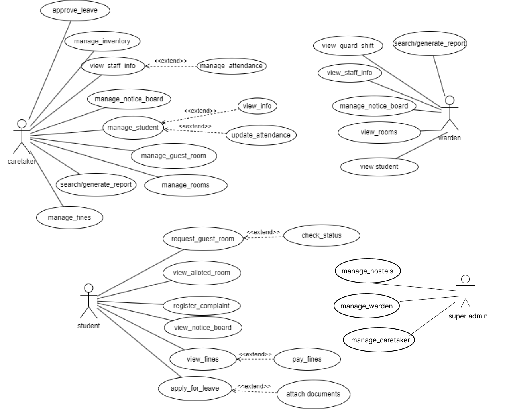
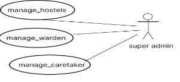

# Authentication Module Documentation

## Table of Contents
- [User-Centered Design (UCD)](#user-centered-design-ucd)
- [SRS Application](#srs-app)
- [SRS Web Interface](#srs-web-interface)
- [API Specifications](#api-specifications)
- [UI for Application](#ui-for-application)
- [UI for Web](#ui-for-web)
- [Database Schema](#database-schema)

## User-Centered Design (UCD)

## SRS App
**SRS APP**

**Revision History**

|**Name**|**Date**|**Reason for Changes**|**Version**|
| - | - | - | - |
|HM\_1.0|23, March 2023|Initial SRS|V1.0|

|**Name**|**Date**|**Reason for Changes**|**Version**|
| - | - | - | - |
|SA\_1|21th,Jan 2024|Updated SRS|V2.0|

**TEAM MEMBERS**:

21BCS144 -Deven Nehete (Lead)

21BCS123 -Mahadevu Sai Ravi Kishor Naidu 21BCS138 -Saurabh Nagpure

21BCS165 -Priya Murmu

21BCS198 -Shuvam Patra 21BCS221-Jyotsna Telgote

**1.Introduction**

1. **Introduction about the Fusion – A brief Description**

FusionIIIT stands as a testament to the seamless integration and automation of diverse functions within PDPM Indian Institute of Information Technology, Design and Manufacturing, Jabalpur. Crafted with precision using Python 3.8 and powered by the Django Web framework, this initiative is a student-driven endeavor designed to elevate the institute's operational landscape. Encompassing everything from efficient administration management to academic prowess and miscellaneous departmental tasks, FusionIIIT is a holistic solution that harmonizes the intricacies of campus life.

Imagine it as a digital wizard that takes care of everything, from organizing the administrative stuff to making academics smoother. It's not just limited to the usual tasks; FusionIIIT jumps into various departments and sections, making sure every corner of campus life runs smoothly.

In the admin side, it handles the complicated paperwork and processes. For academics, it brings a digital touch, making learning and managing courses easier. But it doesn't stop there; FusionIIIT is like a friendly companion for all the different parts of the campus, making sure everything works well.

In simpler terms, FusionIIIT is not just a tool – it's a helpful friend, making life at PDPM IIITDM Jabalpur more organized and enjoyable for everyone

2. **Purpose of the module :**

SA-1-Hostel Management Module is software designed to manage different activities related to the hostels’activities of PDPM IIITDM Jabalpur. The software is designed to provide a platform for Warden,Caretaker and Students to interact mutually and perform different necessary functions.The different activities that come under the

SA-1- Hostel Management module are view staff information, check & book guest room, view &edit guards shift,manage attendance of students,display notices to manage hostel related activities and many more.

3. **Scope of the module**

The user’s of this module will be the Warden/Caretaker/Student. This software system will be

both a web and app based system to be used by the

users.

Interface will enable the **Warden** to view staff’s info, **Caretaker** to create notice, check guest room, check attendance, view & edit guards shift and **Students** to get notice, book guest room and many more functions.

**References**

- Staff Member of Hostel
- Professor Dr.Atul Gupta Associate Professor, Head of Computer Sc. & Engineering, Indian Institute of Information Technology Design and

  Manufacturing, Jabalpur.

**2.User/Actor Description(characteristics)**

1. **Warden**

The warden, as a key actor in the Hostel Management System, plays a central role in overseeing various aspects to ensure a well-organized and secure living environment for students. He can view guard & staff info ,students and rooms info, can send notice to everyone and can view messages from caretakers as well.Here is a brief overview of the functionalities associated with the warden.

**Specific Functionalities:**

- **guard information:**: Allows the warden to access information about the guards, ensuring awareness of security personnel and their schedules.
- **Viewing Staff Information**: Provides the warden with the ability to view information about hostel staff, facilitating communication and coordination.
- **Managing Notice Board**: Empowers the warden to manage and update the hostel notice board, including sending notices to everyone.
- **Viewing Rooms**: Permits the warden to access information about hostel rooms, aiding in oversight and organization.
- **Viewing Student Information**: Provides the warden with the ability to access information about students, fostering an understanding of the resident population.
- **Searching and Generating Reports**: Enables the warden to search for specific information and generate reports, supporting informed decision-making and analysis.
2. **Caretaker**

Caretaker(s) who will be present at hostel 24/7 will also be given necessary functions to perform in the Hostel management system.He can view guard’s shift, allotted rooms to students, can verify booking of guest room, can manage(view,edit) attendance of students,approve students leave requests,view hostel inventory,impose fines on students and can send notice to everyone and can view notice from warden as well.Here is a brief overview of the functionalities associated with the Caretaker.

**Specific Functionalities:**

- **Approving Leave:** Allows the caretaker to review and approve leave requests submitted by students through the portal.
- **Managing Inventory:** Permits the caretaker to oversee and manage the hostel inventory efficiently.
- **Viewing Staff info:** Provides access to information about hostel staff, facilitating effective communication and coordination.
- **Managing Notice Board:** Enables the caretaker to manage and update the hostel notice board, including sending notices to everyone and viewing notices from the warden.
- **Managing students:** Empowers the caretaker to oversee and manage various aspects related to student activities and information.
- **Managing guest room:** Allows the caretaker to verify and manage the booking of guest rooms, ensuring a smooth and organized reservation process.
- **Managing rooms:** Provides the caretaker with the ability to view and manage the allocation of rooms to students.
- **Managing fines:** Allows the caretaker to impose fines on students for any violations or infractions, maintaining discipline.
- **Searching generated report:** Enables the caretaker to search for specific information and generate reports, facilitating data-driven decision-making and analysis.
3. **Student**

Students will be main stakeholders in this management system and most of the services/automation provided by this hostel management system are mostly intended for the use of students.Students will be at home page after logging in with user id and password, proceeding further to the portal where he can view notice boards, allotted rooms to students and can book guest rooms as well.Students can also register a complaint,apply for leave and also view the fines imposed on them.

**Specific Functionalities:**

- **Viewing Allotted Room:** Allows students to access information regarding the hostel room allotted to them upon logging into the portal.
- **Requesting Guest Room:** Permits students to request and book guest rooms through the portal for specific durations.
- **Registering Complaint:** Enables students to register complaints, addressing any concerns or issues they may encounter in the hostel.
- **Viewing Notice Board:** Provides students with the ability to access and view important notices and announcements on the hostel notice board.
- **VIewing fines:** Allows students to review any fines imposed on them, providing transparency in financial matters related to hostel management.
- **Applying for Leave:** Facilitates the process for students to apply for leave directly through the portal, streamlining communication with hostel authorities.
- **Viewing Attendance:** Permits students to view their attendance records, offering insights into their presence within the hostel premises.
4. **Super Admin**

The Super Admin is the most privileged admin who oversees the important actions like allotting wardens and caretakers for each of hostels (who in turn manage students) and also adding/deleting hostels from the Hostel Management System when new hostels/old hostels are constructed/deprecated respectively.

**Specific Functionalities:**

- **Manage Hostels:** Can Add/Delete Hostels from the existing database when new hostels/old hostels are added/deprecated respectively.This gives more flexibility without making the Hostel Management system obsolete over each passing year.
- **Manage Wardens:** Super Admin can manage wardens(add,delete,update) for each hostel after each consecutive year (or) whenever necessary.
- **Manage Caretaker:** Super Admin can manage caretakers(add,delete,update) for each hostel after each consecutive year (or) whenever necessary.

**Assumptions and Dependencies**

We assume that the warden, caretaker and student of their respective hostel will be given the user id and password by the admin which will be the same across the entire fusion portal.

**3.Functional Requirements**

**3.1. Use Case Diagram**

**3.2-Use Case Description**

***Student***

**request\_guest\_room:**

|UC ID|UC#1|
| - | - |
|Use case Name|request\_guest\_room|
|Description|This use case shows that the students can book the guest rooms.|
|Actor|Students|
|Precondition|Student must be logged in and the room should be available to book|
|Main Flow|
1) Students check the availability of rooms .

2) If available, students will request for room.
|
|Post Conditions|Notification to caretaker|
|Alternet Flow|Not Applicable|
|Sub Flow|Not Applicable|
|Global Alternate Flow|Not Applicable|

**view\_alloted\_room:**

|UC ID|UC#2|
| - | - |
|Use case Name|view\_alloted\_room|
|Description|Students can view their allotted room from the list.|
|Actor|Student|
|Precondition|Students must be logged in.|
|Main Flow|
1) Accesses the "View Allotted Room" section.

2) Students select the hostel and they can see their name in the list.
|
|Post Conditions|Not Applicable|
|Alternet Flow|Not Applicable|
|Sub Flow|Not Applicable|
|Global Alternate Flow|Not Applicable|

**register\_complaint:**

|UC ID|UC#3|
| - | - |
|Use case Name|register\_complaint|
|Description|The student reports any issues or concerns related to hostel facilities, maintenance, or other grievances.|
|Actor|Students|
|Precondition|Students must be logged in.|
|Main Flow|
1. Navigate to the "Register Complaint" section.

2. Describe the complaint and submit it.
|
|Post Conditions|Not Applicable|
|Alternet Flow|Not Applicable|
|Sub Flow|Not Applicable|
|Global Alternate Flow|Not Applicable|

**view\_notice\_board:**

|UC ID|UC#4|
| - | - |
|Use case Name|view\_notice\_board|
|Description|The student can access and view important notices and announcements posted by the caretaker or warden.|
|Actor|Student|
|Precondition|Students must be logged in.|
|Main Flow|1\.Visits the "View Notice Board" section.|
|Post Conditions|Not Applicable|
|Alternet Flow|Not Applicable|
|Sub Flow|Not Applicable|
|Global Alternate Flow|Not Applicable|

**view\_fines:**

|UC ID|UC#5|
| - | - |
|Use case Name|view\_fines|
|Description|The student can check and view any fines imposed on them for rule violations or overdue payments.|
||Student|
|Precondition|Students must be logged in.|
|Main Flow|
1\. Navigate to the "View Fines" section.

**[A1]**
|
|Post Conditions|Not Applicable|
|Alternet Flow|[A1] Students pay the fine.|
|Sub-Flow|Not Applicable|
|Global Alternate Flow|Not Applicable|

**apply\_for\_leave:**

|UC ID|UC#6|
| - | - |
|Use case Name|apply\_for\_leave|
|Description|Student can apply for leave|
|Actor|Student|
|Precondition|Students must be logged in.|
|Main Flow|1\. Requests leave through the system[A1]|
|Post Conditions|Not Applicable|
|Alternet Flow|[A1] Student attach the required documents for leave|
|Sub Flow|Not Applicable|
|Global Alternate Flow|Not Applicable|

***Caretaker:***

**approve\_leave:**

|UC ID|UC#7|
| - | - |
|Use case Name|approve\_leave|
|Description|The caretaker reviews and approves leave applications submitted by students.|
|Actor|Caretaker|
|Precondition|Caretaker must login first.|
|Main Flow|Accesses the "Approve Leave" section. Reviews leave applications and takes appropriate action.|
|Post Conditions|
Caretaker will either approve or reject the leave

According to that student will get notification
|
|Alternate Flow|If the caretaker needs additional information to approve the leave, the system prompts the caretaker to request more details.|
|Sub Flow|The caretaker can leave comments when approving or denying leave.|
|Global Alternate Flow|Not Applicable|

**manage\_inventory:**

|UC ID|UC#8|
| - | - |
|Use case Name|manage\_inventory|
|Description|The caretaker manages the hostel's inventory, including tracking and updating stock levels of essential items.|
|Actor|Caretaker|
|Precondition|The caretaker is logged into the system.|
|Main Flow|
Navigates to the "Manage Inventory" section.

Updates inventory records as needed.
|
|Post Conditions|The leave application is approved or denied, and the student is notified.|
|Alternate Flow|If an item is out of stock, the system notifies the caretaker to reorder or update the inventory status.|
|Sub Flow||
|Global Alternate Flow||
**manage\_notice\_board:**

|UC ID|UC#9|
| - | - |
|Use case Name|manage\_notice\_board|
|Description|The caretaker can create, edit, and delete notices on the hostel's notice board.|
|Actor|Caretaker, Warden|
|Precondition|The caretaker is logged into the system.|
|Main Flow|
Accesses the "Manage Notice Board" section.

Creates, edits, or deletes notices.
|
|Post Conditions|Notices on the notice board are created, edited, or deleted as per caretaker's actions.|
|Alternate Flow|If there is an issue saving the notice, the system prompts the caretaker to try again.|
|Sub Flow||
|Global Alternate Flow||
**manage\_student:**

|UC ID|UC#10|
| - | - |
|Use case Name|manage\_student|
|Description|The caretaker can add, edit, or remove student information from the hostel database.|
|Actor|Caretaker|
|Precondition|The caretaker is logged into the system.|
|Main Flow|
Navigates to the "Manage Student" section.

Adds, edits, or removes student records.
|
|Post Conditions|Student records are added, edited, or removed based on the caretaker's actions.|
|Alternate Flow|If there is an error in updating student records, the system notifies the caretaker and suggests corrective actions.|
|Sub Flow||
|Global Alternate Flow||
**Manage Guest Room:**

|UC ID|UC#11|
| - | - |
|Use case Name|manage\_guest\_room|
|Description|The caretaker handles guest room requests, allocates rooms, and maintains records of guest stays.|
|Actor|Caretaker|
|Precondition|The caretaker is logged into the system.|
|Main Flow|
Accesses the "Manage Guest Room" section.

Allocates rooms and manages guest stay records.
|
|Post Conditions|Guest room allocation and related records are updated.|
|Alternate Flow|If there is a conflict in guest room allocation, the system prompts the caretaker to resolve the conflict manually.|
|Sub Flow|NIL|
|Global Alternate Flow|NIL|

**manage\_rooms:**

|UC ID|UC#12|
| - | - |
|Use case Name|manage\_rooms|
|Description|The caretaker oversees the allocation and management of regular hostel rooms.|
|Actor|Caretaker|
|Precondition|The caretaker is logged into the system.|
|Main Flow|Navigates to the "Manage Rooms" section. Allocates rooms and manages room-related information.|
|Post Conditions|Regular room allocations and related information are updated.|
|Alternate Flow|If there is an error in updating room information, the system notifies the caretaker and suggests corrective actions.|
|Sub Flow|Not Applicable|
|Global Alternate Flow|Not Applicable|

**search/generate\_report:**

|UC ID|UC#13|
| - | - |
|Use case Name|search/generate\_report|
|Description|The caretaker can search and generate reports related to various hostel activities and records.|
|Actor|Caretaker, Warden|
|Precondition|The caretaker is logged into the system.|
|Main Flow|
Accesses the "Search/Generate Report" section.

Specifies search criteria and generates reports.
|
|Post Conditions|Reports are generated based on the specified search criteria.|
|Alternate Flow|If there are no results for the specified search criteria, the system displays a message indicating no data found.|
|Sub Flow|Not Applicable|
|Global Alternate Flow|Not Applicable|

**manage\_fines:**

|UC ID|UC#14|
| - | - |
|Use case Name|manage\_fines|
|Description|The caretaker can add, edit, or remove fines imposed on students for rule violations.|
|Actor|Caretaker|
|Precondition|The caretaker is logged into the system.|
|Main Flow|Navigates to the "Manage Fines" section. Manages fines for rule violations.|
|Post Conditions|Fines for rule violations are added, edited, or removed.|
|Alternate Flow|If there is an error in adding or updating fines, the system notifies the caretaker and suggests corrective actions.|
|Sub Flow|Not Applicable|
|Global Alternate Flow|Not Applicable|

**view\_staff\_info:**

|UC ID|UC#15|
| - | - |
|Use case Name|view\_staff\_info|
|Description|The caretaker can view information about hostel staff members.|
|Actor|Caretaker, Warden|
|Precondition|The caretaker is logged into the system.|
|Main Flow|Accesses the "View Staff Info" section.|
|Post Conditions|The caretaker can view information about hostel staff.|
|Alternate Flow|If there is an issue retrieving staff information, the system displays an error message.|
|Sub Flow|Not Applicable|
|Global Alternate Flow|Not Applicable|

***Warden***

**view\_guard\_shift:**

|UC ID|UC#16|
| - | - |
|Use case Name|view\_guard\_shift|
|Description|The warden can view shifts of guards for duty.|
|Actor|Warden|
|Precondition|The warden is logged into the system.|
|Main Flow|
1\. Warden goes to view the guard shift

section.
|
|Post Conditions|Not Applicable|
|Alternate Flow|Not Applicable|
|Sub Flow|Not Applicable|
|Global Alternate Flow|Warden can return to dashboard.|

**view\_rooms:**

|UC ID|UC#17|
| - | - |
|Use case Name|view\_rooms|
|Description|The warden can view room details of students of his hostel.|
|Actor|Warden|
|Precondition|The warden is logged into the system.|
|Main Flow|
1\. The Warden goes to the view rooms

section. [GA1]
|
|Post Conditions|Not Applicable|
|Alternate Flow|Not Applicable|
|Sub Flow|Not Applicable|
|Global Alternate Flow|GA1: Warden can return to the dashboard.|

**view\_student:**

|UC ID|UC#18|
| - | - |
|Use case Name|view\_student|
|Description|The warden can view details of students of his hostel.|
|Actor|Warden|
|Precondition|The warden is logged into the system.|
|Main Flow|
1\. Warden goes to view the guard shift

section.
|
|Post Conditions|Not Applicable|
|Alternate Flow|Not Applicable|
|Sub Flow|Not Applicable|
|Global Alternate Flow|Warden can return to the dashboard.|

***Super Admin-***

**manage\_hostel:**

|UC ID|UC#19|
| - | - |
|Use case Name|manage\_hostel|
|Description|Super Admin can add/delete hostels from the existing database when new hostels/old hostels are added/deprecated respectively.This gives more flexibility without making the Hostel Management system obsolete over each passing year.|
|Actor|Super Admin|
|Precondition|The super admin must be logged into the system. and have appropriate administrative privileges.|
|Main Flow|Will be able to add/delete list of hostels from the database whenever necessary according to the needs.|
|Post Conditions|Not Applicable|
|Alternate Flow|Not Applicable|
|Sub Flow|Not Applicable|
|Global Alternate Flow||
**manage\_warden:**

|UC ID|UC#20|
| - | - |
|Use case Name|manage\_warden|
|Description|Super Admin can manage wardens(add,delete,update) for each hostel after each consecutive year (or) whenever necessary.|
|Actor|Super Admin|
|Precondition|The super admin must be logged into the system. and have appropriate administrative privileges.|
|Main Flow|Will be able to update(add/delete) the warden for each allotted hostel|
|Post Conditions|The new &old wardens will receive notification informing the change|
|Alternate Flow|Not Applicable|
|Sub Flow|Not Applicable|
|Global Alternate Flow||
**Manage warden**

**manage\_caretaker:**

|UC ID|UC#21|
| - | - |
|Use case Name|manage\_caretaker|
|Description|Super Admin can manage caretakers(add,delete,update) for each hostel after each consecutive year (or) whenever necessary.|
|Actor|Super Admin|
|Precondition|The super admin must be logged into the system. and have appropriate administrative privileges.|
|Main Flow|Will be able to update(add/delete) the caretaker(s) for each allotted hostel|
|Post Conditions|The new &old caretakers will receive notification informing the change|
|Alternate Flow|Not Applicable|
|Sub Flow|Not Applicable|
|Global Alternate Flow||
3. **Other Functional Requirements**
   - Since each room in each hostel may be accommodating a different number of students,So Caretaker must be given flexibility in the software to allot as many students as possible in a single room with his own discretion.
   - When new hostels are constructed and existing once are deprecated/renovated,the Superadmin must be having the flexibility to add and delete hostels based on the requirements
- Students must get notification each time when fine is imposed on them without rate limit.
- The Warden/caretaker can schedule Events and meetings for students and display them in the notice board and also can view the staff’s detail and view their working shifts and also view students info along with their allocated rooms.

This module will be a platform for caretaker and warden to function daily official tasks in a smooth working environment; he will have an eagle eye on every staff member, guards of hostel and student profile as well. This will also provide a platform to students as well to connect with the caretaker and warden of their respective hostel.

4. **Other constraints**
- There is exactly only 1warden for each hostel.
- There can be more than one caretaker but atleast 1caretaker for each hostel.
1. **User Interfaces**

The user interface should comply with the color scheming and

dashboard design of the FUSION IIT. Users should be able to navigate from one functionality to another. Inter module navigation should be smooth. All the functionalities should be easy to use and no specific training should be required for the usage of the module

2. **Tech Stack Used**

   The system will be interacting with a database written in Django (Python Framework) and also be using PostgreSQL will be working on web browsers like Google Chrome, Mozilla Firefox, Safari etc.The mobile app version will be developed using Flutter UI SDK to work cross-platform on both android and IOS mobile devices.

3. **Business rules (if any)**

Once the fine amount fees are imposed on the student,the student should be able to appeal to the respective caretaker/warden only once to negotiate the issue for any mis-communication.

4. **Non- Functional Requirements**
1. **Performance:**
- Objective: The system must promptly respond to user interactions.
- Measures:
  - Response Time: Response time for all actions should be minimal to enhance user experience.
  - Inventory Updates: Swift updates to inventory to reflect real-time changes.
  - Notifications: Instant delivery of notifications to users.
2. **Scalability:**
- Objective: The system should effectively handle a large number of concurrent users.
- Measures:
  - Load Testing: Evaluate system performance under increasing load conditions.
  - Concurrency: Ensure seamless operation with a high volume of

    users simultaneously interacting with the system.

3. **Availability:**
- Objective: The system should be available 99.9% of the time.
- Measures:
  - Uptime Monitoring: Regularly monitor system uptime to ensure it meets the specified availability percentage.
  - Redundancy: Implement redundancy measures to minimize downtime in case of server failures or maintenance.
4. **Security:**
- Objective: Ensure data confidentiality and integrity. Implement role-based authorization for secure user actions.
- Measures:
  - Data Encryption: Employ encryption techniques to protect sensitive information during transmission and storage(hashing).
  - Access Controls: Implement role-based access controls to restrict users to actions relevant to their roles.
  - Audit Trails: Maintain logs to track user activities, facilitating accountability and identifying potential security issues.
5. **Module dependencies with other fusion modules**
1. **UI Level**

   **Warden Interface**

Warden will be at home page after logging in with user id and password, proceeding further to the portal where he can view guard & staff info,students and rooms info, can send notice to everyone and can view messages from caretaker as well.

**Caretaker Interface**

Caretaker will be at home page after logging in with user id and password, proceeding further to portal where he can view guard’s shift, allotted rooms to students, can verify booking of guest room, can manage(view,edit) attendance of students,approve students leave requests,view hostel inventory,impose fines on students and can send notice to everyone and can view notice from warden as well.

**Student Interface**

Students will be at home page after logging in with user id and password, proceeding further to the portal where he can view notice boards, allotted rooms to students and can book guest rooms as well.Students can also register a complaint,apply for leave and also view the fines imposed on them.

**Super Admin Interface**

Super Admin will be at home page after logging in with his/her user id and password, proceeding further to the portal where he can manage hostels,wardens and caretakers.This makes the automation complete in the Hostel Management Module.

2. **DB Level Dependencies**

   DB tables that Hostel Management module depends upon:

From Globals module :

- ExtraInfo
- Stuff
- Faculty
- Staff

From Academic\_info module :

- Student
3. **Module Level Dependencies**
- Other Modules which are used in our hostel management system.
1) Globals
   1) ExtraInfo
   1) Stuff
   1) Faculty
   1) Staff
   1) Complain
   2) Academic\_info

      a) Student

- Our Modules which are used and made in the backend.
1) Hall\_caretaker
1) Hall\_warden
1) Guest\_room\_detail
1) Guest\_room\_booking
4) Staff\_schedule
4) Hostel\_notice\_board
4) Hostel\_student\_attendance
4) Hall\_room
4) Worker\_report

## SRS Web Interface
Faculty Mentor: Dr. Vijaypal Singh Rathore

---

### TEAM MEMBERS:

- **ANKUSH MAJI** (21BCS025)
- **ANUJ PATEL** (21BCS027)
- **ANKIT KUMAR** (21BCS023)
- **AKSHAYKUMAR** (21BCS016)
- **ANIRUDDHADAS** (21BCS022)
- **NIMESH NIKHIL** (21BCS148) - [Team Mentor]

---

## 1. Introduction

### Purpose

HA-1 Hostel Management Module is software designed to manage the hostel-related activities at PDPM IIITDM Jabalpur. It provides automated features for the **Warden** and **Caretaker**, and serves as a platform for **Students** and **Hostel Staff** interactions. 

Key features:
- Viewing staff information
- Checking & booking guest rooms
- Viewing & editing guards' shifts
- Managing notices and attendance for hostel-related activities

### Module Scope

**Users:** Warden, Caretaker, and Students.  
**Platform:** Web-based system for the Warden to view staff info, for the Caretaker to manage notices, rooms, attendance, and shifts, and for Students to book rooms and receive updates.

### References

- Staff Members of the Hostel
- Residents of the Hostel

---

## 2. User/Actor Characteristics

### 1. Student

**Role:** Resident of a particular hostel, able to perform various hostel-related tasks.  
**Functionalities:**
- Book guest rooms
- View allotted room from the list
- Report issues or concerns by creating complaints
- View notices and announcements
- Check any fines imposed
- Apply for leave

### 2. Caretaker

**Role:** Manages hostel operations, including staff and residents.  
**Functionalities:**
- Approve leave applications
- Manage hostel inventory and stock levels
- View and manage staff attendance
- Create, edit, and delete notices
- Manage student records and guest room requests
- Allocate regular hostel rooms
- Generate reports on hostel activities
- Impose fines on students for rule violations

### 3. Warden

**Role:** Supervises the caretaker and oversees hostel operations.  
**Functionalities:**
- Create, edit, and delete notices
- Generate reports on hostel activities
- View staff information and guard shifts
- View student room details and information

---

## 3. Functional Requirements

### 1. Use Case Diagram

**SA1-Hostel Management**

### 2. Use Case Descriptions

| UC ID | UC#1 |
|-------|------|
| **Use Case Name** | `request_guest_room` |
| **Description** | Students can book guest rooms. |
| **Actor** | Students |
| **Precondition** | Student must be logged in, and the room should be available. |
| **Main Flow** | 1. Student checks room availability. 2. If available, student requests a room. [A1] |
| **Post Conditions** | Notification sent to the caretaker |
| **Alternate Flow** | [A1] Student can check the request status |
| **Sub Flow** | NIL |
| **Global Alternate Flow** | NIL |

| UC ID | UC#2 |
|-------|------|
| **Use Case Name** | `view_allotted_room` |
| **Description** | Students can view their allotted room from the list. |
| **Actor** | Student |
| **Precondition** | Students must be logged in. |
| **Main Flow** | 1. Access "View Allotted Room" section. 2. Select hostel to view name in the list. |
| **Post Conditions** | NIL |
| **Alternate Flow** | NIL |
| **Sub Flow** | NIL |
| **Global Alternate Flow** | NIL |

| UC ID | UC#3 |
|-------|------|
| **Use Case Name** | `register_complaint` |
| **Description** | Student reports issues related to hostel facilities or grievances. |
| **Actor** | Students |
| **Precondition** | Students must be logged in. |
| **Main Flow** | 1. Navigate to "Register Complaint" section. 2. Describe and submit complaint. |
| **Post Conditions** | NIL |
| **Alternate Flow** | NIL |
| **Sub Flow** | NIL |
| **Global Alternate Flow** | NIL |

(Additional use cases should follow similar formatting)

### 3.3 Other Functional Requirements

- This module will use the communication module for sending notifications and alerts to actors involved in complaint management, guest room booking, leave applications, etc.

### 3.4 Other Constraints

#### 1. User Interfaces

The user interface should follow the color scheme and dashboard design of FUSIONIIT. All functionalities should be easy to use and should not require specific training.

#### 2. Tech Stack

- **Backend:** Django
- **Database:** PostgreSQL

---

## 4. Non-Functional Requirements

### 1. Performance

The system should respond quickly to user actions, particularly for booking, inventory updates, and notifications.

### 2. Scalability

The system should support concurrent users and maintain performance under load.

### 3. Availability

The system should maintain 99.9% uptime.

### 4. Security

Role-based authorization will ensure that users can only perform actions relevant to their roles. Data confidentiality and integrity are essential.

---

## 5. Module Dependencies with Other Fusion Modules

### 1. Module Level Dependencies

The Hostel Management module depends on the following modules:
- **Globals**
- **Academic_info**

### 2. DB Level Dependencies

Hostel Management module relies on tables from:
- **Globals module:** `ExtraInfo`, `Faculty`, `Staff`
- **Academic_info module:** `Student`

## SRS Web Interface
- **Features:** Detailed features of the web interface.
- **Technical Specifications:** Technologies used, frameworks, etc.

## API Specifications
- **Endpoints:** List of API endpoints with descriptions.
- **Request/Response Formats:** Examples and schemas.
- **Authentication:** How APIs are secured.

## UI for Application
- **Design Principles:** Guidelines followed.
- **Screenshots:** Embedded images with descriptions.
- **User Flow:** How users navigate the application.

## UI for Web
- **Design Elements:** Colors, typography, etc.
- **Responsive Design:** How UI adapts to different devices.
- **Accessibility:** Compliance with accessibility standards.

## Database_\Schema
- **ER Diagrams:** Visual representation of the database.
- **Tables and Relationships:** Detailed descriptions.
- **Data Flow:** How data moves through the system.

## API Specifications
**Student Mentor:** Nimesh Nikhil (21BCS148)

## Overview of the module

The Hostel Management module is an integral part of our project, catering to students, caretakers, and wardens. For **students**, it offers streamlined functionalities like requesting guest rooms, managing allotted rooms, registering complaints, and accessing notices. **Caretakers** can efficiently handle tasks such as approving leave, managing inventory, and overseeing student-related information. **Wardens** have central oversight, managing guard shifts, notice boards, room assignments, and generating relevant reports. The module aims to enhance hostel administration by providing role-specific features, fostering efficient communication, and simplifying various management tasks. The implementation includes secure API endpoints to ensure a user-friendly and organized hostel management system.

### Main Actors
- Student
- Warden
- Caretaker
- Super Admin

### API Endpoints

1. **`/view_allotted_room/`**: (Partially Implemented)
   - Check Allotted Room

2. **`/view_notice_board/`**: (Yet to be Implemented)
   - Check Notice Board

3. **`/view_attendance/`**: (Yet to be Implemented)
   - Check Attendance

4. **`/request_guest_room/`**: (Yet to be Implemented)
   - Request For Guest Room

5. **`/view_fines/`**: (Yet to be Implemented)
   - View Fines

6. **`/register_complaint/`**: (Yet to be Implemented)
   - Register Complaint

7. **`/apply_for_leave/`**: (Yet to be Implemented)
   - Apply for leave

8. **`/pay_fines/`**: (Yet to be Implemented)
   - To pay due fines

9. **`/notice_form/`**: (Implemented)
   - Creates Notice

10. **`/delete_notice/`**: (Implemented)
    - Deletes notice

11. **`/edit_schedule/`**: (Partially Implemented)
    - Edit staff schedule

12. **`/delete_schedule/`**: (Implemented)
    - Delete staff schedule

13. **`/edit_student_room/`**: (Partially Implemented)
    - Edits student’s room info

14. **`/update_student_attendance/`**: (Partially Implemented)
    - Edits students attendance

15. **`/generate_report/`**: (Partially Implemented)
    - Generates PDF reports for worker

16. **`/approve_leave/`**: (Yet to be Implemented)

17. **`/manage_inventory/`**: (Yet to be Implemented)

18. **`/view_staff_info/`**: (Yet to be Implemented)

19. **`/manage_guest_room/`**: (Yet to be Implemented)

20. **`/view_guard_info/`**: (Yet to be Implemented)

21. **`/view_student_info/`**: (Not Implemented)

22. **`/view_guest_room/`**: (Yet to be Implemented)

23. **`/view_guest_room_request_status/`**: (Yet to be Implemented)

24. **`/manage_caretaker/`**: (Yet to be Implemented)

25. **`/manage_warden/`**: (Yet to be Implemented)

26. **`/manage_hostel/`**: (Yet to be Implemented)

27. **`/close_complaint/`**: (Yet to be Implemented)

28. **`/view_notices/`**: (Yet to be Implemented)

29. **`/view_rooms/`**: (Yet to be Implemented)

30. **`/apply_leave/`**: (Yet to be Implemented)

31. **`/manage_leaveForms/`**: (Yet to be Implemented)

32. **`/add_notice/`**: (Yet to be Implemented)

33. **`/edit_notice/`**: (Yet to be Implemented)

34. **`/update_fine_status/`**: (Yet to be Implemented)

35. **`/add_fines/`**: (Yet to be Implemented)

36. **`/manage_guest_room_request/`**: (Yet to be Implemented)

37. **`/update_student_info/`**: (Yet to be Implemented)

### Google Doc Link

[Google Doc](https://docs.google.com/document/d/1zUiXWSGCWVoCIzX6JtXA-Wx22zr8drphS18h65bsi2Y/edit)

## UI for Application
---

## 1. Module Description

The **Hostel Management module** is an integral part of our project, catering to students, caretakers, and wardens.  

For **students**, it offers streamlined functionalities like:
- Requesting guest rooms
- Managing allotted rooms
- Registering complaints
- Accessing notices

**Caretakers** can efficiently handle tasks such as:
- Approving leave
- Managing inventory
- Overseeing student-related information

**Wardens** have central oversight, managing:
- Guard shifts
- Notice boards
- Room assignments
- Generating relevant reports

The module aims to enhance hostel administration by providing role-specific features, fostering efficient communication, and simplifying various management tasks. The implementation includes secure API endpoints to ensure a user-friendly and organized hostel management system.

**Main Actors:**  
- Student  
- Warden  
- Caretaker  
- Super Admin  

---

## 2. Actors

### 2.1 Actor #1: Super Admin

The **Super Admin** is the most privileged actor who oversees key actions like:
- Allotting wardens and caretakers for each hostel
- Adding or deleting hostels when new ones are constructed or old ones are deprecated.

**Use Cases:**

**Figma Profile Link:**  
[Super Admin Figma Profile](https://www.figma.com/file/FhduHck6YGvPD5QMWWtRcf/Super-Admin-App?type=design&node-id=0%3A1&mode=design&t=cH1M8sh2wjlgrZWR-1)

---

### 2.2 Actor #2: Warden

The **Warden** plays a central role in ensuring a well-organized and secure living environment for students. Wardens can:
- View guard and staff info
- Access student and room information
- Send notices to everyone
- View messages from caretakers

**Use Cases:**

**Figma Profile Link:**  
[Warden Figma Profile](https://www.figma.com/file/dfM0T8XPDIFjSSSvn1IIQK/Warden-App?type=design&node-id=1%3A42&mode=design&t=2pwjF2v0JDy5befS-1)

---

### 2.3 Actor #3: Caretaker

**Caretakers** are present at the hostel 24/7 and have functions to perform in the Hostel Management System, such as:
- Viewing guard shifts and allotted rooms to students
- Verifying guest room bookings
- Managing student attendance
- Approving leave requests
- Viewing hostel inventory
- Imposing fines on students
- Sending notices and viewing notices from the warden

**Use Cases:**

**Figma Profile Link:**  
[Caretaker Figma Profile](https://www.figma.com/file/LbUctAiDyJQkLPR1HIxl0v/Caretaker-App?type=design&node-id=1%3A42&mode=design&t=ozqBmr2agLIOoFFd-1)

---

### 2.4 Actor #4: Student

**Students** are the main stakeholders in this management system. The system offers:
- Access to notice boards and room info
- Booking guest rooms
- Registering complaints
- Applying for leave
- Viewing fines imposed

**Use Cases:**

**Figma Profile Link:**  
[Student Figma Profile](https://www.figma.com/file/4Iah9qJxjh6IAt15YEzqlp/Student-App?type=design&node-id=0%3A1&mode=design&t=yhWf8N8k0FfF14PJ-1)

---

## Team Members

- **21BCS144 -** Deven Nehete (Lead)  
- **21BCS123 -** Mahadevu Sai Ravi Kishor Naidu  
- **21BCS138 -** Saurabh Nagpure  
- **21BCS165 -** Priya Murmu  
- **21BCS198 -** Shuvam Patra  
- **21BCS221 -** Jyotsna Telgote

## UI for Web
# Figma Profiles for Hostel Management (SA1) (Web)

---

## 1. Module Description

The **SA-1 Hostel Management Module** is software designed to manage various activities related to the hostels at PDPM IIITDM Jabalpur. It automates tasks for the **Warden** and **Caretaker**, providing a platform for interaction between students and hostel staff. The module covers activities such as:
- Viewing staff information
- Checking and booking guest rooms
- Managing guard shifts, notices, and attendance
- Overseeing hostel-related activities

---

## 2. Actors

### 2.1 Student

The **Student** can perform various tasks and formalities related to their hostel.

**Figma Profile:**  
[Student Figma Profile](#)

---

### 2.2 Warden

The **Warden** supervises the tasks of the caretaker and has access to information regarding staff and hostel residents.

**Figma Profile:**  
[Warden Figma Profile](#)

---

### 2.3 Caretaker

The **Caretaker** is responsible for the overall management of the hostel, including staff and residents. The caretaker can modify and view information related to both staff and residents.

**Figma Profile:**  
[Caretaker Figma Profile](#)

---

### 2.4 Super Admin

The **Super Admin** assigns hostels to specific batches, and is responsible for assigning wardens to specific hostels and caretakers to specific batches.

**Figma Profile:**  
[Super Admin Figma Profile](#)

## Database Schema

## Database Documentation of  
### SA1 - Hostel Management 4.0

---

### Module Name: SA-1_Hostel Management
**Faculty Mentor:** Dr. Vijaypal Singh Rathor  
**Student Mentor:** Deven Nehete (21BCS144)

---

## Overview of the Module

The **Hostel Management module** is an integral part of our project, catering to students, caretakers, and wardens.  

For **students**, it offers streamlined functionalities like:
- Requesting guest rooms
- Managing allotted rooms
- Registering complaints
- Accessing notices

**Caretakers** can efficiently handle tasks such as:
- Approving leave
- Managing inventory
- Overseeing student-related information

**Wardens** have central oversight, managing:
- Guard shifts
- Notice boards
- Room assignments
- Generating relevant reports

The module aims to enhance hostel administration by providing role-specific features, fostering efficient communication, and simplifying various management tasks. The implementation includes secure API endpoints to ensure a user-friendly and organized hostel management system.

**Main Actors:**  
- Student  
- Warden  
- Caretaker  
- Super Admin  

---

### Important Links

- **SRS Document:** [View SRS](https://docs.google.com/document/d/1A61b0hwB2ZueUbpyadJo38HNc4TSlm5bdOkrjfIgtSI/edit)  
- **ER Diagram:** [View ER Diagram](https://drive.google.com/file/d/15236s9zFE6XwPiCxfUev5SNTsXuIPvRp/view?usp=drive_link)  
- **Database_Schema Info:** [View Schema](https://docs.google.com/spreadsheets/d/1lEYs4ftbAvHYfYuI432x-bnjfoBrlhCy/edit?usp=drive_link&ouid=109045340837729900356&rtpof=true&sd=true)  

---

### Changes Required in the Current Database Tables

1. **`hallroom` Table**
   - **Roll No.**  
     - **Change:** Add a new column for roll number  
     - **Justification:** A new table `studentinfo` has been added to fetch data regarding the student’s hostel and room allotment.
   - **Student Name**  
     - **Change:** Add a new column for student name  
     - **Justification:** Fetch data for the `studentinfo` table.

2. **`hostelallotment` Table**
   - **Assigned Caretaker**  
     - **Change:** Add a new column for assigned caretaker  
     - **Justification:** A new use case `manageCaretaker` has been introduced.
   - **Assigned Warden**  
     - **Change:** Add a new column for assigned warden  
     - **Justification:** A new use case `manageWarden` has been introduced.

---

## Data Availability for API and Functional Testing

### D.1 Tables Already Populated:
- `hallroom`
- `hall`
- `hallcaretaker`
- `Staffschedule`
- `Hostelnoticeboard`
- `workerReport`

### D.2 Tables Required to be Populated:
- `GuestRoomBooking`
- `hallwarden`
- `guestroomdetails`
- `Studentattendance`
- `RegisterComplaint`
- `Hostelfines`
- `Hostelleave`
- `Hostelinventory`
- `Studentinfo`
- `Guardshift`

---

## Team Members

- **21BCS144 -** Deven Nehete (Lead)  
- **21BCS123 -** Mahadevu Sai Ravi Kishor Naidu  
- **21BCS138 -** Saurabh Nagpure  
- **21BCS165 -** Priya Murmu  
- **21BCS198 -** Shuvam Patra  
- **21BCS221 -** Jyotsna Telgote