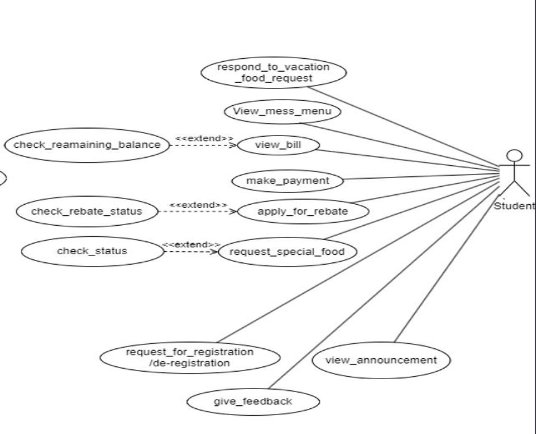
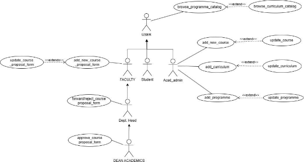
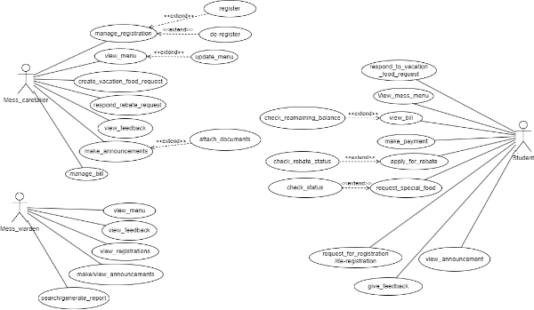
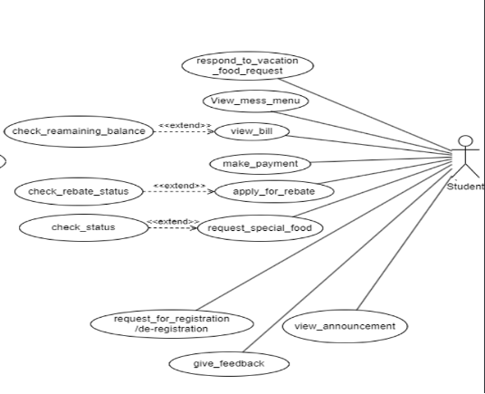
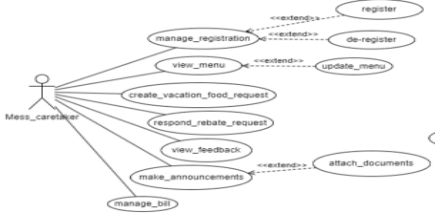
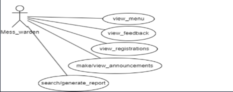
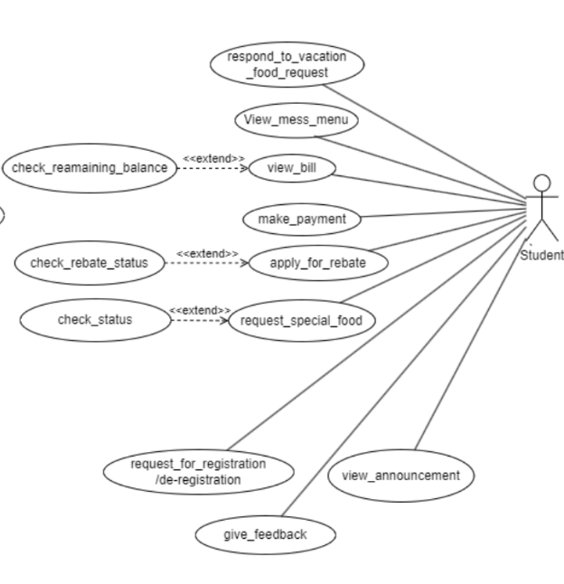
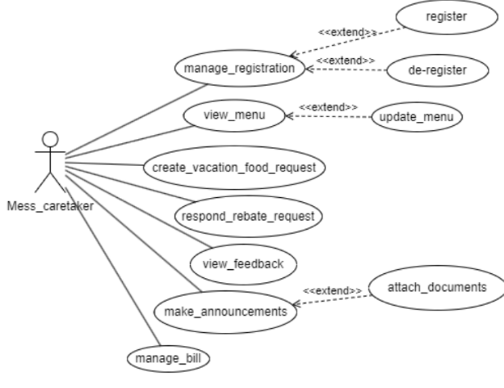

# Authentication Module Documentation

## Table of Contents
- [User-Centered Design (UCD)](#user-centered-design-ucd)
- [SRS Application](#srs-application)
- [SRS Web Interface](#srs-web-interface)
- [API Specifications](#api-specifications)
- [UI for Application](#ui-for-application)
- [UI for Web](#ui-for-web)
- [Database Schema](#database-schema)

## User-Centered Design (UCD)

.png)

## SRS Application

**Faculty Mentor:**

Dr. Vijaypal Singh Rathor 

**Team Mentor:**

Gaurang Bhutani - [21BCS085](mailto:21bcs085@iiitdmj.ac.in)

**Team Members:**

Chandrashekhar Gouda - [21BCS064 ](mailto:21bcs064@iiitdmj.ac.in)Manish Kumar - [21BCS128](mailto:21bcs128@iiitdmj.ac.in)

Manoj Kumar - [21BCS129 ](mailto:21bcs129@iiitdmj.ac.in)Mohammad Adil - [21BCS133 ](mailto:21bcs133@iiitdmj.ac.in)Navneet - [21BCS143](mailto:21bcs143@iiitdmj.ac.in)

**Fusion ERP**

1. **Introduction**
1. **Introduction about the Fusion – A brief Description**

FusionIIIT stands as a testament to the seamless integration and automation of diverse functions  within  PDPM  Indian  Institute  of  Information  Technology,  Design  and Manufacturing, Jabalpur. Crafted with precision using Flutter and a client-optimized programming language named ‘Dart’ , this initiative is a student-driven endeavor designed to elevate the institute's operational landscape. Encompassing everything from efficient administration management to academic prowess and miscellaneous departmental tasks, FusionIIIT is a holistic solution that harmonizes the intricacies of campus life.

Imagine  it  as  a  digital  wizard  that  takes  care  of  everything,  from  organizing  the administrative stuff to making academics smoother and making mess management easy. It's not just limited to the usual tasks; FusionIIIT jumps into various departments and sections, making sure every corner of campus life runs smoothly.

In  the  admin  side,  it  handles  the  complicated  paperwork  and  processes.  For academics, it brings a digital touch, making learning and managing courses easier. But it doesn't stop there; FusionIIIT is like a friendly companion for all the different parts of the campus, making sure everything works well.

In simpler terms, FusionIIIT is not just a tool – it's a helpful friend, making life at PDPM IIITDM Jabalpur more organized and enjoyable for everyone.

2. **Purpose of the module**

This document outlines the requirements for the "Central Mess Management System" integrated into the Institute's ERP. The primary goal of our software is to streamline and automate the operations of the Central Mess, offering a sophisticated platform for seamless interaction between users and administrators. It will elaborate on the system's purpose, features, interfaces, functionalities, operational constraints, and the nature of interactions within the system.

3. **Scope of the module**

The module is developed for the convenience of registered students, the Mess Caretaker, the Mess Warden, and Students at PDPM IIITDM Jabalpur. It’s an Android application dedicated to the efficient management of the institute’s mess.

Students can leverage the app to  sign in, browse the menu, apply for leave, order special request meals or , submit feedback, and view announcements.

The app’s administrative capabilities include tracking student bills, refreshing the menu, monitoring stock and budget details, overseeing guest entries, and addressing student requests.

This module is designed to simplify mess operations, enable remote access to its services, and foster better communication among stakeholders. A relational database will handle data management, storing details such as menu items, bills, student IDs, consumption data, and feedback.

2. **User/Actor Description(characteristics)**
1) **Mess\_caretaker**:

` `The Mess\_caretaker is responsible for the overall management of the mess. ***Functionalities*:**

- Manages registration and de-registration of students.
- Views and updates the menu.
- Creates vacation food requests and responds to rebate requests.
- Views feedback and makes announcements.
- Manages bills.

2) **Mess\_warden**:

` `The Mess\_warden oversees the operations of the mess and has access to various reports and feedback.

***Functionalities*:**

- Views the menu, feedback, registrations, and announcements.
- Make announcements.
- Searches or generates reports.

3) **Student**:

` `The Student is the user of the mess services and has various options for interaction with the system.

***Functionalities*:**

- Registers, de-registers, checks remaining balance, views bill, makes payment, applies for rebate, checks rebate status, requests special food and checks its status.
- Responds to vacation food requests.
- Views mess menu and announcements.
- Requests for registration/deregistration and gives feedback.

3. **Functional Requirements**
1. **Use case Diagram**

2. **Use case description:**
- **Use case description for Student is listed below:**

`   `**Use case #1**

<table><tr><th colspan="1"><b>UC ID</b></th><th colspan="2">UC#1</th></tr>
<tr><td colspan="1"><b>Use case Name</b></td><td colspan="2" valign="top"><b>view_menu</b></td></tr>
<tr><td colspan="1" valign="top"><b>Description</b></td><td colspan="2">The "<b>view_menu</b>" use case allows the Student to view the mess menu for both Mess-1 and Mess-2 through the Fusion portal.</td></tr>
<tr><td colspan="1"><b>Actor</b></td><td colspan="2"><b>Student</b></td></tr>
<tr><td colspan="1"><b>Precondition</b></td><td colspan="2">The actor should be logged in into the system.</td></tr>
<tr><td colspan="1" rowspan="4" valign="top"><b>Main Flow</b></td><td colspan="1">1</td><td colspan="1">The actor navigates to the "Mess Menu" section.</td></tr>
<tr><td colspan="1">2</td><td colspan="1">The system displays the option to select the Mess for which the menu is to be displayed. </td></tr>
<tr><td colspan="1">3</td><td colspan="1">The actor selects a mess to view the menu.</td></tr>
<tr><td colspan="1">4</td><td colspan="1">The actor can view or download  the menu of the selected mess.</td></tr>
<tr><td colspan="1"><b>Post conditions</b> </td><td colspan="2" valign="top">NIL</td></tr>
<tr><td colspan="1"><b>Alternate Flow</b></td><td colspan="2" valign="top">NIL</td></tr>
<tr><td colspan="1"><b>Sub Flow</b></td><td colspan="2">NIL</td></tr>
<tr><td colspan="1"><b>Global Alternate Flow</b></td><td colspan="1" valign="top">GA1</td><td colspan="1" valign="top">The actor returns to the main screen.</td></tr>
</table>

**Use case #2**

<table><tr><th colspan="1"><b>UC ID</b></th><th colspan="2">UC#2</th></tr>
<tr><td colspan="1"><b>Use case Name</b></td><td colspan="2" valign="top"><b>view_announcement</b></td></tr>
<tr><td colspan="1" valign="top"><b>Description</b></td><td colspan="2">The "<b>view_announcement</b>" use case allows the Student to view the announcements through the Fusion portal.</td></tr>
<tr><td colspan="1"><b>Actor</b></td><td colspan="2"><b>Student</b></td></tr>
<tr><td colspan="1"><b>Precondition</b></td><td colspan="2">The actor should be logged in into the system.</td></tr>
<tr><td colspan="1" rowspan="2" valign="top"><b>Main Flow</b></td><td colspan="1">1</td><td colspan="1">The actor navigates to the "Announcements" section.</td></tr>
<tr><td colspan="1">2</td><td colspan="1">The actor views the announcements sorted date wise.</td></tr>
<tr><td colspan="1"><b>Post conditions</b> </td><td colspan="2" valign="top">NIL</td></tr>
<tr><td colspan="1"><b>Alternate Flow</b></td><td colspan="2" valign="top">NIL</td></tr>
<tr><td colspan="1"><b>Sub Flow</b></td><td colspan="2">NIL</td></tr>
<tr><td colspan="1"><b>Global Alternate Flow</b></td><td colspan="1" valign="top">GA1</td><td colspan="1" valign="top">The actor returns to the main screen.</td></tr>
</table>

`  `**Use case #3**

<table><tr><th colspan="1"><b>UC ID</b></th><th colspan="3">UC#3</th></tr>
<tr><td colspan="1"><b>Use case Name</b></td><td colspan="3" valign="top"><b>request_special_food</b></td></tr>
<tr><td colspan="1" valign="top"><b>Description</b></td><td colspan="3">The "<b>request_special_food</b>" use case allows the Student to request special foods on different occasions through the Fusion portal.</td></tr>
<tr><td colspan="1"><b>Actor</b></td><td colspan="3"><b>Student</b></td></tr>
<tr><td colspan="1"><b>Precondition</b></td><td colspan="3">The actor should be logged in into the system.</td></tr>
<tr><td colspan="1" rowspan="4" valign="top"><b>Main Flow</b></td><td colspan="1">1</td><td colspan="2">The actor navigates to the "Request Special Food" section.</td></tr>
<tr><td colspan="1">2</td><td colspan="2">The actor selects the “Request Special Food” option to request.</td></tr>
<tr><td colspan="1">3</td><td colspan="2">The actor fills the form and submits.</td></tr>
<tr><td colspan="1">4</td><td colspan="2">The actor can check the status of previous requests. [<b>A1</b>].</td></tr>
<tr><td colspan="1"><b>Post conditions</b> </td><td colspan="3" valign="top">NIL</td></tr>
<tr><td colspan="1" rowspan="2" valign="top"><b>Alternate Flow</b></td><td colspan="1" rowspan="2" valign="top">A1</td><td colspan="1" valign="top">1</td><td colspan="1" valign="top">The actor navigates to the “Request History” option.</td></tr>
<tr><td colspan="1" valign="top">2</td><td colspan="1" valign="top">The system displays the list of previous requests and their statuses.</td></tr>
</table>

|**Sub Flow**|NIL||
| - | - | :- |
|**Global Alternate Flow**|GA1|The actor returns to the main screen.|

**Use case #4**

<table><tr><th colspan="1"><b>UC ID</b></th><th colspan="2">UC#4</th></tr>
<tr><td colspan="1"><b>Use case Name</b></td><td colspan="2" valign="top"><b>give_feedback</b></td></tr>
<tr><td colspan="1" valign="top"><b>Description</b></td><td colspan="2">The student can give feedback for the services provided by the mess and also view previous feedback.</td></tr>
<tr><td colspan="1"><b>Actor</b></td><td colspan="2"><b>Student</b></td></tr>
<tr><td colspan="1"><b>Precondition</b></td><td colspan="2">The student must be logged in.</td></tr>
<tr><td colspan="1" rowspan="3" valign="top"><b>Main Flow</b></td><td colspan="1">1</td><td colspan="1">The student clicks on the ‘Feedback’ button.</td></tr>
<tr><td colspan="1">2</td><td colspan="1">The student fills in the feedback form and submits it.</td></tr>
<tr><td colspan="1">3</td><td colspan="1">The student can view the previous feedback.</td></tr>
<tr><td colspan="1"><b>Post conditions</b></td><td colspan="2">The feedback details are added in the database and are notified to the mess warden and mess caretaker.</td></tr>
<tr><td colspan="1"><b>Alternate Flow</b></td><td colspan="2" valign="top">NIL</td></tr>
<tr><td colspan="1"><b>Sub Flow</b></td><td colspan="2">NIL</td></tr>
<tr><td colspan="1"><b>Global Alternate Flow</b></td><td colspan="1" valign="top">GA1</td><td colspan="1" valign="top">The actor returns to the main screen abandoning any intermediate operation.</td></tr>
</table>

`  `**Use case #5**

<table><tr><th colspan="1"><b>UC ID</b></th><th colspan="2">UC#5</th></tr>
<tr><td colspan="1"><b>Use case Name</b></td><td colspan="2" valign="top"><b>request_registration/deregistration</b></td></tr>
<tr><td colspan="1" valign="top"><b>Description</b></td><td colspan="2">The <b>"request_registration/deregistration</b>" use case allows the Student to request register/deregister to mess through the Fusion portal.</td></tr>
<tr><td colspan="1"><b>Actor</b></td><td colspan="2"><b>Student</b></td></tr>
<tr><td colspan="1"><b>Precondition</b></td><td colspan="2">The actor should be logged in into the system.</td></tr>
<tr><td colspan="1" rowspan="4" valign="top"><b>Main Flow</b></td><td colspan="1">1</td><td colspan="1">The actor navigates to the "Register/Deregister" section.</td></tr>
<tr><td colspan="1">2</td><td colspan="1">The system displays to select register and make payment [<b>UC#8</b>] if they are deregistered and deregister if they are registered.</td></tr>
<tr><td colspan="1">3</td><td colspan="1">The actor selects register to register in mess and deregister to deregister in central mess.</td></tr>
<tr><td colspan="1">4</td><td colspan="1">The actor views their status.</td></tr>
<tr><td colspan="1"><b>Post</b> </td><td colspan="2">The register/deregister request will be sent to the mess caretaker.</td></tr>
</table>

|**conditions** |||
| - | :- | :- |
|**Alternate Flow**|NIL||
|**Sub Flow**|NIL||
|**Global Alternate Flow**|GA1|The actor returns to the main screen.|

` `**Use case #6**

<table><tr><th colspan="1"><b>UC ID</b></th><th colspan="2">UC#6</th></tr>
<tr><td colspan="1"><b>Use case Name</b></td><td colspan="2" valign="top"><b>view_bill</b></td></tr>
<tr><td colspan="1" valign="top"><b>Description</b></td><td colspan="2">The student gets to view the bill for the month and also the positive remaining balance.</td></tr>
<tr><td colspan="1"><b>Actor</b></td><td colspan="2"><b>Student</b> </td></tr>
<tr><td colspan="1"><b>Precondition</b></td><td colspan="2">The actor must be logged in.</td></tr>
<tr><td colspan="1" rowspan="4" valign="top"><b>Main Flow</b></td><td colspan="1">1</td><td colspan="1">The actor clicks on the “Mess Bill”.</td></tr>
<tr><td colspan="1">2</td><td colspan="1">A list is displayed on the screen.</td></tr>
<tr><td colspan="1">3</td><td colspan="1">The actor can view their monthly bill.</td></tr>
<tr><td colspan="1">4</td><td colspan="1">The bill details for the month and positive balance (if any) are displayed.</td></tr>
<tr><td colspan="1"><b>Post conditions</b></td><td colspan="2" valign="top">NIL</td></tr>
<tr><td colspan="1"><b>Alternate Flow</b></td><td colspan="2" valign="top">NIL</td></tr>
<tr><td colspan="1"><b>Sub Flow</b></td><td colspan="2">NIL</td></tr>
<tr><td colspan="1"><b>Global Alternate Flow</b></td><td colspan="1" valign="top">GA1</td><td colspan="1" valign="top">The actor returns to the main screen.</td></tr>
</table>

**Use case #7**

<table><tr><th colspan="1"><b>UC ID</b></th><th colspan="2">UC#7</th></tr>
<tr><td colspan="1"><b>Use case Name</b></td><td colspan="2" valign="top"><b>apply_for_rebate</b></td></tr>
<tr><td colspan="1" valign="top"><b>Description</b></td><td colspan="2">The student can fill a leave application form stating the duration and purpose of leave which will be approved/rejected by the mess caretaker.</td></tr>
<tr><td colspan="1"><b>Actor</b></td><td colspan="2"><b>Student</b> </td></tr>
<tr><td colspan="1"><b>Precondition</b></td><td colspan="2">The actor must be logged in.</td></tr>
<tr><td colspan="1" rowspan="2" valign="top"><b>Main Flow</b></td><td colspan="1">1</td><td colspan="1">The student clicks on the ‘Apply for Rebate’ button</td></tr>
<tr><td colspan="1">2</td><td colspan="1">A leave application form is displayed.</td></tr>
</table>

<table><tr><th colspan="1" rowspan="2"></th><th colspan="1">3</th><th colspan="2">The actor fills in the necessary details and submits it.</th></tr>
<tr><td colspan="1">4</td><td colspan="2">The actor can view the status of previous rebates. [A1]</td></tr>
<tr><td colspan="1"><b>Post conditions</b></td><td colspan="3">The leave request details are added in the database and are notified to the mess caretaker.</td></tr>
<tr><td colspan="1" rowspan="2"><b>Alternate Flow</b></td><td colspan="1" rowspan="2">A 1</td><td colspan="1">1</td><td colspan="1">The actor navigates to the “Rebate History” section.</td></tr>
<tr><td colspan="1">2</td><td colspan="1">The system displays the previous rebate requests along with the status.</td></tr>
<tr><td colspan="1"><b>Sub Flow</b></td><td colspan="3">NIL</td></tr>
<tr><td colspan="1"><b>Global Alternate Flow</b></td><td colspan="1">G A 1</td><td colspan="2" valign="top">The actor returns to the main screen.</td></tr>
</table>

**Use case #8**

<table><tr><th colspan="1"><b>UC ID</b></th><th colspan="2">UC#8</th></tr>
<tr><td colspan="1"><b>Use case Name</b></td><td colspan="2" valign="top"><b>make_payment</b></td></tr>
<tr><td colspan="1"><b>Description</b></td><td colspan="2">The student can make payment  on the dashboard.</td></tr>
<tr><td colspan="1"><b>Actor</b></td><td colspan="2"><b>Student</b> </td></tr>
<tr><td colspan="1"><b>Precondition</b></td><td colspan="2">The actor must be logged in.</td></tr>
<tr><td colspan="1" rowspan="2" valign="top"><b>Main Flow</b></td><td colspan="1">1</td><td colspan="1">The actor clicks on “Make Payment”.</td></tr>
<tr><td colspan="1">2</td><td colspan="1">The system gets redirected to the Payment Gateway Portal.</td></tr>
<tr><td colspan="1"><b>Post conditions</b></td><td colspan="2" valign="top">The changes made should get reflected on the system.</td></tr>
<tr><td colspan="1"><b>Alternate Flow</b></td><td colspan="2">NIL</td></tr>
<tr><td colspan="1"><b>Sub Flow</b></td><td colspan="2">NIL</td></tr>
<tr><td colspan="1"><b>Global Alternate Flow</b></td><td colspan="1">GA 1</td><td colspan="1" valign="top">The actor returns to the main screen.</td></tr>
</table>

**Use case #9**

<table><tr><th colspan="1"><b>UC ID</b></th><th colspan="2">UC#9</th></tr>
<tr><td colspan="1"><b>Use case Name</b></td><td colspan="2" valign="top"><b>respond_to_vacation_food_request</b></td></tr>
<tr><td colspan="1" valign="top"><b>Description</b></td><td colspan="2">The "<b>respond_to_vacation_food_request</b>" use case to respond  to the vacation food request through the Fusion portal in vacation.</td></tr>
<tr><td colspan="1"><b>Actor</b></td><td colspan="2"><b>Student</b></td></tr>
<tr><td colspan="1"><b>Precondition</b></td><td colspan="2">The actor should be logged in into the system.</td></tr>
<tr><td colspan="1" rowspan="2" valign="top"><b>Main Flow</b></td><td colspan="1">1</td><td colspan="1">The actor responds based on their availability.</td></tr>
<tr><td colspan="1">2</td><td colspan="1">The actor will be registered in the mess during vacation after a positive response.</td></tr>
<tr><td colspan="1"><b>Post</b> </td><td colspan="2">NIL</td></tr>
</table>

|**conditions** |||
| - | :- | :- |
|**Alternate Flow**|NIL||
|**Sub Flow**|NIL||
|**Global Alternate Flow**|GA1|The actor returns to the main screen.|

- **Use case description for Mess Caretaker is listed below:**

**Use case #10**

<table><tr><th colspan="1"><b>UC ID</b></th><th colspan="2">UC#10</th></tr>
<tr><td colspan="1"><b>Use case Name</b></td><td colspan="2"><b>respond_rebate_request</b></td></tr>
<tr><td colspan="1"><b>Description</b></td><td colspan="2">Mess Caretaker handles the rebate requests.</td></tr>
<tr><td colspan="1"><b>Actor</b></td><td colspan="2"><b>Mess Caretaker</b></td></tr>
<tr><td colspan="1"><b>Precondition</b></td><td colspan="2">The actor must be logged in.</td></tr>
<tr><td colspan="1" rowspan="2" valign="top"><b>Main Flow</b></td><td colspan="1">1</td><td colspan="1">The caretaker clicks on the “Rebate Requests”.</td></tr>
<tr><td colspan="1" valign="top">2</td><td colspan="1">A list of students is displayed who had applied for rebate, along with approve or deny options.</td></tr>
<tr><td colspan="1" valign="top"><b>Post conditions</b></td><td colspan="2">The rebate requests of the students will be approved or denied by the caretaker. </td></tr>
<tr><td colspan="1" valign="top"><b>Alternate Flow</b></td><td colspan="2" valign="top">NIL</td></tr>
<tr><td colspan="1"><b>Sub Flow</b></td><td colspan="2">NIL</td></tr>
<tr><td colspan="1"><b>Global Alternate Flow</b></td><td colspan="1">GA 1</td><td colspan="1" valign="top">The actor returns to the main screen.</td></tr>
</table>

**Use case #11**

<table><tr><th colspan="1"><b>UC ID</b></th><th colspan="2">UC#11</th></tr>
<tr><td colspan="1"><b>Use case Name</b></td><td colspan="2" valign="top"><b>make_announcements</b></td></tr>
<tr><td colspan="1"><b>Description</b></td><td colspan="2">Mess Caretaker makes an announcement.</td></tr>
<tr><td colspan="1"><b>Actor</b></td><td colspan="2"><b>Mess Caretaker</b></td></tr>
<tr><td colspan="1"><b>Precondition</b></td><td colspan="2">The actor must be logged in.</td></tr>
<tr><td colspan="1" rowspan="2" valign="top"><b>Main Flow</b></td><td colspan="1">1</td><td colspan="1">The caretaker clicks on the “Make Announcements”.</td></tr>
<tr><td colspan="1">2</td><td colspan="1">Fill the form displayed and click ‘make announcement’..</td></tr>
</table>

|**Post conditions**|The new announcements are added to the database and are notified to the students and the Mess Warden.||
| :- | :- | :- |
|**Alternate Flow**|NIL||
|**Sub Flow**|NIL||
|**Global Alternate Flow**|GA1|The actor returns to the main screen.|

<table><tr><th colspan="1"><b>UC ID</b></th><th colspan="2">UC#12</th></tr>
<tr><td colspan="1"><b>Use case Name</b></td><td colspan="2"><b>manage_bill</b></td></tr>
<tr><td colspan="1"><b>Description</b></td><td colspan="2">Mess Caretaker manages the bill.</td></tr>
<tr><td colspan="1"><b>Actor</b></td><td colspan="2"><b>Mess Caretaker</b></td></tr>
<tr><td colspan="1"><b>Precondition</b></td><td colspan="2">The actor must be logged in.</td></tr>
<tr><td colspan="1" rowspan="3" valign="top"><b>Main Flow</b></td><td colspan="1">1</td><td colspan="1">The actor clicks on the ‘Manage Bill’ button.</td></tr>
<tr><td colspan="1" valign="top">2</td><td colspan="1">The system displays the list of registered students along with their corresponding mess bill.</td></tr>
<tr><td colspan="1">3\.</td><td colspan="1">The actor can send the corresponding mess bill to respective students.</td></tr>
<tr><td colspan="1"><b>Post conditions</b></td><td colspan="2">The changes made are reflected on the system.</td></tr>
<tr><td colspan="1" valign="top"><b>Alternate Flow</b></td><td colspan="2" valign="top">NIL</td></tr>
<tr><td colspan="1" valign="top"><b>Sub Flow</b></td><td colspan="2" valign="top">NIL</td></tr>
<tr><td colspan="1"><b>Global Alternate Flow</b></td><td colspan="1" valign="top">GA1</td><td colspan="1" valign="top">The actor returns to the main screen.</td></tr>
</table>

**Use Case#12 Use case #13**

<table><tr><th colspan="1"><b>UC ID</b></th><th colspan="2">UC#13</th></tr>
<tr><td colspan="1"><b>Use case Name</b></td><td colspan="2"><b>manage_registration</b></td></tr>
<tr><td colspan="1" valign="top"><b>Description</b></td><td colspan="2">The user gets to login and avail the facilities of the web based mess management system.  </td></tr>
<tr><td colspan="1"><b>Actor</b></td><td colspan="2"><b>Mess Caretaker</b></td></tr>
<tr><td colspan="1"><b>Precondition</b></td><td colspan="2">The actor must be logged in </td></tr>
<tr><td colspan="1" rowspan="3" valign="top"><b>Main Flow</b></td><td colspan="1">1</td><td colspan="1">The actor clicks the  Registrations  button.</td></tr>
<tr><td colspan="1" valign="top">2</td><td colspan="1">The system displays the list of requests by students to get registered/ deregistered students.</td></tr>
<tr><td colspan="1">3</td><td colspan="1">The actor can accept/reject the requests.[A1]</td></tr>
<tr><td colspan="1"><b>Post conditions</b></td><td colspan="2">Session starts for the logged in user.</td></tr>
<tr><td colspan="1" rowspan="2" valign="top"><b>Alternate Flow</b></td><td colspan="1" valign="top">A1</td><td colspan="1">
The student is prompted to

Enter the login details again. (mismatch credentials)
</td></tr>
<tr><td colspan="1">A2</td><td colspan="1">The user returns to initial screen (cancel)</td></tr>
<tr><td colspan="1"><b>Sub Flow</b></td><td colspan="1"></td><td colspan="1">NIL</td></tr>
</table>

|**Global Alternate Flow**|GA1|The actor returns to the main screen.|
| :- | - | - |

**Use case #14**

|**UC ID**|**UC#14**||
| - | - | :- |
|**Use case Name**|**create\_vacation\_food\_request**||
|**Description**|Mess Caretaker create for food request in vacation||
|**Actor**|**Mess Caretaker**||
|**Precondition**|The actor must be logged in.||
|**Main Flow**|1|The actor clicks on the ‘Create Food Request’ button.|
|**Post conditions**|The students respond to vacation food requests  by the actor according to their availability. ||
|**Alternate Flow**||NIL|
|**Sub Flow**||NIL|
|**Global Alternate Flow**|GA 1|The actor returns to the main screen.|

**Use case #15**

<table><tr><th colspan="1"><b>UC ID</b></th><th colspan="2">UC#15</th></tr>
<tr><td colspan="1"><b>Use case Name</b></td><td colspan="2"><b>view_feedback</b></td></tr>
<tr><td colspan="1" valign="top"><b>Description</b></td><td colspan="2">The "View Feedback" use case allows the Mess Caretaker to view the feedback by the students for both Mess-1 and Mess-2 through the Fusion portal.</td></tr>
<tr><td colspan="1"><b>Actor</b></td><td colspan="2"><b>Mess Caretaker</b></td></tr>
<tr><td colspan="1"><b>Precondition</b></td><td colspan="2">The actor should be logged in into the system.</td></tr>
<tr><td colspan="1" rowspan="3" valign="top"><b>Main Flow</b></td><td colspan="1">1</td><td colspan="1">The actor navigates to the "View Feedback" section.</td></tr>
<tr><td colspan="1">2</td><td colspan="1">The system displays the list of all the feedback. </td></tr>
<tr><td colspan="1">3</td><td colspan="1">The actor can select any feedback and review it.</td></tr>
<tr><td colspan="1"><b>Post conditions</b> </td><td colspan="2">NIL</td></tr>
<tr><td colspan="1"><b>Alternate Flow</b></td><td colspan="2">NIL</td></tr>
<tr><td colspan="1"><b>Sub Flow</b></td><td colspan="2">NIL</td></tr>
<tr><td colspan="1"><b>Global Alternate Flow</b></td><td colspan="1" valign="top">GA1</td><td colspan="1" valign="top">The actor returns to the main screen.</td></tr>
</table>

**Use case #16**

|**UC ID**|UC#16|
| - | - |

<table><tr><th colspan="1"><b>Use case Name</b></th><th colspan="3" valign="top"><b>view_menu</b></th></tr>
<tr><td colspan="1" valign="top"><b>Description</b></td><td colspan="3">The "View Menu" use case allows the Mess Caretaker to view the mess menu for both Mess-1 and Mess-2 through the Fusion portal.</td></tr>
<tr><td colspan="1"><b>Actor</b></td><td colspan="3"><b>Mess Caretaker</b></td></tr>
<tr><td colspan="1"><b>Precondition</b></td><td colspan="3">The actor should be logged in into the system.</td></tr>
<tr><td colspan="1" rowspan="5" valign="top"><b>Main Flow</b></td><td colspan="1">1</td><td colspan="2">The actor navigates to the "Mess Menu" section.</td></tr>
<tr><td colspan="1">2</td><td colspan="2">The system displays the option to select either the Mess for which the menu is to be displayed.</td></tr>
<tr><td colspan="1">3</td><td colspan="2">The actor selects a mess to view the menu.</td></tr>
<tr><td colspan="1">4</td><td colspan="2">The actor views or downloads the menu of the selected mess.</td></tr>
<tr><td colspan="1">5</td><td colspan="2">The actor can also update the menu. [A1] </td></tr>
<tr><td colspan="1"><b>Post conditions</b> </td><td colspan="3" valign="top">NIL</td></tr>
<tr><td colspan="1" rowspan="3" valign="top"><b>Alternate Flow</b></td><td colspan="1" rowspan="3" valign="top">A 1</td><td colspan="1" valign="top">1</td><td colspan="1" valign="top">The actor navigates  to the “Update Menu” option.</td></tr>
<tr><td colspan="1" valign="top">2</td><td colspan="1" valign="top">The system displays a form for updating the menu.</td></tr>
<tr><td colspan="1" valign="top">3</td><td colspan="1" valign="top">The actor fills the form and submits it to update the menu.</td></tr>
<tr><td colspan="1"><b>Sub Flow</b></td><td colspan="3">NIL</td></tr>
<tr><td colspan="1" valign="top"><b>Global Alternate Flow</b></td><td colspan="1" valign="top">G A 1</td><td colspan="2" valign="top">The actor returns to the main screen.</td></tr>
</table>

- **Use case description for Mess Warden is listed below:**

**Use case #17**

<table><tr><th colspan="1"><b>UC ID</b></th><th colspan="2">UC#17</th></tr>
<tr><td colspan="1"><b>Use case Name</b></td><td colspan="2" valign="top"><b>view_menu</b></td></tr>
<tr><td colspan="1" valign="top"><b>Description</b></td><td colspan="2">The "<b>view_menu</b>" use case allows the Mess Warden to view the mess menu for both Mess-1 and Mess-2 through the Fusion portal.</td></tr>
<tr><td colspan="1"><b>Actor</b></td><td colspan="2"><b>Mess Warden</b></td></tr>
<tr><td colspan="1"><b>Precondition</b></td><td colspan="2">The actor should be logged in into the system.</td></tr>
<tr><td colspan="1" rowspan="4" valign="top"><b>Main Flow</b></td><td colspan="1">1</td><td colspan="1">The actor navigates to the "Menu Menu" section.</td></tr>
<tr><td colspan="1">2</td><td colspan="1">The system displays the option to select either the Mess for which the menu is to be displayed. </td></tr>
<tr><td colspan="1">3</td><td colspan="1">The actor selects a mess to view the menu.</td></tr>
<tr><td colspan="1">4</td><td colspan="1">The actor views or downloads the menu of the selected mess.</td></tr>
<tr><td colspan="1"><b>Post conditions</b> </td><td colspan="2" valign="top">NIL</td></tr>
<tr><td colspan="1"><b>Alternate</b> </td><td colspan="2">NIL</td></tr>
</table>

|**Flow**|||
| - | :- | :- |
|**Sub Flow**|NIL||
|**Global Alternate Flow**|GA 1|The actor returns to the main screen.|

**Use case #18**

<table><tr><th colspan="1"><b>UC ID</b></th><th colspan="2">UC#18</th></tr>
<tr><td colspan="1"><b>Use case Name</b></td><td colspan="2"><b>view_feedback</b></td></tr>
<tr><td colspan="1" valign="top"><b>Description</b></td><td colspan="2">The "<b>view_feedback</b>" use case allows the Mess Warden to view the feedback by the students for both Mess-1 and Mess-2 through the Fusion portal.</td></tr>
<tr><td colspan="1"><b>Actor</b></td><td colspan="2"><b>Mess Warden</b></td></tr>
<tr><td colspan="1"><b>Precondition</b></td><td colspan="2">The actor should be logged in into the system.</td></tr>
<tr><td colspan="1" rowspan="3" valign="top"><b>Main Flow</b></td><td colspan="1">1</td><td colspan="1">The actor navigates to the "Feedbacks" section.</td></tr>
<tr><td colspan="1">2</td><td colspan="1">The system displays the list of all the feedbacks. </td></tr>
<tr><td colspan="1">3</td><td colspan="1">The actor can select any feedback and review it.</td></tr>
<tr><td colspan="1"><b>Post conditions</b> </td><td colspan="2" valign="top">NIL</td></tr>
<tr><td colspan="1"><b>Alternate Flow</b></td><td colspan="2">NIL</td></tr>
<tr><td colspan="1"><b>Sub Flow</b></td><td colspan="2">NIL</td></tr>
<tr><td colspan="1" valign="top"><b>Global Alternate Flow</b></td><td colspan="1" valign="top">GA1</td><td colspan="1" valign="top">The actor returns to the main screen.</td></tr>
</table>

**Use case #19**

<table><tr><th colspan="1"><b>UC ID</b></th><th colspan="2">UC#19</th></tr>
<tr><td colspan="1"><b>Use case Name</b></td><td colspan="2" valign="top"><b>view_registrations</b></td></tr>
<tr><td colspan="1" valign="top"><b>Description</b></td><td colspan="2">The "<b>view_registrations</b>" use case allows the Mess Warden to view the registrations done by the students of all the programs for both Mess-1 and Mess- 2 through the Fusion portal.</td></tr>
<tr><td colspan="1"><b>Actor</b></td><td colspan="2"><b>Mess Warden</b></td></tr>
<tr><td colspan="1"><b>Precondition</b></td><td colspan="2">The actor should be logged in into the system.</td></tr>
<tr><td colspan="1" rowspan="4" valign="top"><b>Main Flow</b></td><td colspan="1">1</td><td colspan="1">The actor navigates to the "Registrations" section.</td></tr>
<tr><td colspan="1">2</td><td colspan="1">The system displays the option to select mess and program to view registrations. </td></tr>
<tr><td colspan="1">3</td><td colspan="1">The actor can select any mess and program to view the registration.</td></tr>
<tr><td colspan="1">4</td><td colspan="1">The system displays the total registrations in a filtered manner.</td></tr>
</table>

|**Post conditions** |NIL||
| :- | - | :- |
|**Alternate Flow**|NIL||
|**Sub Flow**|NIL||
|**Global Alternate Flow**|GA 1|The actor returns to the main screen.|

**Use case #20**

<table><tr><th colspan="1"><b>UC ID</b></th><th colspan="2">UC#20</th></tr>
<tr><td colspan="1"><b>Use case Name</b></td><td colspan="2" valign="top"><b>make/view_announcements</b></td></tr>
<tr><td colspan="1" valign="top"><b>Description</b></td><td colspan="2">The "<b>make/view_announcements</b>" use case allows the Mess Warden to view or create announcements through the Fusion portal.</td></tr>
<tr><td colspan="1"><b>Actor</b></td><td colspan="2"><b>Mess Warden</b></td></tr>
<tr><td colspan="1"><b>Precondition</b></td><td colspan="2">The actor should be logged in into the system.</td></tr>
<tr><td colspan="1" rowspan="4" valign="top"><b>Main Flow</b></td><td colspan="1">1</td><td colspan="1">The actor navigates to the "Announcements" section.</td></tr>
<tr><td colspan="1">2</td><td colspan="1">The system displays the option to view and make announcements. </td></tr>
<tr><td colspan="1">3</td><td colspan="1">The actor can view all the announcements created till that point of time.</td></tr>
<tr><td colspan="1">4</td><td colspan="1">The actor can also create a new announcement.</td></tr>
<tr><td colspan="1"><b>Post conditions</b> </td><td colspan="2">A new announcement will get added to the list of announcements if the warden chooses to create a new announcement</td></tr>
<tr><td colspan="1"><b>Alternate Flow</b></td><td colspan="2" valign="top">NIL</td></tr>
<tr><td colspan="1"><b>Sub Flow</b></td><td colspan="2">NIL</td></tr>
<tr><td colspan="1" valign="top"><b>Global Alternate Flow</b></td><td colspan="1" valign="top">GA1</td><td colspan="1" valign="top">The actor returns to the main screen.</td></tr>
</table>

**Use case #21**

|**UC ID**|UC#21|
| - | - |
|**Use case Name**|**search/generate\_report**|
|**Description**|The "**search/generate\_report**" use case allows the Mess Warden to view the  final report of the month of mess inventory and other expenses.|

<table><tr><th colspan="1"><b>Actor</b></th><th colspan="2"><b>Mess Warden</b></th></tr>
<tr><td colspan="1"><b>Precondition</b></td><td colspan="2">The actor should be logged in into the system.</td></tr>
<tr><td colspan="1" rowspan="4" valign="top"><b>Main Flow</b></td><td colspan="1">1</td><td colspan="1">The actor navigates to the "Generate Report" section.</td></tr>
<tr><td colspan="1">2</td><td colspan="1">The system displays the option to select a mess and a program to view registration, expenses. </td></tr>
<tr><td colspan="1">3</td><td colspan="1">The actor can select any mess and program to view the report of expenses , student’s registration etc .</td></tr>
<tr><td colspan="1">4</td><td colspan="1">The system displays the report in a filtered manner.</td></tr>
<tr><td colspan="1"><b>Post conditions</b> </td><td colspan="2" valign="top">NIL</td></tr>
<tr><td colspan="1"><b>Alternate Flow</b></td><td colspan="2" valign="top">NIL</td></tr>
<tr><td colspan="1"><b>Sub Flow</b></td><td colspan="2">NIL</td></tr>
<tr><td colspan="1" valign="top"><b>Global Alternate Flow</b></td><td colspan="1" valign="top">GA1</td><td colspan="1" valign="top">The actor returns to the main screen.</td></tr>
</table>

3. **Other Functional Requirements**
1. This module will make use of the communication module for sending notifications and alerts to various actors involved in the module suitably for registration, deregistration, any change in mess menu or any other important notice etc.
1. The  system  will  implement  role-based  dashboards  for  each  actor, displaying  relevant  information  based  on  the  user's  role  and  ensure customizability and responsiveness for various devices.
1. The Super admin of Fusion should be able to assign roles for mess caretaker, mess warden, mess committee(students).
1. Changes in the mess food price may be possible from time to time and the decision of the institute authorities.
4. **Other Constraints**
1. **User Interfaces**
- The user interface must align with the color scheme and dashboard design of FUSION IIIT.
- Inter-module navigation should be smooth and intuitive.
- All functionalities should be user-friendly, requiring no specific training for module usage.
2. **Tech Stack Used**
- **Flutter**: A UI software development toolkit developed by Google for creating natively compiled applications across various platforms.
- **Dart**: A client-optimized programming language used to write Flutter applications.
- **Git and GitHub**: Git is a version control system used to manage and track changes in the project codebase, while GitHub is a web-based hosting service that provides a platform for collaborative development using Git.
- **Visual Studio Code**: A lightweight and versatile code editor commonly used for developing Flutter applications, which offers extensive Flutter and Dart extensions for enhanced development capabilities.
- **(Optional)Android Studio**: An integrated development environment (IDE) provided by Google for developing Android applications. It also supports Flutter development with built-in Flutter and Dart plugins.
- **Flutter Packages**: Various open-source libraries and packages available from the Flutter community, which provide additional functionality and features to enhance the development process.
3. **Business Rules (if any)**
- If  the  remaining  positive  balance  is  less  than  the  monthly  bill,  the system will automatically deregister the student for the next month.
- If a student's balance becomes negative, the system will automatically deregister the student.
4. **Non-Functional Requirements**
1. **Performance:**

The  system  should  respond  quickly  to  user  interactions  related  to  mess booking, menu viewing, attendance tracking, and feedback submission.

Response  times  for  inventory  updates,  notifications,  and  student  bill processing should be optimized.

2. **Scalability:**

The system should be capable of handling a large number of concurrent users during peak times, such as meal hours ,mess advanced fee payment time.,vacation time.

Performance should be tested and evaluated under increasing loads to ensure smooth operation during high-traffic periods.

3. **Availability:**

The  central  mess  system  should  be  available  for  use  by  students,  Mess Caretaker, Mess Warden, and members of the Mess Committee 99.9% of the time.

Any scheduled maintenance or downtime should be communicated in advance to users.

4. **Security:**

Data  related  to  student  bills,student  personal  information,  attendance records, menu updates, and feedback should be kept confidential and secure.

Role-based  access  control  should  be  implemented  to  ensure  that  only authorized users can perform actions such as updating the menu, processing bills, or accessing sensitive data.

**5.Module dependencies with other fusion modules**

1. **UI Level**
- Integration into the Fusion portal, with a dedicated section for Mess Management.
- User-specific dashboards and interfaces tailored to each actor's role.
2. **DB Level Dependencies**
- Shared data related to students, mess menus, feedback, and financial transactions.
- Careful consideration of data ownership and access rights.
3. **Module Level Dependencies**
- Dependencies on the Notifications module for sending timely notifications.
- Interactions with the already existing Payment API for all Mess related transactions.

## SRS Web Interface
**Prepared by:**

**21BCS126-Mamidi Ravi Chendraa**

**21BCS066-Chilukuri Surya Manikanta Chowdary 21BCS082-G Srinath Reddy**

**21BCS081-Duggireddy Gnana Sainath Reddy 21BCS125-Maloth Ritesh Pragnu Naik 21BCS197-Shubh mehta (Student mentor)**

**Faculty Mentor - Dr. Vinod Kumar Jain (Head CSE)**

# **Introduction**
   ### **Introduction about the Fusion**
FusionIIIT stands as a testament to the seamless integration and automation of diverse functions within PDPM Indian Institute of Information Technology, Design and

Manufacturing, Jabalpur. Crafted with precision using Python 3.8 and powered by the Django Web framework, this initiative is a student-driven endeavor designed to elevate the institute's operational landscape. Encompassing everything from efficient administration management to academic prowess and miscellaneous departmental tasks, FusionIIIT is a holistic solution that harmonizes the intricacies of campus life.

Imagine it as a digital wizard that takes care of everything, from organizing the administrative stuff to making academics smoother. It's not just limited to the usual tasks; FusionIIIT jumps into various departments and sections, making sure every corner of campus life runs smoothly.

In the admin side, it handles the complicated paperwork and processes. For academics, it

brings a digital touch, making learning and managing courses easier. But it doesn't stop there; FusionIIIT is like a friendly companion for all the different parts of the campus, making sure everything works well.

In simpler terms, FusionIIIT is not just a tool – it's a helpful friend, making life at PDPM IIITDM Jabalpur more organized and enjoyable for everyone.

 #### **Purpose**
The objective of this module is to provide addition of new programmes and effective management of various curriculum for different programmes offered in institute. Each programme could update its curriculum for respective batch.

This module not only serves the above purpose but in addition to that , viewing the various programmes and curriculums, batches, disciplines offered in the institute is also provided along with viewing timetable and academic calendar too.

 #### **Product Scope**
The scope of the application covers the entire Programmes & its Curriculums offered by the Institute where the user can view their desired curriculum

,programme, discipline and batch,along with academic calendar and timetable.

# **User/Actor Description(characteristics)**
   1. ### **Student:**
Represents	individuals	who	intend	to	browse	program	catalog,	browsing curriculum catalog.

**Role:** can browse program catalog, browse curriculum catalog.
#### **Specific Functionalities:**
- Can Search specific programme, curriculum, courses, based on name or discipline.
- Can view course info in detail.
  1. ## **ACAD ADMINISTRATOR:**
Responsible for managing and updating information related to academic program and curriculum.

**Role:** Add and update programme , curriculum , courses .
#### **Specific Functionalities:**
- Can add or modify the contents of Programme , Curriculum , Courses.

1. ## **HEAD OF DEPARTMENT:**
Represents individuals who are the head of certain departments in the institute.

**Role:** Same as a User's roles and also forwards or rejects the course proposal form to the Dean of academics.
#### **Specific Functionalities:**
- Forwards/rejects the course proposal form to the dean academics.

1. ## **DEAN ACADEMICS:**
Represents an individual who is a high-ranked academic official and oversees all the major academic operations including curriculum, workloads, approval of courses,evaluating and supervising departments of the institute.

**Role:** Browse the program catalog, browse the curriculum catalog (same as a generic user) and also approve or reject the course proposal form.
#### **Specific Functionalities:**
- Approves or rejects the course proposal form.
  1. ## **FACULTY:**
Represents individuals who can view the current semester courses and can request for course addition/updation.

**Role:** Browse the program catalog, browse the curriculum catalog, and can apply for addition/modification of a course.
#### **Specific Functionalities:**
- Can apply for addition or modification of courses through the course proposal form.

1. # **Functional Requirements**

1. ### **Use case Diagram:**

1. #### **Use case Description:**

1. **Browse\_programme\_catalog**

<table><tr><th colspan="1" valign="top"><b>UCID</b></th><th colspan="2" valign="top"><b>UC#1</b></th></tr>
<tr><td colspan="1" valign="top"><b>Usecase name</b></td><td colspan="2" valign="top"><b>browse_programme_catalog</b></td></tr>
<tr><td colspan="1" valign="top"><b>Actor</b></td><td colspan="2" valign="top">

<b>Student, Acad Admin , HOD , Faculty , Dean</b>
</td></tr>
<tr><td colspan="1" valign="top"><b>Description</b></td><td colspan="2" valign="top">

<b>The user of the system can browse the available programme categorically.</b>
</td></tr>
<tr><td colspan="1" valign="top"><b>Pre Condition</b></td><td colspan="2" valign="top"><b>The User must be logged-in through their credentials</b></td></tr>
<tr><td colspan="1" rowspan="3" valign="top"><b>Main Flow</b></td><td colspan="1" valign="top"><b>1</b></td><td colspan="1" valign="top">

<b>The Actor logs into the system.</b>
</td></tr>
<tr><td colspan="1" valign="top"><b>2</b></td><td colspan="1" valign="top">

<b>The Actor then opens the Programme and Curriculum module.</b>
</td></tr>
<tr><td colspan="1" valign="top"><b>3</b></td><td colspan="1" valign="top">

<b>The Actor can see the available Programmes the Institute can offer.[S1]</b>
</td></tr>
<tr><td colspan="1" valign="top"><b>Sub flow</b></td><td colspan="2" valign="top"><b>Extend “browse_curriculum_catalogue”.</b></td></tr>
<tr><td colspan="1" valign="top"><b>Post Condition</b></td><td colspan="2" valign="top"><b>The necessary details of the Programmes are displayed.</b></td></tr>
</table>

1. **Browse\_curriculum\_catalog**

<table><tr><th colspan="1" valign="top"><b>UCID</b></th><th colspan="2" valign="top"><b>UC#2</b></th></tr>
<tr><td colspan="1" valign="top"><b>Usecase name</b></td><td colspan="2" valign="top"><b>Browse_curriculum_catalogue</b></td></tr>
<tr><td colspan="1" valign="top"><b>Actor</b></td><td colspan="2" valign="top">

<b>Student, Acad Admin , HOD , Faculty , Dean</b>
</td></tr>
<tr><td colspan="1" valign="top"><b>Description</b></td><td colspan="2" valign="top">

<b>The user of the system can browse the available curriculums categorically.</b>

[<b>https://www.iiitdmj.ac.in/academics/curriculum.php</b>](http://www.iiitdmj.ac.in/academics/curriculum.php)
</td></tr>
<tr><td colspan="1" valign="top"><b>Pre Condition</b></td><td colspan="2" valign="top"><b>The User must be logged-in through their credentials</b></td></tr>
<tr><td colspan="1" rowspan="4" valign="top"><b>Main Flow</b></td><td colspan="1" valign="top"><b>1</b></td><td colspan="1" valign="top">

<b>The Actor logs into the system.</b>
</td></tr>
<tr><td colspan="1" valign="top"><b>2</b></td><td colspan="1" valign="top">

<b>The Actor then opens the Programme and Curriculum module.</b>
</td></tr>
<tr><td colspan="1" valign="top"><b>3</b></td><td colspan="1" valign="top">

<b>The Actor then selects the desired programme.</b>
</td></tr>
<tr><td colspan="1" valign="top"><b>4</b></td><td colspan="1" valign="top">

<b>The Actor now can see the various curriculums for that programme by clicking the curriculum link.</b>
</td></tr>
<tr><td colspan="1" valign="top"><b>Post Condition</b></td><td colspan="2" valign="top"><b>The necessary details of the curriculum are displayed.</b></td></tr>
</table>

1. **add\_programme**

<table><tr><th colspan="1" valign="top"><b>UCID</b></th><th colspan="2" valign="top"><b>UC#3</b></th></tr>
<tr><td colspan="1" valign="top"><b>Usecase name</b></td><td colspan="2" valign="top"><b>add_programme</b></td></tr>
<tr><td colspan="1" valign="top"><b>Actor</b></td><td colspan="2" valign="top">

<b>Acad Admin</b>
</td></tr>
<tr><td colspan="1" valign="top"><b>Description</b></td><td colspan="2" valign="top">

<b>The Acad Admin can add a new programme that institute can offer</b>
</td></tr>
<tr><td colspan="1" valign="top"><b>Pre Condition</b></td><td colspan="2" valign="top"><b>The User must be logged-in through their credentials</b></td></tr>
<tr><td colspan="1" rowspan="5" valign="top"><b>Main Flow</b></td><td colspan="1" valign="top"><b>1</b></td><td colspan="1" valign="top"><b>The User logs into the system</b></td></tr>
<tr><td colspan="1" valign="top"><b>2</b></td><td colspan="1" valign="top">
<b>The actor then opens the programme and</b>

<b>curriculum module and clicks on add programme option.[S1]</b>
</td></tr>
<tr><td colspan="1" valign="top"><b>3</b></td><td colspan="1" valign="top">

<b>The Actor then adds the discipline, batch year, and the no. of semesters.</b>
</td></tr>
<tr><td colspan="1" valign="top"><b>4</b></td><td colspan="1" valign="top">

<b>The Actor then can add courses/elective courses, or labs in each Semester, and the academic load of a</b>

<b>particular course.</b>
</td></tr>
<tr><td colspan="1" valign="top"><b>5</b></td><td colspan="1" valign="top">

<b>After successfully entering the details, the Actor then clicks on Submit.</b>
</td></tr>
<tr><td colspan="1" valign="top"><b>Sub Flow</b></td><td colspan="2" valign="top"><b>S1. Extend “update_programme”.</b></td></tr>
<tr><td colspan="1" valign="top"><b>Post Condition</b></td><td colspan="2" valign="top">
<b>The programme is added successfully and is saved in the database and the programme needs to be assigned a</b>

<b>curriculum and discipline.</b>
</td></tr>
</table>

1. **update\_programme**

<table><tr><th colspan="1" valign="top"><b>UCID</b></th><th colspan="2" valign="top"><b>UC#4</b></th></tr>
<tr><td colspan="1" valign="top"><b>Usecase name</b></td><td colspan="2" valign="top"><b>update_programme</b></td></tr>
<tr><td colspan="1" valign="top"><b>Actor</b></td><td colspan="2" valign="top">

<b>Acad Admin</b>
</td></tr>
<tr><td colspan="1" valign="top"><b>Description</b></td><td colspan="2" valign="top">

<b>The Acad Admin can update a programme that institute can offer</b>
</td></tr>
<tr><td colspan="1" valign="top"><b>Pre Condition</b></td><td colspan="2" valign="top"><b>The User must be logged-in through their credentials</b></td></tr>
<tr><td colspan="1" rowspan="4" valign="top"><b>Main Flow</b></td><td colspan="1" valign="top"><b>1</b></td><td colspan="1" valign="top"><b>The User logs into the system</b></td></tr>
<tr><td colspan="1" valign="top"><b>2</b></td><td colspan="1" valign="top">
<b>The actor then opens the programme and</b>

<b>curriculum module and clicks on update programme option.</b>
</td></tr>
<tr><td colspan="1" valign="top"><b>3</b></td><td colspan="1" valign="top">

<b>The Actor then does the desired changes</b>
</td></tr>
<tr><td colspan="1" valign="top"><b>4</b></td><td colspan="1" valign="top">

<b>After successfully updating the details, the Actor then clicks on Submit.</b>
</td></tr>
<tr><td colspan="1" valign="top"><b>Post Condition</b></td><td colspan="2" valign="top"><b>The programme is updated successfully and is saved in the database.</b></td></tr>
</table>

1. **add\_new\_course\_proposal\_form**

<table><tr><th colspan="1" valign="top"><b>UCID</b></th><th colspan="2" valign="top"><b>UC#5</b></th></tr>
<tr><td colspan="1" valign="top"><b>Usecase name</b></td><td colspan="2" valign="top"><b>add_new_course_proposal_form</b></td></tr>
<tr><td colspan="1" valign="top"><b>Actor</b></td><td colspan="2" valign="top">

<b>Faculty</b>
</td></tr>
<tr><td colspan="1" valign="top"><b>Description</b></td><td colspan="2" valign="top">

<b>The user of the system can apply for addition or modification of a course.</b>
</td></tr>
<tr><td colspan="1" valign="top"><b>Pre Condition</b></td><td colspan="2" valign="top"><b>The User must be logged-in through their credentials</b></td></tr>
<tr><td colspan="1" rowspan="4" valign="top"><b>Main Flow</b></td><td colspan="1" valign="top"><b>1</b></td><td colspan="1" valign="top">

<b>The Actor logs into the system.</b>
</td></tr>
<tr><td colspan="1" valign="top">

<b>2</b>
</td><td colspan="1" valign="top">

<b>The Actor then opens the programme and curriculum module.</b>
</td></tr>
<tr><td colspan="1" valign="top"><b>3</b></td><td colspan="1" valign="top">

<b>The Actor then selects the “course proposal form”.</b>
</td></tr>
<tr><td colspan="1" valign="top"><b>4</b></td><td colspan="1" valign="top">

<b>The Actor then fills in the necessary details and then submits the form.[S1]</b>
</td></tr>
<tr><td colspan="1" valign="top"><b>Sub Flows</b></td><td colspan="2" valign="top"><b>S1. Extend “update_course_proposal_form”.</b></td></tr>
<tr><td colspan="1" valign="top"><b>Post Condition</b></td><td colspan="2" valign="top"><b>The form is submitted successfully and is forwarded to the respective head of department.</b></td></tr>
</table>

1. **update\_course\_proposal\_form**

<table><tr><th colspan="1" valign="top"><b>UCID</b></th><th colspan="2" valign="top"><b>UC#6</b></th></tr>
<tr><td colspan="1" valign="top"><b>Usecase name</b></td><td colspan="2" valign="top"><b>update_course_proposal_form</b></td></tr>
<tr><td colspan="1" valign="top"><b>Actor</b></td><td colspan="2" valign="top">

<b>Faculty</b>
</td></tr>
<tr><td colspan="1" valign="top"><b>Description</b></td><td colspan="2" valign="top">

<b>The user of the system can apply for addition or modification of a course.</b>
</td></tr>
<tr><td colspan="1" valign="top"><b>Pre Condition</b></td><td colspan="2" valign="top"><b>The User must be logged-in through their credentials</b></td></tr>
<tr><td colspan="1" rowspan="4" valign="top"><b>Main Flow</b></td><td colspan="1" valign="top"><b>1</b></td><td colspan="1" valign="top">

<b>The Actor logs into the system.</b>
</td></tr>
<tr><td colspan="1" valign="top">

<b>2</b>
</td><td colspan="1" valign="top">

<b>The Actor then opens the programme and curriculum module.</b>
</td></tr>
<tr><td colspan="1" valign="top"><b>3</b></td><td colspan="1" valign="top">

<b>The Actor then selects “course modification form”.</b>
</td></tr>
<tr><td colspan="1" valign="top"><b>4</b></td><td colspan="1" valign="top">

<b>The Actor then updates the necessary details and then submits the form.</b>
</td></tr>
<tr><td colspan="1" valign="top"><b>Post Condition</b></td><td colspan="2" valign="top"><b>The form is submitted successfully and is forwarded to the respective head of department.</b></td></tr>
</table>

1. **forward/reject\_course\_proposal\_form**

<table><tr><th colspan="1" valign="top"><b>UCID</b></th><th colspan="2" valign="top"><b>UC#7</b></th></tr>
<tr><td colspan="1" valign="top"><b>Usecase name</b></td><td colspan="2" valign="top"><b>forward/reject_course_proposal_form</b></td></tr>
<tr><td colspan="1" valign="top"><b>Actor</b></td><td colspan="2" valign="top">

<b>Head of Department</b>
</td></tr>
<tr><td colspan="1" valign="top"><b>Description</b></td><td colspan="2" valign="top">

<b>The user of the system can forward/reject the course addition or modification proposal applied by the faculty.</b>
</td></tr>
<tr><td colspan="1" valign="top"><b>Pre Condition</b></td><td colspan="2" valign="top"><b>The User must be logged-in through their credentials</b></td></tr>
<tr><td colspan="1" rowspan="4" valign="top"><b>Main Flow</b></td><td colspan="1" valign="top"><b>1</b></td><td colspan="1" valign="top">

<b>The Actor logs into the system.</b>
</td></tr>
<tr><td colspan="1" valign="top"><b>2</b></td><td colspan="1" valign="top">

<b>The Actor then opens the notifications module.</b>
</td></tr>
<tr><td colspan="1" valign="top"><b>3</b></td><td colspan="1" valign="top">

<b>The Actor then checks the notifications related to course addition or modifications proposals.</b>
</td></tr>
<tr><td colspan="1" valign="top"><b>4</b></td><td colspan="1" valign="top">

<b>The Actor then verifies and decides to forward or reject.</b>
</td></tr>
<tr><td colspan="1" valign="top"><b>Post Condition</b></td><td colspan="2" valign="top"><b>The course proposal form will be forwarded to the dean academics for approval or is not forwarded if rejected by Head of department.</b></td></tr>
</table>

1. **approve/reject\_course\_proposal\_form**

<table><tr><th colspan="1" valign="top"><b>UCID</b></th><th colspan="2" valign="top"><b>UC#8</b></th></tr>
<tr><td colspan="1" valign="top"><b>Usecase name</b></td><td colspan="2" valign="top"><b>approve/reject_course_proposal_form</b></td></tr>
<tr><td colspan="1" valign="top"><b>Actor</b></td><td colspan="2" valign="top">

<b>Dean academics</b>
</td></tr>
<tr><td colspan="1" valign="top"><b>Description</b></td><td colspan="2" valign="top">

<b>The user of the system can approve/reject the course addition or modification proposal applied by the faculty.</b>
</td></tr>
<tr><td colspan="1" valign="top"><b>Pre Condition</b></td><td colspan="2" valign="top"><b>The User must be logged-in through their credentials</b></td></tr>
<tr><td colspan="1" rowspan="4" valign="top"><b>Main Flow</b></td><td colspan="1" valign="top"><b>1</b></td><td colspan="1" valign="top">

<b>The Actor logs into the system.</b>
</td></tr>
<tr><td colspan="1" valign="top"><b>2</b></td><td colspan="1" valign="top">

<b>The Actor then opens the notifications module.</b>
</td></tr>
<tr><td colspan="1" valign="top"><b>3</b></td><td colspan="1" valign="top">

<b>The Actor then checks the notifications related to course addition or modifications proposals.</b>
</td></tr>
<tr><td colspan="1" valign="top"><b>4</b></td><td colspan="1" valign="top">

<b>The Actor then verifies and decides to approve or reject.</b>
</td></tr>
<tr><td colspan="1" valign="top"><b>Post Condition</b></td><td colspan="2" valign="top"><b>The course proposal form will be approved and the Acad admin will be notified to add/modify the course.</b></td></tr>
</table>

1. **add\_curriculum**

<table><tr><th colspan="1" valign="top"><b>UCID</b></th><th colspan="2" valign="top"><b>UC#9</b></th></tr>
<tr><td colspan="1" valign="top"><b>Usecase name</b></td><td colspan="2" valign="top"><b>add_curriculum</b></td></tr>
<tr><td colspan="1" valign="top"><b>Actor</b></td><td colspan="2" valign="top">

<b>Acad Admin</b>
</td></tr>
<tr><td colspan="1" valign="top"><b>Description</b></td><td colspan="2" valign="top">

<b>The Acad admin can add a new curriculum.</b>
</td></tr>
<tr><td colspan="1" valign="top"><b>Pre Condition</b></td><td colspan="2" valign="top"><b>The User must be logged-in through their credentials</b></td></tr>
<tr><td colspan="1" rowspan="5" valign="top"><b>Main Flow</b></td><td colspan="1" valign="top"><b>1</b></td><td colspan="1" valign="top">

<b>The Actor logs into the system.</b>
</td></tr>
<tr><td colspan="1" valign="top"><b>2</b></td><td colspan="1" valign="top">

<b>The Actor then opens the Programme and Curriculum module.</b>
</td></tr>
<tr><td colspan="1" valign="top"><b>3</b></td><td colspan="1" valign="top">

<b>Actor clicks on the ‘Add curriculum’ option.</b>
</td></tr>
<tr><td colspan="1" valign="top"><b>4</b></td><td colspan="1" valign="top">

<b>Then, the Actor selects the disciplines/elective course, no. of semesters, labs in each Semester, and the Academic load of a particular course.</b>
</td></tr>
<tr><td colspan="1" valign="top"><b>5</b></td><td colspan="1" valign="top">

<b>After successfully adding the details,the Actor clicks on Submit.[S1]</b>
</td></tr>
<tr><td colspan="1" valign="top"><b>Sub Flows</b></td><td colspan="2" valign="top"><b>S1. Extend “update_curriculum”.</b></td></tr>
<tr><td colspan="1" valign="top"><b>Post Condition</b></td><td colspan="2" valign="top"><b>The new curriculum is added with mentioned details.</b></td></tr>
</table>

1. **update\_curriculum**

<table><tr><th colspan="1" valign="top"><b>UCID</b></th><th colspan="2" valign="top"><b>UC#10</b></th></tr>
<tr><td colspan="1" valign="top"><b>Usecase name</b></td><td colspan="2" valign="top"><b>update_curriculum</b></td></tr>
<tr><td colspan="1" valign="top"><b>Actor</b></td><td colspan="2" valign="top">

<b>Acad Admin</b>
</td></tr>
<tr><td colspan="1" valign="top"><b>Description</b></td><td colspan="2" valign="top">

<b>The user of the system can update the existing course.</b>
</td></tr>
<tr><td colspan="1" valign="top"><b>Pre Condition</b></td><td colspan="2" valign="top"><b>The User must be logged-in through their credentials</b></td></tr>
<tr><td colspan="1" rowspan="5" valign="top"><b>Main Flow</b></td><td colspan="1" valign="top"><b>1</b></td><td colspan="1" valign="top">

<b>The Actor logs into the system.</b>
</td></tr>
<tr><td colspan="1" valign="top"><b>2</b></td><td colspan="1" valign="top">

<b>The Actor then opens the Programme and Curriculum module.</b>
</td></tr>
<tr><td colspan="1" valign="top"><b>3</b></td><td colspan="1" valign="top">

<b>Actor clicks on the “Update curriculum’ option.</b>
</td></tr>
<tr><td colspan="1" valign="top">

<b>4</b>
</td><td colspan="1" valign="top">

<b>Then, the Actor updates the necessary details.</b>
</td></tr>
<tr><td colspan="1" valign="top">

<b>5</b>
</td><td colspan="1" valign="top">

<b>After successfully changing the details,the Actor clicks on Submit.</b>
</td></tr>
<tr><td colspan="1" valign="top"><b>Post Condition</b></td><td colspan="2" valign="top"><b>An update notification is displayed and the curriculum is successfully updated.</b></td></tr>
</table>

1. **add\_new\_course**

<table><tr><th colspan="1" valign="top"><b>UCID</b></th><th colspan="2" valign="top"><b>UC#11</b></th></tr>
<tr><td colspan="1" valign="top"><b>Usecase name</b></td><td colspan="2" valign="top"><b>add_course</b></td></tr>
<tr><td colspan="1" valign="top"><b>Actor</b></td><td colspan="2" valign="top">

<b>Acad Admin</b>
</td></tr>
<tr><td colspan="1" valign="top"><b>Description</b></td><td colspan="2" valign="top">

<b>The user of the system can add a new course.</b>
</td></tr>
<tr><td colspan="1" valign="top"><b>Pre Condition</b></td><td colspan="2" valign="top"><b>The User must be logged-in through their credentials</b></td></tr>
<tr><td colspan="1" rowspan="5" valign="top"><b>Main Flow</b></td><td colspan="1" valign="top"><b>1</b></td><td colspan="1" valign="top">

<b>The Actor logs into the system.</b>
</td></tr>
<tr><td colspan="1" valign="top"><b>2</b></td><td colspan="1" valign="top">

<b>The Actor then opens the Programme and Curriculum module.</b>
</td></tr>
<tr><td colspan="1" valign="top"><b>3</b></td><td colspan="1" valign="top">

<b>The Actor clicks on the ‘ Add new course’ option</b>
</td></tr>
<tr><td colspan="1" valign="top"><b>4</b></td><td colspan="1" valign="top">
<b>Actor enters the course name along with all the metadata like Course code,Prerequisites,etc.</b>

<b>After that, the Actor can add the syllabus of a particular course.</b>
</td></tr>
<tr><td colspan="1" valign="top"><b>5</b></td><td colspan="1" valign="top">

<b>After successfully filling the details, the Actor clicks on Submit.[S1]</b>
</td></tr>
<tr><td colspan="1" valign="top"><b>Sub Flows</b></td><td colspan="1" valign="top"><b>S1</b></td><td colspan="1" valign="top"><b>Extend “update_course”.</b></td></tr>
<tr><td colspan="1" valign="top"><b>Post Condition</b></td><td colspan="2" valign="top"><b>An update notification is displayed and the course is added successfully and is added to the database.</b></td></tr>
</table>

1. **update\_course**

<table><tr><th colspan="1" valign="top"><b>UCID</b></th><th colspan="2" valign="top"><b>UC#12</b></th></tr>
<tr><td colspan="1" valign="top"><b>Usecase name</b></td><td colspan="2" valign="top"><b>update_course</b></td></tr>
<tr><td colspan="1" valign="top"><b>Actor</b></td><td colspan="2" valign="top">

<b>Acad Admin</b>
</td></tr>
<tr><td colspan="1" valign="top"><b>Description</b></td><td colspan="2" valign="top">

<b>The user of the system can update the existing course details.</b>
</td></tr>
<tr><td colspan="1" valign="top"><b>Pre Condition</b></td><td colspan="2" valign="top"><b>The User must be logged-in through their credentials</b></td></tr>
<tr><td colspan="1" rowspan="5" valign="top"><b>Main Flow</b></td><td colspan="1" valign="top"><b>1</b></td><td colspan="1" valign="top">

<b>The Actor logs into the system.</b>
</td></tr>
<tr><td colspan="1" valign="top"><b>2</b></td><td colspan="1" valign="top">

<b>The Actor then opens the Programme and Curriculum module.</b>
</td></tr>
<tr><td colspan="1" valign="top"><b>3</b></td><td colspan="1" valign="top">

<b>The Actor clicks on the ‘ Update course’ option.</b>
</td></tr>
<tr><td colspan="1" valign="top"><b>4</b></td><td colspan="1" valign="top">

<b>Acad Admin updates the necessary meta-data of the course according to the form received from dean academics like course code,prerequisites and the syllabus of a particular course .</b>
</td></tr>
<tr><td colspan="1" valign="top">

<b>5</b>
</td><td colspan="1" valign="top">

<b>After successfully updating the details, the Actor clicks on Submit.</b>
</td></tr>
<tr><td colspan="1" valign="top"><b>Post Condition</b></td><td colspan="2" valign="top"><b>An update notification is displayed and course details are successfully updated.</b></td></tr>
</table>

1. #### **Other Functional Requirements :**
   1. Search Functionality
   1. Filter and Sort
   1. Integration with other modules like course registration.

1. #### **Other Constraints:**
   1. **User Interfaces :**

A user will be logged in with the password and user-id he/she has with him/her and proceeding further to his home page (Programme and Curriculum Management Module) where he/she will be shown his/her profile by default beside that the programme name (B-Tech/B-Des,

M-Tech/M-Des, etc) will be also displayed. Then the user has to click on any program. After clicking, a new page will come, where he/she needs to fill in the details of the branch, batch, semester, etc in order to view the particular curriculum.

1. **Tech Stack Used :** Database : PostgreSql Backend : Django

4. # **.Non-Functional Requirements**
   1. ### **Performance :**
The system should respond to user interactions quickly. Response time for viewing programmes ,curriculums ,timetables and academic calendar, updates, and notifications should be less .

1. ### **Scalability:**
   The	system	should	handle	a	mass	of	concurrent	users.	System performance should be evaluated under increasing load conditions.
1. ### **Availability:**
   The system should be available 99.9% of the time.
1. ### **Security:**
   Ensure data confidentiality and integrity. Role-based authorization ensures that users can only perform actions relevant to their designated roles.
5. # **Module dependencies with other fusion modules**

1. #### **UI Level**
User Authentication and Authorization:

0. Dependency: Implementing a secure and role-based authentication system is crucial. Students should have read-only access, while academic administrators should have permissions to update or add new courses.

Search and Filtering Functionality:

0. Dependency: Users, especially students, need the ability to search for programs and courses easily. Admins should have filtering options for efficient course management.
0. Implementation: Include search bars, filters, and sorting options to enhance the user experience. Ensure that admins have convenient tools for quickly finding and managing courses.
0. **Example** : **Full-text search (fts)** in a web application involves using a search engine or a database feature that allows searching through the content of textual data efficiently.

Data Presentation and Visualization:

0. Dependency: Effective presentation of program details, courses, and curriculum is essential for user understanding. Admins need

   user-friendly interfaces to add or update course information.

0. Implementation: Use visually appealing and organized layouts to display program details. Implement forms and interfaces for admins to interact with data, including features for adding, updating, and deleting courses.

#### **5.2 DB Level Dependencies**
The schemas that are needed by other modules are:

1 . course

2 . programme\_curriculum\_course;

3 . programme\_curriculum\_course\_prerequisite\_courses

4 . programme\_curriculum\_course\_disciplines

#### **5.3. Module Level Dependencies**

Course registration, notifications and course management modules are the modules dependent on this module.

The course registration module will require various details like course name, course id, discipline offered, prerequisites of the course.

The course management module will require course name ,course id and discipline offered, prerequisites of the course.

The notifications module will require to generate several important notifications like modification of course, curriculum to the respective users.

## API Specifications
**Student Mentor:** Himanshu Ranjan (21BCS101)

## API Overview

### Implemented APIs
1. **/mess/rebateApi** - Implemented
2. **/mess/menuApi** - Implemented
3. **/mess/monthlyBillApi** - Implemented
4. **/mess/messBillBaseApi** - Implemented
5. **/mess/updateSemDatesApi** - Implemented
6. **/mess/updateBillApi** - Implemented
7. **/mess/updateMonthlyBillApi** - Implemented
8. **/mess/feedbackApi** - Implemented
9. **/mess/specialRequestApi** - Implemented
10. **/mess/get_mess_students** - Implemented
11. **/mess/get_student_bill** - Implemented
12. **/mess/get_reg_records** - Implemented
13. **/mess/get_student_payment** - Implemented
14. **/mess/get_student_all_detail** - Implemented
15. **/mess/paymentsApi** - Implemented

### Not Implemented APIs
1. **/mess/registrationRequestApi** - Not implemented
2. **/mess/respondToRegistrationRequestApi** - Not implemented
3. **/mess/deregistrationRequestApi** - Not implemented

### Not Required APIs
1. **Mess Meetings Api** - Not required as no use case
2. **Mess Minutes Api** - Not required as no use case
3. **Non Veg Api** - Not required as no use case
4. **Non Veg Menu Api** - Not required as no use case
5. **Mess Info Api** - Implemented but not required as no use case

---

## Module Overview
The interface will enable students to:
- Register for the mess
- Login
- View the mess menu
- Respond to vacation food requests
- Apply for rebates
- Request special food
- Make payments
- Give feedback
- View announcements
- Request deregistration

This interface will help the mess caretaker and the mess warden to coordinate, control, and assist users in viewing past records and accessing all functionalities of the mess without needing to visit physically.

**Users of this module:**
- Registered students of the Institute (PDPM IIITDM Jabalpur)
- Mess Warden
- Mess Caretaker

**SRS Google Doc Link:** [Mess Management](https://docs.google.com/document/d/1B4MA1wB-32SvVVdqodzp35uOrVuWT9Qn1BXngnYD7l4/edit?pli=1)

---

## API Use Cases

### Already Implemented APIs
- **UC#1: View Menu** - [Uses Api **#2**]
  - Fetches menu data from the database.
  - **Database:** central_mess_menu table

- **UC#2: View Bill** - [Uses Api **#3**]
  - Students can view their monthly bill.
  - **Database:** central_mess_monthly_bill table

- **UC#3: View Payment History** - [Uses Api **#18**]
  - Students can view their payment history.
  - **Database:** central_mess_payments table

- **UC#4: Give Feedback** - [Uses Api **#11**]
  - Students can submit feedback, which is stored for future access.
  - **Database:** central_mess_feedback

- **UC#7: Apply for Rebate** - [Uses Api **#1**]
  - Students can fill the application form for rebates.
  - **Database:** central_mess_rebate table

- **UC#8: Special Food Requests** - [Uses Api **#12**]
  - Students can create special food requests.
  - **Database:** central_mess_special_request table

- **UC#9: View Feedback** - [Uses Api **#11**]
  - Mess Caretaker and Warden can view feedback from registered students.
  - **Database:** central_mess_feedback

- **UC#10: Update Menu** - [Uses Api **#2**]
  - Mess Caretaker can update the menu.
  - **Database:** central_mess_menu

- **UC#11: Respond to Rebate Request** - [Uses Api **#1**]
  - Mess Caretaker can update rebate requests.
  - **Database:** central_mess_rebate table

- **UC#12: Respond to Special Food Requests** - [Uses Api **#12**]
  - Caretaker can respond to special food requests made by students.
  - **Database:** central_mess_special_request table

- **UC#13: Update Semester Dates** - [Uses Api **#8**]
  - Mess Caretaker can update semester dates.
  - **Database:** central_mess_semdates table

- **UC#15: Manage Registration** - [Uses Api **#13, 17 & 15**]
  - Mess Caretaker and Warden can view the registration list and search for a particular student.
  - **Database:** central_mess_reg_records, central_mess_reg_main table

- **UC#16: Mess Activities** - [Uses Api **#4, #9, #10, #14**]
  - Mess Caretaker can update the base bill amount and bills for students.
  - **Database:** central_mess_monthly_bill, central_mess_billbase

### Yet to be Implemented or Partially Working
- **UC#6 & 7: Request for Registration/Deregistration** - [Uses Api **#5, 6 & 7**] - Not implemented
  - No feature is currently available for students.
  - **Database:** Students Data, Payments Data, Mess Data, Registration Data

---

## Current Problems
- Non-Veg APIs and some others, such as the mess info API and student mess committee API, need to be commented out. These were present in the old SRS but do not function well and are not included in the new SRS.

**Google Doc Link:** [API Documentation](https://docs.google.com/document/d/1uPguE5SrpJuu0UyrJPIlbXpUV0Kn3_GsGTjMSf7JNd4/edit)

## UI for Application
# Figma Profiles for SA-2 Mess Management

## 1. Module Description

The module is developed for the convenience of registered students, the Mess Caretaker, the Mess Warden, and Students at **PDPM IIITDM Jabalpur**. It’s an Android application dedicated to the efficient management of the institute’s mess.

Students can leverage the app to:
- Sign in
- Browse the menu
- Apply for leave
- Order special request meals
- Submit feedback
- View announcements

The app’s administrative capabilities include:
- Tracking student bills
- Refreshing the menu
- Monitoring stock and budget details
- Overseeing guest entries
- Addressing student requests

This module is designed to simplify mess operations, enable remote access to its services, and foster better communication among stakeholders. A relational database will handle data management, storing details such as menu items, bills, student IDs, consumption data, and feedback.

### Use Case Diagram

## 2. Actors 

### 2.1 Student

**Functionalities of the Student:**
- Registers, de-registers, checks remaining balance, views bill, makes payment
- Applies for rebate, checks rebate status, requests special food, and checks its status
- Responds to vacation food requests
- Views mess menu and announcements
- Requests registration/deregistration and provides feedback

#### Use Case Diagram

**Figma Profile Link:**  
[Figma Profile (Student)](https://www.figma.com/file/umlsAp8prP466qPLmDvlgc/PR_Project?type=design&node-id=0-1&mode=design&t=XLT2K5SxoXxufsaU-0)

---

### 2.2 Mess Caretaker

**Functionalities of the Mess Caretaker:**
- Manages registration and de-registration of students
- Views and updates the menu
- Creates vacation food requests and responds to rebate requests
- Views feedback and makes announcements
- Manages bills

#### Use Case Diagram

**Figma Profile Link:**  
[Figma Profile (Mess Caretaker)](https://www.figma.com/file/umlsAp8prP466qPLmDvlgc/PR_Project?type=design&node-id=7-67&mode=design&t=XLT2K5SxoXxufsaU-0)

---

### 2.3 Mess Warden

**Functionalities of the Mess Warden:**
- Views the menu, feedback, registrations, and announcements
- Makes announcements
- Searches or generates reports

#### Use Case Diagram

**Figma Profile Link:**  
[Figma Profile (Mess Warden)](https://www.figma.com/file/umlsAp8prP466qPLmDvlgc/PR_Project?type=design&node-id=7-66&mode=design&t=XLT2K5SxoXxufsaU-0)

---

## 3. Figma Profile Design Guidelines and Additional Considerations

### 3.1 Cross-Platform Compatibility
- Verify that Figma designs and features are compatible across both web and app versions.

### 3.2 Dimension Standardization
- Ensure all Figma designs have the same dimensions: **1920 x 1080** for web and around **360px width** for mobile.

## 4. Actor-oriented Use Case-Based Design

- Strictly base all Figma designs on use cases of actors and maintain consistency with previous and newly added designs.
- Each actor should have a different page in Figma.
- If the Figma profiles already exist, ensure all actors have their own Figma profiles and wireframe those across all use cases for that actor.

### Reference Link
Figma link (only) for reference (Figma profiles created by the previous batch):  
[Fusion APP](https://www.figma.com/file/pzhw34xBvEK0hm5Yx4bh0P/Fusion-APP?type=design&node-id=0%3A1&mode=design&t=J0f6T5YoUiKbp17u-1)

## UI for Web
# Figma Profiles for Mess Management (SA2)

## 1. Module Description

The users of this module will be the registered students of the Institute (**PDPM IIITDM Jabalpur**), the Mess Warden, and the Mess Caretaker of the Mess Committee. This software system will be a web and app-based mess management system to be used by the aforementioned individuals.

The interface will enable students to:
- Register for the mess
- Login
- View the mess menu
- Respond to vacation food requests
- Apply for rebates
- Request special food
- Make payments
- Give feedback
- View announcements
- Request deregistration

The Mess Caretaker will:
- Manage registrations
- Make announcements
- Create vacation food requests
- Respond to vacation food requests
- View feedback
- Manage students' bills
- Update the mess menu

The Mess Warden can:
- Make and view announcements
- Search or generate reports

This interface will help the Mess Caretaker and the Mess Warden coordinate, control, and assist users in viewing past records and accessing all the functionalities of the mess without needing to visit the mess physically.

### Use Case Specification
[Use Case Specification Document](https://docs.google.com/document/d/1B4MA1wB-32SvVVdqodzp35uOrVuWT9Qn1BXngnYD7l4/edit?usp=sharing)

---

## 2. Actors

### 2.1 Student

- Individuals enrolled at the Institute (PDPM-IIITDM Jabalpur) who are registered with the mess and have a roll number for distinctive identification.
- Access to the system is granted using an official institute email ID and respective password.
- Students need to be registered with the mess to access inner mess functionalities.

#### **Functionalities:**
- Students can register and deregister for the mess.
- View the menu, mess bill, and other details.
- Make bill payments, ask for rebates, request special food, and provide feedback for various aspects of the mess.

#### Student Use Cases:

**Figma Profile:**  
[Student Figma Profile](https://www.figma.com/file/kC2mkMB1FcgrYzPklXs12O/Mess-Student?type=design&node-id=0%3A1&mode=design&t=t7hPhkglq8u4pdW2-1)

---

### 2.2 Mess Caretaker

- The designated authority overseeing all mess activities including registrations, making announcements, etc.
- Authentication through a unique email and phone number.
- The person can be changed, but the caretaker functionalities remain the same.

#### **Functionalities:**
- Respond to the registration/deregistration requests of students.
- Update the mess menu, create requests for vacation food, and respond to students’ rebate requests.
- View feedback, make announcements, and manage the monthly bill of the mess.

#### Mess Caretaker Use Cases:

**Figma Profile:**  
[Mess Caretaker Figma Profile](https://www.figma.com/file/xjnmtuIrsWATJA1Dd6gJzK/Mess-Caretaker?type=design&node-id=21%3A248&mode=design&t=4oKHp7QAOySW1jHM-1)

---

### 2.3 Mess Warden

- Faculty member overseeing Mess Meetings and handling budget requests.
- Oversees overall mess functionalities, with final decisions often directed by caretaker functionalities.
- Authentication via a unique email ID and phone number.

#### **Functionalities:**
- Check the menu, feedback, and registrations of the students.
- Make announcements for the registered students.
- Generate different reports with the available mess data.

#### Mess Warden Use Cases:

**Figma Profile:**  
[Mess Warden Figma Profile](https://www.figma.com/file/Sc8elFH3wPzqq8QLln1hmi/Mess-Warden?type=design&node-id=0%3A1&mode=design&t=fpparjaGo499Gx14-1)
.

## Database Schema
# Module Name: Mess Management (Web) SA2  

**Faculty Mentor:** Vijaypal Singh Rathor  
**Student Mentor:** Himanshu Ranjan  

---

## Database Documentation of SA-2 - Mess Management (Web) 4.0  

### Overview of the Module
The users of this module will be:
- Registered students of the Institute (PDPM IIITDM Jabalpur)
- Mess Warden
- Mess Caretaker of the Mess Committee

This software system will be a web and app-based mess management system utilized by the aforementioned stakeholders.

**Core Features:**
- Student registration for mess
- User login
- View mess menu
- Respond to vacation food requests
- Apply for rebates
- Request special food
- Make payments
- Provide feedback
- View announcements
- Request for deregistration

**Management Features:**
- Mess Caretaker: Manage registrations, make announcements, create and respond to vacation food requests, view feedback, manage bills, and update the mess menu.
- Mess Warden: Make and view announcements, search, and generate reports.

This interface aids the mess caretaker and warden in coordinating, controlling, and allowing users to view past records and access all functionalities without needing to visit the mess physically.

---

## Document Links
- **SRS:** [Mess Management](https://docs.google.com/document/d/1B4MA1wB-32SvVVdqodzp35uOrVuWT9Qn1BXngnYD7l4/edit)
- **A. ER Diagram:** [ER SCHEMA DRAW IO](https://drive.google.com/file/d/1dxd6W0Q-O4swUod2w-78Z952v5b1EImY/view?usp=sharing)
- **B. Database Schema Info:** [Mess Management Schema](https://docs.google.com/spreadsheets/d/138oEhraWrHpdLGhLxSzCkrRYkq4E7m8w-X2yN8EtL8M/edit)

---

## Changes Required in the Currently Implemented Tables
*(These changes will be implemented in version 4.0)*

### 1. Table: `central_mess_registration`
- **Attribute Changes:**
  - **student_id**
    - Change: Added as a foreign key reference from `academic_information_student` table.
    - Justification: New Added Table.
  - **registered**
    - Change: New attribute.
    - Justification: New Added Table.
  - **registered_start_date**
    - Change: New attribute.
    - Justification: Start date of registration is needed.
  - **registered_end_date**
    - Change: New attribute.
    - Justification: Required for deregistration from mess.
  - **balance_status**
    - Change: New attribute.
    - Justification: Current balance of the registered student is required.
  - **mess_number**
    - Change: New attribute.
    - Justification: Mess number is required for a registered student.

### 2. Table: `central_mess_announcements`
- **Attribute Changes:**
  - **id**
    - Change: Created new attribute (Primary Key).
    - Justification: Needed a unique key.
  - **subject**
    - Change: Created new attribute.
    - Justification: Subject description is required.
  - **content**
    - Change: Created new attribute.
    - Justification: Announcement content is required.
  - **date**
    - Change: Created new attribute.
    - Justification: Date is required.
  - **created_by**
    - Change: Created new attribute.
    - Justification: User needed to identify who generated the announcement.

### 3. Table: `central_mess_vacation_food`
- **Attribute Changes:**
  - **student_id**
    - Change: Made primary key.
    - Justification: Unique key required for PK.
  - **balance_status**
    - Change: Positive balance required for registration during the applied duration.
    - Justification: To check if payment is needed if account balance is lower.
  - **status**
    - Change: Removed.
    - Justification: Not required according to the current use case diagram.

### 4. Table: `central_mess_payment`
- **Attribute Changes:**
  - **student_id**
    - Change: Made primary key.
    - Justification: Unique key required for PK.
  - **balance_status**
    - Change: Positive balance required for registration during the applied duration.
    - Justification: To check if payment is needed if account balance is lower.
  - **status**
    - Change: Removed.
    - Justification: Not required according to the current use case diagram.

### 5. Table: `central_mess_change_request`
- **Change:** Table removed.
- **Justification:** No need for the table as per the current use case diagram.

### 6. Table: `central_mess_mess_meetings`
- **Change:** Table removed.
- **Justification:** No need for the table as per the current use case diagram.

### 7. Table: `central_mess_mess_minutes`
- **Change:** Table removed.
- **Justification:** No need for the table as per the current use case diagram.

### 8. Table: `central_mess_messinfos`
- **Change:** Table removed.
- **Justification:** No need for the table as per the current use case diagram.

---

## Data Availability for API and Functional Testing

### D.1 Populated Tables
- `central_mess_menu`
- `central_mess_monthly_bill`
- `central_mess_rebate`
- `central_mess_special_request`
- `central_mess_feedback`

### D.2 Tables Required to be Populated
- `central_mess_announcements`
- `central_mess_mess_reg`
- `central_mess_vacation_food`
- `central_mess_payment`

### D.3 Difficulties Faced in Populating Tables
Some tables are missing proper attributes, necessitating updates before they can be populated.
